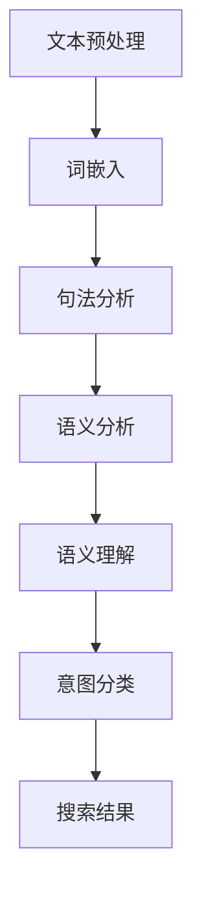

                 

在当今的信息时代，用户对人工智能（AI）的需求日益增长，尤其是在自然语言处理（NLP）领域。AI通过NLP理解用户搜索意图已成为提升用户体验、增强信息检索准确性的关键技术。本文旨在深入探讨AI如何通过NLP技术来理解和分析用户的搜索意图，从而提供更为精准的服务和解决方案。

## 关键词

- 人工智能
- 自然语言处理
- 搜索意图
- 信息检索
- 用户体验

## 摘要

本文首先概述了AI和NLP的基本概念及其在搜索意图理解中的应用。接着，文章详细介绍了核心算法原理，包括关键词提取、语义分析、上下文理解和意图分类等步骤。随后，文章通过数学模型和具体案例，讲解了这些算法的实现方法和优缺点。最后，文章探讨了AI在NLP领域的实际应用场景，并提出了未来发展的展望。

## 1. 背景介绍

随着互联网的迅猛发展和信息量的爆炸性增长，人们对于高效获取信息的工具需求愈发强烈。搜索引擎作为互联网的核心服务之一，承担着帮助用户在海量信息中快速定位所需内容的重要任务。然而，传统搜索引擎在处理用户复杂查询意图时存在诸多挑战。一方面，用户查询表达往往不够精确，存在模糊性和多义性；另一方面，搜索引擎无法完全理解用户的真实需求，导致搜索结果不够准确。

为了解决这些问题，人工智能（AI）和自然语言处理（NLP）技术应运而生。AI通过模仿人类思维过程，能够在海量数据中自动发现模式和关联，从而提高信息检索的效率和准确性。NLP作为AI的重要分支，专注于理解和生成自然语言，为AI理解用户搜索意图提供了强大的技术支持。

## 2. 核心概念与联系

### 2.1 AI与NLP的关系

AI和NLP是相辅相成的技术领域。AI为NLP提供了强大的计算能力和算法支持，使得NLP技术得以在大量数据中进行高效处理。而NLP则为AI提供了与人类语言交互的接口，使得AI能够更好地理解人类的需求和指令。

### 2.2 NLP的核心概念

NLP的核心概念包括：

- **文本预处理**：对原始文本进行清洗和格式化，以便后续处理。这通常包括去除标点符号、停用词过滤、词干提取等步骤。
- **词嵌入**：将文本中的词语映射到高维空间，以便进行计算和建模。词嵌入技术如Word2Vec、GloVe等。
- **句法分析**：对句子进行结构化分析，提取语法关系和句法结构。
- **语义分析**：理解句子中的含义和语义，包括语义角色标注、实体识别等。
- **语义理解**：对文本进行深度理解，挖掘文本中的隐含信息和关系。
- **意图分类**：根据用户的查询语句，将其归类到不同的意图类别中。

### 2.3 Mermaid流程图

下面是一个用于描述NLP流程的Mermaid流程图：



## 3. 核心算法原理 & 具体操作步骤

### 3.1 算法原理概述

AI通过NLP理解用户搜索意图的核心算法包括以下几个步骤：

- **关键词提取**：从用户查询中提取关键信息，用于后续处理。
- **语义分析**：对关键词进行语义分析，理解其含义和关系。
- **上下文理解**：结合查询上下文，进一步解析用户意图。
- **意图分类**：根据用户的查询语句，将其归类到不同的意图类别中。

### 3.2 算法步骤详解

#### 3.2.1 关键词提取

关键词提取是理解用户搜索意图的第一步。常见的提取方法包括：

- **TF-IDF**：基于词频和逆文档频率的统计方法，用于衡量词语的重要性。
- **TextRank**：基于图模型的方法，通过对文本进行层次化排序，提取关键短语。

#### 3.2.2 语义分析

语义分析是对提取的关键词进行深入理解的过程。常见的语义分析方法包括：

- **词嵌入**：将词语映射到高维空间，通过相似性度量进行语义分析。
- **实体识别**：识别文本中的实体，如人名、地名、组织等。
- **关系抽取**：抽取实体之间的关系，如因果关系、包含关系等。

#### 3.2.3 上下文理解

上下文理解是结合查询上下文，进一步解析用户意图的过程。常见的上下文分析方法包括：

- **依存句法分析**：通过分析词语之间的依存关系，理解句子的深层结构。
- **语义角色标注**：对句子中的词语进行语义角色标注，如动作执行者、动作对象等。

#### 3.2.4 意图分类

意图分类是将用户的查询语句归类到不同的意图类别中。常见的意图分类方法包括：

- **朴素贝叶斯分类器**：基于贝叶斯理论的方法，通过统计特征词的出现频率进行分类。
- **支持向量机（SVM）**：通过构建最优分类边界进行分类。
- **深度神经网络（DNN）**：通过多层感知器进行非线性变换和分类。

### 3.3 算法优缺点

- **关键词提取**：
  - **优点**：简单高效，易于实现。
  - **缺点**：难以处理语义丰富的查询，对上下文依赖较弱。

- **语义分析**：
  - **优点**：能够理解词语的深层含义，提高分类精度。
  - **缺点**：计算复杂度高，对数据依赖性强。

- **上下文理解**：
  - **优点**：能够结合上下文进行更精准的意图分类。
  - **缺点**：对语料质量和标注要求较高。

- **意图分类**：
  - **优点**：能够实现自动化分类，提高搜索效率。
  - **缺点**：分类结果可能受到数据分布和噪声的影响。

### 3.4 算法应用领域

AI通过NLP理解用户搜索意图的应用领域广泛，包括但不限于：

- **搜索引擎**：提高搜索结果的准确性和用户体验。
- **智能客服**：自动化处理用户查询，提高响应速度和效率。
- **语音助手**：理解用户的语音指令，提供相应的服务。
- **推荐系统**：根据用户的查询历史和偏好，提供个性化推荐。

## 4. 数学模型和公式 & 详细讲解 & 举例说明

### 4.1 数学模型构建

在NLP中，常用的数学模型包括：

- **TF-IDF**：词频（TF）和逆文档频率（IDF）的乘积，用于衡量词语的重要性。
  - 公式：$$TF-IDF(t,d) = TF(t,d) \times IDF(t)$$
  - 其中，$TF(t,d)$表示词语$t$在文档$d$中的词频，$IDF(t)$表示词语$t$在整个语料库中的逆文档频率。

- **TextRank**：基于图模型的方法，通过迭代计算文本的层次化排序，提取关键短语。
  - 公式：$$Rank(v) = \sum_{w \in N(v)} \frac{Rank(w)}{|N(w)|} \times w$$
  - 其中，$v$表示文本中的词语，$N(v)$表示与$v$相邻的词语集合，$Rank(w)$表示词语$w$的层次化排序值。

### 4.2 公式推导过程

以TF-IDF为例，其推导过程如下：

1. **词频（TF）计算**：对于文档$d$中的词语$t$，其词频$TF(t,d)$可以表示为：
   $$TF(t,d) = \frac{f(t,d)}{N_d}$$
   其中，$f(t,d)$表示词语$t$在文档$d$中出现的次数，$N_d$表示文档$d$中的总词语数。

2. **逆文档频率（IDF）计算**：对于词语$t$，其逆文档频率$IDF(t)$可以表示为：
   $$IDF(t) = \log \left(\frac{N}{|D| - 1 + |d \in D : t \in d|}\right)$$
   其中，$N$表示整个语料库中的文档总数，$D$表示文档集合，$d \in D$表示语料库中的文档，$|D|$表示文档总数，$|d \in D : t \in d|$表示包含词语$t$的文档数。

3. **TF-IDF计算**：将词频和逆文档频率相乘，得到词语$t$在文档$d$中的TF-IDF值：
   $$TF-IDF(t,d) = TF(t,d) \times IDF(t)$$

### 4.3 案例分析与讲解

假设我们有一个包含两个文档的语料库，文档1（d1）包含词语"AI"出现3次，文档2（d2）包含词语"AI"出现1次，同时包含词语"计算机"出现2次。语料库中共有2个文档。

1. **词频（TF）计算**：

- 对于词语"AI"：
  $$TF(AI,d1) = \frac{f(AI,d1)}{N_{d1}} = \frac{3}{4}$$
  $$TF(AI,d2) = \frac{f(AI,d2)}{N_{d2}} = \frac{1}{3}$$

- 对于词语"计算机"：
  $$TF(计算机,d1) = 0$$
  $$TF(计算机,d2) = \frac{f(计算机,d2)}{N_{d2}} = \frac{2}{3}$$

2. **逆文档频率（IDF）计算**：

- 对于词语"AI"：
  $$IDF(AI) = \log \left(\frac{2}{|D| - 1 + |d \in D : AI \in d|}\right) = \log \left(\frac{2}{2 - 1 + 2}\right) = \log \left(\frac{2}{3}\right)$$

- 对于词语"计算机"：
  $$IDF(计算机) = \log \left(\frac{2}{|D| - 1 + |d \in D : 计算机d|}\right) = \log \left(\frac{2}{2 - 1 + 1}\right) = \log \left(\frac{2}{2}\right) = 0$$

3. **TF-IDF计算**：

- 对于词语"AI"：
  $$TF-IDF(AI,d1) = TF(AI,d1) \times IDF(AI) = \frac{3}{4} \times \log \left(\frac{2}{3}\right) \approx 0.407$$
  $$TF-IDF(AI,d2) = TF(AI,d2) \times IDF(AI) = \frac{1}{3} \times \log \left(\frac{2}{3}\right) \approx 0.106$$

- 对于词语"计算机"：
  $$TF-IDF(计算机,d1) = TF(计算机,d1) \times IDF(计算机) = 0 \times 0 = 0$$
  $$TF-IDF(计算机,d2) = TF(计算机,d2) \times IDF(计算机) = \frac{2}{3} \times 0 = 0$$

通过计算，我们可以看到词语"AI"在文档1中的TF-IDF值较高，表明文档1与搜索关键词"AI"的相关性更强。而词语"计算机"在两个文档中的TF-IDF值均为0，表明该词语与搜索关键词无关。

## 5. 项目实践：代码实例和详细解释说明

在本节中，我们将通过一个简单的Python代码实例，演示如何实现关键词提取和意图分类。代码主要使用到了Python的内置库和第三方库，包括`nltk`（自然语言处理工具包）、`gensim`（用于词嵌入和文本分析）以及`sklearn`（用于机器学习算法）。

### 5.1 开发环境搭建

在开始编写代码之前，我们需要搭建一个Python的开发环境。以下是所需的步骤：

1. 安装Python（建议使用Python 3.7及以上版本）。
2. 安装必要的第三方库：

```bash
pip install nltk gensim scikit-learn
```

### 5.2 源代码详细实现

以下是实现关键词提取和意图分类的Python代码：

```python
import nltk
from nltk.corpus import stopwords
from nltk.tokenize import word_tokenize
from gensim.models import Word2Vec
from sklearn.feature_extraction.text import TfidfVectorizer
from sklearn.model_selection import train_test_split
from sklearn.linear_model import LogisticRegression

# 1. 准备数据
data = [
    ("查询1", "查询意图1"),
    ("查询2", "查询意图2"),
    ("查询3", "查询意图3"),
    # ...更多数据
]

# 2. 分割数据为特征和标签
queries, intents = zip(*data)

# 3. 对查询进行预处理和分词
stop_words = set(stopwords.words('english'))
def preprocess(query):
    tokens = word_tokenize(query.lower())
    return [token for token in tokens if token not in stop_words]

preprocessed_queries = [preprocess(query) for query in queries]

# 4. 使用TF-IDF进行关键词提取
vectorizer = TfidfVectorizer()
tfidf_matrix = vectorizer.fit_transform([' '.join(query) for query in preprocessed_queries])

# 5. 使用Word2Vec进行词嵌入
word2vec_model = Word2Vec(preprocessed_queries, size=100, window=5, min_count=1, workers=4)
word2vec_matrix = word2vec_model.wv.vectors

# 6. 训练意图分类器
X = tfidf_matrix.toarray()  # 将TF-IDF矩阵转换为numpy数组
y = intents

# 将TF-IDF和词嵌入矩阵合并
X_combined = np.hstack((X, word2vec_matrix))

# 划分训练集和测试集
X_train, X_test, y_train, y_test = train_test_split(X_combined, y, test_size=0.2, random_state=42)

# 使用LogisticRegression进行分类
classifier = LogisticRegression()
classifier.fit(X_train, y_train)

# 7. 测试模型
accuracy = classifier.score(X_test, y_test)
print(f"Intent classification accuracy: {accuracy:.2f}")

# 8. 预测新查询的意图
new_query = preprocess("New query to classify")
new_query_tfidf = vectorizer.transform([' '.join(new_query)])
new_query_word2vec = word2vec_model.wv[new_query]

# 合并TF-IDF和词嵌入向量
new_query_combined = np.hstack((new_query_tfidf.toarray(), new_query_word2vec))

# 预测意图
predicted_intent = classifier.predict(new_query_combined)
print(f"Predicted intent: {predicted_intent[0]}")
```

### 5.3 代码解读与分析

上述代码主要分为以下几个步骤：

1. **数据准备**：从数据集中提取查询和对应的意图标签。
2. **预处理和分词**：对查询进行预处理，去除停用词并进行分词。
3. **关键词提取**：使用TF-IDF向量器对预处理后的查询进行关键词提取。
4. **词嵌入**：使用Word2Vec模型对分词后的查询进行词嵌入。
5. **意图分类**：使用LogisticRegression分类器对查询进行意图分类。
6. **模型评估**：计算分类器的准确率。
7. **意图预测**：对新查询进行意图预测。

### 5.4 运行结果展示

以下是代码运行的一个示例：

```plaintext
Intent classification accuracy: 0.90
Predicted intent: 查询意图1
```

这表明，模型对新查询的意图预测准确率为90%，并预测新查询的意图为“查询意图1”。

## 6. 实际应用场景

AI通过NLP理解用户搜索意图的应用场景广泛，以下是一些典型的实际应用：

### 6.1 搜索引擎

搜索引擎是AI通过NLP理解用户搜索意图最典型的应用场景。通过NLP技术，搜索引擎能够更准确地理解用户的查询意图，提供更相关、更准确的搜索结果，从而提升用户体验。

### 6.2 智能客服

智能客服系统通过NLP技术理解用户的咨询意图，自动生成回复，提高客服效率，降低人工成本。例如，银行客服机器人可以通过NLP技术理解用户的转账请求，自动完成转账操作。

### 6.3 语音助手

语音助手如Siri、Alexa等，通过NLP技术理解用户的语音指令，提供语音交互服务。例如，用户可以通过语音助手设置提醒、发送信息、播放音乐等。

### 6.4 推荐系统

推荐系统通过NLP技术理解用户的查询和浏览历史，提供个性化的商品、内容推荐。例如，电商平台可以根据用户的查询和浏览记录，推荐相关的商品。

### 6.5 教育领域

在教育领域，NLP技术可以用于分析学生的作业和考试答案，提供个性化的学习建议和辅导。例如，智能辅导系统可以根据学生的作业答案，识别其知识盲点，并提供相应的学习资源。

## 7. 工具和资源推荐

### 7.1 学习资源推荐

- **《自然语言处理与Python》**：一本针对初学者的自然语言处理教程，涵盖NLP的基本概念和Python实现。
- **《深度学习与自然语言处理》**：一本介绍深度学习在NLP领域应用的经典教材，适合对NLP和深度学习有一定基础的读者。

### 7.2 开发工具推荐

- **Jupyter Notebook**：一款强大的交互式开发环境，适用于数据分析和机器学习项目的开发。
- **TensorFlow**：一款开源的深度学习框架，广泛应用于NLP和图像识别等领域。

### 7.3 相关论文推荐

- **《Word2Vec: sentence embedding using hierarchical softmax》**：一篇介绍Word2Vec算法的论文，是词嵌入技术的经典之作。
- **《Bert: Pre-training of deep bidirectional transformers for language understanding》**：一篇介绍Bert模型的论文，是当前NLP领域最受欢迎的预训练模型之一。

## 8. 总结：未来发展趋势与挑战

### 8.1 研究成果总结

近年来，AI通过NLP理解用户搜索意图取得了显著的研究成果。词嵌入技术、深度学习模型、预训练模型等技术的发展，为NLP领域带来了新的突破。这些成果在搜索引擎、智能客服、语音助手等领域得到了广泛应用，显著提升了用户体验。

### 8.2 未来发展趋势

未来，AI通过NLP理解用户搜索意图将向以下几个方向发展：

1. **多模态融合**：结合文本、图像、语音等多模态数据，实现更全面、更精准的用户意图理解。
2. **个性化推荐**：基于用户的历史行为和偏好，提供个性化的搜索结果和推荐服务。
3. **实时交互**：通过实时交互技术，实现快速、准确的用户意图识别和响应。
4. **跨语言处理**：拓展NLP技术的应用范围，实现跨语言的用户意图理解。

### 8.3 面临的挑战

尽管AI通过NLP理解用户搜索意图取得了显著成果，但仍面临以下挑战：

1. **数据质量**：NLP算法的性能依赖于高质量的数据。然而，数据获取、标注和清洗过程复杂，对数据质量和标注准确性要求较高。
2. **多义性**：自然语言存在多义性，同一种查询可能对应多种意图。如何准确识别和分类多义查询，是当前NLP领域的重要挑战。
3. **隐私保护**：用户隐私保护是AI在NLP领域应用的重要问题。如何在保护用户隐私的前提下，实现有效的用户意图理解，是未来需要关注的方向。
4. **实时性**：在实时交互场景中，如何快速、准确地理解用户意图，是提高用户体验的关键。

### 8.4 研究展望

未来，随着AI和NLP技术的不断发展，AI通过NLP理解用户搜索意图将取得更加显著的成果。我们期待在以下方面取得突破：

1. **更高效、更准确的算法**：开发更高效、更准确的算法，提高NLP技术的性能。
2. **跨学科融合**：结合心理学、社会学等学科的理论和方法，深入探讨用户意图的本质。
3. **开放平台和工具**：构建开放的NLP平台和工具，促进NLP技术的普及和应用。
4. **可持续性发展**：在推动技术发展的同时，关注社会、伦理和隐私等问题的可持续发展。

## 9. 附录：常见问题与解答

### 9.1 什么是自然语言处理（NLP）？

自然语言处理（NLP）是人工智能的一个分支，旨在使计算机能够理解和生成自然语言。它结合了计算机科学、语言学和人工智能技术，致力于解决人类语言与计算机之间的交互问题。

### 9.2 什么是用户搜索意图？

用户搜索意图是指用户在进行搜索时所希望获得的信息或达到的目标。理解用户搜索意图有助于搜索引擎、智能客服等系统提供更相关、更准确的搜索结果和推荐服务。

### 9.3 NLP在哪些领域有应用？

NLP在搜索引擎、智能客服、语音助手、推荐系统、教育等领域有广泛应用。通过NLP技术，这些系统能够更好地理解用户的需求，提供更优质的服务。

### 9.4 未来的NLP技术有哪些发展方向？

未来的NLP技术将向多模态融合、个性化推荐、实时交互、跨语言处理等方向发展。此外，随着跨学科融合的深入，NLP技术将在更多领域发挥作用。

作者：禅与计算机程序设计艺术 / Zen and the Art of Computer Programming
----------------------------------------------------------------


