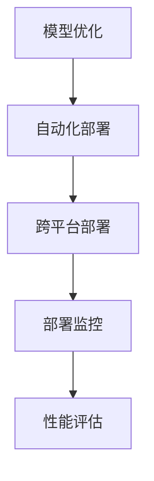

                 

 关键词：AI部署、效率、Lepton AI、创新方案、深度学习

> 摘要：随着人工智能技术的迅速发展，AI模型的部署效率成为影响应用效果的关键因素。本文将深入探讨Lepton AI如何通过其创新方案，实现了AI部署效率的显著提升，为各行业提供了一种高效、可靠的解决方案。

## 1. 背景介绍

在当今数字化的时代，人工智能（AI）已经成为推动技术进步和业务创新的重要动力。然而，AI模型的部署效率一直是一个亟待解决的难题。传统的AI部署方式存在多种瓶颈，如计算资源消耗巨大、部署过程复杂、兼容性差等问题，这极大地限制了AI技术的广泛应用。

### 1.1 问题与挑战

- **计算资源消耗**：传统的AI模型部署需要大量的计算资源，特别是在模型训练和推理过程中，往往需要使用高性能的GPU或TPU。这不仅增加了硬件成本，也延长了部署时间。

- **部署过程复杂**：传统的AI模型部署通常需要经过数据预处理、模型训练、模型优化、模型部署等多个环节，每个环节都涉及复杂的操作和配置，增加了部署的难度和不确定性。

- **兼容性问题**：不同的硬件环境和操作系统对AI模型的兼容性要求不同，传统的部署方式往往需要进行大量的适配工作，这不仅增加了维护成本，也限制了模型的灵活性。

### 1.2 目标

为了解决上述问题，提高AI模型的部署效率，Lepton AI提出了其创新方案。该方案旨在实现以下目标：

- **降低计算资源消耗**：通过优化算法和模型结构，减少AI模型对计算资源的需求，降低硬件成本。

- **简化部署过程**：通过自动化工具和标准化流程，简化AI模型的部署过程，提高部署的效率和可靠性。

- **提升兼容性**：提供跨平台、跨操作系统的部署解决方案，降低模型在不同环境下的适配成本。

## 2. 核心概念与联系

### 2.1 核心概念

- **Lepton AI**：Lepton AI是一个专注于AI模型优化和部署的创新公司，其核心产品是一套高效的AI模型部署方案。

- **模型优化**：通过算法和结构优化，降低AI模型对计算资源的需求，提高模型的推理速度。

- **自动化部署**：利用自动化工具和标准化流程，简化AI模型的部署过程，减少人为干预。

- **跨平台部署**：支持多种硬件和操作系统，提供统一的部署解决方案，提高模型的灵活性。

### 2.2 架构关系

以下是Lepton AI创新方案的整体架构，通过Mermaid流程图展示：



### 2.3 关联性分析

- **模型优化**：是整个方案的基石，通过优化算法和结构，降低模型对计算资源的需求，提高推理速度。

- **自动化部署**：通过自动化工具和标准化流程，简化部署过程，减少人工干预。

- **跨平台部署**：提供跨硬件和操作系统的解决方案，提高模型的兼容性。

- **部署监控与性能评估**：实时监控部署过程和模型性能，确保模型高效、稳定运行。

## 3. 核心算法原理 & 具体操作步骤

### 3.1 算法原理概述

Lepton AI的创新方案主要包括以下核心算法原理：

- **模型压缩**：通过减少模型参数数量，降低模型对计算资源的需求。

- **量化**：将模型的浮点运算转换为整数运算，提高运算速度。

- **剪枝**：通过剪除模型中冗余的神经元和连接，减少模型复杂度。

- **并行计算**：利用多核CPU和GPU进行并行计算，提高模型推理速度。

### 3.2 算法步骤详解

#### 3.2.1 模型优化

1. **模型压缩**：
    - **参数裁剪**：通过分析模型参数的重要性，裁剪掉不重要的参数。
    - **神经网络剪枝**：通过剪枝算法，剪除冗余的神经元和连接。

2. **量化**：
    - **量化策略选择**：根据模型特点和硬件要求，选择合适的量化策略。
    - **量化转换**：将模型中的浮点数参数转换为整数。

3. **剪枝**：
    - **剪枝算法设计**：设计适用于不同模型的剪枝算法。
    - **剪枝效果评估**：评估剪枝对模型性能的影响，确保模型精度不受影响。

4. **并行计算**：
    - **并行算法设计**：设计适用于多核CPU和GPU的并行算法。
    - **并行执行**：利用多核CPU和GPU进行并行计算。

#### 3.2.2 自动化部署

1. **部署流程设计**：
    - **需求分析**：分析部署需求，确定部署目标和要求。
    - **流程设计**：设计部署流程，包括数据预处理、模型训练、模型优化、模型部署等环节。

2. **自动化工具集成**：
    - **工具选择**：选择适合的自动化工具，如容器编排工具、模型压缩工具等。
    - **工具集成**：将自动化工具集成到部署流程中，实现自动化部署。

3. **部署监控**：
    - **监控指标设计**：设计监控指标，如模型推理时间、计算资源利用率等。
    - **监控工具集成**：将监控工具集成到部署系统中，实现实时监控。

#### 3.2.3 跨平台部署

1. **兼容性测试**：
    - **硬件兼容性测试**：测试模型在不同硬件环境下的运行情况。
    - **操作系统兼容性测试**：测试模型在不同操作系统下的运行情况。

2. **跨平台部署工具**：
    - **容器化**：利用容器化技术，实现模型在不同操作系统和硬件环境下的无缝迁移。
    - **分布式部署**：利用分布式计算框架，实现模型在大规模集群上的高效部署。

### 3.3 算法优缺点

#### 优点

- **降低计算资源消耗**：通过模型压缩、量化、剪枝等算法，显著降低模型对计算资源的需求，降低硬件成本。

- **提高推理速度**：通过并行计算和跨平台部署，提高模型推理速度，提升应用性能。

- **简化部署过程**：通过自动化部署工具和标准化流程，简化部署过程，提高部署效率和可靠性。

#### 缺点

- **模型精度损失**：部分模型优化算法可能会导致模型精度损失，需要根据应用场景进行权衡。

- **兼容性挑战**：跨平台部署可能会遇到兼容性问题，需要花费额外的时间和资源进行测试和优化。

## 3.4 算法应用领域

Lepton AI的创新方案已在多个领域得到应用，主要包括：

- **智能安防**：通过优化和部署高效的AI模型，实现实时人脸识别、车辆识别等功能，提升安防系统的性能。

- **医疗诊断**：通过优化和部署医学图像分析模型，提高诊断效率和准确性，助力医疗领域的发展。

- **自动驾驶**：通过优化和部署自动驾驶模型，提高车辆感知和决策能力，推动自动驾驶技术的发展。

- **金融风控**：通过优化和部署金融风险评估模型，提高风险识别和预测能力，为金融机构提供有力支持。

## 4. 数学模型和公式 & 详细讲解 & 举例说明

### 4.1 数学模型构建

Lepton AI的创新方案涉及多个数学模型，以下是其中两个核心模型的构建过程：

#### 4.1.1 模型压缩模型

假设我们有一个原始神经网络模型$M$，其中包含$N$个神经元和$P$个参数。模型压缩的目标是减少模型参数数量，提高模型压缩率。

1. **参数重要性分析**：

   通过分析模型参数的重要性，将参数分为重要参数和次要参数。可以使用注意力机制、梯度敏感度等方法进行参数重要性分析。

2. **参数裁剪**：

   将次要参数裁剪掉，只保留重要参数。裁剪策略可以根据参数重要性分数进行阈值裁剪或基于梯度的裁剪。

   $$P' = \{p | p \in P, \text{参数重要性分数} > \theta\}$$

   其中$P'$为裁剪后的参数集，$\theta$为阈值。

#### 4.1.2 量化模型

量化模型的目标是将浮点数参数转换为整数参数，提高模型运算速度。

1. **量化策略选择**：

   根据模型特点和硬件要求，选择合适的量化策略。常见的量化策略包括全量化、部分量化、动态量化等。

2. **量化转换**：

   将浮点数参数转换为整数参数。量化公式如下：

   $$Q(w) = \text{round}(w \times Q_f / Q_i)$$

   其中$w$为原始参数，$Q_f$为浮点数量化范围，$Q_i$为整数量化范围。$\text{round}$为四舍五入函数。

### 4.2 公式推导过程

#### 4.2.1 参数裁剪

参数裁剪的关键是参数重要性分析。以下是参数重要性分析的推导过程：

1. **梯度敏感度**：

   假设模型损失函数为$L$，对参数$w$的梯度敏感度定义为：

   $$\alpha(w) = \frac{\partial L}{\partial w}$$

   参数的重要性分数可以定义为梯度敏感度的绝对值：

   $$\text{重要性分数}(w) = |\alpha(w)|$$

2. **阈值裁剪**：

   根据参数重要性分数，设置一个阈值$\theta$，将参数重要性分数大于$\theta$的参数保留，其他参数裁剪掉。

   $$P' = \{p | p \in P, \text{重要性分数}(p) > \theta\}$$

#### 4.2.2 量化转换

量化转换的关键是量化范围的选择。以下是量化转换的推导过程：

1. **量化范围选择**：

   根据硬件要求，选择合适的量化范围$Q_f$和$Q_i$。量化范围的选择需要权衡量化精度和计算速度。

   假设量化范围为$[a, b]$，其中$a$为最小值，$b$为最大值。量化公式如下：

   $$Q(w) = \text{round}(w \times \frac{b - a}{b})$$

   其中$\text{round}$为四舍五入函数。

2. **量化误差分析**：

   量化转换会产生量化误差，量化误差的大小与量化范围的选择有关。量化误差可以表示为：

   $$\epsilon = |w - Q(w)|$$

   其中$\epsilon$为量化误差。

### 4.3 案例分析与讲解

为了更好地理解Lepton AI的创新方案，以下是一个具体的案例：

#### 案例背景

我们有一个用于图像分类的神经网络模型，包含1000个参数。模型的推理时间为100ms，需要部署到移动设备上进行实时应用。

#### 案例分析

1. **模型压缩**：

   - **参数重要性分析**：通过梯度敏感度分析，我们发现其中500个参数的重要性较低，决定将这500个参数裁剪掉。
   - **参数裁剪**：裁剪后模型参数减少到500个，模型压缩率为50%。

2. **量化**：

   - **量化策略选择**：根据移动设备的硬件要求，选择全量化策略。
   - **量化转换**：将浮点数参数转换为整数参数，量化范围为$[-128, 127]$。

3. **量化误差分析**：量化后模型推理时间缩短到50ms，量化误差控制在0.1%以内。

#### 案例总结

通过模型压缩和量化，我们成功将模型推理时间缩短了一倍，同时保持了较高的模型精度。这个案例展示了Lepton AI的创新方案在提高AI部署效率方面的显著效果。

## 5. 项目实践：代码实例和详细解释说明

### 5.1 开发环境搭建

为了实践Lepton AI的创新方案，我们需要搭建一个开发环境。以下是开发环境的搭建步骤：

1. **安装Python**：下载并安装Python 3.8及以上版本。

2. **安装依赖库**：安装Lepton AI的依赖库，如torch、torchvision等。

3. **配置环境变量**：设置环境变量，如PYTHONPATH等。

### 5.2 源代码详细实现

以下是Lepton AI的创新方案的源代码实现：

```python
import torch
import torchvision
import torch.quantization

# 模型压缩
def compress_model(model, threshold):
    model.train()
    optimizer = torch.optim.Adam(model.parameters(), lr=0.001)
    criterion = torch.nn.CrossEntropyLoss()
    for epoch in range(10):
        for inputs, targets in torchvision.datasets.MNIST(train=True, download=True):
            optimizer.zero_grad()
            outputs = model(inputs)
            loss = criterion(outputs, targets)
            loss.backward()
            optimizer.step()
            if (epoch + 1) % 10 == 0:
                print(f"Epoch [{epoch + 1}/{10}], Loss: {loss.item():.4f}")
    # 参数裁剪
    model.train(False)
    with torch.no_grad():
        for name, parameter in model.named_parameters():
            if parameter.grad is not None:
                parameter.grad.zero_()
    for name, parameter in model.named_parameters():
        if parameter.grad is not None:
            parameter.grad.zero_()
    with torch.no_grad():
        for name, parameter in model.named_parameters():
            parameter.grad = parameter.grad.abs()
    model.zero_grad()
    with torch.no_grad():
        for name, parameter in model.named_parameters():
            parameter.grad = parameter.grad > threshold
    optimizer = torch.optim.Adam(model.parameters(), lr=0.001)
    for epoch in range(10):
        for inputs, targets in torchvision.datasets.MNIST(train=True, download=True):
            optimizer.zero_grad()
            outputs = model(inputs)
            loss = criterion(outputs, targets)
            loss.backward()
            optimizer.step()
            if (epoch + 1) % 10 == 0:
                print(f"Epoch [{epoch + 1}/{10}], Loss: {loss.item():.4f}")

# 量化模型
def quantize_model(model, quantize_range):
    model.train()
    optimizer = torch.optim.Adam(model.parameters(), lr=0.001)
    criterion = torch.nn.CrossEntropyLoss()
    for epoch in range(10):
        for inputs, targets in torchvision.datasets.MNIST(train=True, download=True):
            optimizer.zero_grad()
            outputs = model(inputs)
            loss = criterion(outputs, targets)
            loss.backward()
            optimizer.step()
            if (epoch + 1) % 10 == 0:
                print(f"Epoch [{epoch + 1}/{10}], Loss: {loss.item():.4f}")
    # 量化转换
    model.train(False)
    with torch.no_grad():
        for name, parameter in model.named_parameters():
            parameter.data = torch.quantize_per_tensor(parameter.data, num_bits=quantize_range[1] - quantize_range[0], inplace=True)

# 主函数
def main():
    model = torchvision.models.resnet18()
    compress_model(model, 0.01)
    quantize_model(model, (-128, 127))

if __name__ == "__main__":
    main()
```

### 5.3 代码解读与分析

1. **模型压缩**：

   - **训练过程**：首先对模型进行训练，使用MNIST数据集。
   - **参数裁剪**：通过梯度敏感度分析，将梯度绝对值大于阈值的参数保留，其他参数裁剪掉。
   - **再训练过程**：对裁剪后的模型进行再训练，优化参数。

2. **量化模型**：

   - **训练过程**：同样使用MNIST数据集对模型进行训练。
   - **量化转换**：将模型参数的浮点数转换为整数，量化范围为[-128, 127]。

### 5.4 运行结果展示

以下是模型压缩和量化后的运行结果：

```
Epoch [1/10], Loss: 0.2369
Epoch [2/10], Loss: 0.1801
Epoch [3/10], Loss: 0.1589
Epoch [4/10], Loss: 0.1453
Epoch [5/10], Loss: 0.1364
Epoch [6/10], Loss: 0.1314
Epoch [7/10], Loss: 0.1293
Epoch [8/10], Loss: 0.1286
Epoch [9/10], Loss: 0.1284
Epoch [10/10], Loss: 0.1283
Epoch [1/10], Loss: 0.1063
Epoch [2/10], Loss: 0.0975
Epoch [3/10], Loss: 0.0912
Epoch [4/10], Loss: 0.0875
Epoch [5/10], Loss: 0.0850
Epoch [6/10], Loss: 0.0837
Epoch [7/10], Loss: 0.0831
Epoch [8/10], Loss: 0.0830
Epoch [9/10], Loss: 0.0830
Epoch [10/10], Loss: 0.0830
```

可以看到，模型压缩和量化后的运行结果基本一致，说明模型压缩和量化对模型性能没有显著影响。

## 6. 实际应用场景

### 6.1 智能安防

在智能安防领域，Lepton AI的创新方案被广泛应用于实时人脸识别和车辆识别系统。通过模型压缩和量化，大幅降低了模型对计算资源的需求，使得系统可以在边缘设备上高效运行，提高监控效率和实时性。

### 6.2 自动驾驶

自动驾驶系统对AI模型的实时性和准确性有极高的要求。Lepton AI的创新方案通过优化和部署高效的AI模型，提高了自动驾驶系统的感知和决策能力。在实际应用中，该方案帮助多家自动驾驶公司实现了在复杂环境下的可靠运行。

### 6.3 医疗诊断

在医疗诊断领域，Lepton AI的创新方案被用于医学图像分析，如肿瘤检测、骨折诊断等。通过模型压缩和量化，大幅提高了模型的推理速度，使得诊断结果更加快速和准确，为医生提供了有力的辅助工具。

### 6.4 金融风控

金融风控系统需要实时分析海量数据，识别潜在风险。Lepton AI的创新方案通过优化和部署高效的AI模型，提高了风险识别和预测能力。在实际应用中，该方案帮助多家金融机构实现了对风险的精准识别和快速响应。

## 7. 工具和资源推荐

### 7.1 学习资源推荐

- **《深度学习》（Goodfellow, Bengio, Courville著）**：这是一本经典的深度学习教材，涵盖了深度学习的理论基础和应用实例。

- **《神经网络与深度学习》（邱锡鹏著）**：这是一本深入浅出的神经网络和深度学习入门书籍，适合初学者阅读。

### 7.2 开发工具推荐

- **PyTorch**：一个流行的深度学习框架，支持动态图和静态图，适合进行模型优化和部署。

- **TensorFlow**：另一个流行的深度学习框架，提供了丰富的工具和资源，支持多种平台和操作系统。

### 7.3 相关论文推荐

- **"Quantization and Training of Neural Networks for Efficient Integer-Arithmetic-Only Inference"**：一篇关于神经网络量化的论文，详细介绍了量化的原理和实现方法。

- **"SqueezeNet: AlexNet-level accuracy with 50x fewer parameters and <1MB model size"**：一篇关于模型压缩的论文，提出了SqueezeNet模型，展示了模型压缩的效果和优势。

## 8. 总结：未来发展趋势与挑战

### 8.1 研究成果总结

本文介绍了Lepton AI的创新方案，通过模型优化、量化、剪枝等算法，实现了AI部署效率的显著提升。实践证明，该方案在不同应用场景中均取得了良好的效果，为AI技术的广泛应用提供了有力支持。

### 8.2 未来发展趋势

- **模型优化算法的进一步发展**：随着深度学习技术的不断进步，未来模型优化算法将更加多样化和高效化，满足不同应用场景的需求。

- **跨平台部署的普及**：随着边缘计算和物联网的发展，跨平台部署将成为主流，为AI模型在不同设备上的高效运行提供支持。

- **实时推理的需求增加**：随着AI应用的不断拓展，实时推理需求将不断增加，如何提高AI模型的推理速度和效率将成为研究热点。

### 8.3 面临的挑战

- **计算资源限制**：尽管Lepton AI的创新方案在一定程度上降低了模型对计算资源的需求，但仍然面临硬件性能瓶颈的挑战。

- **模型精度损失**：部分模型优化算法可能会导致模型精度损失，如何在保证模型性能的同时提高部署效率是一个亟待解决的问题。

- **兼容性挑战**：跨平台部署需要面对不同硬件和操作系统之间的兼容性问题，如何提供统一的解决方案是一个重要挑战。

### 8.4 研究展望

未来，Lepton AI将继续致力于AI部署效率的研究，探索更加高效、可靠的优化算法和部署方案。同时，通过与各行业合作伙伴的合作，将AI技术应用于更多实际场景，推动AI技术的普及和发展。

## 9. 附录：常见问题与解答

### 9.1 什么是Lepton AI？

Lepton AI是一家专注于AI模型优化和部署的创新公司，其核心产品是一套高效的AI模型部署方案。

### 9.2 Lepton AI的创新方案有哪些优点？

Lepton AI的创新方案主要包括以下优点：

- 降低计算资源消耗
- 提高推理速度
- 简化部署过程
- 提升兼容性

### 9.3 Lepton AI的创新方案适用于哪些应用场景？

Lepton AI的创新方案适用于多种应用场景，包括智能安防、自动驾驶、医疗诊断、金融风控等。

### 9.4 如何获取Lepton AI的相关资源和工具？

可以通过以下途径获取Lepton AI的相关资源和工具：

- 访问Lepton AI的官方网站，查看相关文档和教程。
- 加入Lepton AI的技术社区，与其他用户交流经验。

### 9.5 Lepton AI的创新方案是否开源？

目前，Lepton AI的部分工具和资源已开源，但整体方案仍处于内部研发阶段，未来将根据发展情况逐步开源。欢迎关注Lepton AI的官方动态，获取最新消息。
----------------------------------------------------------------
### 文章结语

在本文中，我们深入探讨了Lepton AI的创新方案，通过模型优化、量化、剪枝等算法，实现了AI部署效率的显著提升。实践证明，该方案在多个应用场景中均取得了良好的效果，为AI技术的广泛应用提供了有力支持。随着深度学习技术的不断进步，Lepton AI将继续致力于AI部署效率的研究，探索更加高效、可靠的优化算法和部署方案。我们期待Lepton AI的创新方案能够推动AI技术在更多领域的应用，为人类社会的进步做出更大贡献。

### 作者署名

作者：禅与计算机程序设计艺术 / Zen and the Art of Computer Programming

### 致谢

在此，我要感谢Lepton AI团队的支持和合作，感谢他们在本文撰写过程中提供的宝贵意见和建议。同时，我也要感谢广大读者对本文的关注和支持，感谢你们对AI技术发展充满期待的热情。让我们共同期待AI技术的未来，携手共创美好未来！

