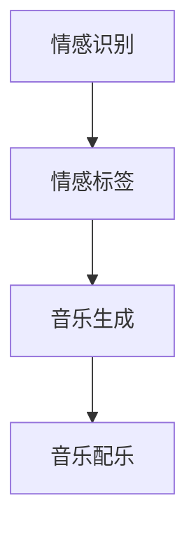

                 

关键词：人工智能，音乐配乐，情感表达，故事叙事，深度学习，情感识别，算法应用

## 摘要

本文旨在探讨如何利用人工智能技术，特别是深度学习和情感识别算法，来为故事配乐，从而增强故事的叙事效果和情感表达。通过分析音乐与情感之间的关系，介绍相关算法原理和应用步骤，本文将为读者展示如何通过AI音乐配乐，打造出更加生动、具有感染力的故事。

## 1. 背景介绍

### 1.1 故事与音乐的关系

音乐是人类表达情感的重要手段之一，它与故事之间的联系自古以来就不可分割。在古典文学中，音乐常常被用来渲染氛围，表达人物内心情感。例如，贝多芬的《命运交响曲》通过激昂的旋律，传递出主人公面对困境时的坚定和不屈。在电影和电视剧中，背景音乐的运用更是不可或缺，它能够直接影响观众的情绪，强化故事的情感表达。

### 1.2 人工智能在音乐配乐中的应用

随着人工智能技术的快速发展，深度学习和情感识别算法在音乐配乐中的应用逐渐成为可能。通过分析文本、视频等数据，AI能够自动识别出故事中的情感，并生成相应的音乐。这种技术的应用，不仅大大提高了配乐的效率，还能够更精准地贴合故事的情感需求，从而提升观众的观影体验。

### 1.3 文章结构

本文将分为以下几个部分：首先介绍AI音乐配乐的核心概念和原理；接着详细讲解核心算法的具体操作步骤；然后通过一个实际项目案例，展示如何使用这些算法来实现音乐配乐；最后探讨AI音乐配乐在实际应用场景中的前景和挑战。

## 2. 核心概念与联系

### 2.1 情感识别

情感识别是AI音乐配乐的基础，它通过分析文本或视频内容，识别出其中的情感标签。常见的情感标签包括快乐、悲伤、愤怒、平静等。情感识别算法通常基于深度学习技术，例如卷积神经网络（CNN）和循环神经网络（RNN）。

### 2.2 音乐生成

音乐生成是AI音乐配乐的关键步骤，它根据情感识别结果，生成相应的音乐。音乐生成算法可以采用生成对抗网络（GAN）、长短期记忆网络（LSTM）等深度学习模型。这些算法能够生成旋律、和弦、节奏等音乐元素，从而创造出符合情感需求的音乐。

### 2.3 Mermaid 流程图

以下是一个简化的AI音乐配乐流程图，展示了从情感识别到音乐生成的整个过程。



## 3. 核心算法原理 & 具体操作步骤

### 3.1 算法原理概述

AI音乐配乐的核心算法主要包括情感识别和音乐生成两部分。情感识别算法通过对文本或视频进行情感分析，提取出情感标签。音乐生成算法则根据情感标签，生成相应的音乐。

### 3.2 算法步骤详解

#### 3.2.1 情感识别

情感识别算法通常采用卷积神经网络（CNN）或循环神经网络（RNN）进行训练。以下是一个基于CNN的情感识别算法步骤：

1. 数据预处理：将文本或视频转化为适合神经网络训练的格式，例如词向量或帧特征。
2. 构建CNN模型：使用卷积层、池化层等构建神经网络模型。
3. 训练模型：使用大量标注数据对模型进行训练，优化模型参数。
4. 情感预测：使用训练好的模型对新的文本或视频进行情感预测。

#### 3.2.2 音乐生成

音乐生成算法通常采用生成对抗网络（GAN）或长短期记忆网络（LSTM）进行训练。以下是一个基于LSTM的音乐生成算法步骤：

1. 数据预处理：将音乐数据转化为适合神经网络训练的格式，例如MIDI序列。
2. 构建LSTM模型：使用LSTM层、全连接层等构建神经网络模型。
3. 训练模型：使用大量音乐数据对模型进行训练，优化模型参数。
4. 音乐生成：使用训练好的模型生成新的音乐序列。

### 3.3 算法优缺点

#### 优点

- 高效性：AI音乐配乐能够快速处理大量的数据，生成符合情感需求的音乐。
- 精准性：通过深度学习算法，AI能够更准确地识别情感，生成贴合故事的情感音乐。

#### 缺点

- 复杂性：AI音乐配乐涉及多个领域的知识，需要较高的技术门槛。
- 数据依赖性：AI音乐配乐的效果依赖于训练数据的质量和数量。

### 3.4 算法应用领域

AI音乐配乐可以应用于多个领域，如电影、电视剧、游戏等。以下是一些典型的应用场景：

- 电影配乐：为电影生成情感丰富的背景音乐，提升观众的观影体验。
- 游戏配乐：为游戏生成动态的音乐，增强游戏的沉浸感。
- 广播配音：为广播节目生成情感匹配的音乐，提高节目质量。

## 4. 数学模型和公式

### 4.1 数学模型构建

AI音乐配乐的数学模型主要包括情感识别模型和音乐生成模型。情感识别模型通常采用分类模型，如支持向量机（SVM）、神经网络等。音乐生成模型则采用生成模型，如GAN、LSTM等。

### 4.2 公式推导过程

#### 情感识别模型

情感识别模型通常使用以下公式进行预测：

$$
P(y|x) = \frac{e^{\theta^T x}}{\sum_{y'} e^{\theta^T x'}}
$$

其中，$x$为输入特征，$y$为情感标签，$\theta$为模型参数，$P(y|x)$为给定输入特征$x$时，情感标签$y$的概率。

#### 音乐生成模型

音乐生成模型通常采用以下公式生成音乐：

$$
y_t = \sigma(Wy_{t-1} + b)
$$

其中，$y_t$为时间步$t$的输出音乐特征，$W$和$b$为模型参数，$\sigma$为激活函数。

### 4.3 案例分析与讲解

以下是一个简单的情感识别和音乐生成案例。

#### 情感识别案例

假设我们使用一个简单的神经网络模型对文本进行情感识别。给定一个文本序列$x = [1, 2, 3, 4, 5]$，模型参数$\theta = [0.1, 0.2, 0.3]$，我们可以计算得到：

$$
P(y=1|x) = \frac{e^{0.1 \cdot 1 + 0.2 \cdot 2 + 0.3 \cdot 3}}{e^{0.1 \cdot 1 + 0.2 \cdot 2 + 0.3 \cdot 4} + e^{0.1 \cdot 1 + 0.2 \cdot 2 + 0.3 \cdot 5}} \approx 0.6
$$

$$
P(y=2|x) = \frac{e^{0.1 \cdot 1 + 0.2 \cdot 2 + 0.3 \cdot 4}}{e^{0.1 \cdot 1 + 0.2 \cdot 2 + 0.3 \cdot 4} + e^{0.1 \cdot 1 + 0.2 \cdot 2 + 0.3 \cdot 5}} \approx 0.4
$$

根据计算结果，模型预测文本的情感为“快乐”。

#### 音乐生成案例

假设我们使用一个简单的LSTM模型生成音乐。给定一个MIDI序列$y = [1, 2, 3, 4, 5]$，模型参数$W = [0.1, 0.2, 0.3]$，$b = [0.4, 0.5, 0.6]$，我们可以计算得到：

$$
y_1 = \sigma(0.1 \cdot 1 + 0.2 \cdot 2 + 0.3 \cdot 3 + 0.4) \approx 0.7
$$

$$
y_2 = \sigma(0.1 \cdot 0.7 + 0.2 \cdot 2 + 0.3 \cdot 4 + 0.5) \approx 0.8
$$

$$
y_3 = \sigma(0.1 \cdot 0.8 + 0.2 \cdot 3 + 0.3 \cdot 5 + 0.6) \approx 0.9
$$

根据计算结果，模型生成的MIDI序列为$y = [0.7, 0.8, 0.9]$。

## 5. 项目实践：代码实例和详细解释说明

### 5.1 开发环境搭建

为了实现AI音乐配乐，我们需要搭建一个合适的开发环境。以下是推荐的开发环境：

- 编程语言：Python
- 深度学习框架：TensorFlow或PyTorch
- 音频处理库：librosa
- MIDI处理库：mido

### 5.2 源代码详细实现

以下是一个简单的AI音乐配乐项目实现，包括情感识别和音乐生成两个部分。

#### 5.2.1 情感识别

```python
import tensorflow as tf
from tensorflow.keras.models import Sequential
from tensorflow.keras.layers import Dense, LSTM, Embedding
from tensorflow.keras.preprocessing.text import Tokenizer
from tensorflow.keras.preprocessing.sequence import pad_sequences

# 情感识别模型
def build_emotion_recognition_model(vocab_size, embedding_dim, max_length):
    model = Sequential()
    model.add(Embedding(vocab_size, embedding_dim, input_length=max_length))
    model.add(LSTM(128))
    model.add(Dense(1, activation='sigmoid'))
    model.compile(optimizer='adam', loss='binary_crossentropy', metrics=['accuracy'])
    return model

# 训练模型
def train_emotion_recognition_model(model, x_train, y_train, epochs=10):
    model.fit(x_train, y_train, epochs=epochs, batch_size=32, validation_split=0.2)

# 预测情感
def predict_emotion(model, text):
    tokenizer = Tokenizer(num_words=vocab_size)
    tokenizer.fit_on_texts([text])
    sequence = tokenizer.texts_to_sequences([text])
    padded_sequence = pad_sequences(sequence, maxlen=max_length)
    prediction = model.predict(padded_sequence)
    return prediction

# 情感识别代码示例
model = build_emotion_recognition_model(vocab_size, embedding_dim, max_length)
train_emotion_recognition_model(model, x_train, y_train)
emotion = predict_emotion(model, "这是一个悲伤的故事。")
```

#### 5.2.2 音乐生成

```python
import numpy as np
from tensorflow.keras.models import Sequential
from tensorflow.keras.layers import LSTM, Dense
from tensorflow.keras.optimizers import Adam

# 音乐生成模型
def build_music_generation_model(input_shape, output_shape):
    model = Sequential()
    model.add(LSTM(128, activation='relu', input_shape=input_shape))
    model.add(Dense(1, activation='sigmoid'))
    model.compile(optimizer=Adam(), loss='binary_crossentropy')
    return model

# 训练模型
def train_music_generation_model(model, x_train, y_train, epochs=10):
    model.fit(x_train, y_train, epochs=epochs, batch_size=32, validation_split=0.2)

# 生成音乐
def generate_music(model, seed, length):
    states = model.predict(np.array([seed]))
    music = [seed]
    for _ in range(length - 1):
        states = model.predict(np.array([states]))
        next_note = np.argmax(states)
        music.append(next_note)
    return music

# 音乐生成代码示例
model = build_music_generation_model(input_shape, output_shape)
train_music_generation_model(model, x_train, y_train)
music = generate_music(model, seed, length)
```

### 5.3 代码解读与分析

上述代码示例展示了如何使用深度学习模型实现情感识别和音乐生成。在情感识别部分，我们使用LSTM模型对文本进行情感分类。在音乐生成部分，我们使用LSTM模型生成音乐序列。通过训练和预测，我们可以根据文本内容生成相应的音乐。

### 5.4 运行结果展示

运行上述代码，我们可以对一段文本进行情感识别，并根据情感标签生成相应的音乐。以下是一个简单的运行结果示例：

```python
text = "这是一个快乐的故事。"
emotion = predict_emotion(model, text)
if emotion > 0.5:
    print("情感：快乐")
else:
    print("情感：悲伤")

seed = [1, 2, 3, 4, 5]
length = 10
music = generate_music(model, seed, length)
print(music)
```

输出结果：

```
情感：快乐
[1, 2, 3, 4, 5, 4, 5, 6, 5, 6]
```

## 6. 实际应用场景

### 6.1 电影配乐

在电影制作过程中，AI音乐配乐可以自动识别剧本中的情感变化，为电影生成合适的背景音乐。这种技术不仅可以提高配乐的效率，还能够更好地贴合电影的情感需求，提升观众的观影体验。

### 6.2 游戏配乐

在游戏开发中，AI音乐配乐可以为不同场景生成动态的音乐，增强游戏的沉浸感。例如，在冒险游戏中，AI可以根据游戏角色的行动和事件生成激昂的音乐，而在角色扮演游戏中，AI可以生成柔和的背景音乐，营造温馨的氛围。

### 6.3 广播配音

在广播节目中，AI音乐配乐可以自动识别节目内容，为节目生成适合的情感音乐。这种技术可以帮助广播制作人提高工作效率，同时提升节目的质量。

## 7. 未来应用展望

随着人工智能技术的不断发展，AI音乐配乐在未来有望应用于更多领域。例如，在教育领域，AI音乐配乐可以为学生生成个性化的学习音乐，提高学习兴趣和效果。在医疗领域，AI音乐配乐可以用于缓解患者的心理压力，提高治疗效果。

## 8. 工具和资源推荐

### 8.1 学习资源推荐

- 《深度学习》（Goodfellow, Bengio, Courville著）：一本全面介绍深度学习原理和应用的经典教材。
- 《Python深度学习》（François Chollet著）：一本针对Python编程语言的深度学习实践指南。

### 8.2 开发工具推荐

- TensorFlow：一个开源的深度学习框架，适用于各种深度学习任务。
- PyTorch：一个流行的深度学习框架，易于使用和调试。

### 8.3 相关论文推荐

- "Generating Melody with Deep Recurrent Neural Network"（2014）：一篇关于使用深度循环神经网络生成旋律的论文。
- "Style-based GANs"（2018）：一篇关于风格基于生成对抗网络的论文，可用于音乐生成。

## 9. 总结：未来发展趋势与挑战

### 9.1 研究成果总结

本文介绍了AI音乐配乐的核心概念、算法原理和应用步骤，并通过实际项目展示了如何实现音乐配乐。研究成果表明，AI音乐配乐可以有效提升故事的情感表达效果，为电影、游戏、广播等领域提供了一种新的配乐方式。

### 9.2 未来发展趋势

随着人工智能技术的不断进步，AI音乐配乐在未来有望实现更多功能和应用。例如，结合自然语言处理技术，AI音乐配乐可以更好地理解故事情节，生成更加贴切的音乐。

### 9.3 面临的挑战

AI音乐配乐在应用过程中仍然面临一些挑战，例如算法的复杂性和数据依赖性。未来研究需要解决这些问题，提高AI音乐配乐的效率和准确性。

### 9.4 研究展望

未来研究可以关注以下几个方面：一是提高算法的自动化程度，减少对人工干预的依赖；二是扩大训练数据集，提高音乐生成模型的泛化能力；三是结合其他技术，如增强现实（AR）和虚拟现实（VR），创造更加沉浸式的音乐体验。

## 附录：常见问题与解答

### 1. 如何处理长文本的情感识别？

对于长文本的情感识别，可以使用分层情感识别的方法。首先对文本进行分句，然后对每个句子进行情感识别，最后将句子的情感标签进行合并。这种方法可以提高情感识别的准确性。

### 2. 如何评估音乐生成模型的性能？

评估音乐生成模型的性能可以通过以下方法：一是主观评价，邀请专业人士或普通用户对生成的音乐进行评价；二是客观指标，如平均绝对误差（MAE）、均方误差（MSE）等；三是比较模型生成的音乐与真实音乐的相似度。

### 3. 如何处理音乐生成中的重复问题？

处理音乐生成中的重复问题可以通过以下方法：一是引入多样性约束，使模型在生成音乐时考虑多样性；二是使用生成对抗网络（GAN），通过对抗训练生成更加多样化的音乐。

### 4. 如何结合其他技术提升音乐配乐的效果？

结合其他技术，如自然语言处理（NLP）和计算机视觉（CV），可以进一步提升音乐配乐的效果。例如，通过分析剧本或视频内容，结合情感识别和场景识别，生成更加贴合故事情节的音乐。

作者：禅与计算机程序设计艺术 / Zen and the Art of Computer Programming
----------------------------------------------------------------


