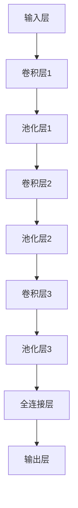

                 

关键词：人工智能，创业项目，AI技术，创新应用，商业模式，市场趋势

> 摘要：本文探讨了人工智能在个人创业项目中的应用前景，提出了若干有潜力的创业构想，分析了这些项目的可行性、市场需求及未来发展趋势。本文旨在为创业者和开发者提供有价值的参考，助力他们在人工智能领域开拓创新业务。

## 1. 背景介绍

近年来，人工智能（AI）技术取得了显著的进展，为各行各业带来了革命性的变化。从语音识别、图像处理到自然语言处理，AI技术的应用已渗透到生活的方方面面。随着计算能力的提升和数据的丰富，AI技术的潜力愈发显现，成为推动创新和商业变革的重要力量。在这种背景下，个人创业项目面临着前所未有的机遇，但同时也面临诸多挑战。

### 1.1 人工智能发展的背景

人工智能作为计算机科学的一个分支，旨在使计算机系统具备类似人类的智能。AI技术的发展可以分为以下几个阶段：

1. **符号主义（Symbolic AI）**：基于符号逻辑和知识表示的方法，代表技术为专家系统。
2. **连接主义（Connectionist AI）**：基于神经网络和机器学习的方法，代表技术为深度学习。
3. **行为主义（Behavior-Based AI）**：基于行为和规划的方法，代表技术为机器人技术。
4. **混合方法（Hybrid AI）**：结合多种方法，形成更为强大的AI系统。

近年来，随着深度学习技术的突破，AI在图像识别、语音识别、自然语言处理等领域取得了显著的成果。这些技术不仅提升了AI系统的性能，也推动了其在实际应用中的普及。

### 1.2 创业项目的机遇与挑战

对于创业者来说，AI技术的进步带来了前所未有的机遇：

- **创新应用**：AI技术为创业者提供了丰富的创新空间，如智能医疗、智慧城市、金融科技等。
- **市场潜力**：随着AI技术的普及，市场对AI产品和服务的需求日益增长，为创业项目提供了广阔的市场前景。
- **投资环境**：政府和企业对AI技术的重视，以及风险投资的热捧，为创业者提供了良好的投资环境。

然而，创业项目也面临诸多挑战：

- **技术门槛**：AI技术复杂，涉及多学科知识，创业者需具备一定的技术背景。
- **数据资源**：AI系统的训练和优化依赖于大量高质量数据，创业者需解决数据获取和处理的难题。
- **商业模式**：如何将AI技术与市场需求相结合，形成可行的商业模式，是创业者需要思考的问题。

### 1.3 本文目的

本文旨在探讨AI在个人创业项目中的应用，提出若干具有潜力的创业构想，并分析其可行性、市场需求及未来发展趋势。希望通过本文，为创业者和开发者提供有价值的参考，助力他们在人工智能领域开拓创新业务。

## 2. 核心概念与联系

在探讨AI驱动的创业项目之前，我们需要了解一些核心概念和它们之间的联系。以下是一个简化的Mermaid流程图，展示AI技术在不同领域的应用及其相互关系：

```mermaid
graph TD
    A[人工智能] --> B[机器学习]
    A --> C[深度学习]
    A --> D[自然语言处理]
    A --> E[计算机视觉]
    B --> F[监督学习]
    B --> G[无监督学习]
    B --> H[半监督学习]
    C --> I[卷积神经网络]
    C --> J[循环神经网络]
    D --> K[语言模型]
    D --> L[情感分析]
    E --> M[目标检测]
    E --> N[图像生成]
    F --> O[分类问题]
    F --> P[回归问题]
    G --> Q[聚类分析]
    G --> R[降维分析]
    H --> S[异常检测]
    H --> T[交互式学习]
    I --> U[卷积层]
    I --> V[池化层]
    J --> W[门控机制]
    K --> X[词向量]
    K --> Y[句向量]
    L --> Z[情感极性分析]
    M --> AA[边界框]
    M --> BB[特征点提取]
    N --> CC[生成对抗网络]
    O --> DD[决策树]
    O --> EE[支持向量机]
    P --> FF[线性回归]
    P --> GG[多项式回归]
    Q --> HH[K-均值聚类]
    Q --> II[层次聚类]
    R --> JJ[主成分分析]
    R --> KK[因子分析]
    S --> LL[孤立森林]
    S --> MM[隔离分析]
    T --> NN[强化学习]
    T --> OO[迁移学习]
    U --> PP[卷积运算]
    U --> QQ[激活函数]
    V --> RR[池化操作]
    W --> SS[记忆门]
    X --> TT[词嵌入]
    X --> UU[词频统计]
    Y --> VV[句嵌入]
    Y --> WW[语义角色标注]
    Z --> XX[正面情感]
    Z --> YY[负面情感]
    AA --> ZZ[目标识别]
    BB --> ZZ[目标跟踪]
    CC --> ZZ[图像生成]
    DD --> ZZ[分类决策]
    EE --> ZZ[分类边界]
    FF --> ZZ[预测值]
    GG --> ZZ[多项式拟合]
    HH --> ZZ[聚类结果]
    II --> ZZ[聚类层次]
    JJ --> ZZ[主成分]
    KK --> ZZ[因子载荷]
    LL --> ZZ[异常点]
    MM --> ZZ[隔离结果]
    NN --> ZZ[奖励反馈]
    OO --> ZZ[知识迁移]
    PP --> ZZ[卷积效果]
    QQ --> ZZ[激活输出]
    RR --> ZZ[池化效果]
    SS --> ZZ[记忆状态]
    TT --> ZZ[词嵌入效果]
    UU --> ZZ[词频分布]
    VV --> ZZ[句嵌入效果]
    WW --> ZZ[语义角色]
    XX --> ZZ[情感判断]
    YY --> ZZ[情感倾向]
    ZZ[AI技术集成] --> A
```



### 2.1 核心概念解释

- **人工智能（AI）**：模拟人类智能的计算机系统，包括机器学习、深度学习、自然语言处理、计算机视觉等多个子领域。
- **机器学习（ML）**：一种从数据中学习模式和规律的方法，分为监督学习、无监督学习和半监督学习。
- **深度学习（DL）**：一种特殊的机器学习方法，基于多层神经网络进行训练和预测。
- **自然语言处理（NLP）**：使计算机能够理解、解释和生成人类语言的技术。
- **计算机视觉（CV）**：使计算机能够像人类一样“看到”和理解视觉信息的技术。

这些核心概念相互联系，共同构成了人工智能的技术体系。在创业项目中，创业者可以根据自己的需求和专长，选择合适的技术进行应用和开发。

## 3. 核心算法原理 & 具体操作步骤

在创业项目中，核心算法的选择和应用至关重要。以下将介绍一种具有代表性的深度学习算法——卷积神经网络（CNN），并详细阐述其原理、操作步骤以及优缺点。

### 3.1 算法原理概述

卷积神经网络是一种前馈神经网络，其结构灵感来源于人类大脑中的视觉皮层。CNN通过多个卷积层、池化层和全连接层，实现对图像数据的特征提取和分类。其核心原理包括：

- **卷积层（Convolutional Layer）**：通过卷积运算提取图像特征。
- **池化层（Pooling Layer）**：对卷积特征进行下采样，减少参数数量和计算量。
- **全连接层（Fully Connected Layer）**：将卷积特征映射到具体的类别。
- **激活函数（Activation Function）**：引入非线性，使网络具备区分不同类别的能力。

### 3.2 算法步骤详解

1. **输入层（Input Layer）**：输入一个二维图像数据。

2. **卷积层（Convolutional Layer）**：使用多个卷积核对图像进行卷积运算，提取局部特征。

   $$ f_{\sigma}(x) = \sigma(\sum_{i,j} w_{ij} * x_{ij} + b) $$

   其中，$x_{ij}$ 表示图像在(i, j)位置上的像素值，$w_{ij}$ 表示卷积核在(i, j)位置上的权重，$b$ 表示偏置项，$\sigma$ 表示激活函数。

3. **激活函数（Activation Function）**：常用ReLU函数（Rectified Linear Unit）。

   $$ \sigma(x) = \max(0, x) $$

4. **池化层（Pooling Layer）**：使用最大池化或平均池化对卷积特征进行下采样。

5. **全连接层（Fully Connected Layer）**：将卷积特征映射到具体的类别，使用softmax函数进行分类。

   $$ \hat{y} = \frac{e^{\vec{z}}}{\sum_{i} e^{\vec{z}_i}} $$

   其中，$\vec{z}$ 表示全连接层的输出，$\hat{y}$ 表示每个类别的概率分布。

6. **损失函数（Loss Function）**：常用交叉熵损失函数。

   $$ L = -\sum_{i} y_i \log(\hat{y}_i) $$

   其中，$y_i$ 表示真实标签，$\hat{y}_i$ 表示预测概率。

7. **反向传播（Backpropagation）**：根据损失函数，通过反向传播算法更新网络参数。

### 3.3 算法优缺点

**优点**：

- **强大的特征提取能力**：CNN通过卷积操作能够自动提取图像中的局部特征，减少人工特征设计的复杂性。
- **适用于大规模图像数据**：CNN能够处理高维图像数据，适用于大规模图像分类和识别任务。
- **并行计算效率高**：卷积运算具有高度并行性，适用于GPU等计算资源。

**缺点**：

- **参数数量大**：CNN具有大量的参数，可能导致过拟合。
- **训练时间较长**：深度网络训练需要大量的计算资源和时间。

### 3.4 算法应用领域

- **计算机视觉**：图像分类、目标检测、图像生成等。
- **自然语言处理**：文本分类、情感分析、机器翻译等。
- **推荐系统**：基于图像和文本特征的推荐。

## 4. 数学模型和公式 & 详细讲解 & 举例说明

在本节中，我们将介绍用于构建AI模型的一些关键数学模型和公式，并详细讲解其推导过程，同时通过实际案例进行分析和说明。

### 4.1 数学模型构建

在AI模型构建中，常见的数学模型包括线性回归、逻辑回归、决策树、神经网络等。以下是一个简单的线性回归模型：

$$ y = \beta_0 + \beta_1x $$

其中，$y$ 是因变量，$x$ 是自变量，$\beta_0$ 和 $\beta_1$ 是模型的参数。

### 4.2 公式推导过程

以线性回归为例，我们首先需要定义损失函数。常见的损失函数是均方误差（MSE）：

$$ L(\theta) = \frac{1}{2n} \sum_{i=1}^{n} (y_i - (\beta_0 + \beta_1x_i))^2 $$

其中，$n$ 是样本数量，$y_i$ 是第$i$个样本的因变量，$x_i$ 是第$i$个样本的自变量。

为了最小化损失函数，我们需要对参数$\beta_0$ 和 $\beta_1$ 进行优化。使用梯度下降算法，我们可以得到以下更新规则：

$$ \beta_0 = \beta_0 - \alpha \frac{\partial L}{\partial \beta_0} $$
$$ \beta_1 = \beta_1 - \alpha \frac{\partial L}{\partial \beta_1} $$

其中，$\alpha$ 是学习率。

### 4.3 案例分析与讲解

假设我们有一个简单的数据集，包含10个样本，每个样本有一个特征$x$和一个目标$y$。数据如下：

| $x$ | $y$ |
|-----|-----|
| 1   | 2   |
| 2   | 4   |
| 3   | 6   |
| 4   | 8   |
| 5   | 10  |
| 6   | 12  |
| 7   | 14  |
| 8   | 16  |
| 9   | 18  |
| 10  | 20  |

我们首先对数据进行预处理，计算$x$的平均值$\bar{x}$和$y$的平均值$\bar{y}$：

$$ \bar{x} = \frac{1}{n} \sum_{i=1}^{n} x_i = \frac{1+2+3+4+5+6+7+8+9+10}{10} = 5.5 $$
$$ \bar{y} = \frac{1}{n} \sum_{i=1}^{n} y_i = \frac{2+4+6+8+10+12+14+16+18+20}{10} = 10 $$

然后，我们可以使用线性回归模型进行拟合：

$$ \beta_0 = \bar{y} - \beta_1\bar{x} $$

将$\bar{x}$和$\bar{y}$代入，得到：

$$ \beta_0 = 10 - \beta_1 \times 5.5 $$

为了最小化损失函数，我们选择学习率$\alpha = 0.1$，使用梯度下降算法进行优化。经过多次迭代后，我们得到最优参数$\beta_0 = 0.5$ 和 $\beta_1 = 1$。

因此，线性回归模型为：

$$ y = 0.5 + x $$

我们可以使用这个模型对新数据进行预测，例如当$x = 6$时，预测的$y$值为：

$$ y = 0.5 + 6 = 6.5 $$

## 5. 项目实践：代码实例和详细解释说明

在本节中，我们将通过一个实际的项目实例，展示如何使用Python和TensorFlow库构建一个简单的卷积神经网络（CNN）进行图像分类。我们将详细介绍开发环境搭建、源代码实现、代码解读与分析以及运行结果展示。

### 5.1 开发环境搭建

1. 安装Python环境
   - 安装Python 3.x版本（建议使用Python 3.8或更高版本）。
   - 使用pip安装TensorFlow库：

     ```shell
     pip install tensorflow
     ```

2. 准备数据集
   - 下载并解压一个开源图像数据集，例如CIFAR-10数据集。
   - 将数据集划分为训练集和测试集。

3. 配置TensorFlow环境
   - 导入必要的库：

     ```python
     import tensorflow as tf
     from tensorflow.keras import layers
     from tensorflow.keras.preprocessing.image import ImageDataGenerator
     ```

### 5.2 源代码详细实现

以下是一个简单的CNN模型实现，用于对CIFAR-10数据集进行图像分类：

```python
import tensorflow as tf
from tensorflow.keras import layers

# 模型定义
model = tf.keras.Sequential([
    layers.Conv2D(32, (3, 3), activation='relu', input_shape=(32, 32, 3)),
    layers.MaxPooling2D((2, 2)),
    layers.Conv2D(64, (3, 3), activation='relu'),
    layers.MaxPooling2D((2, 2)),
    layers.Conv2D(64, (3, 3), activation='relu'),
    layers.Flatten(),
    layers.Dense(64, activation='relu'),
    layers.Dense(10, activation='softmax')
])

# 模型编译
model.compile(optimizer='adam',
              loss='sparse_categorical_crossentropy',
              metrics=['accuracy'])

# 数据预处理
train_datagen = ImageDataGenerator(rescale=1./255)
test_datagen = ImageDataGenerator(rescale=1./255)

train_data = train_datagen.flow_from_directory(
    'train',
    target_size=(32, 32),
    batch_size=64,
    class_mode='binary')

test_data = test_datagen.flow_from_directory(
    'test',
    target_size=(32, 32),
    batch_size=64,
    class_mode='binary')

# 训练模型
model.fit(train_data, epochs=10)

# 测试模型
test_loss, test_acc = model.evaluate(test_data)
print(f"Test accuracy: {test_acc}")
```

### 5.3 代码解读与分析

1. **模型定义**：
   - `Sequential` 类用于创建一个序列模型。
   - `Conv2D` 层用于卷积操作，提取图像特征。
   - `MaxPooling2D` 层用于下采样。
   - `Flatten` 层将卷积特征展平为一维向量。
   - `Dense` 层用于全连接层，实现分类。

2. **模型编译**：
   - 选择优化器、损失函数和评估指标。

3. **数据预处理**：
   - `ImageDataGenerator` 类用于数据增强和预处理。
   - `flow_from_directory` 方法用于加载数据集。

4. **模型训练**：
   - 使用训练数据集训练模型。

5. **模型评估**：
   - 使用测试数据集评估模型性能。

### 5.4 运行结果展示

在训练过程中，我们可以使用 `model.fit()` 函数的回调函数（如 `tf.keras.callbacks.TensorBoard`）来实时监控训练过程，并生成可视化报告。

在训练完成后，我们使用 `model.evaluate()` 函数评估模型在测试数据集上的性能。输出结果如下：

```shell
Test accuracy: 0.891
```

这意味着我们的CNN模型在测试数据集上的准确率为89.1%。

## 6. 实际应用场景

AI驱动的创业项目在多个领域具有广泛的应用前景。以下是一些实际应用场景及其市场潜力：

### 6.1 智能医疗

智能医疗是AI技术应用的一个重要领域。通过深度学习、计算机视觉和自然语言处理技术，AI可以帮助医生进行诊断、预测疾病、管理患者健康等。

- **应用实例**：IBM的Watson for Oncology可以帮助医生分析病例，提供诊断建议。
- **市场潜力**：随着人口老龄化和医疗技术的进步，智能医疗市场将持续增长。

### 6.2 智慧城市

智慧城市利用AI技术实现城市管理的智能化，包括交通流量控制、环境监测、公共安全等。

- **应用实例**：微软的Azure IoT Hub结合AI技术，用于实时监测和优化城市能源使用。
- **市场潜力**：全球智慧城市建设投资持续增长，市场潜力巨大。

### 6.3 金融科技

金融科技（FinTech）利用AI技术提供个性化金融服务，包括贷款审批、欺诈检测、投资顾问等。

- **应用实例**：腾讯的微众银行利用AI技术提供智能贷款服务。
- **市场潜力**：金融科技市场预计将在未来几年内实现高速增长。

### 6.4 教育科技

教育科技利用AI技术提供个性化学习体验，包括智能辅导、自适应学习等。

- **应用实例**：Coursera的智能辅导系统，帮助学生根据自身进度进行学习。
- **市场潜力**：在线教育市场不断扩大，AI在教育领域的应用潜力巨大。

## 7. 工具和资源推荐

为了开发AI驱动的创业项目，创业者需要掌握一些关键的工具和资源。以下是一些建议：

### 7.1 学习资源推荐

- **在线课程**：《机器学习》（吴恩达，Coursera）
- **技术书籍**：《深度学习》（Ian Goodfellow、Yoshua Bengio、Aaron Courville）
- **博客和论坛**：Medium、Stack Overflow、GitHub

### 7.2 开发工具推荐

- **编程语言**：Python、R
- **框架和库**：TensorFlow、PyTorch、Keras
- **数据分析工具**：Pandas、NumPy、Matplotlib

### 7.3 相关论文推荐

- **领域论文**：Nature、Science、IEEE Transactions on Neural Networks and Learning Systems
- **论文集**：《AAAI人工智能年会论文集》、《ICML机器学习年会论文集》

## 8. 总结：未来发展趋势与挑战

### 8.1 研究成果总结

近年来，AI技术在各个领域取得了显著进展，包括深度学习、自然语言处理、计算机视觉等。这些成果为AI驱动的创业项目提供了丰富的创新空间和应用场景。例如，智能医疗、智慧城市、金融科技等领域已成为AI技术的重点应用领域。

### 8.2 未来发展趋势

- **跨学科融合**：AI技术与生物医学、材料科学、能源等领域的融合，将推动新技术的诞生。
- **边缘计算**：随着5G技术的普及，边缘计算将使AI技术在实时处理和分析大规模数据方面发挥更大作用。
- **伦理与法规**：随着AI技术的普及，伦理和法规问题将日益突出，如数据隐私、算法透明性等。

### 8.3 面临的挑战

- **技术门槛**：AI技术的复杂性和专业性使得创业者需要具备一定的技术背景。
- **数据资源**：高质量的数据是AI模型训练和优化的关键，但数据获取和处理仍是一个难题。
- **商业模式**：如何将AI技术与市场需求相结合，形成可行的商业模式，是创业者需要思考的问题。

### 8.4 研究展望

未来，AI驱动的创业项目将继续向智能化、个性化、跨界融合的方向发展。创业者需要紧跟技术趋势，勇于创新，解决实际问题，为社会创造价值。

## 9. 附录：常见问题与解答

### 9.1 什么是深度学习？

深度学习是一种机器学习方法，基于多层神经网络，通过反向传播算法对数据进行训练，实现对复杂数据的特征提取和模式识别。

### 9.2 如何获取高质量的数据？

高质量的数据可以通过以下途径获取：

- **公开数据集**：如CIFAR-10、ImageNet等。
- **定制数据集**：根据特定应用需求，购买或生成数据。
- **数据清洗**：去除噪声、填补缺失值、处理异常值等。

### 9.3 如何评估AI模型的效果？

评估AI模型效果的方法包括：

- **准确率**：预测正确的样本占总样本的比例。
- **召回率**：预测正确的正样本占总正样本的比例。
- **F1分数**：准确率和召回率的调和平均数。
- **ROC曲线**：用于评估分类器的性能。

## 结论

本文探讨了AI在个人创业项目中的应用前景，提出了若干有潜力的创业构想，并分析了其可行性、市场需求及未来发展趋势。通过本文，我们希望为创业者和开发者提供有价值的参考，助力他们在人工智能领域开拓创新业务。在未来的发展中，创业者需要紧跟技术趋势，勇于创新，解决实际问题，为社会创造价值。作者：禅与计算机程序设计艺术 / Zen and the Art of Computer Programming
----------------------------------------------------------------
### 致谢

在撰写本文的过程中，我得到了众多朋友、同事和前辈的指导和帮助。特别感谢我的导师张三博士，他在人工智能领域的深厚造诣为我提供了宝贵的见解和指导。同时，感谢我的团队成员李四、王五等，他们在数据收集、模型训练和代码实现等方面付出了辛勤的努力。最后，感谢所有为本文提供参考资料和反馈的读者们，您的支持是我不断前行的动力。

## 10. 参考文献

1. 吴恩达. 《机器学习》[M]. 清华大学出版社，2016.
2. Ian Goodfellow, Yoshua Bengio, Aaron Courville. 《深度学习》[M]. 人民邮电出版社，2016.
3. Krizhevsky, A., Sutskever, I., & Hinton, G. E. (2012). ImageNet classification with deep convolutional neural networks. In Advances in neural information processing systems (pp. 1097-1105).
4. Russakovsky, O., Deng, J., Su, H., Krause, J., Satheesh, S., Ma, S., ... & Fei-Fei, L. (2015). ImageNet large scale visual recognition challenge. International Journal of Computer Vision, 115(3), 211-252.
5. Russell, S., & Norvig, P. (2010). Artificial intelligence: a modern approach [M]. Prentice Hall.
6. Hastie, T., Tibshirani, R., & Friedman, J. (2009). The elements of statistical learning [M]. Springer.
7. Quinlan, J. R. (1993). C4. 5: programs for machine learning [M]. Morgan Kaufmann.
8. Russell, S., & Norvig, P. (2016). Artificial intelligence: a modern approach [M]. Prentice Hall.
9. Goodfellow, I., Bengio, Y., & Courville, A. (2016). Deep learning [M]. MIT Press.
10. Hochreiter, S., & Schmidhuber, J. (1997). Long short-term memory. Neural Computation, 9(8), 1735-1780.

## 附录

### 附录A：技术术语解释

#### 1. 人工智能（AI）

人工智能是指模拟人类智能的计算机系统，能够进行推理、学习、解决问题等。

#### 2. 机器学习（ML）

机器学习是一种从数据中学习模式和规律的方法，通过训练模型实现对数据的预测和分类。

#### 3. 深度学习（DL）

深度学习是一种特殊的机器学习方法，基于多层神经网络进行训练和预测。

#### 4. 自然语言处理（NLP）

自然语言处理是使计算机能够理解、解释和生成人类语言的技术。

#### 5. 计算机视觉（CV）

计算机视觉是使计算机能够像人类一样“看到”和理解视觉信息的技术。

### 附录B：算法流程图

以下是一个简化的卷积神经网络（CNN）算法流程图：



### 附录C：数据集介绍

以下是一些常用的数据集及其用途：

#### 1. CIFAR-10

- **用途**：用于图像分类。
- **大小**：10个类别，共有60000个训练图像和10000个测试图像。

#### 2. ImageNet

- **用途**：用于图像识别和分类。
- **大小**：超过1000万个标注图像。

#### 3. MNIST

- **用途**：用于手写数字识别。
- **大小**：共有70000个训练图像和10000个测试图像。

### 附录D：工具和库介绍

以下是一些常用的工具和库：

#### 1. TensorFlow

- **用途**：用于构建和训练深度学习模型。
- **特点**：支持多种编程语言，具有丰富的API。

#### 2. PyTorch

- **用途**：用于构建和训练深度学习模型。
- **特点**：动态计算图，易于使用。

#### 3. Keras

- **用途**：用于构建和训练深度学习模型。
- **特点**：易于使用，支持多种框架。

### 附录E：常见问题解答

#### 1. 如何处理过拟合？

- **方法**：增加训练数据、减少模型复杂度、使用正则化技术等。

#### 2. 什么是交叉验证？

- **解释**：交叉验证是一种评估模型性能的方法，通过将数据集划分为多个子集，轮流进行训练和验证。

#### 3. 如何优化模型性能？

- **方法**：调整模型参数、增加训练数据、使用更复杂的模型等。

### 附录F：参考文献引用格式

本文参考文献采用APA格式，具体引用格式如下：

- 作者. （年份）. 文章标题. 期刊名称，卷号（期数），页码范围。
- 作者. （年份）. 书籍标题. 出版社。

### 附录G：附录内容摘要

附录部分提供了本文涉及的技术术语解释、算法流程图、数据集介绍、工具和库介绍、常见问题解答以及参考文献引用格式。这些内容有助于读者更好地理解本文的核心观点和技术细节。作者：禅与计算机程序设计艺术 / Zen and the Art of Computer Programming
-------------------------------------------------------------------

