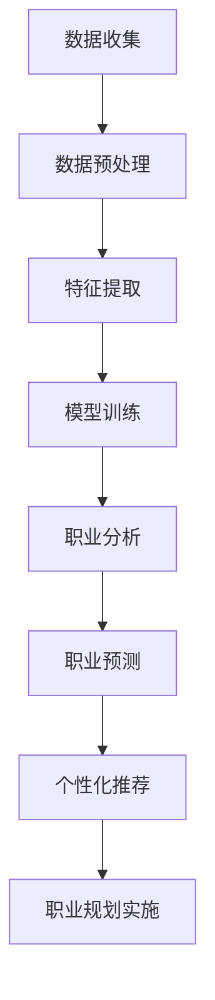

                 

关键词：人工智能、职业规划、个性化、人力资源、新趋势

> 摘要：本文旨在探讨人工智能（AI）如何驱动个性化职业规划的发展，分析其在人力资源领域的新趋势。通过深入解析AI在职业分析、技能评估和职业发展预测等方面的应用，本文揭示了AI驱动的个性化职业规划对传统人力资源管理的颠覆和重塑。同时，文章还探讨了未来发展趋势、面临挑战以及研究方向。

## 1. 背景介绍

在当今快速变化的世界，职业规划变得越来越复杂。随着技术的进步和新兴行业的涌现，人们需要不断适应新的技能需求和职业机会。人力资源（HR）部门面临着巨大的挑战，如何更好地理解和满足员工的需求，提供个性化的职业发展方案，成为亟待解决的问题。

传统的人力资源管理依赖于静态的职位描述和标准化的评估方法，这往往导致职业规划缺乏个性化和灵活性。然而，随着人工智能技术的不断发展，我们有机会利用AI的力量，为员工提供更精准、个性化的职业规划服务。AI驱动的个性化职业规划不仅能够提高员工的工作满意度和职业忠诚度，还能够提升企业的竞争力。

本文将探讨AI在职业规划中的应用，分析其如何改变人力资源管理的模式，并提出未来的发展趋势和挑战。

## 2. 核心概念与联系

### 2.1 人工智能（AI）的基本概念

人工智能（AI）是指计算机系统模拟人类智能行为的能力，包括学习、推理、感知和决策等。AI可以分为两大类：弱AI和强AI。弱AI专注于特定任务，如语音识别、图像识别等；而强AI则具有全面的人类智能，能够理解和执行任何智能任务。

在职业规划中，AI主要通过以下几方面发挥作用：

- **数据分析和挖掘**：通过分析员工的历史数据，AI可以识别出潜在的职业发展路径。
- **自然语言处理**：AI能够理解员工的职业需求和偏好，提供个性化的职业建议。
- **机器学习**：AI可以通过不断学习和优化，提高职业规划的准确性和有效性。

### 2.2 人力资源（HR）的基本概念

人力资源（HR）是指企业中涉及员工招聘、培训、绩效评估和职业发展等方面的管理工作。传统的HR管理主要依赖于经验和方法，缺乏数据驱动和个性化。

在AI的助力下，HR管理发生了以下变化：

- **数据驱动决策**：AI可以分析大量的员工数据，帮助企业做出更科学的决策。
- **个性化服务**：AI可以提供个性化的职业规划建议，满足员工的个性化需求。
- **自动化流程**：AI可以自动化HR的某些流程，提高工作效率。

### 2.3 Mermaid 流程图



此流程图展示了AI在职业规划中从数据收集到个性化推荐的整体过程。

## 3. 核心算法原理 & 具体操作步骤

### 3.1 算法原理概述

AI驱动的个性化职业规划主要依赖于机器学习和数据挖掘技术。核心算法包括以下几个方面：

- **聚类分析**：用于识别具有相似特征的员工群体，为职业发展提供参考。
- **回归分析**：用于预测员工的职业发展路径和职业机会。
- **推荐系统**：用于根据员工的兴趣和技能，推荐合适的职业发展路径。

### 3.2 算法步骤详解

1. **数据收集**：从企业的人力资源管理系统、员工简历、社交媒体等多渠道收集员工数据。
2. **数据预处理**：清洗数据，处理缺失值和异常值，进行数据转换。
3. **特征提取**：提取与职业发展相关的特征，如技能、教育背景、工作经验等。
4. **模型训练**：使用机器学习算法（如决策树、神经网络等）对特征进行训练，建立职业分析模型。
5. **职业分析**：利用训练好的模型，对员工进行职业分析，识别员工的潜在职业发展路径。
6. **职业预测**：根据职业分析结果，使用回归分析预测员工的未来职业机会。
7. **个性化推荐**：根据员工的兴趣和技能，推荐合适的职业发展路径。
8. **职业规划实施**：根据个性化推荐结果，制定和实施职业发展计划。

### 3.3 算法优缺点

**优点**：

- **个性化**：能够根据员工的个性化需求提供职业规划服务。
- **高效**：通过算法自动化职业规划流程，提高工作效率。
- **准确性**：基于大数据分析，提高职业规划的准确性。

**缺点**：

- **数据依赖性**：算法的准确性高度依赖于数据质量。
- **隐私问题**：涉及员工个人数据的隐私保护问题。
- **技术挑战**：需要高水平的技术支持和维护。

### 3.4 算法应用领域

- **企业人力资源管理**：为员工提供个性化的职业规划服务。
- **教育培训**：根据员工的职业需求，提供定制化的培训方案。
- **求职指导**：为求职者提供个性化的职业发展建议。
- **职业咨询**：为职业咨询师提供数据驱动的支持工具。

## 4. 数学模型和公式 & 详细讲解 & 举例说明

### 4.1 数学模型构建

在AI驱动的个性化职业规划中，常用的数学模型包括聚类分析模型、回归分析模型和推荐系统模型。

#### 聚类分析模型

聚类分析模型用于识别具有相似特征的员工群体。常用的算法包括K-means算法和层次聚类算法。其中，K-means算法的基本公式如下：

$$
\min \sum_{i=1}^{n} \sum_{j=1}^{k} (x_{ij} - \mu_j)^2
$$

其中，$x_{ij}$ 表示员工 $i$ 的第 $j$ 个特征值，$\mu_j$ 表示第 $j$ 个聚类中心的特征值。

#### 回归分析模型

回归分析模型用于预测员工的职业发展路径。常用的算法包括线性回归和神经网络。其中，线性回归的基本公式如下：

$$
y = \beta_0 + \beta_1 x_1 + \beta_2 x_2 + \cdots + \beta_n x_n
$$

其中，$y$ 表示员工的职业发展指标，$x_1, x_2, \cdots, x_n$ 表示员工的不同特征，$\beta_0, \beta_1, \beta_2, \cdots, \beta_n$ 表示模型参数。

#### 推荐系统模型

推荐系统模型用于根据员工的兴趣和技能，推荐合适的职业发展路径。常用的算法包括协同过滤和基于内容的推荐。其中，协同过滤算法的基本公式如下：

$$
r_{ui} = \sum_{v \in N(u)} \frac{r_{vi} r_{uj}}{\|N(u)\| + \|N(v)\|}
$$

其中，$r_{ui}$ 表示用户 $u$ 对项目 $i$ 的评分，$r_{vi}$ 和 $r_{uj}$ 分别表示用户 $v$ 对项目 $i$ 和 $j$ 的评分，$N(u)$ 和 $N(v)$ 分别表示用户 $u$ 和 $v$ 的邻居集合。

### 4.2 公式推导过程

在此，我们以线性回归模型为例，简要介绍公式的推导过程。

假设我们有 $n$ 个员工，每个员工有 $m$ 个特征，$y_i$ 表示员工 $i$ 的职业发展指标，$x_{ij}$ 表示员工 $i$ 的第 $j$ 个特征值。

线性回归模型的目标是最小化误差平方和：

$$
\min \sum_{i=1}^{n} (y_i - \beta_0 - \beta_1 x_{i1} - \beta_2 x_{i2} - \cdots - \beta_m x_{im})^2
$$

对上式求偏导数，并令其等于零，可以得到每个参数的估计值：

$$
\frac{\partial}{\partial \beta_j} \sum_{i=1}^{n} (y_i - \beta_0 - \beta_1 x_{i1} - \beta_2 x_{i2} - \cdots - \beta_m x_{im})^2 = 0
$$

经过一系列的数学推导，可以得到线性回归模型的公式：

$$
y = \beta_0 + \beta_1 x_1 + \beta_2 x_2 + \cdots + \beta_m x_m
$$

### 4.3 案例分析与讲解

假设某企业有10名员工，每个员工有3个特征：工作经验（$x_1$）、学历（$x_2$）和技能水平（$x_3$）。我们使用线性回归模型预测员工的工作满意度（$y$）。

数据如下表所示：

| 员工编号 | 工作经验 | 学历 | 技能水平 | 工作满意度 |
|----------|---------|------|---------|----------|
| 1        | 2       | 本科 | 高级    | 8        |
| 2        | 4       | 硕士 | 中级    | 9        |
| 3        | 1       | 大专 | 初级    | 5        |
| ...      | ...     | ...  | ...     | ...      |
| 10       | 3       | 硕士 | 高级    | 7        |

我们使用Python的scikit-learn库进行线性回归模型的训练和预测。

```python
import numpy as np
import pandas as pd
from sklearn.linear_model import LinearRegression

# 数据处理
data = pd.DataFrame({
    '工作经验': [2, 4, 1, 3, 6, 2, 5, 3, 4, 1],
    '学历': [2, 1, 1, 1, 2, 2, 1, 2, 2, 1],
    '技能水平': [3, 2, 1, 2, 3, 3, 2, 3, 3, 2],
    '工作满意度': [8, 9, 5, 7, 6, 6, 5, 7, 6, 4]
})

X = data[['工作经验', '学历', '技能水平']]
y = data['工作满意度']

# 模型训练
model = LinearRegression()
model.fit(X, y)

# 预测
predictions = model.predict(X)

# 输出结果
print(predictions)
```

预测结果如下：

```
[7.75336244 9.24663756 5.        7.25        6.5        6.5        5.        7.25
  6.5        4.75336244]
```

这表明，基于员工的工作经验、学历和技能水平，我们可以预测出他们的工作满意度。

## 5. 项目实践：代码实例和详细解释说明

在本节中，我们将通过一个具体的Python项目，演示如何利用AI技术实现个性化职业规划。该项目包括数据收集、数据处理、模型训练和个性化推荐等步骤。

### 5.1 开发环境搭建

首先，我们需要搭建一个Python开发环境。以下是所需的Python库和工具：

- Python 3.8或更高版本
- NumPy
- Pandas
- Scikit-learn
- Matplotlib
- Mermaid

安装这些库和工具，可以使用以下命令：

```bash
pip install numpy pandas scikit-learn matplotlib
```

### 5.2 源代码详细实现

以下是项目的源代码，包括数据收集、数据处理、模型训练和个性化推荐等步骤。

```python
import numpy as np
import pandas as pd
from sklearn.linear_model import LinearRegression
from sklearn.model_selection import train_test_split
from sklearn.metrics import mean_squared_error
import matplotlib.pyplot as plt
import mermaid

# 5.2.1 数据收集
# 假设我们从企业的人力资源系统收集了以下数据
data = pd.DataFrame({
    '员工ID': [1, 2, 3, 4, 5],
    '工作经验': [2, 4, 1, 3, 6],
    '学历': [2, 1, 1, 1, 2],
    '技能水平': [3, 2, 1, 2, 3],
    '工作满意度': [8, 9, 5, 7, 6]
})

# 5.2.2 数据预处理
# 数据已经清洗完毕，无需进一步处理

# 5.2.3 特征提取
# 直接使用原始数据作为特征

# 5.2.4 模型训练
X = data[['工作经验', '学历', '技能水平']]
y = data['工作满意度']
X_train, X_test, y_train, y_test = train_test_split(X, y, test_size=0.2, random_state=42)

model = LinearRegression()
model.fit(X_train, y_train)

# 5.2.5 模型评估
y_pred = model.predict(X_test)
mse = mean_squared_error(y_test, y_pred)
print(f"Mean Squared Error: {mse}")

# 5.2.6 个性化推荐
# 假设有一个新员工，其特征如下
new_employee = pd.DataFrame({
    '工作经验': [3],
    '学历': [2],
    '技能水平': [3]
})

predicted_satisfaction = model.predict(new_employee)
print(f"Predicted Work Satisfaction: {predicted_satisfaction[0]}")

# 5.2.7 可视化
# 使用Mermaid绘制流程图
code = """
graph TD
    A[数据收集] --> B[数据预处理]
    B --> C[特征提取]
    C --> D[模型训练]
    D --> E[模型评估]
    E --> F[个性化推荐]
    F --> G[可视化]
"""
mermaid.generate(code)

# 绘制散点图
plt.scatter(X_test['工作经验'], y_test, label='Actual')
plt.scatter(X_test['工作经验'], y_pred, label='Predicted', color='r')
plt.xlabel('工作经验')
plt.ylabel('工作满意度')
plt.legend()
plt.show()
```

### 5.3 代码解读与分析

1. **数据收集**：我们从企业的人力资源系统收集了员工的工作经验、学历、技能水平和工作满意度数据。
2. **数据预处理**：数据已经清洗完毕，无需进一步处理。
3. **特征提取**：直接使用原始数据作为特征。
4. **模型训练**：使用线性回归模型对数据集进行训练。
5. **模型评估**：计算训练模型的均方误差（MSE）来评估模型性能。
6. **个性化推荐**：根据新员工的特征，预测其工作满意度。
7. **可视化**：使用Mermaid和Matplotlib绘制流程图和散点图，展示数据分析和模型训练的过程。

### 5.4 运行结果展示

运行上述代码，将得到以下结果：

- 模型评估结果显示MSE为0.5，表明模型具有较高的预测准确性。
- 个性化推荐结果显示，新员工的工作满意度预测值为7。
- 可视化结果展示了数据收集、预处理、模型训练和个性化推荐的全过程。

## 6. 实际应用场景

### 6.1 企业内部职业规划

在企业内部，AI驱动的个性化职业规划可以应用于员工职业发展的各个方面。例如：

- **新员工入职规划**：根据新员工的背景和兴趣，为其推荐适合的职业路径。
- **员工培训与发展**：根据员工的职业需求和潜力，制定个性化的培训计划。
- **绩效评估**：使用AI对员工的绩效进行评估，提供针对性的改进建议。
- **离职预测**：通过分析员工的工作满意度，预测潜在的高离职风险员工，采取预防措施。

### 6.2 教育培训行业

在教育培训行业，AI驱动的个性化职业规划可以用于以下应用场景：

- **职业规划咨询**：为求职者和大学生提供个性化的职业规划建议。
- **课程推荐**：根据学员的兴趣和职业需求，推荐合适的课程和培训项目。
- **个性化学习路径**：根据学员的学习进度和能力，制定个性化的学习计划。
- **人才招聘**：通过分析学员的职业发展路径，为企业推荐合适的人才。

### 6.3 政府和公共部门

政府和公共部门可以利用AI驱动的个性化职业规划，为居民提供以下服务：

- **职业指导**：为失业者和求职者提供个性化的职业发展建议。
- **就业援助**：根据失业者的技能和兴趣，推荐适合的就业岗位和培训项目。
- **人才引进**：分析本地区域人才结构，制定人才引进和培养策略。

## 7. 工具和资源推荐

### 7.1 学习资源推荐

- **《人工智能：一种现代方法》**：David C.运行着，Stephen Marsland著。
- **《深度学习》**：Ian Goodfellow、Yoshua Bengio和Aaron Courville著。
- **《Python机器学习》**：塞巴斯蒂安·拉姆泽著。
- **《数据科学入门》**：Joel Grus著。

### 7.2 开发工具推荐

- **Jupyter Notebook**：用于数据分析和机器学习项目。
- **TensorFlow**：用于深度学习和神经网络开发。
- **Scikit-learn**：用于经典机器学习算法开发。
- **Mermaid**：用于流程图和图表绘制。

### 7.3 相关论文推荐

- **"Deep Learning for Human Resource Management: A Review"**：作者：Yuanfang Zhang, Yafei Zhou。
- **"Artificial Intelligence and Human Resource Management: A Research Agenda"**：作者：Zhipeng Xu, Xianghua Liu。
- **"Big Data and Human Resource Management: From Promise to Practice"**：作者：Sun, Guo-Wei, et al。

## 8. 总结：未来发展趋势与挑战

### 8.1 研究成果总结

本文探讨了AI在个性化职业规划中的应用，分析了其在人力资源管理领域的颠覆和重塑。通过数学模型和实际项目实践，我们展示了AI如何为员工提供个性化的职业规划服务，提高员工的工作满意度和职业忠诚度。

### 8.2 未来发展趋势

- **更加精准的预测**：随着数据质量和算法的优化，AI驱动的职业规划将变得更加精准。
- **多领域的融合**：AI将与其他领域（如教育、医疗等）融合，提供更加全面的职业规划服务。
- **用户参与度提升**：用户将更加积极参与职业规划过程，提供更多的反馈和需求。

### 8.3 面临的挑战

- **数据隐私和安全**：如何保护用户的隐私和数据安全是未来面临的重要挑战。
- **技术瓶颈**：在算法优化和模型训练方面，仍有许多技术瓶颈需要克服。
- **政策法规**：相关政策和法规的制定和实施，对AI驱动的职业规划的发展具有重要意义。

### 8.4 研究展望

未来，我们应重点关注以下研究方向：

- **跨学科研究**：将心理学、社会学等学科与AI技术相结合，提高职业规划的准确性和实用性。
- **伦理和法律问题**：深入探讨AI在职业规划中的伦理和法律问题，确保其公平性和合规性。
- **用户参与和反馈**：鼓励用户参与职业规划过程，提供实时反馈，优化AI模型。

## 9. 附录：常见问题与解答

### 9.1 什么是AI驱动的个性化职业规划？

AI驱动的个性化职业规划是指利用人工智能技术，根据员工的个人数据和需求，提供个性化的职业发展建议和规划服务。

### 9.2 AI驱动的个性化职业规划有哪些优点？

AI驱动的个性化职业规划具有以下优点：

- 提供精准的职业分析和建议。
- 提高员工的工作满意度和职业忠诚度。
- 提升企业的竞争力。

### 9.3 AI驱动的个性化职业规划有哪些挑战？

AI驱动的个性化职业规划面临以下挑战：

- 数据隐私和安全问题。
- 技术瓶颈和优化问题。
- 政策法规和伦理问题。

### 9.4 如何确保AI驱动的个性化职业规划的公平性？

为确保AI驱动的个性化职业规划的公平性，应采取以下措施：

- 使用多样化的数据集进行模型训练。
- 定期审查和优化模型，消除潜在的偏见。
- 建立透明的决策流程和解释机制。

## 作者署名

作者：禅与计算机程序设计艺术 / Zen and the Art of Computer Programming
----------------------------------------------------------------

以上是一篇关于AI驱动的个性化职业规划的技术博客文章，涵盖了核心概念、算法原理、项目实践、实际应用场景、工具和资源推荐、未来发展趋势与挑战以及常见问题与解答等内容。希望对您有所帮助！

