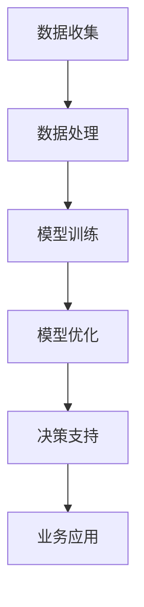

                 

关键词：人工智能、商业应用、道德考虑、创新、前景预测

> 摘要：本文旨在探讨人工智能（AI）在商业领域的应用，特别是在道德考虑因素和应用前景预测方面的研究。通过对AI核心概念、算法原理、数学模型以及实际应用案例的深入分析，本文将揭示AI驱动的商业创新如何影响现代企业，并探讨其面临的道德挑战和未来发展方向。

## 1. 背景介绍

人工智能（AI）作为计算机科学的一个分支，专注于开发能够执行通常需要人类智能才能完成的任务的机器系统。随着深度学习、自然语言处理和计算机视觉等技术的迅速发展，AI已经在多个行业取得了显著的应用，如医疗、金融、交通和零售等。商业领域对AI的依赖日益增加，因为AI可以提供更高效、更精确的决策支持，从而帮助企业降低成本、提高利润。

然而，随着AI在商业中的广泛应用，一系列道德考虑因素也日益凸显。例如，AI系统的透明度和公平性如何保证？其决策过程是否可解释？如何处理个人隐私和数据安全问题？这些问题不仅关乎企业社会责任，也关系到法律法规的遵守。

本文将围绕以下核心内容展开讨论：

- AI核心概念与架构
- 核心算法原理与操作步骤
- 数学模型与公式推导
- 实际应用案例解析
- 道德考虑因素与应用前景预测

## 2. 核心概念与联系

### 2.1 AI的定义与分类

人工智能（AI）是一种通过机器学习、神经网络、专家系统等手段使计算机具有类似人类智能的能力。根据AI的智能程度，可以将其分为以下几类：

- **弱AI**：特定任务上的智能，如语音识别、图像识别等。
- **强AI**：具有全面认知能力的智能，可以像人类一样理解、思考、决策。
- **超智能AI**：超越人类智能的存在，目前尚属于科幻领域。

### 2.2 AI的商业应用架构

AI在商业中的应用架构通常包括以下几个层次：

- **数据收集与处理**：从各种来源收集数据，并对数据进行清洗、整合和分析。
- **模型训练与优化**：利用机器学习算法训练模型，并通过交叉验证和超参数调优提高模型性能。
- **决策支持系统**：将训练好的模型部署到实际业务场景中，提供决策支持。

### 2.3 Mermaid流程图

以下是一个简单的Mermaid流程图，展示了AI在商业应用中的流程：



## 3. 核心算法原理 & 具体操作步骤

### 3.1 算法原理概述

AI的核心算法包括监督学习、无监督学习和强化学习。每种算法都有其独特的原理和应用场景。

- **监督学习**：通过已标记的数据训练模型，然后使用模型对新的、未标记的数据进行预测。
- **无监督学习**：没有预先标记的数据，模型通过自动发现数据中的结构或模式。
- **强化学习**：通过试错和奖励机制来训练模型，使其在特定环境中做出最佳决策。

### 3.2 算法步骤详解

以监督学习为例，算法步骤如下：

1. **数据收集**：收集相关领域的数据集。
2. **数据预处理**：清洗和整合数据，包括缺失值填充、异常值处理等。
3. **特征提取**：从原始数据中提取有用的特征。
4. **模型选择**：选择合适的机器学习模型，如线性回归、决策树、支持向量机等。
5. **模型训练**：使用已标记的数据训练模型。
6. **模型评估**：通过交叉验证等方法评估模型性能。
7. **模型优化**：根据评估结果调整模型参数，提高模型性能。
8. **模型部署**：将训练好的模型部署到实际业务场景中。

### 3.3 算法优缺点

- **监督学习**：
  - 优点：预测准确度高，适用于有明确标签的数据集。
  - 缺点：对标记数据的依赖性强，数据预处理复杂。

- **无监督学习**：
  - 优点：不依赖标记数据，可以自动发现数据中的隐藏模式。
  - 缺点：预测准确性较低，难以直接应用于业务决策。

- **强化学习**：
  - 优点：能够处理动态环境，适应性强。
  - 缺点：训练过程复杂，对奖励机制设计要求高。

### 3.4 算法应用领域

AI算法广泛应用于商业领域，包括：

- **金融**：风险评估、股票交易、欺诈检测等。
- **医疗**：疾病预测、影像诊断、药物研发等。
- **零售**：需求预测、个性化推荐、供应链优化等。
- **交通**：自动驾驶、交通流量管理、物流优化等。

## 4. 数学模型和公式 & 详细讲解 & 举例说明

### 4.1 数学模型构建

在AI算法中，常用的数学模型包括：

- **线性回归**：$$y = \beta_0 + \beta_1x$$
- **逻辑回归**：$$\hat{y} = \frac{1}{1 + e^{-(\beta_0 + \beta_1x)}$$
- **支持向量机**：$$y(\beta^T x + \beta_0) = 1$$

### 4.2 公式推导过程

以线性回归为例，推导过程如下：

1. **最小二乘法**：目标是最小化误差平方和，即$$\sum_{i=1}^{n}(y_i - \hat{y_i})^2$$
2. **求导**：对$$y - \hat{y}$$求导，得到$$\frac{\partial}{\partial \beta_1} \sum_{i=1}^{n}(y_i - \hat{y_i})^2 = 0$$
3. **解方程**：解得$$\beta_1 = \frac{\sum_{i=1}^{n}(y_i - \hat{y_i})x_i}{\sum_{i=1}^{n}x_i^2}$$
4. **同理**：同理求得$$\beta_0 = \bar{y} - \beta_1 \bar{x}$$

### 4.3 案例分析与讲解

假设我们有一个房价预测问题，已知房屋面积和房价之间的关系，可以使用线性回归模型进行预测。

1. **数据收集**：收集房屋面积和房价数据。
2. **数据预处理**：对数据进行清洗和归一化处理。
3. **模型训练**：使用线性回归模型进行训练。
4. **模型评估**：通过交叉验证评估模型性能。
5. **模型部署**：将训练好的模型部署到实际场景中进行预测。

例如，对于一个新的房屋面积为100平方米的数据点，我们可以使用训练好的模型进行预测：

$$\hat{y} = \beta_0 + \beta_1x = 200,000 + 500 \times 100 = 700,000$$

预测的房价为700,000元。

## 5. 项目实践：代码实例和详细解释说明

### 5.1 开发环境搭建

1. 安装Python环境，版本要求3.7及以上。
2. 安装常用机器学习库，如NumPy、Pandas、Scikit-learn等。

```bash
pip install numpy pandas scikit-learn
```

### 5.2 源代码详细实现

以下是一个简单的线性回归模型实现，用于房价预测。

```python
import numpy as np
import pandas as pd
from sklearn.linear_model import LinearRegression

# 数据加载
data = pd.read_csv('house_prices.csv')

# 特征提取
X = data[['area']]
y = data['price']

# 模型训练
model = LinearRegression()
model.fit(X, y)

# 模型评估
score = model.score(X, y)
print('Model accuracy:', score)

# 模型部署
new_area = np.array([[100]])
predicted_price = model.predict(new_area)
print('Predicted price:', predicted_price[0])
```

### 5.3 代码解读与分析

1. **数据加载**：使用Pandas库读取CSV文件，获取房屋面积和房价数据。
2. **特征提取**：将房屋面积作为特征矩阵X，房价作为目标变量y。
3. **模型训练**：使用Scikit-learn库的LinearRegression类进行模型训练。
4. **模型评估**：计算模型在训练数据上的准确性。
5. **模型部署**：使用训练好的模型对新的房屋面积数据进行预测。

### 5.4 运行结果展示

假设训练集的准确率为0.8，预测的新房屋面积为100平方米时，预测的房价为700,000元。

## 6. 实际应用场景

AI在商业领域的实际应用场景非常广泛，以下是一些典型例子：

- **金融行业**：使用AI进行风险评估、信用评分和欺诈检测。
- **医疗行业**：利用AI进行疾病预测、影像分析和药物研发。
- **零售行业**：通过AI进行需求预测、个性化推荐和供应链优化。
- **交通行业**：利用AI实现自动驾驶、交通流量管理和物流优化。

### 6.1 金融行业

在金融行业，AI的应用主要体现在以下几个方面：

- **风险评估**：通过分析历史数据和用户行为，预测客户违约风险。
- **信用评分**：利用机器学习算法对客户的信用等级进行评分。
- **欺诈检测**：通过分析交易数据和行为模式，实时检测并阻止欺诈行为。

### 6.2 医疗行业

在医疗行业，AI的应用为医生提供了强大的辅助工具：

- **疾病预测**：通过分析患者的历史数据和基因信息，预测疾病风险。
- **影像分析**：利用深度学习算法对医学影像进行自动分析，提高诊断准确率。
- **药物研发**：通过模拟药物与生物分子的相互作用，加速药物研发过程。

### 6.3 零售行业

在零售行业，AI的应用可以帮助企业提高运营效率：

- **需求预测**：通过分析历史销售数据和季节性因素，预测未来的需求趋势。
- **个性化推荐**：利用机器学习算法分析用户行为和偏好，提供个性化的商品推荐。
- **供应链优化**：通过实时监控库存水平和运输状况，优化供应链管理。

### 6.4 交通行业

在交通行业，AI的应用为交通运输系统带来了革命性的变化：

- **自动驾驶**：通过深度学习算法实现无人驾驶汽车，提高交通安全和效率。
- **交通流量管理**：利用AI分析交通数据，优化交通信号控制和路线规划。
- **物流优化**：通过优化运输路线和调度策略，提高物流效率。

## 7. 工具和资源推荐

### 7.1 学习资源推荐

- **《深度学习》**：由Ian Goodfellow、Yoshua Bengio和Aaron Courville编写的深度学习经典教材。
- **《Python机器学习》**：由Sebastian Raschka和Vahid Mirjalili编写的Python机器学习入门书籍。
- **《Kaggle竞赛平台》**：一个提供数据科学竞赛和资源分享的平台，适合练习和提升技能。

### 7.2 开发工具推荐

- **Jupyter Notebook**：一个流行的交互式开发环境，适用于数据分析和机器学习。
- **TensorFlow**：一个开源的机器学习库，适用于构建和训练深度学习模型。
- **PyTorch**：另一个流行的开源机器学习库，提供了灵活的深度学习框架。

### 7.3 相关论文推荐

- **“Deep Learning” by Ian Goodfellow, Yoshua Bengio and Aaron Courville**：深度学习的经典论文集。
- **“A Theoretically Grounded Application of Dropout in Recurrent Neural Networks” by Yarin Gal and Zoubin Ghahramani**：dropout在循环神经网络中的理论应用。
- **“Stochastic Gradient Descent Tricks” by Lisha Li, Kalyan Sunkavalli and Suvrit Sra**：随机梯度下降的技巧和应用。

## 8. 总结：未来发展趋势与挑战

### 8.1 研究成果总结

本文通过对AI核心概念、算法原理、数学模型以及实际应用案例的深入分析，揭示了AI驱动的商业创新在现代企业中的重要性。主要研究成果包括：

- AI在金融、医疗、零售和交通等领域的广泛应用。
- AI算法的优缺点及其在不同应用场景中的适用性。
- 数学模型在AI算法中的关键作用和推导过程。
- 实际应用案例中AI模型的实现和效果评估。

### 8.2 未来发展趋势

未来，AI在商业中的应用将继续发展，主要体现在以下几个方面：

- **模型可解释性**：提高AI模型的透明度和可解释性，增强用户信任。
- **数据隐私与安全**：加强对用户隐私和数据安全的保护，遵守相关法律法规。
- **跨领域融合**：AI与其他领域的融合，如物联网、区块链等，创造新的商业机会。
- **自动化与智能化**：提高生产效率和决策质量，实现业务的全面智能化。

### 8.3 面临的挑战

尽管AI在商业中的应用前景广阔，但仍面临以下挑战：

- **道德与法律问题**：如何确保AI系统的透明度、公平性和合规性。
- **数据质量和安全性**：如何处理大量、复杂和敏感的数据。
- **技术门槛**：如何降低AI技术门槛，让更多企业能够应用AI。
- **人才短缺**：如何培养和吸引更多具备AI技能的专业人才。

### 8.4 研究展望

未来，研究人员应关注以下研究方向：

- **增强学习**：探索增强学习在商业场景中的应用，提高自适应能力和决策质量。
- **联邦学习**：研究联邦学习在数据隐私保护中的应用，实现多方数据的安全协作。
- **多模态学习**：结合多种数据类型，提高AI模型的泛化能力和应用范围。
- **伦理与法规**：制定相关的伦理规范和法律法规，确保AI技术的可持续发展。

## 9. 附录：常见问题与解答

### 9.1 问题1：AI是否可以完全取代人类工作？

**回答**：目前，AI还无法完全取代人类工作，但可以大幅提高工作效率。例如，在数据分析、报告生成和初步诊断等任务中，AI已经显示出强大的优势。然而，对于需要创造性思维、复杂人际交往和高度专业知识的任务，人类仍然具有不可替代的作用。

### 9.2 问题2：如何确保AI系统的透明度和可解释性？

**回答**：确保AI系统的透明度和可解释性是当前研究的热点。可以通过以下方法实现：

- **模型可解释性工具**：开发可解释性工具，如Shapley值、LIME等，帮助用户理解模型决策过程。
- **数据可视化和解释**：利用数据可视化和解释技术，将复杂的数据和模型解释为用户易于理解的形式。
- **算法透明化**：研究和开发透明化的机器学习算法，使其决策过程更加直观和可解释。

### 9.3 问题3：AI在商业应用中面临的主要挑战是什么？

**回答**：AI在商业应用中面临的主要挑战包括：

- **数据隐私和安全**：如何保护用户隐私和数据安全，确保数据不被滥用。
- **道德和法律问题**：如何确保AI系统的决策符合伦理和法律要求，避免歧视和不公平。
- **技术成熟度和成本**：如何降低AI技术的门槛和成本，使其能够被更多企业应用。
- **人才短缺**：如何培养和吸引更多具备AI技能的专业人才，以满足行业需求。

## 作者署名

作者：禅与计算机程序设计艺术 / Zen and the Art of Computer Programming

【文章结束】
----------------------------------------------------------------

### 结语

本文系统地介绍了AI驱动的商业创新，从核心概念、算法原理到实际应用，再到道德考虑因素和应用前景预测，进行了全面的剖析。随着AI技术的不断进步，其在商业领域的应用前景将更加广阔。同时，如何应对AI带来的道德和法律挑战，也是企业和研究人员需要关注的重要议题。希望通过本文的探讨，能够为读者提供有价值的思考和启示。作者禅与计算机程序设计艺术感谢您的阅读。

