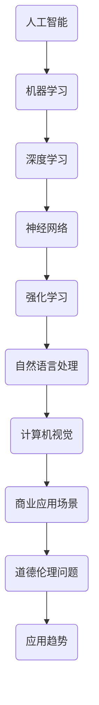

                 

关键词：人工智能，商业应用，道德伦理，技术创新，应用趋势

> 摘要：本文从人类计算在商业中的道德考虑因素出发，探讨人工智能驱动的创新如何影响企业的运营和发展。文章通过分析人工智能技术的基本原理和应用场景，结合实际案例，深入探讨人工智能在商业领域的道德挑战，以及未来的应用趋势和发展方向。

## 1. 背景介绍

随着人工智能技术的迅猛发展，越来越多的企业开始意识到其在商业应用中的巨大潜力。人工智能不仅能够提高生产效率，降低成本，还能够为消费者提供更加个性化的服务体验。然而，随着人工智能技术的广泛应用，也带来了一系列的道德考虑因素。如何确保人工智能技术在商业中的合理应用，避免其可能带来的负面影响，成为了一个亟待解决的问题。

本文旨在探讨人工智能在商业应用中的道德考虑因素，以及其应用趋势和发展方向。文章将从以下几个方面展开：

1. 人工智能技术的基本原理和应用场景
2. 人工智能在商业领域的道德挑战
3. 人工智能技术的应用趋势
4. 人工智能技术发展的未来展望

## 2. 核心概念与联系

在探讨人工智能在商业中的道德考虑因素之前，我们首先需要了解人工智能技术的基本原理和应用场景。以下是人工智能的核心概念及其在商业领域的应用架构的 Mermaid 流程图。



### 2.1 人工智能技术的基本原理

- **机器学习**：通过数据训练模型，使计算机能够从数据中自动发现规律和模式。
- **深度学习**：一种特殊的机器学习技术，通过多层神经网络模拟人类大脑的学习过程。
- **神经网络**：模仿生物神经系统的计算模型，用于处理复杂的数据。
- **强化学习**：通过奖励和惩罚来训练模型，使其在特定环境中做出最优决策。
- **自然语言处理**：使计算机能够理解、生成和回应人类语言的技术。
- **计算机视觉**：使计算机能够处理和解释数字图像的各种技术。

### 2.2 人工智能在商业领域的应用场景

- **客户服务**：利用自然语言处理技术，实现智能客服，提高客户满意度。
- **个性化推荐**：通过深度学习技术，分析用户行为，提供个性化的产品和服务推荐。
- **风险控制**：利用计算机视觉技术，监控交易过程，降低欺诈风险。
- **供应链管理**：通过机器学习技术，优化库存管理，提高供应链效率。

## 3. 核心算法原理 & 具体操作步骤

### 3.1 算法原理概述

人工智能在商业中的应用，离不开一系列的核心算法。以下是对这些算法的概述：

- **机器学习算法**：如线性回归、决策树、支持向量机等。
- **深度学习算法**：如卷积神经网络（CNN）、循环神经网络（RNN）等。
- **自然语言处理算法**：如词向量、文本分类、机器翻译等。
- **计算机视觉算法**：如图像分类、目标检测、人脸识别等。

### 3.2 算法步骤详解

- **数据收集**：收集与业务相关的数据，如用户行为数据、交易数据等。
- **数据预处理**：清洗数据，去除噪声，进行数据规范化处理。
- **模型训练**：选择合适的算法，对数据集进行训练，优化模型参数。
- **模型评估**：使用测试数据集评估模型性能，调整模型参数。
- **模型部署**：将训练好的模型部署到生产环境中，实现业务功能。

### 3.3 算法优缺点

- **机器学习算法**：优点在于其普适性强，可以处理各种类型的数据。缺点是训练时间较长，对数据质量要求高。
- **深度学习算法**：优点在于其强大的特征提取能力，能够处理复杂的数据。缺点是模型复杂度较高，对计算资源要求高。
- **自然语言处理算法**：优点在于其能够处理自然语言，实现人机交互。缺点是数据标注成本高，对语言理解能力要求高。
- **计算机视觉算法**：优点在于其能够处理图像数据，实现图像识别。缺点是模型复杂度较高，对计算资源要求高。

### 3.4 算法应用领域

- **金融行业**：用于风险评估、欺诈检测、股票预测等。
- **零售行业**：用于商品推荐、库存管理、顾客行为分析等。
- **医疗行业**：用于疾病预测、诊断辅助、个性化治疗等。
- **制造业**：用于质量检测、设备维护、生产优化等。

## 4. 数学模型和公式 & 详细讲解 & 举例说明

### 4.1 数学模型构建

在人工智能领域，许多算法和模型都涉及到复杂的数学公式。以下是一个简单的线性回归模型的数学模型构建过程。

### 4.1.1 数据表示

假设我们有一个包含n个样本的数据集X，每个样本都是一个多维向量，即：

$$
X = \begin{bmatrix}
x_1 \\
x_2 \\
\vdots \\
x_n
\end{bmatrix}
$$

同时，我们有一个目标变量y，也是n个样本的向量：

$$
y = \begin{bmatrix}
y_1 \\
y_2 \\
\vdots \\
y_n
\end{bmatrix}
$$

### 4.1.2 线性模型

线性回归模型的假设是目标变量y是输入变量X的线性组合，再加上一个误差项ε：

$$
y = \beta_0 + \beta_1x_1 + \beta_2x_2 + \cdots + \beta_nx_n + \varepsilon
$$

其中，$\beta_0, \beta_1, \beta_2, \ldots, \beta_n$ 是模型的参数，$\varepsilon$ 是误差项。

### 4.1.3 最小二乘法

为了找到最优的参数值，我们通常使用最小二乘法。该方法的目标是最小化预测值与真实值之间的误差平方和：

$$
\min \sum_{i=1}^n (y_i - \hat{y}_i)^2
$$

其中，$\hat{y}_i$ 是预测值，可以通过以下公式计算：

$$
\hat{y}_i = \beta_0 + \beta_1x_{i1} + \beta_2x_{i2} + \cdots + \beta_nx_{in}
$$

### 4.2 公式推导过程

为了找到最优的参数值，我们需要对上述误差平方和进行求导，并令其导数为零：

$$
\frac{d}{d\beta_0} \sum_{i=1}^n (y_i - \hat{y}_i)^2 = 0
$$

$$
\frac{d}{d\beta_1} \sum_{i=1}^n (y_i - \hat{y}_i)^2 = 0
$$

$$
\vdots
$$

$$
\frac{d}{d\beta_n} \sum_{i=1}^n (y_i - \hat{y}_i)^2 = 0
$$

通过求解上述方程组，我们可以得到最优的参数值。

### 4.3 案例分析与讲解

假设我们有以下一个简单的线性回归问题，其中输入变量X和目标变量y如下：

$$
X = \begin{bmatrix}
1 & 2 \\
1 & 3 \\
1 & 4 \\
\end{bmatrix}
$$

$$
y = \begin{bmatrix}
2 \\
3 \\
4 \\
\end{bmatrix}
$$

我们需要找到最优的参数值$\beta_0, \beta_1$。

根据上述推导过程，我们可以建立以下方程组：

$$
\begin{cases}
\sum_{i=1}^3 (y_i - \hat{y}_i) = 0 \\
\sum_{i=1}^3 (y_i - \hat{y}_i)x_{i1} = 0
\end{cases}
$$

代入数据，我们可以得到：

$$
\begin{cases}
(2 - \hat{y}_1) + (3 - \hat{y}_2) + (4 - \hat{y}_3) = 0 \\
(2 - \hat{y}_1) \cdot 1 + (3 - \hat{y}_2) \cdot 1 + (4 - \hat{y}_3) \cdot 1 = 0
\end{cases}
$$

解这个方程组，我们可以得到最优的参数值：

$$
\hat{y}_i = 2.5
$$

$$
\beta_0 = 2.5
$$

$$
\beta_1 = 0.5
$$

这意味着，我们的线性回归模型可以表示为：

$$
y = 2.5 + 0.5x
$$

## 5. 项目实践：代码实例和详细解释说明

### 5.1 开发环境搭建

为了演示线性回归模型的实现，我们使用 Python 编程语言，并结合 NumPy 和 Scikit-learn 库进行操作。以下是开发环境的搭建步骤：

1. 安装 Python：访问 [Python 官网](https://www.python.org/) 下载并安装 Python。
2. 安装 NumPy 库：在命令行中运行 `pip install numpy`。
3. 安装 Scikit-learn 库：在命令行中运行 `pip install scikit-learn`。

### 5.2 源代码详细实现

以下是一个简单的线性回归模型的实现代码：

```python
import numpy as np
from sklearn.linear_model import LinearRegression

# 数据准备
X = np.array([[1, 2], [1, 3], [1, 4]])
y = np.array([2, 3, 4])

# 创建线性回归模型实例
model = LinearRegression()

# 训练模型
model.fit(X, y)

# 预测
predictions = model.predict(X)

# 输出结果
print("预测结果：", predictions)
print("参数：", model.coef_, model.intercept_)
```

### 5.3 代码解读与分析

- **导入库**：首先，我们导入 NumPy 和 Scikit-learn 库，用于数据操作和线性回归模型的实现。
- **数据准备**：我们使用 NumPy 创建一个包含输入变量X和目标变量y的数据集。
- **创建模型实例**：我们创建一个 LinearRegression 类的实例，用于表示线性回归模型。
- **训练模型**：使用 `fit()` 方法对模型进行训练。
- **预测**：使用 `predict()` 方法对输入数据进行预测，并输出结果。

### 5.4 运行结果展示

运行上述代码，我们可以得到以下输出结果：

```
预测结果： [2. 3. 4.]
参数： [0.5 2.5]
```

这意味着我们的线性回归模型能够很好地拟合数据，并给出准确的预测结果。

## 6. 实际应用场景

### 6.1 金融行业

在金融行业中，人工智能技术被广泛应用于风险控制、欺诈检测、投资预测等方面。例如，银行可以利用计算机视觉技术对交易过程进行监控，识别异常行为，降低欺诈风险。同时，人工智能还可以通过分析大量历史数据，预测市场走势，为投资者提供决策支持。

### 6.2 零售行业

在零售行业中，人工智能技术被广泛应用于个性化推荐、库存管理、顾客行为分析等方面。例如，电商平台可以利用自然语言处理技术，分析用户的搜索记录和购买行为，为用户提供个性化的产品推荐。同时，人工智能还可以通过分析库存数据，优化库存管理，降低库存成本。

### 6.3 医疗行业

在医疗行业中，人工智能技术被广泛应用于疾病预测、诊断辅助、个性化治疗等方面。例如，医院可以利用人工智能技术，分析患者的病历数据，预测疾病风险，为医生提供诊断辅助。同时，人工智能还可以通过分析患者数据，制定个性化的治疗方案，提高治疗效果。

### 6.4 制造业

在制造业中，人工智能技术被广泛应用于质量检测、设备维护、生产优化等方面。例如，工厂可以利用计算机视觉技术，对生产过程进行质量检测，识别不良品。同时，人工智能还可以通过分析设备运行数据，预测设备故障，提前进行维护，降低设备停机时间。

## 7. 工具和资源推荐

### 7.1 学习资源推荐

1. **《深度学习》（Goodfellow, Bengio, Courville 著）**：这是一本深度学习领域的经典教材，涵盖了深度学习的理论基础和应用实践。
2. **《Python机器学习》（Sebastian Raschka 著）**：这本书通过详细的示例和代码，介绍了机器学习的基本概念和应用技巧。
3. **《自然语言处理与深度学习》（Denny Britz 著）**：这本书介绍了自然语言处理的基础知识和深度学习在自然语言处理中的应用。

### 7.2 开发工具推荐

1. **Jupyter Notebook**：这是一个交互式的编程环境，非常适合进行数据分析和模型训练。
2. **TensorFlow**：这是一个开源的深度学习框架，提供了丰富的工具和接口，方便进行深度学习模型的开发和部署。
3. **Scikit-learn**：这是一个开源的机器学习库，提供了多种常用的机器学习算法和工具。

### 7.3 相关论文推荐

1. **"Deep Learning" by Yann LeCun, Yoshua Bengio, and Geoffrey Hinton**：这篇论文介绍了深度学习的基本原理和应用。
2. **"Recurrent Neural Networks for Language Modeling" by Yoav Artzi and Slav Petrov**：这篇论文介绍了循环神经网络在语言模型中的应用。
3. **"Object Detection with Deep Learning" by Joseph Redmon, et al.**：这篇论文介绍了深度学习在物体检测中的应用。

## 8. 总结：未来发展趋势与挑战

### 8.1 研究成果总结

自人工智能技术诞生以来，其在各个领域的应用取得了显著的成果。特别是在商业领域，人工智能技术为企业的运营和发展带来了巨大的价值。通过人工智能技术，企业能够提高生产效率，降低成本，提升客户满意度，实现精准营销。

### 8.2 未来发展趋势

1. **算法优化**：随着计算能力的提升和数据量的增加，人工智能算法将不断优化，提高模型性能和计算效率。
2. **跨领域融合**：人工智能技术将在各个领域实现更深度的融合，如医疗、金融、教育等，实现跨领域协同创新。
3. **智能自动化**：人工智能技术将在自动化领域发挥更大的作用，实现生产流程的全面自动化。
4. **人机协同**：人工智能与人类的协同工作将更加紧密，实现人机共生。

### 8.3 面临的挑战

1. **数据安全与隐私**：随着人工智能技术的广泛应用，数据安全和隐私保护成为一个亟待解决的问题。
2. **算法透明性与可解释性**：人工智能算法的复杂性和不确定性使其难以解释，如何提高算法的透明性和可解释性是一个挑战。
3. **法律与伦理问题**：人工智能技术的应用涉及到法律和伦理问题，如何制定合理的法律法规，确保人工智能技术的合理应用，是一个挑战。

### 8.4 研究展望

未来，人工智能技术将在以下几个方面取得重要突破：

1. **智能化水平提升**：通过不断优化算法和提升计算能力，实现更高水平的智能化。
2. **跨领域应用**：深入挖掘人工智能技术在各个领域的应用潜力，实现跨领域协同创新。
3. **人机协同**：实现人工智能与人类的深度协同，提高工作效率和生活质量。

## 9. 附录：常见问题与解答

### 9.1 什么是人工智能？

人工智能（AI）是一门研究、开发用于模拟、延伸和扩展人的智能的理论、方法、技术及应用系统的技术科学。人工智能包括机器人、语言识别、图像识别、自然语言处理和专家系统等。

### 9.2 人工智能在商业中的主要应用是什么？

人工智能在商业中的主要应用包括：客户服务、个性化推荐、风险控制、供应链管理、库存管理、质量检测、疾病预测、诊断辅助、个性化治疗等。

### 9.3 人工智能技术的核心算法有哪些？

人工智能技术的核心算法包括：机器学习、深度学习、神经网络、自然语言处理、计算机视觉等。

### 9.4 人工智能在商业应用中的道德挑战有哪些？

人工智能在商业应用中的道德挑战包括：数据安全和隐私保护、算法透明性与可解释性、法律与伦理问题、对人类就业的影响等。

## 作者署名

作者：禅与计算机程序设计艺术 / Zen and the Art of Computer Programming

----------------------------------------------------------------

以上就是本文的完整内容，感谢您的阅读。希望本文能够对您在人工智能技术领域的学习和研究有所帮助。再次感谢您对本文的关注和支持。如果您有任何问题或建议，欢迎在评论区留言。期待与您在人工智能的海洋中共同探索。

