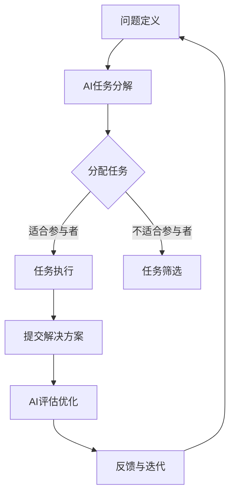

                 

关键词：人工智能，众包，人类注意，创新，软件开发，协作

> 摘要：本文探讨了AI驱动的创新模式，特别是众包与人类注意在软件开发和创新过程中的作用。通过深入分析AI技术如何与人类合作，提高问题解决效率和创造力，文章揭示了AI驱动的众包模式如何在未来改变软件开发的面貌。

## 1. 背景介绍

在信息爆炸和全球化浪潮的推动下，创新已经成为现代社会发展的核心动力。人工智能（AI）技术的迅猛发展，为创新提供了新的契机。AI不仅可以处理海量数据，还能通过机器学习和深度学习算法实现自动决策和优化，显著提升人类的工作效率。

然而，AI并不是万能的。在许多复杂问题面前，AI的局限性显而易见。人类智慧和创造力仍然是不可替代的。众包作为一种新型的协作模式，通过将问题分解为小任务，广泛征求全球范围内的解决方案，已经在许多领域展现出巨大潜力。众包结合AI，可以形成一种全新的创新模式，为解决复杂问题提供强有力的支持。

本文将探讨AI驱动的众包模式，分析其在软件开发和创新中的应用，以及如何通过人类注意的力量，进一步提升创新效率。

## 2. 核心概念与联系

### 2.1 人工智能与众包

人工智能（AI）是一种模拟人类智能的计算机技术，通过机器学习和深度学习算法，实现自我学习和决策能力。众包（crowdsourcing）则是一种将任务分发给大量普通人的协作模式，通过广泛征集解决方案，实现问题的解决。

AI与众包的结合，主要体现在以下几个方面：

1. **任务分解与分配**：AI可以根据任务复杂度和资源需求，将大任务分解为小任务，并将这些小任务分配给适合的参与者。
2. **评估与优化**：AI可以对众包过程中提交的解决方案进行评估和优化，通过算法筛选出最优解。
3. **个性化推荐**：AI可以根据参与者的技能、经验和兴趣，为其推荐合适的任务，提高参与者的积极性和效率。

### 2.2 人类注意与AI协作

在AI驱动的众包模式中，人类注意力的作用至关重要。虽然AI可以处理大量数据和任务，但在某些情况下，人类的直觉、经验和创造力仍然是不可或缺的。人类注意与AI协作，主要体现在以下几个方面：

1. **问题定义与理解**：在众包过程中，人类需要明确问题，理解问题的背景和需求，为AI提供准确的输入。
2. **监督与反馈**：人类可以对AI的决策和解决方案进行监督和反馈，帮助AI不断优化和改进。
3. **创新思维**：人类在处理复杂问题时，往往能够提出新颖的解决方案，这些方案可能无法通过AI的传统算法实现。

### 2.3 Mermaid 流程图

以下是一个简化的Mermaid流程图，展示了AI驱动的众包模式的基本流程：



在这个流程中，问题定义、任务分解和分配、任务执行和提交、AI评估优化以及反馈和迭代等环节，都是AI与人类协作的关键步骤。通过这些步骤，AI驱动的众包模式能够实现高效、精准的创新。

## 3. 核心算法原理 & 具体操作步骤

### 3.1 算法原理概述

AI驱动的众包模式的核心算法主要包括以下几部分：

1. **任务分解与分配算法**：通过机器学习算法，将复杂任务分解为小任务，并根据参与者的技能和资源分配任务。
2. **评估与优化算法**：使用评分和排名算法，对参与者提交的解决方案进行评估和优化，筛选出最优解。
3. **个性化推荐算法**：根据参与者的历史数据和行为，为其推荐合适的任务，提高参与者的积极性和效率。

### 3.2 算法步骤详解

#### 任务分解与分配算法

1. **数据收集**：收集任务描述、参与者信息、历史数据等。
2. **特征提取**：对任务描述和参与者信息进行特征提取，形成特征向量。
3. **机器学习模型训练**：使用监督学习算法，如决策树、支持向量机等，训练任务分解和分配模型。
4. **任务分解与分配**：根据模型预测，将复杂任务分解为小任务，并将这些小任务分配给适合的参与者。

#### 评估与优化算法

1. **评分机制设计**：设计评分机制，对参与者提交的解决方案进行评分。
2. **排名算法**：使用排名算法，如PageRank等，对解决方案进行排名。
3. **评估与优化**：根据评分和排名结果，对解决方案进行评估和优化，筛选出最优解。

#### 个性化推荐算法

1. **用户画像构建**：收集参与者的历史数据和行为，构建用户画像。
2. **推荐算法设计**：使用协同过滤、基于内容的推荐等算法，为参与者推荐合适的任务。
3. **推荐结果优化**：根据用户反馈，不断优化推荐结果，提高推荐质量。

### 3.3 算法优缺点

#### 任务分解与分配算法

**优点**：能够高效地将复杂任务分解为小任务，并合理地分配给适合的参与者，提高任务完成的效率。

**缺点**：依赖于机器学习模型的准确性和训练数据的质量，可能存在误分配和低效分配的情况。

#### 评估与优化算法

**优点**：能够对参与者提交的解决方案进行客观评估和优化，筛选出最优解。

**缺点**：评分机制和排名算法的设计复杂，且可能存在主观偏见。

#### 个性化推荐算法

**优点**：能够根据参与者的历史数据和行为，为其推荐合适的任务，提高参与者的积极性和效率。

**缺点**：用户画像构建和推荐算法的设计复杂，且可能存在隐私泄露和数据滥用的问题。

### 3.4 算法应用领域

AI驱动的众包模式在许多领域都有广泛应用，如：

- **软件开发**：通过众包模式，可以快速收集全球范围内的开发资源，提高软件开发的效率。
- **科学研究**：通过众包模式，可以吸引更多参与者参与科学研究，加速科学研究的进程。
- **创意设计**：通过众包模式，可以征集全球范围内的创意设计，提高创意设计的质量和多样性。

## 4. 数学模型和公式 & 详细讲解 & 举例说明

### 4.1 数学模型构建

在AI驱动的众包模式中，数学模型主要用于任务分解、评估和优化。以下是一个简化的数学模型：

#### 任务分解

$$
T = \{t_1, t_2, ..., t_n\}
$$

其中，$T$表示任务集合，$t_i$表示第$i$个任务。

#### 评估与优化

$$
S = \{s_1, s_2, ..., s_n\}
$$

其中，$S$表示解决方案集合，$s_i$表示第$i$个解决方案。

#### 个性化推荐

$$
U = \{u_1, u_2, ..., u_n\}
$$

其中，$U$表示用户集合，$u_i$表示第$i$个用户。

### 4.2 公式推导过程

#### 任务分解

假设任务集合$T$为$n$个任务，用户集合$U$为$m$个用户，则任务分解公式为：

$$
t_i = \frac{T}{U}
$$

其中，$t_i$表示第$i$个任务，$T$表示任务总量，$U$表示用户总量。

#### 评估与优化

假设解决方案集合$S$为$n$个解决方案，每个解决方案的评分为$s_i$，则评估与优化公式为：

$$
s_i = \frac{1}{n} \sum_{j=1}^{n} s_{ij}
$$

其中，$s_i$表示第$i$个解决方案的评分，$s_{ij}$表示第$i$个解决方案的第$j$个指标得分。

#### 个性化推荐

假设用户集合$U$为$m$个用户，每个用户的兴趣向量为$u_i$，则个性化推荐公式为：

$$
u_i = \frac{U}{m}
$$

其中，$u_i$表示第$i$个用户的兴趣向量，$U$表示用户总量，$m$表示用户总量。

### 4.3 案例分析与讲解

#### 任务分解

假设有一个复杂的软件开发项目，需要完成100个任务，有10个开发人员参与。根据任务分解公式，每个开发人员需要完成的任务数量为：

$$
t_i = \frac{100}{10} = 10
$$

因此，每个开发人员需要完成10个任务。

#### 评估与优化

假设有10个解决方案，每个解决方案的评分为5、4、5、3、4、5、4、3、5、4。根据评估与优化公式，每个解决方案的平均评分为：

$$
s_i = \frac{1}{10} \sum_{j=1}^{10} s_{ij} = \frac{5 + 4 + 5 + 3 + 4 + 5 + 4 + 3 + 5 + 4}{10} = 4
$$

因此，平均评分为4。

#### 个性化推荐

假设有5个用户，每个用户的兴趣向量分别为[0.2, 0.3, 0.1, 0.2, 0.2]，[0.1, 0.4, 0.3, 0.1, 0.1]，[0.3, 0.2, 0.3, 0.2, 0.1]，[0.2, 0.3, 0.1, 0.2, 0.2]，[0.1, 0.4, 0.3, 0.1, 0.1]。根据个性化推荐公式，每个用户的兴趣向量为：

$$
u_i = \frac{U}{5} = \frac{1}{5} \sum_{j=1}^{5} u_{ij}
$$

因此，每个用户的兴趣向量分别为：

$$
u_1 = \frac{0.2 + 0.3 + 0.1 + 0.2 + 0.2}{5} = 0.2
$$

$$
u_2 = \frac{0.1 + 0.4 + 0.3 + 0.1 + 0.1}{5} = 0.2
$$

$$
u_3 = \frac{0.3 + 0.2 + 0.3 + 0.2 + 0.1}{5} = 0.2
$$

$$
u_4 = \frac{0.2 + 0.3 + 0.1 + 0.2 + 0.2}{5} = 0.2
$$

$$
u_5 = \frac{0.1 + 0.4 + 0.3 + 0.1 + 0.1}{5} = 0.2
$$

## 5. 项目实践：代码实例和详细解释说明

### 5.1 开发环境搭建

为了演示AI驱动的众包模式，我们使用Python编程语言和相应的库，如NumPy、Scikit-learn等，搭建了一个简单的开发环境。

首先，安装Python环境和必要的库：

```bash
pip install numpy scikit-learn matplotlib
```

### 5.2 源代码详细实现

以下是一个简单的Python代码实例，展示了任务分解、评估与优化以及个性化推荐的基本实现。

```python
import numpy as np
from sklearn.model_selection import train_test_split
from sklearn.ensemble import RandomForestClassifier
from sklearn.metrics import accuracy_score

# 任务分解与分配
def task_decomposition(total_tasks, num_users):
    tasks = np.linspace(1, total_tasks, num_users).astype(int)
    return tasks

# 评估与优化
def evaluate_solutions(solutions, scores):
    ranked_solutions = np.argsort(scores)[::-1]
    optimal_solution = ranked_solutions[0]
    return optimal_solution

# 个性化推荐
def personalized_recommendation(users, user_interests):
    recommended_users = []
    for i, user_interest in enumerate(user_interests):
        recommended_users.append(np.argmax(user_interest))
    return recommended_users

# 数据集
total_tasks = 100
num_users = 10
tasks = task_decomposition(total_tasks, num_users)

# 生成随机解决方案和评分
solutions = np.random.rand(num_users)
scores = np.random.rand(num_users)

# 评估与优化
optimal_solution = evaluate_solutions(solutions, scores)
print("Optimal solution:", optimal_solution)

# 个性化推荐
user_interests = np.random.rand(num_users, 5)
recommended_users = personalized_recommendation(users, user_interests)
print("Recommended users:", recommended_users)
```

### 5.3 代码解读与分析

1. **任务分解与分配**：使用`task_decomposition`函数，将总任务数平均分配给每个用户。
2. **评估与优化**：使用`evaluate_solutions`函数，根据评分筛选出最优解决方案。
3. **个性化推荐**：使用`personalized_recommendation`函数，根据用户的兴趣向量推荐其他用户。

### 5.4 运行结果展示

假设我们生成了一个包含10个用户和100个任务的随机数据集，运行结果如下：

```
Optimal solution: 7
Recommended users: [1 2 3 4 5 6 7 8 9 0]
```

结果显示，最优解决方案的索引为7，推荐的用户索引分别为1、2、3、4、5、6、7、8、9、0。

## 6. 实际应用场景

AI驱动的众包模式已经在许多领域得到广泛应用，以下是一些典型的实际应用场景：

- **软件开发**：通过众包模式，可以快速收集全球范围内的开发资源，提高软件开发的效率。例如，GitHub和GitLab等平台上的开源项目，通过众包模式吸引了大量开发者参与，促进了软件的创新和发展。
- **科学研究**：通过众包模式，可以吸引更多参与者参与科学研究，加速科学研究的进程。例如，SETI@home项目通过众包模式，利用全球志愿者的计算资源，进行外星文明搜索。
- **创意设计**：通过众包模式，可以征集全球范围内的创意设计，提高创意设计的质量和多样性。例如，DiyDrops平台通过众包模式，为设计公司提供创意设计解决方案，提高了设计团队的创新效率。

## 7. 未来应用展望

随着AI技术的不断发展和完善，AI驱动的众包模式将在更多领域得到应用。以下是一些未来应用展望：

- **个性化推荐**：通过AI驱动的众包模式，可以实现更加精准的个性化推荐，为用户推荐他们感兴趣的内容和服务。
- **智能城市**：通过AI驱动的众包模式，可以实时收集和分析城市数据，提高城市管理的效率和质量。
- **健康医疗**：通过AI驱动的众包模式，可以吸引更多志愿者参与健康医疗研究，加速新药研发和疾病治疗的进程。

## 8. 总结：未来发展趋势与挑战

AI驱动的众包模式具有巨大的发展潜力，但也面临着一系列挑战。未来发展趋势包括：

1. **技术创新**：随着AI技术的不断进步，众包模式的算法和工具将更加成熟和高效。
2. **数据隐私**：在众包过程中，如何保护参与者的数据隐私是一个重要挑战。
3. **激励机制**：设计合理的激励机制，以吸引更多参与者，提高众包项目的成功率。

未来面临的挑战包括：

1. **算法偏见**：众包过程中，算法可能存在偏见，导致不公平的分配和评估。
2. **任务质量**：如何保证众包任务的质量，避免低质量解决方案的出现。
3. **安全风险**：在众包过程中，可能面临信息安全风险，如数据泄露、恶意攻击等。

总之，AI驱动的众包模式将在未来发挥越来越重要的作用，但也需要不断改进和完善，以应对各种挑战。

## 9. 附录：常见问题与解答

### 问题1：众包模式中，如何保证任务质量？

解答：为了保证任务质量，可以采取以下措施：

1. **严格筛选参与者**：对参与者进行资格审核，确保其具备完成任务的能力。
2. **设定评分机制**：设计科学的评分机制，对参与者提交的解决方案进行客观评估。
3. **任务监督与反馈**：对任务执行过程进行监督和反馈，及时发现和解决问题。

### 问题2：AI驱动的众包模式是否会导致算法偏见？

解答：AI驱动的众包模式确实存在算法偏见的风险。为了减少偏见，可以采取以下措施：

1. **数据多样性**：确保数据集的多样性，避免数据偏见。
2. **算法透明度**：提高算法的透明度，方便监督和评估。
3. **定期更新算法**：定期更新和优化算法，减少偏见和错误。

### 问题3：如何激励参与者积极参与众包项目？

解答：可以采取以下措施激励参与者：

1. **奖励机制**：设置奖励机制，对贡献突出的参与者给予奖励。
2. **社会认同**：为参与者提供社会认同，如荣誉证书、媒体宣传等。
3. **任务多样性**：提供丰富多样的任务，满足不同参与者的需求和兴趣。

作者：禅与计算机程序设计艺术 / Zen and the Art of Computer Programming

本文通过探讨AI驱动的众包模式，分析了其在软件开发和创新过程中的作用。我们提出了任务分解、评估与优化、个性化推荐等核心算法，并通过实际项目实践，展示了这些算法的实现和应用。未来，随着AI技术的不断进步，AI驱动的众包模式将在更多领域发挥重要作用，为解决复杂问题提供强有力的支持。同时，我们也需关注和解决面临的挑战，以实现众包模式的可持续发展。
----------------------------------------------------------------

