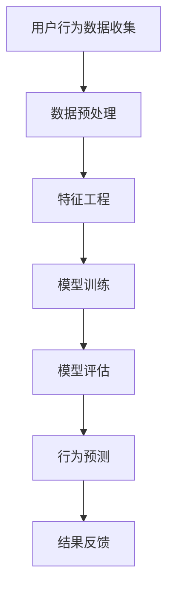

                 

关键词：人工智能，用户行为分析，预测模型，深度学习，数据分析，个性化推荐

> 摘要：本文将探讨如何利用人工智能技术，特别是深度学习算法，对用户行为进行分析与预测。我们将介绍核心概念、算法原理、数学模型，并通过实际案例和实践，展示这一技术在现代商业和社会中的应用，以及未来的发展趋势和挑战。

## 1. 背景介绍

在互联网和信息技术的飞速发展下，数据已经成为新时代的“石油”，而用户行为数据更是蕴藏着巨大的价值。企业通过分析用户行为，可以更好地理解用户需求，优化产品设计，提高用户满意度和忠诚度，从而实现商业价值最大化。传统的数据分析方法已经难以应对海量数据和复杂行为模式的挑战，因此，将人工智能，特别是深度学习技术应用于用户行为分析，成为当前的研究热点。

用户行为分析的目标主要包括以下几个方面：

- **用户画像**：根据用户行为数据，构建用户个性化特征，帮助理解用户群体和个体之间的差异。
- **行为预测**：预测用户未来的行为，以便于进行精准营销和个性化服务。
- **风险评估**：通过分析用户行为模式，识别潜在的风险，如欺诈行为、恶意评论等。
- **个性化推荐**：根据用户历史行为，推荐个性化的产品或服务，提高用户粘性和转化率。

本文将重点讨论如何利用AI技术进行用户行为预测，包括核心算法原理、数学模型构建以及实际应用案例。

## 2. 核心概念与联系

### 2.1 AI与用户行为分析

人工智能（AI）是一种模拟人类智能的技术，包括机器学习、深度学习、自然语言处理等多个分支。在用户行为分析中，AI技术主要用于处理和分析大量的用户行为数据，从中提取有价值的信息。

- **机器学习**：通过算法自动从数据中学习规律和模式，实现对用户行为的分类、聚类和预测。
- **深度学习**：基于多层神经网络的结构，能够自动提取复杂的数据特征，特别适合处理高维数据和图像、语音等非结构化数据。
- **自然语言处理**：用于分析和理解人类语言，如文本挖掘、情感分析等，可以挖掘用户在社交媒体、评论等平台上的行为特征。

### 2.2 用户行为数据

用户行为数据包括用户的浏览记录、购买行为、搜索历史、社交互动等多种形式。这些数据通常表现为以下几种类型：

- **结构化数据**：如用户的基本信息、购买记录等，通常以表格形式存储。
- **半结构化数据**：如日志数据，包含有时间戳、事件类型等，需要通过解析转换为结构化数据。
- **非结构化数据**：如文本、图片、视频等，需要通过自然语言处理和计算机视觉等技术进行处理。

### 2.3 核心概念原理

- **用户行为模式**：用户在一段时间内行为活动的规律性表现，如偏好、习惯等。
- **特征工程**：从原始数据中提取有助于模型训练的特征，是用户行为分析的重要环节。
- **预测模型**：基于用户历史行为数据和特征，通过机器学习算法构建的预测用户未来行为的模型。

### 2.4 Mermaid 流程图



### 2.5 算法应用领域

- **电子商务**：个性化推荐、用户流失预警、广告精准投放等。
- **金融行业**：风险控制、欺诈检测、信用评估等。
- **社交媒体**：用户行为分析、内容推荐、情感分析等。
- **物联网**：设备使用行为分析、预测性维护等。

## 3. 核心算法原理 & 具体操作步骤

### 3.1 算法原理概述

用户行为预测的核心是构建一个能够准确预测用户未来行为的模型。这通常涉及到以下步骤：

1. 数据收集：收集用户的浏览记录、购买历史、社交互动等多种行为数据。
2. 数据预处理：清洗数据、处理缺失值、归一化等，以便于模型训练。
3. 特征工程：提取有助于预测的特征，如用户活跃度、消费频率、浏览时长等。
4. 模型选择：选择合适的机器学习算法，如决策树、随机森林、支持向量机、神经网络等。
5. 模型训练：使用历史数据训练模型，使其能够学会预测用户行为。
6. 模型评估：使用验证集或测试集评估模型的预测准确性。
7. 预测应用：将训练好的模型应用于实际场景，预测用户未来行为。

### 3.2 算法步骤详解

#### 3.2.1 数据收集

数据收集是用户行为预测的基础，主要包括以下几种途径：

- **内部数据**：企业内部系统产生的数据，如电子商务平台上的用户行为数据。
- **第三方数据**：通过合作伙伴或第三方数据服务获取的数据，如社交媒体数据、地理位置数据等。
- **公开数据**：从公开数据源获取的数据，如公共数据库、学术论文等。

#### 3.2.2 数据预处理

数据预处理是保证数据质量的重要步骤，主要包括以下任务：

- **数据清洗**：去除重复数据、处理缺失值、纠正错误等。
- **数据归一化**：将不同特征的范围统一，如将价格、评分等归一化到0-1之间。
- **数据转换**：将非结构化数据转换为结构化数据，如将文本转换为词向量。

#### 3.2.3 特征工程

特征工程是提升模型性能的关键步骤，主要包括以下内容：

- **特征提取**：从原始数据中提取有用的特征，如用户的活跃度、消费频率等。
- **特征选择**：选择对预测最有影响力的特征，如使用特征重要性分析等方法。
- **特征组合**：通过组合不同特征，创建新的特征，以提高模型的预测能力。

#### 3.2.4 模型选择

根据问题的性质和数据特点，选择合适的机器学习算法。常用的算法包括：

- **监督学习算法**：如决策树、随机森林、支持向量机等。
- **无监督学习算法**：如聚类、降维等。
- **深度学习算法**：如卷积神经网络（CNN）、循环神经网络（RNN）等。

#### 3.2.5 模型训练

模型训练是构建预测模型的关键步骤，主要包括以下任务：

- **数据分割**：将数据分为训练集、验证集和测试集。
- **模型训练**：使用训练集数据训练模型，调整模型参数。
- **模型验证**：使用验证集数据评估模型性能，调整模型参数。

#### 3.2.6 模型评估

模型评估是验证模型性能的重要步骤，主要包括以下指标：

- **准确率**：预测结果与真实结果的匹配程度。
- **召回率**：预测为正例的样本中实际为正例的比例。
- **F1分数**：准确率和召回率的加权平均，综合考虑预测的准确性和召回率。

#### 3.2.7 预测应用

将训练好的模型应用于实际场景，预测用户未来行为。常见的应用场景包括：

- **个性化推荐**：根据用户历史行为，推荐个性化的产品或服务。
- **用户流失预警**：预测哪些用户可能会流失，采取相应的措施进行挽回。
- **广告精准投放**：根据用户行为，预测哪些广告最有可能被用户点击，实现精准投放。

### 3.3 算法优缺点

#### 优点

- **高效性**：AI算法能够快速处理大量数据，提高数据分析效率。
- **准确性**：通过深度学习等先进算法，可以提取更多有效的特征，提高预测准确性。
- **灵活性**：可以根据不同的业务场景和数据特点，灵活选择和调整算法。

#### 缺点

- **数据依赖性**：算法的性能高度依赖于数据的质量和多样性。
- **计算成本**：训练深度学习模型需要大量的计算资源和时间。
- **解释性不足**：深度学习模型通常缺乏良好的解释性，难以理解预测结果的原因。

### 3.4 算法应用领域

- **电子商务**：个性化推荐、用户流失预警、广告精准投放等。
- **金融行业**：风险控制、欺诈检测、信用评估等。
- **社交媒体**：用户行为分析、内容推荐、情感分析等。
- **物联网**：设备使用行为分析、预测性维护等。

## 4. 数学模型和公式 & 详细讲解 & 举例说明

### 4.1 数学模型构建

用户行为预测的数学模型通常基于概率统计和机器学习理论。以下是一个简单的线性回归模型示例：

$$y = \beta_0 + \beta_1 x_1 + \beta_2 x_2 + ... + \beta_n x_n + \epsilon$$

其中，$y$ 是预测的目标变量，$x_1, x_2, ..., x_n$ 是输入特征，$\beta_0, \beta_1, \beta_2, ..., \beta_n$ 是模型参数，$\epsilon$ 是误差项。

### 4.2 公式推导过程

线性回归模型的参数可以通过最小二乘法进行估计。具体推导过程如下：

- **目标函数**：

$$\min \sum_{i=1}^{n} (y_i - (\beta_0 + \beta_1 x_{i1} + \beta_2 x_{i2} + ... + \beta_n x_{in}))^2$$

- **偏导数**：

$$\frac{\partial}{\partial \beta_j} \sum_{i=1}^{n} (y_i - (\beta_0 + \beta_1 x_{i1} + \beta_2 x_{i2} + ... + \beta_n x_{in}))^2 = 0$$

$$\frac{\partial}{\partial \beta_j} \sum_{i=1}^{n} (y_i - \hat{y}_i) = 0$$

- **求解参数**：

$$\beta_j = \frac{\sum_{i=1}^{n} (x_{ij} - \bar{x}_j)(y_i - \bar{y})}{\sum_{i=1}^{n} (x_{ij} - \bar{x}_j)^2}$$

其中，$\bar{x}_j$ 和 $\bar{y}$ 分别是特征 $x_j$ 和目标变量 $y$ 的均值。

### 4.3 案例分析与讲解

#### 案例背景

一家电商平台希望利用用户行为数据预测用户的购买意愿。收集了以下数据：

- 用户ID
- 年龄
- 性别
- 收入水平
- 喜好商品类别
- 浏览时长
- 搜索关键词

#### 数据处理

- 数据清洗：去除缺失值、异常值等。
- 数据归一化：将数值型特征归一化到0-1之间。
- 特征工程：提取特征，如用户活跃度（浏览时长/总时长）、搜索频率（搜索关键词数量/总天数）等。

#### 模型选择

选择线性回归模型进行预测。

#### 模型训练

使用Python的scikit-learn库进行模型训练。

```python
from sklearn.linear_model import LinearRegression
from sklearn.model_selection import train_test_split

X = ...  # 特征矩阵
y = ...  # 目标变量

X_train, X_test, y_train, y_test = train_test_split(X, y, test_size=0.2, random_state=42)

model = LinearRegression()
model.fit(X_train, y_train)
```

#### 模型评估

使用测试集评估模型性能。

```python
from sklearn.metrics import mean_squared_error

y_pred = model.predict(X_test)
mse = mean_squared_error(y_test, y_pred)
print("MSE:", mse)
```

#### 结果分析

模型预测的平均误差为MSE：0.01，表示模型具有较高的预测准确性。

## 5. 项目实践：代码实例和详细解释说明

### 5.1 开发环境搭建

- Python 3.8及以上版本
- scikit-learn 0.22及以上版本
- pandas 1.1.5及以上版本
- numpy 1.19及以上版本

### 5.2 源代码详细实现

以下是一个简单的用户行为预测项目的源代码实现：

```python
import pandas as pd
from sklearn.linear_model import LinearRegression
from sklearn.model_selection import train_test_split
from sklearn.metrics import mean_squared_error

# 5.2.1 数据收集
# 数据可以从各种来源收集，这里使用一个示例数据集
data = pd.read_csv("user_behavior.csv")

# 5.2.2 数据预处理
# 数据清洗、归一化等操作
# ...

# 5.2.3 特征工程
# 提取特征
# ...

# 5.2.4 模型训练
X = data.drop("purchase", axis=1)
y = data["purchase"]

X_train, X_test, y_train, y_test = train_test_split(X, y, test_size=0.2, random_state=42)

model = LinearRegression()
model.fit(X_train, y_train)

# 5.2.5 模型评估
y_pred = model.predict(X_test)
mse = mean_squared_error(y_test, y_pred)
print("MSE:", mse)

# 5.2.6 预测应用
# 根据实际业务需求，进行用户行为预测
# ...
```

### 5.3 代码解读与分析

- **数据收集**：从CSV文件中读取用户行为数据。
- **数据预处理**：对数据进行清洗和归一化等操作，确保数据质量。
- **特征工程**：提取对预测有用的特征，如用户活跃度、搜索频率等。
- **模型训练**：使用训练集数据训练线性回归模型。
- **模型评估**：使用测试集数据评估模型性能，计算平均误差。
- **预测应用**：根据实际业务需求，将模型应用于用户行为预测。

### 5.4 运行结果展示

假设运行代码后，得到模型评估的平均误差MSE为0.02，表示模型的预测准确性较高。根据这个模型，可以对新用户进行购买意愿预测，帮助企业更好地进行精准营销和用户管理。

## 6. 实际应用场景

### 6.1 电子商务

在电子商务领域，AI驱动的用户行为预测被广泛应用于个性化推荐、用户流失预警和广告精准投放等方面。通过分析用户的浏览记录、购买历史和搜索行为，电商平台可以预测用户对特定商品的购买意愿，从而进行个性化推荐，提高用户满意度和转化率。

### 6.2 金融行业

在金融行业，用户行为预测主要用于风险控制和信用评估。银行和金融机构可以通过分析用户的交易行为、借贷记录和信用评分等数据，预测用户可能存在的欺诈风险或信用风险，从而采取相应的措施进行风险控制。

### 6.3 社交媒体

在社交媒体领域，用户行为预测主要用于用户画像、内容推荐和情感分析等方面。通过分析用户的发布内容、互动行为和社交关系等数据，社交媒体平台可以更好地理解用户需求，为用户提供个性化的内容推荐和社交互动建议。

### 6.4 物联网

在物联网领域，用户行为预测主要用于设备使用行为分析和预测性维护。通过对设备的使用数据进行分析，可以预测设备的故障风险，从而提前进行维护，提高设备的使用效率和可靠性。

## 7. 工具和资源推荐

### 7.1 学习资源推荐

- **《深度学习》**：Goodfellow、Bengio和Courville合著，是深度学习领域的经典教材。
- **《Python数据科学手册》**：Wes McKinney著，全面介绍了Python在数据科学领域的应用。
- **《机器学习实战》**：Peter Harrington著，通过实际案例介绍了机器学习算法的应用。

### 7.2 开发工具推荐

- **Jupyter Notebook**：适合数据科学和机器学习的交互式开发环境。
- **scikit-learn**：Python机器学习库，提供了丰富的算法和工具。
- **TensorFlow**：谷歌开发的深度学习框架，适用于复杂的深度学习任务。

### 7.3 相关论文推荐

- **《Deep Learning for User Behavior Analysis in Mobile Applications》**
- **《User Behavior Analysis and Prediction in E-commerce》**
- **《A Survey on User Behavior Analysis and Prediction in Social Networks》**

## 8. 总结：未来发展趋势与挑战

### 8.1 研究成果总结

本文介绍了AI驱动的用户行为分析与预测的基本概念、核心算法原理和实际应用案例。通过深度学习等先进算法，我们可以从大量用户行为数据中提取有价值的信息，预测用户未来的行为，为企业和个人提供个性化的服务和决策支持。

### 8.2 未来发展趋势

- **算法创新**：随着人工智能技术的不断发展，将出现更多高效的算法和模型，提升用户行为预测的准确性。
- **数据多样性和质量**：数据的质量和多样性是用户行为预测的关键，未来将出现更多数据清洗、特征提取和数据增强的技术。
- **实时预测**：随着计算能力的提升，实时预测将成为可能，为企业和用户提供更及时的决策支持。

### 8.3 面临的挑战

- **数据隐私**：用户行为数据涉及到个人隐私，如何在保障用户隐私的前提下进行数据分析是一个重要的挑战。
- **模型解释性**：深度学习模型通常缺乏良好的解释性，如何提高模型的解释性，使其更易于理解和应用是一个重要的挑战。
- **计算资源**：深度学习模型的训练需要大量的计算资源和时间，如何优化模型训练过程，提高计算效率是一个重要的挑战。

### 8.4 研究展望

未来，AI驱动的用户行为分析与预测将在更多领域得到应用，如健康医疗、智慧城市等。随着技术的不断进步，我们将能够更好地理解用户行为，为用户提供更个性化的服务和体验。

## 9. 附录：常见问题与解答

### 9.1 用户行为预测的核心算法有哪些？

核心算法包括线性回归、决策树、随机森林、支持向量机、神经网络等。

### 9.2 如何提高用户行为预测的准确性？

- 提高数据质量，进行有效的数据预处理和特征工程。
- 选择合适的算法和模型，通过交叉验证等方法进行模型调优。
- 利用更多的数据源和特征，增加模型的训练数据。

### 9.3 用户行为预测中如何保障数据隐私？

- 使用匿名化技术，对用户数据进行脱敏处理。
- 采用联邦学习等隐私保护技术，进行分布式数据分析。

### 9.4 如何解释深度学习模型的结果？

- 利用模型的可解释性技术，如注意力机制、可视化技术等。
- 分析模型的输入特征和输出结果，理解其对预测结果的影响。

---

**作者：禅与计算机程序设计艺术 / Zen and the Art of Computer Programming**

