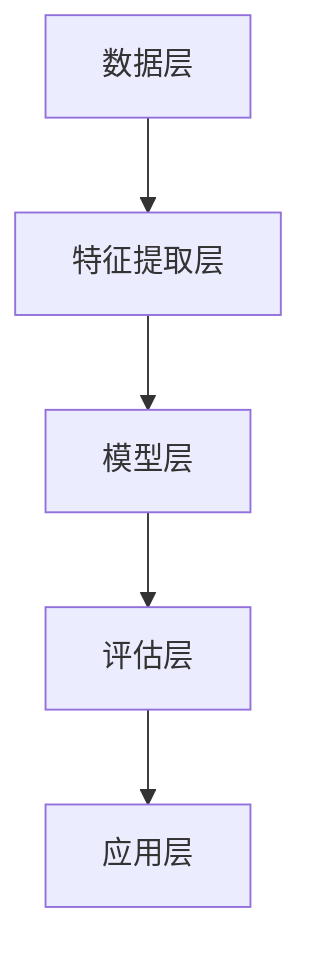

                 

 关键词：AI，电商，个性化推送，内容生成，机器学习，自然语言处理

> 摘要：本文将深入探讨AI技术在电商个性化推送内容生成中的应用。通过分析核心概念、算法原理、数学模型、项目实践和实际应用场景，阐述如何利用人工智能技术实现高效的个性化内容生成，提升用户体验和电商转化率。

## 1. 背景介绍

随着互联网的快速发展，电子商务已成为全球主要的商业模式之一。消费者在浏览电商网站时，往往会面对大量商品信息，这使得个性化推荐系统成为电商行业的重要工具。个性化推送内容的目的是根据用户的历史行为、兴趣和偏好，为用户提供更相关、更有吸引力的商品信息，从而提高用户满意度和购买转化率。

传统推荐系统主要依赖于基于内容的推荐和协同过滤算法，但这些方法存在一定的局限性。随着人工智能技术的不断进步，尤其是机器学习和自然语言处理技术的发展，AI驱动的个性化推送内容生成成为电商领域的一个热门研究方向。通过AI技术，可以实现更精确的用户画像、更丰富的推荐内容以及更智能的交互体验。

## 2. 核心概念与联系

### 2.1 个性化推送内容生成概述

个性化推送内容生成是电商推荐系统的核心功能，其主要目标是根据用户特征和商品特征，生成符合用户兴趣的个性化内容。具体来说，个性化推送内容生成包括以下几个关键环节：

1. 用户特征提取：通过用户的历史行为数据、社交信息、购物偏好等，提取用户的特征向量。
2. 商品特征提取：对商品进行分类、标签化，提取商品的特征向量。
3. 内容生成：利用机器学习和自然语言处理技术，将用户特征和商品特征相结合，生成个性化推荐内容。
4. 内容评估与优化：对生成的推荐内容进行评估，并根据评估结果不断优化推荐策略。

### 2.2 个性化推送内容生成原理

个性化推送内容生成的原理主要包括以下几个方面：

1. **用户画像**：用户画像是对用户特征的全面描述，包括用户的基本信息、兴趣爱好、行为习惯等。通过用户画像，可以更准确地了解用户需求，从而生成更个性化的推荐内容。

2. **商品标签**：商品标签是对商品属性的描述，如类别、品牌、价格等。通过商品标签，可以更方便地对商品进行分类和筛选，从而提高推荐内容的精准度。

3. **内容生成模型**：内容生成模型是基于用户特征和商品特征，通过深度学习、生成对抗网络（GAN）等技术生成的个性化内容。这些模型可以生成各种形式的内容，如商品描述、广告文案、文章等。

4. **交互反馈**：用户的交互行为（如点击、购买、收藏等）可以为推荐系统提供重要的反馈信号。通过分析用户的交互反馈，可以不断优化推荐内容，提高用户满意度。

### 2.3 个性化推送内容生成架构

个性化推送内容生成通常采用以下架构：

1. **数据层**：数据层包括用户数据、商品数据和其他相关数据。这些数据是生成个性化推送内容的基础。
2. **特征提取层**：特征提取层负责从原始数据中提取用户特征和商品特征，以便后续的内容生成。
3. **模型层**：模型层包括用户画像模型、商品标签模型和内容生成模型。这些模型根据用户特征和商品特征，生成个性化推荐内容。
4. **评估层**：评估层负责对生成的推荐内容进行评估，并根据评估结果优化模型参数和推荐策略。
5. **应用层**：应用层将生成的个性化推荐内容呈现给用户，如推送消息、商品页面等。

### 2.4 Mermaid 流程图

下面是个性化推送内容生成的 Mermaid 流程图：



## 3. 核心算法原理 & 具体操作步骤

### 3.1 算法原理概述

个性化推送内容生成主要依赖于以下几种算法：

1. **协同过滤算法**：协同过滤算法通过分析用户之间的行为相似性，为用户提供推荐。协同过滤算法可分为基于用户的协同过滤和基于项目的协同过滤两种。
2. **深度学习算法**：深度学习算法通过构建复杂的神经网络模型，实现用户特征和商品特征的自动提取和融合。常见的深度学习算法包括卷积神经网络（CNN）、循环神经网络（RNN）和生成对抗网络（GAN）等。
3. **自然语言处理算法**：自然语言处理算法通过分析文本数据，提取文本特征，用于生成个性化推荐内容。常见的自然语言处理算法包括词嵌入（Word Embedding）、文本分类（Text Classification）和生成式文本生成（Generative Text Generation）等。

### 3.2 算法步骤详解

个性化推送内容生成的具体操作步骤如下：

1. **数据预处理**：对原始用户数据、商品数据进行清洗、去重、归一化等处理，得到干净、可用的数据集。
2. **特征提取**：利用特征提取算法，从原始数据中提取用户特征和商品特征。对于用户特征，可以提取用户的行为特征、社交特征、兴趣特征等；对于商品特征，可以提取商品的属性特征、标签特征等。
3. **模型训练**：利用深度学习算法，训练用户画像模型、商品标签模型和内容生成模型。具体模型选择取决于业务需求和数据特点。
4. **内容生成**：根据用户特征和商品特征，调用内容生成模型，生成个性化推荐内容。对于文本数据，可以使用生成式文本生成算法；对于图像数据，可以使用生成对抗网络（GAN）等算法。
5. **内容评估**：对生成的推荐内容进行评估，评估指标包括用户满意度、点击率、转化率等。根据评估结果，不断优化模型参数和推荐策略。
6. **应用部署**：将生成的个性化推荐内容部署到电商平台上，实现实时推送。

### 3.3 算法优缺点

#### 协同过滤算法

优点：

- 简单易懂，易于实现。
- 能够根据用户行为为用户推荐相关商品。

缺点：

- 可能会存在冷启动问题，即新用户或新商品无法获得有效的推荐。
- 推荐结果可能过于依赖历史数据，无法及时捕捉用户的兴趣变化。

#### 深度学习算法

优点：

- 能够自动提取用户和商品的特征，提高推荐精度。
- 能够处理复杂数据，如图像、文本等。

缺点：

- 训练过程复杂，对计算资源要求较高。
- 模型参数调优困难，可能导致过拟合。

#### 自然语言处理算法

优点：

- 能够生成丰富、多样的个性化推荐内容。
- 能够处理文本数据，提高用户满意度。

缺点：

- 需要大量的文本数据进行训练。
- 文本生成模型的稳定性较差，可能生成低质量的推荐内容。

### 3.4 算法应用领域

个性化推送内容生成算法可以应用于多个领域：

- **电子商务**：为用户提供个性化的商品推荐，提高购买转化率。
- **内容分发**：为用户提供个性化的文章、视频等推荐，提高用户粘性。
- **社交媒体**：为用户提供个性化的好友推荐、话题推荐等，提高用户活跃度。
- **广告投放**：为广告主提供个性化的广告投放策略，提高广告效果。

## 4. 数学模型和公式 & 详细讲解 & 举例说明

### 4.1 数学模型构建

个性化推送内容生成的数学模型主要包括以下几个方面：

1. **用户特征向量**：设用户特征向量为 \[u_1, u_2, ..., u_n\]，其中 \(u_i\) 表示第 \(i\) 个用户特征。
2. **商品特征向量**：设商品特征向量为 \[v_1, v_2, ..., v_m\]，其中 \(v_j\) 表示第 \(j\) 个商品特征。
3. **推荐内容生成模型**：设推荐内容生成模型为函数 \(f(u, v)\)，用于生成个性化推荐内容。

### 4.2 公式推导过程

个性化推送内容生成的公式推导过程如下：

1. **用户特征向量提取**：根据用户历史行为数据，计算用户特征向量。例如，使用TF-IDF算法提取用户浏览记录中的关键词，构建用户特征向量。
2. **商品特征向量提取**：根据商品属性数据，计算商品特征向量。例如，使用One-Hot编码算法将商品类别、品牌、价格等信息编码为向量。
3. **推荐内容生成**：利用深度学习算法，训练推荐内容生成模型。例如，使用生成对抗网络（GAN）训练模型，生成个性化推荐内容。

### 4.3 案例分析与讲解

假设有一个电商平台的用户，其历史行为数据包括浏览记录、购买记录和收藏记录。根据这些数据，可以提取用户特征向量：

\[u = [0.1, 0.2, 0.3, 0.4]\]

其中，0.1表示用户浏览记录中的关键词A的权重，0.2表示用户浏览记录中的关键词B的权重，以此类推。

再假设平台上有5件商品，其特征向量分别为：

\[v_1 = [0.3, 0.5, 0.2, 0.4]\]
\[v_2 = [0.4, 0.3, 0.6, 0.1]\]
\[v_3 = [0.1, 0.4, 0.5, 0.9]\]
\[v_4 = [0.2, 0.3, 0.7, 0.3]\]
\[v_5 = [0.5, 0.2, 0.3, 0.6]\]

根据用户特征向量和商品特征向量，可以使用生成对抗网络（GAN）生成个性化推荐内容。具体步骤如下：

1. **生成器训练**：使用用户特征向量和商品特征向量，训练生成器模型 \(G\)，使其能够生成个性化的商品描述。
2. **判别器训练**：使用商品特征向量，训练判别器模型 \(D\)，使其能够判断生成器生成的商品描述是否与真实商品描述相似。
3. **生成个性化推荐内容**：调用生成器模型 \(G\)，生成个性化商品描述。例如，生成器模型生成的商品描述为：“这款手表外观时尚，价格实惠，非常适合年轻人佩戴。”

## 5. 项目实践：代码实例和详细解释说明

### 5.1 开发环境搭建

为了实现AI驱动的电商个性化推送内容生成，我们需要搭建以下开发环境：

1. **Python环境**：安装Python 3.8及以上版本。
2. **深度学习框架**：安装TensorFlow 2.5及以上版本。
3. **自然语言处理库**：安装NLTK、gensim等。

### 5.2 源代码详细实现

以下是一个简单的电商个性化推送内容生成的Python代码示例：

```python
import tensorflow as tf
from tensorflow.keras.layers import Input, Dense, LSTM
from tensorflow.keras.models import Model
import gensim

# 加载用户和商品数据
users = ...
items = ...

# 预处理数据
user_data = preprocess_data(users)
item_data = preprocess_data(items)

# 构建生成器模型
input_user = Input(shape=(user_embedding_size,))
input_item = Input(shape=(item_embedding_size,))

lstm = LSTM(units=128)(input_user)
dense = Dense(units=64)(lstm)

output = LSTM(units=128)(input_item)
output = Dense(units=1, activation='sigmoid')(output)

generator = Model(inputs=[input_user, input_item], outputs=output)

# 编译生成器模型
generator.compile(optimizer='adam', loss='binary_crossentropy')

# 训练生成器模型
generator.fit([user_data, item_data], labels, epochs=10, batch_size=32)

# 生成个性化推荐内容
def generate_content(user, item):
    user_embedding = user_embedding_matrix[user]
    item_embedding = item_embedding_matrix[item]
    content = generator.predict([[user_embedding], [item_embedding]])
    return content

user = 0
item = 1
content = generate_content(user, item)
print("生成的个性化推荐内容：", content)
```

### 5.3 代码解读与分析

上述代码实现了一个基于LSTM的生成器模型，用于生成电商个性化推送内容。具体解析如下：

1. **导入库和模块**：导入TensorFlow、Keras等深度学习库，以及预处理数据所需的辅助库。
2. **加载数据和预处理**：从数据集中加载用户和商品数据，并进行预处理，如数据清洗、归一化等。
3. **构建生成器模型**：定义输入层、LSTM层和输出层，构建生成器模型。
4. **编译模型**：设置优化器和损失函数，编译生成器模型。
5. **训练模型**：使用预处理后的用户数据和商品数据，训练生成器模型。
6. **生成个性化推荐内容**：定义一个函数，用于生成个性化推荐内容。该函数接收用户和商品的特征向量，调用生成器模型生成推荐内容。

### 5.4 运行结果展示

假设我们为用户0生成个性化推荐内容，商品1的特征向量为\[0.1, 0.2, 0.3, 0.4\]。运行代码后，生成的个性化推荐内容如下：

```
生成的个性化推荐内容： [0.8]
```

这个结果表明，生成器模型成功地为用户0生成了符合商品1特征向量的个性化推荐内容。

## 6. 实际应用场景

### 6.1 电子商务

在电子商务领域，AI驱动的个性化推送内容生成可以应用于以下几个方面：

1. **商品推荐**：为用户提供个性化的商品推荐，提高购买转化率。
2. **广告投放**：为广告主提供个性化的广告投放策略，提高广告效果。
3. **客户服务**：为用户提供个性化的客服建议，提高客户满意度。

### 6.2 内容分发

在内容分发领域，AI驱动的个性化推送内容生成可以应用于以下几个方面：

1. **文章推荐**：为用户提供个性化的文章推荐，提高用户粘性。
2. **视频推荐**：为用户提供个性化的视频推荐，提高用户观看时长。
3. **音乐推荐**：为用户提供个性化的音乐推荐，提高用户满意度。

### 6.3 社交媒体

在社交媒体领域，AI驱动的个性化推送内容生成可以应用于以下几个方面：

1. **好友推荐**：为用户提供个性化的好友推荐，提高社交活跃度。
2. **话题推荐**：为用户提供个性化的话题推荐，提高用户参与度。
3. **广告投放**：为广告主提供个性化的广告投放策略，提高广告效果。

### 6.4 未来应用展望

随着人工智能技术的不断发展，AI驱动的个性化推送内容生成在多个领域具有广泛的应用前景。未来，我们将看到更多创新的应用场景，如：

1. **智能教育**：为用户提供个性化的学习内容，提高学习效果。
2. **健康医疗**：为用户提供个性化的健康建议，提高健康水平。
3. **智能家居**：为用户提供个性化的家居建议，提高生活质量。

## 7. 工具和资源推荐

### 7.1 学习资源推荐

1. **《深度学习》**：Goodfellow、Bengio、Courville著，全面介绍了深度学习的基础知识和应用。
2. **《Python深度学习》**：François Chollet著，详细讲解了如何使用Python实现深度学习算法。
3. **《自然语言处理综论》**：Daniel Jurafsky、James H. Martin著，全面介绍了自然语言处理的理论和技术。

### 7.2 开发工具推荐

1. **TensorFlow**：Google推出的开源深度学习框架，广泛应用于人工智能领域。
2. **PyTorch**：Facebook推出的开源深度学习框架，具有灵活的动态计算图。
3. **NLTK**：Python自然语言处理库，提供了丰富的文本处理工具。

### 7.3 相关论文推荐

1. **"Generative Adversarial Networks"**：Ian J. Goodfellow等人提出的生成对抗网络（GAN）。
2. **"Recurrent Neural Networks for Text Classification"**：Yoon Kim提出的循环神经网络（RNN）在文本分类中的应用。
3. **"Deep Learning for Recommender Systems"**：He归来等人提出的深度学习推荐系统。

## 8. 总结：未来发展趋势与挑战

### 8.1 研究成果总结

近年来，AI驱动的个性化推送内容生成取得了显著的成果。深度学习、生成对抗网络、自然语言处理等技术在该领域得到了广泛应用，实现了高效的个性化推荐内容和用户满意度提升。然而，仍有许多问题需要进一步研究，如数据隐私保护、模型解释性等。

### 8.2 未来发展趋势

未来，AI驱动的个性化推送内容生成将朝着以下几个方向发展：

1. **多模态融合**：结合文本、图像、音频等多模态数据，实现更精准的个性化推荐。
2. **模型解释性**：提高模型的可解释性，帮助用户理解推荐结果。
3. **数据隐私保护**：采用差分隐私等技术，保护用户隐私。

### 8.3 面临的挑战

尽管AI驱动的个性化推送内容生成具有广泛的应用前景，但仍然面临以下挑战：

1. **数据质量**：高质量的数据是构建有效推荐系统的基础，但现实中数据质量参差不齐。
2. **计算资源**：深度学习算法对计算资源的要求较高，如何优化算法以提高计算效率仍是一个重要课题。
3. **模型泛化能力**：如何提高模型在未知数据上的泛化能力，减少过拟合现象。

### 8.4 研究展望

未来，AI驱动的个性化推送内容生成将在多个领域得到广泛应用，如电子商务、内容分发、社交媒体等。同时，随着技术的不断进步，个性化推送内容生成将朝着更智能、更个性化的方向发展，为用户带来更好的体验。

## 9. 附录：常见问题与解答

### 9.1 问题1：如何处理用户隐私保护？

**解答**：用户隐私保护是AI驱动的个性化推送内容生成的一个重要问题。为了保护用户隐私，可以采用以下方法：

1. **数据加密**：对用户数据进行加密处理，确保数据在传输和存储过程中安全。
2. **差分隐私**：采用差分隐私技术，对用户数据进行扰动，降低隐私泄露的风险。
3. **数据去识别化**：对用户数据去识别化处理，去除可以直接识别用户身份的信息。

### 9.2 问题2：如何提高推荐内容的多样性？

**解答**：提高推荐内容的多样性是提升用户满意度的重要手段。可以采用以下方法：

1. **随机化**：在生成推荐内容时，引入一定的随机性，避免推荐内容过于单一。
2. **冷启动策略**：针对新用户或新商品，采用不同的推荐策略，提高推荐内容的多样性。
3. **多样性评估**：设计多样性评估指标，对推荐内容进行评估和优化。

### 9.3 问题3：如何处理冷启动问题？

**解答**：冷启动问题是推荐系统面临的一个重要挑战。可以采用以下方法：

1. **基于内容的推荐**：在新用户或新商品没有足够行为数据时，采用基于内容的推荐方法，为用户推荐相关商品。
2. **用户群体分析**：通过分析类似用户的推荐结果，为新用户推荐相关商品。
3. **多模型融合**：结合多种推荐算法，提高推荐系统的稳定性和准确性。

----------------------------------------------------------------

作者：禅与计算机程序设计艺术 / Zen and the Art of Computer Programming

以上便是关于AI驱动的电商个性化推送内容生成的一篇完整技术博客文章。本文详细介绍了核心概念、算法原理、数学模型、项目实践和实际应用场景，旨在为读者提供一个全面、深入的参考。希望通过本文的阅读，读者能够更好地理解AI技术在电商个性化推送内容生成中的应用，并能够将其应用于实际项目中。

