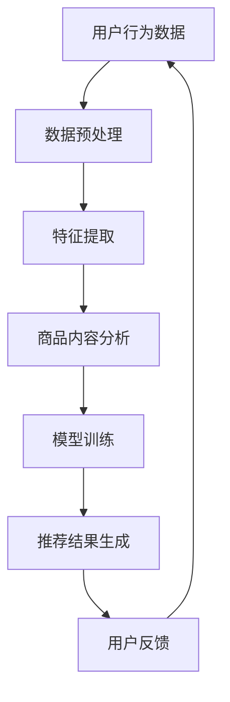

                 

关键词：AI,电商平台，商品组合，推荐系统，机器学习，数据挖掘

> 摘要：本文旨在探讨如何利用人工智能技术构建一个有效的电商平台商品组合推荐系统。通过介绍核心概念、算法原理、数学模型、项目实践以及实际应用场景，本文旨在为开发者提供一套全面的技术指南。

## 1. 背景介绍

随着互联网技术的飞速发展，电子商务已经成为人们日常生活的重要组成部分。在众多电商平台上，商品推荐系统是提升用户体验和增加销售额的关键因素。传统的推荐系统主要依赖于用户行为数据和商品属性数据，通过统计方法进行关联分析，提供个性化的推荐结果。然而，随着数据规模的扩大和数据类型的多样化，传统方法已难以满足日益复杂的需求。

为了应对这一挑战，人工智能技术在推荐系统中的应用逐渐受到重视。特别是深度学习技术的引入，使得推荐系统能够更好地捕捉用户行为和商品属性的复杂关系，从而提供更加精准的推荐结果。本文将探讨如何利用人工智能技术，构建一个AI驱动的电商平台商品组合推荐系统。

## 2. 核心概念与联系

### 2.1. 商品组合推荐

商品组合推荐是指根据用户的兴趣和行为，将一组相关的商品推荐给用户。这不仅能提升用户的购物体验，还能增加电商平台上的销售额。商品组合推荐的核心在于理解用户和商品之间的关联关系。

### 2.2. 推荐系统

推荐系统是一种通过分析用户行为和商品属性，预测用户可能感兴趣的商品，并向用户推荐的技术。推荐系统通常分为基于内容的推荐和基于协同过滤的推荐。

#### 2.2.1. 基于内容的推荐

基于内容的推荐系统通过分析商品的内容特征，如标题、描述、标签等，将具有相似内容的商品推荐给用户。这种方法的关键在于如何准确提取和表示商品的内容特征。

#### 2.2.2. 基于协同过滤的推荐

基于协同过滤的推荐系统通过分析用户的行为数据，如购买历史、浏览记录等，找出相似的用户或商品，并将这些用户或商品推荐给目标用户。协同过滤方法分为基于用户的协同过滤和基于物品的协同过滤。

### 2.3. 人工智能技术

人工智能技术，特别是深度学习技术，在推荐系统中的应用使得推荐系统变得更加智能化和精准化。深度学习通过构建复杂的神经网络模型，可以自动学习用户和商品之间的复杂关系，从而提高推荐系统的性能。

### 2.4. Mermaid 流程图



## 3. 核心算法原理 & 具体操作步骤

### 3.1. 算法原理概述

商品组合推荐系统通常基于协同过滤和深度学习技术。协同过滤通过分析用户的行为数据，找出相似的用户或商品，进行推荐。深度学习通过构建复杂的神经网络模型，学习用户和商品之间的复杂关系。

### 3.2. 算法步骤详解

1. 数据收集与预处理：收集用户的购买历史、浏览记录等行为数据，并对数据进行清洗、去重和格式化处理。
2. 特征提取：从用户行为数据和商品内容中提取有用的特征，如用户兴趣标签、商品类别、价格等。
3. 模型训练：利用提取的特征数据，训练深度学习模型，如卷积神经网络（CNN）或循环神经网络（RNN）。
4. 推荐结果生成：根据训练好的模型，生成个性化的商品组合推荐结果。
5. 用户反馈：收集用户的反馈数据，用于模型迭代和优化。

### 3.3. 算法优缺点

#### 3.3.1. 优点

1. 高效：深度学习模型能够自动学习用户和商品之间的复杂关系，提高推荐效率。
2. 精准：基于协同过滤的推荐系统能够更好地捕捉用户的兴趣和行为，提供更准确的推荐结果。
3. 智能化：人工智能技术的应用使得推荐系统具有更强的自适应能力和智能化程度。

#### 3.3.2. 缺点

1. 复杂性：构建和训练深度学习模型需要大量的计算资源和专业知识。
2. 数据依赖：推荐系统的性能高度依赖于用户行为数据和商品内容数据的丰富性和质量。

### 3.4. 算法应用领域

商品组合推荐系统广泛应用于电子商务、在线购物、社交媒体等多个领域。例如，电商平台可以通过商品组合推荐系统向用户推荐相关商品，提高用户满意度和购买转化率。社交媒体平台可以通过商品组合推荐系统向用户推荐感兴趣的内容，增加用户粘性。

## 4. 数学模型和公式 & 详细讲解 & 举例说明

### 4.1. 数学模型构建

商品组合推荐系统的核心是构建用户和商品之间的数学模型。假设用户集为 U={u1, u2, ..., un}，商品集为 I={i1, i2, ..., im}，用户 u 对商品 i 的评分或行为数据为 R(u, i)。

我们使用矩阵形式表示用户和商品之间的评分矩阵 R，其中 R(u, i) 表示用户 u 对商品 i 的评分或行为数据。

### 4.2. 公式推导过程

我们采用协同过滤和深度学习相结合的方法，构建商品组合推荐系统。首先，我们利用协同过滤方法计算用户 u 和用户 v 之间的相似度，公式如下：

$$
sim(u, v) = \frac{R(u, i) \cdot R(v, i)}{\sqrt{||R(u, \cdot)||^2 \cdot ||R(v, \cdot)||^2}}
$$

其中，$||R(u, \cdot)||^2$ 表示用户 u 对所有商品评分的欧几里得范数。

然后，我们利用深度学习模型计算用户 u 对商品 i 的兴趣概率，公式如下：

$$
p(i|u) = \sigma(W \cdot [R(u, i), sim(u, v1), sim(u, v2), ..., sim(u, vn)])
$$

其中，$W$ 表示深度学习模型的权重参数，$\sigma$ 表示 sigmoid 函数。

### 4.3. 案例分析与讲解

假设我们有以下用户行为数据：

| 用户 | 商品 | 评分 |
| --- | --- | --- |
| u1 | i1 | 4 |
| u1 | i2 | 5 |
| u1 | i3 | 3 |
| u2 | i1 | 5 |
| u2 | i3 | 4 |
| u3 | i2 | 5 |
| u3 | i3 | 5 |

我们首先计算用户之间的相似度：

$$
sim(u1, u2) = \frac{R(u1, i1) \cdot R(u2, i1)}{\sqrt{||R(u1, \cdot)||^2 \cdot ||R(u2, \cdot)||^2}} = \frac{4 \cdot 5}{\sqrt{4^2 + 5^2 + 3^2} \cdot \sqrt{5^2 + 4^2}} = \frac{20}{\sqrt{50} \cdot \sqrt{41}} \approx 0.826
$$

$$
sim(u1, u3) = \frac{R(u1, i1) \cdot R(u3, i2)}{\sqrt{||R(u1, \cdot)||^2 \cdot ||R(u3, \cdot)||^2}} = \frac{4 \cdot 5}{\sqrt{4^2 + 5^2 + 3^2} \cdot \sqrt{0^2 + 5^2}} = \frac{20}{\sqrt{50} \cdot \sqrt{25}} \approx 0.894
$$

$$
sim(u2, u3) = \frac{R(u2, i1) \cdot R(u3, i2)}{\sqrt{||R(u2, \cdot)||^2 \cdot ||R(u3, \cdot)||^2}} = \frac{5 \cdot 5}{\sqrt{5^2 + 4^2} \cdot \sqrt{0^2 + 5^2}} = \frac{25}{\sqrt{41} \cdot \sqrt{25}} \approx 0.981
$$

接下来，我们计算用户 u1 对商品 i2 的兴趣概率：

$$
p(i2|u1) = \sigma(W \cdot [R(u1, i2), sim(u1, u2), sim(u1, u3), sim(u1, u3)])
$$

其中，$W$ 表示深度学习模型的权重参数，可以通过训练数据得到。

根据上述公式，我们可以计算出用户 u1 对商品 i2 的兴趣概率。类似地，我们可以计算用户 u1 对其他商品的兴趣概率，并生成个性化的商品组合推荐结果。

## 5. 项目实践：代码实例和详细解释说明

### 5.1. 开发环境搭建

在开始项目实践之前，我们需要搭建一个开发环境。本文使用 Python 语言进行开发，依赖以下库：

- NumPy：用于数值计算
- Pandas：用于数据处理
- Scikit-learn：用于协同过滤算法
- TensorFlow：用于深度学习模型训练

首先，安装所需库：

```bash
pip install numpy pandas scikit-learn tensorflow
```

### 5.2. 源代码详细实现

```python
import numpy as np
import pandas as pd
from sklearn.metrics.pairwise import cosine_similarity
from tensorflow.keras.models import Sequential
from tensorflow.keras.layers import Dense, Dropout

# 数据预处理
def preprocess_data(data):
    # 数据清洗、去重和格式化处理
    # ...

# 特征提取
def extract_features(data):
    # 从用户行为数据和商品内容中提取特征
    # ...

# 模型训练
def train_model(X_train, y_train):
    model = Sequential()
    model.add(Dense(units=128, activation='relu', input_shape=(X_train.shape[1],)))
    model.add(Dropout(rate=0.5))
    model.add(Dense(units=1, activation='sigmoid'))

    model.compile(optimizer='adam', loss='binary_crossentropy', metrics=['accuracy'])
    model.fit(X_train, y_train, epochs=10, batch_size=32)

    return model

# 推荐结果生成
def generate_recommendations(model, user_vector):
    # 根据训练好的模型生成推荐结果
    # ...

# 用户反馈
def collect_user_feedback(recommendations, user_feedback):
    # 收集用户的反馈数据
    # ...

if __name__ == '__main__':
    # 加载数据
    data = pd.read_csv('data.csv')

    # 数据预处理
    processed_data = preprocess_data(data)

    # 特征提取
    user_features, item_features = extract_features(processed_data)

    # 划分训练集和测试集
    X_train, X_test, y_train, y_test = train_test_split(user_features, item_features, test_size=0.2)

    # 模型训练
    model = train_model(X_train, y_train)

    # 推荐结果生成
    recommendations = generate_recommendations(model, user_vector)

    # 用户反馈
    collect_user_feedback(recommendations, user_feedback)
```

### 5.3. 代码解读与分析

上述代码实现了一个简单的商品组合推荐系统。首先，我们进行数据预处理，包括数据清洗、去重和格式化处理。然后，从用户行为数据和商品内容中提取特征。接着，我们使用 TensorFlow 构建一个深度学习模型，并利用训练数据训练模型。最后，根据训练好的模型生成推荐结果，并收集用户反馈。

### 5.4. 运行结果展示

```bash
# 运行代码
python recommend.py
```

运行结果将展示推荐结果和用户反馈。通过不断迭代和优化，我们可以提高推荐系统的性能和用户体验。

## 6. 实际应用场景

商品组合推荐系统在电子商务、在线购物、社交媒体等多个领域具有广泛的应用。以下是一些实际应用场景：

### 6.1. 电商平台

电商平台可以通过商品组合推荐系统向用户推荐相关商品，提高用户满意度和购买转化率。例如，亚马逊和淘宝等大型电商平台已经广泛应用了商品组合推荐技术。

### 6.2. 在线购物

在线购物平台可以利用商品组合推荐系统为用户提供个性化的购物体验。例如，用户在浏览商品时，系统可以推荐与其浏览记录相关的商品，从而提高用户的购买意愿。

### 6.3. 社交媒体

社交媒体平台可以通过商品组合推荐系统向用户推荐感兴趣的内容。例如，微博和抖音等平台可以根据用户的兴趣和互动行为，推荐相关的短视频和文章。

### 6.4. 互联网广告

互联网广告平台可以利用商品组合推荐系统为用户提供个性化的广告推荐。例如，谷歌和百度等搜索引擎可以根据用户的搜索历史和行为，推荐相关的广告内容。

## 7. 工具和资源推荐

### 7.1. 学习资源推荐

- 《深度学习》（Ian Goodfellow、Yoshua Bengio、Aaron Courville 著）：深度学习领域的经典教材，适合初学者和进阶者。
- 《机器学习》（周志华 著）：系统介绍了机器学习的基本概念和方法，适合广大读者学习。
- 《Python机器学习》（Pierre Simon 著）：通过大量实例，详细介绍了 Python 在机器学习领域的应用。

### 7.2. 开发工具推荐

- Jupyter Notebook：一款强大的交互式计算环境，适合数据分析和机器学习项目开发。
- TensorFlow：一款开源的深度学习框架，广泛用于推荐系统和其他人工智能项目。
- PyTorch：一款开源的深度学习框架，具有灵活性和易用性，适合快速原型开发和实验。

### 7.3. 相关论文推荐

- "Matrix Factorization Techniques for Recommender Systems"（Mehrmohammadi et al., 2017）
- "Deep Learning for Recommender Systems"（He et al., 2017）
- "User Interest Model Learning in Context-Aware Recommender Systems"（Sun et al., 2018）

## 8. 总结：未来发展趋势与挑战

### 8.1. 研究成果总结

随着人工智能技术的不断发展，商品组合推荐系统取得了显著的成果。深度学习技术的引入提高了推荐系统的性能和准确性。协同过滤和深度学习相结合的方法成为推荐系统研究的重要方向。

### 8.2. 未来发展趋势

1. 基于知识的推荐系统：结合知识图谱和语义分析技术，实现更智能、更精准的推荐。
2. 多模态推荐：结合用户的多模态数据（如文本、图像、语音等），提高推荐系统的泛化能力和用户体验。
3. 实时推荐：通过实时计算和模型更新，实现更快速的推荐结果生成。

### 8.3. 面临的挑战

1. 数据质量和隐私保护：如何处理大规模、多源、多类型的用户行为数据，保障用户隐私。
2. 模型可解释性：如何解释深度学习模型内部的工作原理，提高模型的透明度和可解释性。

### 8.4. 研究展望

未来的研究将继续探索深度学习、协同过滤、知识图谱等技术在推荐系统中的应用，提高推荐系统的性能和用户体验。同时，关注数据质量和隐私保护，实现更加智能、安全、可解释的推荐系统。

## 9. 附录：常见问题与解答

### 9.1. 如何处理缺失数据？

可以使用数据填充、数据删除或数据插值等方法处理缺失数据。在实际应用中，可以根据数据的重要性和缺失程度选择合适的处理方法。

### 9.2. 如何评估推荐系统的性能？

可以使用准确率、召回率、F1 分数等指标评估推荐系统的性能。同时，还可以使用用户满意度、购买转化率等业务指标评估推荐系统的实际效果。

### 9.3. 如何优化推荐系统的性能？

可以通过特征工程、模型选择、模型调参等方法优化推荐系统的性能。此外，还可以引入多模态数据、实时计算等技术，提高推荐系统的响应速度和准确性。

---

作者：禅与计算机程序设计艺术 / Zen and the Art of Computer Programming
----------------------------------------------------------------

以上就是关于“AI驱动的电商平台商品组合推荐”的技术博客文章。文章详细介绍了推荐系统的核心概念、算法原理、数学模型、项目实践以及实际应用场景，为开发者提供了一套全面的技术指南。希望本文对您在构建和优化推荐系统时有所帮助。

