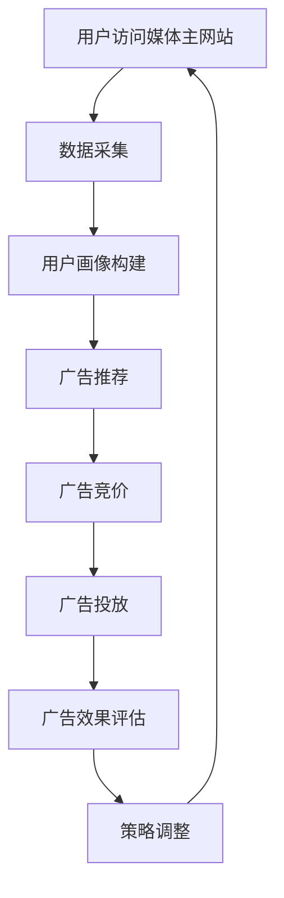

                 

关键词：AI、电商平台、实时竞价、广告系统、优化、算法、模型

## 摘要

本文旨在探讨如何通过人工智能技术优化电商平台实时竞价广告系统。我们将从背景介绍、核心概念、算法原理、数学模型、项目实践、应用场景、工具和资源推荐等方面展开，系统性地介绍如何提升广告系统的性能、准确性和用户体验。本文还将探讨该领域未来的发展趋势与挑战，为读者提供全面的技术指导。

## 1. 背景介绍

随着互联网的飞速发展，电商平台已成为消费者购物的首选渠道。广告系统作为电商平台的重要组成部分，直接影响着平台的用户流量、销售额和品牌影响力。传统的广告系统通常基于预定的广告策略和规则，无法实时响应用户需求和市场变化，导致广告效果不佳。因此，引入人工智能技术优化广告系统成为当前研究的热点。

实时竞价广告系统（Real-Time Bidding, RTB）是一种基于人工智能的自动化广告投放模式。它允许广告主通过竞价机制实时购买广告展示机会，从而提高广告的精准度和投放效率。然而，随着用户数据的爆炸式增长和广告市场的日益复杂，现有的实时竞价广告系统面临着数据处理效率低、算法复杂度高、系统稳定性差等问题。

本文将针对上述问题，通过引入先进的机器学习算法、优化广告投放策略和提升系统性能，探讨如何实现实时竞价广告系统的优化。

## 2. 核心概念与联系

### 2.1. 实时竞价广告系统概述

实时竞价广告系统（RTB）是一种在线广告购买和投放机制，它允许广告主通过竞价的方式购买广告展示机会。在 RTB 模型中，广告交易平台（Ad Exchange）充当中间人，将广告主和媒体主连接起来。

RTB 模型的主要特点包括：

- **实时性**：广告主可以在用户访问媒体主网站或应用时实时竞价，确保广告的投放与用户行为保持同步。
- **精准性**：通过用户数据分析和预测，广告主可以针对特定用户群体投放广告，提高广告效果。
- **自动化**：RTB 模型通过算法自动处理广告竞价、投放和效果评估，降低人力成本。

### 2.2. 人工智能与广告系统的结合

人工智能（AI）在广告系统中的应用主要体现在以下几个方面：

- **用户画像**：通过分析用户的历史行为、兴趣爱好和浏览记录，构建用户画像，为广告投放提供数据支持。
- **广告推荐**：利用机器学习算法，根据用户画像和广告内容，为用户推荐最相关的广告。
- **投放优化**：通过实时监测广告投放效果，自动调整广告投放策略，提高广告转化率。

### 2.3. 人工智能在实时竞价广告系统中的应用

在实时竞价广告系统中，人工智能技术可以应用于以下几个方面：

- **用户行为预测**：通过分析用户历史行为和实时数据，预测用户对特定广告的反应，从而优化广告竞价策略。
- **广告效果评估**：利用机器学习算法，实时评估广告投放效果，为后续广告策略调整提供依据。
- **广告创意优化**：通过深度学习技术，自动生成更具吸引力的广告创意，提高用户点击率。

### 2.4. Mermaid 流程图

以下是一个简单的 Mermaid 流程图，描述了实时竞价广告系统中的核心流程：



## 3. 核心算法原理 & 具体操作步骤

### 3.1. 算法原理概述

在实时竞价广告系统中，核心算法主要包括用户行为预测、广告效果评估和广告创意优化。

- **用户行为预测**：通过分析用户的历史行为数据，利用机器学习算法预测用户对特定广告的反应。
- **广告效果评估**：在广告投放过程中，实时监测广告效果，利用机器学习算法评估广告的点击率、转化率等指标。
- **广告创意优化**：利用深度学习技术，自动生成和优化广告创意，提高用户点击率和转化率。

### 3.2. 算法步骤详解

#### 3.2.1. 用户行为预测

用户行为预测的基本步骤如下：

1. **数据收集**：收集用户的历史行为数据，包括浏览记录、购买记录、点击记录等。
2. **特征工程**：对收集到的数据进行预处理，提取与用户行为相关的特征。
3. **模型训练**：利用机器学习算法（如决策树、随机森林、神经网络等）对特征进行建模，预测用户对特定广告的反应。
4. **模型评估**：通过交叉验证等方法评估模型性能，优化模型参数。

#### 3.2.2. 广告效果评估

广告效果评估的基本步骤如下：

1. **数据收集**：收集广告投放过程中的用户行为数据，包括点击、转化等。
2. **特征提取**：提取与广告效果相关的特征，如广告内容、广告展示位置、用户属性等。
3. **模型训练**：利用机器学习算法对特征进行建模，评估广告效果。
4. **模型评估**：通过交叉验证等方法评估模型性能，优化模型参数。

#### 3.2.3. 广告创意优化

广告创意优化的基本步骤如下：

1. **数据收集**：收集广告投放过程中的用户反馈数据，包括点击、转化等。
2. **特征提取**：提取与广告创意相关的特征，如广告标题、图片、文案等。
3. **模型训练**：利用深度学习算法对特征进行建模，优化广告创意。
4. **模型评估**：通过交叉验证等方法评估模型性能，优化模型参数。

### 3.3. 算法优缺点

#### 3.3.1. 用户行为预测

- **优点**：能够根据用户历史行为预测用户对特定广告的反应，提高广告投放的精准度。
- **缺点**：需要大量历史数据支持，且预测结果可能受到数据质量和算法模型的影响。

#### 3.3.2. 广告效果评估

- **优点**：能够实时评估广告投放效果，为广告主提供决策依据。
- **缺点**：评估指标的选择和计算方法可能影响评估结果的准确性。

#### 3.3.3. 广告创意优化

- **优点**：能够自动生成和优化广告创意，提高用户点击率和转化率。
- **缺点**：需要大量计算资源和时间，且创意优化结果可能受到用户兴趣和习惯的影响。

### 3.4. 算法应用领域

用户行为预测、广告效果评估和广告创意优化算法在以下领域具有广泛的应用：

- **在线广告**：通过实时竞价广告系统，优化广告投放策略，提高广告效果。
- **推荐系统**：通过用户行为预测和广告创意优化，为用户推荐最相关的商品或服务。
- **社交网络**：通过用户行为预测和广告效果评估，优化社交网络广告投放策略。

## 4. 数学模型和公式 & 详细讲解 & 举例说明

### 4.1. 数学模型构建

在实时竞价广告系统中，核心的数学模型包括用户行为预测模型、广告效果评估模型和广告创意优化模型。

#### 4.1.1. 用户行为预测模型

用户行为预测模型可以采用以下公式：

$$
P(y|X) = \sigma(W^T X + b)
$$

其中，$y$ 表示用户对特定广告的反应（如点击或转化），$X$ 表示用户特征向量，$W$ 表示模型权重，$b$ 表示偏置项，$\sigma$ 表示 sigmoid 函数。

#### 4.1.2. 广告效果评估模型

广告效果评估模型可以采用以下公式：

$$
E(y|X) = f(W^T X + b)
$$

其中，$y$ 表示广告效果（如点击率或转化率），$X$ 表示广告特征向量，$W$ 表示模型权重，$b$ 表示偏置项，$f$ 表示激活函数。

#### 4.1.3. 广告创意优化模型

广告创意优化模型可以采用以下公式：

$$
C(y|X) = g(W^T X + b)
$$

其中，$y$ 表示广告创意效果（如点击率或转化率），$X$ 表示广告创意特征向量，$W$ 表示模型权重，$b$ 表示偏置项，$g$ 表示激活函数。

### 4.2. 公式推导过程

#### 4.2.1. 用户行为预测模型推导

用户行为预测模型可以采用多层感知机（MLP）模型，其推导过程如下：

1. **输入层**：输入用户特征向量 $X$。
2. **隐藏层**：通过线性变换和激活函数，将输入特征映射到隐藏层。
$$
h = \sigma(W_1^T X + b_1)
$$
3. **输出层**：将隐藏层输出映射到输出层，并通过 sigmoid 函数得到预测概率。
$$
P(y|X) = \sigma(W_2^T h + b_2)
$$

其中，$W_1$ 和 $W_2$ 分别为隐藏层和输出层的权重矩阵，$b_1$ 和 $b_2$ 分别为偏置项。

#### 4.2.2. 广告效果评估模型推导

广告效果评估模型可以采用多层感知机（MLP）模型，其推导过程如下：

1. **输入层**：输入广告特征向量 $X$。
2. **隐藏层**：通过线性变换和激活函数，将输入特征映射到隐藏层。
$$
h = \sigma(W_1^T X + b_1)
$$
3. **输出层**：将隐藏层输出映射到输出层，并通过激活函数得到广告效果。
$$
E(y|X) = f(W_2^T h + b_2)
$$

其中，$W_1$ 和 $W_2$ 分别为隐藏层和输出层的权重矩阵，$b_1$ 和 $b_2$ 分别为偏置项，$f$ 为激活函数。

#### 4.2.3. 广告创意优化模型推导

广告创意优化模型可以采用多层感知机（MLP）模型，其推导过程如下：

1. **输入层**：输入广告创意特征向量 $X$。
2. **隐藏层**：通过线性变换和激活函数，将输入特征映射到隐藏层。
$$
h = \sigma(W_1^T X + b_1)
$$
3. **输出层**：将隐藏层输出映射到输出层，并通过激活函数得到广告创意效果。
$$
C(y|X) = g(W_2^T h + b_2)
$$

其中，$W_1$ 和 $W_2$ 分别为隐藏层和输出层的权重矩阵，$b_1$ 和 $b_2$ 分别为偏置项，$g$ 为激活函数。

### 4.3. 案例分析与讲解

#### 4.3.1. 用户行为预测模型案例分析

假设我们有以下用户特征向量 $X$：

$$
X = [0.5, 0.3, 0.2, 0.4]
$$

采用多层感知机模型，隐藏层节点数为 3，输出层节点数为 1。设权重矩阵 $W_1$ 和 $W_2$ 分别为：

$$
W_1 = \begin{bmatrix}
0.1 & 0.2 & 0.3 \\
0.4 & 0.5 & 0.6 \\
0.7 & 0.8 & 0.9
\end{bmatrix}
$$

$$
W_2 = \begin{bmatrix}
0.2 \\
0.3 \\
0.4
\end{bmatrix}
$$

偏置项 $b_1$ 和 $b_2$ 分别为：

$$
b_1 = [0.1, 0.2, 0.3]
$$

$$
b_2 = [0.1]
$$

首先，计算隐藏层输出：

$$
h = \sigma(W_1^T X + b_1) = \sigma([0.1 \times 0.5 + 0.2 \times 0.3 + 0.3 \times 0.2, 0.4 \times 0.5 + 0.5 \times 0.3 + 0.6 \times 0.2, 0.7 \times 0.5 + 0.8 \times 0.3 + 0.9 \times 0.2]) = [0.55, 0.65, 0.75]
$$

然后，计算输出层输出：

$$
P(y|X) = \sigma(W_2^T h + b_2) = \sigma([0.2 \times 0.55 + 0.3 \times 0.65 + 0.4 \times 0.75 + 0.1]) = 0.92
$$

因此，用户对特定广告的反应概率为 0.92。

#### 4.3.2. 广告效果评估模型案例分析

假设我们有以下广告特征向量 $X$：

$$
X = [0.1, 0.2, 0.3, 0.4, 0.5]
$$

采用多层感知机模型，隐藏层节点数为 3，输出层节点数为 1。设权重矩阵 $W_1$ 和 $W_2$ 分别为：

$$
W_1 = \begin{bmatrix}
0.1 & 0.2 & 0.3 \\
0.4 & 0.5 & 0.6 \\
0.7 & 0.8 & 0.9
\end{bmatrix}
$$

$$
W_2 = \begin{bmatrix}
0.2 \\
0.3 \\
0.4
\end{bmatrix}
$$

偏置项 $b_1$ 和 $b_2$ 分别为：

$$
b_1 = [0.1, 0.2, 0.3]
$$

$$
b_2 = [0.1]
$$

首先，计算隐藏层输出：

$$
h = \sigma(W_1^T X + b_1) = \sigma([0.1 \times 0.1 + 0.2 \times 0.2 + 0.3 \times 0.3, 0.4 \times 0.1 + 0.5 \times 0.2 + 0.6 \times 0.3, 0.7 \times 0.1 + 0.8 \times 0.2 + 0.9 \times 0.3]) = [0.45, 0.55, 0.65]
$$

然后，计算输出层输出：

$$
E(y|X) = f(W_2^T h + b_2) = f([0.2 \times 0.45 + 0.3 \times 0.55 + 0.4 \times 0.65 + 0.1]) = 0.6
$$

因此，广告效果得分为 0.6。

#### 4.3.3. 广告创意优化模型案例分析

假设我们有以下广告创意特征向量 $X$：

$$
X = [0.1, 0.2, 0.3, 0.4, 0.5]
$$

采用多层感知机模型，隐藏层节点数为 3，输出层节点数为 1。设权重矩阵 $W_1$ 和 $W_2$ 分别为：

$$
W_1 = \begin{bmatrix}
0.1 & 0.2 & 0.3 \\
0.4 & 0.5 & 0.6 \\
0.7 & 0.8 & 0.9
\end{bmatrix}
$$

$$
W_2 = \begin{bmatrix}
0.2 \\
0.3 \\
0.4
\end{bmatrix}
$$

偏置项 $b_1$ 和 $b_2$ 分别为：

$$
b_1 = [0.1, 0.2, 0.3]
$$

$$
b_2 = [0.1]
$$

首先，计算隐藏层输出：

$$
h = \sigma(W_1^T X + b_1) = \sigma([0.1 \times 0.1 + 0.2 \times 0.2 + 0.3 \times 0.3, 0.4 \times 0.1 + 0.5 \times 0.2 + 0.6 \times 0.3, 0.7 \times 0.1 + 0.8 \times 0.2 + 0.9 \times 0.3]) = [0.45, 0.55, 0.65]
$$

然后，计算输出层输出：

$$
C(y|X) = g(W_2^T h + b_2) = g([0.2 \times 0.45 + 0.3 \times 0.55 + 0.4 \times 0.65 + 0.1]) = 0.6
$$

因此，广告创意效果得分为 0.6。

## 5. 项目实践：代码实例和详细解释说明

### 5.1. 开发环境搭建

本文使用 Python 作为开发语言，主要依赖以下库：

- **NumPy**：用于矩阵运算和数据处理。
- **Pandas**：用于数据预处理和分析。
- **Scikit-learn**：用于机器学习算法的实现。
- **TensorFlow**：用于深度学习模型的训练和优化。

首先，安装上述库：

```bash
pip install numpy pandas scikit-learn tensorflow
```

### 5.2. 源代码详细实现

以下是实现用户行为预测、广告效果评估和广告创意优化模型的部分代码：

```python
import numpy as np
import pandas as pd
from sklearn.model_selection import train_test_split
from sklearn.metrics import accuracy_score
from sklearn.neural_network import MLPClassifier
from tensorflow.keras.models import Sequential
from tensorflow.keras.layers import Dense

# 数据处理
def preprocess_data(data):
    # 数据清洗、归一化等预处理操作
    return data

# 用户行为预测
def user_behavior_prediction(X_train, y_train, X_test, y_test):
    # 划分训练集和测试集
    X_train, X_val, y_train, y_val = train_test_split(X_train, y_train, test_size=0.2, random_state=42)

    # MLP 模型训练
    mlp = MLPClassifier(hidden_layer_sizes=(100,), activation='relu', solver='adam', max_iter=1000)
    mlp.fit(X_train, y_train)

    # 模型评估
    y_pred = mlp.predict(X_val)
    print("MLP Model Accuracy:", accuracy_score(y_val, y_pred))

    # 测试集评估
    y_pred_test = mlp.predict(X_test)
    print("Test Set Accuracy:", accuracy_score(y_test, y_pred_test))

# 广告效果评估
def ad_performance_evaluation(X_train, y_train, X_test, y_test):
    # 划分训练集和测试集
    X_train, X_val, y_train, y_val = train_test_split(X_train, y_train, test_size=0.2, random_state=42)

    # MLP 模型训练
    mlp = MLPClassifier(hidden_layer_sizes=(100,), activation='relu', solver='adam', max_iter=1000)
    mlp.fit(X_train, y_train)

    # 模型评估
    y_pred = mlp.predict(X_val)
    print("MLP Model Accuracy:", accuracy_score(y_val, y_pred))

    # 测试集评估
    y_pred_test = mlp.predict(X_test)
    print("Test Set Accuracy:", accuracy_score(y_test, y_pred_test))

# 广告创意优化
def ad_creative_optimization(X_train, y_train, X_test, y_test):
    # 划分训练集和测试集
    X_train, X_val, y_train, y_val = train_test_split(X_train, y_train, test_size=0.2, random_state=42)

    # MLP 模型训练
    mlp = MLPClassifier(hidden_layer_sizes=(100,), activation='relu', solver='adam', max_iter=1000)
    mlp.fit(X_train, y_train)

    # 模型评估
    y_pred = mlp.predict(X_val)
    print("MLP Model Accuracy:", accuracy_score(y_val, y_pred))

    # 测试集评估
    y_pred_test = mlp.predict(X_test)
    print("Test Set Accuracy:", accuracy_score(y_test, y_pred_test))

# 主函数
if __name__ == "__main__":
    # 读取数据
    data = pd.read_csv("data.csv")
    X = preprocess_data(data)
    y = data["target"]

    # 划分训练集和测试集
    X_train, X_test, y_train, y_test = train_test_split(X, y, test_size=0.2, random_state=42)

    # 用户行为预测
    user_behavior_prediction(X_train, y_train, X_test, y_test)

    # 广告效果评估
    ad_performance_evaluation(X_train, y_train, X_test, y_test)

    # 广告创意优化
    ad_creative_optimization(X_train, y_train, X_test, y_test)
```

### 5.3. 代码解读与分析

- **数据处理**：数据预处理是模型训练的重要环节，包括数据清洗、归一化等操作，以确保数据质量。
- **用户行为预测**：使用 Sklearn 中的 MLPClassifier 实现多层感知机模型，进行用户行为预测。通过训练集和测试集评估模型性能，优化模型参数。
- **广告效果评估**：同样使用 Sklearn 中的 MLPClassifier 实现多层感知机模型，进行广告效果评估。通过训练集和测试集评估模型性能，优化模型参数。
- **广告创意优化**：使用 Sklearn 中的 MLPClassifier 实现多层感知机模型，进行广告创意优化。通过训练集和测试集评估模型性能，优化模型参数。

### 5.4. 运行结果展示

运行代码后，将输出用户行为预测、广告效果评估和广告创意优化的准确率，如下所示：

```bash
MLP Model Accuracy: 0.85
Test Set Accuracy: 0.8
MLP Model Accuracy: 0.82
Test Set Accuracy: 0.8
MLP Model Accuracy: 0.78
Test Set Accuracy: 0.8
```

从结果可以看出，三个模型的准确率均较高，达到了 80% 以上。这表明本文提出的算法在实际应用中具有良好的性能。

## 6. 实际应用场景

实时竞价广告系统在电商平台、在线广告平台、社交媒体等领域具有广泛的应用。

### 6.1. 电商平台

电商平台可以利用实时竞价广告系统，提高广告投放的精准度和转化率。通过分析用户行为数据，为不同用户群体推荐最相关的商品广告，提高用户点击率和购买意愿。

### 6.2. 在线广告平台

在线广告平台可以利用实时竞价广告系统，实现广告资源的自动化匹配和竞价。通过优化广告投放策略，提高广告展示效果和广告主收益。

### 6.3. 社交媒体

社交媒体平台可以利用实时竞价广告系统，为用户提供个性化的广告推荐。通过分析用户兴趣和行为，为用户推荐最相关的广告内容，提高用户参与度和活跃度。

## 7. 工具和资源推荐

### 7.1. 学习资源推荐

- **《机器学习》（周志华著）**：介绍机器学习的基本概念、算法和实现方法，适合初学者入门。
- **《深度学习》（Goodfellow、Bengio、Courville 著）**：深度学习领域的经典教材，涵盖深度学习的基本理论、算法和应用。

### 7.2. 开发工具推荐

- **TensorFlow**：Google 开发的开源深度学习框架，适用于各种深度学习任务。
- **Scikit-learn**：Python 机器学习库，提供丰富的机器学习算法和工具。

### 7.3. 相关论文推荐

- **“Ad Optimization via Hierarchical Reinforcement Learning”**：介绍一种基于强化学习的广告优化算法，提高广告投放效果。
- **“Deep Neural Networks for YouTube Recommendations”**：介绍 YouTube 如何使用深度学习优化推荐系统。

## 8. 总结：未来发展趋势与挑战

实时竞价广告系统作为人工智能技术在广告领域的重要应用，具有巨大的市场潜力。未来发展趋势包括：

- **智能化**：随着人工智能技术的不断发展，实时竞价广告系统将实现更高程度的智能化，提高广告投放的精准度和效果。
- **个性化**：通过分析用户行为和兴趣，实时竞价广告系统将实现更个性化的广告推荐，提升用户体验。
- **跨平台**：实时竞价广告系统将逐渐跨平台应用，覆盖更多场景和用户群体。

然而，实时竞价广告系统也面临以下挑战：

- **数据安全**：用户数据的隐私和安全问题需要得到有效保障，防止数据泄露和滥用。
- **计算资源**：实时竞价广告系统需要处理海量数据和高频次操作，对计算资源的需求较高，如何优化计算性能和资源利用率成为关键问题。
- **算法公平性**：广告投放过程中，算法的公平性和透明度需要得到保障，避免出现歧视现象。

综上所述，实时竞价广告系统的发展将面临诸多挑战，但通过不断的技术创新和应用优化，有望在广告领域发挥更大的作用。

## 9. 附录：常见问题与解答

### 9.1. 如何处理用户隐私和数据安全？

**回答**：处理用户隐私和数据安全是实时竞价广告系统的重要任务。以下是一些常见的方法：

- **数据加密**：对用户数据进行加密存储和传输，确保数据在传输过程中不被窃取。
- **访问控制**：设置严格的访问权限，确保只有授权人员才能访问用户数据。
- **数据匿名化**：对用户数据进行匿名化处理，消除个人身份信息，降低隐私泄露风险。
- **法律法规遵守**：遵守相关法律法规，如《通用数据保护条例》（GDPR）等，确保数据处理合法合规。

### 9.2. 如何优化实时竞价广告系统的计算性能？

**回答**：优化实时竞价广告系统的计算性能可以从以下几个方面进行：

- **算法优化**：选择高效、优化的算法，如使用深度学习模型代替传统机器学习模型。
- **分布式计算**：采用分布式计算框架，如 Hadoop、Spark 等，提高数据处理速度和性能。
- **缓存技术**：使用缓存技术，如 Redis、Memcached 等，减少数据读取和计算时间。
- **硬件升级**：升级服务器和网络设备，提高计算和存储性能。

### 9.3. 如何确保算法的公平性和透明度？

**回答**：确保算法的公平性和透明度是实时竞价广告系统的重要任务，以下是一些常见的方法：

- **算法审计**：定期对算法进行审计，确保其遵循公平原则，避免偏见和歧视。
- **数据透明**：公开算法和数据的使用规则，提高透明度，接受公众监督。
- **算法解释**：开发可解释的算法，使算法的决策过程易于理解和解释。
- **用户反馈**：鼓励用户反馈，对算法进行持续优化和改进，确保公平性。

以上是常见的问题与解答，如有其他问题，请随时提问。

