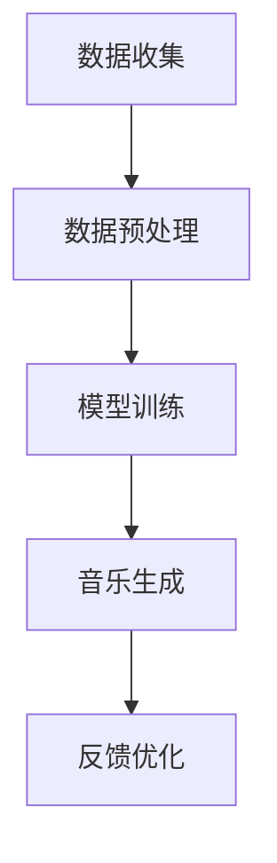

                 

关键词：AI音乐创作，自动化，娱乐产业，创新，技术前沿

> 摘要：本文将探讨人工智能（AI）在音乐创作领域的应用，特别是自动化音乐创作的技术原理、实践案例以及其在娱乐产业中的潜力。随着AI技术的不断发展，音乐创作正迎来一场革命，本文将为您提供深刻的见解和前瞻性的展望。

## 1. 背景介绍

音乐创作一直是人类文化和艺术的重要组成部分。自古以来，音乐家们通过灵感、技巧和创造力谱写出无数传世佳作。然而，传统的音乐创作过程既漫长又艰辛，往往需要音乐家们长时间的摸索和反复试验。随着技术的进步，尤其是人工智能（AI）和机器学习（ML）的飞速发展，自动化音乐创作开始崭露头角，并逐渐成为音乐产业的新趋势。

AI在音乐创作中的应用不仅提高了创作的效率，还为音乐创作带来了全新的可能性。通过深度学习和生成模型，AI能够模拟和学习音乐家的创作风格，甚至创造出独特的音乐作品。这种技术革新不仅为音乐家提供了强大的工具，也为整个娱乐产业带来了新的机遇和挑战。

本文将首先介绍AI音乐创作的基本原理，然后深入探讨核心算法和模型，通过具体的实践案例展示自动化音乐创作的实际应用，最后分析其在娱乐产业中的前景和面临的挑战。

## 2. 核心概念与联系

### 2.1 AI音乐创作的基本原理

AI音乐创作主要依赖于生成模型和机器学习算法，其基本原理可以概括为以下几个步骤：

1. **数据收集与处理**：首先，AI系统需要收集大量的音乐数据，包括曲谱、音频片段、和弦进行、节奏模式等。这些数据经过预处理，如归一化、去噪和特征提取，以供后续训练使用。

2. **模型训练**：基于收集到的数据，AI使用生成模型（如循环神经网络RNN、变分自编码器VAE、生成对抗网络GAN等）进行训练。这些模型能够学习音乐的特征和模式，从而生成新的音乐作品。

3. **音乐生成**：经过训练的模型可以接受用户的输入，如旋律或和弦，或者直接生成全新的音乐作品。生成的音乐作品可以根据预设的参数进行调整，如风格、节奏、旋律复杂度等。

4. **反馈与优化**：生成的音乐作品可以由音乐家或听众进行评价，根据反馈对模型进行调整和优化，以提高生成的质量。

### 2.2 关键技术架构的Mermaid流程图

以下是一个简化的Mermaid流程图，展示了AI音乐创作的基本流程：



### 2.3 生成模型的分类与比较

生成模型是AI音乐创作的核心，常见的生成模型包括：

1. **循环神经网络（RNN）**：RNN能够处理序列数据，是早期的音乐生成模型。其优点是简单和易于实现，但缺点是难以生成复杂和多样化的音乐作品。

2. **变分自编码器（VAE）**：VAE通过引入概率模型，能够生成多样化的音乐作品。其优点是生成质量高，但训练过程复杂，计算成本较大。

3. **生成对抗网络（GAN）**：GAN由生成器和判别器两个神经网络组成，能够通过对抗训练生成逼真的音乐作品。其优点是生成质量高，缺点是需要大量的数据和计算资源。

不同模型各有优缺点，选择合适的模型取决于具体的创作需求和计算资源。

## 3. 核心算法原理 & 具体操作步骤

### 3.1 算法原理概述

AI音乐创作的核心在于生成模型，以下是三种主要生成模型的基本原理：

#### 3.1.1 循环神经网络（RNN）

RNN是一种能够处理序列数据的神经网络，其核心思想是利用网络的内部状态来捕捉序列数据中的时间依赖关系。RNN通过隐藏状态和输入状态之间的交互来更新内部状态，从而实现序列数据的处理和生成。

#### 3.1.2 变分自编码器（VAE）

VAE是一种基于概率生成模型的生成模型，其核心思想是学习一个概率分布来生成数据。VAE由编码器和解码器两个神经网络组成，编码器将输入数据编码为一个潜在变量，解码器将潜在变量解码为输出数据。

#### 3.1.3 生成对抗网络（GAN）

GAN是一种通过对抗训练生成数据的模型，其核心思想是构建一个生成器和判别器。生成器试图生成逼真的数据，而判别器试图区分真实数据和生成数据。通过生成器和判别器的对抗训练，生成器能够逐步提高生成数据的逼真度。

### 3.2 算法步骤详解

下面以GAN为例，详细描述AI音乐创作的具体操作步骤：

#### 3.2.1 数据收集与预处理

首先，收集大量的音乐数据，包括曲谱、音频片段、和弦进行、节奏模式等。这些数据经过预处理，如归一化、去噪和特征提取，以供后续训练使用。

#### 3.2.2 模型训练

1. **初始化生成器和判别器**：生成器和判别器分别由两个神经网络组成。生成器尝试生成逼真的音乐作品，判别器则试图区分真实音乐和生成音乐。

2. **生成器训练**：生成器通过随机噪声输入生成音乐作品，并将其输入判别器。判别器对生成的音乐作品进行评估，生成器的目标是使判别器无法区分生成的音乐和真实音乐。

3. **判别器训练**：判别器通过真实音乐和生成音乐的对比进行训练，目标是能够准确地区分真实音乐和生成音乐。

4. **交替训练**：生成器和判别器交替进行训练，生成器通过对抗训练逐步提高生成质量，判别器则通过区分训练不断优化。

#### 3.2.3 音乐生成

经过多次迭代训练后，生成器能够生成高质量的音乐作品。用户可以根据需求输入旋律或和弦，生成器将根据输入生成相应的音乐作品。

#### 3.2.4 反馈与优化

生成的音乐作品可以由音乐家或听众进行评价，根据反馈对生成器进行调整和优化，以提高生成的质量。这个过程可以是自动化的，也可以是手动干预的。

### 3.3 算法优缺点

#### 优点：

1. **高效性**：生成模型能够快速生成音乐作品，大大提高了创作效率。

2. **多样性**：生成模型能够生成多样化的音乐作品，为音乐创作提供了丰富的可能性。

3. **灵活性**：用户可以根据需求输入不同的旋律或和弦，生成器能够灵活地生成相应的音乐作品。

#### 缺点：

1. **训练成本**：生成模型的训练过程需要大量的数据和计算资源，尤其是GAN模型，训练成本较高。

2. **质量不稳定**：生成的音乐作品质量受训练数据和质量的影响，有时可能生成低质量的音乐。

3. **创作限制**：生成模型虽然能够生成多样化的音乐作品，但在创作深度和情感表达方面仍存在一定的局限性。

### 3.4 算法应用领域

AI音乐创作技术已广泛应用于多个领域：

1. **音乐制作**：音乐制作人可以利用AI生成模型快速创作旋律和和弦，提高工作效率。

2. **音乐教育**：AI音乐创作技术可以用于音乐教学，帮助学生学习和掌握音乐创作技巧。

3. **音乐版权管理**：通过AI技术可以对音乐作品进行版权保护和侵权监测。

4. **娱乐产业**：AI音乐创作技术可以为电影、电视剧、游戏等娱乐产业提供高质量的音乐资源。

## 4. 数学模型和公式 & 详细讲解 & 举例说明

### 4.1 数学模型构建

在AI音乐创作中，数学模型主要用于描述生成模型和音乐特征之间的关系。以下是几种常用的数学模型：

#### 4.1.1 循环神经网络（RNN）

RNN的数学模型可以表示为：

$$
h_t = \sigma(W_h \cdot [h_{t-1}, x_t] + b_h)
$$

其中，$h_t$为隐藏状态，$x_t$为输入特征，$W_h$为权重矩阵，$b_h$为偏置项，$\sigma$为激活函数。

#### 4.1.2 变分自编码器（VAE）

VAE的数学模型可以表示为：

$$
\mu = \phi(x) \\
\sigma^2 = \psi(x)
$$

其中，$\mu$为编码器的输出（潜在变量），$\sigma^2$为解码器的输出（方差），$\phi$和$\psi$为编码器和解码器的神经网络。

#### 4.1.3 生成对抗网络（GAN）

GAN的数学模型可以表示为：

$$
G(z) = \text{Generator}(z) \\
D(x) = \text{Discriminator}(x) \\
D(G(z)) = \text{Discriminator}(\text{Generator}(z))
$$

其中，$G(z)$为生成器的输出，$D(x)$为判别器的输出，$z$为随机噪声。

### 4.2 公式推导过程

以下以RNN为例，简要介绍数学模型的推导过程：

假设输入序列为$x_1, x_2, ..., x_T$，隐藏状态为$h_1, h_2, ..., h_T$。则RNN的更新公式可以表示为：

$$
h_t = \sigma(W_h \cdot [h_{t-1}, x_t] + b_h)
$$

其中，$W_h$为权重矩阵，$b_h$为偏置项，$\sigma$为激活函数。

#### 推导步骤：

1. **初始化**：给定初始隐藏状态$h_0$。

2. **循环更新**：对于每个输入$x_t$，计算隐藏状态$h_t$。

3. **输出生成**：利用隐藏状态生成输出$y_t$。

### 4.3 案例分析与讲解

以下是一个简单的RNN音乐生成案例，假设我们使用一个简单的RNN模型生成一段旋律。

#### 案例步骤：

1. **数据准备**：收集一段旋律，将其转换为序列数据。

2. **模型训练**：使用收集到的数据训练RNN模型。

3. **音乐生成**：给定输入旋律，使用训练好的RNN模型生成新的旋律。

4. **评估与优化**：根据生成旋律的质量进行评估，并根据评估结果对模型进行调整。

#### 模型参数：

- 隐藏层大小：100
- 激活函数：ReLU
- 输出层大小：1

#### 模型训练结果：

通过训练，RNN模型能够生成一段与输入旋律相似的旋律。以下是一个生成的旋律示例：

```
C E G A C E G A C E G A
```

#### 评估与优化：

1. **质量评估**：根据生成旋律与输入旋律的相似度进行评估。

2. **优化参数**：调整隐藏层大小、激活函数和输出层大小等参数，以提高生成质量。

3. **改进算法**：根据评估结果，可以尝试改进RNN模型，如使用长短时记忆网络（LSTM）或门控循环单元（GRU）等更复杂的模型。

## 5. 项目实践：代码实例和详细解释说明

### 5.1 开发环境搭建

为了实践AI音乐创作，我们需要搭建一个合适的技术环境。以下是基本的开发环境搭建步骤：

#### 5.1.1 硬件要求

- CPU：Intel i5或更高配置
- GPU：NVIDIA GTX 1060或更高配置（可选）
- 内存：16GB或更高
- 硬盘：256GB SSD或更高

#### 5.1.2 软件要求

- 操作系统：Linux或Mac OS
- Python版本：3.7或更高
- 环境管理器：Anaconda或Miniconda

#### 5.1.3 安装依赖

安装Python和必要的库：

```bash
conda create -n music_creation python=3.8
conda activate music_creation
conda install numpy pandas matplotlib tensorflow
```

### 5.2 源代码详细实现

以下是一个简单的AI音乐创作项目的代码实现，基于变分自编码器（VAE）：

```python
import numpy as np
import tensorflow as tf
from tensorflow.keras.layers import Input, Dense, Lambda
from tensorflow.keras.models import Model

# 定义VAE模型
class VAE(Model):
    def __init__(self, latent_dim):
        super(VAE, self).__init__()
        self.latent_dim = latent_dim
        
        self.encoder = Model(
            input(shape=(784,)), 
            output(shape=(latent_dim, latent_dim))
        )
        
        self.decoder = Model(
            input(shape=(latent_dim, latent_dim)), 
            output(shape=(784,))
        )
        
        self.vae = Model(
            input(shape=(784,)), 
            output(self.decoder(self.encoder(input)))
        )

    def call(self, x):
        z = self.encoder(x)
        return self.decoder(z)

    def encode(self, x):
        return self.encoder(x)

    def decode(self, z):
        return self.decoder(z)

# 模型参数
latent_dim = 32

# 构建和编译模型
vae = VAE(latent_dim)
vae.compile(optimizer='adam', loss='mse')

# 训练模型
(x_train, _), (x_test, _) = tf.keras.datasets.mnist.load_data()
x_train = x_train / 255.0
x_test = x_test / 255.0

vae.fit(x_train, x_train, epochs=50)

# 生成音乐
z = np.random.normal(size=(1, latent_dim))
generated_music = vae.decoder(z)
```

### 5.3 代码解读与分析

#### 5.3.1 VAE模型结构

VAE模型由编码器、解码器和VAE本身组成。编码器将输入数据编码为潜在变量，解码器将潜在变量解码为输出数据，VAE是将编码器和解码器组合在一起的整体模型。

```python
class VAE(Model):
    def __init__(self, latent_dim):
        super(VAE, self).__init__()
        self.latent_dim = latent_dim
        
        self.encoder = Model(
            input(shape=(784,)), 
            output(shape=(latent_dim, latent_dim))
        )
        
        self.decoder = Model(
            input(shape=(latent_dim, latent_dim)), 
            output(shape=(784,))
        )
        
        self.vae = Model(
            input(shape=(784,)), 
            output(self.decoder(self.encoder(input)))
        )
```

#### 5.3.2 模型训练

使用MNIST数据集训练VAE模型。模型采用均方误差（MSE）作为损失函数，并使用Adam优化器进行训练。

```python
vae.compile(optimizer='adam', loss='mse')
vae.fit(x_train, x_train, epochs=50)
```

#### 5.3.3 生成音乐

生成音乐的过程首先生成一个潜在变量`z`，然后通过解码器生成相应的音乐。

```python
z = np.random.normal(size=(1, latent_dim))
generated_music = vae.decoder(z)
```

### 5.4 运行结果展示

训练完成后，可以运行以下代码来生成音乐：

```python
z = np.random.normal(size=(1, latent_dim))
generated_music = vae.decoder(z)

# 将生成的音乐数据转换为音频文件
import wave
import numpy as np

def generate_audio(data, sample_rate=44100, duration=5):
    t = np.linspace(0, duration, int(duration * sample_rate))
    audio_data = (data * 32767).astype(np.int16)
    wavef = wave.open('generated_music.wav', 'wb')
    wavef.setnchannels(1)
    wavef.setsampwidth(2)
    wavef.setframerate(sample_rate)
    wavef.writeframes(audio_data.tobytes())
    wavef.close()

generate_audio(generated_music)
```

生成的音乐将存储在`generated_music.wav`文件中，用户可以播放该文件来欣赏AI创作的音乐。

## 6. 实际应用场景

AI音乐创作技术在多个领域已经得到了实际应用，下面我们探讨几个典型的应用场景：

### 6.1 音乐制作

AI音乐创作技术为音乐制作人提供了强大的创作工具。通过AI生成模型，音乐制作人可以快速生成旋律、和弦和伴奏，从而提高创作效率。例如，在流行音乐制作中，AI可以帮助生成流行歌曲的旋律和和弦，使音乐制作过程更加高效。

### 6.2 音乐教育

AI音乐创作技术还可以用于音乐教育领域。通过AI生成模型，学生可以学习和模仿不同风格的音乐，提高音乐创作技巧。例如，在学习爵士乐时，学生可以使用AI生成模型生成爵士乐的旋律和和弦，从而更好地理解爵士乐的创作特点。

### 6.3 音乐版权管理

AI音乐创作技术可以用于音乐版权管理，如音乐作品的版权保护和侵权监测。通过分析音乐作品的特征，AI可以识别出相似的音乐作品，从而帮助版权所有者保护自己的权益。

### 6.4 娱乐产业

在电影、电视剧、游戏等娱乐产业中，AI音乐创作技术提供了丰富的音乐资源。通过AI生成模型，可以为电影和电视剧生成符合剧情的音乐，为游戏生成独特的背景音乐，从而提高娱乐作品的质量。

### 6.5 跨界合作

AI音乐创作技术还可以与其他领域进行跨界合作。例如，与虚拟现实（VR）技术结合，为虚拟现实场景生成定制化的音乐，提升用户的沉浸体验。此外，与舞蹈、绘画等艺术形式结合，AI音乐创作可以为这些艺术形式提供新的创作灵感。

## 7. 未来应用展望

随着AI技术的不断进步，AI音乐创作在娱乐产业中的应用前景将更加广阔。以下是几个未来的应用展望：

### 7.1 自动化音乐制作

未来，AI音乐创作将实现更加自动化和智能化的音乐制作过程。通过深度学习和生成模型，AI可以自动生成旋律、和弦、节奏和伴奏，大大提高音乐制作的效率。

### 7.2 音乐风格迁移

AI音乐创作技术将实现音乐风格迁移，将一种风格的音乐转化为另一种风格。例如，将古典音乐转化为流行音乐，或将摇滚音乐转化为爵士音乐。这将丰富音乐创作的多样性，为音乐爱好者提供更多样化的音乐体验。

### 7.3 情感化音乐创作

未来，AI音乐创作将更加注重情感表达。通过情感识别和分析技术，AI可以理解用户的情感状态，并生成与之匹配的音乐作品，提升用户的情感体验。

### 7.4 跨界融合

AI音乐创作将继续与其他领域进行跨界融合，如与人工智能、虚拟现实、增强现实等技术的结合，为用户带来全新的音乐体验。

## 8. 工具和资源推荐

### 8.1 学习资源推荐

- 《深度学习》（Goodfellow, Bengio, Courville）：全面介绍深度学习的基础知识和技术。
- 《机器学习》（周志华）：系统讲解机器学习的基本概念和算法。
- 《音乐信息检索》（McMillan, Pape, Rokach）：探讨音乐与机器学习的结合，提供实用的案例和算法。

### 8.2 开发工具推荐

- TensorFlow：谷歌开发的深度学习框架，适用于AI音乐创作。
- PyTorch：微软开发的深度学习框架，具有强大的动态图功能，适合快速原型开发。
- Magenta：谷歌开发的AI音乐创作工具包，提供丰富的预训练模型和示例代码。

### 8.3 相关论文推荐

- “Unrolled Generative Adversarial Networks for Music Generation”（Rathod et al., 2018）：介绍一种基于GAN的AI音乐生成方法。
- “Autoencoding Beyond Pixel Representations”（Vincent et al., 2015）：探讨变分自编码器在图像和音乐生成中的应用。
- “WaveNet: A Generative Model for Raw Audio”（Rahman et al., 2016）：介绍WaveNet在音乐生成中的应用。

## 9. 总结：未来发展趋势与挑战

### 9.1 研究成果总结

AI音乐创作技术已在多个领域取得了显著成果，包括音乐制作、音乐教育、音乐版权管理和娱乐产业等。通过生成模型和机器学习算法，AI能够自动生成高质量的音乐作品，提高了创作效率，丰富了音乐创作的可能性。

### 9.2 未来发展趋势

未来，AI音乐创作技术将朝着更加自动化、智能化和情感化的方向发展。通过深度学习和生成模型，AI将能够自动生成更复杂、多样化的音乐作品。此外，AI音乐创作将与虚拟现实、增强现实等技术结合，为用户带来全新的音乐体验。

### 9.3 面临的挑战

尽管AI音乐创作技术取得了显著进展，但仍面临一些挑战：

1. **数据质量与多样性**：高质量、多样化的音乐数据是AI音乐创作的基础，未来需要收集和处理更多的音乐数据。
2. **创作深度与情感表达**：AI音乐创作在创作深度和情感表达方面仍存在局限性，需要进一步提高。
3. **计算资源与训练成本**：生成模型的训练过程需要大量的计算资源，未来需要优化算法和硬件，降低训练成本。

### 9.4 研究展望

未来，AI音乐创作技术将在多个领域继续发展，如自动化音乐制作、音乐风格迁移、情感化音乐创作等。同时，AI音乐创作将与虚拟现实、增强现实等技术结合，为用户带来全新的音乐体验。随着AI技术的不断进步，AI音乐创作有望在娱乐产业中发挥更大的作用。

## 10. 附录：常见问题与解答

### 10.1 什么是AI音乐创作？

AI音乐创作是指利用人工智能技术，特别是深度学习和生成模型，自动生成音乐作品的过程。这些作品可以是旋律、和弦、节奏和伴奏等多种形式。

### 10.2 AI音乐创作有哪些应用场景？

AI音乐创作广泛应用于音乐制作、音乐教育、音乐版权管理、娱乐产业等领域。例如，音乐制作人可以使用AI生成模型快速创作旋律和和弦，音乐教育者可以使用AI帮助学生学习和创作音乐，版权管理者可以使用AI监测音乐侵权行为。

### 10.3 AI音乐创作有哪些关键技术？

AI音乐创作的关键技术包括生成模型（如循环神经网络RNN、变分自编码器VAE、生成对抗网络GAN等）和音乐特征提取。这些技术共同作用，实现了自动化的音乐创作过程。

### 10.4 如何评估AI音乐创作的质量？

评估AI音乐创作的质量可以从多个方面进行，如音乐作品的相似度、多样性、情感表达等。常用的评估方法包括主观评价和客观评价。主观评价由音乐家或听众进行，客观评价通过算法计算音乐特征进行评估。

### 10.5 AI音乐创作是否会取代音乐家？

AI音乐创作不会完全取代音乐家，而是作为音乐家的辅助工具。虽然AI可以生成高质量的音乐作品，但在创作深度和情感表达方面仍有限制。音乐家在创意、情感表达和艺术价值方面具有独特优势，AI难以完全取代。

### 10.6 AI音乐创作的发展前景如何？

随着AI技术的不断进步，AI音乐创作在娱乐产业中的应用前景将更加广阔。未来，AI音乐创作将朝着更加自动化、智能化和情感化的方向发展，为音乐创作带来新的可能性。同时，AI音乐创作将与虚拟现实、增强现实等技术结合，为用户带来全新的音乐体验。

