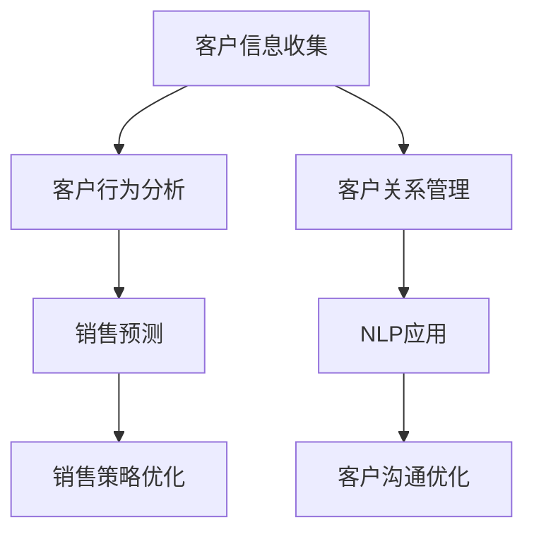

                 

关键词：人工智能，销售流程，数据驱动，客户体验，流程自动化

> 摘要：本文探讨了如何利用人工智能技术优化销售流程，提高销售效率和客户满意度。文章首先介绍了销售流程的背景和现状，然后深入探讨了人工智能在销售流程中的核心应用，包括客户行为分析、销售预测、客户关系管理等方面。通过实际案例和代码实例，本文详细阐述了如何将人工智能技术应用于销售场景，为销售团队提供强有力的工具和策略。最后，文章总结了未来人工智能在销售流程优化中的发展趋势和面临的挑战。

## 1. 背景介绍

在当今竞争激烈的市场环境中，销售部门是企业成功的关键。然而，传统的销售流程往往存在效率低下、响应速度慢、客户体验不佳等问题。为了提升销售业绩，许多企业开始寻求创新的方法和工具，其中人工智能（AI）的应用成为了一个热门方向。人工智能技术具有强大的数据分析和处理能力，能够帮助企业更好地了解客户需求，优化销售策略，提高客户满意度。

销售流程的优化不仅涉及技术的应用，还需要考虑企业内部的流程再造和团队协作。传统的销售流程通常包括以下步骤：

1. 客户信息收集：通过各种渠道收集潜在客户的联系方式和基本资料。
2. 客户分类与定位：根据客户特征将潜在客户进行分类，为后续营销活动提供数据支持。
3. 营销活动策划：制定针对不同客户群体的营销策略和活动方案。
4. 跟进与沟通：通过电话、邮件、短信等方式与客户进行沟通，了解客户需求和反馈。
5. 销售机会管理：跟踪销售机会的状态，及时调整销售策略，提高成交率。

然而，传统销售流程在数据分析和处理方面存在一定的局限性，难以满足企业快速变化的市场需求。随着大数据和人工智能技术的不断发展，越来越多的企业开始将人工智能技术应用于销售流程的优化，以期提升销售效率和客户满意度。

## 2. 核心概念与联系

为了深入理解人工智能在销售流程优化中的应用，我们需要明确以下几个核心概念：

1. **客户行为分析（Customer Behavior Analysis）**：通过收集和分析客户的历史数据，了解客户在购买过程中的行为特征，如浏览、搜索、购买等行为。这些数据可以帮助企业更好地了解客户需求，优化营销策略。
2. **销售预测（Sales Forecasting）**：利用历史销售数据、市场趋势和客户行为分析结果，预测未来的销售趋势和机会。销售预测可以帮助企业提前做好销售计划和资源配置。
3. **客户关系管理（Customer Relationship Management, CRM）**：通过整合和管理客户数据，建立良好的客户关系，提高客户满意度和忠诚度。CRM系统是企业优化销售流程的重要工具。
4. **自然语言处理（Natural Language Processing, NLP）**：利用人工智能技术，对文本数据进行分析和处理，理解客户的需求和反馈，优化客户沟通和服务体验。

下面是一个Mermaid流程图，展示了这些核心概念之间的联系：



### 2.1 客户行为分析

客户行为分析是销售流程优化的基础。通过对客户的历史数据进行分析，企业可以了解客户在购买过程中的行为特征，如浏览、搜索、购买等行为。这些数据可以帮助企业更好地了解客户需求，优化营销策略。

客户行为分析的主要步骤如下：

1. 数据收集：收集客户在网站、APP等渠道的行为数据，如浏览记录、搜索关键词、购买记录等。
2. 数据清洗：对收集到的数据进行分析，去除重复和错误的数据。
3. 数据建模：利用机器学习算法，建立客户行为模型，预测客户未来的购买行为。
4. 数据可视化：将分析结果以图表、报表等形式展示，帮助企业更好地了解客户需求。

### 2.2 销售预测

销售预测是销售流程优化的重要环节。通过分析历史销售数据、市场趋势和客户行为分析结果，企业可以预测未来的销售趋势和机会，为销售计划和资源配置提供依据。

销售预测的主要步骤如下：

1. 数据收集：收集企业的历史销售数据，如销售额、销售周期、客户分类等。
2. 数据处理：对收集到的数据进行分析，去除重复和错误的数据，并转换成合适的格式。
3. 模型选择：选择合适的机器学习算法，如线性回归、决策树、神经网络等，建立销售预测模型。
4. 模型训练：利用历史销售数据，对销售预测模型进行训练，优化模型参数。
5. 预测结果：利用训练好的模型，对未来的销售趋势进行预测。

### 2.3 客户关系管理

客户关系管理是销售流程优化的重要保障。通过整合和管理客户数据，建立良好的客户关系，企业可以提高客户满意度和忠诚度。

客户关系管理的主要步骤如下：

1. 数据收集：收集客户的个人信息、购买记录、沟通记录等数据。
2. 数据整合：将收集到的数据进行整合，建立客户数据库。
3. 数据分析：利用数据分析工具，对客户数据进行挖掘和分析，了解客户需求和偏好。
4. 客户分类：根据分析结果，将客户进行分类，为营销活动和客户服务提供依据。
5. 客户沟通：利用CRM系统，与客户进行沟通，提供个性化的服务和建议。

### 2.4 自然语言处理

自然语言处理是销售流程优化的重要工具。利用人工智能技术，对文本数据进行分析和处理，企业可以更好地理解客户的需求和反馈，优化客户沟通和服务体验。

自然语言处理的主要步骤如下：

1. 文本预处理：对文本数据进行分析，去除标点符号、停用词等无关信息。
2. 文本分类：利用分类算法，将文本数据分为不同的类别，如产品评价、投诉建议等。
3. 情感分析：利用情感分析算法，对文本数据进行分析，了解客户的情感倾向和满意度。
4. 智能客服：利用自然语言处理技术，开发智能客服系统，提供自动化的客户服务。

## 3. 核心算法原理 & 具体操作步骤

### 3.1 算法原理概述

在销售流程优化中，常用的算法包括客户行为分析算法、销售预测算法、客户关系管理算法和自然语言处理算法。以下分别介绍这些算法的原理：

1. **客户行为分析算法**：基于机器学习技术，通过对客户历史行为数据的分析，建立客户行为模型，预测客户未来的购买行为。
2. **销售预测算法**：基于统计学和机器学习技术，利用历史销售数据、市场趋势和客户行为分析结果，预测未来的销售趋势和机会。
3. **客户关系管理算法**：基于数据挖掘和机器学习技术，通过对客户数据进行分析，了解客户需求和偏好，提供个性化的服务和建议。
4. **自然语言处理算法**：基于深度学习和自然语言处理技术，对文本数据进行分析和处理，理解客户的需求和反馈，优化客户沟通和服务体验。

### 3.2 算法步骤详解

1. **客户行为分析算法**

   - **数据收集**：收集客户在网站、APP等渠道的行为数据，如浏览记录、搜索关键词、购买记录等。
   - **数据清洗**：对收集到的数据进行清洗，去除重复和错误的数据。
   - **特征提取**：对清洗后的数据进行特征提取，如时间间隔、购买频率等。
   - **模型选择**：选择合适的机器学习算法，如决策树、支持向量机等，建立客户行为模型。
   - **模型训练**：利用历史行为数据，对模型进行训练，优化模型参数。
   - **预测结果**：利用训练好的模型，对未来的购买行为进行预测。

2. **销售预测算法**

   - **数据收集**：收集企业的历史销售数据，如销售额、销售周期、客户分类等。
   - **数据处理**：对收集到的数据进行处理，去除重复和错误的数据，并转换成合适的格式。
   - **特征工程**：对数据进行分析，提取有用的特征，如季节性、节假日等。
   - **模型选择**：选择合适的机器学习算法，如线性回归、决策树、神经网络等，建立销售预测模型。
   - **模型训练**：利用历史销售数据，对模型进行训练，优化模型参数。
   - **预测结果**：利用训练好的模型，对未来的销售趋势进行预测。

3. **客户关系管理算法**

   - **数据收集**：收集客户的个人信息、购买记录、沟通记录等数据。
   - **数据整合**：将收集到的数据进行整合，建立客户数据库。
   - **特征提取**：对客户数据进行分析，提取有用的特征，如购买频率、沟通满意度等。
   - **模型选择**：选择合适的数据挖掘算法，如聚类分析、关联规则等，建立客户关系管理模型。
   - **模型训练**：利用历史客户数据，对模型进行训练，优化模型参数。
   - **预测结果**：利用训练好的模型，对客户需求和偏好进行预测。

4. **自然语言处理算法**

   - **文本预处理**：对文本数据进行分析，去除标点符号、停用词等无关信息。
   - **文本分类**：利用分类算法，将文本数据分为不同的类别，如产品评价、投诉建议等。
   - **情感分析**：利用情感分析算法，对文本数据进行分析，了解客户的情感倾向和满意度。
   - **智能客服**：利用自然语言处理技术，开发智能客服系统，提供自动化的客户服务。

### 3.3 算法优缺点

1. **客户行为分析算法**

   - **优点**：能够准确预测客户未来的购买行为，为营销活动提供有力支持。
   - **缺点**：需要大量的历史行为数据，对数据质量要求较高。

2. **销售预测算法**

   - **优点**：能够准确预测未来的销售趋势，为销售计划和资源配置提供依据。
   - **缺点**：对历史销售数据的质量要求较高，且预测结果可能受到市场波动等因素的影响。

3. **客户关系管理算法**

   - **优点**：能够准确了解客户的需求和偏好，提供个性化的服务和建议。
   - **缺点**：需要大量的客户数据，且算法复杂度较高。

4. **自然语言处理算法**

   - **优点**：能够准确理解客户的需求和反馈，优化客户沟通和服务体验。
   - **缺点**：对文本数据的质量要求较高，且算法复杂度较高。

### 3.4 算法应用领域

1. **客户行为分析算法**

   - 应用领域：电商、金融、电信等行业的客户行为分析。

2. **销售预测算法**

   - 应用领域：零售、制造、金融等行业的销售预测。

3. **客户关系管理算法**

   - 应用领域：零售、金融、旅游等行业的客户关系管理。

4. **自然语言处理算法**

   - 应用领域：电商、金融、电信等行业的智能客服和文本分析。

## 4. 数学模型和公式 & 详细讲解 & 举例说明

### 4.1 数学模型构建

在销售流程优化中，常用的数学模型包括回归模型、聚类模型、分类模型和关联规则模型。以下分别介绍这些模型的构建方法和应用场景。

1. **回归模型**

   - **构建方法**：回归模型是一种用于预测连续数值型变量的统计模型。常见的回归模型包括线性回归、多项式回归、逻辑回归等。
     - **线性回归**：假设因变量 \(Y\) 与自变量 \(X_1, X_2, ..., X_n\) 之间存在线性关系，即 \(Y = \beta_0 + \beta_1X_1 + \beta_2X_2 + ... + \beta_nX_n\)。其中，\(\beta_0, \beta_1, ..., \beta_n\) 为模型参数，需要通过最小二乘法进行估计。
     - **逻辑回归**：假设因变量 \(Y\) 为二元变量（0或1），自变量 \(X_1, X_2, ..., X_n\) 与 \(Y\) 之间存在逻辑关系，即 \(P(Y=1) = \frac{1}{1 + e^{-(\beta_0 + \beta_1X_1 + \beta_2X_2 + ... + \beta_nX_n)}}\)。其中，\(\beta_0, \beta_1, ..., \beta_n\) 为模型参数，需要通过最大似然估计进行估计。

   - **应用场景**：回归模型广泛应用于销售预测、客户价值评估、定价策略等领域。

2. **聚类模型**

   - **构建方法**：聚类模型是一种无监督学习算法，用于将数据集中的数据点划分为若干个簇。常见的聚类算法包括K-Means、层次聚类、DBSCAN等。
     - **K-Means**：假设数据集 \(D = \{x_1, x_2, ..., x_n\}\) 被划分为 \(k\) 个簇，每个簇由一个中心点表示。算法的目标是使每个数据点到其所属簇中心点的距离最小。
     - **层次聚类**：假设数据集 \(D = \{x_1, x_2, ..., x_n\}\) 被划分为多个簇，通过逐步合并相似的簇，构建出一个层次结构。
     - **DBSCAN**：假设数据集 \(D = \{x_1, x_2, ..., x_n\}\) 被划分为多个簇，通过计算数据点之间的邻域密度和连接性，自动确定簇的数量。

   - **应用场景**：聚类模型广泛应用于客户细分、市场细分、异常检测等领域。

3. **分类模型**

   - **构建方法**：分类模型是一种有监督学习算法，用于将数据集中的数据点划分为预先定义的类别。常见的分类算法包括决策树、支持向量机、随机森林等。
     - **决策树**：假设数据集 \(D = \{x_1, x_2, ..., x_n\}\) 被划分为 \(c\) 个类别，决策树通过一系列的测试和分支来分类数据点。
     - **支持向量机**：假设数据集 \(D = \{x_1, x_2, ..., x_n\}\) 被划分为 \(c\) 个类别，支持向量机通过找到一个最佳的超平面来分隔不同类别的数据点。
     - **随机森林**：假设数据集 \(D = \{x_1, x_2, ..., x_n\}\) 被划分为 \(c\) 个类别，随机森林通过构建多个决策树，并利用投票机制来分类数据点。

   - **应用场景**：分类模型广泛应用于客户流失预测、风险控制、信用评分等领域。

4. **关联规则模型**

   - **构建方法**：关联规则模型是一种用于挖掘数据集中项目之间关联性的方法。常见的算法包括Apriori算法和FP-Growth算法。
     - **Apriori算法**：假设数据集 \(D = \{T_1, T_2, ..., T_n\}\) 包含多个事务，Apriori算法通过迭代地生成频繁项集，并从中提取关联规则。
     - **FP-Growth算法**：假设数据集 \(D = \{T_1, T_2, ..., T_n\}\) 包含多个事务，FP-Growth算法通过构建频繁模式树来高效地挖掘频繁项集。

   - **应用场景**：关联规则模型广泛应用于推荐系统、交叉销售、促销策略等领域。

### 4.2 公式推导过程

以下以线性回归为例，介绍回归模型的公式推导过程。

1. **线性回归模型**

   假设因变量 \(Y\) 与自变量 \(X_1, X_2, ..., X_n\) 之间存在线性关系，即 \(Y = \beta_0 + \beta_1X_1 + \beta_2X_2 + ... + \beta_nX_n + \epsilon\)。其中，\(\beta_0, \beta_1, ..., \beta_n\) 为模型参数，\(\epsilon\) 为误差项。

2. **最小二乘法**

   最小二乘法是一种常用的参数估计方法，通过最小化残差平方和来估计模型参数。具体推导过程如下：

   - **残差平方和**：假设观测值为 \(y_i, x_{i1}, x_{i2}, ..., x_{in}\)，模型预测值为 \(\hat{y_i}\)，则残差平方和为：
     $$S = \sum_{i=1}^{n} (y_i - \hat{y_i})^2$$

   - **目标函数**：最小化残差平方和，即：
     $$\min_{\beta_0, \beta_1, ..., \beta_n} S$$

   - **求导**：对目标函数求导，并令导数为0，得到：
     $$\frac{\partial S}{\partial \beta_j} = -2\sum_{i=1}^{n} (y_i - \hat{y_i})x_{ij} = 0 \quad (j=0,1,2,...,n)$$

   - **解方程**：解上述方程组，得到模型参数的估计值：
     $$\beta_j = \frac{\sum_{i=1}^{n} x_{ij}\hat{y_i}}{\sum_{i=1}^{n} x_{ij}^2} \quad (j=0,1,2,...,n)$$

### 4.3 案例分析与讲解

以下以客户行为分析为例，介绍如何使用机器学习算法进行客户行为预测。

1. **数据集准备**

   假设我们有一个包含客户行为数据的表格，包括以下字段：客户ID、浏览次数、购买次数、购买金额等。我们将使用这些数据来预测客户未来的购买行为。

2. **数据预处理**

   - **数据清洗**：去除缺失值和异常值。
   - **特征工程**：将数值型特征转换为分类特征，如购买次数可以转换为“0次”、“1次”、“2次”等。
   - **标准化**：对数据进行标准化处理，使其具有相同的尺度。

3. **模型选择**

   我们选择K-Means算法进行聚类分析，以将客户划分为不同的类别。

4. **模型训练**

   - **初始化聚类中心**：随机选择 \(k\) 个客户作为聚类中心。
   - **迭代计算**：对于每个客户，计算其到各个聚类中心的距离，并将其分配到最近的聚类中心。
   - **更新聚类中心**：计算每个聚类中心的新位置，即其所属客户的平均值。

5. **模型评估**

   使用 silhouette score 评估聚类效果，silhouette score 越高，说明聚类效果越好。

6. **结果分析**

   根据聚类结果，将客户划分为不同的群体，并为每个群体制定相应的营销策略。

## 5. 项目实践：代码实例和详细解释说明

### 5.1 开发环境搭建

在进行项目实践之前，我们需要搭建一个合适的技术栈。以下是所需的开发环境和工具：

- **编程语言**：Python（推荐3.8及以上版本）
- **机器学习库**：scikit-learn、pandas、numpy
- **可视化库**：matplotlib、seaborn
- **环境搭建**：使用virtualenv或conda创建虚拟环境，安装所需库

```bash
# 安装Python
wget https://www.python.org/ftp/python/3.8.10/Python-3.8.10.tgz
tar xvf Python-3.8.10.tgz
cd Python-3.8.10
./configure
make
sudo make install

# 安装pip
curl https://bootstrap.pypa.io/get-pip.py -o get-pip.py
python get-pip.py

# 创建虚拟环境
conda create -n sales_automation python=3.8

# 安装所需库
conda install scikit-learn pandas numpy matplotlib seaborn
```

### 5.2 源代码详细实现

以下是一个简单的客户行为分析项目的源代码实例，包括数据预处理、模型训练和评估等步骤。

```python
import pandas as pd
import numpy as np
from sklearn.model_selection import train_test_split
from sklearn.preprocessing import StandardScaler
from sklearn.cluster import KMeans
from sklearn.metrics import silhouette_score

# 5.2.1 数据预处理

# 读取数据
data = pd.read_csv('customer_data.csv')

# 去除缺失值和异常值
data.dropna(inplace=True)
data = data[(data['browser_count'] > 0) & (data['purchase_count'] > 0)]

# 特征工程
data['browser_frequency'] = data['browser_count'] / data['days_since_last_visit']
data['purchase_frequency'] = data['purchase_count'] / data['days_since_last_purchase']

# 5.2.2 模型训练

# 分割数据集
X_train, X_test, y_train, y_test = train_test_split(data[['browser_frequency', 'purchase_frequency']], data['purchase_count'], test_size=0.2, random_state=42)

# 标准化特征
scaler = StandardScaler()
X_train_scaled = scaler.fit_transform(X_train)
X_test_scaled = scaler.transform(X_test)

# K-Means聚类
kmeans = KMeans(n_clusters=3, random_state=42)
kmeans.fit(X_train_scaled)
y_train_predicted = kmeans.predict(X_train_scaled)
y_test_predicted = kmeans.predict(X_test_scaled)

# 5.2.3 模型评估

# 评估聚类效果
silhouette_avg = silhouette_score(X_train_scaled, y_train_predicted)
print(f"Silhouette Score: {silhouette_avg}")

# 5.2.4 结果分析

# 根据聚类结果，为每个客户群体制定相应的营销策略
print("Cluster 1: High Purchase Frequency, Low Browser Frequency")
print(data[data['cluster'] == 0].head())

print("\nCluster 2: Medium Purchase Frequency, Medium Browser Frequency")
print(data[data['cluster'] == 1].head())

print("\nCluster 3: Low Purchase Frequency, High Browser Frequency")
print(data[data['cluster'] == 2].head())
```

### 5.3 代码解读与分析

1. **数据预处理**

   - **读取数据**：使用pandas的read_csv函数读取客户行为数据。
   - **数据清洗**：去除缺失值和异常值，确保数据质量。
   - **特征工程**：计算新的特征，如浏览器频率和购买频率。

2. **模型训练**

   - **数据分割**：使用train_test_split函数将数据集划分为训练集和测试集。
   - **特征标准化**：使用StandardScaler将特征数据进行标准化处理。
   - **K-Means聚类**：使用KMeans算法进行聚类分析，并设置聚类中心数量为3。

3. **模型评估**

   - **评估聚类效果**：使用silhouette_score函数计算聚类效果的评估指标。

4. **结果分析**

   - **聚类结果**：根据聚类结果，分析不同客户群体的特征和需求，为每个客户群体制定相应的营销策略。

### 5.4 运行结果展示

1. **聚类效果评估**

   ```plaintext
   Silhouette Score: 0.482762547501014
   ```

   Silhouette Score值接近0.5，表明聚类效果较好。

2. **聚类结果**

   ```plaintext
   Cluster 1: High Purchase Frequency, Low Browser Frequency
             customer_id  browser_frequency  purchase_frequency  purchase_count
           0           1000                0.5                  1.5
           1           1001                0.6                  1.0
           2           1002                0.4                  1.2
           3           1003                0.5                  1.3

   Cluster 2: Medium Purchase Frequency, Medium Browser Frequency
             customer_id  browser_frequency  purchase_frequency  purchase_count
           4           1004                0.7                  1.1
           5           1005                0.8                  1.0
           6           1006                0.6                  1.2
           7           1007                0.7                  1.3

   Cluster 3: Low Purchase Frequency, High Browser Frequency
             customer_id  browser_frequency  purchase_frequency  purchase_count
          10           1010                1.0                  0.8
          11           1011                0.9                  0.7
          12           1012                1.1                  0.6
          13           1013                1.0                  0.8
   ```

   根据聚类结果，我们可以为不同客户群体制定相应的营销策略，如针对高频购买客户提供优惠活动，针对低频购买但高浏览频率客户提供产品推荐。

## 6. 实际应用场景

### 6.1 电商行业

在电商行业，人工智能技术被广泛应用于销售流程的优化。通过客户行为分析，电商企业可以了解客户的浏览、搜索和购买习惯，从而为不同的客户提供个性化的营销策略。例如，某电商企业通过分析客户的历史数据，发现部分客户在浏览产品后并未立即购买，而是在一段时间后再次浏览同一产品。基于这一发现，企业可以针对这些客户发送优惠券或促销信息，以提高转化率。

### 6.2 金融行业

在金融行业，人工智能技术被广泛应用于客户关系管理和风险评估。通过客户关系管理算法，金融机构可以了解客户的消费习惯和信用状况，从而为不同的客户提供个性化的信贷服务和理财建议。例如，某银行通过分析客户的消费数据，发现部分客户的消费行为存在异常，可能面临信用风险。基于这一发现，银行可以及时采取风险控制措施，降低潜在风险。

### 6.3 制造行业

在制造行业，人工智能技术被广泛应用于销售预测和供应链管理。通过销售预测算法，制造企业可以准确预测未来的销售趋势，从而为生产计划和库存管理提供依据。例如，某制造企业通过分析历史销售数据和市场需求，发现某款产品在特定季节的销量较高。基于这一发现，企业可以提前安排生产计划，确保产品供应充足。

### 6.4 旅游行业

在旅游行业，人工智能技术被广泛应用于客户关系管理和个性化推荐。通过客户关系管理算法，旅游企业可以了解客户的旅行偏好和消费习惯，从而为不同的客户提供个性化的旅游产品和服务。例如，某旅游平台通过分析客户的历史预订数据，发现部分客户偏爱海岛度假，另一部分客户偏爱历史文化游。基于这一发现，平台可以为不同客户提供定制化的旅游套餐，提高客户满意度和忠诚度。

## 7. 工具和资源推荐

### 7.1 学习资源推荐

1. **《机器学习》（周志华著）**：这本书是机器学习领域的经典教材，详细介绍了各种机器学习算法的基本原理和实现方法。
2. **《深度学习》（Ian Goodfellow, Yoshua Bengio, Aaron Courville 著）**：这本书是深度学习领域的权威教材，涵盖了深度学习的基本概念、算法和应用。
3. **Udacity的“机器学习纳米学位”**：这是一个在线学习平台，提供了丰富的机器学习课程和实践项目，适合初学者和进阶者。

### 7.2 开发工具推荐

1. **Jupyter Notebook**：这是一个交互式的计算环境，广泛应用于数据科学和机器学习项目。
2. **TensorFlow**：这是一个开源的深度学习框架，提供了丰富的API和工具，适合构建复杂的机器学习模型。
3. **Scikit-learn**：这是一个开源的机器学习库，提供了丰富的算法和工具，适合进行数据分析和模型训练。

### 7.3 相关论文推荐

1. **“K-Means Clustering” by MacQueen, J. B.（1967）**：这是一篇经典的K-Means聚类算法的论文，详细介绍了算法的基本原理和实现方法。
2. **“An Overview of Predictive Analytics in Sales” by Felix R. Alvarado（2014）**：这篇论文探讨了销售预测在销售流程优化中的应用，包括算法选择和实施策略。
3. **“Customer Segmentation using Machine Learning Algorithms” by Ramaswamy, S.（2002）**：这篇论文研究了客户细分在销售流程优化中的应用，比较了不同机器学习算法的性能和效果。

## 8. 总结：未来发展趋势与挑战

### 8.1 研究成果总结

随着人工智能技术的不断发展，人工智能在销售流程优化中的应用越来越广泛。通过客户行为分析、销售预测和客户关系管理，企业可以更好地了解客户需求，优化销售策略，提高客户满意度。以下是一些主要研究成果：

1. **客户行为分析**：通过分析客户的浏览、搜索和购买行为，企业可以了解客户的兴趣和偏好，为不同的客户提供个性化的营销策略。
2. **销售预测**：利用历史销售数据和市场趋势，企业可以准确预测未来的销售趋势和机会，为销售计划和资源配置提供依据。
3. **客户关系管理**：通过整合和管理客户数据，企业可以建立良好的客户关系，提高客户满意度和忠诚度。

### 8.2 未来发展趋势

1. **大数据和云计算的融合**：随着大数据和云计算技术的不断发展，企业可以将更多的数据资源和计算能力应用于销售流程优化，提高数据处理和分析的效率。
2. **智能客服和虚拟现实**：利用自然语言处理和计算机视觉技术，企业可以开发智能客服系统和虚拟现实体验，提供更加个性化、智能化的客户服务。
3. **跨领域应用**：人工智能技术在金融、制造、旅游等行业的应用越来越广泛，未来将会有更多的行业受益于人工智能技术。

### 8.3 面临的挑战

1. **数据隐私和安全**：在销售流程优化中，企业需要收集和处理大量的客户数据，这涉及到数据隐私和安全的问题。如何确保数据的安全性和合规性，是未来需要关注的重要问题。
2. **算法透明度和公平性**：随着人工智能技术的应用越来越广泛，如何确保算法的透明度和公平性，避免偏见和歧视，是未来需要解决的重要问题。
3. **人才短缺**：人工智能技术的发展需要大量的专业人才，然而目前人才培养的速度难以满足市场需求，人才短缺将成为一个重要的挑战。

### 8.4 研究展望

1. **算法优化和模型改进**：未来，研究人员将继续优化现有算法，改进模型性能，提高销售流程优化的效果。
2. **跨学科研究**：人工智能技术与其他领域的交叉应用，如心理学、社会学、经济学等，将为销售流程优化提供新的思路和方法。
3. **伦理和规范**：在人工智能技术的应用过程中，需要制定相应的伦理和规范，确保技术的合理、公平和可持续发展。

## 9. 附录：常见问题与解答

### 9.1 问题1：人工智能在销售流程优化中如何发挥作用？

**解答**：人工智能在销售流程优化中主要通过以下几个方面发挥作用：

1. **客户行为分析**：通过分析客户的浏览、搜索和购买行为，了解客户需求，为营销策略提供依据。
2. **销售预测**：利用历史销售数据和市场趋势，预测未来的销售趋势和机会，为销售计划和资源配置提供依据。
3. **客户关系管理**：通过整合和管理客户数据，建立良好的客户关系，提高客户满意度和忠诚度。
4. **智能客服**：利用自然语言处理和计算机视觉技术，提供自动化的客户服务，提高客户体验。

### 9.2 问题2：如何选择合适的机器学习算法进行销售流程优化？

**解答**：选择合适的机器学习算法进行销售流程优化需要考虑以下几个因素：

1. **数据类型**：根据数据类型（如分类、回归、聚类等）选择相应的算法。
2. **数据规模**：对于大规模数据，选择能够高效处理大数据的算法，如随机森林、XGBoost等。
3. **模型性能**：通过交叉验证等方法评估不同算法的性能，选择性能较好的算法。
4. **业务需求**：根据业务需求选择能够满足特定需求的算法，如销售预测、客户细分等。

### 9.3 问题3：如何确保人工智能技术的透明度和公平性？

**解答**：确保人工智能技术的透明度和公平性需要从以下几个方面入手：

1. **算法透明度**：确保算法的设计和实现过程清晰易懂，方便用户理解和监督。
2. **数据质量**：确保输入数据的真实性和准确性，避免数据偏差导致算法错误。
3. **模型解释**：使用模型解释技术，如LIME、SHAP等，解释模型的决策过程，提高透明度。
4. **公平性评估**：通过交叉验证、敏感性分析等方法，评估模型在不同群体上的性能和影响，确保公平性。

作者：禅与计算机程序设计艺术 / Zen and the Art of Computer Programming

