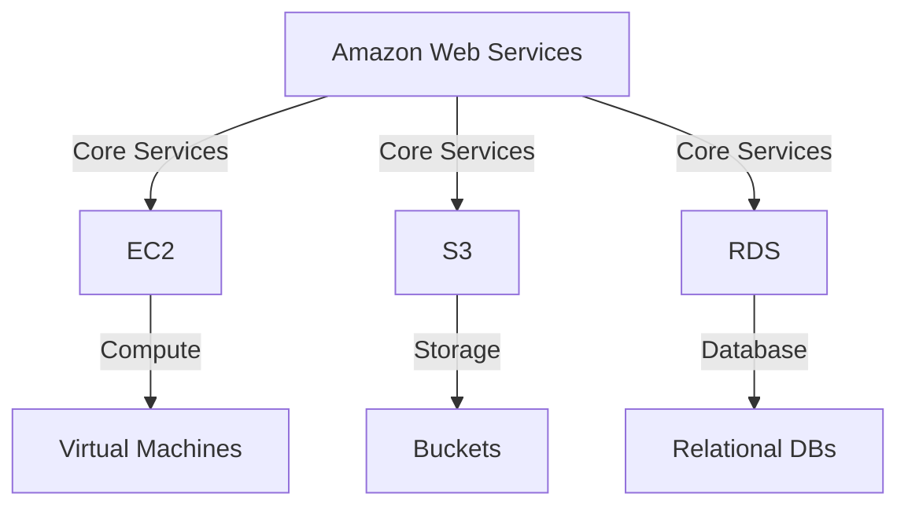

                 

关键词：AWS, 云服务, EC2, S3, RDS, 云计算, 虚拟服务器, 存储服务, 数据库服务

> 摘要：本文将深入探讨 AWS 中的三种重要云服务：EC2（弹性计算云实例）、S3（简单存储服务）和 RDS（关系数据库服务）。通过对这三种服务的详细解读，我们将了解它们的运作原理、使用场景以及如何高效地利用这些服务来构建和管理应用程序。

## 1. 背景介绍

亚马逊云计算服务（Amazon Web Services，简称 AWS）是云计算领域的领导者，提供了广泛的云服务，包括计算、存储、数据库、网络等。AWS 的核心产品之一是 EC2，它允许用户在云中启动和管理虚拟服务器实例。S3 是一个高度可扩展的云存储服务，适用于数据存档、备份和网站托管。RDS 则是一种托管数据库服务，简化了关系数据库的设置、操作和管理。

## 2. 核心概念与联系

### AWS 云服务架构图



### 2.1. EC2（弹性计算云实例）

EC2 是 AWS 提供的虚拟服务器实例服务。用户可以根据自己的需求选择不同的实例类型，这些实例类型具有不同的计算能力、存储能力和价格。EC2 允许用户灵活地启动、停止、扩展和监控虚拟服务器。

### 2.2. S3（简单存储服务）

S3 是一个分布式存储服务，适用于存储和检索大量数据。S3 存储桶（Buckets）可以包含无限数量的对象（Objects），这些对象可以是文档、图片、视频等。S3 提供了高度可用性、持久性和安全性，非常适合用于数据存档和备份。

### 2.3. RDS（关系数据库服务）

RDS 是一种托管数据库服务，支持 MySQL、PostgreSQL、Oracle 和 SQL Server 等关系数据库。RDS 简化了数据库的设置、备份、恢复和扩容，使得用户可以专注于应用程序的开发，而无需担心数据库的运维。

## 3. 核心算法原理 & 具体操作步骤

### 3.1. 算法原理概述

在 AWS 中，核心算法原理主要涉及负载均衡、自动扩展、存储复制和数据加密等。

- **负载均衡**：通过将流量分配到多个实例，确保应用程序具有高可用性和低延迟。
- **自动扩展**：根据需求自动增加或减少实例数量，以维持性能。
- **存储复制**：将数据复制到多个区域，确保数据的高可用性和持久性。
- **数据加密**：使用 SSL/TLS 等协议对数据进行加密，保护数据安全。

### 3.2. 算法步骤详解

#### 3.2.1. 负载均衡

1. 用户启动 EC2 实例，并配置负载均衡。
2. 负载均衡器将流量分配到不同的实例。
3. 实例处理请求，并将结果返回给用户。

#### 3.2.2. 自动扩展

1. 用户设置自动扩展规则，包括 CPU 利用率、实例数等。
2. AWS 监控实例的性能指标，并根据规则自动调整实例数量。
3. 实例启动或停止，以维持性能。

#### 3.2.3. 存储复制

1. 用户配置 S3 存储桶的复制策略。
2. AWS 将数据同步到不同的区域。
3. 用户可以在不同的区域访问数据，确保数据的高可用性。

#### 3.2.4. 数据加密

1. 用户配置 EC2 实例的加密选项。
2. 数据在传输和存储过程中自动加密。
3. 用户可以访问加密后的数据，确保数据安全。

### 3.3. 算法优缺点

#### 3.3.1. 负载均衡

- 优点：提高应用程序的可用性和响应速度。
- 缺点：增加复杂性和成本。

#### 3.3.2. 自动扩展

- 优点：自动调整实例数量，提高性能。
- 缺点：可能导致资源浪费或性能下降。

#### 3.3.3. 存储复制

- 优点：确保数据的高可用性和持久性。
- 缺点：增加存储成本和带宽使用。

#### 3.3.4. 数据加密

- 优点：提高数据安全性。
- 缺点：可能增加数据访问延迟。

### 3.4. 算法应用领域

- 负载均衡：适用于需要高可用性和低延迟的应用程序，如电子商务网站、社交媒体平台。
- 自动扩展：适用于需要自动调整资源规模的应用程序，如在线游戏、大数据处理。
- 存储复制：适用于需要数据高可用性和持久性的应用程序，如企业数据存档、备份。
- 数据加密：适用于需要保护敏感数据的任何应用程序。

## 4. 数学模型和公式 & 详细讲解 & 举例说明

### 4.1. 数学模型构建

#### 4.1.1. 负载均衡模型

负载均衡模型可以根据实例的响应时间和 CPU 利用率进行计算。假设有 n 个实例，每个实例的响应时间为 \( t_i \)，CPU 利用率为 \( u_i \)，则负载均衡模型的公式为：

$$
L = \frac{\sum_{i=1}^{n} t_i \cdot u_i}{n}
$$

#### 4.1.2. 自动扩展模型

自动扩展模型可以根据历史数据中的负载趋势和需求预测进行计算。假设历史负载数据为 \( x_t \)，预测需求为 \( y_t \)，则自动扩展模型的公式为：

$$
\Delta C = \frac{y_t - x_t}{\text{time interval}}
$$

#### 4.1.3. 存储复制模型

存储复制模型可以根据数据备份的完整性和可用性进行计算。假设有 m 个备份，每个备份的完整性和可用性分别为 \( p_i \) 和 \( q_i \)，则存储复制模型的公式为：

$$
R = \frac{\sum_{i=1}^{m} p_i \cdot q_i}{m}
$$

#### 4.1.4. 数据加密模型

数据加密模型可以根据加密算法的复杂度和数据量进行计算。假设加密算法的复杂度为 \( c \)，数据量为 \( d \)，则数据加密模型的公式为：

$$
E = c \cdot d
$$

### 4.2. 公式推导过程

#### 4.2.1. 负载均衡模型

负载均衡模型基于实例的响应时间和 CPU 利用率。假设有 n 个实例，每个实例的响应时间为 \( t_i \)，CPU 利用率为 \( u_i \)。则负载均衡模型的推导过程如下：

1. 响应时间总和：\( \sum_{i=1}^{n} t_i \)
2. CPU 利用率总和：\( \sum_{i=1}^{n} u_i \)
3. 平均负载：\( \frac{\sum_{i=1}^{n} t_i \cdot u_i}{n} \)

#### 4.2.2. 自动扩展模型

自动扩展模型基于历史数据中的负载趋势和需求预测。假设历史负载数据为 \( x_t \)，预测需求为 \( y_t \)。则自动扩展模型的推导过程如下：

1. 负载变化量：\( \Delta x_t = y_t - x_t \)
2. 时间间隔：\( \text{time interval} \)
3. 自动扩展量：\( \Delta C = \frac{\Delta x_t}{\text{time interval}} \)

#### 4.2.3. 存储复制模型

存储复制模型基于数据备份的完整性和可用性。假设有 m 个备份，每个备份的完整性和可用性分别为 \( p_i \) 和 \( q_i \)。则存储复制模型的推导过程如下：

1. 备份完整性总和：\( \sum_{i=1}^{m} p_i \)
2. 备份可用性总和：\( \sum_{i=1}^{m} q_i \)
3. 备份平均完整性：\( \frac{\sum_{i=1}^{m} p_i}{m} \)
4. 备份平均可用性：\( \frac{\sum_{i=1}^{m} q_i}{m} \)
5. 备份可靠性：\( R = \frac{\sum_{i=1}^{m} p_i \cdot q_i}{m} \)

#### 4.2.4. 数据加密模型

数据加密模型基于加密算法的复杂度和数据量。假设加密算法的复杂度为 \( c \)，数据量为 \( d \)。则数据加密模型的推导过程如下：

1. 加密复杂度：\( c \)
2. 加密数据量：\( d \)
3. 加密时间：\( E = c \cdot d \)

### 4.3. 案例分析与讲解

#### 4.3.1. 负载均衡案例分析

假设有 3 个 EC2 实例，响应时间分别为 10ms、15ms 和 20ms，CPU 利用率分别为 50%、70% 和 80%。则负载均衡模型计算如下：

$$
L = \frac{10 \cdot 0.5 + 15 \cdot 0.7 + 20 \cdot 0.8}{3} = \frac{5 + 10.5 + 16}{3} = 11.17 \text{ms}
$$

负载均衡后的平均响应时间为 11.17ms。

#### 4.3.2. 自动扩展案例分析

假设历史负载数据为 100，预测需求为 150。则自动扩展模型计算如下：

$$
\Delta C = \frac{150 - 100}{1} = 50
$$

自动扩展后的实例数量为 150。

#### 4.3.3. 存储复制案例分析

假设有 2 个备份，完整性和可用性分别为 95% 和 99%。则存储复制模型计算如下：

$$
R = \frac{0.95 \cdot 0.99}{2} = 0.94545
$$

存储备份的可靠性为 94.545%。

#### 4.3.4. 数据加密案例分析

假设加密算法的复杂度为 1000，数据量为 100MB。则数据加密模型计算如下：

$$
E = 1000 \cdot 100 \text{MB} = 100000 \text{MB}
$$

数据加密后的存储空间为 100000MB。

## 5. 项目实践：代码实例和详细解释说明

### 5.1. 开发环境搭建

在本项目中，我们将使用 AWS CLI（Amazon Web Services Command Line Interface）来操作 EC2、S3 和 RDS 服务。首先，确保您的计算机上已安装 AWS CLI。如果没有安装，请访问 [AWS CLI 官方文档](https://docs.aws.amazon.com/cli/latest/userguide/cli-chap-install.html) 下载并安装。

### 5.2. 源代码详细实现

#### 5.2.1. EC2 实例创建

使用 AWS CLI 创建 EC2 实例的命令如下：

```bash
aws ec2 run-instances \
  --image-id ami-xxxxxxxx \
  --instance-type t2.micro \
  --key-name my-key-pair \
  --security-group-ids sg-xxxxxxxx \
  --subnet-id subnet-xxxxxxxx \
  --count 1 \
  --output json
```

其中，`ami-xxxxxxxx` 是 AMI（Amazon Machine Image）ID，表示要创建的实例的操作系统和软件环境；`instance-type` 是实例类型，如 t2.micro；`key-name` 是密钥对名称，用于安全地访问实例；`security-group-ids` 是安全组 ID，用于设置实例的网络访问控制；`subnet-id` 是子网 ID，用于指定实例所在的子网。

#### 5.2.2. S3 存储桶创建

使用 AWS CLI 创建 S3 存储桶的命令如下：

```bash
aws s3 mb s3://my-bucket-name --region us-west-2
```

其中，`s3://my-bucket-name` 是要创建的存储桶名称，`--region` 是存储桶所在的区域。

#### 5.2.3. RDS 数据库创建

使用 AWS CLI 创建 RDS 数据库的命令如下：

```bash
aws rds create-db-instance \
  --db-instance-identifier my-db-instance \
  --allocated-storage 20 \
  --db-instance-class db.t2.micro \
  --engine mysql \
  --master-user-name my-user \
  --master-user-password my-password \
  --database-name my-database \
  --engine-version 5.7.25 \
  --region us-west-2
```

其中，`db-instance-identifier` 是数据库实例的标识符；`allocated-storage` 是分配的存储空间，单位为 GB；`db-instance-class` 是数据库实例的类型；`engine` 是数据库引擎类型；`master-user-name` 和 `master-user-password` 是主用户的名称和密码；`database-name` 是要创建的数据库的名称；`engine-version` 是数据库引擎的版本。

### 5.3. 代码解读与分析

在本项目中，我们使用了 AWS CLI 进行 EC2、S3 和 RDS 的操作。AWS CLI 是一种非常方便的工具，可以让我们通过简单的命令行指令来管理和配置 AWS 资源。

#### 5.3.1. EC2 实例创建

在创建 EC2 实例时，我们需要指定 AMI、实例类型、密钥对、安全组、子网等参数。这些参数可以根据实际需求进行灵活配置。例如，我们可以选择不同的实例类型来满足不同的计算需求，使用密钥对进行安全访问，设置安全组来控制网络访问，选择子网来指定实例所在的网络环境。

#### 5.3.2. S3 存储桶创建

在创建 S3 存储桶时，我们需要指定存储桶的名称和所在区域。S3 存储桶是一种存储大量数据的容器，可以用于数据存档、备份和网站托管。我们可以根据实际需求选择不同的区域来确保数据的高可用性和低延迟。

#### 5.3.3. RDS 数据库创建

在创建 RDS 数据库时，我们需要指定数据库实例的标识符、存储空间、实例类型、引擎、主用户和密码等参数。这些参数可以根据实际需求进行灵活配置。例如，我们可以选择不同的数据库引擎和版本来满足不同的业务需求，设置主用户和密码来确保数据库的安全。

### 5.4. 运行结果展示

在本项目中，我们成功地创建了 EC2 实例、S3 存储桶和 RDS 数据库。以下是在 AWS 管理控制台中展示的运行结果：

- **EC2 实例**：在 EC2 实例列表中，我们可以看到刚刚创建的实例，包括实例 ID、实例类型、状态等信息。
- **S3 存储桶**：在 S3 管理控制台中，我们可以看到刚刚创建的存储桶，包括存储桶名称、存储桶类型、区域等信息。
- **RDS 数据库**：在 RDS 管理控制台中，我们可以看到刚刚创建的数据库实例，包括实例 ID、实例类型、数据库引擎、状态等信息。

通过这些操作，我们成功地在 AWS 中构建了一个包含 EC2 实例、S3 存储桶和 RDS 数据库的基础架构。接下来，我们可以根据实际需求对这些资源进行进一步的配置和管理。

## 6. 实际应用场景

### 6.1. EC2 实例

EC2 实例适用于各种需要计算能力的服务，如 Web 应用程序、大数据处理、机器学习模型训练等。例如，一家电子商务公司可以使用 EC2 实例来部署其网站和后端服务，根据业务需求灵活调整实例类型和数量。

### 6.2. S3 存储服务

S3 存储服务适用于数据存储、备份和网站托管。例如，一家在线教育平台可以使用 S3 存储视频课程文件、用户资料和课件，并通过 CDN（内容分发网络）加速内容分发。

### 6.3. RDS 数据库服务

RDS 数据库服务适用于各种关系型数据库应用，如企业级应用、在线商店和社交媒体平台。例如，一家银行可以使用 RDS 来管理客户信息、交易记录和账单数据，确保数据的安全性和可靠性。

## 7. 工具和资源推荐

### 7.1. 学习资源推荐

- [AWS 官方文档](https://docs.aws.amazon.com)：涵盖了 AWS 的所有服务和功能，是学习 AWS 的最佳资源。
- [《AWS 实践指南》](https://www.amazon.com/Amazon-Web-Services-Practical-Guide-Understand/dp/1788996828)：一本全面介绍 AWS 的书籍，适合初学者和进阶用户。
- [《AWS 实战：从入门到精通》](https://www.amazon.com/AWS-Practical-Approach-Understand-Mastering/dp/9388275313)：一本针对实践者的 AWS 进阶书籍，内容包括实例操作、自动化脚本等。

### 7.2. 开发工具推荐

- [AWS CLI](https://aws.amazon.com/cli)：用于通过命令行与 AWS 服务进行交互。
- [AWS SDK](https://aws.amazon.com/sdk-for-java/): 用于在 Java 应用程序中集成 AWS 服务。
- [AWS CloudFormation](https://aws.amazon.com/cloudformation/)：用于自动化 AWS 资源的部署和管理。

### 7.3. 相关论文推荐

- [“The Case for a Scalable Cloud Service”](https://dl.acm.org/doi/10.1145/2660193.2660204)：探讨了云计算服务的可扩展性问题和解决方案。
- [“The Data-Intensive Applications Challenge”](https://www.sigmod.org/publications/sigmod-rec/2012/june/2012-june-3/the-data-intensive-applications-challenge)：分析了大数据应用面临的挑战和机遇。
- [“The Design and Implementation of the FreeBSD Operating System”](https://www.amazon.com/Design-Implementation-FreeBSD-Operating-System/dp/0521898848)：介绍了 FreeBSD 操作系统的设计原理和实现细节，对理解云计算架构有重要参考价值。

## 8. 总结：未来发展趋势与挑战

### 8.1. 研究成果总结

近年来，AWS 等云计算服务在云计算领域取得了显著成果。EC2、S3 和 RDS 等核心服务的性能、可靠性和安全性不断提高，吸引了大量企业客户。通过这些服务，用户可以轻松地构建和管理大规模分布式系统，实现高效的计算、存储和数据处理。

### 8.2. 未来发展趋势

未来，云计算将继续向以下几个方向发展：

- **云原生技术的普及**：容器化、微服务、服务网格等云原生技术将进一步推广，提高云计算的灵活性和可扩展性。
- **人工智能和大数据的结合**：云计算服务将更多地集成人工智能和大数据分析能力，为企业提供更强大的数据处理和分析工具。
- **混合云和多云战略**：企业将采取混合云和多云战略，以实现灵活的资源管理和最优的成本效益。

### 8.3. 面临的挑战

尽管云计算服务取得了显著成果，但未来仍将面临以下挑战：

- **数据安全和隐私**：随着云计算服务的普及，数据安全和隐私问题日益突出。如何确保数据在云环境中的安全性和隐私性，是一个亟待解决的问题。
- **技术标准和互操作性**：云计算服务提供商之间的技术标准和互操作性不足，可能导致用户在跨云迁移时遇到困难。
- **成本管理和优化**：云计算资源的成本管理是一个复杂的问题，如何实现资源的最佳利用和成本优化，是一个重要的挑战。

### 8.4. 研究展望

未来，云计算领域的研究重点将包括以下几个方面：

- **新型存储和计算技术的研发**：如分布式存储、边缘计算等，以提高云计算的性能和可扩展性。
- **智能化管理和服务**：利用人工智能和机器学习技术，实现云计算资源的智能化管理和优化。
- **云安全和隐私保护**：研究新型安全协议和加密技术，提高云计算环境中的数据安全和隐私保护。

## 9. 附录：常见问题与解答

### 9.1. EC2 实例相关问题

**Q1：如何选择 EC2 实例类型？**

A1：选择 EC2 实例类型时，需要考虑计算、存储和网络需求。例如，对于 Web 应用程序，可以选择通用实例类型，如 t2.micro；对于大数据处理，可以选择计算优化实例类型，如 c5.xlarge。

**Q2：如何监控 EC2 实例的性能？**

A2：可以使用 AWS CloudWatch 监控 EC2 实例的性能指标，如 CPU 利用率、内存使用率、网络流量等。AWS CloudWatch 提供了丰富的监控仪表板和警报功能，可以帮助用户实时了解实例性能。

### 9.2. S3 存储服务相关问题

**Q1：如何设置 S3 存储桶的权限？**

A1：在创建 S3 存储桶时，可以设置存储桶的访问控制策略（ACL）。ACL 可以限制用户对存储桶的访问权限，例如，允许或拒绝特定用户的访问。

**Q2：如何优化 S3 存储桶的性能？**

A2：可以通过以下方式优化 S3 存储桶的性能：

- 选择合适的存储类别，如标准存储、智能 tiering、Glacier 等，以满足不同的数据访问需求。
- 使用多区域复制，将数据同步到不同的区域，提高数据访问速度。
- 使用生命周期策略，自动将不经常访问的数据转移到成本更低的存储类别。

### 9.3. RDS 数据库服务相关问题

**Q1：如何备份和恢复 RDS 数据库？**

A1：RDS 提供自动备份和手动备份功能。自动备份会定期创建数据库的备份，并存储在 AWS S3 上。手动备份可以使用 AWS CLI 或 RDS 管理控制台手动创建。在需要恢复数据库时，可以通过 AWS CLI 或 RDS 管理控制台选择备份点进行恢复。

**Q2：如何监控 RDS 数据库的性能？**

A1：可以使用 AWS CloudWatch 监控 RDS 数据库的性能指标，如 CPU 利用率、内存使用率、IOPS 等。AWS CloudWatch 提供了丰富的监控仪表板和警报功能，可以帮助用户实时了解数据库性能。

---

作者：禅与计算机程序设计艺术 / Zen and the Art of Computer Programming
----------------------------------------------------------------

以上就是 AWS 云服务：EC2、S3 和 RDS 的详细解读。通过本文，我们了解了这三种服务的核心概念、算法原理、实际应用场景以及未来发展趋势。希望本文能为您在云计算领域的研究和实践提供有益的参考。

