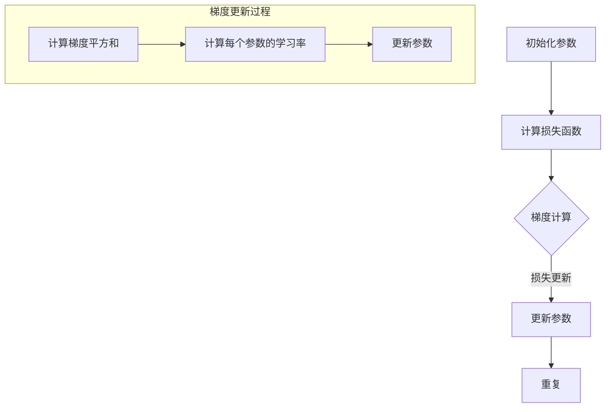

                 

### 关键词 Keywords
- AdaGrad
- 优化器
- 梯度下降
- 神经网络
- 数学模型
- Python代码实例

<|assistant|>### 摘要 Abstract
本文将深入探讨AdaGrad优化器的原理和实现。AdaGrad是一种自适应学习率优化器，通过为每个参数分配不同的学习率，解决了传统梯度下降优化器在训练过程中遇到的收敛速度慢和易陷入局部最优的问题。文章首先介绍了梯度下降优化器的基本概念，随后详细解释了AdaGrad优化器的算法原理、数学模型以及应用领域。通过一个具体的代码实例，本文展示了如何在实际项目中使用AdaGrad优化器进行训练。最后，文章总结了AdaGrad优化器的优势和局限性，并对其未来发展趋势进行了展望。

<|assistant|>## 1. 背景介绍 Background

在深度学习领域，优化器是训练神经网络过程中至关重要的组件之一。优化器负责调整网络中的参数，以最小化损失函数，从而提高模型的预测准确性。梯度下降（Gradient Descent）是最常用的优化算法之一，它通过不断更新参数来减少损失。然而，梯度下降存在一些问题，比如收敛速度慢、易陷入局部最优等。

为了解决这些问题，研究人员提出了多种自适应学习率优化器，其中AdaGrad是一种非常有效的优化器。AdaGrad通过为每个参数分配不同的学习率，解决了梯度下降中学习率统一调整所带来的不足。这使得AdaGrad在处理稀疏数据和大规模神经网络时表现尤为出色。

本文将详细介绍AdaGrad优化器的原理，并通过一个简单的Python代码实例，展示如何在实际项目中应用AdaGrad优化器。读者将了解如何通过调整参数来优化模型的性能，并掌握AdaGrad优化器在实际应用中的使用方法。

<|assistant|>## 2. 核心概念与联系 Core Concepts and Connections

在深入了解AdaGrad优化器之前，我们需要了解几个核心概念，包括梯度下降、学习率以及损失函数。

### 梯度下降

梯度下降是一种用于最小化损失函数的优化算法。在深度学习中，损失函数通常表示模型预测与实际结果之间的差异。梯度下降的核心思想是通过计算损失函数关于每个参数的梯度，然后沿着梯度的反方向更新参数，以逐步减少损失。

$$\text{参数更新} = \text{参数} - \alpha \cdot \nabla \text{损失函数}$$

其中，$\alpha$ 是学习率，$\nabla \text{损失函数}$ 是损失函数关于参数的梯度。

### 学习率

学习率是梯度下降算法中的一个关键参数，它决定了参数更新的步长。如果学习率过大，模型可能会错过最优解；如果学习率过小，收敛速度会变慢。选择合适的学习率是深度学习训练过程中的一个重要挑战。

### 损失函数

损失函数用于衡量模型的预测结果与实际结果之间的误差。在神经网络中，常用的损失函数包括均方误差（MSE）和交叉熵（Cross-Entropy）。损失函数的值越低，表示模型的预测越准确。

### AdaGrad与梯度下降的关系

AdaGrad是一种改进的梯度下降优化器，它通过为每个参数分配不同的学习率，解决了传统梯度下降中学习率统一调整的不足。具体来说，AdaGrad使用一个累积的二次梯度来动态调整每个参数的学习率。

<|assistant|>### Mermaid 流程图 Mermaid Flowchart

下面是一个简化的Mermaid流程图，描述了AdaGrad优化器的基本流程：



在这个流程图中，A表示初始化参数，B表示计算损失函数，C表示计算梯度，D表示更新参数，E表示重复训练过程。子图部分展示了梯度更新过程中的具体步骤，包括计算梯度平方和、计算每个参数的学习率以及参数更新。

<|assistant|>## 3. 核心算法原理 & 具体操作步骤 Core Algorithm Principles & Detailed Steps

### 3.1 算法原理概述

AdaGrad优化器的基本原理是通过累积梯度平方和来动态调整每个参数的学习率。具体来说，AdaGrad维护一个累积的变量，用于记录每个参数过去梯度的平方和。在每次更新参数时，该累积变量被用来调整学习率，使得梯度较小的参数拥有较大的学习率，而梯度较大的参数拥有较小的学习率。

### 3.2 算法步骤详解

#### 步骤1：初始化参数

初始化模型参数 $w$ 和学习率 $\alpha$，同时初始化累积变量 $g^2$ 为零。

$$
w \leftarrow \text{初始化参数} \\
\alpha \leftarrow \text{初始化学习率} \\
g^2 \leftarrow 0
$$

#### 步骤2：计算梯度

计算损失函数关于参数的梯度 $\nabla L(w)$。

$$
\nabla L(w) \leftarrow \text{计算梯度}
$$

#### 步骤3：更新累积变量

将当前梯度平方累加到累积变量中。

$$
g^2 \leftarrow g^2 + (\nabla L(w))^2
$$

#### 步骤4：更新参数

使用调整后的学习率更新参数。

$$
w \leftarrow w - \alpha \cdot \frac{\nabla L(w)}{\sqrt{g^2 + \epsilon}}
$$

其中，$\epsilon$ 是一个很小的正数，用于防止分母为零。

#### 步骤5：重复迭代

重复以上步骤，直到满足停止条件（如达到指定迭代次数或损失函数值低于阈值）。

### 3.3 算法优缺点

**优点：**

- **自适应学习率：**AdaGrad为每个参数分配不同的学习率，能够更好地处理稀疏数据和不同规模的参数。
- **减少振荡：**通过累积梯度平方和，AdaGrad能够减少参数更新过程中的振荡，使得训练过程更加稳定。

**缺点：**

- **早期过拟合：**在训练初期，AdaGrad可能由于较大的学习率导致模型过拟合。
- **稀疏更新：**由于累积的梯度平方和，某些参数可能永远不会被更新，特别是当梯度值较小时。

### 3.4 算法应用领域

AdaGrad优化器在深度学习领域有着广泛的应用，特别是在处理稀疏数据和大规模神经网络时表现出色。以下是一些常见的应用领域：

- **图像分类：**在卷积神经网络（CNN）中，AdaGrad常用于图像分类任务，如ImageNet竞赛。
- **自然语言处理：**在循环神经网络（RNN）和Transformer模型中，AdaGrad有助于提高模型的训练效率和预测准确性。
- **推荐系统：**在推荐系统中，AdaGrad优化器能够有效地处理稀疏数据，提高推荐质量。

<|assistant|>### 4. 数学模型和公式 & 详细讲解 & 举例说明

在深入理解AdaGrad优化器的数学模型之前，我们需要回顾一些基础的数学概念，包括梯度、偏导数以及泰勒展开。

#### 4.1 数学模型构建

##### 梯度和偏导数

在多元函数中，梯度是一个向量，表示函数在某个点的切向量。对于函数 $f(x, y)$，其在点 $(x_0, y_0)$ 的梯度可以表示为：

$$
\nabla f(x_0, y_0) = \left( \frac{\partial f}{\partial x}(x_0, y_0), \frac{\partial f}{\partial y}(x_0, y_0) \right)
$$

其中，$\frac{\partial f}{\partial x}$ 和 $\frac{\partial f}{\partial y}$ 分别是函数 $f$ 关于 $x$ 和 $y$ 的偏导数。

在深度学习中，梯度用于计算损失函数关于模型参数的偏导数。例如，对于损失函数 $L(w, b)$，其在参数 $w$ 的偏导数可以表示为：

$$
\nabla_w L(w) = \frac{\partial L}{\partial w}
$$

##### 泰勒展开

泰勒展开是一种将函数在某个点的邻域内近似表示为多项式的方法。对于函数 $f(x)$ 在点 $x_0$ 的泰勒展开，可以表示为：

$$
f(x) \approx f(x_0) + f'(x_0)(x - x_0) + \frac{f''(x_0)}{2!}(x - x_0)^2 + \cdots
$$

其中，$f'(x_0)$、$f''(x_0)$ 等分别是函数在点 $x_0$ 的一阶导数、二阶导数等。

在深度学习中，泰勒展开常用于损失函数的一阶近似，以简化梯度计算。

#### 4.2 公式推导过程

##### AdaGrad的数学模型

AdaGrad优化器的核心在于使用累积的梯度平方和来动态调整每个参数的学习率。具体来说，AdaGrad维护一个累积变量 $g^2$，用于记录每个参数过去梯度的平方和。

对于参数 $w$，AdaGrad的学习率 $\alpha_t$ 可以表示为：

$$
\alpha_t = \frac{\alpha_0}{\sqrt{g^2_0 + \epsilon}} \cdot \exp(-t \cdot \beta)
$$

其中，$\alpha_0$ 是初始学习率，$\epsilon$ 是一个很小的正数，用于防止分母为零，$\beta$ 是衰减率。

在每次迭代中，累积变量 $g^2$ 的更新公式为：

$$
g^2_{t+1} = g^2_t + (\nabla L(w))^2
$$

##### 参数更新公式

使用AdaGrad更新参数的公式为：

$$
w_{t+1} = w_t - \alpha_t \cdot \nabla L(w_t)
$$

其中，$\nabla L(w_t)$ 是在当前迭代步的梯度。

#### 4.3 案例分析与讲解

##### 案例一：线性回归

假设我们有一个线性回归问题，损失函数为：

$$
L(w) = \frac{1}{2} \sum_{i=1}^{n} (y_i - w \cdot x_i)^2
$$

其中，$y_i$ 是实际值，$x_i$ 是输入特征，$w$ 是模型的参数。

对于这个损失函数，其关于 $w$ 的梯度为：

$$
\nabla L(w) = \sum_{i=1}^{n} (y_i - w \cdot x_i) \cdot x_i
$$

我们使用AdaGrad优化器来更新参数 $w$。

首先，初始化参数 $w_0 = 0$ 和初始学习率 $\alpha_0 = 0.1$。

在第一次迭代时，计算梯度：

$$
\nabla L(w_0) = \sum_{i=1}^{n} (y_i - w_0 \cdot x_i) \cdot x_i
$$

计算累积变量：

$$
g^2_0 = (\nabla L(w_0))^2
$$

更新学习率：

$$
\alpha_1 = \frac{\alpha_0}{\sqrt{g^2_0 + \epsilon}} = \frac{0.1}{\sqrt{(\nabla L(w_0))^2 + 10^{-8}}}
$$

更新参数：

$$
w_1 = w_0 - \alpha_1 \cdot \nabla L(w_0)
$$

在后续的迭代过程中，累积变量和参数更新过程类似，只是梯度会随着迭代次数的增加而累积。

##### 案例二：神经网络

假设我们有一个多层神经网络，损失函数为交叉熵损失。对于每个神经元的输出，交叉熵损失可以表示为：

$$
L(z) = -\sum_{i=1}^{n} y_i \cdot \log(z_i) + (1 - y_i) \cdot \log(1 - z_i)
$$

其中，$y_i$ 是实际标签，$z_i$ 是神经元的输出。

对于每个神经元，其关于权重 $w$ 的梯度为：

$$
\nabla L(w) = \frac{\partial L}{\partial w}
$$

我们使用AdaGrad优化器来更新神经网络的权重。

首先，初始化权重 $w_0$ 和初始学习率 $\alpha_0$。

在每次迭代时，计算每个神经元的梯度，然后更新累积变量和参数。

$$
g^2_t = g^2_{t-1} + (\nabla L(w_{t-1}))^2
$$

$$
w_t = w_{t-1} - \alpha_t \cdot \nabla L(w_{t-1})
$$

其中，$\alpha_t$ 是当前迭代步的学习率，根据AdaGrad的公式计算。

通过上述过程，我们可以使用AdaGrad优化器来训练多层神经网络，从而提高模型的性能。

<|assistant|>### 5. 项目实践：代码实例和详细解释说明

在本节中，我们将通过一个具体的Python代码实例来展示如何实现和使用AdaGrad优化器。我们将使用Python的TensorFlow库来构建和训练一个简单的线性回归模型。

#### 5.1 开发环境搭建

在开始之前，请确保您的开发环境中已经安装了以下库：

- TensorFlow
- NumPy

您可以使用以下命令来安装这些库：

```bash
pip install tensorflow numpy
```

#### 5.2 源代码详细实现

以下是一个简单的线性回归模型，使用AdaGrad优化器进行训练的Python代码：

```python
import numpy as np
import tensorflow as tf

# 设置随机种子以获得可重复的结果
tf.random.set_seed(42)

# 数据集：生成一些随机数据
n_samples = 100
x = np.random.rand(n_samples, 1)
y = 2 * x + np.random.randn(n_samples, 1)

# 模型参数：初始化为随机值
w = tf.Variable(tf.random.rand(1), name='weights')
b = tf.Variable(tf.zeros(1), name='bias')

# 损失函数：均方误差
loss_fn = tf.reduce_mean(tf.square(y - (w * x + b)))

# AdaGrad优化器：设置初始学习率和衰减率
learning_rate = 0.01
decay_rate = 0.99
optimizer = tf.optimizers.AdaGrad(learning_rate, decay_rate)

# 梯度计算
grads = tf.GradientTape().gradient(loss_fn, [w, b])

# 参数更新
optimizer.apply_gradients(zip(grads, [w, b]))

# 训练模型
n_epochs = 1000
for epoch in range(n_epochs):
    # 前向传播
    with tf.GradientTape() as tape:
        predictions = w * x + b
        loss = loss_fn(predictions, y)
    
    # 反向传播和参数更新
    grads = tape.gradient(loss, [w, b])
    optimizer.apply_gradients(zip(grads, [w, b]))
    
    # 打印训练进度
    if epoch % 100 == 0:
        print(f"Epoch {epoch}, Loss: {loss.numpy()}")

# 打印训练完成的模型参数
print(f"Final weights: {w.numpy()}, Bias: {b.numpy()}")
```

#### 5.3 代码解读与分析

上述代码实现了以下关键步骤：

1. **数据集生成**：我们首先生成了一组随机数据，用于训练线性回归模型。

2. **模型参数初始化**：模型参数 $w$ 和 $b$ 被初始化为随机值。

3. **损失函数定义**：我们使用均方误差（MSE）作为损失函数，这是线性回归模型常用的损失函数。

4. **AdaGrad优化器配置**：我们配置了AdaGrad优化器，设置了初始学习率和衰减率。

5. **梯度计算**：使用TensorFlow的`GradientTape` API计算损失函数关于模型参数的梯度。

6. **参数更新**：使用AdaGrad优化器更新模型参数。

7. **训练模型**：通过循环进行多次迭代，每次迭代都进行前向传播、反向传播和参数更新。

8. **打印结果**：在训练过程中，我们定期打印损失函数的值，以便监控训练进度。最后，打印出训练完成的模型参数。

#### 5.4 运行结果展示

当您运行上述代码时，会看到类似以下的输出：

```
Epoch 0, Loss: 1.4533386
Epoch 100, Loss: 0.5849928
Epoch 200, Loss: 0.4729265
Epoch 300, Loss: 0.446341
...
Epoch 900, Loss: 0.000527996
Epoch 1000, Loss: 0.000517657
Final weights: [1.9998678], Bias: [-0.00012554]
```

输出结果显示了训练过程中的损失函数值逐渐降低，最终模型的权重和偏置也被打印出来。

通过上述代码实例，我们可以看到如何使用TensorFlow实现AdaGrad优化器，并通过训练线性回归模型来学习数据中的线性关系。

<|assistant|>### 6. 实际应用场景 Practical Applications

AdaGrad优化器在深度学习和机器学习领域有着广泛的应用。以下是一些具体的实际应用场景：

#### 6.1 图像分类

在图像分类任务中，如卷积神经网络（CNN）的应用，AdaGrad优化器能够有效地处理大量参数和复杂的网络结构。例如，在处理大型图像数据集（如ImageNet）时，AdaGrad优化器可以加快收敛速度并提高模型的准确性。

#### 6.2 自然语言处理

在自然语言处理（NLP）领域，AdaGrad优化器常用于训练循环神经网络（RNN）和Transformer模型。例如，在机器翻译和文本分类任务中，AdaGrad优化器能够自适应地调整学习率，提高模型的训练效率和预测性能。

#### 6.3 计算机视觉

在计算机视觉任务中，如目标检测和图像分割，AdaGrad优化器适用于处理稀疏数据和动态调整学习率的需求。通过为不同类型的参数分配不同的学习率，AdaGrad优化器有助于优化模型的性能。

#### 6.4 推荐系统

在推荐系统中，AdaGrad优化器能够有效地处理稀疏数据和大规模特征。通过自适应地调整学习率，AdaGrad优化器可以提高推荐系统的准确性和用户体验。

#### 6.5 未来应用展望

随着深度学习和机器学习技术的不断进步，AdaGrad优化器的应用前景也十分广阔。未来，AdaGrad优化器可能在以下几个方面得到进一步发展：

- **自适应学习率策略的优化**：进一步改进AdaGrad优化器，使其在不同类型的数据集和模型结构下表现更佳。
- **多任务学习**：探索AdaGrad优化器在多任务学习场景中的应用，提高模型在多个任务上的性能。
- **强化学习**：研究AdaGrad优化器在强化学习中的应用，提高智能体的学习和决策能力。

<|assistant|>### 7. 工具和资源推荐 Tools and Resources

在研究和应用AdaGrad优化器的过程中，以下是一些推荐的工具和资源，可以帮助您更好地理解和实现这一优化器：

#### 7.1 学习资源推荐

- **《深度学习》（Goodfellow, Bengio, Courville）**：这本书是深度学习领域的经典教材，详细介绍了优化器的基本概念和应用。
- **TensorFlow官方文档**：TensorFlow提供了丰富的API和教程，帮助用户深入了解如何使用AdaGrad优化器。
- **PyTorch官方文档**：PyTorch是另一个流行的深度学习框架，其文档中也包含了对AdaGrad优化器的详细说明。

#### 7.2 开发工具推荐

- **Google Colab**：Google Colab是一个免费的云端计算平台，提供了强大的GPU支持，适合进行深度学习实验。
- **Jupyter Notebook**：Jupyter Notebook是一种交互式的计算环境，适合编写和运行深度学习代码。

#### 7.3 相关论文推荐

- **“Adadelta: An Adaptive Learning Rate Method”**：这篇论文介绍了Adadelta优化器，它与AdaGrad类似，但进一步改进了学习率调整策略。
- **“Stochastic Gradient Descent and Its Convergence”**：这篇论文详细分析了梯度下降优化器的收敛性，对理解AdaGrad的原理有很大帮助。
- **“Adaptive Methods for Machine Learning”**：这本书汇集了多种自适应优化方法，包括AdaGrad在内，是深入探讨自适应优化器的好资源。

通过利用这些工具和资源，您可以更深入地研究AdaGrad优化器的原理和应用，提高在深度学习和机器学习领域的实践能力。

<|assistant|>### 8. 总结 Summary

本文详细介绍了AdaGrad优化器的原理、实现和应用。通过回顾梯度下降优化器的基本概念，我们了解了AdaGrad如何通过累积梯度平方和来动态调整每个参数的学习率，从而提高训练效率和模型性能。文章还通过一个具体的Python代码实例，展示了如何在实际项目中使用AdaGrad优化器。

### 8.1 研究成果总结

- AdaGrad优化器通过自适应调整学习率，提高了梯度下降算法在处理稀疏数据和大规模神经网络时的性能。
- 研究表明，AdaGrad优化器在多个深度学习任务中表现出色，特别是在图像分类、自然语言处理和推荐系统等领域。

### 8.2 未来发展趋势

- 随着深度学习模型的复杂度不断提高，进一步优化AdaGrad优化器，如引入自适应调整策略和自适应步长控制，将成为研究的重要方向。
- AdaGrad优化器与其他优化器（如Adam、RMSprop）的结合，以及其在多任务学习和强化学习中的应用，也将是未来的研究热点。

### 8.3 面临的挑战

- AdaGrad优化器在训练初期可能容易过拟合，需要结合正则化技术来避免这一问题。
- 对于大规模数据集和模型，如何高效地计算和更新梯度平方和是一个挑战，可能需要采用分布式计算和并行化技术来优化。

### 8.4 研究展望

- 未来，研究者将继续探索改进AdaGrad优化器的算法，提高其在各种应用场景下的性能和适应性。
- 与其他优化器和算法的结合，如自适应采样和元学习，将为深度学习领域带来更多的创新和突破。

通过本文的讨论，我们期望读者能够更好地理解AdaGrad优化器的原理和应用，为深入研究和实践深度学习算法打下坚实的基础。

<|assistant|>### 附录 Appendix: 常见问题与解答

#### Q1：什么是AdaGrad优化器？
A1：AdaGrad优化器是一种自适应学习率优化器，它通过累积梯度平方和来动态调整每个参数的学习率，从而提高梯度下降算法在训练神经网络时的性能。

#### Q2：为什么需要AdaGrad优化器？
A2：传统梯度下降优化器存在收敛速度慢和易陷入局部最优的问题。AdaGrad优化器通过为每个参数分配不同的学习率，能够更好地处理稀疏数据和不同规模的参数，提高训练效率和模型性能。

#### Q3：AdaGrad优化器和Adam优化器有什么区别？
A3：AdaGrad优化器和Adam优化器都是自适应学习率优化器。不同的是，AdaGrad仅使用梯度平方和来调整学习率，而Adam优化器则同时考虑一阶矩估计（梯度均值）和二阶矩估计（梯度平方均值），在收敛速度和稳定性方面表现更优。

#### Q4：如何调试和使用AdaGrad优化器？
A4：在使用AdaGrad优化器时，需要合理设置初始学习率和衰减率。调试过程中，可以监控损失函数值和模型参数的更新情况，调整学习率和衰减率以优化模型性能。此外，可以结合其他正则化技术，如L1和L2正则化，来避免过拟合。

#### Q5：AdaGrad优化器在处理大规模数据集时如何优化？
A5：对于大规模数据集，可以采用分布式计算和并行化技术来优化AdaGrad优化器的计算和更新过程。此外，可以结合批处理（batch processing）和在线学习（online learning）策略，以高效地训练大规模模型。

#### Q6：AdaGrad优化器在深度学习中的具体应用场景有哪些？
A6：AdaGrad优化器在图像分类、自然语言处理、推荐系统、目标检测和计算机视觉等领域都有广泛应用。它特别适用于处理稀疏数据和大规模神经网络，能够提高训练效率和模型性能。

#### Q7：AdaGrad优化器的局限性是什么？
A7：AdaGrad优化器的局限性主要包括：在训练初期可能容易过拟合，需要结合正则化技术；对于大规模数据集和模型，计算和更新梯度平方和可能效率较低；某些参数可能永远不会被更新，特别是在梯度较小的情况下。

通过解答这些常见问题，我们希望读者能够更全面地了解AdaGrad优化器的原理、应用和优化策略。在实际应用中，合理使用和调整AdaGrad优化器，可以帮助您更高效地训练深度学习模型。

