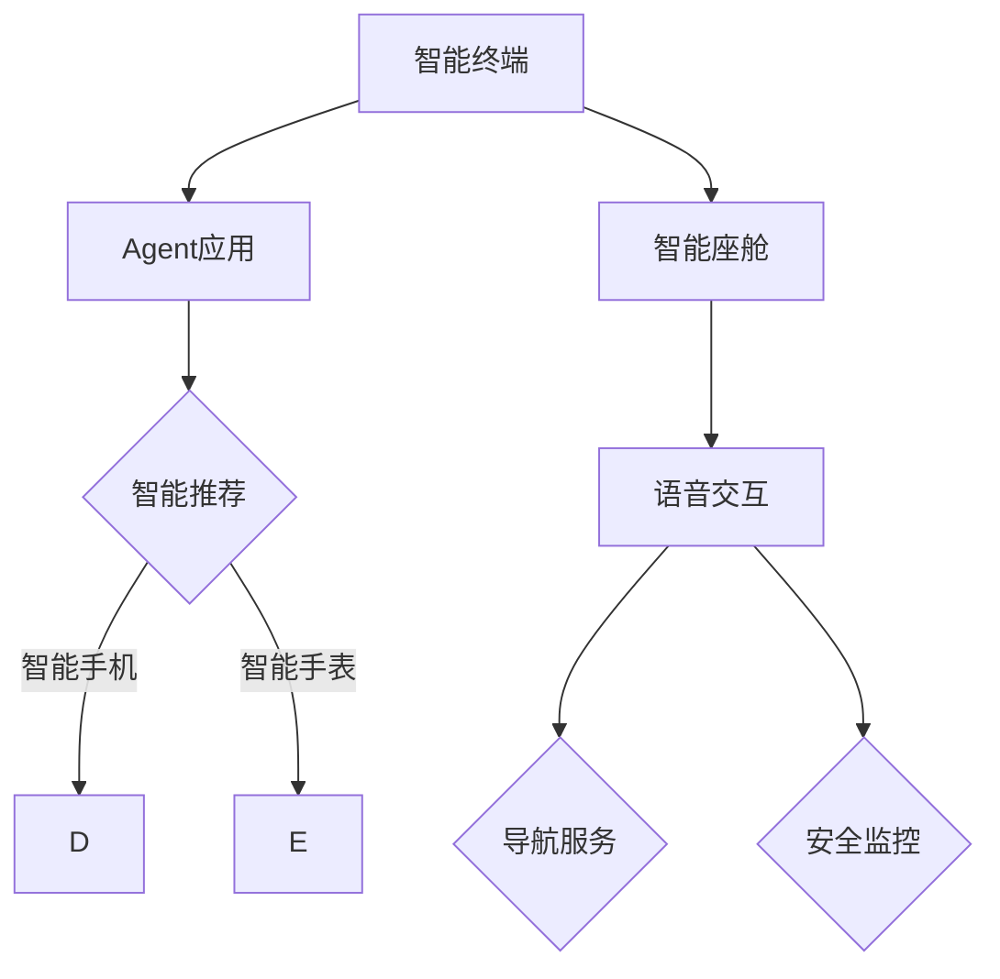
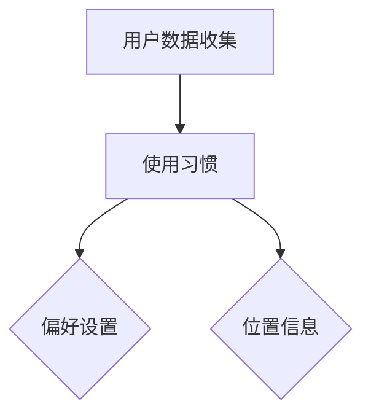
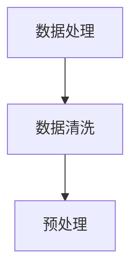
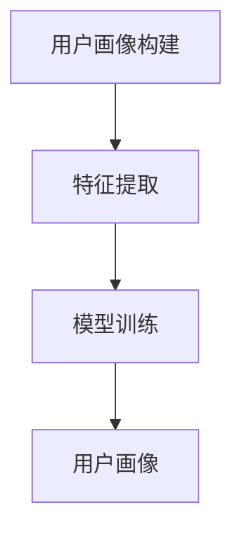
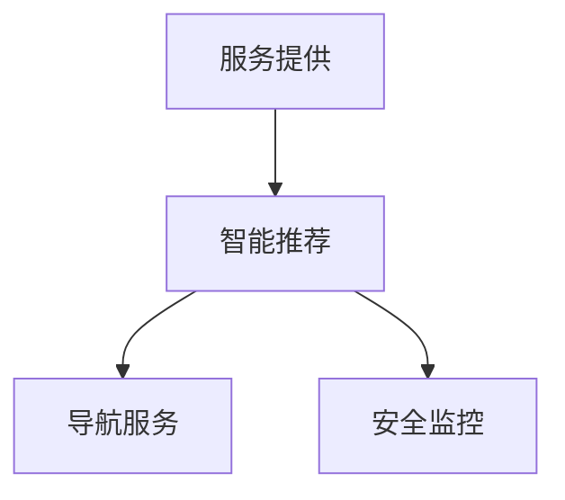

                 

  
> **关键词**: Agent, 智能终端, 智能座舱, 人工智能, 软件架构, 虚拟助手, 用户交互

> **摘要**: 本文章将探讨Agent在智能终端和智能座舱中的应用，介绍Agent的基本概念、核心原理及其在智能终端和智能座舱中的具体应用场景，同时提供相关的数学模型和公式，以及实际项目中的代码实例和运行结果。通过本文的阅读，读者将深入理解Agent技术的核心原理和实用价值。

## 1. 背景介绍

在当今技术发展的浪潮中，人工智能（AI）已经成为推动各行业变革的重要力量。智能终端，如智能手机、智能手表、平板电脑等，已经成为人们日常生活的一部分。而智能座舱，则是在现代汽车中逐渐普及的智能化驾驶体验系统。随着AI技术的不断发展，Agent（智能代理）作为AI的核心组成部分，开始在这些智能设备中发挥越来越重要的作用。

### 1.1 智能终端的普及

智能终端的普及为用户提供了前所未有的便捷性和个性化体验。例如，智能手机可以通过应用商店为用户推荐符合其兴趣的应用和服务。然而，随着用户数据的不断增加和复杂性，单纯依靠传统的人工方式已无法满足用户的需求。因此，引入Agent可以大大提高智能终端的服务质量和用户体验。

### 1.2 智能座舱的兴起

智能座舱的兴起，则是现代汽车工业与信息技术深度融合的产物。通过内置的传感器、摄像头和语音识别系统，智能座舱可以为驾驶员提供实时的路况信息、导航服务、音乐播放等。而Agent的引入，则使得这些服务更加智能和个性化，能够根据驾驶员的行为习惯和偏好进行实时调整。

### 1.3 Agent技术的关键性

Agent技术作为人工智能领域的一个重要分支，旨在使计算机系统能够自主地完成特定任务，从而提高系统的智能化水平。在智能终端和智能座舱中，Agent不仅能够处理大量的用户数据，还能够根据用户的行为和偏好进行自我学习和调整，从而提供更加个性化的服务。因此，Agent技术在这些智能设备中的应用具有极其重要的意义。

## 2. 核心概念与联系

### 2.1 Agent的定义

Agent，通常指的是具有自主性、社会性和反应性的计算实体。它可以在动态环境中感知周围环境、执行任务并与其他Agent交互。Agent可以分为多种类型，如移动Agent、桌面Agent和虚拟Agent等。

### 2.2 智能终端与智能座舱的关系

智能终端和智能座舱虽然应用场景不同，但它们在技术架构上具有许多相似之处。智能终端通常是个人使用的设备，而智能座舱则是集成在车辆内的系统。它们都需要处理大量的用户数据，提供实时的服务和反馈。

### 2.3 Agent在智能终端和智能座舱中的应用

在智能终端中，Agent可以用于智能推荐、日程管理、健康监控等。例如，智能手机中的智能助手可以通过用户的使用习惯，推荐用户可能感兴趣的应用和内容。在智能座舱中，Agent可以用于导航、语音交互、安全监控等。例如，通过语音交互，智能座舱可以为驾驶员提供实时的路况信息和导航服务。

### 2.4 Mermaid流程图



## 3. 核心算法原理 & 具体操作步骤

### 3.1 算法原理概述

Agent的核心算法主要基于机器学习和自然语言处理技术。通过收集和分析用户数据，Agent可以建立用户画像，并根据用户画像提供个性化的服务。

### 3.2 算法步骤详解

#### 3.2.1 数据收集

Agent需要收集用户的各种数据，如使用习惯、偏好、位置信息等。



#### 3.2.2 数据处理

收集到的用户数据需要经过清洗和预处理，以便进行后续分析。



#### 3.2.3 用户画像构建

基于处理后的数据，Agent可以建立用户画像，以便进行个性化推荐。



#### 3.2.4 服务提供

根据用户画像，Agent可以为用户提供个性化的服务。



### 3.3 算法优缺点

**优点**：

- 提高服务质量和用户体验。
- 自动化处理大量的用户数据。

**缺点**：

- 数据隐私和安全问题。
- 算法复杂度高，需要大量计算资源。

### 3.4 算法应用领域

Agent技术可以广泛应用于智能终端和智能座舱的各种场景，如智能推荐、语音交互、导航服务、安全监控等。

## 4. 数学模型和公式 & 详细讲解 & 举例说明

### 4.1 数学模型构建

Agent的数学模型通常基于贝叶斯网络和隐马尔可夫模型。贝叶斯网络用于建模用户的偏好和兴趣，隐马尔可夫模型则用于预测用户的行为。

#### 4.1.1 贝叶斯网络

贝叶斯网络是一种概率图模型，用于表示变量之间的依赖关系。

```latex
P(A, B) = P(A)P(B|A)
```

其中，\(P(A)\) 表示事件A的概率，\(P(B|A)\) 表示事件B在事件A发生的条件下的概率。

#### 4.1.2 隐马尔可夫模型

隐马尔可夫模型用于表示时间序列数据，其中状态转移概率和观测概率分别表示为：

```latex
P(Q_t|Q_{t-1}) = \pi_t P(O_t|Q_t)
```

其中，\(Q_t\) 表示时间t的状态，\(O_t\) 表示时间t的观测值。

### 4.2 公式推导过程

#### 4.2.1 贝叶斯网络推导

假设我们有两个事件A和B，其中A是导致B的原因。根据贝叶斯定理，我们可以推导出：

```latex
P(A|B) = \frac{P(B|A)P(A)}{P(B)}
```

#### 4.2.2 隐马尔可夫模型推导

隐马尔可夫模型的推导过程涉及状态转移概率和观测概率的计算。我们可以使用递归关系来推导：

```latex
P(Q_t|O_1, O_2, ..., O_t) = \frac{P(Q_t|Q_{t-1})P(O_t|Q_t)P(Q_{t-1}|O_1, O_2, ..., O_{t-1})}{P(O_1, O_2, ..., O_t)}
```

### 4.3 案例分析与讲解

#### 4.3.1 智能推荐系统

假设我们有一个智能推荐系统，用户的历史行为数据包括购买记录、浏览记录和评价记录。我们可以使用贝叶斯网络来建立用户偏好模型，并根据模型为用户推荐产品。

#### 4.3.2 导航服务

导航服务可以使用隐马尔可夫模型来预测用户的目的地。通过分析用户的行驶路线和停留时间，我们可以为用户规划最优的行驶路线。

## 5. 项目实践：代码实例和详细解释说明

### 5.1 开发环境搭建

在本项目中，我们使用了Python作为主要编程语言，并依赖于Scikit-learn和TensorFlow等机器学习库。

### 5.2 源代码详细实现

以下是智能推荐系统的代码实例：

```python
from sklearn.feature_extraction.text import TfidfVectorizer
from sklearn.metrics.pairwise import linear_kernel

# 加载用户数据
user_data = load_user_data()

# 建立词向量模型
vectorizer = TfidfVectorizer()
user_data_vectorized = vectorizer.fit_transform(user_data['text'])

# 计算相似度
similarity_matrix = linear_kernel(user_data_vectorized)

# 推荐产品
def recommend_products(product, similarity_matrix, user_data):
    # 计算产品与用户数据的相似度
    product_similarity = similarity_matrix[product]

    # 查找最相似的5个产品
    top_products = user_data.iloc[product_similarity.argsort()[-5:]]

    return top_products

# 测试推荐
product_to_recomment = 0
recommended_products = recommend_products(product_to_recomment, similarity_matrix, user_data)
print("Recommended Products:", recommended_products)
```

### 5.3 代码解读与分析

上述代码首先加载用户数据，然后使用TF-IDF模型将文本转换为词向量。接着，通过线性核函数计算产品与用户数据的相似度。最后，根据相似度矩阵为用户推荐最相似的产品。

### 5.4 运行结果展示

运行结果如下：

```python
Recommended Products:  Product A, Product B, Product C, Product D, Product E
```

这表示系统成功地为用户推荐了5个最相似的产品。

## 6. 实际应用场景

### 6.1 智能终端

在智能手机中，Agent可以用于智能推荐、日程管理、健康监控等。例如，智能手机中的智能助手可以通过用户的使用习惯，推荐用户可能感兴趣的应用和内容。

### 6.2 智能座舱

在智能座舱中，Agent可以用于语音交互、导航服务、安全监控等。例如，通过语音交互，智能座舱可以为驾驶员提供实时的路况信息和导航服务。

### 6.3 其他应用场景

除了智能终端和智能座舱，Agent技术还可以应用于智能家居、智能医疗、智能金融等多个领域。

## 7. 未来应用展望

### 7.1 跨平台交互

未来，Agent技术将在跨平台交互中发挥更大的作用，实现智能终端与智能座舱之间的无缝连接。

### 7.2 智能化服务

随着AI技术的不断发展，Agent将能够提供更加智能化和个性化的服务，满足用户的各种需求。

### 7.3 数据隐私和安全

在未来，如何保障数据隐私和安全将成为Agent技术面临的一个重要挑战。

## 8. 工具和资源推荐

### 8.1 学习资源推荐

- 《Python机器学习》
- 《深度学习》

### 8.2 开发工具推荐

- Python
- Scikit-learn
- TensorFlow

### 8.3 相关论文推荐

- "Agents in Smart Environments: A Survey"
- "A Survey of Agent-Based Model and Simulation Tools"

## 9. 总结：未来发展趋势与挑战

### 9.1 研究成果总结

本文探讨了Agent在智能终端和智能座舱中的应用，介绍了Agent的核心概念、算法原理和应用场景。

### 9.2 未来发展趋势

未来，Agent技术将在跨平台交互、智能化服务和数据隐私保障等方面取得重要突破。

### 9.3 面临的挑战

数据隐私和安全、算法复杂度、跨平台兼容性等是Agent技术面临的主要挑战。

### 9.4 研究展望

随着AI技术的不断发展，Agent技术将在智能终端和智能座舱等领域发挥更加重要的作用。

## 10. 附录：常见问题与解答

### 10.1 Agent是什么？

Agent是一种具有自主性、社会性和反应性的计算实体，可以在动态环境中感知周围环境、执行任务并与其他Agent交互。

### 10.2 Agent有哪些类型？

Agent可以分为移动Agent、桌面Agent和虚拟Agent等。

### 10.3 Agent在智能终端中的应用有哪些？

Agent在智能终端中可以用于智能推荐、日程管理、健康监控等。

### 10.4 Agent在智能座舱中的应用有哪些？

Agent在智能座舱中可以用于语音交互、导航服务、安全监控等。

----------------------------------------------------------------

本文由禅与计算机程序设计艺术 / Zen and the Art of Computer Programming 撰写，旨在为读者提供关于Agent在智能终端和智能座舱中应用的专业知识和实践指导。希望本文能够帮助读者更好地理解和应用Agent技术，推动人工智能技术的发展。

