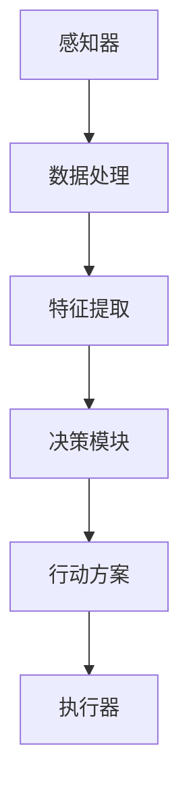

                 

关键词：人工智能，智能代理，感知环境，决策，行动能力

> 摘要：本文深入探讨了智能代理在感知环境、做出决策并执行行动方面的核心能力。通过阐述相关技术原理，分析具体算法和实现步骤，我们旨在为读者提供一个全面的技术视角，了解智能代理在实际应用中的潜力与挑战。

## 1. 背景介绍

随着人工智能技术的发展，智能代理（Agent）在诸多领域展现出了巨大的应用潜力。智能代理是一种具有自主决策能力的实体，能够通过感知环境、处理信息和执行行动来达成特定的目标。一个理想的智能代理需要具备以下几个关键能力：

- **感知环境**：智能代理应能够感知其所处的环境，获取环境状态的信息。
- **做出决策**：基于感知到的环境信息，智能代理需要能够做出合理的决策。
- **执行行动**：智能代理应具备执行决策所需行动的能力。

智能代理的这些能力使其在自动化控制、智能推荐系统、自主驾驶等领域具有重要的应用价值。然而，实现这些能力并非易事，需要深入理解感知、决策和执行的技术原理，并探索有效的算法和实现方法。

## 2. 核心概念与联系

### 2.1 智能代理的概念

智能代理是一种具有自主性和协作性的实体，能够在不确定和动态的环境中执行任务。智能代理的基本结构通常包括感知器、决策模块和执行器。感知器用于感知环境，决策模块基于感知信息进行推理和决策，执行器则根据决策执行具体的行动。

### 2.2 感知环境的机制

智能代理的感知能力是其核心之一。感知环境的机制通常涉及传感器、数据处理和特征提取。传感器可以包括摄像头、麦克风、温度传感器等多种类型，它们能够实时获取环境信息。数据处理和特征提取则是对传感器数据进行处理，提取出对决策有用的特征。

### 2.3 决策算法的原理

智能代理的决策能力依赖于其采用的算法。常见的决策算法包括基于规则的推理、机器学习、规划等。这些算法通过对感知到的环境信息进行处理，生成一系列可能的行动方案，并基于某种策略选择最优的方案。

### 2.4 行动执行的方法

智能代理的执行能力是指其将决策转化为实际行动的能力。执行方法包括直接控制和代理控制等。直接控制是指智能代理直接控制物理设备执行行动，而代理控制则是通过其他实体或系统来实现行动。

### 2.5 Mermaid 流程图

以下是一个简化的智能代理核心概念的 Mermaid 流程图：



## 3. 核心算法原理 & 具体操作步骤

### 3.1 算法原理概述

智能代理的核心算法主要包括感知环境、决策和执行三个部分。感知环境主要通过传感器获取环境信息，并进行数据处理和特征提取。决策模块基于提取的特征信息，使用机器学习或规划算法生成行动方案。执行模块根据决策结果执行具体的行动。

### 3.2 算法步骤详解

1. **感知环境**：
    - 使用传感器获取环境信息。
    - 对获取的数据进行预处理，如滤波、降噪等。
    - 提取关键特征，如图像中的边缘、物体的颜色、形状等。

2. **决策模块**：
    - 使用机器学习算法，如决策树、神经网络等，对特征进行分类或回归。
    - 基于决策结果，生成一系列可能的行动方案。

3. **执行模块**：
    - 根据决策结果，选择最优的行动方案。
    - 通过执行器执行具体的行动，如移动、发送消息等。

### 3.3 算法优缺点

- **优点**：
  - 智能代理能够自主感知环境、做出决策并执行行动，提高了系统的自动化水平。
  - 智能代理可以处理复杂的环境和任务，具有广泛的应用前景。

- **缺点**：
  - 感知环境和决策过程需要大量的计算资源和时间，可能导致实时性不足。
  - 智能代理可能无法完全理解复杂环境，存在一定的局限性。

### 3.4 算法应用领域

智能代理在许多领域都有广泛的应用，包括：

- **自动化控制**：如工业自动化、智能家居等。
- **智能推荐系统**：如电商平台、社交媒体等。
- **自主驾驶**：如自动驾驶汽车、无人机等。

## 4. 数学模型和公式 & 详细讲解 & 举例说明

### 4.1 数学模型构建

智能代理的数学模型主要包括感知、决策和执行三个部分。以下是一个简化的数学模型：

- **感知模型**：
  $$ s_t = f(s_{t-1}, u_t) $$
  其中，$s_t$ 表示时间 $t$ 的环境状态，$u_t$ 表示传感器输入，$f$ 表示感知函数。

- **决策模型**：
  $$ a_t = g(s_t, \theta) $$
  其中，$a_t$ 表示时间 $t$ 的行动，$s_t$ 表示环境状态，$\theta$ 表示决策参数，$g$ 表示决策函数。

- **执行模型**：
  $$ u_t = h(a_t) $$
  其中，$u_t$ 表示时间 $t$ 的执行结果，$a_t$ 表示行动，$h$ 表示执行函数。

### 4.2 公式推导过程

- **感知模型**的推导：
  感知模型基于传感器输入和上一时刻的环境状态，通过某种函数关系计算出当前时刻的环境状态。

- **决策模型**的推导：
  决策模型基于当前时刻的环境状态和决策参数，通过某种函数关系计算出当前时刻的最佳行动。

- **执行模型**的推导：
  执行模型基于当前时刻的最佳行动，通过某种函数关系计算出执行结果。

### 4.3 案例分析与讲解

假设我们有一个智能代理，其任务是控制一个机器人，使其在未知环境中寻找一个目标物体。以下是具体的案例分析：

- **感知模型**：
  机器人通过摄像头获取环境图像，通过图像处理提取出物体的颜色、形状等信息。

- **决策模型**：
  智能代理使用基于深度学习的物体检测算法，将提取的特征输入到模型中，预测目标物体的位置。

- **执行模型**：
  智能代理根据目标物体的位置，调整机器人的方向和速度，使其朝目标物体移动。

通过这个案例，我们可以看到智能代理的数学模型在具体应用中的实现过程。这个模型可以根据实际需求进行调整和优化，以适应不同的应用场景。

## 5. 项目实践：代码实例和详细解释说明

### 5.1 开发环境搭建

为了实现智能代理，我们需要搭建一个开发环境。以下是基本的步骤：

1. 安装Python环境。
2. 安装TensorFlow或PyTorch等深度学习框架。
3. 安装OpenCV等图像处理库。
4. 配置传感器（如摄像头）。

### 5.2 源代码详细实现

以下是智能代理的源代码实现：

```python
import cv2
import numpy as np
import tensorflow as tf

# 感知环境部分
def perceive_environment():
    camera = cv2.VideoCapture(0)
    while True:
        ret, frame = camera.read()
        if not ret:
            break
        processed_frame = preprocess_frame(frame)
        features = extract_features(processed_frame)
        return features

# 决策模块部分
def make_decision(features):
    model = tf.keras.models.load_model('agent_model.h5')
    prediction = model.predict(features)
    action = interpret_prediction(prediction)
    return action

# 执行模块部分
def execute_action(action):
    if action == 'move_forward':
        robot.move_forward()
    elif action == 'turn_left':
        robot.turn_left()
    elif action == 'turn_right':
        robot.turn_right()

# 主函数
def main():
    while True:
        features = perceive_environment()
        action = make_decision(features)
        execute_action(action)

if __name__ == '__main__':
    main()
```

### 5.3 代码解读与分析

- **感知环境部分**：使用OpenCV库捕获摄像头图像，并进行预处理。
- **决策模块部分**：加载训练好的深度学习模型，对提取的特征进行预测，并根据预测结果生成行动。
- **执行模块部分**：根据决策结果，执行具体的行动。

通过这个实例，我们可以看到智能代理的基本实现过程。在实际应用中，需要根据具体需求进行适当的调整和优化。

## 6. 实际应用场景

智能代理在实际应用中具有广泛的应用场景。以下是一些具体的案例：

- **智能家居**：智能代理可以监控家庭环境，自动调节温度、照明和安防系统。
- **工业自动化**：智能代理可以监控生产线，自动调整设备状态，提高生产效率。
- **自动驾驶**：智能代理可以实时感知道路环境，做出驾驶决策，实现自动驾驶。
- **医疗辅助**：智能代理可以分析患者数据，提供个性化的医疗建议。

## 7. 工具和资源推荐

为了更好地理解和实现智能代理，以下是一些推荐的工具和资源：

- **学习资源**：
  - 《人工智能：一种现代方法》（第三版）
  - 《深度学习》（Goodfellow, Bengio, Courville）

- **开发工具**：
  - TensorFlow
  - PyTorch

- **相关论文**：
  - "Deep Learning for Autonomous Driving"（自动驾驶中的深度学习）
  - "Learning to Drive by Playing"（通过玩游戏学习驾驶）

## 8. 总结：未来发展趋势与挑战

### 8.1 研究成果总结

智能代理技术在过去几十年中取得了显著的进展。从简单的基于规则的代理到复杂的基于机器学习的代理，智能代理在感知、决策和执行方面都取得了显著的提升。目前，智能代理已经在许多领域得到应用，为自动化和智能化带来了新的可能性。

### 8.2 未来发展趋势

随着人工智能技术的不断发展，智能代理将在未来发挥更加重要的作用。以下是一些发展趋势：

- **更加智能的感知能力**：通过更先进的传感器技术和算法，智能代理将能够更好地感知复杂环境。
- **更高效的决策算法**：基于深度学习和强化学习的新算法将使智能代理的决策更加智能和高效。
- **更广泛的应用领域**：智能代理将在更多领域得到应用，如医疗、金融、教育等。

### 8.3 面临的挑战

尽管智能代理技术在不断发展，但仍面临一些挑战：

- **实时性**：如何在保证实时性的同时提高智能代理的性能是一个重要问题。
- **数据隐私和安全**：智能代理需要处理大量的敏感数据，如何保证数据的安全和隐私是一个关键问题。
- **复杂环境适应能力**：智能代理需要能够适应更加复杂和动态的环境，提高其鲁棒性和适应性。

### 8.4 研究展望

未来的研究将集中在以下几个方面：

- **多模态感知**：结合多种传感器数据，提高智能代理的感知能力。
- **强化学习与规划结合**：将强化学习与规划算法相结合，提高智能代理的决策能力。
- **跨领域应用**：探索智能代理在更多领域中的应用，实现跨领域的知识共享和迁移。

通过不断的研究和探索，智能代理技术将在未来发挥更大的作用，为人类社会带来更多的便利和进步。

## 9. 附录：常见问题与解答

### 9.1 智能代理的基本概念是什么？

智能代理是一种具有自主决策能力的实体，能够通过感知环境、处理信息和执行行动来达成特定的目标。

### 9.2 智能代理的核心能力包括哪些？

智能代理的核心能力包括感知环境、做出决策和执行行动。

### 9.3 如何实现智能代理的感知能力？

智能代理的感知能力通常通过传感器和数据处理算法实现。传感器可以包括摄像头、麦克风、温度传感器等，数据处理和特征提取算法用于提取对决策有用的特征。

### 9.4 智能代理的决策算法有哪些？

智能代理的决策算法包括基于规则的推理、机器学习、规划等。常见的机器学习算法包括决策树、神经网络、强化学习等。

### 9.5 智能代理的执行能力如何实现？

智能代理的执行能力通过执行器实现。执行器可以是直接控制物理设备，如机器人，或者通过代理控制其他实体或系统。

### 9.6 智能代理有哪些实际应用场景？

智能代理在智能家居、工业自动化、自动驾驶、医疗辅助等领域都有广泛的应用。

### 9.7 智能代理技术未来的发展趋势是什么？

未来的智能代理技术将更加智能、实时和广泛地应用于各个领域，发展趋势包括多模态感知、强化学习与规划结合、跨领域应用等。

---

作者：禅与计算机程序设计艺术 / Zen and the Art of Computer Programming

