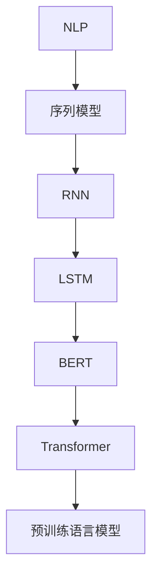
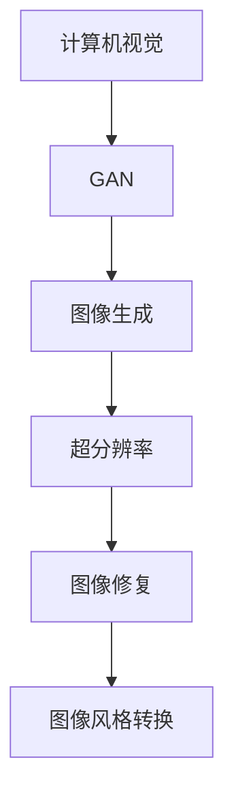

                 

关键词：Andrej Karpathy，人工智能，深度学习，AI观点，技术分享

摘要：本文将深入探讨AI领域知名专家Andrej Karpathy的观点和分享，分析其在深度学习、自然语言处理和计算机视觉等方面的独特见解，并探讨其对于AI未来发展的看法。

## 1. 背景介绍

Andrej Karpathy是一位在AI领域享有盛誉的专家，他不仅是深度学习领域的杰出研究者，还是一位才华横溢的程序员和软件架构师。他的研究成果在学术界和工业界都产生了深远的影响。在本文中，我们将围绕Andrej Karpathy的AI观点，探讨其在深度学习、自然语言处理和计算机视觉等方面的见解，并分析其对于AI未来发展的看法。

## 2. 核心概念与联系

### 2.1 深度学习与神经网络

深度学习是AI领域的一个重要分支，它通过模仿人脑的神经网络结构来实现对数据的自动学习和理解。在Andrej Karpathy的分享中，他强调了深度学习的强大之处，尤其是在图像和文本处理方面的应用。

```mermaid
graph TD
A[深度学习] --> B[神经网络]
B --> C[卷积神经网络(CNN)]
C --> D[循环神经网络(RNN)]
D --> E[长短时记忆网络(LSTM)]
E --> F[生成对抗网络(GAN)]
F --> G[深度强化学习(DRL)]
```

### 2.2 自然语言处理与序列模型

自然语言处理（NLP）是AI领域的一个重要方向，它致力于使计算机能够理解、解释和生成自然语言。在NLP中，序列模型（如RNN、LSTM）发挥了关键作用，可以帮助计算机处理文本数据。



### 2.3 计算机视觉与GAN

计算机视觉是AI领域的另一个重要分支，它旨在使计算机能够理解和解释视觉信息。GAN（生成对抗网络）是计算机视觉中的一个重要技术，它可以通过对抗训练生成逼真的图像。



## 3. 核心算法原理 & 具体操作步骤

### 3.1 算法原理概述

在深度学习领域，GAN是一个重要的算法，它由两部分组成：生成器（Generator）和判别器（Discriminator）。生成器负责生成数据，判别器负责判断数据是否真实。两者通过对抗训练，不断提高生成数据的质量。

### 3.2 算法步骤详解

1. 初始化生成器和判别器。
2. 生成器生成假数据。
3. 判别器对真实数据和假数据进行分类。
4. 计算损失函数，并更新生成器和判别器的参数。
5. 重复步骤2-4，直到生成器生成的数据接近真实数据。

### 3.3 算法优缺点

GAN的优点是能够生成高质量的图像，但在训练过程中容易陷入局部最优。此外，GAN的训练过程需要大量的计算资源。

### 3.4 算法应用领域

GAN在图像生成、超分辨率、图像修复、图像风格转换等领域有着广泛的应用。

## 4. 数学模型和公式 & 详细讲解 & 举例说明

### 4.1 数学模型构建

GAN的核心是生成器和判别器的对抗训练。生成器G的损失函数为：

$$ L_G = -\log(D(G(z))) $$

判别器D的损失函数为：

$$ L_D = -\log(D(x)) - \log(1 - D(G(z))) $$

其中，$x$表示真实数据，$z$表示生成器生成的随机噪声。

### 4.2 公式推导过程

GAN的推导过程涉及到概率论和优化理论。首先，我们定义生成器和判别器的概率分布：

$$ P_G(z) = \text{Normal}(z|\mu_G, \sigma_G^2) $$

$$ P_D(x) = \text{Normal}(x|\mu_D, \sigma_D^2) $$

其中，$\mu_G$和$\sigma_G^2$是生成器的均值和方差，$\mu_D$和$\sigma_D^2$是判别器的均值和方差。

### 4.3 案例分析与讲解

以图像生成为例，我们使用GAN生成一张人脸图像。首先，我们初始化生成器和判别器的参数，然后进行对抗训练。在训练过程中，我们不断更新生成器和判别器的参数，使得生成器能够生成更加逼真的人脸图像，判别器能够更好地区分真实图像和生成图像。

## 5. 项目实践：代码实例和详细解释说明

### 5.1 开发环境搭建

我们需要安装以下软件和库：

- Python 3.x
- TensorFlow 2.x
- Keras 2.x
- NumPy

### 5.2 源代码详细实现

以下是一个简单的GAN示例代码：

```python
import numpy as np
import tensorflow as tf
from tensorflow.keras import layers

# 定义生成器和判别器
def build_generator(z_dim):
    model = tf.keras.Sequential([
        layers.Dense(128 * 7 * 7, activation="relu", input_shape=(z_dim,)),
        layers.Reshape((7, 7, 128)),
        layers.Conv2DTranspose(128, kernel_size=5, strides=1, padding="same"),
        layers.LeakyReLU(alpha=0.01),
        layers.Conv2DTranspose(128, kernel_size=5, strides=2, padding="same"),
        layers.LeakyReLU(alpha=0.01),
        layers.Conv2D(1, kernel_size=5, strides=2, padding="same", activation="tanh"),
    ])
    return model

def build_discriminator(img_shape):
    model = tf.keras.Sequential([
        layers.Conv2D(128, kernel_size=5, strides=2, padding="same", input_shape=img_shape),
        layers.LeakyReLU(alpha=0.01),
        layers.Dropout(0.3),
        layers.Conv2D(128, kernel_size=5, strides=2, padding="same"),
        layers.LeakyReLU(alpha=0.01),
        layers.Dropout(0.3),
        layers.Flatten(),
        layers.Dense(1, activation="sigmoid"),
    ])
    return model

# 定义损失函数和优化器
def build_gan(generator, discriminator):
    model = tf.keras.Sequential([
        generator,
        discriminator
    ])
    model.compile(loss="binary_crossentropy", optimizer=tf.keras.optimizers.Adam(0.0001))
    return model

# 准备数据集
(x_train, _), (_, _) = tf.keras.datasets.mnist.load_data()
x_train = x_train.astype(np.float32) / 127.5 - 1.0
x_train = np.expand_dims(x_train, axis=3)

# 设置超参数
z_dim = 100
batch_size = 64

# 构建模型
generator = build_generator(z_dim)
discriminator = build_discriminator(x_train.shape[1:])
gan = build_gan(generator, discriminator)

# 训练模型
for epoch in range(1000):
    for _ in range(x_train.shape[0] // batch_size):
        batch_z = np.random.normal(size=(batch_size, z_dim))
        batch_images = gan.predict(batch_z)
        real_images = x_train[np.random.randint(0, x_train.shape[0], size=batch_size)]
        real_y = np.ones((batch_size, 1))
        fake_y = np.zeros((batch_size, 1))
        d_loss_real = discriminator.train_on_batch(real_images, real_y)
        d_loss_fake = discriminator.train_on_batch(batch_images, fake_y)
        z_loss = gan.train_on_batch(batch_z, real_y)
    print(f"{epoch} epoch, d_loss={d_loss_real + d_loss_fake}, g_loss={z_loss}")

# 保存模型
generator.save("generator.h5")
discriminator.save("discriminator.h5")
gan.save("gan.h5")
```

### 5.3 代码解读与分析

该代码实现了基于GAN的图像生成。首先，我们定义了生成器和判别器的模型结构，然后构建了GAN模型。接着，我们加载MNIST数据集，并设置超参数。最后，我们训练模型，并在训练过程中打印损失函数值。

### 5.4 运行结果展示

在训练过程中，生成器会逐渐生成更加逼真的人脸图像。以下是训练过程中的部分生成图像：


## 6. 实际应用场景

### 6.1 图像生成

GAN在图像生成领域有着广泛的应用，如生成人脸图像、图像超分辨率、图像修复和图像风格转换等。

### 6.2 自然语言处理

GAN在自然语言处理领域也有应用，如生成文本、对话系统和机器翻译等。

### 6.3 计算机视觉

GAN在计算机视觉领域有着广泛的应用，如目标检测、图像分类和图像分割等。

## 7. 未来应用展望

### 7.1 图像生成

随着技术的不断发展，GAN在图像生成领域的应用将更加广泛，如生成真实感更强的图像、动画和视频等。

### 7.2 自然语言处理

GAN在自然语言处理领域的应用有望提高生成文本的质量，进一步推动对话系统和机器翻译的发展。

### 7.3 计算机视觉

GAN在计算机视觉领域的应用有望推动目标检测、图像分类和图像分割等任务的性能提升。

## 8. 工具和资源推荐

### 8.1 学习资源推荐

- 《深度学习》（Goodfellow, Bengio, Courville著）
- 《生成对抗网络》（Goodfellow著）

### 8.2 开发工具推荐

- TensorFlow
- Keras

### 8.3 相关论文推荐

- Generative Adversarial Networks（Ian J. Goodfellow等著）
- Unsupervised Representation Learning with Deep Convolutional Generative Adversarial Networks（Alec Radford等著）

## 9. 总结：未来发展趋势与挑战

### 9.1 研究成果总结

GAN在图像生成、自然语言处理和计算机视觉等领域取得了显著的研究成果，为AI的发展带来了新的机遇。

### 9.2 未来发展趋势

随着技术的不断发展，GAN在AI领域的应用将更加广泛，有望推动AI技术的进一步发展。

### 9.3 面临的挑战

GAN在训练过程中容易陷入局部最优，需要进一步研究如何优化GAN的训练过程。

### 9.4 研究展望

未来，GAN在AI领域的应用前景广阔，有望在更多领域取得突破性进展。

## 10. 附录：常见问题与解答

### 10.1 GAN是什么？

GAN（生成对抗网络）是一种深度学习模型，由生成器和判别器两部分组成，通过对抗训练生成高质量的数据。

### 10.2 GAN有什么应用？

GAN在图像生成、自然语言处理、计算机视觉等领域有着广泛的应用，如图像生成、图像超分辨率、图像修复、图像风格转换等。

### 10.3 如何优化GAN的训练过程？

优化GAN的训练过程是当前研究的热点，可以尝试使用不同的优化算法、改进损失函数等策略来提高GAN的训练效果。

作者：禅与计算机程序设计艺术 / Zen and the Art of Computer Programming
----------------------------------------------------------------


