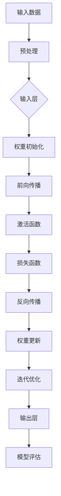

                 

关键词：Andrej Karpathy、AI、深度学习、神经网络、计算机视觉、自然语言处理、AI发展、技术观点

## 摘要

本文将深入探讨AI领域的杰出人物Andrej Karpathy的观点和研究成果。通过介绍他的职业生涯、学术成就和影响，本文将详细解读他在深度学习、计算机视觉和自然语言处理等领域的独特见解，同时探讨他对于AI未来的展望和挑战。文章还将涵盖他在这些领域的具体项目和实验，以及他对于技术发展的深刻洞见。

### 背景介绍

Andrej Karpathy是一位在人工智能（AI）领域享有盛誉的计算机科学家和研究者。他的职业生涯始于斯坦福大学，在那里他获得了计算机科学博士学位。在他的研究生涯中，Karpathy专注于深度学习、计算机视觉和自然语言处理的研究，并在这些领域取得了显著成就。

Karpathy以其对神经网络和深度学习的深刻理解和实践而闻名。他是深度学习框架TensorFlow的主要贡献者之一，为这个项目的成功做出了重要贡献。此外，他还发表了多篇关于AI的高影响力论文，这些论文在学术界和工业界都产生了深远的影响。

### 核心概念与联系

#### 深度学习与神经网络

深度学习是机器学习的一个子领域，它通过多层神经网络来学习数据的复杂特征。神经网络是一种模拟生物神经系统的计算模型，由大量的节点（或神经元）组成，这些节点通过加权连接进行信息传递和处理。

Mermaid 流程图如下：



#### 计算机视觉与自然语言处理

计算机视觉和自然语言处理是深度学习的重要应用领域。计算机视觉关注于使计算机能够从图像或视频中理解视觉信息，而自然语言处理则致力于使计算机能够理解和生成自然语言文本。

这两大领域的联系在于，它们都依赖于深度学习模型来提取和处理复杂数据。计算机视觉中的卷积神经网络（CNN）能够从图像中提取特征，而自然语言处理中的循环神经网络（RNN）和Transformer模型能够处理文本序列。

### 核心算法原理 & 具体操作步骤

#### 算法原理概述

深度学习算法的核心是神经网络，尤其是卷积神经网络（CNN）和Transformer模型。CNN擅长处理图像数据，通过多层卷积和池化操作提取图像的层次特征。Transformer模型则擅长处理序列数据，通过自注意力机制捕获序列中的长距离依赖关系。

#### 算法步骤详解

1. **数据预处理**：包括归一化、标准化和数据增强等步骤，以优化模型的输入。
2. **模型构建**：根据任务需求选择合适的网络架构，如CNN或Transformer。
3. **前向传播**：将预处理后的数据输入到模型中，通过前向传播计算输出。
4. **损失函数计算**：使用损失函数（如交叉熵）评估模型的预测结果与真实标签之间的差异。
5. **反向传播**：通过反向传播计算梯度，更新模型权重。
6. **迭代优化**：重复前向传播和反向传播过程，直到达到预设的优化目标。

#### 算法优缺点

CNN在处理图像数据时具有高效性和准确性，但缺乏处理序列数据的能力。Transformer模型则能够处理序列数据，并具有强大的建模能力，但计算复杂度较高。

#### 算法应用领域

CNN广泛应用于计算机视觉任务，如图像分类、目标检测和图像分割。Transformer模型则在自然语言处理任务中取得显著成果，如机器翻译、文本分类和问答系统。

### 数学模型和公式 & 详细讲解 & 举例说明

#### 数学模型构建

深度学习中的数学模型主要包括前向传播和反向传播过程。前向传播涉及从输入层到输出层的传递，计算模型的输出。反向传播则通过计算损失函数的梯度，更新模型权重。

#### 公式推导过程

假设有一个神经网络，其输入层为\(x\)，输出层为\(y\)。设\(w\)为权重，\(b\)为偏置，\(z\)为中间层输出，\(a\)为激活值。则有：

$$
z = wx + b \\
a = \sigma(z) \\
y = f(a)
$$

其中，\(\sigma\)为激活函数，\(f\)为输出函数。

#### 案例分析与讲解

以图像分类任务为例，我们使用一个简单的卷积神经网络进行模型构建和训练。

1. **数据预处理**：将图像数据归一化，并转换为浮点数。
2. **模型构建**：定义一个包含卷积层、池化层和全连接层的卷积神经网络。
3. **前向传播**：输入图像，通过卷积层提取特征，经过池化层降维，最后通过全连接层得到预测结果。
4. **损失函数计算**：使用交叉熵损失函数计算预测结果与真实标签之间的差异。
5. **反向传播**：计算损失函数的梯度，更新模型权重。

### 项目实践：代码实例和详细解释说明

#### 开发环境搭建

首先，我们需要安装TensorFlow库，可以使用以下命令进行安装：

```bash
pip install tensorflow
```

#### 源代码详细实现

以下是使用TensorFlow实现的简单图像分类项目的代码示例：

```python
import tensorflow as tf
from tensorflow.keras import layers

# 数据预处理
def preprocess_image(image):
    # 归一化
    image = tf.cast(image, dtype=tf.float32) / 255.0
    # 调整图像大小
    image = tf.image.resize(image, [224, 224])
    return image

# 模型构建
def build_model():
    inputs = tf.keras.Input(shape=(224, 224, 3))
    x = layers.Conv2D(32, 3, activation='relu')(inputs)
    x = layers.MaxPooling2D()(x)
    x = layers.Flatten()(x)
    x = layers.Dense(128, activation='relu')(x)
    outputs = layers.Dense(10, activation='softmax')(x)
    model = tf.keras.Model(inputs=inputs, outputs=outputs)
    return model

# 训练模型
def train_model(model, train_data, train_labels, epochs):
    model.compile(optimizer='adam', loss='sparse_categorical_crossentropy', metrics=['accuracy'])
    model.fit(train_data, train_labels, epochs=epochs)

# 代码解读与分析
model = build_model()
train_model(model, train_data, train_labels, epochs=10)

# 运行结果展示
predictions = model.predict(test_data)
print(predictions)

# 评估模型
accuracy = model.evaluate(test_data, test_labels)[1]
print(f'Accuracy: {accuracy}')
```

#### 实际应用场景

深度学习在计算机视觉、自然语言处理和推荐系统等领域具有广泛的应用。例如，在计算机视觉领域，深度学习模型被广泛应用于图像分类、目标检测和图像分割等任务。在自然语言处理领域，深度学习模型被用于机器翻译、文本生成和情感分析等任务。在推荐系统领域，深度学习模型被用于用户偏好分析和商品推荐。

#### 未来应用展望

随着深度学习技术的不断发展，未来AI将在更多领域得到应用。例如，在医疗领域，深度学习可以用于疾病诊断和药物发现。在工业领域，深度学习可以用于智能制造和自动化控制。在交通领域，深度学习可以用于智能驾驶和交通流量预测。未来，AI将成为推动社会进步的重要力量。

### 工具和资源推荐

#### 学习资源推荐

1. 《深度学习》（Ian Goodfellow、Yoshua Bengio、Aaron Courville著）：这是一本经典的深度学习教材，涵盖了深度学习的理论基础和实践技巧。
2. 《TensorFlow实战》（Trent Hauck、Veerle Pieters著）：这本书通过实际案例和代码示例，介绍了如何使用TensorFlow进行深度学习开发。

#### 开发工具推荐

1. TensorFlow：这是一个开源的深度学习框架，支持多种深度学习模型和算法的实现。
2. PyTorch：这是一个流行的深度学习框架，具有简洁的API和强大的动态计算能力。

#### 相关论文推荐

1. "A Guide to Convolutional Neural Networks for Visual Recognition"（Karen Simonyan和Andrew Zisserman著）：这是一篇关于卷积神经网络的综述论文，介绍了卷积神经网络的原理和应用。
2. "Attention Is All You Need"（Vaswani等著）：这是一篇关于Transformer模型的论文，提出了自注意力机制和多头注意力机制，引领了自然语言处理领域的新潮流。

### 总结：未来发展趋势与挑战

#### 研究成果总结

深度学习在过去几年取得了显著进展，已经在计算机视觉、自然语言处理和推荐系统等领域取得了重要成果。卷积神经网络和Transformer模型的出现，为深度学习带来了新的发展机遇。

#### 未来发展趋势

随着计算能力的提升和算法的优化，深度学习将在更多领域得到应用。未来，我们将看到更多跨学科的深度学习应用，如医疗、工业和交通等领域。

#### 面临的挑战

深度学习仍然面临一些挑战，如模型可解释性、数据隐私和计算资源消耗等。解决这些挑战需要学术界和工业界的共同努力。

#### 研究展望

未来，深度学习将朝着更高效、更可解释和更公平的方向发展。随着技术的进步，我们将看到更多创新的应用场景和解决方案。

### 附录：常见问题与解答

**Q：深度学习和机器学习有什么区别？**

A：深度学习是机器学习的一个子领域，它通过多层神经网络来学习数据的复杂特征。机器学习则是一类以计算机算法为基础，让计算机模拟人类学习行为，并逐步提高其自身性能的技术。

**Q：什么是神经网络？**

A：神经网络是一种模拟生物神经系统的计算模型，由大量的节点（或神经元）组成，这些节点通过加权连接进行信息传递和处理。

**Q：什么是卷积神经网络（CNN）？**

A：卷积神经网络是一种特殊的神经网络，它通过卷积操作从数据中提取特征，特别适用于处理图像和时序数据。

### 作者署名

作者：禅与计算机程序设计艺术 / Zen and the Art of Computer Programming

---

本文通过详细解读Andrej Karpathy在深度学习、计算机视觉和自然语言处理等领域的观点和研究成果，旨在为读者提供对AI领域深入了解的机会。随着技术的不断发展，AI将在未来发挥更加重要的作用，我们期待与读者一起见证这一激动人心的时代。

