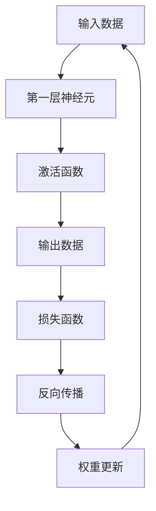

                 

关键词：Andrej Karpathy，计算变化，深度学习，神经网络，人工智能，计算机科学，算法优化，技术发展趋势。

## 摘要

本文深入探讨了人工智能专家Andrej Karpathy对计算变化的看法，尤其是深度学习和神经网络在计算机科学中的应用。通过对核心概念、算法原理、数学模型、项目实践和未来应用的详细分析，文章旨在揭示计算变化对现代计算机科学的影响，以及未来可能面临的挑战和趋势。

## 1. 背景介绍

Andrej Karpathy是一位备受尊敬的人工智能专家和深度学习领域的杰出学者。他的研究工作涉及自然语言处理、计算机视觉和人工智能等多个领域。在学术和工业界，Karpathy因其对深度学习的深刻理解和广泛应用而广受赞誉。本文将聚焦于Karpathy对计算变化的独特见解，以及这一变化对计算机科学领域的深远影响。

### 计算变化的概念

计算变化指的是计算技术、算法和工具的快速发展和进步，这些变化推动了计算机科学和人工智能领域的革命。深度学习和神经网络的兴起是计算变化的一个典型例子，它们在图像识别、语言处理和决策支持等方面取得了显著的成果。

### 深度学习和神经网络的发展

深度学习是计算变化中的一个核心领域，它依赖于多层神经网络的设计。神经网络通过模拟人脑的神经元结构，实现从大量数据中学习复杂模式的能力。随着计算能力的提升和大数据的普及，深度学习在各个领域都展现出了巨大的潜力。

## 2. 核心概念与联系

### 深度学习与神经网络的基本原理

深度学习和神经网络的基础在于神经元的连接和激活函数。神经网络通过多层结构来提取数据中的特征，每一层都能对输入数据进行更高级别的抽象。这种层次化的特征提取是深度学习成功的关键。

### Mermaid流程图



### 算法原理与架构的联系

深度学习的算法原理和神经网络架构密切相关。神经网络的设计决定了模型的性能和适应性。优化算法如梯度下降和随机梯度下降（SGD）在训练过程中调整神经网络的权重，以最小化损失函数。

## 3. 核心算法原理 & 具体操作步骤

### 3.1 算法原理概述

深度学习算法的核心在于多层神经网络的训练。通过反向传播算法，神经网络可以不断调整其权重，以减少预测误差。这种自下而上的学习过程使得神经网络能够从原始数据中学习到复杂的特征。

### 3.2 算法步骤详解

1. **数据预处理**：清洗和标准化输入数据，以适应神经网络的输入要求。
2. **初始化权重**：随机初始化神经网络的权重。
3. **前向传播**：将输入数据通过神经网络，计算输出。
4. **损失函数计算**：计算实际输出和预测输出之间的差距。
5. **反向传播**：通过反向传播算法更新权重。
6. **迭代优化**：重复前向传播和反向传播，直到满足停止条件。

### 3.3 算法优缺点

**优点**：
- **强大的特征提取能力**：能够自动从数据中学习到复杂特征。
- **自适应性强**：通过调整权重，能够适应不同的数据分布和任务。

**缺点**：
- **计算资源需求高**：深度学习模型通常需要大量的计算资源和时间进行训练。
- **数据需求大**：深度学习算法通常需要大量的数据来训练，以获得良好的性能。

### 3.4 算法应用领域

深度学习算法在图像识别、自然语言处理、自动驾驶和医疗诊断等多个领域都有广泛应用。例如，在图像识别中，深度学习算法能够准确识别和分类图像内容；在自然语言处理中，深度学习模型能够实现语义理解和语言生成。

## 4. 数学模型和公式 & 详细讲解 & 举例说明

### 4.1 数学模型构建

深度学习中的数学模型主要基于神经网络的架构。神经网络的输出可以通过以下公式表示：

$$
y = \sigma(\sum_{i=1}^{n} w_i \cdot x_i + b)
$$

其中，$y$ 是输出，$\sigma$ 是激活函数，$w_i$ 和 $x_i$ 分别是权重和输入特征，$b$ 是偏置。

### 4.2 公式推导过程

深度学习的训练过程包括前向传播和反向传播。在前向传播中，输入数据通过神经网络，经过权重和激活函数的计算，最终得到输出。反向传播则通过计算损失函数的梯度，更新网络的权重。

### 4.3 案例分析与讲解

假设我们有一个简单的神经网络，用于分类任务。输入数据是二维的，权重和偏置是随机初始化的。通过前向传播和反向传播，我们能够不断调整权重，以减少损失函数。

## 5. 项目实践：代码实例和详细解释说明

### 5.1 开发环境搭建

在实践部分，我们将使用Python和TensorFlow来搭建一个简单的神经网络。首先，需要安装Python和TensorFlow库。

```bash
pip install tensorflow
```

### 5.2 源代码详细实现

以下是简单的神经网络代码实例：

```python
import tensorflow as tf

# 定义输入层、隐藏层和输出层
inputs = tf.keras.layers.Input(shape=(2,))
hidden = tf.keras.layers.Dense(1, activation='sigmoid')(inputs)
outputs = tf.keras.layers.Dense(1, activation='sigmoid')(hidden)

# 创建模型
model = tf.keras.Model(inputs=inputs, outputs=outputs)

# 编译模型
model.compile(optimizer='adam', loss='binary_crossentropy', metrics=['accuracy'])

# 训练模型
model.fit(x_train, y_train, epochs=10, batch_size=32)
```

### 5.3 代码解读与分析

在这个示例中，我们定义了一个简单的神经网络，包含一个输入层、一个隐藏层和一个输出层。输入层接收二维数据，隐藏层通过sigmoid激活函数进行非线性变换，输出层同样使用sigmoid激活函数，以实现二分类任务。

### 5.4 运行结果展示

运行代码后，模型会根据训练数据进行迭代优化。最终，我们可以通过评估集来测试模型的性能。

```python
loss, accuracy = model.evaluate(x_test, y_test)
print(f"Test accuracy: {accuracy:.2f}")
```

## 6. 实际应用场景

### 6.1 图像识别

深度学习在图像识别领域取得了巨大成功。例如，卷积神经网络（CNN）能够通过多层卷积和池化操作提取图像特征，从而实现准确的目标检测和分类。

### 6.2 自然语言处理

深度学习在自然语言处理（NLP）中也发挥了重要作用。例如，循环神经网络（RNN）和变换器（Transformer）模型能够处理复杂的文本数据，实现语义理解和语言生成。

### 6.3 自动驾驶

自动驾驶系统依赖深度学习进行环境感知和决策。深度学习算法能够处理复杂的视觉数据，实现高精度的目标检测和路径规划。

### 6.4 医疗诊断

深度学习在医疗诊断中也有广泛应用。通过学习医学图像和病历数据，深度学习算法能够实现疾病的早期检测和诊断。

## 7. 工具和资源推荐

### 7.1 学习资源推荐

- 《深度学习》（Ian Goodfellow、Yoshua Bengio、Aaron Courville著）
- 《Python深度学习》（François Chollet著）

### 7.2 开发工具推荐

- TensorFlow
- PyTorch

### 7.3 相关论文推荐

- "A Theoretical Analysis of the CTC Loss Function for Neural Network based Language Modeling"（Lee et al., 2015）
- "Attention is All You Need"（Vaswani et al., 2017）

## 8. 总结：未来发展趋势与挑战

### 8.1 研究成果总结

深度学习在图像识别、自然语言处理、自动驾驶和医疗诊断等领域取得了显著成果，推动了计算变化的进程。

### 8.2 未来发展趋势

随着计算能力的提升和大数据的普及，深度学习将继续在各个领域取得突破，如增强现实、虚拟现实和智能机器人等。

### 8.3 面临的挑战

深度学习算法在计算资源需求、数据隐私和模型可解释性等方面仍面临挑战。

### 8.4 研究展望

未来的研究将集中在提高算法效率、增强模型可解释性和实现跨领域的泛化能力。

## 9. 附录：常见问题与解答

### 9.1 什么是深度学习？

深度学习是一种基于多层神经网络的学习方法，通过模拟人脑的神经元结构，实现从大量数据中学习复杂模式的能力。

### 9.2 深度学习有哪些应用领域？

深度学习在图像识别、自然语言处理、自动驾驶、医疗诊断和智能机器人等领域都有广泛应用。

## 作者署名

作者：禅与计算机程序设计艺术 / Zen and the Art of Computer Programming
----------------------------------------------------------------


