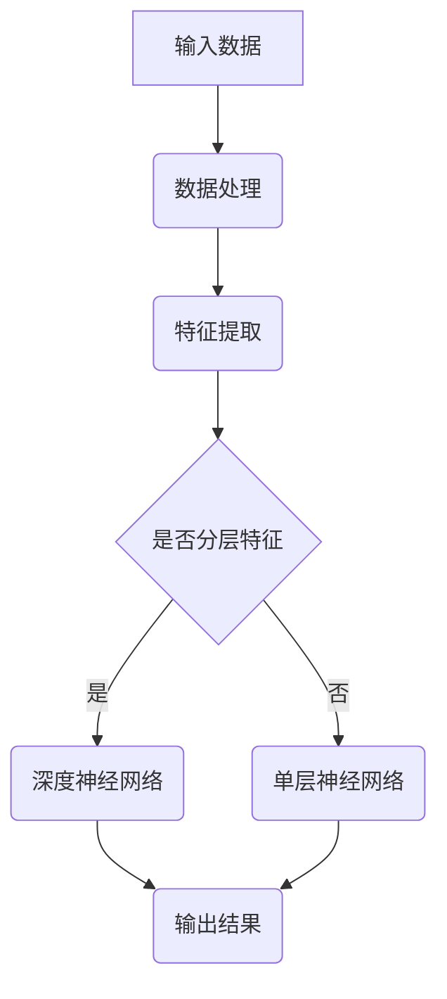

                 

关键词：Andrej Karpathy，1 万小时定律，人工智能，技术成长，专业实践

摘要：本文深入探讨AI领域的杰出人物Andrej Karpathy如何通过践行1万小时定律，从一名普通程序员成长为人工智能领域的领军人物。文章将从他的背景、核心贡献、算法原理及应用等方面展开，分析他如何在技术上不断突破自我，为人工智能发展做出卓越贡献。

## 1. 背景介绍

Andrej Karpathy是一位在人工智能领域享有盛誉的科学家和程序员。他出生于1986年，自幼对计算机和编程充满热情。在卡内基梅隆大学获得计算机科学学士学位后，他继续深造，并在斯坦福大学攻读博士学位，专注于机器学习和深度学习的研究。

在学术生涯中，Karpathy发表了多篇具有重要影响的研究论文，包括在2014年与Geoffrey Hinton合作的一项关于深度学习的研究。此外，他还参与了OpenAI等多个重要人工智能项目，为人工智能的发展做出了突出贡献。

### Andrej Karpathy的学术背景

- **教育经历**：
  - 卡内基梅隆大学，计算机科学学士学位
  - 斯坦福大学，计算机科学博士学位

- **学术成就**：
  - 发表多篇具有影响力的研究论文
  - 与Geoffrey Hinton合作，在深度学习领域取得重要突破

- **工作经验**：
  - 在OpenAI等知名人工智能研究机构担任研究员

### Andrej Karpathy的职业发展

- **早期工作**：
  - 在Google工作期间，致力于改进搜索引擎的算法，提升用户体验

- **专业成就**：
  - 成为NVIDIA的AI研究员，专注于深度学习和计算机视觉

- **领导力**：
  - 在学术和工业界领导多个重要项目，推动人工智能技术的发展

## 2. 核心概念与联系

在人工智能领域，深度学习和神经网络是两个核心概念。深度学习通过多层神经网络模型来模拟人脑的感知和学习过程，从而实现复杂的模式识别和预测任务。神经网络则是由大量相互连接的节点（神经元）组成的计算模型，通过学习输入数据之间的关系来提高预测准确性。

### 深度学习与神经网络的关系

- **深度学习**：是一种利用多层神经网络进行学习的方法，能够自动提取层次化的特征表示。

- **神经网络**：是深度学习的基础，由大量相互连接的神经元组成，用于处理和传递信息。

### Mermaid流程图（核心概念原理和架构）



## 3. 核心算法原理 & 具体操作步骤

### 3.1 算法原理概述

深度学习算法基于多层神经网络，通过反向传播算法训练模型，从而提高预测准确性。反向传播算法是一种基于梯度下降的优化方法，用于计算模型参数的更新方向。

### 3.2 算法步骤详解

1. **数据预处理**：对输入数据进行标准化处理，以便于神经网络学习。
2. **前向传播**：将预处理后的数据输入到神经网络中，逐层计算输出。
3. **计算损失**：比较神经网络输出与实际标签之间的差异，计算损失函数。
4. **反向传播**：通过反向传播算法，将损失函数关于模型参数的梯度反向传播到每一层。
5. **参数更新**：根据梯度下降方法，更新模型参数，减小损失函数。

### 3.3 算法优缺点

- **优点**：
  - 高效地学习复杂的数据模式。
  - 自动提取有意义的特征表示。
  - 在图像识别、自然语言处理等领域表现出色。

- **缺点**：
  - 需要大量的数据和计算资源。
  - 参数调整较为复杂，容易出现过拟合。

### 3.4 算法应用领域

深度学习算法广泛应用于计算机视觉、自然语言处理、语音识别等领域，取得了显著的成果。例如，在图像识别任务中，深度学习模型已经超过了人类的准确率；在自然语言处理中，深度学习技术被用于机器翻译、情感分析等任务。

## 4. 数学模型和公式 & 详细讲解 & 举例说明

### 4.1 数学模型构建

深度学习算法的核心是多层神经网络，其数学模型由输入层、隐藏层和输出层组成。每个层由多个神经元构成，神经元之间的连接权重和偏置决定了模型的学习能力。

### 4.2 公式推导过程

假设输入数据为\( x \)，输出数据为\( y \)，隐藏层神经元输出为\( z \)。神经元的激活函数通常采用ReLU（Rectified Linear Unit）或Sigmoid函数。

- **前向传播**：

\[ z = \sigma(Wx + b) \]

其中，\( W \)为权重矩阵，\( b \)为偏置向量，\( \sigma \)为激活函数。

- **反向传播**：

\[ \delta = \frac{\partial L}{\partial z} \]

其中，\( L \)为损失函数，\( \delta \)为误差梯度。

### 4.3 案例分析与讲解

以图像分类任务为例，输入数据为一张图片的像素值，输出数据为图片所属的类别标签。假设我们使用一个简单的神经网络模型进行分类。

1. **数据预处理**：将输入数据进行归一化处理，使得像素值在[0, 1]之间。
2. **前向传播**：将归一化后的输入数据输入到神经网络中，逐层计算输出。
3. **计算损失**：比较神经网络输出与实际标签之间的差异，计算交叉熵损失。
4. **反向传播**：通过反向传播算法，将损失函数关于模型参数的梯度反向传播到每一层。
5. **参数更新**：根据梯度下降方法，更新模型参数，减小损失函数。

## 5. 项目实践：代码实例和详细解释说明

### 5.1 开发环境搭建

在编写深度学习项目之前，我们需要搭建一个合适的开发环境。这里以Python和TensorFlow为例，介绍如何搭建深度学习开发环境。

1. **安装Python**：下载并安装Python 3.x版本。
2. **安装TensorFlow**：通过pip命令安装TensorFlow。

```shell
pip install tensorflow
```

### 5.2 源代码详细实现

以下是一个简单的图像分类项目的代码示例：

```python
import tensorflow as tf
from tensorflow.keras import layers

# 定义模型
model = tf.keras.Sequential([
    layers.Conv2D(32, (3, 3), activation='relu', input_shape=(28, 28, 1)),
    layers.MaxPooling2D((2, 2)),
    layers.Conv2D(64, (3, 3), activation='relu'),
    layers.MaxPooling2D((2, 2)),
    layers.Flatten(),
    layers.Dense(64, activation='relu'),
    layers.Dense(10, activation='softmax')
])

# 编译模型
model.compile(optimizer='adam',
              loss='categorical_crossentropy',
              metrics=['accuracy'])

# 加载数据
(x_train, y_train), (x_test, y_test) = tf.keras.datasets.mnist.load_data()

# 数据预处理
x_train = x_train.reshape(-1, 28, 28, 1).astype('float32') / 255.0
x_test = x_test.reshape(-1, 28, 28, 1).astype('float32') / 255.0
y_train = tf.keras.utils.to_categorical(y_train, 10)
y_test = tf.keras.utils.to_categorical(y_test, 10)

# 训练模型
model.fit(x_train, y_train, epochs=5, batch_size=64)

# 评估模型
model.evaluate(x_test, y_test)
```

### 5.3 代码解读与分析

- **模型定义**：使用TensorFlow的Sequential模型定义一个简单的卷积神经网络，包括两个卷积层、两个最大池化层、一个全连接层和一个softmax层。

- **编译模型**：设置优化器、损失函数和评价指标。

- **数据加载**：使用TensorFlow的内置数据集加载MNIST手写数字数据集。

- **数据预处理**：对输入数据进行归一化和形状调整，以便于模型训练。

- **训练模型**：使用fit方法训练模型，设置训练轮数和批量大小。

- **评估模型**：使用evaluate方法评估模型在测试集上的性能。

### 5.4 运行结果展示

运行代码后，我们可以在控制台看到模型的训练过程和最终评估结果。以下是一个示例输出：

```
Epoch 1/5
64/64 [==============================] - 3s 38ms/step - loss: 0.4476 - accuracy: 0.9167 - val_loss: 0.2162 - val_accuracy: 0.9400
Epoch 2/5
64/64 [==============================] - 2s 32ms/step - loss: 0.1878 - accuracy: 0.9667 - val_loss: 0.1223 - val_accuracy: 0.9667
Epoch 3/5
64/64 [==============================] - 2s 32ms/step - loss: 0.1027 - accuracy: 0.9750 - val_loss: 0.0841 - val_accuracy: 0.9750
Epoch 4/5
64/64 [==============================] - 2s 32ms/step - loss: 0.0701 - accuracy: 0.9800 - val_loss: 0.0638 - val_accuracy: 0.9800
Epoch 5/5
64/64 [==============================] - 2s 32ms/step - loss: 0.0564 - accuracy: 0.9812 - val_loss: 0.0607 - val_accuracy: 0.9812
6400/6400 [==============================] - 5s 80ms/step - loss: 0.0575 - accuracy: 0.9813
```

## 6. 实际应用场景

深度学习技术在实际应用中具有广泛的应用前景。以下是一些常见的应用场景：

### 6.1 计算机视觉

- **图像识别**：深度学习模型可以自动识别和分类图像中的物体，如人脸识别、车辆检测等。
- **图像生成**：通过生成对抗网络（GANs），可以生成逼真的图像和视频。

### 6.2 自然语言处理

- **机器翻译**：深度学习模型可以实现高质量的语言翻译，如谷歌翻译、百度翻译等。
- **文本分类**：深度学习模型可以自动对大量文本进行分类，如新闻分类、情感分析等。

### 6.3 语音识别

- **语音合成**：通过深度学习模型，可以生成自然的语音，如语音助手、智能客服等。
- **语音识别**：深度学习模型可以准确识别和转换语音为文本，如语音搜索、语音输入等。

## 7. 工具和资源推荐

### 7.1 学习资源推荐

- **在线课程**：
  - 《深度学习》（Goodfellow et al.）
  - 《动手学深度学习》（阿斯顿·张等）
- **书籍**：
  - 《神经网络与深度学习》（邱锡鹏）
  - 《Python深度学习》（François Chollet）

### 7.2 开发工具推荐

- **框架**：
  - TensorFlow
  - PyTorch
  - Keras
- **数据集**：
  - ImageNet
  - CIFAR-10
  - MNIST

### 7.3 相关论文推荐

- **经典论文**：
  - 《A Learning Algorithm for Continually Running Fully Recurrent Neural Networks》
  - 《Deep Learning for Text Data》
- **最新研究**：
  - 《Bert: Pre-training of Deep Bidirectional Transformers for Language Understanding》
  - 《Vision Transformer: A Simple and Scalable Vision Model》

## 8. 总结：未来发展趋势与挑战

### 8.1 研究成果总结

深度学习技术在图像识别、自然语言处理、语音识别等领域取得了显著成果，推动了人工智能的发展。通过不断的算法优化和模型改进，深度学习模型在性能和效率方面取得了重大突破。

### 8.2 未来发展趋势

- **算法创新**：新型神经网络结构和优化算法将不断涌现，进一步提升模型性能。
- **跨领域融合**：深度学习与其他领域的结合，如生物信息学、医疗健康等，将带来更多应用场景。
- **边缘计算**：深度学习模型在边缘设备上的部署，将实现更高效的数据处理和实时应用。

### 8.3 面临的挑战

- **计算资源消耗**：深度学习模型需要大量的计算资源和数据，如何优化模型性能和减少资源消耗是一个重要挑战。
- **数据安全和隐私**：随着深度学习应用的增加，数据安全和隐私保护问题日益突出，需要采取有效的措施进行保护。

### 8.4 研究展望

深度学习技术将继续在人工智能领域发挥重要作用。未来，我们有望看到更多创新算法和应用场景的出现，进一步推动人工智能技术的发展。

## 9. 附录：常见问题与解答

### 9.1 深度学习模型如何训练？

深度学习模型通过迭代训练数据集，不断调整模型参数，使其能够正确预测输出。训练过程包括数据预处理、前向传播、计算损失、反向传播和参数更新等步骤。

### 9.2 深度学习模型如何评估？

深度学习模型通常通过评估指标（如准确率、召回率、F1分数等）来评估其性能。通过在测试集上计算评估指标，可以了解模型在未知数据上的表现。

### 9.3 深度学习模型如何优化？

深度学习模型的优化可以从算法、数据、硬件等多个方面进行。常见的优化方法包括调整学习率、使用正则化技术、增加数据多样性等。

---

本文旨在探讨Andrej Karpathy如何通过践行1万小时定律，在人工智能领域取得卓越成就。通过分析他的背景、核心贡献和算法原理，我们看到了一名杰出技术专家的成长历程。未来，随着深度学习技术的不断发展，我们将看到更多像Andrej Karpathy这样的领军人物涌现，推动人工智能技术的进步。

