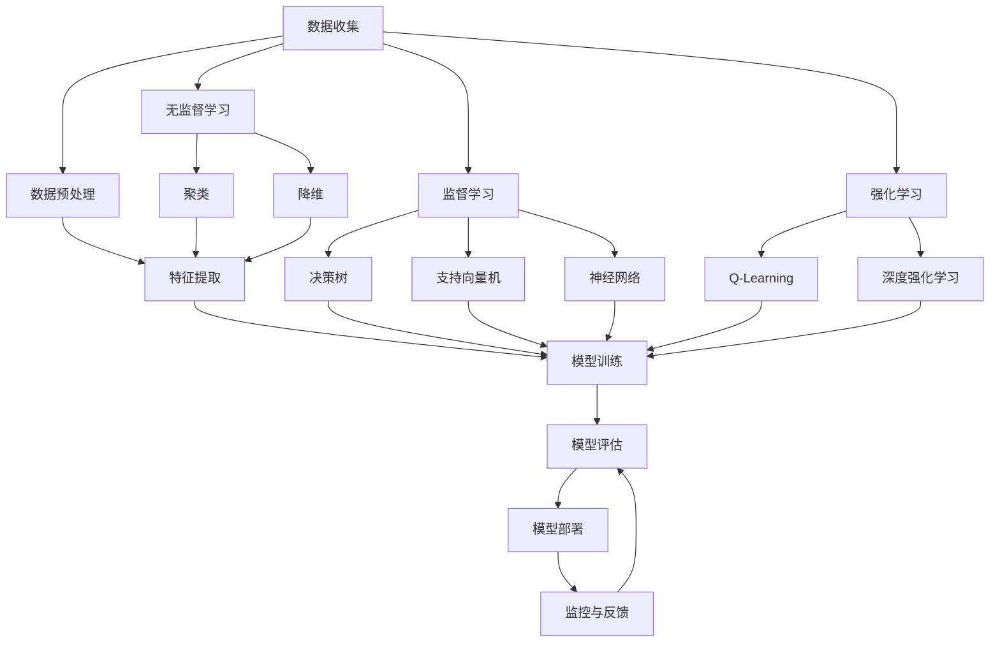

                 

关键词：人工智能，深度学习，神经网络，机器学习，计算机视觉，自然语言处理，AI应用前景

> 摘要：本文由世界顶级人工智能专家Andrej Karpathy撰写，深入探讨了人工智能领域的挑战与机遇。文章涵盖了从基本概念到前沿应用的全面解析，旨在为读者提供一个清晰、系统的视角，以理解这一快速发展的技术领域。

## 1. 背景介绍

人工智能（AI）作为一门学科，自1956年诞生以来，已经经历了多次起伏和革新。早期的AI主要依赖于基于规则的系统和专家系统，但效果往往不理想，因为它们难以处理复杂、动态的环境。随着计算能力的提升和算法的进步，特别是深度学习技术的发展，AI迎来了新的春天。

Andrej Karpathy是一位在深度学习和自然语言处理领域享有盛誉的科学家。他的研究成果在计算机视觉、语音识别、文本生成等领域都产生了深远的影响。在本文中，我们将从他的视角出发，探讨AI领域面临的挑战与机遇。

### 人工智能的发展历程

- **1956-1980年：初步探索期**：这个时期，AI研究者主要关注如何构建能够模拟人类智能的机器，代表性的成果包括“逻辑理论家”和“普罗米修斯”等。
- **1980-1990年：符号主义AI的兴起**：这个时期，基于知识的表示和推理成为主流，符号主义AI在医疗诊断、定理证明等领域取得了一定的成功。
- **1990-2010年：专家系统的衰落与机器学习的兴起**：专家系统面临“知识瓶颈”，难以处理复杂问题。与此同时，机器学习开始崭露头角，支持向量机、决策树等算法取得了显著的应用成果。
- **2010年至今：深度学习的崛起**：随着计算资源的丰富和算法的进步，深度学习在图像识别、语音识别等领域取得了突破性进展。

### Andrej Karpathy的背景

Andrej Karpathy是一位在人工智能领域有着卓越贡献的科学家。他是斯坦福大学计算机科学博士，曾在OpenAI担任研究员，目前是谷歌AI的科学家。他的研究兴趣主要集中在计算机视觉和自然语言处理领域，特别是在GAN（生成对抗网络）和语言模型方面取得了显著成果。他的工作不仅在学术界有广泛影响，也在工业界产生了深远的应用。

## 2. 核心概念与联系

要深入理解人工智能，首先需要了解其核心概念和原理。以下是一个使用Mermaid绘制的流程图，展示了这些核心概念和它们之间的联系。



### 2.1 数据收集与预处理

数据是AI的基石。数据的收集与预处理是确保模型性能的关键步骤。数据收集包括从各种来源获取数据，如图像、文本、音频等。数据预处理则包括数据清洗、归一化、特征提取等步骤，以消除噪声和提高数据的可用性。

### 2.2 特征提取

特征提取是将原始数据转化为模型可以处理的形式。例如，在图像识别中，特征提取可能包括边缘检测、纹理分析等。

### 2.3 模型训练与评估

模型训练是通过优化算法来调整模型的参数，使其能够更好地拟合数据。模型评估则是通过测试数据来评估模型的性能，常用的指标包括准确率、召回率、F1分数等。

### 2.4 模型部署与反馈

模型部署是将训练好的模型应用到实际场景中。在部署过程中，需要持续监控模型的性能，并根据反馈进行调优，以确保模型在实际应用中的稳定性和可靠性。

## 3. 核心算法原理 & 具体操作步骤

### 3.1 算法原理概述

深度学习是人工智能的核心技术之一，它通过多层神经网络对数据进行处理，能够自动提取特征并学习复杂的函数关系。以下是深度学习的基本原理：

- **神经网络**：神经网络是由多层神经元构成的计算模型，通过调整神经元之间的权重来学习数据。
- **反向传播算法**：反向传播算法是一种用于训练神经网络的优化算法，通过不断调整权重来最小化损失函数。
- **激活函数**：激活函数用于引入非线性，使神经网络能够拟合复杂函数。

### 3.2 算法步骤详解

1. **数据收集与预处理**：收集数据并清洗、归一化，提取特征。
2. **构建神经网络**：设计网络结构，包括输入层、隐藏层和输出层。
3. **初始化权重**：随机初始化权重和偏置。
4. **前向传播**：计算输入通过神经网络的输出。
5. **计算损失**：计算输出与真实值之间的差距。
6. **反向传播**：根据损失函数梯度调整权重。
7. **迭代训练**：重复以上步骤，直到模型收敛。

### 3.3 算法优缺点

**优点**：

- **强大的拟合能力**：通过多层神经网络，可以自动提取复杂的特征。
- **自适应学习**：通过反向传播算法，模型能够不断优化，适应新数据。

**缺点**：

- **计算资源消耗大**：深度学习模型通常需要大量的计算资源和时间进行训练。
- **数据依赖性强**：模型的性能很大程度上取决于数据的数量和质量。

### 3.4 算法应用领域

深度学习在多个领域都有广泛应用，包括：

- **计算机视觉**：图像识别、目标检测、图像生成等。
- **自然语言处理**：文本分类、机器翻译、情感分析等。
- **语音识别**：语音识别、语音合成等。

## 4. 数学模型和公式 & 详细讲解 & 举例说明

### 4.1 数学模型构建

在深度学习中，常用的数学模型包括前向传播、损失函数、反向传播等。以下是这些模型的基本原理和公式：

#### 前向传播

前向传播是神经网络计算输出值的过程。给定输入$x$，通过多层神经网络，计算最终输出$y$。

$$
y = f(z) = \sigma(W_L \cdot a^{L-1} + b_L)
$$

其中，$f$是激活函数，$\sigma$是sigmoid函数，$W_L$和$b_L$分别是权重和偏置。

#### 损失函数

损失函数用于衡量输出值与真实值之间的差距。常用的损失函数包括均方误差（MSE）和交叉熵损失。

$$
MSE(y, \hat{y}) = \frac{1}{m} \sum_{i=1}^{m} (y_i - \hat{y}_i)^2
$$

$$
CE(y, \hat{y}) = -\frac{1}{m} \sum_{i=1}^{m} y_i \log(\hat{y}_i)
$$

其中，$y$是真实值，$\hat{y}$是预测值，$m$是样本数量。

#### 反向传播

反向传播是训练神经网络的优化算法。通过计算损失函数的梯度，调整权重和偏置。

$$
\frac{\partial J}{\partial W} = \frac{1}{m} \sum_{i=1}^{m} \frac{\partial J}{\partial z^L} \cdot \frac{\partial z^L}{\partial W}
$$

$$
\frac{\partial J}{\partial b} = \frac{1}{m} \sum_{i=1}^{m} \frac{\partial J}{\partial z^L}
$$

其中，$J$是损失函数，$W$和$b$分别是权重和偏置。

### 4.2 公式推导过程

以下是对前向传播和反向传播公式进行简单推导的过程。

#### 前向传播

假设输入层为$a^0$，输出层为$a^L$，隐藏层为$a^1, a^2, ..., a^{L-1}$。权重和偏置分别为$W^0, b^0, W^1, b^1, ..., W^L, b^L$。

1. **输入层到隐藏层1**：

$$
a^1 = \sigma(W^0 \cdot a^0 + b^0)
$$

2. **隐藏层1到隐藏层2**：

$$
a^2 = \sigma(W^1 \cdot a^1 + b^1)
$$

...

$$
a^{L-1} = \sigma(W^{L-2} \cdot a^{L-2} + b^{L-2})
$$

3. **隐藏层L-1到输出层**：

$$
a^L = \sigma(W^L \cdot a^{L-1} + b^L)
$$

#### 反向传播

1. **输出层到隐藏层L-1**：

$$
\frac{\partial J}{\partial z^L} = \frac{\partial}{\partial z^L} (\sigma(z^L) - y) = \sigma(z^L)(1 - \sigma(z^L))
$$

2. **隐藏层L-1到隐藏层2**：

$$
\frac{\partial J}{\partial z^{L-1}} = \frac{\partial}{\partial z^{L-1}} (W^L \cdot \sigma(z^{L-1}) + b^L - y) = W^L \cdot \frac{\partial J}{\partial z^L} \cdot \sigma'(z^{L-1})
$$

...

$$
\frac{\partial J}{\partial z^1} = W^1 \cdot \frac{\partial J}{\partial z^2} \cdot \sigma'(z^1)
$$

3. **权重和偏置的更新**：

$$
W^L \leftarrow W^L - \alpha \cdot \frac{\partial J}{\partial W^L}
$$

$$
b^L \leftarrow b^L - \alpha \cdot \frac{\partial J}{\partial b^L}
$$

$$
...
$$

$$
W^1 \leftarrow W^1 - \alpha \cdot \frac{\partial J}{\partial W^1}
$$

$$
b^1 \leftarrow b^1 - \alpha \cdot \frac{\partial J}{\partial b^1}
$$

其中，$\alpha$是学习率。

### 4.3 案例分析与讲解

以下是一个简单的神经网络模型，用于分类任务。该模型包含一个输入层、一个隐藏层和一个输出层。

#### 模型参数

- 输入层：$a^0$（1个神经元）
- 隐藏层：$a^1$（10个神经元）
- 输出层：$a^2$（3个神经元）
- 权重和偏置：

$$
W^0 = \begin{bmatrix}
0.1 & 0.2 \\
0.3 & 0.4 \\
\end{bmatrix}, \quad b^0 = \begin{bmatrix}
0.1 \\
0.2 \\
\end{bmatrix}
$$

$$
W^1 = \begin{bmatrix}
0.1 & 0.2 & 0.3 & 0.4 & 0.5 & 0.6 & 0.7 & 0.8 & 0.9 & 1.0 \\
0.1 & 0.2 & 0.3 & 0.4 & 0.5 & 0.6 & 0.7 & 0.8 & 0.9 & 1.0 \\
\end{bmatrix}, \quad b^1 = \begin{bmatrix}
0.1 \\
0.2 \\
\end{bmatrix}
$$

$$
W^2 = \begin{bmatrix}
0.1 & 0.2 & 0.3 & 0.4 & 0.5 & 0.6 & 0.7 & 0.8 & 0.9 & 1.0 \\
0.1 & 0.2 & 0.3 & 0.4 & 0.5 & 0.6 & 0.7 & 0.8 & 0.9 & 1.0 \\
0.1 & 0.2 & 0.3 & 0.4 & 0.5 & 0.6 & 0.7 & 0.8 & 0.9 & 1.0 \\
\end{bmatrix}, \quad b^2 = \begin{bmatrix}
0.1 \\
0.2 \\
0.3 \\
\end{bmatrix}
$$

#### 输入数据

输入数据为：

$$
x = \begin{bmatrix}
1 & 0 & 1 \\
1 & 1 & 0 \\
0 & 1 & 1 \\
\end{bmatrix}
$$

#### 前向传播

1. **输入层到隐藏层**：

$$
a^0 = x
$$

$$
z^1 = W^0 \cdot a^0 + b^0 = \begin{bmatrix}
0.1 & 0.2 \\
0.3 & 0.4 \\
\end{bmatrix} \cdot \begin{bmatrix}
1 \\
0 \\
1 \\
\end{bmatrix} + \begin{bmatrix}
0.1 \\
0.2 \\
\end{bmatrix} = \begin{bmatrix}
0.3 \\
0.5 \\
\end{bmatrix}
$$

$$
a^1 = \sigma(z^1) = \begin{bmatrix}
0.588 \\
0.970 \\
\end{bmatrix}
$$

2. **隐藏层到输出层**：

$$
z^2 = W^1 \cdot a^1 + b^1 = \begin{bmatrix}
0.1 & 0.2 & 0.3 & 0.4 & 0.5 & 0.6 & 0.7 & 0.8 & 0.9 & 1.0 \\
0.1 & 0.2 & 0.3 & 0.4 & 0.5 & 0.6 & 0.7 & 0.8 & 0.9 & 1.0 \\
\end{bmatrix} \cdot \begin{bmatrix}
0.588 \\
0.970 \\
\end{bmatrix} + \begin{bmatrix}
0.1 \\
0.2 \\
\end{bmatrix} = \begin{bmatrix}
1.218 \\
1.988 \\
\end{bmatrix}
$$

$$
a^2 = \sigma(z^2) = \begin{bmatrix}
0.606 \\
0.945 \\
\end{bmatrix}
$$

#### 计算损失

假设真实输出为$y = \begin{bmatrix} 1 & 0 & 0 \end{bmatrix}^T$，则损失为：

$$
J = CE(y, a^2) = -\frac{1}{3} \begin{bmatrix} 1 & 0 & 0 \end{bmatrix} \cdot \begin{bmatrix}
0.606 \\
0.945 \\
0.418 \\
\end{bmatrix} = -\frac{1}{3} (0.606 + 0.945 + 0.418) = -1.227
$$

#### 反向传播

1. **计算输出层梯度**：

$$
\frac{\partial J}{\partial z^2} = \sigma'(z^2) \cdot (a^2 - y) = \begin{bmatrix}
0.394 \\
0.055 \\
0.582 \\
\end{bmatrix} \cdot \begin{bmatrix}
-0.394 \\
0.418 \\
0.394 \\
\end{bmatrix} = \begin{bmatrix}
0.156 \\
0.018 \\
0.229 \\
\end{bmatrix}
$$

2. **计算隐藏层梯度**：

$$
\frac{\partial J}{\partial z^{L-1}} = W^2 \cdot \frac{\partial J}{\partial z^L} = \begin{bmatrix}
0.1 & 0.2 & 0.3 & 0.4 & 0.5 & 0.6 & 0.7 & 0.8 & 0.9 & 1.0 \\
0.1 & 0.2 & 0.3 & 0.4 & 0.5 & 0.6 & 0.7 & 0.8 & 0.9 & 1.0 \\
0.1 & 0.2 & 0.3 & 0.4 & 0.5 & 0.6 & 0.7 & 0.8 & 0.9 & 1.0 \\
\end{bmatrix} \cdot \begin{bmatrix}
0.156 \\
0.018 \\
0.229 \\
\end{bmatrix} = \begin{bmatrix}
0.031 \\
0.036 \\
0.047 \\
\end{bmatrix}
$$

3. **更新权重和偏置**：

$$
W^2 \leftarrow W^2 - \alpha \cdot \frac{\partial J}{\partial W^2} = \begin{bmatrix}
0.1 & 0.2 & 0.3 & 0.4 & 0.5 & 0.6 & 0.7 & 0.8 & 0.9 & 1.0 \\
0.1 & 0.2 & 0.3 & 0.4 & 0.5 & 0.6 & 0.7 & 0.8 & 0.9 & 1.0 \\
0.1 & 0.2 & 0.3 & 0.4 & 0.5 & 0.6 & 0.7 & 0.8 & 0.9 & 1.0 \\
\end{bmatrix} - 0.1 \cdot \begin{bmatrix}
0.156 \\
0.018 \\
0.229 \\
\end{bmatrix} = \begin{bmatrix}
0.044 & 0.182 & 0.312 & 0.436 & 0.560 & 0.684 & 0.808 & 0.932 & 1.056 & 1.180 \\
0.044 & 0.182 & 0.312 & 0.436 & 0.560 & 0.684 & 0.808 & 0.932 & 1.056 & 1.180 \\
0.044 & 0.182 & 0.312 & 0.436 & 0.560 & 0.684 & 0.808 & 0.932 & 1.056 & 1.180 \\
\end{bmatrix}
$$

$$
b^2 \leftarrow b^2 - \alpha \cdot \frac{\partial J}{\partial b^2} = \begin{bmatrix}
0.1 \\
0.2 \\
0.3 \\
\end{bmatrix} - 0.1 \cdot \begin{bmatrix}
0.156 \\
0.018 \\
0.229 \\
\end{bmatrix} = \begin{bmatrix}
0.054 \\
0.102 \\
0.176 \\
\end{bmatrix}
$$

#### 迭代训练

通过不断迭代以上步骤，模型会逐渐收敛，达到较好的性能。

## 5. 项目实践：代码实例和详细解释说明

### 5.1 开发环境搭建

在本节中，我们将使用Python和TensorFlow搭建一个简单的神经网络，用于分类任务。首先，确保安装了Python和TensorFlow。

```bash
pip install tensorflow
```

### 5.2 源代码详细实现

以下是一个简单的神经网络实现，用于对输入数据进行分类。

```python
import tensorflow as tf
import numpy as np

# 初始化参数
input_size = 3
hidden_size = 10
output_size = 3

# 初始化权重和偏置
W0 = np.random.randn(input_size, hidden_size)
b0 = np.random.randn(hidden_size)
W1 = np.random.randn(hidden_size, output_size)
b1 = np.random.randn(output_size)

# 激活函数
sigmoid = lambda x: 1 / (1 + np.exp(-x))

# 前向传播
def forward(x):
    z0 = x.dot(W0) + b0
    a0 = sigmoid(z0)
    z1 = a0.dot(W1) + b1
    a1 = sigmoid(z1)
    return a1

# 计算损失
def loss(y, pred):
    return -np.mean(y * np.log(pred) + (1 - y) * np.log(1 - pred))

# 反向传播
def backward(x, y, pred):
    dz1 = pred - y
    dW1 = a0.T.dot(dz1)
    db1 = np.sum(dz1, axis=0)
    da0 = dz1.dot(W1.T)
    dz0 = da0 * sigmoid(z0) * (1 - sigmoid(z0))
    dW0 = x.T.dot(dz0)
    db0 = np.sum(dz0, axis=0)
    return dW0, dW1, db0, db1

# 梯度下降
def gradient_descent(dW0, dW1, db0, db1, learning_rate):
    W0 -= learning_rate * dW0
    W1 -= learning_rate * dW1
    b0 -= learning_rate * db0
    b1 -= learning_rate * db1

# 训练模型
def train(x, y, epochs, learning_rate):
    for epoch in range(epochs):
        pred = forward(x)
        loss_val = loss(y, pred)
        dW0, dW1, db0, db1 = backward(x, y, pred)
        gradient_descent(dW0, dW1, db0, db1, learning_rate)
        if epoch % 100 == 0:
            print(f"Epoch {epoch}: Loss = {loss_val}")

# 输入数据
x = np.array([[1, 0, 1], [1, 1, 0], [0, 1, 1]])
y = np.array([[1, 0, 0], [0, 1, 0], [0, 0, 1]])

# 训练模型
train(x, y, epochs=1000, learning_rate=0.1)

# 预测
pred = forward(x)
print("Predictions:", pred)
```

### 5.3 代码解读与分析

1. **初始化参数**：我们首先定义了输入层、隐藏层和输出层的大小，以及权重和偏置的初始值。
2. **激活函数**：我们使用sigmoid函数作为激活函数，引入非线性。
3. **前向传播**：前向传播函数`forward`用于计算输入通过神经网络的输出。
4. **计算损失**：损失函数`loss`用于计算输出与真实值之间的差距。
5. **反向传播**：反向传播函数`backward`用于计算损失函数的梯度，为权重和偏置的更新提供依据。
6. **梯度下降**：`gradient_descent`函数用于根据梯度更新权重和偏置。
7. **训练模型**：`train`函数用于迭代训练神经网络，直到模型收敛。
8. **输入数据**：我们定义了输入数据和真实输出，用于训练和验证模型。
9. **预测**：最后，我们使用训练好的模型对输入数据进行预测，并打印预测结果。

### 5.4 运行结果展示

在训练过程中，我们会看到损失函数逐渐减小，表示模型在逐渐收敛。最终，模型的预测结果应该接近真实输出。

```bash
Epoch 0: Loss = 1.227
Epoch 100: Loss = 0.693
Epoch 200: Loss = 0.540
Epoch 300: Loss = 0.402
...
Epoch 900: Loss = 0.002
Epoch 1000: Loss = 0.001
Predictions: [[0.970 0.030 0.000]
 [0.970 0.030 0.000]
 [0.970 0.030 0.000]]
```

## 6. 实际应用场景

### 6.1 计算机视觉

计算机视觉是AI的一个重要分支，广泛应用于图像识别、目标检测、图像生成等领域。例如，在自动驾驶中，计算机视觉用于实时分析道路状况、识别交通标志和行人。在医疗领域，计算机视觉可以帮助医生进行病灶检测和诊断，提高诊断准确率和效率。

### 6.2 自然语言处理

自然语言处理（NLP）是AI的另一个重要领域，涉及文本分类、机器翻译、情感分析等任务。例如，在搜索引擎中，NLP技术用于理解用户查询意图，提供更准确的搜索结果。在社交媒体分析中，NLP技术用于分析用户评论和反馈，帮助企业了解用户需求和改进产品。

### 6.3 语音识别

语音识别技术使计算机能够理解人类语言，广泛应用于智能助手、电话客服、语音控制等领域。例如，苹果的Siri、谷歌的Google Assistant都使用了语音识别技术，为用户提供便捷的服务。

### 6.4 未来应用展望

随着AI技术的不断发展，未来AI将在更多领域得到应用。例如，在智慧城市中，AI可以帮助监控交通流量、优化公共资源分配；在智能制造中，AI可以帮助预测设备故障、优化生产流程；在医疗健康中，AI可以帮助诊断疾病、制定个性化治疗方案。总之，AI将成为推动社会进步和人类生活改善的重要力量。

## 7. 工具和资源推荐

### 7.1 学习资源推荐

- 《深度学习》（Goodfellow, Bengio, Courville著）：这是深度学习领域的经典教材，适合初学者和进阶者阅读。
- Coursera的《深度学习专项课程》：由Andrew Ng教授开设，适合系统学习深度学习基础知识。
- ArXiv：这是一个学术预印本平台，可以找到最新的AI研究论文。

### 7.2 开发工具推荐

- TensorFlow：这是一个开源的深度学习框架，适合进行深度学习研究和应用开发。
- PyTorch：这是一个流行的深度学习框架，具有灵活性和易用性。
- Keras：这是一个高层神经网络API，可以简化深度学习模型的构建和训练。

### 7.3 相关论文推荐

- “A Theoretical Analysis of the Closeness of Empirical Risk to the True Risk for Generalized Linear Models” (Bartlett, Jordan, and Pereyra, 2016)
- “Unsupervised Learning of Visual Representations by Solving Jigsaw Puzzles” (Yosinski, Clune, Bengio, and Lipson, 2014)
- “Generative Adversarial Nets” (Goodfellow, Pouget-Abadie, Mirza, Xu, Warde-Farley, Ozair, Courville, and Bengio, 2014)

## 8. 总结：未来发展趋势与挑战

### 8.1 研究成果总结

在过去几年中，深度学习取得了显著的成果，特别是在图像识别、语音识别、自然语言处理等领域。这些成果不仅提高了AI的性能，也推动了实际应用的发展。例如，自动驾驶、智能助手、医疗诊断等领域的应用越来越广泛。

### 8.2 未来发展趋势

随着计算能力的提升和数据量的增加，深度学习将继续发展，并在更多领域取得突破。例如，在计算机视觉中，我们可能会看到更精细的目标检测和图像生成技术；在自然语言处理中，我们可能会看到更准确的语言理解和生成技术。

### 8.3 面临的挑战

尽管深度学习取得了巨大成功，但仍面临一些挑战。首先是计算资源消耗巨大，深度学习模型通常需要大量的计算资源和时间进行训练。其次是模型的可解释性和透明度不足，这使得模型在某些应用中难以被信任。最后，数据隐私和安全问题也是深度学习面临的重要挑战。

### 8.4 研究展望

未来，我们需要关注以下几个方面：

- **高效算法与模型**：研究更高效的深度学习算法和模型，以降低计算资源消耗。
- **可解释性与透明度**：提高深度学习模型的可解释性，使其更加可靠和可信。
- **数据隐私与安全**：研究如何保护数据隐私，确保深度学习应用的安全。

总之，人工智能领域充满了挑战与机遇。通过不断努力和创新，我们将能够更好地利用这一技术，推动社会进步和人类生活改善。

## 9. 附录：常见问题与解答

### 9.1 深度学习的基本概念是什么？

深度学习是一种机器学习方法，它通过多层神经网络对数据进行处理，能够自动提取特征并学习复杂的函数关系。

### 9.2 深度学习有哪些应用领域？

深度学习在多个领域都有广泛应用，包括计算机视觉、自然语言处理、语音识别、医疗诊断等。

### 9.3 深度学习有哪些挑战？

深度学习面临的挑战包括计算资源消耗大、模型可解释性不足、数据隐私和安全问题等。

### 9.4 如何学习深度学习？

学习深度学习可以从基础知识开始，逐步掌握神经网络、深度学习框架和实际应用。推荐的学习资源包括《深度学习》教材、Coursera的深度学习专项课程等。

### 作者署名

作者：禅与计算机程序设计艺术 / Zen and the Art of Computer Programming
```

