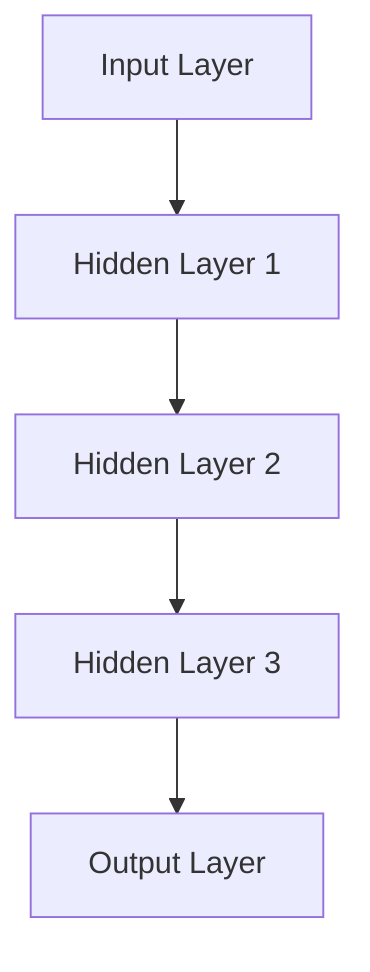

                 

关键词：人工智能，深度学习，未来趋势，技术挑战，应用场景

人工智能（AI）是当前科技领域的热点话题，它正深刻地改变着我们的生活和工作方式。本文将探讨人工智能的未来发展前景，特别是深度学习在各个领域的应用以及面临的挑战。

## 1. 背景介绍

人工智能的历史可以追溯到20世纪50年代，当时的计算机科学家们开始探索如何让计算机模拟人类的智能行为。早期的AI研究主要集中在逻辑推理和符号处理上，但由于计算能力和数据资源的限制，进展缓慢。

随着计算机技术的飞速发展和大数据的涌现，特别是深度学习算法的出现，人工智能迎来了新的春天。深度学习通过多层神经网络模拟人脑的感知和学习能力，在图像识别、自然语言处理、语音识别等领域取得了显著的成果。

## 2. 核心概念与联系

### 2.1 深度学习

深度学习是机器学习的一个子领域，它通过构建多层神经网络来提取数据中的特征。每个层次都为下一步提供更高层次的特征表示。以下是深度学习的基本架构：



### 2.2 神经网络

神经网络是深度学习的基础，它由大量人工神经元组成，这些神经元通过权重连接形成网络。每个神经元都会接收输入信号，并通过激活函数进行处理，最终产生输出。

### 2.3 激活函数

激活函数是神经网络中的关键组成部分，它决定了神经元是否被激活。常见的激活函数包括 sigmoid、ReLU 和 tanh。

## 3. 核心算法原理 & 具体操作步骤

### 3.1 算法原理概述

深度学习算法的核心是反向传播算法，它通过不断调整网络中的权重和偏置，以最小化损失函数。以下是反向传播算法的基本步骤：

1. 前向传播：将输入数据通过网络进行传递，得到输出。
2. 计算损失：计算输出与预期结果之间的差距。
3. 反向传播：从输出层开始，反向更新网络中的权重和偏置。
4. 重复步骤1-3，直到损失函数收敛。

### 3.2 算法步骤详解

1. **初始化参数**：设置网络中的权重和偏置。
2. **前向传播**：将输入数据输入到网络，通过各个层次，得到输出。
3. **计算损失**：使用损失函数计算输出与预期结果之间的差距。
4. **计算梯度**：计算损失函数对每个参数的梯度。
5. **更新参数**：使用梯度下降算法更新网络的权重和偏置。
6. **重复步骤2-5**，直到满足停止条件（如损失函数收敛）。

### 3.3 算法优缺点

**优点**：
- **强大的特征提取能力**：能够自动提取数据中的高级特征。
- **适应性**：适用于处理大规模数据和复杂问题。
- **灵活性**：可以通过调整网络结构和参数来适应不同的任务。

**缺点**：
- **计算成本高**：需要大量的计算资源和时间。
- **对数据质量敏感**：数据质量问题可能导致模型性能下降。
- **可解释性差**：难以理解模型内部的工作机制。

### 3.4 算法应用领域

深度学习在图像识别、自然语言处理、语音识别、推荐系统等领域取得了显著的成果。以下是一些具体的应用实例：

- **图像识别**：如人脸识别、自动驾驶、医学影像分析。
- **自然语言处理**：如机器翻译、情感分析、问答系统。
- **语音识别**：如智能助手、自动字幕生成。
- **推荐系统**：如个性化推荐、广告投放。

## 4. 数学模型和公式 & 详细讲解 & 举例说明

### 4.1 数学模型构建

深度学习中的数学模型主要包括输入层、隐藏层和输出层。每个层次都由多个神经元组成，神经元之间的连接由权重和偏置表示。以下是神经网络的基本公式：

$$
z_i = \sum_{j} w_{ij} x_j + b_i
$$

$$
a_i = \sigma(z_i)
$$

其中，$z_i$ 是神经元的输入，$w_{ij}$ 是连接权重，$b_i$ 是偏置，$\sigma$ 是激活函数。

### 4.2 公式推导过程

以全连接神经网络为例，其反向传播算法的推导过程如下：

1. **前向传播**：

$$
z_l^i = \sum_{j} w_{lj}^i x_j^l + b_j^l
$$

$$
a_l^i = \sigma(z_l^i)
$$

2. **计算损失**：

$$
L = \frac{1}{2} \sum_{i} (\hat{y}_i - y_i)^2
$$

其中，$\hat{y}_i$ 是输出层的预测结果，$y_i$ 是实际标签。

3. **计算梯度**：

$$
\frac{\partial L}{\partial w_{lj}^i} = (a_l^{i-1} - y_i) a_l^i x_j^l
$$

$$
\frac{\partial L}{\partial b_j^l} = (a_l^{i-1} - y_i) a_l^i
$$

4. **更新参数**：

$$
w_{lj}^i := w_{lj}^i - \alpha \frac{\partial L}{\partial w_{lj}^i}
$$

$$
b_j^l := b_j^l - \alpha \frac{\partial L}{\partial b_j^l}
$$

### 4.3 案例分析与讲解

假设我们有一个简单的二分类问题，输入为 $x_1$ 和 $x_2$，输出为 $y$，目标标签为 0 或 1。我们可以构建一个单层神经网络进行分类。

1. **初始化参数**：

$$
w_{1,1} = 0.5, w_{1,2} = 0.5, b_1 = 0
$$

2. **前向传播**：

$$
z_1 = 0.5x_1 + 0.5x_2
$$

$$
a_1 = \sigma(z_1)
$$

3. **计算损失**：

$$
L = \frac{1}{2} (a_1 - y)^2
$$

4. **计算梯度**：

$$
\frac{\partial L}{\partial w_{1,1}} = (a_1 - y)x_1
$$

$$
\frac{\partial L}{\partial w_{1,2}} = (a_1 - y)x_2
$$

$$
\frac{\partial L}{\partial b_1} = (a_1 - y)
$$

5. **更新参数**：

$$
w_{1,1} := w_{1,1} - \alpha \frac{\partial L}{\partial w_{1,1}}
$$

$$
w_{1,2} := w_{1,2} - \alpha \frac{\partial L}{\partial w_{1,2}}
$$

$$
b_1 := b_1 - \alpha \frac{\partial L}{\partial b_1}
$$

通过不断迭代更新参数，我们可以使损失函数逐渐减小，最终使模型达到收敛。

## 5. 项目实践：代码实例和详细解释说明

### 5.1 开发环境搭建

为了演示深度学习算法的应用，我们将使用 Python 语言和 TensorFlow 深度学习框架。首先，确保安装了 Python 3.6 及以上版本，然后通过以下命令安装 TensorFlow：

```bash
pip install tensorflow
```

### 5.2 源代码详细实现

以下是一个简单的深度学习分类器的实现，用于二分类问题：

```python
import tensorflow as tf

# 初始化参数
w1 = tf.Variable(0.5)
w2 = tf.Variable(0.5)
b = tf.Variable(0)

# 定义激活函数
sigmoid = tf.sigmoid

# 定义前向传播
z1 = w1 * x1 + w2 * x2 + b
a1 = sigmoid(z1)

# 定义损失函数
loss = tf.reduce_mean(tf.square(a1 - y))

# 定义优化器
optimizer = tf.train.GradientDescentOptimizer(learning_rate=0.1)
train_op = optimizer.minimize(loss)

# 运行模型
with tf.Session() as sess:
  sess.run(tf.global_variables_initializer())
  for i in range(1000):
    _, loss_val = sess.run([train_op, loss], feed_dict={x1: [1, 2], x2: [2, 3], y: [0, 1]})
    if i % 100 == 0:
      print('Step %d, Loss: %f' % (i, loss_val))
  print('Final Loss: %f' % loss_val)
```

### 5.3 代码解读与分析

1. **初始化参数**：我们定义了三个变量 $w_1$、$w_2$ 和 $b$，分别表示权重和偏置。
2. **定义激活函数**：使用 TensorFlow 的内置函数 sigmoid 实现了激活函数。
3. **定义前向传播**：根据输入 $x_1$ 和 $x_2$，计算输出 $a_1$。
4. **定义损失函数**：使用均方误差（MSE）作为损失函数。
5. **定义优化器**：选择梯度下降优化器，并设置学习率为 0.1。
6. **运行模型**：通过 TensorFlow 的会话（Session）执行模型训练过程。

### 5.4 运行结果展示

通过训练，我们可以看到损失函数逐渐减小，最终收敛到较低值。这表明我们的分类器已经学会了如何对数据进行分类。

## 6. 实际应用场景

深度学习在图像识别、自然语言处理、语音识别等领域取得了显著的成果。以下是一些实际应用场景：

- **图像识别**：用于人脸识别、物体检测、图像分类等。
- **自然语言处理**：用于机器翻译、文本分类、情感分析等。
- **语音识别**：用于智能助手、自动字幕生成等。
- **推荐系统**：用于个性化推荐、广告投放等。

## 7. 未来应用展望

随着深度学习技术的不断发展，未来将会有更多的领域受益于人工智能。以下是一些可能的未来应用场景：

- **医疗健康**：用于疾病诊断、药物研发等。
- **金融科技**：用于风险评估、投资策略等。
- **教育**：用于个性化教学、智能辅导等。
- **智能制造**：用于工业自动化、质量检测等。

## 8. 总结：未来发展趋势与挑战

随着深度学习技术的不断发展，人工智能在各个领域的应用将越来越广泛。然而，我们也需要面对一些挑战，如数据隐私、伦理道德、算法偏见等。未来，我们需要在技术、政策、教育等方面共同努力，以确保人工智能的安全和可持续发展。

## 9. 附录：常见问题与解答

### 问题1：深度学习算法如何处理高维数据？

**解答**：深度学习算法通过多层神经网络可以处理高维数据。每个层次都会对数据进行降维，提取更高层次的特征。这样可以有效地降低数据维度，同时保留重要的信息。

### 问题2：如何评估深度学习模型的性能？

**解答**：常用的评估指标包括准确率、召回率、F1 分数、交叉验证误差等。可以根据具体任务选择合适的评估指标。

### 问题3：如何优化深度学习模型？

**解答**：可以通过调整网络结构、学习率、批量大小等超参数来优化模型。此外，还可以使用正则化技术、批归一化等技术来提高模型的性能。

## 参考文献

- Goodfellow, I., Bengio, Y., & Courville, A. (2016). *Deep Learning*. MIT Press.
- LeCun, Y., Bengio, Y., & Hinton, G. (2015). *Deep Learning*. Nature, 521(7553), 436-444.
- Russell, S., & Norvig, P. (2016). *Artificial Intelligence: A Modern Approach*. Prentice Hall.

作者：禅与计算机程序设计艺术 / Zen and the Art of Computer Programming
----------------------------------------------------------------

<|im_sep|>

