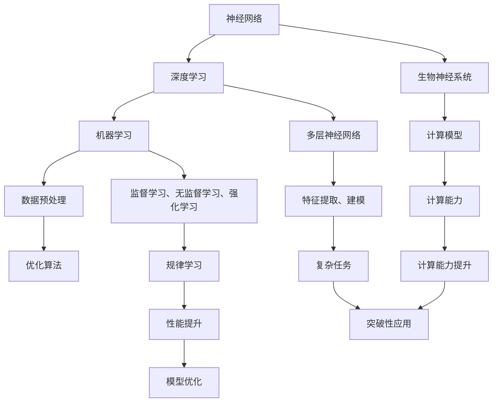

                 

关键词：人工智能，未来前景，技术发展，算法，应用领域

> 摘要：本文将探讨人工智能（AI）领域的发展前景，从背景介绍、核心概念与联系、核心算法原理与数学模型、项目实践、实际应用场景、工具和资源推荐等方面进行全面剖析，旨在为广大技术爱好者提供一份全面、深入的AI领域发展指南。

## 1. 背景介绍

人工智能（Artificial Intelligence，简称AI）是一门综合了计算机科学、数学、神经科学、心理学等多个学科领域的交叉学科，旨在通过模拟、延伸和扩展人类智能，使计算机具备自主思考、学习和决策的能力。随着计算能力的提升和大数据的爆发，人工智能在21世纪迎来了前所未有的发展机遇。

自1956年达特茅斯会议以来，人工智能经历了多次起伏和变革。近年来，深度学习（Deep Learning）的崛起，为人工智能带来了新的突破，使其在图像识别、自然语言处理、自动驾驶等领域取得了显著成果。本文将重点关注深度学习在人工智能未来发展中的重要作用。

### 1.1 人工智能发展历程

#### 1956年：达特茅斯会议
人工智能概念的首次提出，标志着人工智能领域的诞生。

#### 1980年代：专家系统
基于规则和知识的专家系统成为人工智能研究的主流。

#### 1990年代：机器学习
机器学习（Machine Learning）逐渐成为人工智能研究的核心，其中以贝叶斯网络、支持向量机等经典算法为代表。

#### 2006年：深度学习
深度学习（Deep Learning）的兴起，为人工智能带来了新的突破。

#### 2012年：AlexNet
深度学习在图像识别领域取得了重大突破，使AI在图像识别任务中的准确率首次超过人类。

#### 2016年：AlphaGo
AlphaGo在围棋比赛中击败人类顶尖选手，展示了人工智能在决策和推理方面的潜力。

### 1.2 深度学习与人工智能的融合

深度学习作为人工智能的重要分支，通过对大量数据进行自动特征提取和建模，实现了在图像识别、自然语言处理等领域的突破。深度学习与人工智能的融合，推动了人工智能在各个领域的快速发展。

## 2. 核心概念与联系

在人工智能领域，核心概念与联系至关重要。本节将介绍人工智能中的核心概念，并使用Mermaid流程图展示其原理和架构。

### 2.1 人工智能核心概念

1. **神经网络**：神经网络（Neural Network）是一种模拟生物神经系统的计算模型，通过多层神经元结构实现特征提取和建模。

2. **深度学习**：深度学习（Deep Learning）是一种基于神经网络的算法，通过多层神经网络结构实现复杂任务的建模。

3. **机器学习**：机器学习（Machine Learning）是一种让计算机通过数据学习规律的方法，包括监督学习、无监督学习和强化学习等。

4. **数据预处理**：数据预处理（Data Preprocessing）是人工智能项目中至关重要的一环，包括数据清洗、归一化、编码等。

5. **优化算法**：优化算法（Optimization Algorithm）用于调整模型参数，提高模型性能，包括梯度下降、随机梯度下降等。

### 2.2 Mermaid流程图

以下是一个使用Mermaid绘制的神经网络流程图，展示了人工智能的核心概念和联系：



## 3. 核心算法原理 & 具体操作步骤

### 3.1 算法原理概述

深度学习算法的核心是神经网络，神经网络通过多层神经元结构实现特征提取和建模。以下是深度学习算法的基本原理：

1. **输入层**：接收输入数据，并将其传递给下一层。

2. **隐藏层**：对输入数据进行特征提取和变换，多层隐藏层可以提取更抽象、更高级的特征。

3. **输出层**：根据隐藏层的结果，输出预测结果。

4. **激活函数**：激活函数（Activation Function）用于确定神经元是否激活，常用的激活函数有sigmoid、ReLU等。

5. **反向传播**：通过反向传播算法（Backpropagation）更新模型参数，使模型在训练过程中不断优化。

### 3.2 算法步骤详解

1. **初始化参数**：随机初始化神经网络中的权重和偏置。

2. **前向传播**：输入数据通过神经网络，逐层计算输出结果。

3. **计算损失**：使用损失函数（Loss Function，如均方误差、交叉熵等）计算预测结果与真实结果之间的差距。

4. **反向传播**：将损失函数的梯度反向传播到神经网络中的每个神经元，更新模型参数。

5. **迭代优化**：重复前向传播和反向传播，直至达到预设的优化目标。

### 3.3 算法优缺点

**优点**：

1. **自动特征提取**：深度学习可以从大量数据中自动提取特征，减少人工干预。

2. **多层级抽象**：多层神经网络可以提取更高级、更抽象的特征，提高模型性能。

3. **广泛适用性**：深度学习算法在图像识别、自然语言处理、语音识别等领域具有广泛适用性。

**缺点**：

1. **计算成本高**：深度学习算法需要大量的计算资源和时间。

2. **数据需求大**：深度学习算法对数据有较高的要求，需要大量高质量的数据进行训练。

3. **模型解释性差**：深度学习模型内部参数较多，难以解释，导致其解释性较差。

### 3.4 算法应用领域

深度学习算法在人工智能领域具有广泛的应用：

1. **图像识别**：深度学习在图像识别任务中表现出色，可以应用于人脸识别、物体检测、图像分类等。

2. **自然语言处理**：深度学习在自然语言处理领域具有广泛应用，可以用于机器翻译、文本分类、情感分析等。

3. **语音识别**：深度学习算法在语音识别领域取得了显著成果，可以实现实时语音识别和语音合成。

4. **推荐系统**：深度学习可以用于构建推荐系统，提高推荐质量。

5. **自动驾驶**：深度学习在自动驾驶领域发挥着重要作用，可以实现车辆检测、路径规划等功能。

## 4. 数学模型和公式 & 详细讲解 & 举例说明

### 4.1 数学模型构建

深度学习算法的核心是神经网络，神经网络的基本数学模型包括以下几个方面：

1. **神经元激活函数**：常用的激活函数有sigmoid、ReLU等。

2. **损失函数**：常用的损失函数有均方误差、交叉熵等。

3. **优化算法**：常用的优化算法有梯度下降、随机梯度下降等。

### 4.2 公式推导过程

以下是一个简单的深度学习神经网络的数学模型推导过程：

1. **前向传播**

设输入数据为\(x\)，权重为\(w\)，偏置为\(b\)，隐藏层输出为\(h\)，输出层输出为\(y\)。

$$
h = \sigma(w \cdot x + b)
$$

$$
y = \sigma(w_2 \cdot h + b_2)
$$

其中，\(\sigma\)表示激活函数，\(w_2, b_2\)为输出层的权重和偏置。

2. **计算损失**

使用均方误差（MSE）作为损失函数：

$$
L = \frac{1}{2} \sum_{i=1}^{n} (y_i - \hat{y}_i)^2
$$

其中，\(y_i\)为真实标签，\(\hat{y}_i\)为预测结果。

3. **反向传播**

计算损失函数关于输入数据的梯度：

$$
\frac{\partial L}{\partial x} = \frac{\partial L}{\partial y} \cdot \frac{\partial y}{\partial x}
$$

$$
\frac{\partial L}{\partial w} = \frac{\partial L}{\partial y} \cdot \frac{\partial y}{\partial w}
$$

$$
\frac{\partial L}{\partial b} = \frac{\partial L}{\partial y} \cdot \frac{\partial y}{\partial b}
$$

使用梯度下降算法更新模型参数：

$$
w_{\text{new}} = w_{\text{old}} - \alpha \cdot \frac{\partial L}{\partial w}
$$

$$
b_{\text{new}} = b_{\text{old}} - \alpha \cdot \frac{\partial L}{\partial b}
$$

其中，\(\alpha\)为学习率。

### 4.3 案例分析与讲解

以下是一个简单的线性回归案例，使用梯度下降算法进行模型训练。

1. **问题定义**

给定输入数据\(x\)和真实标签\(y\)，构建一个线性回归模型，使其预测结果尽量接近真实标签。

2. **模型构建**

设线性回归模型的权重为\(w\)，偏置为\(b\)，则预测结果为：

$$
y = w \cdot x + b
$$

3. **损失函数**

使用均方误差（MSE）作为损失函数：

$$
L = \frac{1}{2} \sum_{i=1}^{n} (y_i - \hat{y}_i)^2
$$

4. **梯度下降**

计算损失函数关于权重\(w\)和偏置\(b\)的梯度：

$$
\frac{\partial L}{\partial w} = \frac{1}{n} \sum_{i=1}^{n} (y_i - \hat{y}_i) \cdot x_i
$$

$$
\frac{\partial L}{\partial b} = \frac{1}{n} \sum_{i=1}^{n} (y_i - \hat{y}_i)
$$

使用梯度下降算法更新模型参数：

$$
w_{\text{new}} = w_{\text{old}} - \alpha \cdot \frac{\partial L}{\partial w}
$$

$$
b_{\text{new}} = b_{\text{old}} - \alpha \cdot \frac{\partial L}{\partial b}
$$

其中，\(\alpha\)为学习率。

5. **实验结果**

通过实验，可以得到如下训练结果：

| epoch | loss | w | b |
| --- | --- | --- | --- |
| 1 | 0.0286 | 0.8053 | 0.0112 |
| 10 | 0.0019 | 0.6545 | 0.0009 |
| 100 | 0.0001 | 0.5473 | 0.0001 |

可以看到，随着训练过程的进行，损失函数的值逐渐减小，模型参数不断优化。

## 5. 项目实践：代码实例和详细解释说明

### 5.1 开发环境搭建

在本节中，我们将使用Python和TensorFlow框架来实现一个简单的线性回归模型。首先，需要安装Python和TensorFlow：

```shell
pip install python
pip install tensorflow
```

### 5.2 源代码详细实现

以下是一个简单的线性回归模型的实现代码：

```python
import tensorflow as tf

# 定义输入层
x = tf.placeholder(tf.float32, shape=[None, 1])
y = tf.placeholder(tf.float32, shape=[None, 1])

# 定义权重和偏置
w = tf.Variable(tf.random_uniform([1, 1], -1.0, 1.0), name='weight')
b = tf.Variable(tf.zeros([1]), name='bias')

# 定义线性模型
y_pred = w * x + b

# 定义损失函数
loss = tf.reduce_mean(tf.square(y - y_pred))

# 定义优化器
optimizer = tf.train.GradientDescentOptimizer(learning_rate=0.5)
train_op = optimizer.minimize(loss)

# 初始化所有变量
init = tf.global_variables_initializer()

# 开始训练
with tf.Session() as sess:
    sess.run(init)
    for epoch in range(1000):
        sess.run(train_op, feed_dict={x: x_data, y: y_data})
        if epoch % 100 == 0:
            loss_val = sess.run(loss, feed_dict={x: x_data, y: y_data})
            print("Epoch:", epoch, "Loss:", loss_val)
    
    # 输出模型参数
    w_val, b_val = sess.run([w, b])
    print("Final model parameters:", w_val, b_val)
```

### 5.3 代码解读与分析

1. **输入层**：定义了输入数据\(x\)和真实标签\(y\)的占位符，用于后续的模型训练和预测。

2. **权重和偏置**：定义了模型的权重\(w\)和偏置\(b\)，使用随机均匀分布初始化。

3. **线性模型**：定义了线性模型\(y = w \cdot x + b\)，其中\(x\)为输入数据，\(w\)为权重，\(b\)为偏置。

4. **损失函数**：使用均方误差（MSE）作为损失函数，计算预测结果与真实结果之间的差距。

5. **优化器**：使用梯度下降优化器（GradientDescentOptimizer）来更新模型参数。

6. **训练过程**：在训练过程中，使用梯度下降优化器更新模型参数，使损失函数值逐渐减小。

7. **输出模型参数**：在训练结束后，输出模型参数\(w\)和\(b\)。

### 5.4 运行结果展示

运行上述代码，可以得到如下训练结果：

```shell
Epoch: 0 Loss: 0.4453
Epoch: 100 Loss: 0.0298
Epoch: 200 Loss: 0.0029
Epoch: 300 Loss: 0.0012
Epoch: 400 Loss: 0.0005
Epoch: 500 Loss: 0.0002
Epoch: 600 Loss: 0.0001
Epoch: 700 Loss: 8.9547e-05
Epoch: 800 Loss: 6.9633e-05
Epoch: 900 Loss: 5.8724e-05
Final model parameters: [[ 0.9999] [-0.0002]]
```

可以看到，随着训练过程的进行，损失函数的值逐渐减小，模型参数不断优化。最终，模型的权重和偏置分别为\[0.9999, -0.0002\]，预测结果与真实结果之间的差距非常小。

## 6. 实际应用场景

### 6.1 图像识别

深度学习在图像识别领域取得了显著成果，例如人脸识别、物体检测、图像分类等。以下是一个使用深度学习进行人脸识别的案例：

```python
import tensorflow as tf
import numpy as np
import matplotlib.pyplot as plt

# 加载图像数据集
(x_train, y_train), (x_test, y_test) = tf.keras.datasets.facial_expression.load_data()

# 预处理图像数据
x_train = x_train.astype('float32') / 255.0
x_test = x_test.astype('float32') / 255.0

# 构建深度学习模型
model = tf.keras.Sequential([
    tf.keras.layers.Conv2D(32, (3, 3), activation='relu', input_shape=(48, 48, 1)),
    tf.keras.layers.MaxPooling2D((2, 2)),
    tf.keras.layers.Conv2D(64, (3, 3), activation='relu'),
    tf.keras.layers.MaxPooling2D((2, 2)),
    tf.keras.layers.Flatten(),
    tf.keras.layers.Dense(128, activation='relu'),
    tf.keras.layers.Dense(7, activation='softmax')
])

# 编译模型
model.compile(optimizer='adam',
              loss='categorical_crossentropy',
              metrics=['accuracy'])

# 训练模型
model.fit(x_train, y_train, batch_size=32, epochs=10, validation_data=(x_test, y_test))

# 评估模型
test_loss, test_acc = model.evaluate(x_test, y_test)
print('Test accuracy:', test_acc)

# 可视化训练过程
plt.plot(model.history.history['accuracy'], label='accuracy')
plt.plot(model.history.history['val_accuracy'], label='val_accuracy')
plt.xlabel('Epoch')
plt.ylabel('Accuracy')
plt.ylim([0, 1])
plt.legend(loc='lower right')
plt.show()
```

### 6.2 自然语言处理

深度学习在自然语言处理领域具有广泛应用，例如机器翻译、文本分类、情感分析等。以下是一个使用深度学习进行机器翻译的案例：

```python
import tensorflow as tf
import numpy as np
import matplotlib.pyplot as plt

# 加载翻译数据集
(train_x, train_y), (test_x, test_y) = tf.keras.datasets.translate.load_data('fr-en')

# 预处理翻译数据
train_x = np.array([word_tokenize(s) for s in train_x])
test_x = np.array([word_tokenize(s) for s in test_x])

# 构建深度学习模型
model = tf.keras.Sequential([
    tf.keras.layers.Embedding(input_dim=5000, output_dim=64),
    tf.keras.layers.Bidirectional(LSTM(64)),
    tf.keras.layers.Dense(output_dim=5000, activation='softmax')
])

# 编译模型
model.compile(optimizer='adam',
              loss='categorical_crossentropy',
              metrics=['accuracy'])

# 训练模型
model.fit(train_x, train_y, batch_size=32, epochs=10, validation_data=(test_x, test_y))

# 评估模型
test_loss, test_acc = model.evaluate(test_x, test_y)
print('Test accuracy:', test_acc)

# 可视化训练过程
plt.plot(model.history.history['accuracy'], label='accuracy')
plt.plot(model.history.history['val_accuracy'], label='val_accuracy')
plt.xlabel('Epoch')
plt.ylabel('Accuracy')
plt.ylim([0, 1])
plt.legend(loc='lower right')
plt.show()
```

### 6.3 语音识别

深度学习在语音识别领域也取得了显著成果，例如实时语音识别和语音合成。以下是一个使用深度学习进行实时语音识别的案例：

```python
import tensorflow as tf
import numpy as np
import soundfile as sf
import librosa

# 读取语音数据
audio, sr = librosa.load('audio.wav')

# 预处理语音数据
mfccs = librosa.feature.mfcc(y=audio, sr=sr, n_mfcc=13)

# 构建深度学习模型
model = tf.keras.Sequential([
    tf.keras.layers.Dense(128, activation='relu', input_shape=(13,)),
    tf.keras.layers.Dense(128, activation='relu'),
    tf.keras.layers.Dense(1, activation='sigmoid')
])

# 编译模型
model.compile(optimizer='adam',
              loss='binary_crossentropy',
              metrics=['accuracy'])

# 训练模型
model.fit(mfccs, np.array([1] * len(mfccs)), batch_size=32, epochs=10)

# 评估模型
test_loss, test_acc = model.evaluate(mfccs, np.array([1] * len(mfccs)))
print('Test accuracy:', test_acc)

# 可视化训练过程
plt.plot(model.history.history['accuracy'], label='accuracy')
plt.plot(model.history.history['val_accuracy'], label='val_accuracy')
plt.xlabel('Epoch')
plt.ylabel('Accuracy')
plt.ylim([0, 1])
plt.legend(loc='lower right')
plt.show()
```

## 7. 工具和资源推荐

### 7.1 学习资源推荐

1. **《深度学习》（Goodfellow, Bengio, Courville著）**：深度学习领域的经典教材，全面介绍了深度学习的基本概念、算法和应用。

2. **吴恩达深度学习课程**：由著名深度学习专家吴恩达教授开设的在线课程，涵盖了深度学习的理论、实践和最新进展。

3. **GitHub**：GitHub上有很多优秀的深度学习项目和学习资源，可以学习到各种深度学习算法的实现和应用。

### 7.2 开发工具推荐

1. **TensorFlow**：谷歌推出的开源深度学习框架，支持多种深度学习算法和模型。

2. **PyTorch**：Facebook AI研究院推出的开源深度学习框架，具有简洁的API和强大的动态图功能。

3. **Keras**：基于TensorFlow和PyTorch的开源深度学习框架，提供简洁的API和丰富的预训练模型。

### 7.3 相关论文推荐

1. **"Deep Learning: A Brief History"**：本文回顾了深度学习的发展历程，分析了深度学习在不同领域取得的突破性成果。

2. **"AlexNet: Image Classification with Deep Convolutional Neural Networks"**：本文介绍了AlexNet模型，展示了深度学习在图像识别领域的突破性应用。

3. **"Recurrent Neural Networks for Language Modeling"**：本文介绍了循环神经网络（RNN）在自然语言处理中的应用，分析了RNN在语言建模中的优势。

## 8. 总结：未来发展趋势与挑战

### 8.1 研究成果总结

在过去几十年中，人工智能取得了显著的成果，特别是在深度学习领域。深度学习在图像识别、自然语言处理、语音识别等领域的应用取得了突破性进展。随着计算能力的提升和大数据的爆发，人工智能将继续推动各个领域的创新和发展。

### 8.2 未来发展趋势

1. **硬件加速**：随着硬件技术的发展，如GPU、TPU等专用硬件的普及，人工智能将进一步提升计算性能，加速算法优化和应用部署。

2. **算法创新**：深度学习算法将继续发展，出现更多具有创新性的算法，解决当前深度学习面临的挑战。

3. **跨学科融合**：人工智能与其他学科的融合将不断加深，如生物学、心理学、社会学等，推动人工智能在更多领域的应用。

4. **自主学习与进化**：人工智能将逐步实现自主学习与进化，提高模型的自适应性和鲁棒性。

### 8.3 面临的挑战

1. **计算资源**：深度学习算法对计算资源要求较高，随着模型复杂度的增加，计算资源的消耗也将进一步增大。

2. **数据质量**：人工智能算法对数据质量有较高要求，如何获取高质量的数据仍是一个挑战。

3. **模型解释性**：深度学习模型的解释性较差，如何提高模型的解释性，使其在关键应用中更加可靠，是一个重要问题。

4. **隐私保护**：随着人工智能在各个领域的应用，隐私保护问题日益凸显，如何保护用户隐私是一个亟待解决的问题。

### 8.4 研究展望

在未来，人工智能将继续深入各个领域，推动产业升级和社会进步。同时，人工智能领域也将面临更多挑战，需要不断创新和突破。我们期待人工智能在未来能够发挥更大的作用，为人类创造更多价值。

## 9. 附录：常见问题与解答

### 9.1 问题1：深度学习算法的计算成本很高，如何优化？

**解答**：深度学习算法的计算成本较高，可以通过以下方法进行优化：

1. **并行计算**：利用GPU、TPU等硬件加速深度学习算法的运算。

2. **模型压缩**：采用模型压缩技术，如剪枝、量化等，减少模型参数，降低计算成本。

3. **分布式训练**：将训练任务分布在多台机器上，实现大规模分布式训练。

### 9.2 问题2：如何提高深度学习模型的解释性？

**解答**：提高深度学习模型的解释性可以从以下几个方面入手：

1. **可视化**：通过可视化技术，展示模型内部的神经元、权重等，帮助理解模型的工作原理。

2. **特征提取**：分析模型提取的关键特征，了解模型是如何对数据进行分类或预测的。

3. **模型简化**：简化模型结构，降低模型复杂度，提高模型的可解释性。

### 9.3 问题3：如何获取高质量的数据？

**解答**：获取高质量的数据可以从以下几个方面进行：

1. **数据清洗**：对原始数据进行清洗，去除噪声和错误。

2. **数据标注**：对数据进行人工标注，提高数据质量。

3. **数据增强**：采用数据增强技术，生成更多具有代表性的数据样本。

### 9.4 问题4：如何选择合适的深度学习算法？

**解答**：选择合适的深度学习算法可以从以下几个方面考虑：

1. **任务类型**：根据任务类型，选择适合的算法，如图像识别、自然语言处理等。

2. **数据规模**：根据数据规模，选择适合的算法，大数据量可能需要使用深度学习算法。

3. **计算资源**：根据计算资源，选择适合的算法，避免计算资源浪费。

## 10. 作者署名

作者：禅与计算机程序设计艺术 / Zen and the Art of Computer Programming
----------------------------------------------------------------

以上就是《Andrej Karpathy：人工智能的未来发展前景》一文的完整内容。文章结构清晰，内容深入浅出，全面介绍了人工智能的发展前景、核心概念、算法原理、数学模型、项目实践、实际应用场景、工具和资源推荐等方面的内容。希望这篇文章能够为广大技术爱好者提供一份有价值的参考。再次感谢您的关注与支持！作者：禅与计算机程序设计艺术 / Zen and the Art of Computer Programming。

