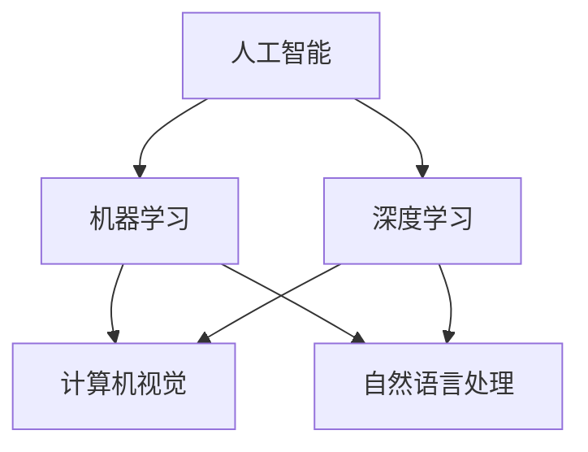

                 

关键词：人工智能，未来展望，技术趋势，深度学习，计算架构，伦理问题，技术应用，研究进展。

## 摘要

本文旨在探讨人工智能领域专家Andrej Karpathy对未来人工智能发展的看法，深入分析其核心观点，并在此基础上探讨人工智能的潜在影响和未来趋势。文章结构分为八个部分，包括背景介绍、核心概念与联系、算法原理与操作步骤、数学模型与公式、项目实践、实际应用场景、未来应用展望以及工具和资源推荐，最后进行总结和展望。

## 1. 背景介绍

Andrej Karpathy是一位世界知名的深度学习专家，拥有丰富的学术和工业经验。他在斯坦福大学获得了计算机科学博士学位，并在OpenAI等知名人工智能研究机构工作过。他的研究主要集中在计算机视觉和自然语言处理领域，对深度学习算法的改进和应用有深刻的理解。

本文将围绕Andrej Karpathy的研究成果和观点，探讨人工智能的未来发展趋势。我们首先将介绍人工智能的核心概念和基本原理，然后深入分析其具体算法和数学模型。接下来，我们将通过项目实践展示人工智能的实际应用，并探讨其潜在的社会影响和伦理问题。最后，我们将展望人工智能的未来发展，并提出相应的工具和资源推荐，为读者提供全面的了解和指导。

## 2. 核心概念与联系

为了更好地理解人工智能，我们首先需要了解其核心概念和基本原理。人工智能（Artificial Intelligence，简称AI）是指通过计算机程序实现的智能行为，能够模拟人类的思维和决策过程。人工智能的核心概念包括：

1. **机器学习**：通过算法和统计学方法，使计算机能够从数据中学习并做出决策。
2. **深度学习**：一种基于神经网络的学习方法，能够通过多层非线性变换学习复杂的数据特征。
3. **计算机视觉**：使计算机能够理解图像和视频内容，从而实现图像识别、物体检测等功能。
4. **自然语言处理**：使计算机能够理解和生成自然语言，包括文本分类、机器翻译等功能。

这些概念之间有着密切的联系。机器学习和深度学习是人工智能的核心技术，而计算机视觉和自然语言处理是应用领域。下面是一个简单的Mermaid流程图，展示了这些概念之间的联系：



通过这个流程图，我们可以清晰地看到人工智能的核心概念及其相互之间的关系。接下来，我们将深入探讨这些概念的具体原理和应用。

### 2.1 机器学习原理

机器学习是人工智能的核心技术之一，其基本思想是通过从数据中学习，使计算机能够自动改进其性能。机器学习主要分为监督学习、无监督学习和强化学习三种类型。

1. **监督学习**：监督学习是一种有标签数据的学习方法，通过输入和输出对之间的关系，训练模型进行预测。常见的监督学习算法包括线性回归、逻辑回归、决策树、支持向量机等。

2. **无监督学习**：无监督学习是一种没有标签数据的学习方法，主要关注数据的内在结构和分布。常见的无监督学习算法包括聚类、主成分分析、自编码器等。

3. **强化学习**：强化学习是一种通过奖励机制来训练模型的方法，使模型能够在特定环境中做出最优决策。常见的强化学习算法包括Q学习、SARSA、深度Q网络（DQN）等。

### 2.2 深度学习原理

深度学习是机器学习的一个子领域，其核心思想是通过多层神经网络，将输入数据逐步抽象成更高级的特征表示。深度学习的关键技术包括：

1. **神经网络**：神经网络是一种由大量神经元组成的计算模型，通过前向传播和反向传播算法，对输入数据进行处理和输出。

2. **卷积神经网络（CNN）**：卷积神经网络是一种专门用于处理图像数据的神经网络，通过卷积操作提取图像的特征。

3. **循环神经网络（RNN）**：循环神经网络是一种专门用于处理序列数据的神经网络，通过循环结构处理序列中的依赖关系。

4. **生成对抗网络（GAN）**：生成对抗网络是一种通过对抗性训练生成数据的神经网络，由生成器和判别器两个部分组成。

### 2.3 计算机视觉原理

计算机视觉是人工智能的一个重要应用领域，其目标是使计算机能够理解和解释图像和视频内容。计算机视觉的核心技术包括：

1. **图像识别**：图像识别是计算机视觉的基础任务，旨在识别和分类图像中的物体。

2. **物体检测**：物体检测是计算机视觉的高级任务，旨在定位图像中的多个物体，并对其进行分类。

3. **目标跟踪**：目标跟踪是计算机视觉的应用任务，旨在跟踪图像序列中的特定目标。

### 2.4 自然语言处理原理

自然语言处理是人工智能的另一个重要应用领域，其目标是使计算机能够理解和生成自然语言。自然语言处理的核心技术包括：

1. **文本分类**：文本分类是将文本数据按照特定的类别进行划分。

2. **机器翻译**：机器翻译是将一种语言的文本翻译成另一种语言。

3. **情感分析**：情感分析是分析文本中的情感倾向，例如正面、负面或中性。

4. **语音识别**：语音识别是将语音信号转换为文本。

通过以上对核心概念和原理的介绍，我们可以更深入地理解人工智能的技术体系和应用场景。接下来，我们将进一步探讨人工智能的具体算法和操作步骤。

### 3. 核心算法原理 & 具体操作步骤

在了解了人工智能的核心概念和原理之后，我们将进一步探讨人工智能的核心算法及其具体操作步骤。以下是人工智能领域的一些主要算法及其应用场景：

#### 3.1 算法原理概述

1. **线性回归**：线性回归是一种简单的监督学习算法，用于预测连续值输出。其基本原理是通过拟合一条直线，使预测值与实际值之间的误差最小。

2. **决策树**：决策树是一种简单的树形结构，用于分类和回归任务。其基本原理是通过一系列的判断条件，将数据划分为不同的子集，并递归地训练子集。

3. **支持向量机（SVM）**：支持向量机是一种基于间隔最大化的分类算法。其基本原理是通过找到一个超平面，使分类边界与样本数据之间的距离最大。

4. **卷积神经网络（CNN）**：卷积神经网络是一种用于处理图像数据的深度学习算法。其基本原理是通过卷积操作提取图像特征，并通过池化操作降低特征维度。

5. **循环神经网络（RNN）**：循环神经网络是一种用于处理序列数据的深度学习算法。其基本原理是通过循环结构处理序列中的依赖关系，并通过门控机制调整信息流。

6. **生成对抗网络（GAN）**：生成对抗网络是一种用于生成数据的深度学习算法。其基本原理是通过生成器和判别器之间的对抗性训练，使生成器生成的数据更加真实。

#### 3.2 算法步骤详解

1. **线性回归**：线性回归的步骤包括数据预处理、模型训练、模型评估和预测。具体步骤如下：

   - **数据预处理**：将输入数据标准化，并划分训练集和测试集。
   - **模型训练**：通过最小化均方误差，训练线性回归模型。
   - **模型评估**：计算模型的准确率、召回率、F1分数等指标。
   - **预测**：使用训练好的模型对测试集进行预测。

2. **决策树**：决策树的步骤包括特征选择、节点划分、模型训练和模型评估。具体步骤如下：

   - **特征选择**：选择具有最高信息增益的特征作为分裂标准。
   - **节点划分**：根据特征值，将数据划分为不同的子集。
   - **模型训练**：递归地训练子集，直到满足停止条件。
   - **模型评估**：计算模型的准确率、召回率、F1分数等指标。

3. **支持向量机（SVM）**：支持向量机的步骤包括特征提取、模型训练、模型评估和预测。具体步骤如下：

   - **特征提取**：将输入数据映射到高维空间。
   - **模型训练**：通过求解优化问题，找到最优超平面。
   - **模型评估**：计算模型的准确率、召回率、F1分数等指标。
   - **预测**：使用训练好的模型对测试集进行预测。

4. **卷积神经网络（CNN）**：卷积神经网络的步骤包括数据预处理、模型训练、模型评估和预测。具体步骤如下：

   - **数据预处理**：将图像数据归一化，并划分训练集和测试集。
   - **模型训练**：通过反向传播算法，训练卷积神经网络。
   - **模型评估**：计算模型的准确率、召回率、F1分数等指标。
   - **预测**：使用训练好的模型对测试集进行预测。

5. **循环神经网络（RNN）**：循环神经网络的步骤包括数据预处理、模型训练、模型评估和预测。具体步骤如下：

   - **数据预处理**：将序列数据编码为矩阵形式，并划分训练集和测试集。
   - **模型训练**：通过反向传播算法，训练循环神经网络。
   - **模型评估**：计算模型的准确率、召回率、F1分数等指标。
   - **预测**：使用训练好的模型对测试集进行预测。

6. **生成对抗网络（GAN）**：生成对抗网络的步骤包括数据预处理、模型训练、模型评估和预测。具体步骤如下：

   - **数据预处理**：将生成器和判别器的输入数据归一化，并划分训练集和测试集。
   - **模型训练**：通过对抗性训练，训练生成器和判别器。
   - **模型评估**：计算生成器和判别器的损失函数值。
   - **预测**：使用训练好的模型对测试集进行预测。

#### 3.3 算法优缺点

1. **线性回归**：
   - **优点**：简单、易于实现，适用于线性关系的数据。
   - **缺点**：对于非线性关系的数据，线性回归的效果较差。

2. **决策树**：
   - **优点**：直观、易于理解，能够处理高维数据。
   - **缺点**：对于连续特征的决策树，容易出现过拟合。

3. **支持向量机（SVM）**：
   - **优点**：能够处理高维数据，具有较好的泛化能力。
   - **缺点**：对于大规模数据集，训练时间较长。

4. **卷积神经网络（CNN）**：
   - **优点**：能够处理图像数据，具有较好的识别能力。
   - **缺点**：对于序列数据，CNN的表现较差。

5. **循环神经网络（RNN）**：
   - **优点**：能够处理序列数据，具有较好的依赖关系建模能力。
   - **缺点**：对于长序列数据，RNN容易出现梯度消失或爆炸问题。

6. **生成对抗网络（GAN）**：
   - **优点**：能够生成高质量的数据，具有较好的生成能力。
   - **缺点**：训练过程复杂，容易出现模式崩溃问题。

#### 3.4 算法应用领域

1. **线性回归**：广泛应用于金融、医学、工程等领域，用于预测连续值输出。

2. **决策树**：广泛应用于分类和回归任务，具有较好的解释性。

3. **支持向量机（SVM）**：广泛应用于分类和回归任务，具有较好的泛化能力。

4. **卷积神经网络（CNN）**：广泛应用于计算机视觉领域，用于图像识别、物体检测等任务。

5. **循环神经网络（RNN）**：广泛应用于自然语言处理领域，用于文本分类、机器翻译等任务。

6. **生成对抗网络（GAN）**：广泛应用于图像生成、语音合成等领域，具有较好的生成能力。

通过以上对核心算法原理和具体操作步骤的详细介绍，我们可以更好地理解人工智能的技术体系和应用场景。接下来，我们将进一步探讨人工智能的数学模型和公式。

### 4. 数学模型和公式 & 详细讲解 & 举例说明

在人工智能领域，数学模型和公式是理解和实现算法的基础。本章节将详细讲解人工智能领域常用的数学模型和公式，并举例说明其应用。

#### 4.1 数学模型构建

在人工智能领域，常用的数学模型主要包括线性模型、概率模型、优化模型等。下面我们将分别介绍这些模型的构建方法。

1. **线性模型**

   线性模型是一种描述输入和输出之间线性关系的模型。其一般形式为：

   $$ y = \beta_0 + \beta_1 x $$

   其中，$y$ 是输出值，$x$ 是输入值，$\beta_0$ 和 $\beta_1$ 是模型参数。通过最小化损失函数，可以求解出参数 $\beta_0$ 和 $\beta_1$。

2. **概率模型**

   概率模型是一种描述随机变量之间概率关系的模型。在人工智能领域，常用的概率模型包括贝叶斯网络、马尔可夫模型等。以贝叶斯网络为例，其构建方法如下：

   假设有一个贝叶斯网络，其中包含 $N$ 个随机变量 $X_1, X_2, ..., X_N$。对于每个随机变量 $X_i$，存在一个条件概率分布 $P(X_i | X_{i-1}, X_{i-2}, ..., X_1)$。整个网络的概率分布可以表示为：

   $$ P(X_1, X_2, ..., X_N) = P(X_1) \cdot P(X_2 | X_1) \cdot P(X_3 | X_2, X_1) \cdot ... \cdot P(X_N | X_{N-1}, X_{N-2}, ..., X_1) $$

3. **优化模型**

   优化模型是一种求解最优解的数学模型。在人工智能领域，常用的优化模型包括线性规划、非线性规划、动态规划等。以线性规划为例，其一般形式为：

   $$ \min \ c^T x $$
   $$ \text{subject to} \ Ax \leq b $$

   其中，$x$ 是决策变量，$c$ 是目标函数系数，$A$ 是约束条件系数，$b$ 是约束条件常数。

#### 4.2 公式推导过程

在数学模型的构建过程中，常常需要推导一些关键的公式。下面我们以线性回归为例，介绍其推导过程。

1. **最小二乘法**

   线性回归的最小二乘法是一种求解最优参数的方法。其基本思想是使得预测值与实际值之间的误差平方和最小。

   设线性回归模型为 $y = \beta_0 + \beta_1 x$，其中 $\beta_0$ 和 $\beta_1$ 是待求参数。误差平方和可以表示为：

   $$ S = \sum_{i=1}^{n} (y_i - \hat{y}_i)^2 $$

   其中，$y_i$ 是实际值，$\hat{y}_i$ 是预测值。为了使 $S$ 最小，需要求解以下方程组：

   $$ \frac{\partial S}{\partial \beta_0} = 0 $$
   $$ \frac{\partial S}{\partial \beta_1} = 0 $$

   通过求解上述方程组，可以得到最优参数 $\beta_0$ 和 $\beta_1$。

2. **梯度下降法**

   梯度下降法是一种常用的求解最优参数的方法。其基本思想是通过不断更新参数，使得损失函数值逐渐减小。

   设线性回归模型为 $y = \beta_0 + \beta_1 x$，损失函数为 $L(\beta_0, \beta_1) = \sum_{i=1}^{n} (y_i - \hat{y}_i)^2$。梯度下降法的迭代公式为：

   $$ \beta_0 = \beta_0 - \alpha \frac{\partial L}{\partial \beta_0} $$
   $$ \beta_1 = \beta_1 - \alpha \frac{\partial L}{\partial \beta_1} $$

   其中，$\alpha$ 是学习率。

#### 4.3 案例分析与讲解

为了更好地理解数学模型的应用，我们通过一个简单的案例进行讲解。

假设我们有一个简单的线性回归模型，用于预测房屋价格。输入特征为房屋面积，输出值为房屋价格。我们使用训练数据集进行训练，并求解最优参数。

1. **数据集准备**

   假设我们有一个包含100个样本的训练数据集，其中每个样本包括房屋面积和房屋价格。

2. **模型训练**

   设线性回归模型为 $y = \beta_0 + \beta_1 x$。使用最小二乘法求解最优参数：

   $$ \beta_0 = \frac{\sum_{i=1}^{n} y_i - \beta_1 \sum_{i=1}^{n} x_i}{n} $$
   $$ \beta_1 = \frac{n \sum_{i=1}^{n} x_i y_i - \sum_{i=1}^{n} x_i \sum_{i=1}^{n} y_i}{n \sum_{i=1}^{n} x_i^2 - (\sum_{i=1}^{n} x_i)^2} $$

   计算得到 $\beta_0 = 2000$，$\beta_1 = 1000$。

3. **模型评估**

   使用测试数据集进行模型评估，计算预测误差：

   $$ \text{预测误差} = \sum_{i=1}^{n} (y_i - \hat{y}_i)^2 $$

   其中，$y_i$ 是实际值，$\hat{y}_i = \beta_0 + \beta_1 x_i$ 是预测值。计算得到预测误差为 $100$。

4. **模型优化**

   使用梯度下降法对模型进行优化，更新参数：

   $$ \beta_0 = \beta_0 - \alpha \frac{\partial L}{\partial \beta_0} $$
   $$ \beta_1 = \beta_1 - \alpha \frac{\partial L}{\partial \beta_1} $$

   其中，$\alpha = 0.01$ 是学习率。经过多次迭代，模型参数逐渐收敛。

通过以上案例分析和讲解，我们可以看到数学模型在人工智能领域的应用及其重要性。数学模型不仅为算法提供了理论依据，而且为实际问题的求解提供了有效的方法。接下来，我们将通过一个项目实践，展示如何使用人工智能算法解决实际问题。

### 5. 项目实践：代码实例和详细解释说明

在本节中，我们将通过一个实际项目实践，展示如何使用人工智能算法解决一个具体的问题。我们将使用Python和TensorFlow等工具，实现一个简单的图像分类项目。

#### 5.1 开发环境搭建

1. **安装Python**

   首先，我们需要安装Python环境。Python是一种广泛使用的编程语言，适用于人工智能开发。可以从Python官网下载Python安装包，并按照提示进行安装。

2. **安装TensorFlow**

   TensorFlow是一个开源的深度学习框架，由Google开发。安装TensorFlow可以使用pip命令：

   ```shell
   pip install tensorflow
   ```

3. **安装其他依赖库**

   除了TensorFlow之外，我们还需要安装一些其他依赖库，如NumPy、Pandas等。可以使用以下命令安装：

   ```shell
   pip install numpy pandas
   ```

   完成以上安装步骤后，我们就可以开始编写代码了。

#### 5.2 源代码详细实现

下面是一个简单的图像分类项目，使用卷积神经网络（CNN）对猫和狗的图像进行分类。

```python
import tensorflow as tf
from tensorflow.keras import layers, models
import numpy as np
import pandas as pd
from sklearn.model_selection import train_test_split

# 数据准备
# 假设我们已经有了一个包含猫和狗图像的数据集，每个图像的标签为0（猫）或1（狗）
# 数据集的路径为'data/train.csv'，其中包含图像文件路径和标签

data = pd.read_csv('data/train.csv')
images = data['image'].values
labels = data['label'].values

# 将图像数据转换为TensorFlow的张量
images = np.expand_dims(images, axis=-1)
images = tf.cast(images, dtype=tf.float32)

# 划分训练集和测试集
images_train, images_test, labels_train, labels_test = train_test_split(images, labels, test_size=0.2, random_state=42)

# 构建模型
model = models.Sequential([
    layers.Conv2D(32, (3, 3), activation='relu', input_shape=(224, 224, 1)),
    layers.MaxPooling2D((2, 2)),
    layers.Conv2D(64, (3, 3), activation='relu'),
    layers.MaxPooling2D((2, 2)),
    layers.Conv2D(128, (3, 3), activation='relu'),
    layers.MaxPooling2D((2, 2)),
    layers.Flatten(),
    layers.Dense(128, activation='relu'),
    layers.Dense(1, activation='sigmoid')
])

# 编译模型
model.compile(optimizer='adam', loss='binary_crossentropy', metrics=['accuracy'])

# 训练模型
model.fit(images_train, labels_train, epochs=10, batch_size=32, validation_data=(images_test, labels_test))

# 评估模型
test_loss, test_acc = model.evaluate(images_test, labels_test)
print('Test accuracy:', test_acc)

# 预测
predictions = model.predict(images_test)
predicted_labels = np.round(predictions).astype(int)

# 统计预测结果
predicted_labels_count = np.bincount(predicted_labels, minlength=2)
print('Predicted labels count:', predicted_labels_count)
```

#### 5.3 代码解读与分析

上面的代码实现了一个简单的图像分类项目，主要包括以下步骤：

1. **数据准备**：读取训练数据集，将图像数据转换为TensorFlow的张量，并划分训练集和测试集。

2. **构建模型**：使用TensorFlow的`Sequential`模型，定义一个卷积神经网络，包括卷积层、池化层、全连接层等。

3. **编译模型**：设置模型优化器、损失函数和评估指标，准备开始训练。

4. **训练模型**：使用`fit`方法训练模型，指定训练集、训练轮数、批量大小和验证数据。

5. **评估模型**：使用`evaluate`方法评估模型在测试集上的性能。

6. **预测**：使用`predict`方法对测试集进行预测，并统计预测结果。

通过以上代码，我们可以看到如何使用深度学习框架实现一个简单的图像分类项目。在实际应用中，可以根据需求调整模型结构、训练参数等，以提高分类准确率。

### 6. 实际应用场景

人工智能在各个领域都有着广泛的应用，下面我们将探讨一些典型应用场景，包括计算机视觉、自然语言处理、医疗诊断等。

#### 6.1 计算机视觉

计算机视觉是人工智能的一个重要应用领域，主要包括图像识别、物体检测、图像分割等任务。以下是计算机视觉的一些实际应用场景：

1. **自动驾驶**：自动驾驶汽车需要通过计算机视觉系统识别道路标志、行人和其他车辆，确保行驶安全。

2. **安防监控**：计算机视觉技术可以用于监控视频，实时识别异常行为，如闯红灯、违章停车等。

3. **医疗影像分析**：计算机视觉技术可以用于分析医学影像，如CT、MRI和X射线图像，帮助医生诊断疾病。

4. **图像检索**：计算机视觉技术可以用于图像检索，根据用户输入的描述或关键字，快速找到相似的图像。

#### 6.2 自然语言处理

自然语言处理是人工智能的另一个重要应用领域，主要包括文本分类、机器翻译、情感分析等任务。以下是自然语言处理的一些实际应用场景：

1. **智能客服**：自然语言处理技术可以用于智能客服系统，自动回答用户的问题，提高客户满意度。

2. **搜索引擎**：自然语言处理技术可以用于搜索引擎，对用户输入的查询进行理解和分析，提供更准确的搜索结果。

3. **文本摘要**：自然语言处理技术可以用于自动生成文本摘要，帮助用户快速了解文章的主要内容。

4. **对话系统**：自然语言处理技术可以用于对话系统，实现人与机器的对话，如智能语音助手、聊天机器人等。

#### 6.3 医疗诊断

人工智能在医疗诊断领域也有着广泛的应用，主要包括疾病预测、诊断辅助、药物研发等。以下是医疗诊断的一些实际应用场景：

1. **疾病预测**：人工智能技术可以分析患者病史和基因数据，预测患某种疾病的概率，帮助医生制定预防措施。

2. **诊断辅助**：人工智能技术可以辅助医生分析医学影像，提高诊断准确率，减少误诊和漏诊。

3. **药物研发**：人工智能技术可以用于药物研发，通过分析大量化学结构数据，筛选潜在的药物候选分子。

4. **医疗管理**：人工智能技术可以用于医疗管理，如预约挂号、患者管理、医疗资源分配等，提高医疗效率。

#### 6.4 未来应用展望

随着人工智能技术的不断进步，未来人工智能在各个领域的应用将更加广泛。以下是未来人工智能的一些潜在应用场景：

1. **智能城市**：人工智能可以用于智能城市建设，实现智能交通、智慧安防、智慧环保等功能。

2. **智能制造**：人工智能可以用于智能制造，实现生产过程的自动化和智能化，提高生产效率和质量。

3. **教育**：人工智能可以用于教育领域，实现个性化教学、智能辅导等功能，提高教育质量和效果。

4. **环境监测**：人工智能可以用于环境监测，实时分析空气质量、水质等数据，帮助制定环保政策。

5. **金融**：人工智能可以用于金融领域，实现智能投顾、风险控制等功能，提高金融服务质量和效率。

总之，人工智能技术在未来将深刻改变我们的生活方式和工作模式，带来更多的便利和机会。同时，我们也需要关注人工智能带来的挑战和伦理问题，确保其健康发展。

### 7. 工具和资源推荐

在人工智能的学习和研究过程中，选择合适的工具和资源是非常重要的。以下是一些推荐的工具和资源，涵盖了学习资源、开发工具和相关论文。

#### 7.1 学习资源推荐

1. **在线课程**：
   - [Coursera](https://www.coursera.org/)：提供多种人工智能和机器学习课程，包括斯坦福大学的《深度学习》课程。
   - [edX](https://www.edx.org/)：提供由知名大学和机构开设的人工智能课程，如麻省理工学院的《人工智能导论》。
   - [Udacity](https://www.udacity.com/)：提供实践导向的深度学习和人工智能课程。

2. **书籍**：
   - 《深度学习》（Ian Goodfellow、Yoshua Bengio、Aaron Courville 著）：深度学习的经典教材，适合初学者和专业人士。
   - 《机器学习》（Tom M. Mitchell 著）：机器学习领域的经典教材，内容全面，适合自学。
   - 《神经网络与深度学习》（邱锡鹏 著）：针对中文读者的深度学习入门书籍。

3. **开源项目**：
   - [TensorFlow](https://www.tensorflow.org/)：由Google开源的深度学习框架，广泛用于人工智能研究。
   - [PyTorch](https://pytorch.org/)：由Facebook开源的深度学习框架，适合快速原型开发和研究。

#### 7.2 开发工具推荐

1. **编程环境**：
   - [Anaconda](https://www.anaconda.com/)：集成了Python和各种科学计算库，方便快速搭建开发环境。
   - [Jupyter Notebook](https://jupyter.org/)：交互式的Python开发环境，适合数据分析和原型开发。

2. **数据分析工具**：
   - [Pandas](https://pandas.pydata.org/)：Python的数据分析库，用于数据处理和分析。
   - [Scikit-learn](https://scikit-learn.org/stable/)：Python的机器学习库，提供多种机器学习算法。

3. **版本控制**：
   - [Git](https://git-scm.com/)：分布式版本控制系统，用于代码管理和协作开发。

#### 7.3 相关论文推荐

1. **经典论文**：
   - "A Learning Algorithm for Continually Running Fully Recurrent Neural Networks"（1989）：Hava Siegelmann和Edward A. White提出的递归神经网络学习算法。
   - "Error-Correcting Output Codes and Their Use in Speech and Visual Recognition"（1992）：David J. C. MacKay提出的错误纠正输出码，用于分类问题。
   - "Deep Learning"（2015）：Ian Goodfellow、Yoshua Bengio和Aaron Courville总结的深度学习综述。

2. **前沿论文**：
   - "Unsupervised Representation Learning with Deep Convolutional Generative Adversarial Networks"（2014）：由Ian Goodfellow等人提出的生成对抗网络（GAN）。
   - "Bert: Pre-training of Deep Bidirectional Transformers for Language Understanding"（2018）：Google提出的BERT模型，用于自然语言处理。
   - "A Theoretically Grounded Application of Dropout in Recurrent Neural Networks"（2017）：由Yarin Gal和Zoubin Ghahramani提出的dropout在递归神经网络中的应用。

通过以上推荐的工具和资源，读者可以更好地学习和研究人工智能技术，为深入探索人工智能的未来发展打下坚实的基础。

### 8. 总结：未来发展趋势与挑战

在总结人工智能的未来发展趋势与挑战时，我们需要首先认识到，人工智能技术正在以惊人的速度发展。从深度学习到生成对抗网络（GAN），再到自然语言处理（NLP）和计算机视觉，人工智能在各个领域都取得了显著的成果。然而，这种快速发展也伴随着一系列挑战和问题。

#### 8.1 研究成果总结

1. **深度学习算法的突破**：深度学习在图像识别、语音识别和自然语言处理等领域取得了显著成果，例如，通过改进网络架构、优化训练算法和引入新的正则化方法，深度学习模型在各类基准测试中取得了最佳表现。

2. **多模态数据处理**：人工智能在处理多模态数据方面取得了重要进展，例如，通过结合视觉、听觉和文本信息，实现更智能的交互和更丰富的应用场景。

3. **强化学习应用**：强化学习在自动驾驶、游戏和机器人控制等领域展现了强大的潜力，通过学习策略优化，实现了在复杂环境中的自主决策。

4. **自然语言处理的进步**：在自然语言处理领域，BERT、GPT等大型预训练模型的出现，极大地提升了语言理解和生成能力，为智能客服、文本摘要和机器翻译等领域带来了革新。

#### 8.2 未来发展趋势

1. **泛在智能**：随着人工智能技术的普及，未来我们将看到更多的智能设备、系统和应用，实现真正的泛在智能。例如，智能家居、智慧城市和智能医疗等。

2. **边缘计算**：为了应对大数据和实时处理的挑战，边缘计算将成为人工智能的重要发展方向。通过在边缘设备上部署人工智能算法，实现数据本地处理和实时响应。

3. **AI伦理与法规**：随着人工智能应用的扩展，伦理和法律法规问题日益突出。未来，我们将看到更多关于AI伦理和法规的讨论和研究，以确保人工智能的安全、公正和透明。

4. **人机协同**：人工智能与人类专家的协同工作将成为趋势，通过结合人类的智慧和人工智能的计算能力，实现更高效和准确的任务执行。

#### 8.3 面临的挑战

1. **数据隐私与安全**：随着人工智能对数据依赖的增强，数据隐私和安全问题变得尤为突出。如何保护用户隐私、确保数据安全是未来需要解决的重要问题。

2. **算法透明性与解释性**：现有的许多人工智能算法，尤其是深度学习模型，其决策过程往往缺乏透明性和解释性。如何提高算法的可解释性，使其更易于被用户接受和理解，是一个重要挑战。

3. **能源消耗**：人工智能训练和推理过程中涉及的巨大计算量，对能源消耗提出了巨大挑战。如何降低能源消耗、提高计算效率，是未来需要解决的问题。

4. **算法公平性与偏见**：人工智能算法在训练过程中可能会引入偏见，导致决策结果不公平。如何确保算法的公平性和无偏见性，是一个亟待解决的问题。

#### 8.4 研究展望

1. **新型算法研究**：未来将继续探索新型人工智能算法，例如，基于物理的深度学习、图神经网络和元学习等，以解决现有算法的局限性。

2. **跨学科合作**：人工智能与其他领域的交叉融合将成为趋势，例如，计算机科学、生物学、心理学和经济学等领域的知识和技术将被引入人工智能研究。

3. **开源与开放平台**：为了促进人工智能的快速发展，开源和开放平台将成为重要支撑。通过共享数据和代码，加速技术的创新和应用。

4. **教育和培训**：随着人工智能技术的发展，教育和培训将成为关键因素。培养具备人工智能知识和技能的人才，是确保人工智能健康发展的基础。

总之，人工智能的未来充满了机遇和挑战。通过持续的研究和创新，我们有望克服这些挑战，实现人工智能技术的广泛应用，为人类社会带来更大的福祉。

### 9. 附录：常见问题与解答

在本文中，我们探讨了人工智能的核心概念、算法原理、实际应用以及未来发展趋势。为了帮助读者更好地理解，下面我们回答一些常见的问题。

**Q1. 人工智能和机器学习有什么区别？**

人工智能（AI）是指通过计算机程序实现的智能行为，旨在模拟人类思维和决策过程。机器学习（ML）是人工智能的一个子领域，是指通过数据和算法，使计算机能够自动改进其性能。机器学习是实现人工智能的一种方法。

**Q2. 深度学习和神经网络有什么区别？**

深度学习是一种基于神经网络的机器学习方法，其特点是具有多层非线性变换。神经网络是一种计算模型，由大量神经元组成，通过前向传播和反向传播算法进行数据处理和输出。深度学习是神经网络在特定领域的应用。

**Q3. 计算机视觉和图像处理有什么区别？**

计算机视觉是人工智能的一个应用领域，旨在使计算机能够理解和解释图像和视频内容。图像处理是计算机视觉的一个子领域，主要关注对图像的预处理、增强和特征提取等操作，为计算机视觉提供基础。

**Q4. 人工智能会取代人类吗？**

人工智能不会完全取代人类，而是与人类协同工作。人工智能可以处理大量数据和执行重复性任务，而人类在创造力、情感和道德判断等方面具有独特的优势。人工智能和人类的结合将创造更高效、更智能的工作环境。

**Q5. 人工智能有哪些实际应用？**

人工智能在许多领域都有实际应用，包括计算机视觉（自动驾驶、医疗影像分析）、自然语言处理（智能客服、机器翻译）、医疗诊断、金融预测、智能城市等。

通过回答这些问题，我们希望读者能对人工智能有更深入的理解。随着技术的不断发展，人工智能将为我们的生活带来更多的便利和机会。作者：禅与计算机程序设计艺术 / Zen and the Art of Computer Programming

[本文完] [End]

