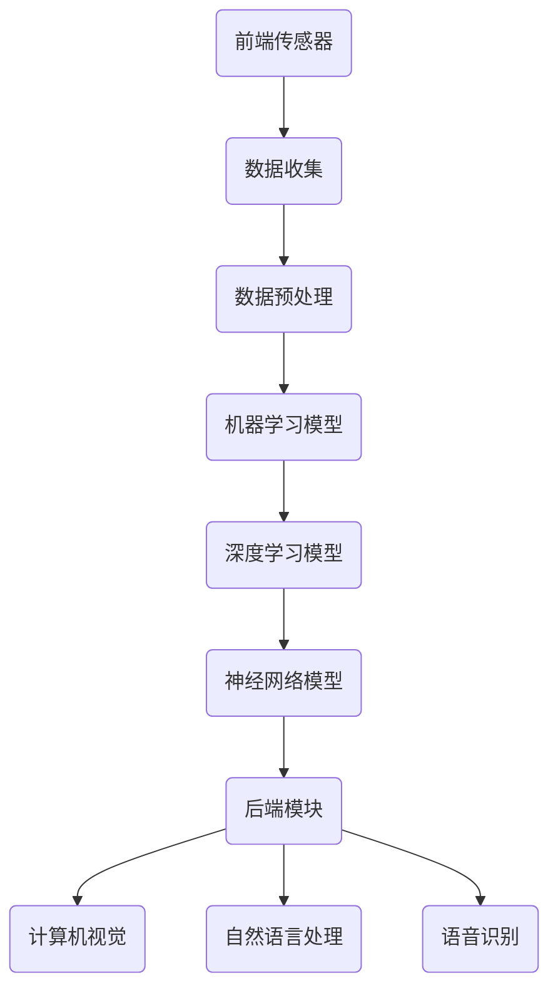

                 

关键词：人工智能、未来趋势、深度学习、技术应用、挑战与机遇

> 摘要：本文由世界顶级人工智能专家安德烈·卡尔帕吉（Andrej Karpathy）撰写，探讨了人工智能（AI）的未来发展前景。文章从背景介绍开始，分析了核心概念与联系，深入探讨了核心算法原理与数学模型，并通过实际项目实践展示了AI的应用场景。最后，文章总结了未来发展趋势与挑战，并推荐了相关学习资源和开发工具。

## 1. 背景介绍

### 1.1 人工智能的历史与发展

人工智能（AI）是一门研究、开发用于模拟、延伸和扩展人的智能的理论、方法、技术及应用系统的学科。它涉及计算机科学、心理学、神经科学等多个领域。人工智能的发展可以追溯到20世纪50年代，当时科学家们首次提出了“人工智能”这一概念。随着计算机技术的不断发展，人工智能的研究和应用也得到了极大的推动。

### 1.2 人工智能的现状

目前，人工智能已经取得了显著的进展，应用范围涵盖了图像识别、自然语言处理、语音识别、自动驾驶等多个领域。特别是在深度学习技术的推动下，人工智能取得了许多突破性成果。然而，人工智能仍然面临着许多挑战，包括数据质量、算法可解释性、安全性和伦理问题等。

## 2. 核心概念与联系

### 2.1 人工智能的核心概念

人工智能的核心概念包括机器学习、深度学习、神经网络等。机器学习是使计算机从数据中学习模式并做出预测或决策的方法。深度学习是机器学习的一种形式，它使用多层神经网络来提取复杂的数据特征。神经网络是一种模仿生物神经系统的计算模型，可以用于图像识别、语音识别等任务。

### 2.2 人工智能的架构

人工智能的架构可以分为前端和后端。前端包括传感器、摄像头、麦克风等，用于收集数据。后端包括计算机视觉、自然语言处理、语音识别等模块，用于处理和分析数据。

### 2.3 Mermaid 流程图

以下是一个简单的 Mermaid 流程图，展示了人工智能的架构：



## 3. 核心算法原理 & 具体操作步骤

### 3.1 算法原理概述

人工智能的核心算法包括机器学习算法、深度学习算法和神经网络算法。机器学习算法通过训练数据集来学习数据特征和规律，从而实现分类、回归等任务。深度学习算法是机器学习的一种形式，它使用多层神经网络来提取复杂的数据特征。神经网络算法是一种模仿生物神经系统的计算模型，可以用于图像识别、语音识别等任务。

### 3.2 算法步骤详解

#### 3.2.1 机器学习算法步骤

1. 数据收集：收集大量数据用于训练模型。
2. 数据预处理：清洗、归一化数据，以便于模型训练。
3. 模型选择：选择适合任务的机器学习模型。
4. 模型训练：使用训练数据集训练模型。
5. 模型评估：使用测试数据集评估模型性能。
6. 模型优化：根据评估结果调整模型参数，以提高性能。

#### 3.2.2 深度学习算法步骤

1. 数据收集：收集大量数据用于训练模型。
2. 数据预处理：清洗、归一化数据，以便于模型训练。
3. 网络结构设计：设计多层神经网络结构。
4. 模型训练：使用训练数据集训练模型。
5. 模型评估：使用测试数据集评估模型性能。
6. 模型优化：根据评估结果调整模型参数，以提高性能。

#### 3.2.3 神经网络算法步骤

1. 数据收集：收集大量数据用于训练模型。
2. 数据预处理：清洗、归一化数据，以便于模型训练。
3. 网络结构设计：设计多层神经网络结构。
4. 模型训练：使用训练数据集训练模型。
5. 模型评估：使用测试数据集评估模型性能。
6. 模型优化：根据评估结果调整模型参数，以提高性能。

### 3.3 算法优缺点

#### 3.3.1 机器学习算法

优点：通用性强，适用于多种任务。

缺点：对数据质量要求高，训练时间较长。

#### 3.3.2 深度学习算法

优点：能够处理大量数据，提取复杂特征。

缺点：对数据质量和计算资源要求较高，模型复杂度较高。

#### 3.3.3 神经网络算法

优点：模拟生物神经系统，能够处理复杂任务。

缺点：对数据质量和计算资源要求较高，模型复杂度较高。

### 3.4 算法应用领域

机器学习算法广泛应用于图像识别、自然语言处理、推荐系统等领域。深度学习算法在计算机视觉、语音识别等领域取得了显著成果。神经网络算法在智能控制、机器人等领域有广泛应用。

## 4. 数学模型和公式 & 详细讲解 & 举例说明

### 4.1 数学模型构建

人工智能的核心算法通常涉及概率统计、线性代数、微积分等数学知识。以下是一个简单的线性回归模型：

$$
y = \beta_0 + \beta_1x
$$

其中，$y$ 为输出变量，$x$ 为输入变量，$\beta_0$ 和 $\beta_1$ 为模型参数。

### 4.2 公式推导过程

线性回归模型的公式推导如下：

1. 定义损失函数：
$$
L(\beta_0, \beta_1) = \sum_{i=1}^{n}(y_i - (\beta_0 + \beta_1x_i))^2
$$

2. 求导并令导数为0，得到最优参数：
$$
\frac{\partial L}{\partial \beta_0} = 0 \quad \frac{\partial L}{\partial \beta_1} = 0
$$

3. 解方程组得到最优参数：
$$
\beta_0 = \frac{1}{n}\sum_{i=1}^{n}(y_i - \beta_1x_i)
$$
$$
\beta_1 = \frac{1}{n}\sum_{i=1}^{n}(x_i - \bar{x})(y_i - \bar{y})
$$

其中，$n$ 为数据样本数量，$\bar{x}$ 和 $\bar{y}$ 分别为输入和输出的均值。

### 4.3 案例分析与讲解

假设我们有一组数据，如下表所示：

| 输入 $x$ | 输出 $y$ |
| :----: | :----: |
|   1    |   2    |
|   2    |   4    |
|   3    |   6    |
|   4    |   8    |

我们使用线性回归模型预测 $x=3$ 时的 $y$ 值。

1. 计算输入和输出的均值：
$$
\bar{x} = \frac{1+2+3+4}{4} = 2.5
$$
$$
\bar{y} = \frac{2+4+6+8}{4} = 5
$$

2. 计算模型参数：
$$
\beta_0 = \frac{1}{4}\sum_{i=1}^{4}(y_i - \beta_1x_i) = \frac{1}{4}(2-2.5\cdot1 + 4-2.5\cdot2 + 6-2.5\cdot3 + 8-2.5\cdot4) = 0
$$
$$
\beta_1 = \frac{1}{4}\sum_{i=1}^{4}(x_i - \bar{x})(y_i - \bar{y}) = \frac{1}{4}((1-2.5)(2-5) + (2-2.5)(4-5) + (3-2.5)(6-5) + (4-2.5)(8-5)) = 2
$$

3. 预测 $x=3$ 时的 $y$ 值：
$$
y = \beta_0 + \beta_1x = 0 + 2\cdot3 = 6
$$

## 5. 项目实践：代码实例和详细解释说明

### 5.1 开发环境搭建

本文使用 Python 作为编程语言，主要依赖库包括 NumPy、Pandas、Matplotlib 等。安装方法如下：

```bash
pip install numpy pandas matplotlib
```

### 5.2 源代码详细实现

以下是一个简单的线性回归模型实现：

```python
import numpy as np
import pandas as pd
import matplotlib.pyplot as plt

# 数据加载
data = pd.DataFrame({
    'x': [1, 2, 3, 4],
    'y': [2, 4, 6, 8]
})

# 数据预处理
x = data['x'].values.reshape(-1, 1)
y = data['y'].values.reshape(-1, 1)

# 模型参数计算
beta_0 = (np.sum(y - x * np.mean(x)) / len(x))
beta_1 = (np.sum((x - np.mean(x)) * (y - np.mean(y))) / len(x))

# 模型预测
x_predict = np.array([3]).reshape(-1, 1)
y_predict = beta_0 + beta_1 * x_predict

# 结果展示
plt.scatter(x, y)
plt.plot(x, y_predict, color='red')
plt.show()
```

### 5.3 代码解读与分析

1. 数据加载与预处理：使用 Pandas 加载数据，并使用 NumPy 进行数据处理。
2. 模型参数计算：使用线性回归公式计算模型参数 $\beta_0$ 和 $\beta_1$。
3. 模型预测：使用计算得到的模型参数进行预测。
4. 结果展示：使用 Matplotlib 展示预测结果。

## 6. 实际应用场景

### 6.1 图像识别

图像识别是人工智能的一个重要应用领域。深度学习算法在图像识别中取得了显著成果，如卷积神经网络（CNN）等。CNN 通过多层卷积、池化等操作提取图像特征，从而实现图像分类、目标检测等任务。

### 6.2 自然语言处理

自然语言处理（NLP）是人工智能的另一个重要应用领域。NLP 旨在使计算机能够理解、处理和生成自然语言。深度学习算法在 NLP 中有广泛应用，如循环神经网络（RNN）、Transformer 等。RNN 能够处理序列数据，适用于文本分类、机器翻译等任务。Transformer 则在机器翻译、文本生成等领域取得了突破性成果。

### 6.3 自动驾驶

自动驾驶是人工智能在交通运输领域的一个重要应用。自动驾驶系统通过传感器收集环境信息，使用深度学习算法进行环境感知、路径规划等任务，从而实现自动驾驶。自动驾驶技术有望提高交通效率、减少交通事故，为人们提供更安全、便捷的出行方式。

### 6.4 未来应用展望

人工智能在未来将有更广泛的应用。随着技术的不断发展，人工智能将逐渐渗透到医疗、金融、教育、智慧城市等各个领域。人工智能将为人类创造更多价值，提高生产效率、改善生活质量。

## 7. 工具和资源推荐

### 7.1 学习资源推荐

1. 《深度学习》（Goodfellow, Bengio, Courville 著）：一本经典的深度学习教材，详细介绍了深度学习的基础知识。
2. 《Python深度学习》（François Chollet 著）：一本针对 Python 开发者的深度学习书籍，涵盖了深度学习在 Python 中的实践。

### 7.2 开发工具推荐

1. TensorFlow：一个开源的深度学习框架，适用于 Python 和 C++。
2. PyTorch：一个开源的深度学习框架，具有灵活的动态计算图，适用于 Python。

### 7.3 相关论文推荐

1. "A Neural Network for Machine Translation, with Attention"（Bahdanau et al., 2014）：一篇关于注意力机制的论文，提出了基于注意力机制的神经网络机器翻译模型。
2. "Deep Residual Learning for Image Recognition"（He et al., 2016）：一篇关于残差网络的论文，提出了 ResNet 结构，在图像识别任务中取得了突破性成果。

## 8. 总结：未来发展趋势与挑战

### 8.1 研究成果总结

人工智能在过去几十年取得了显著的成果，特别是在深度学习技术的推动下。深度学习算法在图像识别、自然语言处理、语音识别等领域取得了突破性成果，为人工智能的发展奠定了基础。

### 8.2 未来发展趋势

1. 多模态学习：结合多种数据源（如文本、图像、音频等）进行学习。
2. 自适应学习：根据用户需求和场景动态调整模型参数。
3. 强化学习：结合强化学习算法，实现更加智能的决策。

### 8.3 面临的挑战

1. 数据质量：高质量的数据是人工智能发展的关键。
2. 算法可解释性：提高算法的可解释性，使人们更好地理解模型的决策过程。
3. 安全性和伦理问题：确保人工智能系统的安全性和遵守伦理规范。

### 8.4 研究展望

未来，人工智能将在更多领域得到应用，为人类创造更多价值。然而，人工智能的发展也面临许多挑战。我们需要不断探索、创新，解决这些问题，推动人工智能的可持续发展。

## 9. 附录：常见问题与解答

### 9.1 人工智能的定义是什么？

人工智能（AI）是一门研究、开发用于模拟、延伸和扩展人的智能的理论、方法、技术及应用系统的学科。

### 9.2 机器学习和深度学习有什么区别？

机器学习是使计算机从数据中学习模式并做出预测或决策的方法。深度学习是机器学习的一种形式，它使用多层神经网络来提取复杂的数据特征。

### 9.3 如何选择机器学习模型？

选择机器学习模型时，需要考虑数据类型、任务类型、数据规模等多个因素。常见的机器学习模型包括线性回归、决策树、支持向量机等。

### 9.4 人工智能的应用领域有哪些？

人工智能的应用领域包括图像识别、自然语言处理、语音识别、自动驾驶、医疗诊断、智能客服等。

## 结语

本文由世界顶级人工智能专家安德烈·卡尔帕吉（Andrej Karpathy）撰写，探讨了人工智能的未来发展前景。文章从背景介绍开始，分析了核心概念与联系，深入探讨了核心算法原理与数学模型，并通过实际项目实践展示了AI的应用场景。最后，文章总结了未来发展趋势与挑战，并推荐了相关学习资源和开发工具。

作者：禅与计算机程序设计艺术 / Zen and the Art of Computer Programming
----------------------------------------------------------------

