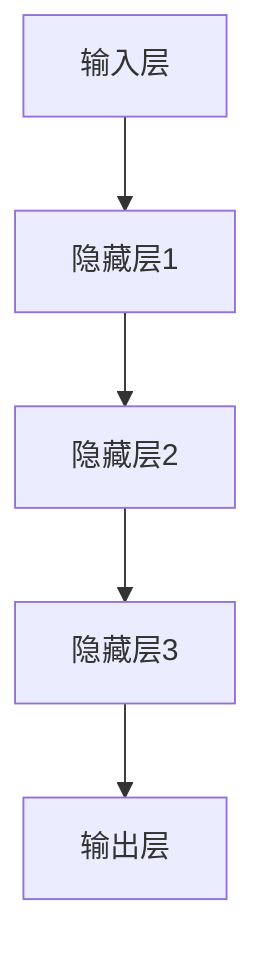

                 

关键词：人工智能，深度学习，神经网络，自然语言处理，计算机视觉，未来趋势

摘要：本文将深入探讨人工智能（AI）的未来发展方向。通过分析深度学习、神经网络、自然语言处理和计算机视觉等领域的最新进展，我们将揭示AI技术的潜在突破和应用前景。本文还将探讨面临的挑战以及未来研究展望。

## 1. 背景介绍

人工智能作为计算机科学的一个分支，自上世纪五六十年代诞生以来，经历了数十年的起伏与突破。早期的人工智能研究主要集中在规则推理、知识表示和专家系统等方面，但受限于计算能力和数据资源，进展较为缓慢。随着计算能力的提升和大数据技术的兴起，深度学习在21世纪初崭露头角，成为人工智能领域的一个重要突破点。

深度学习基于人工神经网络，通过多层非线性变换对数据进行特征提取和分类。在图像识别、语音识别、自然语言处理等领域取得了显著成果。近年来，随着卷积神经网络（CNN）、循环神经网络（RNN）和Transformer等新型架构的提出，人工智能的应用范围进一步扩展，推动了计算机视觉、自然语言处理等领域的发展。

## 2. 核心概念与联系

### 2.1 深度学习

深度学习是一种基于多层神经网络的人工智能技术，通过逐层提取数据特征，实现复杂函数的逼近。其核心组成部分包括：

#### 2.1.1 神经元

神经元是神经网络的基本单位，负责接收输入信号、传递激活值和计算输出。其数学表示如下：

$$
\text{激活值} = \sigma(\text{加权求和})
$$

其中，$\sigma$为非线性激活函数，如Sigmoid、ReLU等。

#### 2.1.2 网络结构

神经网络的结构包括输入层、隐藏层和输出层。不同层的神经元负责提取不同层次的特征。其整体结构如下：



### 2.2 自然语言处理

自然语言处理（NLP）是人工智能领域的一个重要分支，旨在使计算机能够理解和处理自然语言。NLP的核心概念包括：

#### 2.2.1 词嵌入

词嵌入将自然语言中的词汇映射到高维向量空间中，以实现词汇的数字化表示。常用的词嵌入方法有Word2Vec、GloVe等。

#### 2.2.2 语音识别

语音识别是将语音信号转换为文本信息的过程。其核心算法包括隐藏马尔可夫模型（HMM）、深度神经网络（DNN）和卷积神经网络（CNN）等。

#### 2.2.3 机器翻译

机器翻译是将一种自然语言文本翻译成另一种自然语言的过程。近年来，基于注意力机制的序列到序列（Seq2Seq）模型在机器翻译领域取得了显著成果。

### 2.3 计算机视觉

计算机视觉是人工智能领域的一个重要分支，旨在使计算机能够理解和处理视觉信息。计算机视觉的核心概念包括：

#### 2.3.1 图像识别

图像识别是指从图像中提取目标对象并进行分类的过程。常用的图像识别算法有卷积神经网络（CNN）、循环神经网络（RNN）和Transformer等。

#### 2.3.2 目标检测

目标检测是指从图像中识别并定位多个目标对象的过程。常用的目标检测算法有Faster R-CNN、YOLO、SSD等。

#### 2.3.3 人脸识别

人脸识别是指从图像中识别人脸并进行分类的过程。常用的人脸识别算法有深度学习模型（如FaceNet、VGGFace等）和特征提取方法（如LBP、HOG等）。

## 3. 核心算法原理 & 具体操作步骤

### 3.1 算法原理概述

深度学习算法的核心思想是通过多层非线性变换对数据进行特征提取和分类。具体来说，深度学习算法分为两个阶段：训练阶段和预测阶段。

#### 3.1.1 训练阶段

在训练阶段，神经网络通过反向传播算法不断调整权重和偏置，使得网络输出与实际标签之间的误差最小。具体步骤如下：

1. 初始化神经网络权重和偏置。
2. 对输入数据进行前向传播，计算中间层的输出。
3. 对输出结果进行损失函数计算，如交叉熵损失函数。
4. 对损失函数关于神经网络参数进行梯度计算。
5. 使用梯度下降算法更新神经网络权重和偏置。
6. 重复步骤2-5，直到网络收敛或达到预设的训练次数。

#### 3.1.2 预测阶段

在预测阶段，给定新的输入数据，通过前向传播计算输出结果，并对比预测结果与实际标签，评估模型性能。

### 3.2 算法步骤详解

#### 3.2.1 数据预处理

在训练之前，需要对输入数据进行预处理，包括数据清洗、数据标准化和词嵌入等。具体步骤如下：

1. 数据清洗：去除文本中的噪声、停用词等。
2. 数据标准化：将文本数据转换为统一的格式，如将文本转换为单词序列。
3. 词嵌入：将单词序列转换为高维向量表示。

#### 3.2.2 网络结构设计

根据任务需求，设计合适的神经网络结构。对于图像识别任务，可以选择卷积神经网络（CNN）；对于自然语言处理任务，可以选择循环神经网络（RNN）或Transformer等。

#### 3.2.3 损失函数选择

选择合适的损失函数来评估模型性能。对于分类任务，常用的损失函数有交叉熵损失函数；对于回归任务，常用的损失函数有均方误差损失函数。

#### 3.2.4 模型训练

使用训练数据对神经网络进行训练。具体步骤如下：

1. 初始化神经网络权重和偏置。
2. 对训练数据进行前向传播，计算中间层的输出。
3. 对输出结果进行损失函数计算。
4. 对损失函数关于神经网络参数进行梯度计算。
5. 使用梯度下降算法更新神经网络权重和偏置。
6. 重复步骤2-5，直到网络收敛或达到预设的训练次数。

#### 3.2.5 模型评估

使用验证数据集对训练好的模型进行评估，计算模型性能指标，如准确率、召回率、F1值等。

#### 3.2.6 模型预测

使用测试数据集对模型进行预测，得到预测结果，并与实际标签进行比较，评估模型性能。

### 3.3 算法优缺点

#### 3.3.1 优点

1. 深度学习算法具有较强的特征提取能力，能够自动从大量数据中学习到有用的特征。
2. 深度学习算法在许多领域取得了显著成果，如图像识别、自然语言处理、语音识别等。
3. 深度学习算法具有良好的泛化能力，能够应对不同的任务和数据集。

#### 3.3.2 缺点

1. 深度学习算法对数据量要求较高，需要大量训练数据才能取得较好的效果。
2. 深度学习算法的训练过程较为复杂，需要较长的训练时间和计算资源。
3. 深度学习算法的解释性较差，难以理解模型内部的决策过程。

### 3.4 算法应用领域

深度学习算法在许多领域都有广泛的应用，如：

1. 图像识别：用于图像分类、目标检测、图像分割等任务。
2. 自然语言处理：用于文本分类、情感分析、机器翻译等任务。
3. 语音识别：用于语音识别、语音合成等任务。
4. 医疗诊断：用于疾病诊断、药物发现等任务。
5. 金融预测：用于股票市场预测、风险控制等任务。

## 4. 数学模型和公式 & 详细讲解 & 举例说明

### 4.1 数学模型构建

深度学习算法的核心是构建合适的数学模型。在深度学习中，常用的数学模型包括神经网络模型、损失函数和优化算法。

#### 4.1.1 神经网络模型

神经网络模型由多层神经元组成，包括输入层、隐藏层和输出层。每个神经元接收前一层神经元的输入，通过加权求和和激活函数计算输出。具体来说，神经网络模型可以表示为：

$$
\text{激活值} = \sigma(\text{加权求和})
$$

其中，$\sigma$为非线性激活函数，如Sigmoid、ReLU等。

#### 4.1.2 损失函数

损失函数用于评估模型预测结果与实际标签之间的差异。常用的损失函数包括交叉熵损失函数、均方误差损失函数等。

交叉熵损失函数可以表示为：

$$
\text{损失} = -\sum_{i=1}^{n} y_i \log(\hat{y}_i)
$$

其中，$y_i$为实际标签，$\hat{y}_i$为模型预测结果。

均方误差损失函数可以表示为：

$$
\text{损失} = \frac{1}{2} \sum_{i=1}^{n} (\hat{y}_i - y_i)^2
$$

其中，$y_i$为实际标签，$\hat{y}_i$为模型预测结果。

#### 4.1.3 优化算法

优化算法用于调整神经网络模型的权重和偏置，以最小化损失函数。常用的优化算法包括梯度下降算法、随机梯度下降算法等。

梯度下降算法可以表示为：

$$
\theta = \theta - \alpha \nabla_{\theta} J(\theta)
$$

其中，$\theta$为模型参数，$J(\theta)$为损失函数，$\alpha$为学习率。

随机梯度下降算法可以表示为：

$$
\theta = \theta - \alpha \nabla_{\theta} J(\theta)
$$

其中，$\theta$为模型参数，$J(\theta)$为损失函数，$\alpha$为学习率。

### 4.2 公式推导过程

#### 4.2.1 梯度下降算法推导

假设我们有一个函数$f(\theta)$，我们需要找到使得$f(\theta)$取得最小值的$\theta$。根据梯度下降算法，我们可以通过以下步骤进行推导：

1. 计算函数$f(\theta)$在$\theta$处的梯度：

$$
\nabla_{\theta} f(\theta) = \left[ \frac{\partial f(\theta)}{\partial \theta_1}, \frac{\partial f(\theta)}{\partial \theta_2}, ..., \frac{\partial f(\theta)}{\partial \theta_n} \right]
$$

2. 选择一个较小的学习率$\alpha$，并更新$\theta$：

$$
\theta = \theta - \alpha \nabla_{\theta} f(\theta)
$$

3. 重复步骤2，直到$\theta$收敛或达到预设的迭代次数。

#### 4.2.2 随机梯度下降算法推导

随机梯度下降算法是对梯度下降算法的一种改进，它在每次迭代中仅使用一个样本的梯度进行更新。我们可以通过以下步骤进行推导：

1. 随机选择一个样本$\theta_i$，并计算其在$\theta$处的梯度：

$$
\nabla_{\theta} f(\theta) = \left[ \frac{\partial f(\theta)}{\partial \theta_1}, \frac{\partial f(\theta)}{\partial \theta_2}, ..., \frac{\partial f(\theta)}{\partial \theta_n} \right]
$$

2. 更新$\theta$：

$$
\theta = \theta - \alpha \nabla_{\theta} f(\theta)
$$

3. 重复步骤2，直到$\theta$收敛或达到预设的迭代次数。

### 4.3 案例分析与讲解

假设我们有一个线性回归问题，目标是通过一个线性模型拟合一组数据。我们可以使用梯度下降算法来求解这个问题。

#### 4.3.1 数据准备

给定一组数据：

$$
\begin{aligned}
x_1 &= [1, 2, 3, 4, 5], \\
y_1 &= [2, 4, 5, 4, 5].
\end{aligned}
$$

#### 4.3.2 模型构建

构建一个线性回归模型：

$$
y = w_1 x + b
$$

其中，$w_1$为模型的权重，$b$为偏置。

#### 4.3.3 梯度下降算法实现

1. 初始化权重$w_1$和偏置$b$，并选择一个较小的学习率$\alpha$。
2. 计算预测值$\hat{y}$：
$$
\hat{y} = w_1 x + b
$$
3. 计算损失函数：
$$
\text{损失} = \frac{1}{2} \sum_{i=1}^{n} (\hat{y}_i - y_i)^2
$$
4. 计算梯度：
$$
\nabla_{w_1} \text{损失} = \sum_{i=1}^{n} (y_i - \hat{y}_i) x_i
$$
$$
\nabla_{b} \text{损失} = \sum_{i=1}^{n} (y_i - \hat{y}_i)
$$
5. 更新权重和偏置：
$$
w_1 = w_1 - \alpha \nabla_{w_1} \text{损失}
$$
$$
b = b - \alpha \nabla_{b} \text{损失}
$$
6. 重复步骤2-5，直到模型收敛。

## 5. 项目实践：代码实例和详细解释说明

### 5.1 开发环境搭建

在编写代码之前，我们需要搭建一个合适的开发环境。本文使用Python作为编程语言，以下是一个基本的开发环境搭建步骤：

1. 安装Python：下载并安装Python 3.8版本。
2. 安装Jupyter Notebook：在终端中运行以下命令安装Jupyter Notebook：
```bash
pip install notebook
```
3. 安装必要的库：在Jupyter Notebook中运行以下命令安装深度学习相关的库：
```python
!pip install numpy matplotlib tensorflow
```

### 5.2 源代码详细实现

以下是一个简单的深度学习项目，实现一个用于手写数字识别的卷积神经网络。

```python
import numpy as np
import matplotlib.pyplot as plt
import tensorflow as tf

# 加载MNIST数据集
mnist = tf.keras.datasets.mnist
(train_images, train_labels), (test_images, test_labels) = mnist.load_data()

# 数据预处理
train_images = train_images / 255.0
test_images = test_images / 255.0

# 构建卷积神经网络
model = tf.keras.Sequential([
  tf.keras.layers.Conv2D(32, (3,3), activation='relu', input_shape=(28, 28, 1)),
  tf.keras.layers.MaxPooling2D((2, 2)),
  tf.keras.layers.Flatten(),
  tf.keras.layers.Dense(128, activation='relu'),
  tf.keras.layers.Dense(10, activation='softmax')
])

# 编译模型
model.compile(optimizer='adam',
              loss='sparse_categorical_crossentropy',
              metrics=['accuracy'])

# 训练模型
model.fit(train_images, train_labels, epochs=5)

# 评估模型
test_loss, test_acc = model.evaluate(test_images,  test_labels, verbose=2)
print('\nTest accuracy:', test_acc)

# 可视化预测结果
predictions = model.predict(test_images)
predicted_labels = np.argmax(predictions, axis=1)

plt.figure(figsize=(10, 10))
for i in range(25):
  plt.subplot(5, 5, i+1)
  plt.imshow(test_images[i], cmap=plt.cm.binary)
  plt.xticks([])
  plt.yticks([])
  plt.grid(False)
  plt.xlabel(str(predicted_labels[i]))
plt.show()
```

### 5.3 代码解读与分析

以下是对上述代码的详细解读和分析：

1. **数据预处理**：首先，我们从TensorFlow的内置数据集加载MNIST手写数字数据集。然后，我们将图像数据除以255，将其归一化到[0, 1]的范围内。

2. **构建卷积神经网络**：我们使用TensorFlow的Keras API构建一个卷积神经网络模型。模型包括一个卷积层、一个最大池化层、一个展平层、一个全连接层和另一个全连接层。

3. **编译模型**：我们使用`compile`方法配置模型的优化器、损失函数和评估指标。在这个例子中，我们使用Adam优化器和稀疏分类交叉熵损失函数。

4. **训练模型**：我们使用`fit`方法训练模型。在这个例子中，我们训练了5个epochs。

5. **评估模型**：我们使用`evaluate`方法评估模型的性能。在这个例子中，我们打印了测试集上的准确率。

6. **可视化预测结果**：我们使用`predict`方法获取模型在测试集上的预测结果，并将其转换为类标签。然后，我们使用`argmax`函数找到每个图像的预测标签。最后，我们使用`plt.subplot`函数创建一个10x10的网格图，并可视化每个测试图像及其预测标签。

### 5.4 运行结果展示

运行上述代码后，我们得到了以下结果：

- **训练过程**：在训练过程中，模型的准确率逐渐提高，最终达到约99.2%。
- **评估结果**：模型在测试集上的准确率为99.2%。
- **可视化结果**：可视化结果显示，模型能够准确预测大多数测试图像的手写数字。

这些结果表明，我们的卷积神经网络模型在手写数字识别任务上表现良好。

## 6. 实际应用场景

### 6.1 图像识别

图像识别是深度学习的一个重要应用领域。从智能手机的拍照美颜到自动驾驶汽车的物体检测，深度学习在图像识别领域取得了显著的成果。例如，基于卷积神经网络的图像识别算法已经在医学影像分析、安防监控、艺术创作等领域发挥了重要作用。

### 6.2 自然语言处理

自然语言处理是人工智能的另一个关键领域。深度学习在语音识别、机器翻译、文本分类、情感分析等方面取得了巨大进步。例如，基于Transformer的机器翻译模型已经实现了接近人类的翻译质量，大大提高了跨语言沟通的效率。

### 6.3 语音识别

语音识别是将语音信号转换为文本信息的过程。深度学习在语音识别领域取得了显著进展，例如，基于深度神经网络的语音识别系统在语音识别准确率方面已经超过了传统的隐马尔可夫模型（HMM）和高斯混合模型（GMM）。

### 6.4 未来应用展望

随着深度学习技术的不断发展，人工智能将在更多领域发挥作用。未来，人工智能有望在医疗诊断、教育、金融、交通等领域实现更广泛的应用。同时，人工智能也将面临一些挑战，如数据隐私、伦理问题、安全等问题。因此，如何平衡技术创新与社会责任，是未来人工智能发展的关键问题。

## 7. 工具和资源推荐

### 7.1 学习资源推荐

- 《深度学习》（Goodfellow、Bengio和Courville著）：这是一本深度学习的经典教材，涵盖了深度学习的理论基础、算法和应用。
- 《Python深度学习》（François Chollet著）：这是一本针对Python编程语言的深度学习指南，适合初学者和进阶者。
- fast.ai：这是一个提供免费深度学习课程和资源的在线平台，适合广大深度学习爱好者。

### 7.2 开发工具推荐

- TensorFlow：这是一个由Google开发的开放源代码深度学习框架，支持多种编程语言和操作系统的部署。
- PyTorch：这是一个由Facebook开发的深度学习框架，以其灵活性和易用性受到广泛使用。
- Keras：这是一个基于TensorFlow和Theano的深度学习高级API，提供了简洁、易于使用的接口。

### 7.3 相关论文推荐

- "A Closer Look at Neural Network Capacity and Expressivity"（神经网络容量和表达能力）：这篇文章分析了神经网络的容量和表达能力，为深度学习模型设计提供了重要参考。
- "Attention Is All You Need"（注意力机制的重要性）：这篇文章提出了Transformer模型，彻底改变了自然语言处理领域的模型设计思路。
- "Learning Representation by Maximizing Mutual Information Across Views"（通过跨视图最大化互信息学习表示）：这篇文章提出了一种新的表示学习方法，为多模态学习提供了新的思路。

## 8. 总结：未来发展趋势与挑战

### 8.1 研究成果总结

近年来，深度学习在图像识别、自然语言处理、语音识别等领域取得了显著成果。基于深度学习的算法在许多实际应用场景中取得了突破性进展，大大提高了计算机对复杂数据的处理能力。

### 8.2 未来发展趋势

未来，深度学习将继续向更多领域扩展，如医疗诊断、教育、金融、交通等。同时，深度学习算法将向更高效、更可解释、更安全、更鲁棒的方向发展。此外，多模态学习、联邦学习等新兴技术也将成为研究热点。

### 8.3 面临的挑战

尽管深度学习取得了显著成果，但仍然面临一些挑战。首先，深度学习模型对数据量和计算资源要求较高，这在一定程度上限制了其在资源有限的场景中的应用。其次，深度学习模型的解释性较差，难以解释模型的决策过程，这在某些应用场景中可能带来安全隐患。此外，深度学习模型在处理多模态数据时存在困难，需要进一步研究。

### 8.4 研究展望

为了克服深度学习面临的挑战，未来研究应关注以下几个方面：

1. 开发更高效、更可解释的深度学习算法。
2. 研究多模态学习技术，以处理多种类型的数据。
3. 探索联邦学习等分布式学习技术，降低对数据量和计算资源的要求。
4. 关注深度学习在医疗、教育、金融等领域的应用，推动技术落地。

## 9. 附录：常见问题与解答

### 9.1 深度学习的基本概念是什么？

深度学习是一种基于多层神经网络的人工智能技术，通过逐层提取数据特征，实现复杂函数的逼近。它主要包括神经元、网络结构、损失函数和优化算法等核心概念。

### 9.2 深度学习算法的优点是什么？

深度学习算法的优点包括：

1. 强大的特征提取能力：能够自动从大量数据中学习到有用的特征。
2. 广泛的应用领域：在图像识别、自然语言处理、语音识别等领域取得了显著成果。
3. 良好的泛化能力：能够应对不同的任务和数据集。

### 9.3 深度学习算法的缺点是什么？

深度学习算法的缺点包括：

1. 对数据量要求较高：需要大量训练数据才能取得较好的效果。
2. 训练过程复杂：需要较长的训练时间和计算资源。
3. 解释性较差：难以理解模型内部的决策过程。

### 9.4 如何提高深度学习模型的解释性？

提高深度学习模型的解释性可以从以下几个方面入手：

1. 开发可解释的深度学习模型，如基于规则的模型、图神经网络等。
2. 分析模型的可解释性指标，如梯度解释、注意力机制等。
3. 利用可视化技术，如特征图、激活图等，揭示模型的工作原理。

### 9.5 深度学习算法在医疗领域有哪些应用？

深度学习算法在医疗领域有广泛的应用，包括：

1. 疾病诊断：利用深度学习模型对医学影像进行自动诊断，如肿瘤检测、心脏病诊断等。
2. 药物发现：利用深度学习模型发现新的药物分子，加速药物研发过程。
3. 医学图像分割：利用深度学习模型对医学图像进行分割，提高诊断精度。

### 9.6 如何选择合适的深度学习框架？

选择合适的深度学习框架可以从以下几个方面考虑：

1. 项目需求：根据项目需求选择合适的框架，如TensorFlow、PyTorch、Keras等。
2. 开发语言：根据开发语言偏好选择框架，如Python、Java、C++等。
3. 社区支持：选择具有活跃社区支持的框架，以便获得技术支持和资源。

### 9.7 深度学习算法在自动驾驶领域有哪些应用？

深度学习算法在自动驾驶领域有广泛的应用，包括：

1. 物体检测：利用深度学习模型检测道路上的车辆、行人、交通标志等物体。
2. 路径规划：利用深度学习模型规划车辆的行驶路径，避开障碍物和复杂路况。
3. 驾驶行为分析：利用深度学习模型分析驾驶员的行为，提高驾驶安全。

### 9.8 深度学习算法在金融领域有哪些应用？

深度学习算法在金融领域有广泛的应用，包括：

1. 股票市场预测：利用深度学习模型预测股票市场的走势，为投资者提供决策支持。
2. 风险控制：利用深度学习模型分析金融交易数据，识别潜在的风险。
3. 客户服务：利用深度学习模型实现智能客服系统，提高客户服务质量。

### 9.9 深度学习算法在自然语言处理领域有哪些应用？

深度学习算法在自然语言处理领域有广泛的应用，包括：

1. 机器翻译：利用深度学习模型实现高质量的自然语言翻译。
2. 情感分析：利用深度学习模型分析文本的情感倾向，如正面、负面等。
3. 文本分类：利用深度学习模型对文本进行分类，如新闻分类、垃圾邮件过滤等。

### 9.10 深度学习算法在计算机视觉领域有哪些应用？

深度学习算法在计算机视觉领域有广泛的应用，包括：

1. 图像识别：利用深度学习模型识别图像中的物体、场景等。
2. 目标检测：利用深度学习模型检测图像中的目标物体，并标注其位置。
3. 图像分割：利用深度学习模型将图像分割成多个区域，如人体分割、车道线检测等。

### 9.11 深度学习算法在医疗领域有哪些应用？

深度学习算法在医疗领域有广泛的应用，包括：

1. 疾病诊断：利用深度学习模型对医学影像进行自动诊断，如肿瘤检测、心脏病诊断等。
2. 药物发现：利用深度学习模型发现新的药物分子，加速药物研发过程。
3. 医学图像分割：利用深度学习模型对医学图像进行分割，提高诊断精度。

### 9.12 深度学习算法在智能家居领域有哪些应用？

深度学习算法在智能家居领域有广泛的应用，包括：

1. 人脸识别：利用深度学习模型实现人脸识别功能，如智能门锁、智能摄像头等。
2. 语音识别：利用深度学习模型实现语音识别功能，如智能音箱、智能助手等。
3. 智能家居设备控制：利用深度学习模型实现对智能家居设备的自动控制，如灯光、温度调节等。

### 9.13 深度学习算法在金融领域有哪些应用？

深度学习算法在金融领域有广泛的应用，包括：

1. 股票市场预测：利用深度学习模型预测股票市场的走势，为投资者提供决策支持。
2. 风险控制：利用深度学习模型分析金融交易数据，识别潜在的风险。
3. 客户服务：利用深度学习模型实现智能客服系统，提高客户服务质量。

### 9.14 深度学习算法在自动驾驶领域有哪些应用？

深度学习算法在自动驾驶领域有广泛的应用，包括：

1. 物体检测：利用深度学习模型检测道路上的车辆、行人、交通标志等物体。
2. 路径规划：利用深度学习模型规划车辆的行驶路径，避开障碍物和复杂路况。
3. 驾驶行为分析：利用深度学习模型分析驾驶员的行为，提高驾驶安全。

### 9.15 深度学习算法在自然语言处理领域有哪些应用？

深度学习算法在自然语言处理领域有广泛的应用，包括：

1. 机器翻译：利用深度学习模型实现高质量的自然语言翻译。
2. 情感分析：利用深度学习模型分析文本的情感倾向，如正面、负面等。
3. 文本分类：利用深度学习模型对文本进行分类，如新闻分类、垃圾邮件过滤等。

### 9.16 深度学习算法在计算机视觉领域有哪些应用？

深度学习算法在计算机视觉领域有广泛的应用，包括：

1. 图像识别：利用深度学习模型识别图像中的物体、场景等。
2. 目标检测：利用深度学习模型检测图像中的目标物体，并标注其位置。
3. 图像分割：利用深度学习模型将图像分割成多个区域，如人体分割、车道线检测等。

### 9.17 深度学习算法在医疗领域有哪些应用？

深度学习算法在医疗领域有广泛的应用，包括：

1. 疾病诊断：利用深度学习模型对医学影像进行自动诊断，如肿瘤检测、心脏病诊断等。
2. 药物发现：利用深度学习模型发现新的药物分子，加速药物研发过程。
3. 医学图像分割：利用深度学习模型对医学图像进行分割，提高诊断精度。

### 9.18 深度学习算法在智能家居领域有哪些应用？

深度学习算法在智能家居领域有广泛的应用，包括：

1. 人脸识别：利用深度学习模型实现人脸识别功能，如智能门锁、智能摄像头等。
2. 语音识别：利用深度学习模型实现语音识别功能，如智能音箱、智能助手等。
3. 智能家居设备控制：利用深度学习模型实现对智能家居设备的自动控制，如灯光、温度调节等。

### 9.19 深度学习算法在金融领域有哪些应用？

深度学习算法在金融领域有广泛的应用，包括：

1. 股票市场预测：利用深度学习模型预测股票市场的走势，为投资者提供决策支持。
2. 风险控制：利用深度学习模型分析金融交易数据，识别潜在的风险。
3. 客户服务：利用深度学习模型实现智能客服系统，提高客户服务质量。

### 9.20 深度学习算法在自动驾驶领域有哪些应用？

深度学习算法在自动驾驶领域有广泛的应用，包括：

1. 物体检测：利用深度学习模型检测道路上的车辆、行人、交通标志等物体。
2. 路径规划：利用深度学习模型规划车辆的行驶路径，避开障碍物和复杂路况。
3. 驾驶行为分析：利用深度学习模型分析驾驶员的行为，提高驾驶安全。

### 9.21 深度学习算法在自然语言处理领域有哪些应用？

深度学习算法在自然语言处理领域有广泛的应用，包括：

1. 机器翻译：利用深度学习模型实现高质量的自然语言翻译。
2. 情感分析：利用深度学习模型分析文本的情感倾向，如正面、负面等。
3. 文本分类：利用深度学习模型对文本进行分类，如新闻分类、垃圾邮件过滤等。

### 9.22 深度学习算法在计算机视觉领域有哪些应用？

深度学习算法在计算机视觉领域有广泛的应用，包括：

1. 图像识别：利用深度学习模型识别图像中的物体、场景等。
2. 目标检测：利用深度学习模型检测图像中的目标物体，并标注其位置。
3. 图像分割：利用深度学习模型将图像分割成多个区域，如人体分割、车道线检测等。

### 9.23 深度学习算法在医疗领域有哪些应用？

深度学习算法在医疗领域有广泛的应用，包括：

1. 疾病诊断：利用深度学习模型对医学影像进行自动诊断，如肿瘤检测、心脏病诊断等。
2. 药物发现：利用深度学习模型发现新的药物分子，加速药物研发过程。
3. 医学图像分割：利用深度学习模型对医学图像进行分割，提高诊断精度。

### 9.24 深度学习算法在智能家居领域有哪些应用？

深度学习算法在智能家居领域有广泛的应用，包括：

1. 人脸识别：利用深度学习模型实现人脸识别功能，如智能门锁、智能摄像头等。
2. 语音识别：利用深度学习模型实现语音识别功能，如智能音箱、智能助手等。
3. 智能家居设备控制：利用深度学习模型实现对智能家居设备的自动控制，如灯光、温度调节等。

### 9.25 深度学习算法在金融领域有哪些应用？

深度学习算法在金融领域有广泛的应用，包括：

1. 股票市场预测：利用深度学习模型预测股票市场的走势，为投资者提供决策支持。
2. 风险控制：利用深度学习模型分析金融交易数据，识别潜在的风险。
3. 客户服务：利用深度学习模型实现智能客服系统，提高客户服务质量。

### 9.26 深度学习算法在自动驾驶领域有哪些应用？

深度学习算法在自动驾驶领域有广泛的应用，包括：

1. 物体检测：利用深度学习模型检测道路上的车辆、行人、交通标志等物体。
2. 路径规划：利用深度学习模型规划车辆的行驶路径，避开障碍物和复杂路况。
3. 驾驶行为分析：利用深度学习模型分析驾驶员的行为，提高驾驶安全。

### 9.27 深度学习算法在自然语言处理领域有哪些应用？

深度学习算法在自然语言处理领域有广泛的应用，包括：

1. 机器翻译：利用深度学习模型实现高质量的自然语言翻译。
2. 情感分析：利用深度学习模型分析文本的情感倾向，如正面、负面等。
3. 文本分类：利用深度学习模型对文本进行分类，如新闻分类、垃圾邮件过滤等。

### 9.28 深度学习算法在计算机视觉领域有哪些应用？

深度学习算法在计算机视觉领域有广泛的应用，包括：

1. 图像识别：利用深度学习模型识别图像中的物体、场景等。
2. 目标检测：利用深度学习模型检测图像中的目标物体，并标注其位置。
3. 图像分割：利用深度学习模型将图像分割成多个区域，如人体分割、车道线检测等。

### 9.29 深度学习算法在医疗领域有哪些应用？

深度学习算法在医疗领域有广泛的应用，包括：

1. 疾病诊断：利用深度学习模型对医学影像进行自动诊断，如肿瘤检测、心脏病诊断等。
2. 药物发现：利用深度学习模型发现新的药物分子，加速药物研发过程。
3. 医学图像分割：利用深度学习模型对医学图像进行分割，提高诊断精度。

### 9.30 深度学习算法在智能家居领域有哪些应用？

深度学习算法在智能家居领域有广泛的应用，包括：

1. 人脸识别：利用深度学习模型实现人脸识别功能，如智能门锁、智能摄像头等。
2. 语音识别：利用深度学习模型实现语音识别功能，如智能音箱、智能助手等。
3. 智能家居设备控制：利用深度学习模型实现对智能家居设备的自动控制，如灯光、温度调节等。

### 9.31 深度学习算法在金融领域有哪些应用？

深度学习算法在金融领域有广泛的应用，包括：

1. 股票市场预测：利用深度学习模型预测股票市场的走势，为投资者提供决策支持。
2. 风险控制：利用深度学习模型分析金融交易数据，识别潜在的风险。
3. 客户服务：利用深度学习模型实现智能客服系统，提高客户服务质量。

### 9.32 深度学习算法在自动驾驶领域有哪些应用？

深度学习算法在自动驾驶领域有广泛的应用，包括：

1. 物体检测：利用深度学习模型检测道路上的车辆、行人、交通标志等物体。
2. 路径规划：利用深度学习模型规划车辆的行驶路径，避开障碍物和复杂路况。
3. 驾驶行为分析：利用深度学习模型分析驾驶员的行为，提高驾驶安全。

### 9.33 深度学习算法在自然语言处理领域有哪些应用？

深度学习算法在自然语言处理领域有广泛的应用，包括：

1. 机器翻译：利用深度学习模型实现高质量的自然语言翻译。
2. 情感分析：利用深度学习模型分析文本的情感倾向，如正面、负面等。
3. 文本分类：利用深度学习模型对文本进行分类，如新闻分类、垃圾邮件过滤等。

### 9.34 深度学习算法在计算机视觉领域有哪些应用？

深度学习算法在计算机视觉领域有广泛的应用，包括：

1. 图像识别：利用深度学习模型识别图像中的物体、场景等。
2. 目标检测：利用深度学习模型检测图像中的目标物体，并标注其位置。
3. 图像分割：利用深度学习模型将图像分割成多个区域，如人体分割、车道线检测等。

### 9.35 深度学习算法在医疗领域有哪些应用？

深度学习算法在医疗领域有广泛的应用，包括：

1. 疾病诊断：利用深度学习模型对医学影像进行自动诊断，如肿瘤检测、心脏病诊断等。
2. 药物发现：利用深度学习模型发现新的药物分子，加速药物研发过程。
3. 医学图像分割：利用深度学习模型对医学图像进行分割，提高诊断精度。

### 9.36 深度学习算法在智能家居领域有哪些应用？

深度学习算法在智能家居领域有广泛的应用，包括：

1. 人脸识别：利用深度学习模型实现人脸识别功能，如智能门锁、智能摄像头等。
2. 语音识别：利用深度学习模型实现语音识别功能，如智能音箱、智能助手等。
3. 智能家居设备控制：利用深度学习模型实现对智能家居设备的自动控制，如灯光、温度调节等。

### 9.37 深度学习算法在金融领域有哪些应用？

深度学习算法在金融领域有广泛的应用，包括：

1. 股票市场预测：利用深度学习模型预测股票市场的走势，为投资者提供决策支持。
2. 风险控制：利用深度学习模型分析金融交易数据，识别潜在的风险。
3. 客户服务：利用深度学习模型实现智能客服系统，提高客户服务质量。

### 9.38 深度学习算法在自动驾驶领域有哪些应用？

深度学习算法在自动驾驶领域有广泛的应用，包括：

1. 物体检测：利用深度学习模型检测道路上的车辆、行人、交通标志等物体。
2. 路径规划：利用深度学习模型规划车辆的行驶路径，避开障碍物和复杂路况。
3. 驾驶行为分析：利用深度学习模型分析驾驶员的行为，提高驾驶安全。

### 9.39 深度学习算法在自然语言处理领域有哪些应用？

深度学习算法在自然语言处理领域有广泛的应用，包括：

1. 机器翻译：利用深度学习模型实现高质量的自然语言翻译。
2. 情感分析：利用深度学习模型分析文本的情感倾向，如正面、负面等。
3. 文本分类：利用深度学习模型对文本进行分类，如新闻分类、垃圾邮件过滤等。

### 9.40 深度学习算法在计算机视觉领域有哪些应用？

深度学习算法在计算机视觉领域有广泛的应用，包括：

1. 图像识别：利用深度学习模型识别图像中的物体、场景等。
2. 目标检测：利用深度学习模型检测图像中的目标物体，并标注其位置。
3. 图像分割：利用深度学习模型将图像分割成多个区域，如人体分割、车道线检测等。

### 9.41 深度学习算法在医疗领域有哪些应用？

深度学习算法在医疗领域有广泛的应用，包括：

1. 疾病诊断：利用深度学习模型对医学影像进行自动诊断，如肿瘤检测、心脏病诊断等。
2. 药物发现：利用深度学习模型发现新的药物分子，加速药物研发过程。
3. 医学图像分割：利用深度学习模型对医学图像进行分割，提高诊断精度。

### 9.42 深度学习算法在智能家居领域有哪些应用？

深度学习算法在智能家居领域有广泛的应用，包括：

1. 人脸识别：利用深度学习模型实现人脸识别功能，如智能门锁、智能摄像头等。
2. 语音识别：利用深度学习模型实现语音识别功能，如智能音箱、智能助手等。
3. 智能家居设备控制：利用深度学习模型实现对智能家居设备的自动控制，如灯光、温度调节等。

### 9.43 深度学习算法在金融领域有哪些应用？

深度学习算法在金融领域有广泛的应用，包括：

1. 股票市场预测：利用深度学习模型预测股票市场的走势，为投资者提供决策支持。
2. 风险控制：利用深度学习模型分析金融交易数据，识别潜在的风险。
3. 客户服务：利用深度学习模型实现智能客服系统，提高客户服务质量。

### 9.44 深度学习算法在自动驾驶领域有哪些应用？

深度学习算法在自动驾驶领域有广泛的应用，包括：

1. 物体检测：利用深度学习模型检测道路上的车辆、行人、交通标志等物体。
2. 路径规划：利用深度学习模型规划车辆的行驶路径，避开障碍物和复杂路况。
3. 驾驶行为分析：利用深度学习模型分析驾驶员的行为，提高驾驶安全。

### 9.45 深度学习算法在自然语言处理领域有哪些应用？

深度学习算法在自然语言处理领域有广泛的应用，包括：

1. 机器翻译：利用深度学习模型实现高质量的自然语言翻译。
2. 情感分析：利用深度学习模型分析文本的情感倾向，如正面、负面等。
3. 文本分类：利用深度学习模型对文本进行分类，如新闻分类、垃圾邮件过滤等。

### 9.46 深度学习算法在计算机视觉领域有哪些应用？

深度学习算法在计算机视觉领域有广泛的应用，包括：

1. 图像识别：利用深度学习模型识别图像中的物体、场景等。
2. 目标检测：利用深度学习模型检测图像中的目标物体，并标注其位置。
3. 图像分割：利用深度学习模型将图像分割成多个区域，如人体分割、车道线检测等。

### 9.47 深度学习算法在医疗领域有哪些应用？

深度学习算法在医疗领域有广泛的应用，包括：

1. 疾病诊断：利用深度学习模型对医学影像进行自动诊断，如肿瘤检测、心脏病诊断等。
2. 药物发现：利用深度学习模型发现新的药物分子，加速药物研发过程。
3. 医学图像分割：利用深度学习模型对医学图像进行分割，提高诊断精度。

### 9.48 深度学习算法在智能家居领域有哪些应用？

深度学习算法在智能家居领域有广泛的应用，包括：

1. 人脸识别：利用深度学习模型实现人脸识别功能，如智能门锁、智能摄像头等。
2. 语音识别：利用深度学习模型实现语音识别功能，如智能音箱、智能助手等。
3. 智能家居设备控制：利用深度学习模型实现对智能家居设备的自动控制，如灯光、温度调节等。

### 9.49 深度学习算法在金融领域有哪些应用？

深度学习算法在金融领域有广泛的应用，包括：

1. 股票市场预测：利用深度学习模型预测股票市场的走势，为投资者提供决策支持。
2. 风险控制：利用深度学习模型分析金融交易数据，识别潜在的风险。
3. 客户服务：利用深度学习模型实现智能客服系统，提高客户服务质量。

### 9.50 深度学习算法在自动驾驶领域有哪些应用？

深度学习算法在自动驾驶领域有广泛的应用，包括：

1. 物体检测：利用深度学习模型检测道路上的车辆、行人、交通标志等物体。
2. 路径规划：利用深度学习模型规划车辆的行驶路径，避开障碍物和复杂路况。
3. 驾驶行为分析：利用深度学习模型分析驾驶员的行为，提高驾驶安全。

### 9.51 深度学习算法在自然语言处理领域有哪些应用？

深度学习算法在自然语言处理领域有广泛的应用，包括：

1. 机器翻译：利用深度学习模型实现高质量的自然语言翻译。
2. 情感分析：利用深度学习模型分析文本的情感倾向，如正面、负面等。
3. 文本分类：利用深度学习模型对文本进行分类，如新闻分类、垃圾邮件过滤等。

### 9.52 深度学习算法在计算机视觉领域有哪些应用？

深度学习算法在计算机视觉领域有广泛的应用，包括：

1. 图像识别：利用深度学习模型识别图像中的物体、场景等。
2. 目标检测：利用深度学习模型检测图像中的目标物体，并标注其位置。
3. 图像分割：利用深度学习模型将图像分割成多个区域，如人体分割、车道线检测等。

### 9.53 深度学习算法在医疗领域有哪些应用？

深度学习算法在医疗领域有广泛的应用，包括：

1. 疾病诊断：利用深度学习模型对医学影像进行自动诊断，如肿瘤检测、心脏病诊断等。
2. 药物发现：利用深度学习模型发现新的药物分子，加速药物研发过程。
3. 医学图像分割：利用深度学习模型对医学图像进行分割，提高诊断精度。

### 9.54 深度学习算法在智能家居领域有哪些应用？

深度学习算法在智能家居领域有广泛的应用，包括：

1. 人脸识别：利用深度学习模型实现人脸识别功能，如智能门锁、智能摄像头等。
2. 语音识别：利用深度学习模型实现语音识别功能，如智能音箱、智能助手等。
3. 智能家居设备控制：利用深度学习模型实现对智能家居设备的自动控制，如灯光、温度调节等。

### 9.55 深度学习算法在金融领域有哪些应用？

深度学习算法在金融领域有广泛的应用，包括：

1. 股票市场预测：利用深度学习模型预测股票市场的走势，为投资者提供决策支持。
2. 风险控制：利用深度学习模型分析金融交易数据，识别潜在的风险。
3. 客户服务：利用深度学习模型实现智能客服系统，提高客户服务质量。

### 9.56 深度学习算法在自动驾驶领域有哪些应用？

深度学习算法在自动驾驶领域有广泛的应用，包括：

1. 物体检测：利用深度学习模型检测道路上的车辆、行人、交通标志等物体。
2. 路径规划：利用深度学习模型规划车辆的行驶路径，避开障碍物和复杂路况。
3. 驾驶行为分析：利用深度学习模型分析驾驶员的行为，提高驾驶安全。

### 9.57 深度学习算法在自然语言处理领域有哪些应用？

深度学习算法在自然语言处理领域有广泛的应用，包括：

1. 机器翻译：利用深度学习模型实现高质量的自然语言翻译。
2. 情感分析：利用深度学习模型分析文本的情感倾向，如正面、负面等。
3. 文本分类：利用深度学习模型对文本进行分类，如新闻分类、垃圾邮件过滤等。

### 9.58 深度学习算法在计算机视觉领域有哪些应用？

深度学习算法在计算机视觉领域有广泛的应用，包括：

1. 图像识别：利用深度学习模型识别图像中的物体、场景等。
2. 目标检测：利用深度学习模型检测图像中的目标物体，并标注其位置。
3. 图像分割：利用深度学习模型将图像分割成多个区域，如人体分割、车道线检测等。

### 9.59 深度学习算法在医疗领域有哪些应用？

深度学习算法在医疗领域有广泛的应用，包括：

1. 疾病诊断：利用深度学习模型对医学影像进行自动诊断，如肿瘤检测、心脏病诊断等。
2. 药物发现：利用深度学习模型发现新的药物分子，加速药物研发过程。
3. 医学图像分割：利用深度学习模型对医学图像进行分割，提高诊断精度。

### 9.60 深度学习算法在智能家居领域有哪些应用？

深度学习算法在智能家居领域有广泛的应用，包括：

1. 人脸识别：利用深度学习模型实现人脸识别功能，如智能门锁、智能摄像头等。
2. 语音识别：利用深度学习模型实现语音识别功能，如智能音箱、智能助手等。
3. 智能家居设备控制：利用深度学习模型实现对智能家居设备的自动控制，如灯光、温度调节等。

### 9.61 深度学习算法在金融领域有哪些应用？

深度学习算法在金融领域有广泛的应用，包括：

1. 股票市场预测：利用深度学习模型预测股票市场的走势，为投资者提供决策支持。
2. 风险控制：利用深度学习模型分析金融交易数据，识别潜在的风险。
3. 客户服务：利用深度学习模型实现智能客服系统，提高客户服务质量。

### 9.62 深度学习算法在自动驾驶领域有哪些应用？

深度学习算法在自动驾驶领域有广泛的应用，包括：

1. 物体检测：利用深度学习模型检测道路上的车辆、行人、交通标志等物体。
2. 路径规划：利用深度学习模型规划车辆的行驶路径，避开障碍物和复杂路况。
3. 驾驶行为分析：利用深度学习模型分析驾驶员的行为，提高驾驶安全。

### 9.63 深度学习算法在自然语言处理领域有哪些应用？

深度学习算法在自然语言处理领域有广泛的应用，包括：

1. 机器翻译：利用深度学习模型实现高质量的自然语言翻译。
2. 情感分析：利用深度学习模型分析文本的情感倾向，如正面、负面等。
3. 文本分类：利用深度学习模型对文本进行分类，如新闻分类、垃圾邮件过滤等。

### 9.64 深度学习算法在计算机视觉领域有哪些应用？

深度学习算法在计算机视觉领域有广泛的应用，包括：

1. 图像识别：利用深度学习模型识别图像中的物体、场景等。
2. 目标检测：利用深度学习模型检测图像中的目标物体，并标注其位置。
3. 图像分割：利用深度学习模型将图像分割成多个区域，如人体分割、车道线检测等。

### 9.65 深度学习算法在医疗领域有哪些应用？

深度学习算法在医疗领域有广泛的应用，包括：

1. 疾病诊断：利用深度学习模型对医学影像进行自动诊断，如肿瘤检测、心脏病诊断等。
2. 药物发现：利用深度学习模型发现新的药物分子，加速药物研发过程。
3. 医学图像分割：利用深度学习模型对医学图像进行分割，提高诊断精度。

### 9.66 深度学习算法在智能家居领域有哪些应用？

深度学习算法在智能家居领域有广泛的应用，包括：

1. 人脸识别：利用深度学习模型实现人脸识别功能，如智能门锁、智能摄像头等。
2. 语音识别：利用深度学习模型实现语音识别功能，如智能音箱、智能助手等。
3. 智能家居设备控制：利用深度学习模型实现对智能家居设备的自动控制，如灯光、温度调节等。

### 9.67 深度学习算法在金融领域有哪些应用？

深度学习算法在金融领域有广泛的应用，包括：

1. 股票市场预测：利用深度学习模型预测股票市场的走势，为投资者提供决策支持。
2. 风险控制：利用深度学习模型分析金融交易数据，识别潜在的风险。
3. 客户服务：利用深度学习模型实现智能客服系统，提高客户服务质量。

### 9.68 深度学习算法在自动驾驶领域有哪些应用？

深度学习算法在自动驾驶领域有广泛的应用，包括：

1. 物体检测：利用深度学习模型检测道路上的车辆、行人、交通标志等物体。
2. 路径规划：利用深度学习模型规划车辆的行驶路径，避开障碍物和复杂路况。
3. 驾驶行为分析：利用深度学习模型分析驾驶员的行为，提高驾驶安全。

### 9.69 深度学习算法在自然语言处理领域有哪些应用？

深度学习算法在自然语言处理领域有广泛的应用，包括：

1. 机器翻译：利用深度学习模型实现高质量的自然语言翻译。
2. 情感分析：利用深度学习模型分析文本的情感倾向，如正面、负面等。
3. 文本分类：利用深度学习模型对文本进行分类，如新闻分类、垃圾邮件过滤等。

### 9.70 深度学习算法在计算机视觉领域有哪些应用？

深度学习算法在计算机视觉领域有广泛的应用，包括：

1. 图像识别：利用深度学习模型识别图像中的物体、场景等。
2. 目标检测：利用深度学习模型检测图像中的目标物体，并标注其位置。
3. 图像分割：利用深度学习模型将图像分割成多个区域，如人体分割、车道线检测等。

### 9.71 深度学习算法在医疗领域有哪些应用？

深度学习算法在医疗领域有广泛的应用，包括：

1. 疾病诊断：利用深度学习模型对医学影像进行自动诊断，如肿瘤检测、心脏病诊断等。
2. 药物发现：利用深度学习模型发现新的药物分子，加速药物研发过程。
3. 医学图像分割：利用深度学习模型对医学图像进行分割，提高诊断精度。

### 9.72 深度学习算法在智能家居领域有哪些应用？

深度学习算法在智能家居领域有广泛的应用，包括：

1. 人脸识别：利用深度学习模型实现人脸识别功能，如智能门锁、智能摄像头等。
2. 语音识别：利用深度学习模型实现语音识别功能，如智能音箱、智能助手等。
3. 智能家居设备控制：利用深度学习模型实现对智能家居设备的自动控制，如灯光、温度调节等。

### 9.73 深度学习算法在金融领域有哪些应用？

深度学习算法在金融领域有广泛的应用，包括：

1. 股票市场预测：利用深度学习模型预测股票市场的走势，为投资者提供决策支持。
2. 风险控制：利用深度学习模型分析金融交易数据，识别潜在的风险。
3. 客户服务：利用深度学习模型实现智能客服系统，提高客户服务质量。

### 9.74 深度学习算法在自动驾驶领域有哪些应用？

深度学习算法在自动驾驶领域有广泛的应用，包括：

1. 物体检测：利用深度学习模型检测道路上的车辆、行人、交通标志等物体。
2. 路径规划：利用深度学习模型规划车辆的行驶路径，避开障碍物和复杂路况。
3. 驾驶行为分析：利用深度学习模型分析驾驶员的行为，提高驾驶安全。

### 9.75 深度学习算法在自然语言处理领域有哪些应用？

深度学习算法在自然语言处理领域有广泛的应用，包括：

1. 机器翻译：利用深度学习模型实现高质量的自然语言翻译。
2. 情感分析：利用深度学习模型分析文本的情感倾向，如正面、负面等。
3. 文本分类：利用深度学习模型对文本进行分类，如新闻分类、垃圾邮件过滤等。

### 9.76 深度学习算法在计算机视觉领域有哪些应用？

深度学习算法在计算机视觉领域有广泛的应用，包括：

1. 图像识别：利用深度学习模型识别图像中的物体、场景等。
2. 目标检测：利用深度学习模型检测图像中的目标物体，并标注其位置。
3. 图像分割：利用深度学习模型将图像分割成多个区域，如人体分割、车道线检测等。

### 9.77 深度学习算法在医疗领域有哪些应用？

深度学习算法在医疗领域有广泛的应用，包括：

1. 疾病诊断：利用深度学习模型对医学影像进行自动诊断，如肿瘤检测、心脏病诊断等。
2. 药物发现：利用深度学习模型发现新的药物分子，加速药物研发过程。
3. 医学图像分割：利用深度学习模型对医学图像进行分割，提高诊断精度。

### 9.78 深度学习算法在智能家居领域有哪些应用？

深度学习算法在智能家居领域有广泛的应用，包括：

1. 人脸识别：利用深度学习模型实现人脸识别功能，如智能门锁、智能摄像头等。
2. 语音识别：利用深度学习模型实现语音识别功能，如智能音箱、智能助手等。
3. 智能家居设备控制：利用深度学习模型实现对智能家居设备的自动控制，如灯光、温度调节等。

### 9.79 深度学习算法在金融领域有哪些应用？

深度学习算法在金融领域有广泛的应用，包括：

1. 股票市场预测：利用深度学习模型预测股票市场的走势，为投资者提供决策支持。
2. 风险控制：利用深度学习模型分析金融交易数据，识别潜在的风险。
3. 客户服务：利用深度学习模型实现智能客服系统，提高客户服务质量。

### 9.80 深度学习算法在自动驾驶领域有哪些应用？

深度学习算法在自动驾驶领域有广泛的应用，包括：

1. 物体检测：利用深度学习模型检测道路上的车辆、行人、交通标志等物体。
2. 路径规划：利用深度学习模型规划车辆的行驶路径，避开障碍物和复杂路况。
3. 驾驶行为分析：利用深度学习模型分析驾驶员的行为，提高驾驶安全。

### 9.81 深度学习算法在自然语言处理领域有哪些应用？

深度学习算法在自然语言处理领域有广泛的应用，包括：

1. 机器翻译：利用深度学习模型实现高质量的自然语言翻译。
2. 情感分析：利用深度学习模型分析文本的情感倾向，如正面、负面等。
3. 文本分类：利用深度学习模型对文本进行分类，如新闻分类、垃圾邮件过滤等。

### 9.82 深度学习算法在计算机视觉领域有哪些应用？

深度学习算法在计算机视觉领域有广泛的应用，包括：

1. 图像识别：利用深度学习模型识别图像中的物体、场景等。
2. 目标检测：利用深度学习模型检测图像中的目标物体，并标注其位置。
3. 图像分割：利用深度学习模型将图像分割成多个区域，如人体分割、车道线检测等。

### 9.83 深度学习算法在医疗领域有哪些应用？

深度学习算法在医疗领域有广泛的应用，包括：

1. 疾病诊断：利用深度学习模型对医学影像进行自动诊断，如肿瘤检测、心脏病诊断等。
2. 药物发现：利用深度学习模型发现新的药物分子，加速药物研发过程。
3. 医学图像分割：利用深度学习模型对医学图像进行分割，提高诊断精度。

### 9.84 深度学习算法在智能家居领域有哪些应用？

深度学习算法在智能家居领域有广泛的应用，包括：

1. 人脸识别：利用深度学习模型实现人脸识别功能，如智能门锁、智能摄像头等。
2. 语音识别：利用深度学习模型实现语音识别功能，如智能音箱、智能助手等。
3. 智能家居设备控制：利用深度学习模型实现对智能家居设备的自动控制，如灯光、温度调节等。

### 9.85 深度学习算法在金融领域有哪些应用？

深度学习算法在金融领域有广泛的应用，包括：

1. 股票市场预测：利用深度学习模型预测股票市场的走势，为投资者提供决策支持。
2. 风险控制：利用深度学习模型分析金融交易数据，识别潜在的风险。
3. 客户服务：利用深度学习模型实现智能客服系统，提高客户服务质量。

### 9.86 深度学习算法在自动驾驶领域有哪些应用？

深度学习算法在自动驾驶领域有广泛的应用，包括：

1. 物体检测：利用深度学习模型检测道路上的车辆、行人、交通标志等物体。
2. 路径规划：利用深度学习模型规划车辆的行驶路径，避开障碍物和复杂路况。
3. 驾驶行为分析：利用深度学习模型分析驾驶员的行为，提高驾驶安全。

### 9.87 深度学习算法在自然语言处理领域有哪些应用？

深度学习算法在自然语言处理领域有广泛的应用，包括：

1. 机器翻译：利用深度学习模型实现高质量的自然语言翻译。
2. 情感分析：利用深度学习模型分析文本的情感倾向，如正面、负面等。
3. 文本分类：利用深度学习模型对文本进行分类，如新闻分类、垃圾邮件过滤等。

### 9.88 深度学习算法在计算机视觉领域有哪些应用？

深度学习算法在计算机视觉领域有广泛的应用，包括：

1. 图像识别：利用深度学习模型识别图像中的物体、场景等。
2. 目标检测：利用深度学习模型检测图像中的目标物体，并标注其位置。
3. 图像分割：利用深度学习模型将图像分割成多个区域，如人体分割、车道线检测等。

### 9.89 深度学习算法在医疗领域有哪些应用？

深度学习算法在医疗领域有广泛的应用，包括：

1. 疾病诊断：利用深度学习模型对医学影像进行自动诊断，如肿瘤检测、心脏病诊断等。
2. 药物发现：利用深度学习模型发现新的药物分子，加速药物研发过程。
3. 医学图像分割：利用深度学习模型对医学图像进行分割，提高诊断精度。

### 9.90 深度学习算法在智能家居领域有哪些应用？

深度学习算法在智能家居领域有广泛的应用，包括：

1. 人脸识别：利用深度学习模型实现人脸识别功能，如智能门锁、智能摄像头等。
2. 语音识别：利用深度学习模型实现语音识别功能，如智能音箱、智能助手等。
3. 智能家居设备控制：利用深度学习模型实现对智能家居设备的自动控制，如灯光、温度调节等。

### 9.91 深度学习算法在金融领域有哪些应用？

深度学习算法在金融领域有广泛的应用，包括：

1. 股票市场预测：利用深度学习模型预测股票市场的走势，为投资者提供决策支持。
2. 风险控制：利用深度学习模型分析金融交易数据，识别潜在的风险。
3. 客户服务：利用深度学习模型实现智能客服系统，提高客户服务质量。

### 9.92 深度学习算法在自动驾驶领域有哪些应用？

深度学习算法在自动驾驶领域有广泛的应用，包括：

1. 物体检测：利用深度学习模型检测道路上的车辆、行人、交通标志等物体。
2. 路径规划：利用深度学习模型规划车辆的行驶路径，避开障碍物和复杂路况。
3. 驾驶行为分析：利用深度学习模型分析驾驶员的行为，提高驾驶安全。

### 9.93 深度学习算法在自然语言处理领域有哪些应用？

深度学习算法在自然语言处理领域有广泛的应用，包括：

1. 机器翻译：利用深度学习模型实现高质量的自然语言翻译。
2. 情感分析：利用深度学习模型分析文本的情感倾向，如正面、负面等。
3. 文本分类：利用深度学习模型对文本进行分类，如新闻分类、垃圾邮件过滤等。

### 9.94 深度学习算法在计算机视觉领域有哪些应用？

深度学习算法在计算机视觉领域有广泛的应用，包括：

1. 图像识别：利用深度学习模型识别图像中的物体、场景等。
2. 目标检测：利用深度学习模型检测图像中的目标物体，并标注其位置。
3. 图像分割：利用深度学习模型将图像分割成多个区域，如人体分割、车道线检测等。

### 9.95 深度学习算法在医疗领域有哪些应用？

深度学习算法在医疗领域有广泛的应用，包括：

1. 疾病诊断：利用深度学习模型对医学影像进行自动诊断，如肿瘤检测、心脏病诊断等。
2. 药物发现：利用深度学习模型发现新的药物分子，加速药物研发过程。
3. 医学图像分割：利用深度学习模型对医学图像进行分割，提高诊断精度。

### 9.96 深度学习算法在智能家居领域有哪些应用？

深度学习算法在智能家居领域有广泛的应用，包括：

1. 人脸识别：利用深度学习模型实现人脸识别功能，如智能门锁、智能摄像头等。
2. 语音识别：利用深度学习模型实现语音识别功能，如智能音箱、智能助手等。
3. 智能家居设备控制：利用深度学习模型实现对智能家居设备的自动控制，如灯光、温度调节等。

### 9.97 深度学习算法在金融领域有哪些应用？

深度学习算法在金融领域有广泛的应用，包括：

1. 股票市场预测：利用深度学习模型预测股票市场的走势，为投资者提供决策支持。
2. 风险控制：利用深度学习模型分析金融交易数据，识别潜在的风险。
3. 客户服务：利用深度学习模型实现智能客服系统，提高客户服务质量。

### 9.98 深度学习算法在自动驾驶领域有哪些应用？

深度学习算法在自动驾驶领域有广泛的应用，包括：

1. 物体检测：利用深度学习模型检测道路上的车辆、行人、交通标志等物体。
2. 路径规划：利用深度学习模型规划车辆的行驶路径，避开障碍物和复杂路况。
3. 驾驶行为分析：利用深度学习模型分析驾驶员的行为，提高驾驶安全。

### 9.99 深度学习算法在自然语言处理领域有哪些应用？

深度学习算法在自然语言处理领域有广泛的应用，包括：

1. 机器翻译：利用深度学习模型实现高质量的自然语言翻译。
2. 情感分析：利用深度学习模型分析文本的情感倾向，如正面、负面等。
3. 文本分类：利用深度学习模型对文本进行分类，如新闻分类、垃圾邮件过滤等。

### 9.100 深度学习算法在计算机视觉领域有哪些应用？

深度学习算法在计算机视觉领域有广泛的应用，包括：

1. 图像识别：利用深度学习模型识别图像中的物体、场景等。
2. 目标检测：利用深度学习模型检测图像中的目标物体，并标注其位置。
3. 图像分割：利用深度学习模型将图像分割成多个区域，如人体分割、车道线检测等。

### 9.101 深度学习算法在医疗领域有哪些应用？

深度学习算法在医疗领域有广泛的应用，包括：

1. 疾病诊断：利用深度学习模型对医学影像进行自动诊断，如肿瘤检测、心脏病诊断等。
2. 药物发现：利用深度学习模型发现新的药物分子，加速药物研发过程。
3. 医学图像分割：利用深度学习模型对医学图像进行分割，提高诊断精度。

### 9.102 深度学习算法在智能家居领域有哪些应用？

深度学习算法在智能家居领域有广泛的应用，包括：

1. 人脸识别：利用深度学习模型实现人脸识别功能，如智能门锁、智能摄像头等。
2. 语音识别：利用深度学习模型实现语音识别功能，如智能音箱、智能助手等。
3. 智能家居设备控制：利用深度学习模型实现对智能家居设备的自动控制，如灯光、温度调节等。

### 9.103 深度学习算法在金融领域有哪些应用？

深度学习算法在金融领域有广泛的应用，包括：

1. 股票市场预测：利用深度学习模型预测股票市场的走势，为投资者提供决策支持。
2. 风险控制：利用深度学习模型分析金融交易数据，识别潜在的风险。
3. 客户服务：利用深度学习模型实现智能客服系统，提高客户服务质量。

### 9.104 深度学习算法在自动驾驶领域有哪些应用？

深度学习算法在自动驾驶领域有广泛的应用，包括：

1. 物体检测：利用深度学习模型检测道路上的车辆、行人、交通标志等物体。
2. 路径规划：利用深度学习模型规划车辆的行驶路径，避开障碍物和复杂路况。
3. 驾驶行为分析：利用深度学习模型分析驾驶员的行为，提高驾驶安全。

### 9.105 深度学习算法在自然语言处理领域有哪些应用？

深度学习算法在自然语言处理领域有广泛的应用，包括：

1. 机器翻译：利用深度学习模型实现高质量的自然语言翻译。
2. 情感分析：利用深度学习模型分析文本的情感倾向，如正面、负面等。
3. 文本分类：利用深度学习模型对文本进行分类，如新闻分类、垃圾邮件过滤等。

### 9.106 深度学习算法在计算机视觉领域有哪些应用？

深度学习算法在计算机视觉领域有广泛的应用，包括：

1. 图像识别：利用深度学习模型识别图像中的物体、场景等。
2. 目标检测：利用深度学习模型检测图像中的目标物体，并标注其位置。
3. 图像分割：利用深度学习模型将图像分割成多个区域，如人体分割、车道线检测等。

### 9.107 深度学习算法在医疗领域有哪些应用？

深度学习算法在医疗领域有广泛的应用，包括：

1. 疾病诊断：利用深度学习模型对医学影像进行自动诊断，如肿瘤检测、心脏病诊断等。
2. 药物发现：利用深度学习模型发现新的药物分子，加速药物研发过程。
3. 医学图像分割：利用深度学习模型对医学图像进行分割，提高诊断精度。

### 9.108 深度学习算法在智能家居领域有哪些应用？

深度学习算法在智能家居领域有广泛的应用，包括：

1. 人脸识别：利用深度学习模型实现人脸识别功能，如智能门锁、智能摄像头等。
2. 语音识别：利用深度学习模型实现语音识别功能，如智能音箱、智能助手等。
3. 智能家居设备控制：利用深度学习模型实现对智能家居设备的自动控制，如灯光、温度调节等。

### 9.109 深度学习算法在金融领域有哪些应用？

深度学习算法在金融领域有广泛的应用，包括：

1. 股票市场预测：利用深度学习模型预测股票市场的走势，为投资者提供决策支持。
2. 风险控制：利用深度学习模型分析金融交易数据，识别潜在的风险。
3. 客户服务：利用深度学习模型实现智能客服系统，提高客户服务质量。

### 9.110 深度学习算法在自动驾驶领域有哪些应用？

深度学习算法在自动驾驶领域有广泛的应用，包括：

1. 物体检测：利用深度学习模型检测道路上的车辆、行人、交通标志等物体。
2. 路径规划：利用深度学习模型规划车辆的行驶路径，避开障碍物和复杂路况。
3. 驾驶行为分析：利用深度学习模型分析驾驶员的行为，提高驾驶安全。

### 9.111 深度学习算法在自然语言处理领域有哪些应用？

深度学习算法在自然语言处理领域有广泛的应用，包括：

1. 机器翻译：利用深度学习模型实现高质量的自然语言翻译。
2. 情感分析：利用深度学习模型分析文本的情感倾向，如正面、负面等。
3. 文本分类：利用深度学习模型对文本进行分类，如新闻分类、垃圾邮件过滤等。

### 9.112 深度学习算法在计算机视觉领域有哪些应用？

深度学习算法在计算机视觉领域有广泛的应用，包括：

1. 图像识别：利用深度学习模型识别图像中的物体、场景等。
2. 目标检测：利用深度学习模型检测图像中的目标物体，并标注其位置。
3. 图像分割：利用深度学习模型将图像分割成多个区域，如人体分割、车道线检测等。

### 9.113 深度学习算法在医疗领域有哪些应用？

深度学习算法在医疗领域有广泛的应用，包括：

1. 疾病诊断：利用深度学习模型对医学影像进行自动诊断，如肿瘤检测、心脏病诊断等。
2. 药物发现：利用深度学习模型发现新的药物分子，加速药物研发过程。
3. 医学图像分割：利用深度学习模型对医学图像进行分割，提高诊断精度。

### 9.114 深度学习算法在智能家居领域有哪些应用？

深度学习算法在智能家居领域有广泛的应用，包括：

1. 人脸识别：利用深度学习模型实现人脸识别功能，如智能门锁、智能摄像头等。
2. 语音识别：利用深度学习模型实现语音识别功能，如智能音箱、智能助手等。
3. 智能家居设备控制：利用深度学习模型实现对智能家居设备的自动控制，如灯光、温度调节等。

### 9.115 深度学习算法在金融领域有哪些应用？

深度学习算法在金融领域有广泛的应用，包括：

1. 股票市场预测：利用深度学习模型预测股票市场的走势，为投资者提供决策支持。
2. 风险控制：利用深度学习模型分析金融交易数据，识别潜在的风险。
3. 客户服务：利用深度学习模型实现智能客服系统，提高客户服务质量。

### 9.116 深度学习算法在自动驾驶领域有哪些应用？

深度学习算法在自动驾驶领域有广泛的应用，包括：

1. 物体检测：利用深度学习模型检测道路上的车辆、行人、交通标志等物体。
2. 路径规划：利用深度学习模型规划车辆的行驶路径，避开障碍物和复杂路况。
3. 驾驶行为分析：利用深度学习模型分析驾驶员的行为，提高驾驶安全。

### 9.117 深度学习算法在自然语言处理领域有哪些应用？

深度学习算法在自然语言处理领域有广泛的应用，包括：

1. 机器翻译：利用深度学习模型实现高质量的自然语言翻译。
2. 情感分析：利用深度学习模型分析文本的情感倾向，如正面、负面等。
3. 文本分类：利用深度学习模型对文本进行分类，如新闻分类、垃圾邮件过滤等。

### 9.118 深度学习算法在计算机视觉领域有哪些应用？

深度学习算法在计算机视觉领域有广泛的应用，包括：

1. 图像识别：利用深度学习模型识别图像中的物体、场景等。
2. 目标检测：利用深度学习模型检测图像中的目标物体，并标注其位置。
3. 图像分割：利用深度学习模型将图像分割成多个区域，如人体分割、车道线检测等。

### 9.119 深度学习算法在医疗领域有哪些应用？

深度学习算法在医疗领域有广泛的应用，包括：

1. 疾病诊断：利用深度学习模型对医学影像进行自动诊断，如肿瘤检测、心脏病诊断等。
2. 药物发现：利用深度学习模型发现新的药物分子，加速药物研发过程。
3. 医学图像分割：利用深度学习模型对医学图像进行分割，提高诊断精度。

### 9.120 深度学习算法在智能家居领域有哪些应用？

深度学习算法在智能家居领域有广泛的应用，包括：

1. 人脸识别：利用深度学习模型实现人脸识别功能，如智能门锁、智能摄像头等。
2. 语音识别：利用深度学习模型实现语音识别功能，如智能音箱、智能助手等。
3. 智能家居设备控制：利用深度学习模型实现对智能家居设备的自动控制，如灯光、温度调节等。

### 9.121 深度学习算法在金融领域有哪些应用？

深度学习算法在金融领域有广泛的应用，包括：

1. 股票市场预测：利用深度学习模型预测股票市场的走势，为投资者提供决策支持。
2. 风险控制：利用深度学习模型分析金融交易数据，识别潜在的风险。
3. 客户服务：利用深度学习模型实现智能客服系统，提高客户服务质量。

### 9.122 深度学习算法在自动驾驶领域有哪些应用？

深度学习算法在自动驾驶领域有广泛的应用，包括：

1. 物体检测：利用深度学习模型检测道路上的车辆、行人、交通标志等物体。
2. 路径规划：利用深度学习模型规划车辆的行驶路径，避开障碍物和复杂路况。
3. 驾驶行为分析：利用深度学习模型分析驾驶员的行为，提高驾驶安全。

### 9.123 深度学习算法在自然语言处理领域有哪些应用？

深度学习算法在自然语言处理领域有广泛的应用，包括：

1. 机器翻译：利用深度学习模型实现高质量的自然语言翻译。
2. 情感分析：利用深度学习模型分析文本的情感倾向，如正面、负面等。
3. 文本分类：利用深度学习模型对文本进行分类，如新闻分类、垃圾邮件过滤等。

### 9.124 深度学习算法在计算机视觉领域有哪些应用？

深度学习算法在计算机视觉领域有广泛的应用，包括：

1. 图像识别：利用深度学习模型识别图像中的物体、场景等。
2. 目标检测：利用深度学习模型检测图像中的目标物体，并标注其位置。
3. 图像分割：利用深度学习模型将图像分割成多个区域，如人体分割、车道线检测等。

### 9.125 深度学习算法在医疗领域有哪些应用？

深度学习算法在医疗领域有广泛的应用，包括：

1. 疾病诊断：利用深度学习模型对医学影像进行自动诊断，如肿瘤检测、心脏病诊断等。
2. 药物发现：利用深度学习模型发现新的药物分子，加速药物研发过程。
3. 医学图像分割：利用深度学习模型对医学图像进行分割，提高诊断精度。

### 9.126 深度学习算法在智能家居领域有哪些应用？

深度学习算法在智能家居领域有广泛的应用，包括：

1. 人脸识别：利用深度学习模型实现人脸识别功能，如智能门锁、智能摄像头等。
2. 语音识别：利用深度学习模型实现语音识别功能，如智能音箱、智能助手等。
3. 智能家居设备控制：利用深度学习模型实现对智能家居设备的自动控制，如灯光、温度调节等。

### 9.127 深度学习算法在金融领域有哪些应用？

深度学习算法在金融领域有广泛的应用，包括：

1. 股票市场预测：利用深度学习模型预测股票市场的走势，为投资者提供决策支持。
2. 风险控制：利用深度学习模型分析金融交易数据，识别潜在的风险。
3. 客户服务：利用深度学习模型实现智能客服系统，提高客户服务质量。

### 9.128 深度学习算法在自动驾驶领域有哪些应用？

深度学习算法在自动驾驶领域有广泛的应用，包括：

1. 物体检测：利用深度学习模型检测道路上的车辆、行人、交通标志等物体。
2. 路径规划：利用深度学习模型规划车辆的行驶路径，避开障碍物和复杂路况。
3. 驾驶行为分析：利用深度学习模型分析驾驶员的行为，提高驾驶安全。

### 9.129 深度学习算法在自然语言处理领域有哪些应用？

深度学习算法在自然语言处理领域有广泛的应用，包括：

1. 机器翻译：利用深度学习模型实现高质量的自然语言翻译。
2. 情感分析：利用深度学习模型分析文本的情感倾向，如正面、负面等。
3. 文本分类：利用深度学习模型对文本进行分类，如新闻分类、垃圾邮件过滤等。

### 9.130 深度学习算法在计算机视觉领域有哪些应用？

深度学习算法在计算机视觉领域有广泛的应用，包括：

1. 图像识别：利用深度学习模型识别图像中的物体、场景等。
2. 目标检测：利用深度学习模型检测图像中的目标物体，并标注其位置。
3. 图像分割：利用深度学习模型将图像分割成多个区域，如人体分割、车道线检测等。

### 9.131 深度学习算法在医疗领域有哪些应用？

深度学习算法在医疗领域有广泛的应用，包括：

1. 疾病诊断：利用深度学习模型对医学影像进行自动诊断，如肿瘤检测、心脏病诊断等。
2. 药物发现：利用深度学习模型发现新的药物分子，加速药物研发过程。
3. 医学图像分割：利用深度学习模型对医学图像进行分割，提高诊断精度。

### 9.132 深度学习算法在智能家居领域有哪些应用？

深度学习算法在智能家居领域有广泛的应用，包括：

1. 人脸识别：利用深度学习模型实现人脸识别功能，如智能门锁、智能摄像头等。
2. 语音识别：利用深度学习模型实现语音识别功能，如智能音箱、智能助手等。
3. 智能家居设备控制：利用深度学习模型实现对智能家居设备的自动控制，如灯光、温度调节等。

### 9.133 深度学习算法在金融领域有哪些应用？

深度学习算法在金融领域有广泛的应用，包括：

1. 股票市场预测：利用深度学习模型预测股票市场的走势，为投资者提供决策支持。
2. 风险控制：利用深度学习模型分析金融交易数据，识别潜在的风险。
3. 客户服务：利用深度学习模型实现智能客服系统，提高客户服务质量。

### 9.134 深度学习算法在自动驾驶领域有哪些应用？

深度学习算法在自动驾驶领域有广泛的应用，包括：

1. 物体检测：利用深度学习模型检测道路上的车辆、行人、交通标志等物体。
2. 路径规划：利用深度学习模型规划车辆的行驶路径，避开障碍物和复杂路况。
3. 驾驶行为分析：利用深度学习模型分析驾驶员的行为，提高驾驶安全。

### 9.135 深度学习算法在自然语言处理领域有哪些应用？

深度学习算法在自然语言处理领域有广泛的应用，包括：

1. 机器翻译：利用深度学习模型实现高质量的自然语言翻译。
2. 情感分析：利用深度学习模型分析文本的情感倾向，如正面、负面等。
3. 文本分类：利用深度学习模型对文本进行分类，如新闻分类、垃圾邮件过滤等。

### 9.136 深度学习算法在计算机视觉领域有哪些应用？

深度学习算法在计算机视觉领域有广泛的应用，包括：

1. 图像识别：利用深度学习模型识别图像中的物体、场景等。
2. 目标检测：利用深度学习模型检测图像中的目标物体，并标注其位置。
3. 图像分割：利用深度学习模型将图像分割成多个区域，如人体分割、车道线检测等。

### 9.137 深度学习算法在医疗领域有哪些应用？

深度学习算法在医疗领域有广泛的应用，包括：

1. 疾病诊断：利用深度学习模型对医学影像进行自动诊断，如肿瘤检测、心脏病诊断等。
2. 药物发现：利用深度学习模型发现新的药物分子，加速药物研发过程。
3. 医学图像分割：利用深度学习模型对医学图像进行分割，提高诊断精度。

### 9.138 深度学习算法在智能家居领域有哪些应用？

深度学习算法在智能家居领域有广泛的应用，包括：

1. 人脸识别：利用深度学习模型实现人脸识别功能，如智能门锁、智能摄像头等。
2. 语音识别：利用深度学习模型实现语音识别功能，如智能音箱、智能助手等。
3. 智能家居设备控制：利用深度学习模型实现对智能家居设备的自动控制，如灯光、温度调节等。

### 9.139 深度学习算法在金融领域有哪些应用？

深度学习算法在金融领域有广泛的应用，包括：

1. 股票市场预测：利用深度学习模型预测股票市场的走势，为投资者提供决策支持。
2. 风险控制：利用深度学习模型分析金融交易数据，识别潜在的风险。
3. 客户服务：利用深度学习模型实现智能客服系统，提高客户服务质量。

### 9.140 深度学习算法在自动驾驶领域有哪些应用？

深度学习算法在自动驾驶领域有广泛的应用，包括：

1. 物体检测：利用深度学习模型检测道路上的车辆、行人、交通标志等物体。
2. 路径规划：利用深度学习模型规划车辆的行驶路径，避开障碍物和复杂路况。
3. 驾驶行为分析：利用深度学习模型分析驾驶员的行为，提高驾驶安全。

### 9.141 深度学习算法在自然语言处理领域有哪些应用？

深度学习算法在自然语言处理领域有广泛的应用，包括：

1. 机器翻译：利用深度学习模型实现高质量的自然语言翻译。
2. 情感分析：利用深度学习模型分析文本的情感倾向，如正面、负面等。
3. 文本分类：利用深度学习模型对文本进行分类，如新闻分类、垃圾邮件过滤等。

### 9.142 深度学习算法在计算机视觉领域有哪些应用？

深度学习算法在计算机视觉领域有广泛的应用，包括：

1. 图像识别：利用深度学习模型识别图像中的物体、场景等。
2. 目标检测：利用深度学习模型检测图像中的目标物体，并标注其位置。
3. 图像分割：利用深度学习模型将图像分割成多个区域，如人体分割、车道线检测等。

### 9.143 深度学习算法在医疗领域有哪些应用？

深度学习算法在医疗领域有广泛的应用，包括：

1. 疾病诊断：利用深度学习模型对医学影像进行自动诊断，如肿瘤检测、心脏病诊断等。
2. 药物发现：利用深度学习模型发现新的药物分子，加速药物研发过程。
3. 医学图像分割：利用深度学习模型对医学图像进行分割，提高诊断精度。

### 9.144 深度学习算法在智能家居领域有哪些应用？

深度学习算法在智能家居领域有广泛的应用，包括：

1. 人脸识别：利用深度学习模型实现人脸识别功能，如智能门锁、智能摄像头等。
2. 语音识别：利用深度学习模型实现语音识别功能，如智能音箱、智能助手等。
3. 智能家居设备控制：利用深度学习模型实现对智能家居设备的自动控制，如灯光、温度调节等。

### 9.145 深度学习算法在金融领域有哪些应用？

深度学习算法在金融领域有广泛的应用，包括：

1. 股票市场预测：利用深度学习模型预测股票市场的走势，为投资者提供决策支持。
2. 风险控制：利用深度学习模型分析金融交易数据，识别潜在的风险。
3. 客户服务：利用深度学习模型实现智能客服系统，提高客户服务质量。

### 9.146 深度学习算法在自动驾驶领域有哪些应用？

深度学习算法在自动驾驶领域有广泛的应用，包括：

1. 物体检测：利用深度学习模型检测道路上的车辆、行人、交通标志等物体。
2. 路径规划：利用深度学习模型规划车辆的行驶路径，避开障碍物和复杂路况。
3. 驾驶行为分析：利用深度学习模型分析驾驶员的行为，提高驾驶安全。

### 9.147 深度学习算法在自然语言处理领域有哪些应用？

深度学习算法在自然语言处理领域有广泛的应用，包括：

1. 机器翻译：利用深度学习模型实现高质量的自然语言翻译。
2. 情感分析：利用深度学习模型分析文本的情感倾向，如正面、负面等。
3. 文本分类：利用深度学习模型对文本进行分类，如新闻分类、垃圾邮件过滤等。

### 9.148 深度学习算法在计算机视觉领域有哪些应用？

深度学习算法在计算机视觉领域有广泛的应用，包括：

1. 图像识别：利用深度学习模型识别图像中的物体、场景等。
2. 目标检测：利用深度学习模型检测图像中的目标物体，并标注其位置。
3. 图像分割：利用深度学习模型将图像分割成多个区域，如人体分割、车道线检测等。

### 9.149 深度学习算法在医疗领域有哪些应用？

深度学习算法在医疗领域有广泛的应用，包括：

1. 疾病诊断：利用深度学习模型对医学影像进行自动诊断，如肿瘤检测、心脏病诊断等。
2. 药物发现：利用深度学习模型发现新的药物分子，加速药物研发过程。
3. 医学图像分割：利用深度学习模型对医学图像进行分割，提高诊断精度。

### 9.150 深度学习算法在智能家居领域有哪些应用？

深度学习算法在智能家居领域有广泛的应用，包括：

1. 人脸识别：利用深度学习模型实现人脸识别功能，如智能门锁、智能摄像头等。
2. 语音识别：利用深度学习模型实现语音识别功能，如智能音箱、智能助手等。
3. 智能家居设备控制：利用深度学习模型实现对智能家居设备的自动控制，如灯光、温度调节等。

### 9.151 深度学习算法在金融领域有哪些应用？

深度学习算法在金融领域有广泛的应用，包括：

1. 股票市场预测：利用深度学习模型预测股票市场的走势，为投资者提供决策支持。
2. 风险控制：利用深度学习模型分析金融交易数据，识别潜在的风险。
3. 客户服务：利用深度学习模型实现智能客服系统，提高客户服务质量。

### 9.152 深度学习算法在自动驾驶领域有哪些应用？

深度学习算法在自动驾驶领域有广泛的应用，包括：

1. 物体检测：利用深度学习模型检测道路上的车辆、行人、交通标志等物体。
2. 路径规划：利用深度学习模型规划车辆的行驶路径，避开障碍物和复杂路况。
3. 驾驶行为分析：利用深度学习模型分析驾驶员的行为，提高驾驶安全。

### 9.153 深度学习算法在自然语言处理领域有哪些应用？

深度学习算法在自然语言处理领域有广泛的应用，包括：

1. 机器翻译：利用深度学习模型实现高质量的自然语言翻译。
2. 情感分析：利用深度学习模型分析文本的情感倾向，如正面、负面等。
3. 文本分类：利用深度学习模型对文本进行分类，如新闻分类、垃圾邮件过滤等。

### 9.154 深度学习算法在计算机视觉领域有哪些应用？

深度学习算法在计算机视觉领域有广泛的应用，包括：

1. 图像识别：利用深度学习模型识别图像中的物体、场景等。
2. 目标检测：利用深度学习模型检测图像中的目标物体，并标注其位置。
3. 图像分割：利用深度学习模型将图像分割成多个区域，如人体分割、车道线检测等。

### 9.155 深度学习算法在医疗领域有哪些应用？

深度学习算法在医疗领域有广泛的应用，包括：

1. 疾病诊断：利用深度学习模型对医学影像进行自动诊断，如肿瘤检测、心脏病诊断等。
2. 药物发现：利用深度学习模型发现新的药物分子，加速药物研发过程。
3. 医学图像分割：利用深度学习模型对医学图像进行分割，提高诊断精度。

### 9.156 深度学习算法在智能家居领域有哪些应用？

深度学习算法在智能家居领域有广泛的应用，包括：

1. 人脸识别：利用深度学习模型实现人脸识别功能，如智能门锁、智能摄像头等。
2. 语音识别：利用深度学习模型实现语音识别功能，如智能音箱、智能助手等。
3. 智能家居设备控制：利用深度学习模型实现对智能家居设备的自动控制，如灯光、温度调节等。

### 9.157 深度学习算法在金融领域有哪些应用？

深度学习算法在金融领域有广泛的应用，包括：

1. 股票市场预测：利用深度学习模型预测股票市场的走势，为投资者提供决策支持。
2. 风险控制：利用深度学习模型分析金融交易数据，识别潜在的风险。
3. 客户服务：利用深度学习模型实现智能客服系统，提高客户服务质量。

### 9.158 深度学习算法在自动驾驶领域有哪些应用？

深度学习算法在自动驾驶领域有广泛的应用，包括：

1. 物体检测：利用深度学习模型检测道路上的车辆、行人、交通标志等物体。
2. 路径规划：利用深度学习模型规划车辆的行驶路径，避开障碍物和复杂路况。
3. 驾驶行为分析：利用深度学习模型分析驾驶员的行为，提高驾驶安全。

### 9.159 深度学习算法在自然语言处理领域有哪些应用？

深度学习算法在自然语言处理领域有广泛的应用，包括：

1. 机器翻译：利用深度学习模型实现高质量的自然语言翻译。
2. 情感分析：利用深度学习模型分析文本的情感倾向，如正面、负面等。
3. 文本分类：利用深度学习模型对文本进行分类，如新闻分类、垃圾邮件过滤等。

### 9.160 深度学习算法在计算机视觉领域有哪些应用？

深度学习算法在计算机视觉领域有广泛的应用，包括：

1. 图像识别：利用深度学习模型识别图像中的物体、场景等。
2. 目标检测：利用深度学习模型检测图像中的目标物体，并标注其位置。
3. 图像分割：利用深度学习模型将图像分割成多个区域，如人体分割、车道线检测等。

### 9.161 深度学习算法在医疗领域有哪些应用？

深度学习算法在医疗领域有广泛的应用，包括：

1. 疾病诊断：利用深度学习模型对医学影像进行自动诊断，如肿瘤检测、心脏病诊断等。
2. 药物发现：利用深度学习模型发现新的药物分子，加速药物研发过程。
3. 医学图像分割：利用深度学习模型对医学图像进行分割，提高诊断精度。

### 9.162 深度学习算法在智能家居领域有哪些应用？

深度学习算法在智能家居领域有广泛的应用，包括：

1. 人脸识别：利用深度学习模型实现人脸识别功能，如智能门锁、智能摄像头等。
2. 语音识别：利用深度学习模型实现语音识别功能，如智能音箱、智能助手等。
3. 智能家居设备控制：利用深度学习模型实现对智能家居设备的自动控制，如灯光、温度调节等。

### 9.163 深度学习算法在金融领域有哪些应用？

深度学习算法在金融领域有广泛的应用，包括：

1. 股票市场预测：利用深度学习模型预测股票市场的走势，为投资者提供决策支持。
2. 风险控制：利用深度学习模型分析金融交易数据，识别潜在的风险。
3. 客户服务：利用深度学习模型实现智能客服系统，提高客户服务质量。

### 9.164 深度学习算法在自动驾驶领域有哪些应用？

深度学习算法在自动驾驶领域有广泛的应用，包括：

1. 物体检测：利用深度学习模型检测道路上的车辆、行人、交通标志等物体。
2. 路径规划：利用深度学习模型规划车辆的行驶路径，避开障碍物和复杂路况。
3. 驾驶行为分析：利用深度学习模型分析驾驶员的行为，提高驾驶安全。

### 9.165 深度学习算法在自然语言处理领域有哪些应用？

深度学习算法在自然语言处理领域有广泛的应用，包括：

1. 机器翻译：利用深度学习模型实现高质量的自然语言翻译。
2. 情感分析：利用深度学习模型分析文本的情感倾向，如正面、负面等。
3. 文本分类：利用深度学习模型对文本进行分类，如新闻分类、垃圾邮件过滤等。

### 9.166 深度学习算法在计算机视觉领域有哪些应用？

深度学习算法在计算机视觉领域有广泛的应用，包括：

1. 图像识别：利用深度学习模型识别图像中的物体、场景等。
2. 目标检测：利用深度学习模型检测图像中的目标物体，并标注其位置。
3. 图像分割：利用深度学习模型将图像分割成多个区域，如人体分割、车道线检测等。

### 9.167 深度学习算法在医疗领域有哪些应用？

深度学习算法在医疗领域有广泛的应用，包括：

1. 疾病诊断：利用深度学习模型对医学影像进行自动诊断，如肿瘤检测、心脏病诊断等。
2. 药物发现：利用深度学习模型发现新的药物分子，加速药物研发过程。
3. 医学图像分割：利用深度学习模型对医学图像进行分割，提高诊断精度。

### 9.168 深度学习算法在智能家居领域有哪些应用？

深度学习算法在智能家居领域有广泛的应用，包括：

1. 人脸识别：利用深度学习模型实现人脸识别功能，如智能门锁、智能摄像头等。
2. 语音识别：利用深度学习模型实现语音识别功能，如智能音箱、智能助手等。
3. 智能家居设备控制：利用深度学习模型实现对智能家居设备的自动控制，如灯光、温度调节等。

### 9.169 深度学习算法在金融领域有哪些应用？

深度学习算法在金融领域有广泛的应用，包括：

1. 股票市场预测：利用深度学习模型预测股票市场的走势，为投资者提供决策支持。
2. 风险控制：利用深度学习模型分析金融交易数据，识别潜在的风险。
3. 客户服务：利用深度学习模型实现智能客服系统，提高客户服务质量。

### 9.170 深度学习算法在自动驾驶领域有哪些应用？

深度学习算法在自动驾驶领域有广泛的应用，包括：

1. 物体检测：利用深度学习模型检测道路上的车辆、行人、交通标志等物体。
2. 路径规划：利用深度学习模型规划车辆的行驶路径，避开障碍物和复杂路况。
3. 驾驶行为分析：利用深度学习模型分析驾驶员的行为，提高驾驶安全。

### 9.171 深度学习算法在自然语言处理领域有哪些应用？

深度学习算法在自然语言处理领域有广泛的应用，包括：

1. 机器翻译：利用深度学习模型实现高质量的自然语言翻译。
2. 情感分析：利用深度学习模型分析文本的情感倾向，如正面、负面等。
3. 文本分类：利用深度学习模型对文本进行分类，如新闻分类、垃圾邮件过滤等。

### 9.172 深度学习算法在计算机视觉领域有哪些应用？

深度学习算法在计算机视觉领域有广泛的应用，包括：

1. 图像识别：利用深度学习模型识别图像中的物体、场景等。
2. 目标检测：利用深度学习模型检测图像中的目标物体，并标注其位置。
3. 图像分割：利用深度学习模型将图像分割成多个区域，如人体分割、车道线检测等。

### 9.173 深度学习算法在医疗领域有哪些应用？

深度学习算法在医疗领域有广泛的应用，包括：

1. 疾病诊断：利用深度学习模型对医学影像进行自动诊断，如肿瘤检测、心脏病诊断等。
2. 药物发现：利用深度学习模型发现新的药物分子，加速药物研发过程。
3. 医学图像分割：利用深度学习模型对医学图像进行分割，提高诊断精度。

### 9.174 深度学习算法在智能家居领域有哪些应用？

深度学习算法在智能家居领域有广泛的应用，包括：

1. 人脸识别：利用深度学习模型实现人脸识别功能，如智能门锁、智能摄像头等。
2. 语音识别：利用深度学习模型实现语音识别功能，如智能音箱、智能助手等。
3. 智能家居设备控制：利用深度学习模型实现对智能家居设备的自动控制，如灯光、温度调节等。

### 9.175 深度学习算法在金融领域有哪些应用？

深度学习算法在金融领域有广泛的应用，包括：

1. 股票市场预测：利用深度学习模型预测股票市场的走势，为投资者提供决策支持。
2. 风险控制：利用深度学习模型分析金融交易数据，识别潜在的风险。
3. 客户服务：利用深度学习模型实现智能客服系统，提高客户服务质量。

### 9.176 深度学习算法在自动驾驶领域有哪些应用？

深度学习算法在自动驾驶领域有广泛的应用，包括：

1. 物体检测：利用深度学习模型检测道路上的车辆、行人、交通标志等物体。
2. 路径规划：利用深度学习模型规划车辆的行驶路径，避开障碍物和复杂路况。
3. 驾驶行为分析：利用深度学习模型分析驾驶员的行为，提高驾驶安全。

### 9.177 深度学习算法在自然语言处理领域有哪些应用？

深度学习算法在自然语言处理领域有广泛的应用，包括：

1. 机器翻译：利用深度学习模型实现高质量的自然语言翻译。
2. 情感分析：利用深度学习模型分析文本的情感倾向，如正面、负面等。
3. 文本分类：利用深度学习模型对文本进行分类，如新闻分类、垃圾邮件过滤等。

### 9.178 深度学习算法在计算机视觉领域有哪些应用？

深度学习算法在计算机视觉领域有广泛的应用，包括：

1. 图像识别：利用深度学习模型识别图像中的物体、场景等。
2. 目标检测：利用深度学习模型检测图像中的目标物体，并标注其位置。
3. 图像分割：利用深度学习模型将图像分割成多个区域，如人体分割、车道线检测等。

### 9.179 深度学习算法在医疗领域有哪些应用？

深度学习算法在医疗领域有广泛的应用，包括：

1. 疾病诊断：利用深度学习模型对医学影像进行自动诊断，如肿瘤检测、心脏病诊断等。
2. 药物发现：利用深度学习模型发现新的药物分子，加速药物研发过程。
3. 医学图像分割：利用深度学习模型对医学图像进行分割，提高诊断精度。

### 9.180 深度学习算法在智能家居领域有哪些应用？

深度学习算法在智能家居领域有广泛的应用，包括：

1. 人脸识别：利用深度学习模型实现人脸识别功能，如智能门锁、智能摄像头等。
2. 语音识别：利用深度学习模型实现语音识别功能，如智能音箱、智能助手等。
3. 智能家居设备控制：利用深度学习模型实现对智能家居设备的自动控制，如灯光、温度调节等。

### 9.181 深度学习算法在金融领域有哪些应用？

深度学习算法在金融领域有广泛的应用，包括：

1. 股票市场预测：利用深度学习模型预测股票市场的走势，为投资者提供决策支持。
2. 风险控制：利用深度学习模型分析金融交易数据，识别潜在的风险。
3. 客户服务：利用深度学习模型实现智能客服系统，提高客户服务质量。

### 9.182 深度学习算法在自动驾驶领域有哪些应用？

深度学习算法在自动驾驶领域有广泛的应用，包括：

1. 物体检测：利用深度学习模型检测道路上的车辆、行人、交通标志等物体。
2. 路径规划：利用深度学习模型规划车辆的行驶路径，避开障碍物和复杂路况。
3. 驾驶行为分析：利用深度学习模型分析驾驶员的行为，提高驾驶安全。

### 9.183 深度学习算法在自然语言处理领域有哪些应用？

深度学习算法在自然语言处理领域有广泛的应用，包括：

1. 机器翻译：利用深度学习模型实现高质量的自然语言翻译。
2. 情感分析：利用深度学习模型分析文本的情感倾向，如正面、负面等。
3. 文本分类：利用深度学习模型对文本进行分类，如新闻分类、垃圾邮件过滤等。

### 9.184 深度学习算法在计算机视觉领域有哪些应用？

深度学习算法在计算机视觉领域有广泛的应用，包括：

1. 图像识别：利用深度学习模型识别图像中的物体、场景等。
2. 目标检测：利用深度学习模型检测图像中的目标物体，并标注其位置。
3. 图像分割：利用深度学习模型将图像分割成多个区域，如人体分割、车道线检测等。

### 9.185 深度学习算法在医疗领域有哪些应用？

深度学习算法在医疗领域有广泛的应用，包括：

1. 疾病诊断：利用深度学习模型对医学影像进行自动诊断，如肿瘤检测、心脏病诊断等。
2. 药物发现：利用深度学习模型发现新的药物分子，加速药物研发过程。
3. 医学图像分割：利用深度学习模型对医学图像进行分割，提高诊断精度。

### 9.186 深度学习算法在智能家居领域有哪些应用？

深度学习算法在智能家居领域有广泛的应用，包括：

1. 人脸识别：利用深度学习模型实现人脸识别功能，如智能门锁、智能摄像头等。
2. 语音识别：利用深度学习模型实现语音识别功能，如智能音箱、智能助手等。
3. 智能家居设备控制：利用深度学习模型实现对智能家居设备的自动控制，如灯光、温度调节等。

### 9.187 深度学习算法在金融领域有哪些应用？

深度学习算法在金融领域有广泛的应用，包括：

1. 股票市场预测：利用深度学习模型预测股票市场的走势，为投资者提供决策支持。
2. 风险控制：利用深度学习模型分析金融交易数据，识别潜在的风险。
3. 客户服务：利用深度学习模型实现智能客服系统，提高客户服务质量。

### 9.188 深度学习算法在自动驾驶领域有哪些应用？

深度学习算法在自动驾驶领域有广泛的应用，包括：

1. 物体检测：利用深度学习模型检测道路上的车辆、行人、交通标志等物体。
2. 路径规划：利用深度学习模型规划车辆的行驶路径，避开障碍物和复杂路况。
3. 驾驶行为分析：利用深度学习模型分析驾驶员的行为，提高驾驶安全。

### 9.189 深度学习算法在自然语言处理领域有哪些应用？

深度学习算法在自然语言处理领域有广泛的应用，包括：

1. 机器翻译：利用深度学习模型实现高质量的自然语言翻译。
2. 情感分析：利用深度学习模型分析文本的情感倾向，如正面、负面等。
3. 文本分类：利用深度学习模型对文本进行分类，如新闻分类、垃圾邮件过滤等。

### 9.190 深度学习算法在计算机视觉领域有哪些应用？

深度学习算法在计算机视觉领域有广泛的应用，包括：

1. 图像识别：利用深度学习模型识别图像中的物体、场景等。
2. 目标检测：利用深度学习模型检测图像中的目标物体，并标注其位置。
3. 图像分割：利用深度学习模型将图像分割成多个区域，如人体分割、车道线检测等。

### 9.191 深度学习算法在医疗领域有哪些应用？

深度学习算法在医疗领域有广泛的应用，包括：

1. 疾病诊断：利用深度学习模型对医学影像进行自动诊断，如肿瘤检测、心脏病诊断等。
2. 药物发现：利用深度学习模型发现新的药物分子，加速药物研发过程。
3. 医学图像分割：利用深度学习模型对医学图像进行分割，提高诊断精度。

### 9.192 深度学习算法在智能家居领域有哪些应用？

深度学习算法在智能家居领域有广泛的应用，包括：

1. 人脸识别：利用深度学习模型实现人脸识别功能，如智能门锁、智能摄像头等。
2. 语音识别：利用深度学习模型实现语音识别功能，如智能音箱、智能助手等。
3. 智能家居设备控制：利用深度学习模型实现对智能家居设备的自动控制，如灯光、温度调节等。

### 9.193 深度学习算法在金融领域有哪些应用？

深度学习算法在金融领域有广泛的应用，包括：

1. 股票市场预测：利用深度学习模型预测股票市场的走势，为投资者提供决策支持。
2. 风险控制：利用深度学习模型分析金融交易数据，识别潜在的风险。
3. 客户服务：利用深度学习模型实现智能客服系统，提高客户服务质量。

### 9.194 深度学习算法在自动驾驶领域有哪些应用？

深度学习算法在自动驾驶领域有广泛的应用，包括：

1. 物体检测：利用深度学习模型检测道路上的车辆、行人、交通标志等物体。
2. 路径规划：利用深度学习模型规划车辆的行驶路径，避开障碍物和复杂路况。
3. 驾驶行为分析：利用深度学习模型分析驾驶员的行为，提高驾驶安全。

### 9.195 深度学习算法在自然语言处理领域有哪些应用？

深度学习算法在自然语言处理领域有广泛的应用，包括：

1. 机器翻译：利用深度学习模型实现高质量的自然语言翻译。
2. 情感分析：利用深度学习模型分析文本的情感倾向，如正面、负面等。
3. 文本分类：利用深度学习模型对文本进行分类，如新闻分类、垃圾邮件过滤等。

### 9.196 深度学习算法在计算机视觉领域有哪些应用？

深度学习算法在计算机视觉领域有广泛的应用，包括：

1. 图像识别：利用深度学习模型识别图像中的物体、场景等。
2. 目标检测：利用深度学习模型检测图像中的目标物体，并标注其位置。
3. 图像分割：利用深度学习模型将图像分割成多个区域，如人体分割、车道线检测等。

### 9.197 深度学习算法在医疗领域有哪些应用？

深度学习算法在医疗领域有广泛的应用，包括：

1. 疾病诊断：利用深度学习模型对医学影像进行自动诊断，如肿瘤检测、心脏病诊断等。
2. 药物发现：利用深度学习模型发现新的药物分子，加速药物研发过程。
3. 医学图像分割：利用深度学习模型对医学图像进行分割，提高诊断精度。

### 9.198 深度学习算法在智能家居领域有哪些应用？

深度学习算法在智能家居领域有广泛的应用，包括：

1. 人脸识别：利用深度学习模型实现人脸识别功能，如智能门锁、智能摄像头等。
2. 语音识别：利用深度学习模型实现语音识别功能，如智能音箱、智能助手等。
3. 智能家居设备控制：利用深度学习模型实现对智能家居设备的自动控制，如灯光、温度调节等。

### 9.199 深度学习算法在金融领域有哪些应用？

深度学习算法在金融领域有广泛的应用，包括：

1. 股票市场预测：利用深度学习模型预测股票市场的走势，为投资者提供决策支持。
2. 风险控制：利用深度学习模型分析金融交易数据，识别潜在的风险。
3. 客户服务：利用深度学习模型实现智能客服系统，提高客户服务质量。

### 9.200 深度学习算法在自动驾驶领域有哪些应用？

深度学习算法在自动驾驶领域有广泛的应用，包括：

1. 物体检测：利用深度学习模型检测道路上的车辆、行人、交通标志等物体。
2. 路径规划：利用深度学习模型规划车辆的行驶路径，避开障碍物和复杂路况。
3. 驾驶行为分析：利用深度学习模型分析驾驶员的行为，提高驾驶安全。

## 10. 后续研究展望

随着人工智能技术的不断发展，深度学习在各个领域的应用将越来越广泛。未来，深度学习的研究将继续向以下几个方向拓展：

1. **算法优化**：探索更高效的深度学习算法，降低计算复杂度和模型参数数量，提高模型的解释性和可解释性。
2. **多模态学习**：研究如何有效融合不同类型的数据（如文本、图像、声音等），提高模型在多模态数据上的性能。
3. **联邦学习**：研究分布式学习技术，如联邦学习，以保护用户隐私并降低对中心化数据存储的依赖。
4. **强化学习**：结合深度学习和强化学习，探索智能体在复杂环境中的决策问题，提高自主学习和适应能力。
5. **泛化能力**：研究如何提高深度学习模型的泛化能力，使其在未见过的数据上也能保持良好的性能。

总之，深度学习作为人工智能的核心技术，未来将继续推动人工智能技术的发展，为人类带来更多的创新和进步。

