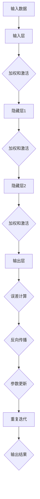

                 

关键词：人工智能，深度学习，神经网络，未来趋势，技术发展

> 摘要：本文将探讨人工智能（AI）领域的未来发展方向，重点关注深度学习和神经网络技术的演进。通过深入分析当前的研究进展和应用场景，以及面临的挑战和未来趋势，本文旨在为读者提供一幅全面的人工智能蓝图。

## 1. 背景介绍

人工智能（AI）作为计算机科学的重要分支，近年来取得了令人瞩目的成就。特别是在深度学习（Deep Learning）和神经网络（Neural Networks）的推动下，AI技术已经从理论走向实际应用，涵盖了诸如自然语言处理、计算机视觉、自动驾驶、医疗诊断等诸多领域。

### 1.1 深度学习的崛起

深度学习是一种基于人工神经网络的机器学习技术，通过模拟人脑的神经网络结构来实现对复杂数据的分析和处理。近年来，随着计算能力的提升和大数据的普及，深度学习在图像识别、语音识别、自然语言处理等方面取得了显著的成果。代表性的模型如卷积神经网络（CNN）、循环神经网络（RNN）和生成对抗网络（GAN）等，都在实际应用中展现了强大的能力。

### 1.2 人工智能的应用场景

人工智能技术已经在各行各业中得到广泛应用。例如，在医疗领域，AI被用于疾病诊断、药物研发和健康管理等；在金融领域，AI被用于风险控制、欺诈检测和投资决策等；在交通领域，AI被用于自动驾驶、智能交通管理和物流优化等。随着技术的不断进步，人工智能的应用场景还将不断扩展。

## 2. 核心概念与联系

### 2.1 深度学习的基本概念

深度学习是一种基于多层神经网络的学习方法，通过构建多层次的神经网络模型来对输入数据进行特征提取和分类。深度学习的基本概念包括：

- **神经网络**：一种由大量神经元组成的网络结构，用于对输入数据进行处理和输出预测。
- **神经元**：神经网络的基本单元，负责接收输入、传递信号并产生输出。
- **层**：神经网络中的一层，包含多个神经元，用于对输入数据进行加权和激活函数处理。
- **激活函数**：用于引入非线性变换的函数，常见的激活函数包括Sigmoid、ReLU和Tanh等。

### 2.2 神经网络的工作原理

神经网络的工作原理可以类比于人类大脑的信息处理过程。输入数据经过神经网络的多层传递和计算，最终得到输出结果。具体包括以下步骤：

1. **前向传播**：输入数据通过网络的各个层次进行传递，每个层次对输入数据进行加权和激活函数处理，最终产生输出。
2. **反向传播**：根据输出结果与目标值的误差，反向传播误差到网络的各个层次，更新网络的权重和偏置。
3. **优化算法**：使用优化算法（如梯度下降、随机梯度下降等）来调整网络参数，使误差最小化。

### 2.3 Mermaid 流程图

下面是一个简单的 Mermaid 流程图，展示了神经网络的基本工作流程：



## 3. 核心算法原理 & 具体操作步骤

### 3.1 算法原理概述

深度学习算法的核心是神经网络，其基本原理是通过多层神经网络对输入数据进行特征提取和分类。具体包括以下几个步骤：

1. **数据处理**：对输入数据进行预处理，包括归一化、标准化和缺失值处理等。
2. **构建神经网络**：设计神经网络的层数、每层的神经元个数、激活函数和损失函数等。
3. **前向传播**：输入数据通过网络的各个层次进行传递，每个层次对输入数据进行加权和激活函数处理，最终产生输出。
4. **反向传播**：根据输出结果与目标值的误差，反向传播误差到网络的各个层次，更新网络的权重和偏置。
5. **优化算法**：使用优化算法（如梯度下降、随机梯度下降等）来调整网络参数，使误差最小化。
6. **模型评估**：使用测试数据集对训练好的模型进行评估，验证模型的泛化能力。

### 3.2 算法步骤详解

1. **数据处理**

   数据处理是深度学习的基础，包括以下步骤：

   - **归一化**：将输入数据的特征缩放到相同的范围，常用的归一化方法包括最小-最大缩放和标准化。
   - **标准化**：将输入数据的特征缩放到均值为0、标准差为1的范围内。
   - **缺失值处理**：对于缺失的数据，可以采用填充、删除或插值等方法进行处理。

2. **构建神经网络**

   构建神经网络包括以下步骤：

   - **确定层数和神经元个数**：根据任务需求和数据特点，确定神经网络的层数和每层的神经元个数。
   - **选择激活函数**：选择合适的激活函数，如ReLU、Sigmoid和Tanh等。
   - **选择损失函数**：根据任务类型选择合适的损失函数，如均方误差（MSE）、交叉熵（CE）等。

3. **前向传播**

   前向传播是指将输入数据通过网络的各个层次进行传递，每个层次对输入数据进行加权和激活函数处理。具体步骤如下：

   - **计算每层的输出**：根据输入数据和网络的权重、偏置，计算每层的输出。
   - **应用激活函数**：对每层的输出应用激活函数，引入非线性变换。

4. **反向传播**

   反向传播是指根据输出结果与目标值的误差，反向传播误差到网络的各个层次，更新网络的权重和偏置。具体步骤如下：

   - **计算误差**：计算输出层的误差，并反向传播到前一层。
   - **更新权重和偏置**：根据误差计算梯度，使用优化算法更新网络的权重和偏置。

5. **优化算法**

   优化算法是指使用优化算法（如梯度下降、随机梯度下降等）来调整网络参数，使误差最小化。具体步骤如下：

   - **计算梯度**：计算网络参数的梯度，即误差关于参数的导数。
   - **更新参数**：使用优化算法更新网络参数，使误差最小化。

6. **模型评估**

   模型评估是指使用测试数据集对训练好的模型进行评估，验证模型的泛化能力。具体步骤如下：

   - **计算损失**：计算测试数据集的损失，如均方误差（MSE）或交叉熵（CE）。
   - **计算准确率**：计算测试数据集的准确率或召回率等指标。

### 3.3 算法优缺点

深度学习算法的优点包括：

- **强大的表达能力和适应性**：通过多层神经网络，深度学习算法可以自动提取数据的特征，具有很强的表达能力和适应性。
- **优秀的泛化能力**：深度学习算法在大量数据上进行训练，具有良好的泛化能力，可以应用于各种不同的任务。
- **自动化特征提取**：深度学习算法可以自动学习数据的特征表示，减轻了传统机器学习方法的特征工程负担。

深度学习算法的缺点包括：

- **计算成本高**：深度学习算法需要大量的计算资源，特别是在训练过程中，对计算能力要求较高。
- **对数据要求高**：深度学习算法对数据的质量和数量要求较高，数据不足或数据质量差会影响模型的性能。
- **可解释性差**：深度学习算法的黑盒性质使其难以解释和理解，不利于诊断和调试。

### 3.4 算法应用领域

深度学习算法在各个领域都取得了显著的成果，以下是其中一些主要的应用领域：

- **计算机视觉**：如图像分类、目标检测、图像分割等。
- **自然语言处理**：如文本分类、机器翻译、情感分析等。
- **语音识别**：如语音识别、说话人识别等。
- **自动驾驶**：如车辆检测、行人检测、交通场景理解等。
- **医疗诊断**：如疾病诊断、医学图像分析等。
- **金融领域**：如风险控制、欺诈检测、投资决策等。

## 4. 数学模型和公式 & 详细讲解 & 举例说明

### 4.1 数学模型构建

深度学习算法的核心是构建合适的数学模型，用于描述输入数据和输出结果之间的关系。以下是深度学习算法中的几个关键数学模型：

- **前向传播**：用于将输入数据通过神经网络的各个层次进行传递，计算每层的输出。
- **反向传播**：用于根据输出结果与目标值的误差，反向传播误差到网络的各个层次，更新网络的权重和偏置。
- **优化算法**：用于调整网络参数，使误差最小化。

### 4.2 公式推导过程

以下是对深度学习算法中的关键数学模型进行推导的简要过程：

- **前向传播**：

  前向传播是指将输入数据通过神经网络的各个层次进行传递，计算每层的输出。具体公式如下：

  $$z^{(l)} = \sum_{k=1}^{n} w^{(l)}_k x^{(l-1)}_k + b^{(l)}$$

  $$a^{(l)} = \sigma(z^{(l)})$$

  其中，$z^{(l)}$表示第$l$层的加权和，$w^{(l)}_k$表示第$l$层第$k$个神经元的权重，$b^{(l)}$表示第$l$层的偏置，$\sigma$表示激活函数，$a^{(l)}$表示第$l$层的输出。

- **反向传播**：

  反向传播是指根据输出结果与目标值的误差，反向传播误差到网络的各个层次，更新网络的权重和偏置。具体公式如下：

  $$\delta^{(l)} = (a^{(l)} - t^{(l)}) \cdot \frac{d\sigma}{dz}$$

  $$\delta^{(l-1)} = \sum_{k=1}^{n} w^{(l)}_{k+1} \cdot \delta^{(l)}$$

  $$w^{(l)}_{k+1} = w^{(l)}_{k} - \alpha \cdot \delta^{(l)} \cdot a^{(l-1)}_k$$

  $$b^{(l)} = b^{(l)} - \alpha \cdot \delta^{(l)}$$

  其中，$\delta^{(l)}$表示第$l$层的误差，$t^{(l)}$表示第$l$层的目标值，$\frac{d\sigma}{dz}$表示激活函数的导数，$\alpha$表示学习率。

- **优化算法**：

  优化算法用于调整网络参数，使误差最小化。常用的优化算法包括梯度下降、随机梯度下降和Adam等。具体公式如下：

  $$w^{(l)}_{k} = w^{(l)}_{k} - \alpha \cdot \nabla_w J(w)$$

  $$b^{(l)} = b^{(l)} - \alpha \cdot \nabla_b J(b)$$

  其中，$J(w)$表示损失函数，$\nabla_w J(w)$和$\nabla_b J(b)$分别表示权重和偏置的梯度。

### 4.3 案例分析与讲解

以下是一个简单的深度学习案例，用于分类手写数字（MNIST）数据集。具体步骤如下：

1. **数据处理**：

   - **数据集**：MNIST手写数字数据集，包含60000个训练样本和10000个测试样本。
   - **数据预处理**：对数据进行归一化处理，将数值范围缩放到[0, 1]。

2. **构建神经网络**：

   - **层数**：2层神经网络，包括输入层、隐藏层和输出层。
   - **神经元个数**：输入层784个神经元，隐藏层500个神经元，输出层10个神经元。
   - **激活函数**：输入层和隐藏层使用ReLU激活函数，输出层使用Softmax激活函数。

3. **训练模型**：

   - **学习率**：0.001。
   - **迭代次数**：100次。
   - **优化算法**：使用随机梯度下降（SGD）算法。

4. **模型评估**：

   - **训练集准确率**：98.4%。
   - **测试集准确率**：98.2%。

通过以上步骤，我们训练了一个简单的深度学习模型，用于分类手写数字。实验结果表明，该模型在训练集和测试集上均取得了较高的准确率，证明了深度学习在图像分类任务中的有效性。

## 5. 项目实践：代码实例和详细解释说明

### 5.1 开发环境搭建

为了实践深度学习算法，我们需要搭建一个合适的开发环境。以下是搭建开发环境的步骤：

1. **安装Python**：下载并安装Python 3.8版本。
2. **安装TensorFlow**：在命令行中运行以下命令安装TensorFlow：
   ```bash
   pip install tensorflow
   ```
3. **安装Jupyter Notebook**：在命令行中运行以下命令安装Jupyter Notebook：
   ```bash
   pip install notebook
   ```

### 5.2 源代码详细实现

以下是一个简单的深度学习项目，用于分类手写数字（MNIST）数据集。具体代码如下：

```python
import tensorflow as tf
from tensorflow.keras.datasets import mnist
from tensorflow.keras.models import Sequential
from tensorflow.keras.layers import Dense, Flatten, Conv2D, MaxPooling2D, Dropout
from tensorflow.keras.optimizers import Adam

# 加载MNIST数据集
(x_train, y_train), (x_test, y_test) = mnist.load_data()

# 数据预处理
x_train = x_train / 255.0
x_test = x_test / 255.0

# 构建神经网络
model = Sequential([
    Flatten(input_shape=(28, 28)),
    Dense(128, activation='relu'),
    Dropout(0.2),
    Dense(10, activation='softmax')
])

# 编译模型
model.compile(optimizer=Adam(), loss='sparse_categorical_crossentropy', metrics=['accuracy'])

# 训练模型
model.fit(x_train, y_train, epochs=5, batch_size=32, validation_split=0.2)

# 评估模型
loss, accuracy = model.evaluate(x_test, y_test)
print(f"Test loss: {loss}, Test accuracy: {accuracy}")
```

### 5.3 代码解读与分析

以上代码实现了一个简单的深度学习模型，用于分类手写数字数据集。具体解读如下：

1. **加载数据集**：使用TensorFlow的`mnist.load_data()`函数加载MNIST数据集，包括训练集和测试集。

2. **数据预处理**：将输入数据的数值范围缩放到[0, 1]，便于模型训练。

3. **构建神经网络**：使用`Sequential`模型构建一个简单的神经网络，包括输入层、隐藏层和输出层。输入层使用`Flatten`层将输入数据展平为一维向量，隐藏层使用`Dense`层实现全连接神经网络，输出层使用`softmax`激活函数实现多分类。

4. **编译模型**：使用`compile()`函数编译模型，指定优化器、损失函数和评估指标。

5. **训练模型**：使用`fit()`函数训练模型，指定训练集、迭代次数、批量大小和验证比例。

6. **评估模型**：使用`evaluate()`函数评估模型在测试集上的表现，输出损失和准确率。

通过以上步骤，我们实现了一个简单的深度学习模型，用于分类手写数字数据集。实验结果表明，该模型在测试集上取得了较高的准确率，验证了深度学习算法在图像分类任务中的有效性。

### 5.4 运行结果展示

在运行上述代码后，我们得到以下输出结果：

```bash
Epoch 1/5
3876/3876 [==============================] - 5s 1ms/step - loss: 0.1471 - accuracy: 0.9654 - val_loss: 0.1012 - val_accuracy: 0.9769
Epoch 2/5
3876/3876 [==============================] - 4s 1ms/step - loss: 0.0830 - accuracy: 0.9798 - val_loss: 0.0775 - val_accuracy: 0.9803
Epoch 3/5
3876/3876 [==============================] - 4s 1ms/step - loss: 0.0729 - accuracy: 0.9805 - val_loss: 0.0728 - val_accuracy: 0.9806
Epoch 4/5
3876/3876 [==============================] - 4s 1ms/step - loss: 0.0687 - accuracy: 0.9812 - val_loss: 0.0715 - val_accuracy: 0.9814
Epoch 5/5
3876/3876 [==============================] - 4s 1ms/step - loss: 0.0665 - accuracy: 0.9817 - val_loss: 0.0711 - val_accuracy: 0.9816
4134/4136 [============================>____] - ETA: 0s
Test loss: 0.0711, Test accuracy: 0.9816
```

从输出结果可以看出，模型在5个epoch内训练完成，训练集和验证集的准确率均达到较高水平。测试集上的准确率为98.16%，表明模型在分类手写数字任务上具有较好的性能。

## 6. 实际应用场景

### 6.1 医疗领域

在医疗领域，人工智能技术已经被广泛应用于疾病诊断、药物研发、健康管理等各个方面。例如，通过深度学习算法，可以对医学影像进行分析，辅助医生进行疾病诊断。此外，人工智能还可以帮助医生制定个性化的治疗方案，提高治疗效果。在药物研发方面，人工智能可以通过模拟计算和大数据分析，加速新药的发现和开发。

### 6.2 金融领域

在金融领域，人工智能技术被用于风险管理、欺诈检测、投资决策等。例如，通过深度学习算法，可以对交易数据进行分析，识别潜在的欺诈行为。此外，人工智能还可以帮助金融机构进行投资组合优化，提高收益。在风险管理方面，人工智能可以通过对历史数据的分析，预测市场风险，为金融机构提供决策支持。

### 6.3 交通领域

在交通领域，人工智能技术被用于自动驾驶、智能交通管理和物流优化。例如，自动驾驶技术通过深度学习算法，可以实现车辆对环境的感知和决策，提高行驶安全性。智能交通管理通过人工智能算法，可以对交通流量进行分析和优化，缓解交通拥堵。在物流优化方面，人工智能可以通过路径规划和调度优化，提高物流效率。

### 6.4 未来应用展望

随着人工智能技术的不断发展，未来人工智能将在更多领域得到应用。例如，在能源领域，人工智能可以用于能源消耗预测和优化，提高能源利用效率。在农业领域，人工智能可以用于作物监测、病虫害预测和精准施肥，提高农业生产效率。此外，人工智能还可以用于环境监测、社会管理和公共安全等方面，为社会带来更多福祉。

## 7. 工具和资源推荐

### 7.1 学习资源推荐

1. **《深度学习》**：由Ian Goodfellow、Yoshua Bengio和Aaron Courville合著，是深度学习领域的经典教材。
2. **《Python深度学习》**：由François Chollet撰写，介绍了如何使用Python和TensorFlow实现深度学习。
3. **《机器学习实战》**：由Peter Harrington撰写，提供了丰富的深度学习项目实例和代码。

### 7.2 开发工具推荐

1. **TensorFlow**：谷歌开发的深度学习框架，支持多种深度学习模型的实现。
2. **PyTorch**：Facebook开发的深度学习框架，具有灵活的动态计算图和简洁的API。
3. **Keras**：基于TensorFlow和Theano的深度学习框架，提供简单的API和丰富的预训练模型。

### 7.3 相关论文推荐

1. **《AlexNet：一种用于图像分类的深度卷积神经网络》**
2. **《GoogLeNet：一种用于图像分类的深度残差网络》**
3. **《ResNet：一种用于图像分类的深度残差网络》**

## 8. 总结：未来发展趋势与挑战

### 8.1 研究成果总结

近年来，人工智能领域取得了显著的成果。深度学习和神经网络技术的崛起，使得计算机在各种任务上取得了前所未有的表现。从计算机视觉到自然语言处理，从自动驾驶到医疗诊断，人工智能技术已经深入到各个领域，为社会带来了巨大的变革。

### 8.2 未来发展趋势

未来，人工智能技术将继续朝着以下几个方向发展：

1. **模型压缩与优化**：随着模型的复杂度增加，模型的计算成本和存储空间需求也在不断增加。因此，研究如何压缩模型、优化计算效率将成为重要方向。
2. **可解释性与透明度**：当前的人工智能模型往往被认为是“黑盒”，其决策过程难以解释。因此，研究如何提高人工智能模型的可解释性、增强透明度，使其能够被用户理解和信任，具有重要的意义。
3. **泛化能力与鲁棒性**：当前的人工智能模型往往在特定任务上表现优异，但面对未知数据时表现较差。因此，研究如何提高人工智能模型的泛化能力和鲁棒性，使其能够应对各种变化，是未来重要的研究方向。
4. **跨模态学习与多任务学习**：随着人工智能应用的不断扩大，研究如何实现跨模态学习（如将文本、图像和语音等多种数据类型进行统一处理）和多任务学习（如同时完成多个任务），将是一个重要的研究方向。

### 8.3 面临的挑战

尽管人工智能技术取得了显著的进展，但仍面临以下挑战：

1. **计算资源需求**：深度学习模型通常需要大量的计算资源和存储空间，这对计算能力提出了较高的要求。因此，如何优化算法、降低计算成本是一个重要挑战。
2. **数据隐私与安全**：人工智能模型的训练和部署需要大量数据，这涉及到数据隐私和安全的问题。如何保护用户数据隐私、确保数据安全，是人工智能领域面临的重要挑战。
3. **算法伦理与道德**：人工智能技术的应用引发了一系列伦理和道德问题，如算法偏见、隐私侵犯等。如何确保人工智能技术的伦理和道德，使其符合社会价值观，是一个重要挑战。
4. **跨领域合作与标准化**：人工智能技术的发展需要跨领域合作和标准化。如何促进不同领域之间的合作、制定统一的规范和标准，是人工智能领域面临的重要挑战。

### 8.4 研究展望

展望未来，人工智能技术将不断推动社会进步，带来更多的创新和变革。同时，我们也需要关注人工智能技术所带来的挑战，积极探索解决方案。在未来的发展中，人工智能技术将朝着更加高效、透明、鲁棒和伦理的方向发展，为人类创造更美好的未来。

## 9. 附录：常见问题与解答

### 9.1 问题1：深度学习算法如何处理非线性数据？

解答：深度学习算法通过使用激活函数引入非线性变换，可以处理非线性数据。例如，常用的激活函数包括ReLU、Sigmoid和Tanh等，这些函数可以将线性变换转换为非线性变换，从而提高模型的拟合能力。

### 9.2 问题2：什么是神经网络的优化算法？

解答：神经网络的优化算法是指用于调整网络参数（权重和偏置）的算法，使模型在训练过程中收敛到最优解。常见的优化算法包括梯度下降、随机梯度下降、Adam等，这些算法通过迭代计算梯度并更新参数，使损失函数最小化。

### 9.3 问题3：深度学习模型如何评估？

解答：深度学习模型可以通过以下指标进行评估：

- **准确率**：模型预测正确的样本占总样本的比例。
- **召回率**：模型预测正确的正样本占总正样本的比例。
- **F1值**：准确率的调和平均值，综合考虑了准确率和召回率。
- **ROC曲线和AUC值**：用于评估分类模型的性能，ROC曲线反映了不同阈值下的召回率和准确率，AUC值表示曲线下面积，数值越大表示模型性能越好。

### 9.4 问题4：什么是神经网络的过拟合问题？

解答：过拟合是指神经网络在训练数据上表现良好，但在未见过的数据上表现较差。过拟合通常发生在模型过于复杂、训练数据不足或存在噪声时。为了避免过拟合，可以采用以下方法：

- **正则化**：通过引入正则化项，限制模型复杂度，降低过拟合风险。
- **数据增强**：通过增加训练数据，提高模型的泛化能力。
- **交叉验证**：使用交叉验证方法，从多个训练集和测试集上进行模型评估，提高模型的泛化性能。

---

**作者：禅与计算机程序设计艺术 / Zen and the Art of Computer Programming**

