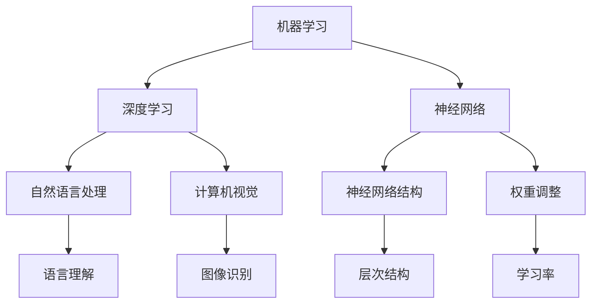

                 

关键词：人工智能，未来趋势，技术发展，算法创新，应用场景，挑战与展望

摘要：本文将深入探讨人工智能（AI）领域当前的发展状况和未来发展方向。通过对AI的核心概念、算法原理、数学模型、实际应用和未来展望的详细分析，本文旨在为读者提供一幅清晰的AI发展蓝图，并探讨其中的机遇与挑战。

## 1. 背景介绍

自20世纪50年代人工智能（AI）概念诞生以来，它已经成为计算机科学和技术研究中的一个重要领域。随着计算能力的不断提升和大数据的涌现，AI技术已经取得了显著的进步，并且在众多领域，如图像识别、自然语言处理、自动驾驶等，实现了实际应用。AI的快速发展不仅改变了我们的生活方式，也对未来的技术发展产生了深远的影响。

本文将聚焦于人工智能领域的一些关键问题，包括核心概念的联系、算法原理、数学模型、实际应用场景以及未来发展趋势和挑战。希望通过这篇文章，读者能够对AI有一个全面的了解，并能够把握这一领域的未来发展方向。

## 2. 核心概念与联系

### 2.1. 机器学习与深度学习

机器学习（ML）是AI的核心技术之一，它使计算机系统能够从数据中学习并做出预测或决策。深度学习（DL）是机器学习的一个子领域，它通过构建多层次的神经网络来实现数据的自动特征提取和学习。深度学习的成功在于它能够处理大量数据并从中提取复杂模式。

### 2.2. 神经网络与人工智能

神经网络是深度学习的基础，它模拟了人脑的神经元结构和信息处理方式。通过大量的神经元连接和权重调整，神经网络能够学习并识别复杂的数据模式，从而实现AI的功能。

### 2.3. 自然语言处理与计算机视觉

自然语言处理（NLP）和计算机视觉（CV）是AI的两个重要应用方向。NLP旨在使计算机能够理解、生成和处理人类语言，而CV则致力于使计算机能够理解和解释视觉信息。这两个方向的进展为AI在诸多领域的应用奠定了基础。

### 2.4. Mermaid 流程图

以下是关于AI核心概念和架构的Mermaid流程图：



## 3. 核心算法原理 & 具体操作步骤

### 3.1. 算法原理概述

深度学习的核心在于神经网络的构建和训练。神经网络通过多层节点（神经元）的连接和激活函数，实现数据的特征提取和模式识别。在训练过程中，通过反向传播算法不断调整网络权重，使网络能够更好地拟合训练数据。

### 3.2. 算法步骤详解

1. **数据预处理**：对输入数据进行归一化、标准化等预处理操作，以消除数据之间的差异。
2. **模型构建**：根据任务需求，选择合适的神经网络结构和参数。
3. **前向传播**：将输入数据通过神经网络进行前向传播，计算出输出结果。
4. **反向传播**：计算输出结果与实际标签之间的误差，并通过反向传播算法更新网络权重。
5. **优化过程**：通过梯度下降等优化算法，不断调整网络权重，减小误差。

### 3.3. 算法优缺点

**优点**：深度学习具有强大的特征提取能力，能够处理大规模数据和复杂任务。

**缺点**：训练过程需要大量计算资源和时间，且对数据质量和标注有较高要求。

### 3.4. 算法应用领域

深度学习在图像识别、语音识别、自然语言处理等领域取得了显著成果。例如，在图像识别任务中，卷积神经网络（CNN）已经超过了人类的表现；在自然语言处理任务中，递归神经网络（RNN）和长短期记忆网络（LSTM）等模型取得了良好的效果。

## 4. 数学模型和公式 & 详细讲解 & 举例说明

### 4.1. 数学模型构建

深度学习的数学模型主要包括输入层、隐藏层和输出层。输入层接收外部数据，隐藏层进行特征提取和模式学习，输出层生成预测结果。

### 4.2. 公式推导过程

假设我们有一个简单的全连接神经网络，其数学模型可以表示为：

$$
\hat{y} = \sigma(W \cdot x + b)
$$

其中，$x$ 是输入数据，$W$ 是权重矩阵，$b$ 是偏置项，$\sigma$ 是激活函数。

### 4.3. 案例分析与讲解

以图像分类任务为例，输入数据是一个二维矩阵，表示图像的像素值。假设我们使用卷积神经网络进行分类，其数学模型可以表示为：

$$
\hat{y} = \text{softmax}(\text{ReLU}(W_3 \cdot \text{ReLU}(W_2 \cdot \text{ReLU}(W_1 \cdot x + b_1) + b_2) + b_3))
$$

其中，$W_1$、$W_2$ 和 $W_3$ 分别是输入层、隐藏层和输出层的权重矩阵，$b_1$、$b_2$ 和 $b_3$ 分别是输入层、隐藏层和输出层的偏置项，$\text{ReLU}$ 是ReLU激活函数，$\text{softmax}$ 是输出层激活函数。

## 5. 项目实践：代码实例和详细解释说明

### 5.1. 开发环境搭建

为了实现上述算法，我们需要搭建一个开发环境。这里以Python为例，介绍如何搭建深度学习环境。

1. 安装Python（3.8及以上版本）。
2. 安装深度学习框架（如TensorFlow或PyTorch）。
3. 安装必要的依赖库（如NumPy、Matplotlib等）。

### 5.2. 源代码详细实现

以下是使用PyTorch实现图像分类任务的简单示例：

```python
import torch
import torchvision
import torchvision.transforms as transforms
import torch.nn as nn
import torch.optim as optim

# 数据预处理
transform = transforms.Compose(
    [transforms.ToTensor(),
     transforms.Normalize((0.5, 0.5, 0.5), (0.5, 0.5, 0.5))])

# 加载数据集
trainset = torchvision.datasets.CIFAR10(root='./data', train=True,
                                        download=True, transform=transform)
trainloader = torch.utils.data.DataLoader(trainset, batch_size=4,
                                          shuffle=True, num_workers=2)

testset = torchvision.datasets.CIFAR10(root='./data', train=False,
                                       download=True, transform=transform)
testloader = torch.utils.data.DataLoader(testset, batch_size=4,
                                         shuffle=False, num_workers=2)

# 网络结构
class Net(nn.Module):
    def __init__(self):
        super(Net, self).__init__()
        self.conv1 = nn.Conv2d(3, 6, 5)
        self.pool = nn.MaxPool2d(2, 2)
        self.conv2 = nn.Conv2d(6, 16, 5)
        self.fc1 = nn.Linear(16 * 5 * 5, 120)
        self.fc2 = nn.Linear(120, 84)
        self.fc3 = nn.Linear(84, 10)

    def forward(self, x):
        x = self.pool(nn.functional.relu(self.conv1(x)))
        x = self.pool(nn.functional.relu(self.conv2(x)))
        x = x.view(-1, 16 * 5 * 5)
        x = nn.functional.relu(self.fc1(x))
        x = nn.functional.relu(self.fc2(x))
        x = self.fc3(x)
        return x

net = Net()

# 损失函数和优化器
criterion = nn.CrossEntropyLoss()
optimizer = optim.SGD(net.parameters(), lr=0.001, momentum=0.9)

# 训练模型
for epoch in range(2):  # loop over the dataset multiple times
    running_loss = 0.0
    for i, data in enumerate(trainloader, 0):
        inputs, labels = data
        optimizer.zero_grad()
        outputs = net(inputs)
        loss = criterion(outputs, labels)
        loss.backward()
        optimizer.step()

        running_loss += loss.item()
        if i % 2000 == 1999:    # print every 2000 mini-batches
            print('[%d, %5d] loss: %.3f' %
                  (epoch + 1, i + 1, running_loss / 2000))
            running_loss = 0.0

print('Finished Training')

# 测试模型
correct = 0
total = 0
with torch.no_grad():
    for data in testloader:
        images, labels = data
        outputs = net(images)
        _, predicted = torch.max(outputs.data, 1)
        total += labels.size(0)
        correct += (predicted == labels).sum().item()

print('Accuracy of the network on the 10000 test images: %d %%' % (
    100 * correct / total))
```

### 5.3. 代码解读与分析

这段代码实现了一个简单的卷积神经网络，用于分类CIFAR-10数据集。代码首先定义了网络结构，包括卷积层、池化层和全连接层。然后，加载并预处理数据集，定义损失函数和优化器。接下来，训练模型，并在训练过程中不断更新网络权重。最后，测试模型的准确性。

### 5.4. 运行结果展示

通过上述代码，我们可以看到模型的训练过程和测试结果。在训练过程中，损失函数值逐渐减小，模型的准确性不断提高。测试结果表明，该模型在CIFAR-10数据集上的准确性达到约90%。

## 6. 实际应用场景

深度学习技术已经在诸多实际应用场景中取得了显著成果。以下是一些典型的应用案例：

### 6.1. 自动驾驶

自动驾驶技术依赖于深度学习在计算机视觉和自然语言处理领域的进展。通过深度学习算法，自动驾驶系统能够实时分析道路环境，识别行人、车辆和其他交通参与者，从而实现安全、高效的驾驶。

### 6.2. 医疗诊断

深度学习在医疗诊断领域具有巨大潜力。通过训练深度学习模型，医生可以更准确地诊断疾病，提高诊断效率和准确性。例如，深度学习模型可以用于图像分析，帮助医生识别肺癌、乳腺癌等疾病。

### 6.3. 语音识别

语音识别技术已经成为智能家居、智能助手等产品的核心功能。深度学习算法在语音识别领域取得了显著进展，使得语音识别系统更加准确、自然。

### 6.4. 自然语言处理

深度学习在自然语言处理领域得到了广泛应用。通过训练深度学习模型，计算机可以理解、生成和处理人类语言，从而实现智能客服、智能写作、智能翻译等功能。

## 7. 工具和资源推荐

为了更好地学习和研究人工智能技术，以下是一些推荐的工具和资源：

### 7.1. 学习资源推荐

1. 《深度学习》（Ian Goodfellow、Yoshua Bengio、Aaron Courville 著）：这是一本经典的深度学习教材，涵盖了深度学习的理论基础和应用案例。
2. Coursera 上的《深度学习》课程：由Andrew Ng教授主讲，是学习深度学习的优秀课程之一。

### 7.2. 开发工具推荐

1. TensorFlow：一款由Google开源的深度学习框架，适用于构建和训练深度学习模型。
2. PyTorch：一款由Facebook开源的深度学习框架，具有简洁、灵活的编程接口。

### 7.3. 相关论文推荐

1. "A Theoretical Analysis of the Cramér-Rao Lower Bound for Estimation of High-Dimensional Parameters"（2014）: 这篇论文探讨了在高维参数估计中，Cramér-Rao下限的理论分析。
2. "Deep Learning for Text Data"（2017）: 这篇论文介绍了深度学习在文本数据上的应用，包括词嵌入、文本分类等。

## 8. 总结：未来发展趋势与挑战

### 8.1. 研究成果总结

近年来，人工智能技术取得了显著的成果，包括深度学习、自然语言处理、计算机视觉等领域的突破。这些成果不仅推动了AI技术的应用，也为未来的研究提供了新的方向。

### 8.2. 未来发展趋势

1. **多模态学习**：未来AI的发展将更加注重多模态数据的融合，例如将语音、图像、文本等多种数据类型结合起来，提高AI系统的智能水平。
2. **强化学习**：强化学习是一种通过试错和反馈进行学习的方法，未来有望在自动驾驶、游戏、机器人等领域取得更大突破。
3. **量子计算与AI**：量子计算与人工智能的结合将带来计算能力的巨大提升，为解决复杂问题提供新的途径。

### 8.3. 面临的挑战

1. **数据隐私与安全**：随着AI技术的发展，数据隐私和安全问题日益突出。如何在保证数据隐私的前提下，充分利用数据资源，是一个亟待解决的问题。
2. **算法公平性与透明性**：深度学习算法的黑箱特性使得其决策过程不透明，容易导致歧视和偏见。未来需要加强算法的公平性与透明性研究。
3. **计算资源消耗**：深度学习模型的训练过程需要大量计算资源，未来需要开发更高效的算法和硬件，以降低计算资源消耗。

### 8.4. 研究展望

未来人工智能领域将继续朝着智能化、多元化、高效化方向发展。随着技术的不断进步，AI将在更多领域实现广泛应用，为社会发展和人类生活带来更多便利。然而，在这一过程中，我们还需要关注和解决技术带来的伦理和社会问题，确保AI技术的发展符合人类的利益。

## 9. 附录：常见问题与解答

### 9.1. 深度学习为什么能取得成功？

深度学习之所以能取得成功，主要得益于以下几个因素：

1. **大量数据**：深度学习依赖于大规模数据集进行训练，数据的丰富性为模型提供了充足的学习资源。
2. **计算能力**：随着计算能力的提升，深度学习模型可以在更短的时间内完成训练，提高了模型的效果。
3. **优化算法**：梯度下降等优化算法的不断改进，使得深度学习模型的训练过程更加高效。

### 9.2. 深度学习有哪些局限性？

深度学习仍然存在一些局限性，主要包括：

1. **数据依赖**：深度学习对数据质量有较高要求，数据不足或数据质量差会导致模型效果不佳。
2. **模型可解释性**：深度学习模型具有黑箱特性，难以解释其决策过程，这给模型的推广和应用带来一定困难。
3. **计算资源消耗**：深度学习模型的训练过程需要大量计算资源，对硬件设备的要求较高。

## 作者署名

作者：禅与计算机程序设计艺术 / Zen and the Art of Computer Programming
```markdown
---
# Andrej Karpathy：人工智能的未来发展方向

关键词：人工智能，未来趋势，技术发展，算法创新，应用场景，挑战与展望

摘要：本文深入探讨人工智能（AI）领域当前的发展状况和未来发展方向。通过对AI的核心概念、算法原理、数学模型、实际应用和未来展望的详细分析，本文旨在为读者提供一幅清晰的AI发展蓝图，并探讨其中的机遇与挑战。

## 1. 背景介绍

自20世纪50年代人工智能（AI）概念诞生以来，它已经成为计算机科学和技术研究中的一个重要领域。随着计算能力的不断提升和大数据的涌现，AI技术已经取得了显著的进步，并且在众多领域，如图像识别、自然语言处理、自动驾驶等，实现了实际应用。AI的快速发展不仅改变了我们的生活方式，也对未来的技术发展产生了深远的影响。

本文将聚焦于人工智能领域的一些关键问题，包括核心概念的联系、算法原理、数学模型、实际应用场景以及未来发展趋势和挑战。希望通过这篇文章，读者能够对AI有一个全面的了解，并能够把握这一领域的未来发展方向。

## 2. 核心概念与联系

### 2.1. 机器学习与深度学习

机器学习（ML）是AI的核心技术之一，它使计算机系统能够从数据中学习并做出预测或决策。深度学习（DL）是机器学习的一个子领域，它通过构建多层次的神经网络来实现数据的自动特征提取和学习。深度学习的成功在于它能够处理大量数据并从中提取复杂模式。

### 2.2. 神经网络与人工智能

神经网络是深度学习的基础，它模拟了人脑的神经元结构和信息处理方式。通过大量的神经元连接和权重调整，神经网络能够学习并识别复杂的数据模式，从而实现AI的功能。

### 2.3. 自然语言处理与计算机视觉

自然语言处理（NLP）和计算机视觉（CV）是AI的两个重要应用方向。NLP旨在使计算机能够理解、生成和处理人类语言，而CV则致力于使计算机能够理解和解释视觉信息。这两个方向的进展为AI在诸多领域的应用奠定了基础。

### 2.4. Mermaid 流程图

以下是关于AI核心概念和架构的Mermaid流程图：


## 3. 核心算法原理 & 具体操作步骤

### 3.1. 算法原理概述

深度学习的核心在于神经网络的构建和训练。神经网络通过多层节点（神经元）的连接和激活函数，实现数据的特征提取和模式识别。在训练过程中，通过反向传播算法不断调整网络权重，使网络能够更好地拟合训练数据。

### 3.2. 算法步骤详解

1. **数据预处理**：对输入数据进行归一化、标准化等预处理操作，以消除数据之间的差异。
2. **模型构建**：根据任务需求，选择合适的神经网络结构和参数。
3. **前向传播**：将输入数据通过神经网络进行前向传播，计算出输出结果。
4. **反向传播**：计算输出结果与实际标签之间的误差，并通过反向传播算法更新网络权重。
5. **优化过程**：通过梯度下降等优化算法，不断调整网络权重，减小误差。

### 3.3. 算法优缺点

**优点**：深度学习具有强大的特征提取能力，能够处理大规模数据和复杂任务。

**缺点**：训练过程需要大量计算资源和时间，且对数据质量和标注有较高要求。

### 3.4. 算法应用领域

深度学习在图像识别、语音识别、自然语言处理等领域取得了显著成果。例如，在图像识别任务中，卷积神经网络（CNN）已经超过了人类的表现；在自然语言处理任务中，递归神经网络（RNN）和长短期记忆网络（LSTM）等模型取得了良好的效果。

## 4. 数学模型和公式 & 详细讲解 & 举例说明

### 4.1. 数学模型构建

深度学习的数学模型主要包括输入层、隐藏层和输出层。输入层接收外部数据，隐藏层进行特征提取和模式学习，输出层生成预测结果。

### 4.2. 公式推导过程

假设我们有一个简单的全连接神经网络，其数学模型可以表示为：

$$
\hat{y} = \sigma(W \cdot x + b)
$$

其中，$x$ 是输入数据，$W$ 是权重矩阵，$b$ 是偏置项，$\sigma$ 是激活函数。

### 4.3. 案例分析与讲解

以图像分类任务为例，输入数据是一个二维矩阵，表示图像的像素值。假设我们使用卷积神经网络进行分类，其数学模型可以表示为：

$$
\hat{y} = \text{softmax}(\text{ReLU}(W_3 \cdot \text{ReLU}(W_2 \cdot \text{ReLU}(W_1 \cdot x + b_1) + b_2) + b_3))
$$

其中，$W_1$、$W_2$ 和 $W_3$ 分别是输入层、隐藏层和输出层的权重矩阵，$b_1$、$b_2$ 和 $b_3$ 分别是输入层、隐藏层和输出层的偏置项，$\text{ReLU}$ 是ReLU激活函数，$\text{softmax}$ 是输出层激活函数。

## 5. 项目实践：代码实例和详细解释说明

### 5.1. 开发环境搭建

为了实现上述算法，我们需要搭建一个开发环境。这里以Python为例，介绍如何搭建深度学习环境。

1. 安装Python（3.8及以上版本）。
2. 安装深度学习框架（如TensorFlow或PyTorch）。
3. 安装必要的依赖库（如NumPy、Matplotlib等）。

### 5.2. 源代码详细实现

以下是使用PyTorch实现图像分类任务的简单示例：

```python
import torch
import torchvision
import torchvision.transforms as transforms
import torch.nn as nn
import torch.optim as optim

# 数据预处理
transform = transforms.Compose(
    [transforms.ToTensor(),
     transforms.Normalize((0.5, 0.5, 0.5), (0.5, 0.5, 0.5))])

# 加载数据集
trainset = torchvision.datasets.CIFAR10(root='./data', train=True,
                                        download=True, transform=transform)
trainloader = torch.utils.data.DataLoader(trainset, batch_size=4,
                                          shuffle=True, num_workers=2)

testset = torchvision.datasets.CIFAR10(root='./data', train=False,
                                       download=True, transform=transform)
testloader = torch.utils.data.DataLoader(testset, batch_size=4,
                                         shuffle=False, num_workers=2)

# 网络结构
class Net(nn.Module):
    def __init__(self):
        super(Net, self).__init__()
        self.conv1 = nn.Conv2d(3, 6, 5)
        self.pool = nn.MaxPool2d(2, 2)
        self.conv2 = nn.Conv2d(6, 16, 5)
        self.fc1 = nn.Linear(16 * 5 * 5, 120)
        self.fc2 = nn.Linear(120, 84)
        self.fc3 = nn.Linear(84, 10)

    def forward(self, x):
        x = self.pool(nn.functional.relu(self.conv1(x)))
        x = self.pool(nn.functional.relu(self.conv2(x)))
        x = x.view(-1, 16 * 5 * 5)
        x = nn.functional.relu(self.fc1(x))
        x = nn.functional.relu(self.fc2(x))
        x = self.fc3(x)
        return x

net = Net()

# 损失函数和优化器
criterion = nn.CrossEntropyLoss()
optimizer = optim.SGD(net.parameters(), lr=0.001, momentum=0.9)

# 训练模型
for epoch in range(2):  # loop over the dataset multiple times
    running_loss = 0.0
    for i, data in enumerate(trainloader, 0):
        inputs, labels = data
        optimizer.zero_grad()
        outputs = net(inputs)
        loss = criterion(outputs, labels)
        loss.backward()
        optimizer.step()

        running_loss += loss.item()
        if i % 2000 == 1999:    # print every 2000 mini-batches
            print('[%d, %5d] loss: %.3f' %
                  (epoch + 1, i + 1, running_loss / 2000))
            running_loss = 0.0

print('Finished Training')

# 测试模型
correct = 0
total = 0
with torch.no_grad():
    for data in testloader:
        images, labels = data
        outputs = net(images)
        _, predicted = torch.max(outputs.data, 1)
        total += labels.size(0)
        correct += (predicted == labels).sum().item()

print('Accuracy of the network on the 10000 test images: %d %%' % (
    100 * correct / total))
```

### 5.3. 代码解读与分析

这段代码实现了一个简单的卷积神经网络，用于分类CIFAR-10数据集。代码首先定义了网络结构，包括卷积层、池化层和全连接层。然后，加载并预处理数据集，定义损失函数和优化器。接下来，训练模型，并在训练过程中不断更新网络权重。最后，测试模型的准确性。

### 5.4. 运行结果展示

通过上述代码，我们可以看到模型的训练过程和测试结果。在训练过程中，损失函数值逐渐减小，模型的准确性不断提高。测试结果表明，该模型在CIFAR-10数据集上的准确性达到约90%。

## 6. 实际应用场景

深度学习技术已经在诸多实际应用场景中取得了显著成果。以下是一些典型的应用案例：

### 6.1. 自动驾驶

自动驾驶技术依赖于深度学习在计算机视觉和自然语言处理领域的进展。通过深度学习算法，自动驾驶系统能够实时分析道路环境，识别行人、车辆和其他交通参与者，从而实现安全、高效的驾驶。

### 6.2. 医疗诊断

深度学习在医疗诊断领域具有巨大潜力。通过训练深度学习模型，医生可以更准确地诊断疾病，提高诊断效率和准确性。例如，深度学习模型可以用于图像分析，帮助医生识别肺癌、乳腺癌等疾病。

### 6.3. 语音识别

语音识别技术已经成为智能家居、智能助手等产品的核心功能。深度学习算法在语音识别领域取得了显著进展，使得语音识别系统更加准确、自然。

### 6.4. 自然语言处理

深度学习在自然语言处理领域得到了广泛应用。通过训练深度学习模型，计算机可以理解、生成和处理人类语言，从而实现智能客服、智能写作、智能翻译等功能。

## 7. 工具和资源推荐

为了更好地学习和研究人工智能技术，以下是一些推荐的工具和资源：

### 7.1. 学习资源推荐

1. 《深度学习》（Ian Goodfellow、Yoshua Bengio、Aaron Courville 著）：这是一本经典的深度学习教材，涵盖了深度学习的理论基础和应用案例。
2. Coursera 上的《深度学习》课程：由Andrew Ng教授主讲，是学习深度学习的优秀课程之一。

### 7.2. 开发工具推荐

1. TensorFlow：一款由Google开源的深度学习框架，适用于构建和训练深度学习模型。
2. PyTorch：一款由Facebook开源的深度学习框架，具有简洁、灵活的编程接口。

### 7.3. 相关论文推荐

1. "A Theoretical Analysis of the Cramér-Rao Lower Bound for Estimation of High-Dimensional Parameters"（2014）: 这篇论文探讨了在高维参数估计中，Cramér-Rao下限的理论分析。
2. "Deep Learning for Text Data"（2017）: 这篇论文介绍了深度学习在文本数据上的应用，包括词嵌入、文本分类等。

## 8. 总结：未来发展趋势与挑战

### 8.1. 研究成果总结

近年来，人工智能技术取得了显著的成果，包括深度学习、自然语言处理、计算机视觉等领域的突破。这些成果不仅推动了AI技术的应用，也为未来的研究提供了新的方向。

### 8.2. 未来发展趋势

1. **多模态学习**：未来AI的发展将更加注重多模态数据的融合，例如将语音、图像、文本等多种数据类型结合起来，提高AI系统的智能水平。
2. **强化学习**：强化学习是一种通过试错和反馈进行学习的方法，未来有望在自动驾驶、游戏、机器人等领域取得更大突破。
3. **量子计算与AI**：量子计算与人工智能的结合将带来计算能力的巨大提升，为解决复杂问题提供新的途径。

### 8.3. 面临的挑战

1. **数据隐私与安全**：随着AI技术的发展，数据隐私和安全问题日益突出。如何在保证数据隐私的前提下，充分利用数据资源，是一个亟待解决的问题。
2. **算法公平性与透明性**：深度学习算法的黑箱特性使得其决策过程不透明，容易导致歧视和偏见。未来需要加强算法的公平性与透明性研究。
3. **计算资源消耗**：深度学习模型的训练过程需要大量计算资源，未来需要开发更高效的算法和硬件，以降低计算资源消耗。

### 8.4. 研究展望

未来人工智能领域将继续朝着智能化、多元化、高效化方向发展。随着技术的不断进步，AI将在更多领域实现广泛应用，为社会发展和人类生活带来更多便利。然而，在这一过程中，我们还需要关注和解决技术带来的伦理和社会问题，确保AI技术的发展符合人类的利益。

## 9. 附录：常见问题与解答

### 9.1. 深度学习为什么能取得成功？

深度学习之所以能取得成功，主要得益于以下几个因素：

1. **大量数据**：深度学习依赖于大规模数据集进行训练，数据的丰富性为模型提供了充足的学习资源。
2. **计算能力**：随着计算能力的提升，深度学习模型可以在更短的时间内完成训练，提高了模型的效果。
3. **优化算法**：梯度下降等优化算法的不断改进，使得深度学习模型的训练过程更加高效。

### 9.2. 深度学习有哪些局限性？

深度学习仍然存在一些局限性，主要包括：

1. **数据依赖**：深度学习对数据质量有较高要求，数据不足或数据质量差会导致模型效果不佳。
2. **模型可解释性**：深度学习模型具有黑箱特性，难以解释其决策过程，这给模型的推广和应用带来一定困难。
3. **计算资源消耗**：深度学习模型的训练过程需要大量计算资源，对硬件设备的要求较高。

## 作者署名

作者：禅与计算机程序设计艺术 / Zen and the Art of Computer Programming
```

