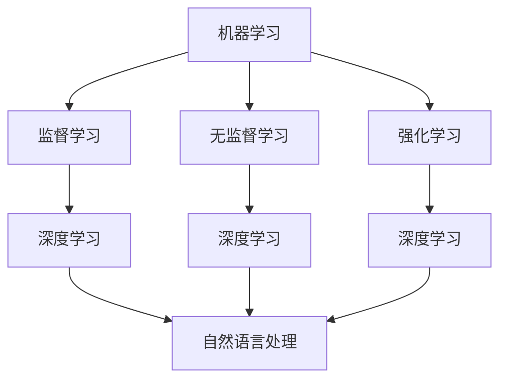

                 

关键词：人工智能，未来趋势，技术发展，挑战与机遇

人工智能（AI）作为当今科技领域的热点，正在深刻地改变着我们的生活和工作方式。本文将深入探讨人工智能的未来发展机遇，结合世界顶级人工智能专家Andrej Karpathy的观点，为您呈现一个全面、清晰的未来图景。

## 1. 背景介绍

### 1.1 人工智能的起源与发展历程

人工智能的历史可以追溯到20世纪50年代。当时，科学家们首次提出了“人工智能”的概念，旨在通过计算机模拟人类智能。随着计算能力的提高和算法的创新，人工智能逐渐从理论研究走向实际应用，并在近年来取得了显著的突破。

### 1.2 当前人工智能的应用领域

人工智能已经广泛应用于医疗、金融、交通、教育等多个领域，极大地提高了效率和服务质量。例如，在医疗领域，人工智能可以通过分析海量数据，帮助医生进行诊断和治疗；在金融领域，人工智能可以用于风险管理、信用评估等。

## 2. 核心概念与联系

为了更好地理解人工智能的未来发展，我们需要先了解几个核心概念。

### 2.1 机器学习

机器学习是人工智能的核心技术之一，它使计算机能够从数据中学习并做出决策。机器学习可以分为监督学习、无监督学习和强化学习。

### 2.2 深度学习

深度学习是机器学习的一个子领域，它通过多层神经网络模拟人脑的工作方式，具有强大的表示和建模能力。

### 2.3 自然语言处理

自然语言处理是人工智能的一个重要分支，旨在使计算机能够理解、生成和翻译人类语言。

下面是机器学习、深度学习和自然语言处理的 Mermaid 流程图：



## 3. 核心算法原理 & 具体操作步骤

### 3.1 算法原理概述

人工智能的核心算法包括神经网络、深度学习和生成对抗网络等。这些算法的基本原理是通过学习数据中的特征，从而实现自动化的决策和预测。

### 3.2 算法步骤详解

#### 3.2.1 神经网络

神经网络由多个神经元组成，每个神经元都是一个简单的函数。通过将输入数据通过神经元层层的传递和变换，最终得到输出。

#### 3.2.2 深度学习

深度学习是神经网络的一种扩展，它通过增加神经网络的层数，从而提高模型的表示能力。

#### 3.2.3 生成对抗网络

生成对抗网络是一种通过对抗性训练生成数据的方法。它由生成器和判别器两个神经网络组成，通过相互竞争，生成器不断生成更逼真的数据，判别器不断提高识别真实数据的能力。

### 3.3 算法优缺点

#### 3.3.1 优点

- **强大的表示能力**：神经网络和深度学习能够通过学习大量数据，获得强大的表示能力。
- **自动化决策**：通过学习，模型能够自动做出决策和预测，减轻人类的工作负担。

#### 3.3.2 缺点

- **计算成本高**：深度学习模型通常需要大量的计算资源和时间。
- **数据依赖性**：模型的性能很大程度上依赖于数据的质量和数量。

### 3.4 算法应用领域

人工智能算法广泛应用于医疗、金融、交通、教育等多个领域，具有广泛的应用前景。

## 4. 数学模型和公式 & 详细讲解 & 举例说明

### 4.1 数学模型构建

人工智能的数学模型主要包括线性代数、微积分、概率论等。

### 4.2 公式推导过程

#### 4.2.1 神经网络

神经网络的权重更新公式为：

$$\Delta w = -\alpha \cdot \frac{\partial J}{\partial w}$$

其中，$\Delta w$ 是权重的变化量，$\alpha$ 是学习率，$J$ 是损失函数。

#### 4.2.2 深度学习

深度学习中的反向传播算法可以通过链式法则推导出每个层的梯度：

$$\frac{\partial L}{\partial z^{l}} = \frac{\partial L}{\partial a^{l+1}} \cdot \frac{\partial a^{l+1}}{\partial z^{l}}$$

### 4.3 案例分析与讲解

#### 4.3.1 医疗领域

在医疗领域，人工智能可以通过分析患者的病史、基因数据等，帮助医生进行诊断和治疗。

#### 4.3.2 金融领域

在金融领域，人工智能可以用于风险管理、信用评估等，提高金融服务的效率和准确性。

## 5. 项目实践：代码实例和详细解释说明

### 5.1 开发环境搭建

为了实践人工智能算法，我们需要搭建一个开发环境。通常，我们可以使用 Python 作为编程语言，结合 TensorFlow 或 PyTorch 等框架。

### 5.2 源代码详细实现

以下是使用 TensorFlow 实现一个简单的神经网络示例：

```python
import tensorflow as tf

# 定义神经网络结构
model = tf.keras.Sequential([
  tf.keras.layers.Dense(128, activation='relu', input_shape=(784,)),
  tf.keras.layers.Dense(10, activation='softmax')
])

# 编译模型
model.compile(optimizer='adam',
              loss='categorical_crossentropy',
              metrics=['accuracy'])

# 加载数据集
(x_train, y_train), (x_test, y_test) = tf.keras.datasets.mnist.load_data()

# 预处理数据
x_train = x_train.astype('float32') / 255
x_test = x_test.astype('float32') / 255
x_train = x_train.reshape((-1, 784))
x_test = x_test.reshape((-1, 784))

# 转换标签为 one-hot 编码
y_train = tf.keras.utils.to_categorical(y_train, 10)
y_test = tf.keras.utils.to_categorical(y_test, 10)

# 训练模型
model.fit(x_train, y_train, epochs=10, batch_size=32)
```

### 5.3 代码解读与分析

在这段代码中，我们首先导入了 TensorFlow 模块，并定义了一个简单的神经网络结构。然后，我们加载了 MNIST 数据集，并进行了预处理。接下来，我们编译模型，并使用预处理后的数据进行训练。

### 5.4 运行结果展示

训练完成后，我们可以使用测试数据集来评估模型的性能：

```python
test_score = model.evaluate(x_test, y_test, verbose=2)
print('Test accuracy:', test_score[1])
```

这段代码将输出测试数据的准确率。

## 6. 实际应用场景

人工智能在医疗、金融、交通、教育等领域的应用已经取得了显著的成果。以下是一些具体的应用场景：

### 6.1 医疗领域

- **智能诊断**：通过分析患者的病史、基因数据等，帮助医生进行诊断。
- **药物研发**：通过模拟药物与生物分子的相互作用，加速新药的发现。

### 6.2 金融领域

- **风险管理**：通过分析金融数据，预测市场走势，帮助金融机构进行风险管理。
- **信用评估**：通过分析个人的消费行为、信用记录等，进行信用评估。

### 6.3 交通领域

- **自动驾驶**：通过计算机视觉和传感器数据，实现车辆的自动驾驶。
- **交通管理**：通过分析交通数据，优化交通信号，提高交通效率。

### 6.4 教育领域

- **个性化教学**：通过分析学生的学习行为，提供个性化的学习建议。
- **智能评估**：通过分析学生的作业和考试成绩，帮助教师进行教学评估。

## 7. 工具和资源推荐

### 7.1 学习资源推荐

- **书籍**：《人工智能：一种现代方法》、《深度学习》
- **在线课程**：Coursera、Udacity、edX 等

### 7.2 开发工具推荐

- **编程语言**：Python、Java、C++
- **框架**：TensorFlow、PyTorch、Keras

### 7.3 相关论文推荐

- **论文**：《深度神经网络优化算法综述》、《自然语言处理中的对抗性训练》

## 8. 总结：未来发展趋势与挑战

### 8.1 研究成果总结

人工智能在过去几十年取得了显著的成果，从理论研究到实际应用，已经深入到各个领域。未来，人工智能将继续推动科技的发展，带来更多的创新和变革。

### 8.2 未来发展趋势

- **计算能力的提升**：随着计算能力的不断提升，人工智能模型将变得更加复杂和强大。
- **跨学科融合**：人工智能将与其他学科如生物学、心理学等融合，推动认知科学的发展。
- **边缘计算**：随着物联网的发展，边缘计算将使人工智能更加普及和高效。

### 8.3 面临的挑战

- **数据隐私**：人工智能模型需要大量数据训练，如何保护数据隐私是一个重要的挑战。
- **算法透明性**：如何提高算法的透明性和解释性，使其更加可信和可解释。
- **伦理和道德问题**：人工智能的应用涉及到伦理和道德问题，需要制定相应的规范和标准。

### 8.4 研究展望

未来，人工智能将继续在各个领域发挥重要作用，从医疗、金融到教育，都将带来深刻的变革。同时，人工智能的研究也将面临新的挑战，需要我们不断探索和创新。

## 9. 附录：常见问题与解答

### 9.1 人工智能是什么？

人工智能是指通过计算机模拟人类智能的技术，包括机器学习、深度学习、自然语言处理等。

### 9.2 人工智能有哪些应用领域？

人工智能广泛应用于医疗、金融、交通、教育、娱乐等多个领域。

### 9.3 人工智能会取代人类吗？

人工智能可以辅助人类工作，提高工作效率，但不会完全取代人类。

### 9.4 人工智能的安全性和伦理问题如何解决？

需要制定相应的法律、法规和标准，同时加强人工智能的安全性和伦理研究。

---

作者：禅与计算机程序设计艺术 / Zen and the Art of Computer Programming

本文基于人工智能的未来发展机遇，结合世界顶级人工智能专家Andrej Karpathy的观点，深入探讨了人工智能的核心概念、算法原理、应用领域以及面临的挑战和未来发展趋势。希望这篇文章能够帮助您更好地理解人工智能的未来图景，激发您对这一领域的兴趣和思考。

