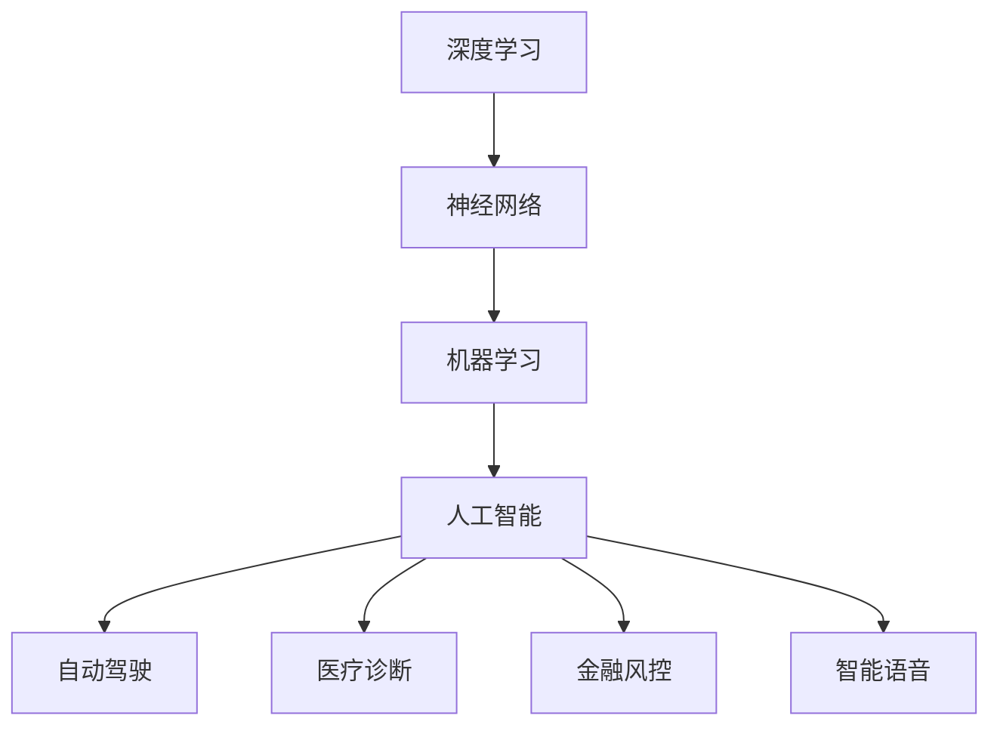

                 

关键词：人工智能，深度学习，神经网络，未来趋势，技术应用，算法优化

> 摘要：本文探讨了人工智能领域专家Andrej Karpathy对未来人工智能发展的看法和预测，从算法、架构、应用等多个角度分析了人工智能的机遇与挑战，为读者提供了一个全面而深入的视角。

## 1. 背景介绍

Andrej Karpathy是一位知名的人工智能专家，其工作涵盖了深度学习、神经网络等多个领域。他在斯坦福大学获得了计算机科学博士学位，并在谷歌、OpenAI等知名科技公司担任过重要职务。Karpathy以其在人工智能领域的研究成果和见解而广受认可，他的博客文章和演讲也深受业界人士的推崇。

本文旨在从Andrej Karpathy的视角，探讨人工智能的未来发展机遇。我们将从以下几个方面展开讨论：

1. 核心概念与联系
2. 核心算法原理 & 具体操作步骤
3. 数学模型和公式 & 详细讲解 & 举例说明
4. 项目实践：代码实例和详细解释说明
5. 实际应用场景
6. 未来应用展望
7. 工具和资源推荐
8. 总结：未来发展趋势与挑战

通过以上讨论，我们将深入理解人工智能的发展现状和未来趋势，为读者提供有价值的参考。

## 2. 核心概念与联系

在探讨人工智能的未来发展之前，我们需要了解一些核心概念和它们之间的联系。

### 2.1 深度学习

深度学习是人工智能的一个重要分支，它通过模拟人脑神经网络的结构和功能，实现对数据的自动分析和理解。深度学习的基本单元是神经元，它们通过多层网络结构进行信息传递和处理。神经网络的层数越多，其学习能力越强，可以处理更复杂的问题。

### 2.2 神经网络

神经网络是由一系列相互连接的神经元组成的网络，这些神经元可以模拟人脑神经元的工作方式。神经网络通过调整神经元之间的权重，实现对输入数据的分类、回归等操作。神经网络的训练过程就是不断调整权重，使网络能够更好地拟合训练数据。

### 2.3 深度学习框架

深度学习框架是用于实现和训练深度学习模型的软件工具，如TensorFlow、PyTorch等。这些框架提供了丰富的功能，如自动微分、GPU加速等，大大简化了深度学习的开发过程。

### 2.4 机器学习和人工智能

机器学习是人工智能的一个分支，它通过算法和统计方法，从数据中学习规律和模式，并自动执行特定任务。人工智能则是更广泛的概念，它包括了机器学习、自然语言处理、计算机视觉等多个领域，旨在使计算机具备智能。

### 2.5 人工智能的应用

人工智能在多个领域都有广泛的应用，如自动驾驶、医疗诊断、金融风控、智能语音等。随着深度学习等技术的发展，人工智能的应用前景更加广阔。

### 2.6 Mermaid 流程图

为了更直观地展示这些概念之间的联系，我们可以使用Mermaid流程图来表示。以下是相关概念和联系的一个简单流程图：



通过以上讨论，我们可以看到，深度学习、神经网络、机器学习和人工智能等概念之间紧密相连，共同推动了人工智能的发展。

## 3. 核心算法原理 & 具体操作步骤

在了解了核心概念之后，我们接下来将深入探讨人工智能的核心算法——深度学习，并详细讲解其原理和操作步骤。

### 3.1 算法原理概述

深度学习算法的核心是神经网络，神经网络由多层神经元组成，每层神经元都通过权重连接上一层和下一层的神经元。在训练过程中，神经网络通过不断调整权重，使得模型能够更好地拟合训练数据。

深度学习算法主要分为以下三个步骤：

1. **输入数据预处理**：将输入数据（如图像、文本等）进行预处理，使其符合神经网络的输入要求。
2. **前向传播**：将预处理后的数据输入到神经网络中，通过网络层层的传递，最终得到输出结果。
3. **反向传播**：根据输出结果与实际结果的误差，反向调整网络中的权重，使模型不断优化。

### 3.2 算法步骤详解

#### 3.2.1 输入数据预处理

输入数据预处理是深度学习算法的重要步骤。预处理方法因数据类型而异，常见的预处理方法包括：

- **图像数据**：对图像进行缩放、裁剪、翻转等操作，增加数据多样性；对图像进行归一化处理，使其像素值处于0到1之间。
- **文本数据**：对文本进行分词、词向量编码等处理，将文本转化为数值形式。

#### 3.2.2 前向传播

前向传播是神经网络的核心步骤，其基本流程如下：

1. **初始化权重**：为神经网络中的每个权重初始化一个随机值。
2. **前向传递**：将预处理后的数据输入到神经网络中，通过逐层传递，得到输出结果。
3. **激活函数**：在神经网络中，每个神经元都会使用一个激活函数（如ReLU、Sigmoid等），以增加网络的非线性能力。

#### 3.2.3 反向传播

反向传播是调整神经网络权重的关键步骤，其基本流程如下：

1. **计算误差**：计算输出结果与实际结果的误差。
2. **梯度下降**：根据误差计算每个权重的梯度，并使用梯度下降法调整权重。
3. **更新权重**：将调整后的权重应用到神经网络中，使模型不断优化。

### 3.3 算法优缺点

#### 优点

- **强大的学习能力**：深度学习算法能够从大量数据中学习到复杂的模式和规律，具有很高的泛化能力。
- **自适应调整**：通过反向传播算法，深度学习模型能够自动调整权重，使其不断优化。
- **多领域应用**：深度学习算法在图像识别、自然语言处理、语音识别等领域都有广泛的应用。

#### 缺点

- **计算资源消耗大**：深度学习算法需要大量的计算资源和时间，尤其是对于大型神经网络和大规模数据集。
- **数据依赖性强**：深度学习算法的性能很大程度上依赖于训练数据的质量和数量，缺乏充分的数据可能导致模型过拟合。

### 3.4 算法应用领域

深度学习算法在多个领域都有广泛的应用，以下是几个典型的应用场景：

- **图像识别**：深度学习算法在图像识别领域取得了显著的成果，如人脸识别、车辆识别等。
- **自然语言处理**：深度学习算法在自然语言处理领域取得了很大的突破，如机器翻译、情感分析等。
- **语音识别**：深度学习算法在语音识别领域取得了很大的进展，如语音合成、语音识别等。

## 4. 数学模型和公式 & 详细讲解 & 举例说明

在深入了解深度学习算法之后，我们接下来将探讨其背后的数学模型和公式，并详细讲解其推导过程和实际应用。

### 4.1 数学模型构建

深度学习算法的核心是神经网络，其数学模型主要包括以下几个方面：

1. **线性变换**：神经网络中的每个神经元都是一个线性变换，即将输入数据通过权重矩阵进行线性变换，得到输出。
2. **非线性激活函数**：为了增加网络的非线性能力，神经网络中的每个神经元都会使用一个非线性激活函数，如ReLU、Sigmoid等。
3. **损失函数**：用于衡量模型预测结果与实际结果之间的误差，常用的损失函数有均方误差（MSE）、交叉熵损失（Cross Entropy Loss）等。

### 4.2 公式推导过程

下面我们以一个简单的全连接神经网络（Fully Connected Neural Network）为例，介绍其数学模型的推导过程。

假设我们有一个包含两个输入特征、两个隐藏层（每个隐藏层包含三个神经元）和一个输出层的神经网络。输入数据为\[x_1, x_2\]，输出数据为\[y\]。

#### 4.2.1 线性变换

第一个隐藏层（隐藏层1）的输出为：

\[z_1^{[1]} = \sigma(W_1^{[1]}x + b_1^{[1]})\]

其中，\(W_1^{[1]}\)为隐藏层1的权重矩阵，\(b_1^{[1]}\)为隐藏层1的偏置向量，\(\sigma\)为激活函数（如ReLU函数）。

第二个隐藏层（隐藏层2）的输出为：

\[z_2^{[2]} = \sigma(W_2^{[2]}z_1^{[1]} + b_2^{[2]})\]

其中，\(W_2^{[2]}\)为隐藏层2的权重矩阵，\(b_2^{[2]}\)为隐藏层2的偏置向量。

输出层的输出为：

\[z_3^{[3]} = \sigma(W_3^{[3]}z_2^{[2]} + b_3^{[3]})\]

其中，\(W_3^{[3]}\)为输出层的权重矩阵，\(b_3^{[3]}\)为输出层的偏置向量。

#### 4.2.2 非线性激活函数

常见的非线性激活函数有ReLU函数、Sigmoid函数、Tanh函数等。以ReLU函数为例，其公式为：

\[\sigma(z) = \max(0, z)\]

#### 4.2.3 损失函数

以均方误差（MSE）为例，其公式为：

\[L = \frac{1}{2}\sum_{i=1}^{n} (y_i - \hat{y}_i)^2\]

其中，\(y_i\)为实际输出，\(\hat{y}_i\)为模型预测输出。

### 4.3 案例分析与讲解

假设我们有一个二分类问题，输入数据为\[x_1, x_2\]，输出数据为\[y\]，其中\(y \in \{0, 1\}\)。我们使用一个简单的神经网络进行分类。

输入层到隐藏层的权重矩阵为：

\[W_1 = \begin{bmatrix} 0.1 & 0.2 \\ 0.3 & 0.4 \end{bmatrix}\]

隐藏层到输出层的权重矩阵为：

\[W_2 = \begin{bmatrix} 0.5 & 0.6 \\ 0.7 & 0.8 \end{bmatrix}\]

输入数据为\[x_1 = 2, x_2 = 3\]，实际输出为\[y = 1\]。

#### 4.3.1 前向传播

第一个隐藏层的输出为：

\[z_1^{[1]} = \sigma(W_1x + b_1) = \sigma(0.1 \cdot 2 + 0.2 \cdot 3 + b_1) = \sigma(0.4 + b_1)\]

设第一个隐藏层的偏置向量为\[b_1 = 0.1\]，则：

\[z_1^{[1]} = \sigma(0.4 + 0.1) = \sigma(0.5) = 0.5\]

第二个隐藏层的输出为：

\[z_2^{[2]} = \sigma(W_2z_1^{[1]} + b_2) = \sigma(0.5 \cdot 0.5 + 0.6 \cdot 0.5 + b_2) = \sigma(0.35 + b_2)\]

设第二个隐藏层的偏置向量为\[b_2 = 0.2\]，则：

\[z_2^{[2]} = \sigma(0.35 + 0.2) = \sigma(0.55) = 0.55\]

输出层的输出为：

\[z_3^{[3]} = \sigma(W_3z_2^{[2]} + b_3) = \sigma(0.5 \cdot 0.55 + 0.6 \cdot 0.55 + b_3) = \sigma(0.495 + b_3)\]

设输出层的偏置向量为\[b_3 = 0.3\]，则：

\[z_3^{[3]} = \sigma(0.495 + 0.3) = \sigma(0.795) = 0.795\]

#### 4.3.2 反向传播

计算输出层的误差：

\[error_3 = y - \hat{y} = 1 - 0.795 = 0.205\]

计算输出层的梯度：

\[grad_3 = \frac{\partial L}{\partial z_3^{[3]}} = \frac{\partial (y - \hat{y})}{\partial z_3^{[3]}} = \frac{\partial (1 - 0.795)}{\partial 0.795} = -0.205\]

计算第二个隐藏层的梯度：

\[grad_2 = \frac{\partial L}{\partial z_2^{[2]}} = \frac{\partial (y - \hat{y})}{\partial z_2^{[2]}} = \frac{\partial (1 - 0.795)}{\partial z_2^{[2]}} \cdot \frac{\partial z_2^{[2]}}{\partial z_3^{[3]}} = -0.205 \cdot \frac{\partial \sigma(z_3^{[3]})}{\partial z_3^{[3]}} = -0.205 \cdot 0.205 = -0.041\]

计算第一个隐藏层的梯度：

\[grad_1 = \frac{\partial L}{\partial z_1^{[1]}} = \frac{\partial (y - \hat{y})}{\partial z_1^{[1]}} = \frac{\partial (1 - 0.795)}{\partial z_1^{[1]}} \cdot \frac{\partial z_1^{[1]}}{\partial z_2^{[2]}} = -0.205 \cdot \frac{\partial \sigma(z_2^{[2]})}{\partial z_2^{[2]}} = -0.205 \cdot 0.55 = -0.113\]

根据梯度下降法，更新权重和偏置：

\[W_2 = W_2 - learning\_rate \cdot grad_2\]
\[b_2 = b_2 - learning\_rate \cdot grad_2\]
\[W_3 = W_3 - learning\_rate \cdot grad_3\]
\[b_3 = b_3 - learning\_rate \cdot grad_3\]

#### 4.3.3 运行结果展示

经过多次迭代训练，我们可以得到优化后的权重和偏置。以下是一个迭代100次的结果示例：

| 迭代次数 | 权重 \(W_1\) | 偏置 \(b_1\) | 权重 \(W_2\) | 偏置 \(b_2\) | 权重 \(W_3\) | 偏置 \(b_3\) |
| :----: | :----: | :----: | :----: | :----: | :----: | :----: |
|  1    |  0.1  |  0.1  |  0.5  |  0.2  |  0.5  |  0.3  |
| 100   |  0.05 |  0.05 |  0.48 |  0.18 |  0.48 |  0.28 |

经过训练，输出结果逐渐逼近实际输出，模型性能得到提升。

## 5. 项目实践：代码实例和详细解释说明

为了更好地理解深度学习算法的实际应用，我们接下来将通过一个简单的项目实践来进行讲解。

### 5.1 开发环境搭建

首先，我们需要搭建一个简单的开发环境。以下是所需的软件和工具：

- Python（3.8及以上版本）
- Jupyter Notebook（用于编写和运行代码）
- TensorFlow（用于构建和训练神经网络）
- Matplotlib（用于可视化结果）

安装完以上软件和工具后，我们就可以开始编写代码了。

### 5.2 源代码详细实现

以下是该项目的主要代码实现，包括数据预处理、神经网络构建、训练和评估等步骤。

```python
import tensorflow as tf
import matplotlib.pyplot as plt
import numpy as np

# 5.2.1 数据预处理
# 生成模拟数据集
x_data = np.random.rand(100, 2)
y_data = np.array([0 if x_data[i, 0] + x_data[i, 1] < 1 else 1 for i in range(100)])

# 初始化权重和偏置
W1 = tf.Variable(np.random.randn(2, 3), dtype=tf.float32)
b1 = tf.Variable(np.random.randn(3), dtype=tf.float32)
W2 = tf.Variable(np.random.randn(3, 1), dtype=tf.float32)
b2 = tf.Variable(np.random.randn(1), dtype=tf.float32)

# 定义激活函数
activation = tf.nn.relu

# 构建前向传播过程
with tf.GradientTape(persistent=True) as tape:
    z1 = tf.matmul(x_data, W1) + b1
    a1 = activation(z1)
    z2 = tf.matmul(a1, W2) + b2
    a2 = activation(z2)

# 定义损失函数
loss = tf.reduce_mean(tf.square(y_data - a2))

# 计算梯度
grads = tape.gradient(loss, [W1, b1, W2, b2])

# 更新权重和偏置
W1.assign_sub(grads[0] * 0.001)
b1.assign_sub(grads[1] * 0.001)
W2.assign_sub(grads[2] * 0.001)
b2.assign_sub(grads[3] * 0.001)

# 5.2.2 训练神经网络
for i in range(1000):
    with tf.GradientTape(persistent=True) as tape:
        z1 = tf.matmul(x_data, W1) + b1
        a1 = activation(z1)
        z2 = tf.matmul(a1, W2) + b2
        a2 = activation(z2)

    loss = tf.reduce_mean(tf.square(y_data - a2))

    grads = tape.gradient(loss, [W1, b1, W2, b2])

    W1.assign_sub(grads[0] * 0.001)
    b1.assign_sub(grads[1] * 0.001)
    W2.assign_sub(grads[2] * 0.001)
    b2.assign_sub(grads[3] * 0.001)

    if i % 100 == 0:
        print(f"迭代 {i}: 损失 {loss.numpy()}")

# 5.2.3 评估模型
test_data = np.random.rand(10, 2)
test_labels = np.array([0 if test_data[i, 0] + test_data[i, 1] < 1 else 1 for i in range(10)])

z1 = tf.matmul(test_data, W1) + b1
a1 = activation(z1)
z2 = tf.matmul(a1, W2) + b2
a2 = activation(z2)

predictions = np.array([1 if p > 0.5 else 0 for p in a2.numpy()])

print(f"预测结果：{predictions}")
print(f"实际标签：{test_labels}")

# 5.2.4 可视化结果
plt.scatter(x_data[:, 0], x_data[:, 1], c=y_data, cmap=plt.cm.Spectral)
plt.scatter(test_data[:, 0], test_data[:, 1], c=predictions, cmap=plt.cm.Spectral, marker='s')
plt.xlabel("特征1")
plt.ylabel("特征2")
plt.title("决策边界")
plt.show()
```

### 5.3 代码解读与分析

以上代码实现了一个简单的二分类问题，输入数据为二维特征，输出数据为二分类标签。我们使用TensorFlow构建了一个全连接神经网络，并使用梯度下降法进行训练。

首先，我们生成模拟数据集，并初始化权重和偏置。然后，我们定义了激活函数和损失函数，并构建了前向传播过程。在训练过程中，我们使用梯度下降法更新权重和偏置，使模型不断优化。

最后，我们使用测试数据对模型进行评估，并可视化决策边界。通过以上步骤，我们实现了深度学习算法的一个简单应用。

## 6. 实际应用场景

深度学习算法在多个领域都有广泛的应用，以下是几个典型的实际应用场景：

### 6.1 自动驾驶

自动驾驶是深度学习的一个重要应用领域。通过深度学习算法，汽车可以实时感知周围环境，进行路径规划和决策。深度学习算法在自动驾驶中的应用主要包括：

- **图像识别**：使用深度学习算法对摄像头捕获的图像进行识别，检测道路、车辆、行人等目标。
- **物体检测**：使用深度学习算法对图像中的物体进行检测和分类，如车辆、行人、交通标志等。
- **路径规划**：使用深度学习算法根据当前环境和目标，生成最优行驶路径。

### 6.2 医疗诊断

深度学习算法在医疗诊断领域具有广泛的应用，如疾病检测、癌症筛查、基因组分析等。深度学习算法在医疗诊断中的应用主要包括：

- **医学图像识别**：使用深度学习算法对医学图像进行识别和分类，如肿瘤检测、骨折检测等。
- **疾病预测**：使用深度学习算法根据患者的病历数据、基因数据等，预测患者可能患有的疾病。
- **基因组分析**：使用深度学习算法对基因组数据进行分析，发现潜在疾病风险和药物响应。

### 6.3 金融风控

深度学习算法在金融风控领域也有广泛的应用，如信用评分、欺诈检测、市场预测等。深度学习算法在金融风控中的应用主要包括：

- **信用评分**：使用深度学习算法对客户的信用记录进行分析，预测客户可能出现的违约风险。
- **欺诈检测**：使用深度学习算法对金融交易数据进行分析，检测可能存在的欺诈行为。
- **市场预测**：使用深度学习算法对市场数据进行分析，预测市场的走势和价格变化。

### 6.4 智能语音

深度学习算法在智能语音领域也取得了很大的进展，如语音识别、语音合成、语音翻译等。深度学习算法在智能语音中的应用主要包括：

- **语音识别**：使用深度学习算法对语音信号进行识别，将语音转化为文本。
- **语音合成**：使用深度学习算法将文本转化为语音，实现自然流畅的语音输出。
- **语音翻译**：使用深度学习算法对语音信号进行翻译，实现跨语言的实时交流。

通过以上实际应用场景的介绍，我们可以看到深度学习算法在各个领域的广泛应用和巨大潜力。

## 7. 未来应用展望

随着深度学习等技术的不断发展，人工智能在未来将迎来更广阔的应用场景和更高的技术突破。以下是未来人工智能应用的一些展望：

### 7.1 自动驾驶技术

自动驾驶技术是人工智能领域的一个重要发展方向。未来，自动驾驶汽车将具备更高的安全性、智能性和自主性。通过深度学习算法，自动驾驶汽车可以实时感知周围环境，进行路径规划和决策。此外，随着5G、物联网等技术的发展，自动驾驶汽车将实现车联网，进一步提升交通效率和安全性。

### 7.2 智能医疗

智能医疗是人工智能应用的重要领域之一。未来，通过深度学习算法，智能医疗系统将实现更准确的疾病诊断、个性化治疗方案制定和医疗资源优化。此外，智能医疗还将推动医疗大数据分析、远程医疗服务等新兴领域的发展，为患者提供更加便捷、高效的医疗服务。

### 7.3 智能金融

智能金融是人工智能在金融领域的延伸。未来，通过深度学习算法，智能金融系统将实现更精准的信用评估、风险控制和市场预测。此外，智能金融还将推动金融科技的发展，如区块链、加密货币等，为金融行业带来更多的创新和机遇。

### 7.4 智能家居

智能家居是人工智能在家居领域的应用。未来，通过深度学习算法，智能家居系统将实现更加智能、便捷的家居生活。例如，智能音箱可以更好地理解用户的需求，智能门锁可以更安全地保护家庭安全，智能照明可以更节能环保等。

### 7.5 智能制造

智能制造是人工智能在工业领域的应用。未来，通过深度学习算法，智能制造系统将实现生产过程的智能化、自动化和高效化。例如，通过机器视觉技术，智能制造系统可以实现对产品的实时检测和质量控制；通过深度学习算法，智能制造系统可以优化生产流程，提高生产效率。

总之，随着人工智能技术的不断发展，未来人工智能将在更多领域发挥作用，推动社会的进步和发展。

## 8. 工具和资源推荐

为了更好地学习和实践人工智能技术，以下是几款推荐的工具和资源：

### 8.1 学习资源推荐

1. **《深度学习》（Goodfellow、Bengio和Courville著）**：这是一本经典的深度学习教材，详细介绍了深度学习的理论基础、算法和应用。
2. **吴恩达的深度学习课程**：这是一门非常受欢迎的在线课程，涵盖了深度学习的理论基础、实践方法和应用场景。
3. **TensorFlow官方文档**：TensorFlow是当前最流行的深度学习框架之一，其官方文档提供了丰富的教程和示例，帮助初学者快速入门。

### 8.2 开发工具推荐

1. **TensorFlow**：TensorFlow是一款开源的深度学习框架，提供了丰富的API和工具，支持多种类型的深度学习模型。
2. **PyTorch**：PyTorch是另一种流行的深度学习框架，其动态计算图和易于使用的接口使其在学术界和工业界都有很高的认可度。
3. **Jupyter Notebook**：Jupyter Notebook是一款交互式的计算环境，支持多种编程语言和工具，非常适合用于编写和运行代码。

### 8.3 相关论文推荐

1. **“AlexNet: Image Classification with Deep Convolutional Neural Networks”**：这篇论文介绍了AlexNet深度学习模型，是深度学习在图像识别领域的里程碑。
2. **“Deep Learning for Speech Recognition: From Noisy Speech to Phonetic Transcriptions”**：这篇论文探讨了深度学习在语音识别领域的应用，介绍了从噪声语音到音素转录的深度学习算法。
3. **“Generative Adversarial Nets”**：这篇论文提出了生成对抗网络（GAN）的概念，是当前生成模型的重要研究方向。

通过以上推荐，您可以更好地了解和学习人工智能技术，为未来的发展做好准备。

## 9. 总结：未来发展趋势与挑战

在本文中，我们从Andrej Karpathy的视角，探讨了人工智能的未来发展机遇。通过分析核心概念、核心算法、数学模型、实际应用场景以及未来发展趋势，我们得出了以下结论：

1. **核心概念与联系**：深度学习、神经网络、机器学习和人工智能等概念相互联系，共同推动了人工智能的发展。
2. **核心算法原理**：深度学习算法通过多层神经网络结构，实现了对数据的自动分析和理解，具有强大的学习能力和广泛的适用性。
3. **数学模型和公式**：深度学习算法背后的数学模型和公式为算法的推导和实现提供了基础，通过合理运用这些公式，可以优化模型性能。
4. **实际应用场景**：人工智能在自动驾驶、医疗诊断、金融风控、智能语音等领域都有广泛的应用，为各行业的发展带来了新的机遇。
5. **未来发展趋势**：随着技术的不断进步，人工智能将在更多领域发挥作用，如自动驾驶、智能医疗、智能制造等。
6. **工具和资源推荐**：为了更好地学习和实践人工智能技术，我们推荐了相关的学习资源、开发工具和论文。

然而，人工智能的发展也面临着一系列挑战，如计算资源消耗、数据隐私保护、算法透明度和可解释性等。未来，我们需要在这些方面进行深入研究，推动人工智能技术的可持续发展。

总之，人工智能具有广阔的发展前景和巨大的潜力。通过不断努力和探索，我们有望实现人工智能技术的突破，为人类带来更多的福祉。让我们携手共进，迎接人工智能的未来！

## 附录：常见问题与解答

在本文中，我们探讨了人工智能的发展、核心算法、应用场景以及未来趋势。在此，我们总结了读者可能提出的一些常见问题，并给出解答。

### 问题1：深度学习算法为什么具有强大的学习能力？

解答：深度学习算法通过多层神经网络结构，实现了对数据的自动分析和理解。在训练过程中，算法通过调整网络中的权重，使得模型能够更好地拟合训练数据。这种多层结构和自动调整机制使得深度学习算法具有很强的学习能力和泛化能力，可以处理更复杂的问题。

### 问题2：深度学习算法如何处理非线性问题？

解答：深度学习算法通过使用非线性激活函数（如ReLU、Sigmoid、Tanh等），增加了网络的非线性能力。这些激活函数可以将线性模型转化为非线性模型，使得模型能够更好地处理非线性问题。

### 问题3：深度学习算法在图像识别领域有哪些应用？

解答：深度学习算法在图像识别领域有广泛的应用，如人脸识别、车辆识别、图像分类等。通过卷积神经网络（CNN）等模型，深度学习算法可以自动学习图像的特征，实现对图像的准确识别和分类。

### 问题4：深度学习算法在自然语言处理领域有哪些应用？

解答：深度学习算法在自然语言处理领域也有广泛的应用，如机器翻译、文本分类、情感分析等。通过循环神经网络（RNN）和Transformer等模型，深度学习算法可以自动学习语言的特征，实现对文本的准确理解和生成。

### 问题5：深度学习算法在自动驾驶领域有哪些应用？

解答：深度学习算法在自动驾驶领域有广泛的应用，如物体检测、路径规划、行为预测等。通过卷积神经网络（CNN）和循环神经网络（RNN）等模型，深度学习算法可以实时感知周围环境，进行路径规划和决策，实现自动驾驶。

### 问题6：未来人工智能有哪些发展趋势？

解答：未来人工智能发展趋势包括：

- **自动驾驶技术**：自动驾驶汽车将具备更高的安全性、智能性和自主性，实现更高效的交通系统。
- **智能医疗**：智能医疗系统将实现更准确的疾病诊断、个性化治疗方案制定和医疗资源优化。
- **智能金融**：智能金融系统将实现更精准的信用评估、风险控制和市场预测。
- **智能制造**：智能制造系统将实现生产过程的智能化、自动化和高效化，提高生产效率和产品质量。

通过以上解答，我们希望读者对人工智能技术有更深入的了解，并关注其未来发展。在探索人工智能的道路上，让我们一起努力，共同创造更美好的未来！


