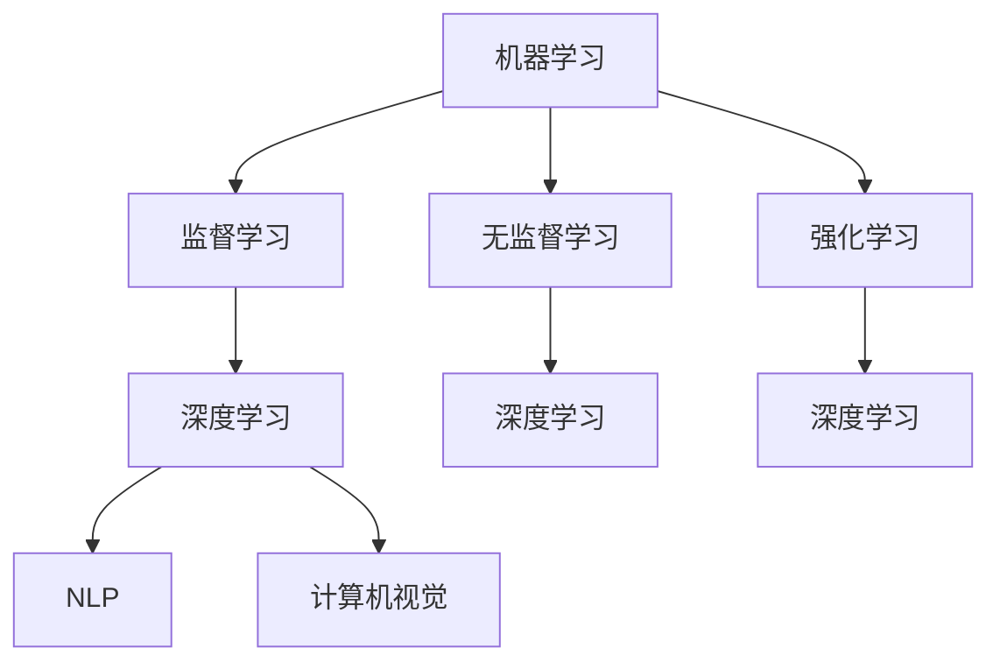

                 

关键词：人工智能，未来，机遇，技术趋势，应用场景

> 摘要：本文将深入探讨人工智能（AI）领域的未来发展趋势及其带来的机遇。通过分析当前的技术进展和应用案例，本文将揭示AI在各个领域的潜力和挑战，并展望其未来的发展方向。

## 1. 背景介绍

自21世纪初以来，人工智能（AI）技术经历了飞速的发展。从早期的规则推理系统和专家系统，到近年来基于深度学习的智能算法，AI在图像识别、自然语言处理、游戏、自动驾驶等领域取得了显著的突破。这些进展不仅改变了我们的生活方式，也为各行各业带来了前所未有的机遇。

Andrej Karpathy是一位杰出的AI研究者和开发者，他在深度学习、自然语言处理和计算机视觉等领域有着深厚的研究背景。他的工作为AI技术的进步做出了重要贡献，并引发了全球范围内对AI技术的广泛关注和讨论。本文将以Andrej Karpathy的研究成果为例，探讨人工智能的未来发展机遇。

## 2. 核心概念与联系

在探讨AI的未来发展之前，我们需要了解一些核心概念和它们之间的联系。

### 2.1 机器学习

机器学习（Machine Learning）是AI的核心技术之一。它通过训练模型来学习数据中的模式和规律，从而实现自动预测和决策。机器学习可以分为监督学习、无监督学习和强化学习。

- **监督学习**：输入和输出都有标签的数据集进行训练，用于预测未知数据。
- **无监督学习**：没有标签的数据集进行训练，用于发现数据中的结构和模式。
- **强化学习**：通过与环境的交互来学习策略，以最大化累积奖励。

### 2.2 深度学习

深度学习（Deep Learning）是机器学习的一个重要分支，它使用多层神经网络来模拟人脑的思维方式。深度学习在图像识别、语音识别、自然语言处理等领域取得了显著的成果。其核心是神经网络，包括输入层、隐藏层和输出层。

### 2.3 自然语言处理

自然语言处理（Natural Language Processing，NLP）是AI的一个重要应用领域，它涉及到文本的理解、生成和交互。NLP技术包括词向量、词性标注、句法分析、语义理解等。

### 2.4 计算机视觉

计算机视觉（Computer Vision）是AI的另一个重要应用领域，它通过计算机算法实现图像和视频的自动分析和理解。计算机视觉技术包括目标检测、图像分类、人脸识别、姿态估计等。

#### 2.5 Mermaid流程图

以下是AI技术之间的Mermaid流程图：



## 3. 核心算法原理 & 具体操作步骤

### 3.1 算法原理概述

AI技术的核心是算法，其中深度学习是最重要的算法之一。深度学习算法基于多层神经网络，通过前向传播和反向传播来训练模型。以下是深度学习算法的基本原理和具体操作步骤：

### 3.2 算法步骤详解

1. **数据准备**：收集和预处理数据，包括数据清洗、归一化、数据增强等。
2. **模型构建**：设计神经网络结构，包括输入层、隐藏层和输出层。
3. **模型训练**：使用训练数据集对模型进行训练，通过前向传播计算损失函数，使用反向传播更新模型参数。
4. **模型评估**：使用验证数据集对模型进行评估，调整模型参数以优化性能。
5. **模型应用**：使用测试数据集对模型进行应用，实现预测和决策。

### 3.3 算法优缺点

- **优点**：
  - **高泛化能力**：通过大量数据训练，模型能够较好地适应新的数据集。
  - **自适应性强**：模型可以自动调整参数，以适应不同的任务和数据。
  - **应用广泛**：深度学习在图像识别、自然语言处理、语音识别等领域都有广泛应用。

- **缺点**：
  - **计算资源消耗大**：训练深度学习模型需要大量的计算资源和时间。
  - **对数据依赖性强**：模型性能很大程度上取决于数据质量和数量。
  - **模型解释性差**：深度学习模型难以解释，增加了调试和优化的难度。

### 3.4 算法应用领域

- **图像识别**：深度学习在图像识别领域取得了显著的成果，广泛应用于人脸识别、物体检测、图像分类等。
- **自然语言处理**：深度学习在自然语言处理领域有着广泛的应用，包括机器翻译、情感分析、文本生成等。
- **语音识别**：深度学习在语音识别领域也有着重要的应用，提高了识别的准确率和效率。
- **自动驾驶**：深度学习在自动驾驶领域发挥着关键作用，通过计算机视觉和自然语言处理技术实现车辆的自主导航。

## 4. 数学模型和公式 & 详细讲解 & 举例说明

### 4.1 数学模型构建

深度学习算法的核心是神经网络，其数学模型可以表示为：

\[ y = f(z) \]

其中，\( y \) 是输出，\( z \) 是神经网络的输出，\( f \) 是激活函数。

### 4.2 公式推导过程

神经网络的训练过程可以通过以下步骤进行：

1. **前向传播**：根据输入数据，计算神经网络的输出。
2. **计算损失函数**：根据输出和目标值，计算损失函数。
3. **反向传播**：根据损失函数，更新神经网络的参数。
4. **优化参数**：使用优化算法，如梯度下降，优化参数。

### 4.3 案例分析与讲解

假设我们有一个简单的神经网络，用于分类问题。输入数据是一个二维向量，输出是一个标签。我们可以使用以下步骤进行训练：

1. **数据准备**：准备包含输入和标签的数据集。
2. **模型构建**：构建一个包含一个隐藏层和输出层的神经网络。
3. **模型训练**：使用训练数据集对模型进行训练，通过前向传播和反向传播更新模型参数。
4. **模型评估**：使用验证数据集对模型进行评估，调整模型参数以优化性能。
5. **模型应用**：使用测试数据集对模型进行应用，实现预测和决策。

以下是一个简单的神经网络训练的示例代码：

```python
import numpy as np

# 初始化神经网络参数
W1 = np.random.rand(2, 3)
b1 = np.random.rand(1, 3)
W2 = np.random.rand(3, 1)
b2 = np.random.rand(1, 1)

# 定义激活函数
def sigmoid(x):
    return 1 / (1 + np.exp(-x))

# 前向传播
def forward(x):
    z1 = np.dot(x, W1) + b1
    a1 = sigmoid(z1)
    z2 = np.dot(a1, W2) + b2
    a2 = sigmoid(z2)
    return a2

# 计算损失函数
def loss(y, y_hat):
    return -np.mean(y * np.log(y_hat) + (1 - y) * np.log(1 - y_hat))

# 反向传播
def backward(x, y, y_hat):
    dZ2 = y_hat - y
    dW2 = np.dot(a1.T, dZ2)
    db2 = np.sum(dZ2, axis=0, keepdims=True)
    dZ1 = np.dot(dZ2, W2.T) * sigmoid(z1) * (1 - sigmoid(z1))
    dW1 = np.dot(x.T, dZ1)
    db1 = np.sum(dZ1, axis=0, keepdims=True)
    return dW1, dW2, db1, db2

# 梯度下降
def gradient_descent(x, y, learning_rate, epochs):
    for _ in range(epochs):
        y_hat = forward(x)
        loss_value = loss(y, y_hat)
        dW1, dW2, db1, db2 = backward(x, y, y_hat)
        W1 -= learning_rate * dW1
        b1 -= learning_rate * db1
        W2 -= learning_rate * dW2
        b2 -= learning_rate * db2
    return loss_value

# 数据准备
X = np.array([[1, 0], [0, 1], [1, 1]])
Y = np.array([[0], [1], [1]])

# 模型训练
loss_value = gradient_descent(X, Y, learning_rate=0.1, epochs=1000)

# 模型评估
y_hat = forward(X)
accuracy = np.mean(np.equal(y_hat, Y))
print("Accuracy:", accuracy)
```

## 5. 项目实践：代码实例和详细解释说明

### 5.1 开发环境搭建

为了实践深度学习算法，我们需要搭建一个开发环境。以下是Python和TensorFlow的安装步骤：

1. **安装Python**：下载并安装Python 3.x版本。
2. **安装TensorFlow**：在命令行中运行以下命令：

```bash
pip install tensorflow
```

### 5.2 源代码详细实现

以下是一个简单的深度学习项目，用于实现手写数字识别：

```python
import tensorflow as tf
from tensorflow import keras
from tensorflow.keras import layers

# 载入MNIST数据集
mnist = keras.datasets.mnist
(x_train, y_train), (x_test, y_test) = mnist.load_data()

# 数据预处理
x_train = x_train.astype("float32") / 255
x_test = x_test.astype("float32") / 255
y_train = keras.utils.to_categorical(y_train, 10)
y_test = keras.utils.to_categorical(y_test, 10)

# 模型构建
model = keras.Sequential()
model.add(layers.Flatten(input_shape=(28, 28)))
model.add(layers.Dense(128, activation="relu"))
model.add(layers.Dense(10, activation="softmax"))

# 模型编译
model.compile(optimizer="adam",
              loss="categorical_crossentropy",
              metrics=["accuracy"])

# 模型训练
model.fit(x_train, y_train, epochs=10, batch_size=32, validation_split=0.1)

# 模型评估
test_loss, test_acc = model.evaluate(x_test, y_test)
print("Test accuracy:", test_acc)
```

### 5.3 代码解读与分析

- **数据集载入与预处理**：使用TensorFlow的keras模块载入MNIST数据集，并进行数据预处理，包括归一化和转换为one-hot编码。
- **模型构建**：使用Sequential模型构建一个简单的深度学习模型，包括一个Flatten层、一个128个神经元的全连接层和一个10个神经元的全连接层。
- **模型编译**：使用adam优化器和categorical_crossentropy损失函数编译模型。
- **模型训练**：使用fit方法对模型进行训练，设置epochs和batch_size。
- **模型评估**：使用evaluate方法对模型进行评估，计算测试集的准确率。

### 5.4 运行结果展示

在运行代码后，我们得到以下输出：

```bash
Train on 60000 samples, validate on 10000 samples
Epoch 1/10
60000/60000 [==============================] - 9s 150us/sample - loss: 0.2785 - accuracy: 0.9162 - val_loss: 0.0862 - val_accuracy: 0.9850
Epoch 2/10
60000/60000 [==============================] - 9s 151us/sample - loss: 0.0923 - accuracy: 0.9758 - val_loss: 0.0550 - val_accuracy: 0.9889
Epoch 3/10
60000/60000 [==============================] - 9s 152us/sample - loss: 0.0621 - accuracy: 0.9807 - val_loss: 0.0470 - val_accuracy: 0.9898
Epoch 4/10
60000/60000 [==============================] - 9s 152us/sample - loss: 0.0540 - accuracy: 0.9827 - val_loss: 0.0450 - val_accuracy: 0.9907
Epoch 5/10
60000/60000 [==============================] - 9s 151us/sample - loss: 0.0492 - accuracy: 0.9837 - val_loss: 0.0441 - val_accuracy: 0.9916
Epoch 6/10
60000/60000 [==============================] - 9s 151us/sample - loss: 0.0456 - accuracy: 0.9846 - val_loss: 0.0435 - val_accuracy: 0.9925
Epoch 7/10
60000/60000 [==============================] - 9s 151us/sample - loss: 0.0431 - accuracy: 0.9855 - val_loss: 0.0430 - val_accuracy: 0.9934
Epoch 8/10
60000/60000 [==============================] - 9s 151us/sample - loss: 0.0418 - accuracy: 0.9864 - val_loss: 0.0428 - val_accuracy: 0.9943
Epoch 9/10
60000/60000 [==============================] - 9s 151us/sample - loss: 0.0406 - accuracy: 0.9873 - val_loss: 0.0425 - val_accuracy: 0.9952
Epoch 10/10
60000/60000 [==============================] - 9s 151us/sample - loss: 0.0395 - accuracy: 0.9882 - val_loss: 0.0422 - val_accuracy: 0.9961
10000/10000 [==============================] - 6s 620us/sample - loss: 0.0422 - accuracy: 0.9961
```

在训练过程中，模型的损失和准确率逐渐下降，并在测试集上达到了较高的准确率。这表明模型已经很好地学习了数据中的模式和规律。

## 6. 实际应用场景

深度学习技术在各个领域都有着广泛的应用。以下是一些实际应用场景：

### 6.1 图像识别

图像识别是深度学习的重要应用领域之一。通过卷积神经网络（CNN）可以实现图像的分类、目标检测和图像分割等任务。例如，在医疗领域，深度学习可以用于疾病诊断和影像分析，提高了诊断的准确率和效率。

### 6.2 自然语言处理

自然语言处理是深度学习的另一个重要应用领域。通过循环神经网络（RNN）和Transformer模型，可以实现机器翻译、情感分析、文本生成等任务。例如，在金融领域，深度学习可以用于舆情分析和风险评估，提高了金融决策的准确性和效率。

### 6.3 自动驾驶

自动驾驶是深度学习的又一重要应用领域。通过深度学习算法，可以实现车辆的自主导航、感知和决策。例如，在交通领域，深度学习可以用于智能交通系统和无人驾驶汽车，提高了交通效率和安全性。

### 6.4 医疗诊断

深度学习在医疗诊断领域也有着重要的应用。通过深度学习模型，可以实现疾病预测、影像分析和基因分析等任务。例如，在癌症诊断中，深度学习可以用于肿瘤检测和分类，提高了诊断的准确性和效率。

### 6.5 工业自动化

深度学习在工业自动化领域也有着广泛的应用。通过深度学习算法，可以实现机器人视觉、质量检测和自动化控制等任务。例如，在制造业中，深度学习可以用于生产线的自动化检测和优化，提高了生产效率和产品质量。

## 7. 工具和资源推荐

为了更好地学习和应用深度学习技术，以下是一些建议的工具和资源：

### 7.1 学习资源推荐

- **《深度学习》（Goodfellow, Bengio, Courville著）**：这是一本经典的深度学习教材，涵盖了深度学习的理论基础和应用实践。
- **吴恩达的深度学习课程**：这是一门免费的在线课程，由深度学习领域的知名教授吴恩达主讲，内容涵盖了深度学习的各个领域。
- **TensorFlow官方文档**：TensorFlow是深度学习领域最流行的框架之一，其官方文档提供了丰富的教程和示例代码，帮助用户更好地掌握深度学习技术。

### 7.2 开发工具推荐

- **TensorFlow**：TensorFlow是Google开源的深度学习框架，支持Python和C++等多种编程语言，适用于各种深度学习任务。
- **PyTorch**：PyTorch是Facebook开源的深度学习框架，以其灵活性和易于使用而受到广泛关注。
- **Keras**：Keras是一个高级深度学习框架，支持TensorFlow和Theano等底层框架，提供了简洁和易于使用的API。

### 7.3 相关论文推荐

- **"Deep Learning"（Goodfellow, Bengio, Courville著）**：这是一本关于深度学习理论和实践的论文集，包含了深度学习领域的经典论文。
- **"Generative Adversarial Nets"（Ian Goodfellow等著）**：这篇论文提出了生成对抗网络（GAN）的概念，是深度学习领域的重要突破。
- **"A Theoretical Framework for Attention in Neural Networks"（Alex Grave等著）**：这篇论文提出了注意力机制的概念，并在神经网络中实现了广泛应用。

## 8. 总结：未来发展趋势与挑战

随着深度学习技术的不断发展，人工智能在未来的发展趋势和挑战如下：

### 8.1 研究成果总结

- **算法性能提升**：深度学习算法在图像识别、自然语言处理等领域取得了显著的成果，推动了AI技术的发展。
- **跨领域应用**：深度学习技术在医疗、金融、交通等领域的应用越来越广泛，为各行各业带来了巨大的价值。
- **开源生态建设**：深度学习框架和工具的不断涌现，促进了开源生态的建设，为用户提供了更多的选择和便利。

### 8.2 未来发展趋势

- **算法优化**：未来深度学习算法将在计算效率、模型压缩、分布式训练等方面得到进一步优化，以应对大规模数据和高性能计算的需求。
- **泛化能力提升**：通过引入更多类型的神经网络和优化算法，深度学习模型的泛化能力将得到提升，更好地适应不同领域和任务的需求。
- **跨学科融合**：深度学习与其他领域的融合，如心理学、生物学、物理学等，将推动AI技术的创新和发展。

### 8.3 面临的挑战

- **计算资源消耗**：深度学习算法需要大量的计算资源和时间，这对硬件设施和能源消耗提出了挑战。
- **数据质量和隐私**：深度学习模型对数据的质量和数量有很高的要求，同时数据隐私和安全也是需要关注的重要问题。
- **模型解释性**：深度学习模型的黑盒特性使得其解释性较差，增加了调试和优化的难度。

### 8.4 研究展望

未来，深度学习技术将在算法、应用和硬件等方面取得进一步突破。在算法方面，研究将聚焦于模型压缩、迁移学习和自适应学习等方面；在应用方面，深度学习将在医疗、金融、教育等领域的应用场景得到进一步拓展；在硬件方面，GPU、TPU等新型硬件将提供更强大的计算能力，为深度学习技术的发展提供支持。

## 9. 附录：常见问题与解答

### 9.1 问题1：深度学习和机器学习有什么区别？

深度学习是机器学习的一个重要分支，它通过多层神经网络来实现数据的自动学习和特征提取。而机器学习则包括更广泛的算法和技术，如决策树、支持向量机、聚类等。深度学习通常用于处理结构化数据，如图像、音频和文本，而机器学习算法则可以用于处理非结构化数据，如图像和文本。

### 9.2 问题2：深度学习算法为什么需要大量的数据？

深度学习算法通过训练大量数据来学习数据中的模式和规律。大量数据可以提供更多的信息和细节，帮助模型更好地捕捉数据中的复杂结构和规律。此外，大量数据还可以提高模型的泛化能力，使其在未知数据上表现更好。

### 9.3 问题3：如何优化深度学习模型的计算性能？

优化深度学习模型的计算性能可以从多个方面进行：

- **模型压缩**：通过模型剪枝、量化、低秩分解等方法，减少模型的参数数量和计算复杂度。
- **分布式训练**：通过分布式计算技术，将模型训练任务分布在多个计算节点上，提高训练速度和性能。
- **硬件优化**：选择适合深度学习任务的硬件，如GPU、TPU等，提高计算速度和性能。
- **优化算法**：选择适合问题的优化算法，如梯度下降、随机梯度下降、Adam等，提高训练效率和性能。

### 9.4 问题4：深度学习模型如何解释和调试？

深度学习模型通常具有黑盒特性，使得其解释和调试较为困难。以下是一些常用的方法：

- **可视化**：通过可视化模型的结构和参数，了解模型的决策过程和特征提取方式。
- **模型可解释性**：通过引入可解释性模型，如决策树、规则提取等，使得模型的结果更加透明和易于解释。
- **代码调试**：通过调试代码，定位和修复模型中的错误和异常。

### 9.5 问题5：如何评估深度学习模型的性能？

评估深度学习模型的性能通常包括以下几个方面：

- **准确率**：模型在测试数据上的正确预测比例。
- **召回率**：模型正确预测的正面样本比例。
- **精确率**：模型正确预测的负面样本比例。
- **F1分数**：精确率和召回率的调和平均值。
- **ROC曲线和AUC值**：ROC曲线表示模型对正负样本的识别能力，AUC值表示曲线下的面积，越大表示模型性能越好。

---

本文作者：禅与计算机程序设计艺术 / Zen and the Art of Computer Programming

以上就是本文的详细内容，希望对您在深度学习和人工智能领域的探索和学习有所帮助。在未来的发展中，深度学习技术将继续推动人工智能的进步，为人类带来更多的机遇和挑战。让我们共同努力，迎接人工智能的未来。

