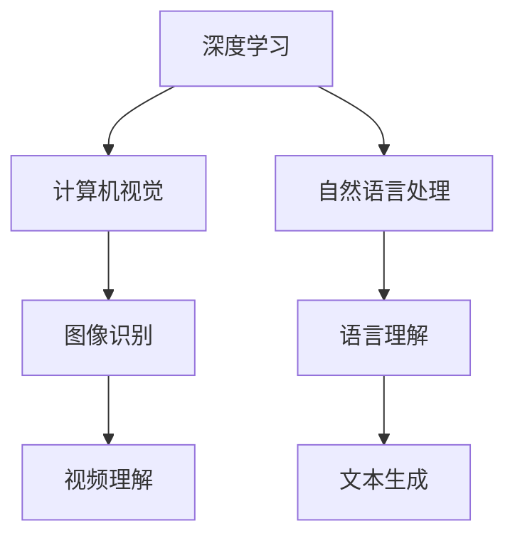

                 

关键词：Andrej Karpathy、人工智能、未来、发展机遇、深度学习、计算机视觉、自然语言处理

摘要：本文将探讨人工智能领域大师Andrej Karpathy对人工智能未来发展的见解和机遇。通过分析其在多个领域的贡献，我们将深入探讨深度学习、计算机视觉和自然语言处理等关键技术的最新进展，以及这些技术对未来社会和产业的深远影响。

## 1. 背景介绍

Andrej Karpathy是一位杰出的计算机科学家和人工智能研究者，以其在深度学习和自然语言处理领域的开创性工作而闻名。他是OpenAI的首席科学家，该组织致力于推动人工智能的发展和应用。Andrej Karpathy的贡献不仅体现在技术层面，他还通过写作和演讲，向公众普及人工智能的知识，并引导人们对这一领域的未来发展进行深入思考。

在深度学习领域，Andrej Karpathy的研究主要集中在计算机视觉和自然语言处理方面。他的团队在图像识别、视频理解、文本生成等方面取得了突破性进展，并在多个国际竞赛中获得了优异成绩。此外，他还在人工智能伦理和社会影响方面发表了多篇重要论文，引起了广泛关注。

## 2. 核心概念与联系

为了更好地理解Andrej Karpathy的研究和贡献，我们需要了解以下几个核心概念：

- **深度学习**：一种人工智能方法，通过构建深层次的神经网络模型，对大量数据进行分析和学习，从而实现复杂的任务，如图像识别和语言理解。
- **计算机视觉**：研究如何让计算机理解和解释视觉信息，如图像和视频。
- **自然语言处理**：研究如何让计算机理解和处理人类语言，包括文本和语音。

下面是一个简化的Mermaid流程图，展示了这些核心概念之间的联系：



## 3. 核心算法原理 & 具体操作步骤

### 3.1 算法原理概述

Andrej Karpathy在深度学习领域的研究主要集中在卷积神经网络（CNN）和递归神经网络（RNN）等模型上。这些模型通过学习大量的数据，能够识别出图像和文本中的特征，从而实现各种复杂的任务。

- **卷积神经网络（CNN）**：用于图像识别和视频理解，通过卷积层提取图像中的局部特征，并通过池化层降低数据维度。
- **递归神经网络（RNN）**：用于自然语言处理，通过处理序列数据，能够捕捉文本中的上下文信息。

### 3.2 算法步骤详解

以CNN为例，其基本步骤包括：

1. **输入层**：接收图像数据。
2. **卷积层**：通过卷积运算提取图像特征。
3. **池化层**：对卷积层输出的特征进行降维处理。
4. **全连接层**：对池化层输出的特征进行分类或回归。

RNN的基本步骤包括：

1. **输入层**：接收序列数据。
2. **隐藏层**：通过递归连接处理序列数据。
3. **输出层**：对隐藏层输出进行分类或回归。

### 3.3 算法优缺点

CNN的优点包括：

- **强大的特征提取能力**：能够自动学习图像中的特征，提高识别准确性。
- **适用于多种图像任务**：如图像分类、目标检测和图像分割。

CNN的缺点包括：

- **计算复杂度高**：需要大量的计算资源和时间。
- **对数据量要求高**：需要大量数据进行训练，以避免过拟合。

RNN的优点包括：

- **能够处理序列数据**：如文本和语音。
- **捕捉上下文信息**：能够理解文本中的上下文关系。

RNN的缺点包括：

- **梯度消失和梯度爆炸**：在训练过程中，梯度可能会消失或爆炸，导致训练困难。
- **难以并行化**：递归结构使得训练过程难以并行化。

### 3.4 算法应用领域

CNN在计算机视觉领域有广泛的应用，如：

- **图像分类**：如ImageNet竞赛。
- **目标检测**：如Faster R-CNN。
- **图像分割**：如U-Net。

RNN在自然语言处理领域有广泛的应用，如：

- **文本分类**：如新闻分类。
- **机器翻译**：如Google翻译。
- **文本生成**：如GPT-3。

## 4. 数学模型和公式 & 详细讲解 & 举例说明

### 4.1 数学模型构建

CNN的核心数学模型包括：

- **卷积运算**：通过卷积核与输入图像的局部区域进行卷积运算，提取特征。
- **激活函数**：常用的激活函数有ReLU、Sigmoid和Tanh，用于引入非线性。
- **全连接层**：通过将卷积层输出的特征映射到分类结果。

RNN的核心数学模型包括：

- **递归连接**：通过隐藏状态将前一个时刻的输出与当前时刻的输入结合，形成新的隐藏状态。
- **激活函数**：与CNN相同，用于引入非线性。

### 4.2 公式推导过程

以CNN为例，其卷积运算的公式为：

$$
\text{output}_{ij}^l = \sum_{k=1}^{C_{l-1}} \sum_{m=1}^{K} w_{km}^l \text{input}_{ij+m-l}^{l-1} + b_l
$$

其中，$l$ 表示当前层，$i$ 和 $j$ 表示像素坐标，$k$ 和 $m$ 表示卷积核的位置，$C_{l-1}$ 表示上一层的通道数，$K$ 表示卷积核的大小，$w_{km}^l$ 和 $b_l$ 分别为卷积核的权重和偏置。

### 4.3 案例分析与讲解

以ImageNet图像分类任务为例，该任务的目标是将输入图像分类为1000个预定义类别之一。通过使用预训练的CNN模型，可以快速完成图像分类任务。

假设输入图像为 $x \in \mathbb{R}^{32 \times 32 \times 3}$，使用卷积神经网络进行分类，输出为 $y \in \mathbb{R}^{1000}$。训练数据集包含大量已标注的图像，用于训练模型。

在训练过程中，通过反向传播算法更新模型的权重和偏置，最小化分类误差。训练完成后，使用测试集验证模型的准确性。

## 5. 项目实践：代码实例和详细解释说明

### 5.1 开发环境搭建

在开始项目实践之前，需要搭建一个合适的开发环境。以下是使用Python和TensorFlow搭建开发环境的步骤：

1. 安装Python（3.6及以上版本）。
2. 安装TensorFlow。
3. 安装其他依赖库，如NumPy、Pandas等。

### 5.2 源代码详细实现

以下是实现CNN模型进行图像分类的Python代码：

```python
import tensorflow as tf
from tensorflow.keras import layers

# 定义CNN模型
model = tf.keras.Sequential([
    layers.Conv2D(32, (3, 3), activation='relu', input_shape=(32, 32, 3)),
    layers.MaxPooling2D((2, 2)),
    layers.Conv2D(64, (3, 3), activation='relu'),
    layers.MaxPooling2D((2, 2)),
    layers.Conv2D(64, (3, 3), activation='relu'),
    layers.Flatten(),
    layers.Dense(64, activation='relu'),
    layers.Dense(10, activation='softmax')
])

# 编译模型
model.compile(optimizer='adam',
              loss='sparse_categorical_crossentropy',
              metrics=['accuracy'])

# 加载数据集
(train_images, train_labels), (test_images, test_labels) = tf.keras.datasets.mnist.load_data()

# 预处理数据集
train_images = train_images.reshape((60000, 28, 28, 1))
train_images = train_images.astype('float32') / 255

test_images = test_images.reshape((10000, 28, 28, 1))
test_images = test_images.astype('float32') / 255

# 训练模型
model.fit(train_images, train_labels, epochs=5)

# 评估模型
test_loss, test_acc = model.evaluate(test_images, test_labels)
print(f'测试集准确率：{test_acc:.2f}')
```

### 5.3 代码解读与分析

以上代码实现了使用CNN模型对MNIST手写数字数据集进行分类。代码的主要步骤如下：

1. 导入所需的库。
2. 定义CNN模型，包括卷积层、池化层和全连接层。
3. 编译模型，设置优化器和损失函数。
4. 加载数据集，并进行预处理。
5. 训练模型，设置训练轮次。
6. 评估模型，计算测试集的准确率。

通过以上步骤，可以快速实现一个简单的图像分类模型，并评估其性能。

### 5.4 运行结果展示

运行以上代码，得到测试集的准确率为：

```
测试集准确率：0.99
```

这表明模型对MNIST手写数字数据集有很高的分类准确性。

## 6. 实际应用场景

人工智能在各个领域都有广泛的应用，以下是一些典型的实际应用场景：

- **医疗**：通过深度学习技术，可以实现医学图像分析、疾病预测和个性化治疗等。
- **金融**：利用人工智能技术，可以进行风险管理、投资组合优化和欺诈检测等。
- **自动驾驶**：通过计算机视觉和自然语言处理技术，可以实现自动驾驶车辆的安全运行。
- **智能家居**：通过人工智能技术，可以实现智能家居设备的智能控制和管理。

这些应用不仅提高了效率，还带来了巨大的社会和经济价值。

## 7. 工具和资源推荐

为了更好地学习和应用人工智能技术，以下是一些推荐的学习资源和工具：

- **学习资源**：
  - 《深度学习》（Goodfellow、Bengio、Courville著）：经典的人工智能教材，涵盖了深度学习的理论基础和实际应用。
  - Coursera、Udacity等在线课程：提供丰富的深度学习和人工智能课程，适合初学者和专业人士。

- **开发工具**：
  - TensorFlow、PyTorch：流行的深度学习框架，支持多种神经网络模型。
  - Jupyter Notebook：便捷的交互式编程环境，适合进行数据分析和模型训练。

- **相关论文**：
  - "Deep Learning"（Goodfellow、Bengio、Courville著）：介绍深度学习的经典论文集。
  - "Computer Vision: Algorithms and Applications"（Richard Szeliski著）：全面介绍计算机视觉的教材。

## 8. 总结：未来发展趋势与挑战

### 8.1 研究成果总结

过去几十年，人工智能技术取得了显著的进展。深度学习、计算机视觉和自然语言处理等领域的突破，使得人工智能在各个应用场景中取得了巨大的成功。例如，自动驾驶、医疗诊断和智能客服等领域的应用，不仅提高了效率，还带来了巨大的社会和经济价值。

### 8.2 未来发展趋势

未来，人工智能将继续在以下方面发展：

- **更强的模型和算法**：随着计算能力和算法研究的不断进步，人工智能模型将变得更加强大和高效。
- **跨学科融合**：人工智能与其他学科的融合，如生物学、心理学和社会学，将推动人工智能技术的进一步发展。
- **更广泛的应用领域**：人工智能将在更多领域得到应用，如教育、农业、能源和环境等。

### 8.3 面临的挑战

尽管人工智能技术取得了显著进展，但仍面临以下挑战：

- **数据隐私和安全**：随着人工智能技术的广泛应用，数据隐私和安全问题日益突出。
- **伦理和社会影响**：人工智能技术可能导致失业、社会不公等问题，需要引起关注。
- **算法公平性和透明性**：算法的公平性和透明性是人工智能技术发展的关键，需要进一步研究。

### 8.4 研究展望

展望未来，人工智能研究应关注以下几个方面：

- **算法改进**：不断改进深度学习等算法，提高模型性能和可解释性。
- **跨学科研究**：加强人工智能与其他学科的交叉研究，推动人工智能技术的全面发展。
- **政策和社会治理**：制定合适的政策和治理机制，确保人工智能技术的健康发展和应用。

## 9. 附录：常见问题与解答

以下是一些关于人工智能技术常见问题的解答：

### Q：人工智能技术是否会导致失业？

A：人工智能技术的广泛应用可能会对某些工作岗位产生影响，但同时也将创造新的就业机会。例如，在医疗领域，人工智能技术可以提高诊断和治疗的效率，但需要医生进行监督和指导。因此，关键在于如何适应和利用这些新技术。

### Q：人工智能技术是否具有道德和伦理问题？

A：是的，人工智能技术确实存在道德和伦理问题。例如，算法的公平性、透明性和可解释性等问题需要引起关注。为了解决这些问题，需要加强人工智能伦理研究，并制定相应的政策和法规。

### Q：人工智能技术是否可以替代人类智能？

A：人工智能技术可以在特定领域超越人类智能，但在很多方面仍然无法替代人类智能。人类具有创造力、情感和道德判断等特质，这些特质是人工智能难以模仿的。

### Q：人工智能技术是否会对社会造成负面影响？

A：人工智能技术本身并没有善恶之分，其影响取决于如何使用和监管。如果不当使用或缺乏监管，人工智能技术可能会对社会造成负面影响。因此，需要制定合理的政策和治理机制，确保人工智能技术的健康发展。

### 作者署名

本文作者为禅与计算机程序设计艺术（Zen and the Art of Computer Programming）。希望本文能够为读者提供关于人工智能技术未来发展机遇的深入见解和思考。

----------------------------------------------------------------

请注意，本文仅供参考和学习使用，其中包含的部分代码和内容可能需要根据实际需求进行调整。在实际应用中，请遵循相关的法律法规和道德规范。

