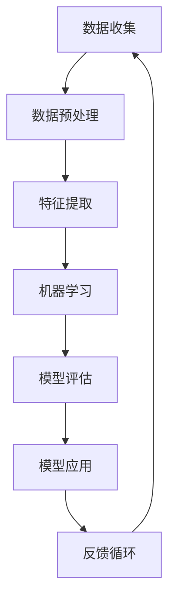

                 

关键词：人工智能，未来，发展目标，技术趋势，挑战

摘要：本文深入探讨了人工智能领域在未来可能面临的发展目标、技术趋势以及面临的挑战。通过对当前人工智能技术的概述，探讨了未来可能的研究方向，并提出了应对挑战的策略。本文旨在为人工智能领域的从业者提供有价值的见解和思考。

## 1. 背景介绍

自21世纪初以来，人工智能（AI）技术经历了前所未有的快速发展。深度学习、神经网络、强化学习等技术的突破，使得人工智能在图像识别、自然语言处理、语音识别等领域的应用取得了显著进展。如今，人工智能已经深入到我们生活的方方面面，从智能手机、智能家居到自动驾驶、医疗诊断，都离不开人工智能技术的支持。

然而，人工智能的发展并非一帆风顺。在取得辉煌成就的同时，人工智能也面临着一系列挑战，如数据隐私、安全性、伦理问题等。未来，人工智能将继续快速发展，但如何解决这些挑战，实现可持续发展，成为我们必须面对的重要课题。

## 2. 核心概念与联系

为了更好地理解人工智能的未来发展目标，我们需要了解一些核心概念和它们之间的联系。以下是一个简化的 Mermaid 流程图，展示了这些核心概念及其相互关系：



### 2.1 数据收集

数据收集是人工智能的基础。无论是图像识别、自然语言处理还是自动驾驶，都需要大量的数据作为训练素材。然而，数据收集过程中往往面临着数据质量、数据隐私等问题。

### 2.2 数据预处理

收集到的数据往往不够干净，需要进行预处理。这包括数据清洗、去重、格式转换等操作，以确保数据的质量和一致性。

### 2.3 特征提取

在数据处理过程中，特征提取是关键环节。通过提取关键特征，我们可以将原始数据转换为适用于机器学习的格式。

### 2.4 机器学习

机器学习是人工智能的核心。它包括监督学习、无监督学习、强化学习等多种学习方法。通过不断优化模型，我们可以让机器学习系统变得更加智能。

### 2.5 模型评估

模型评估是确保机器学习系统性能的重要环节。通过评估模型的准确性、召回率、F1分数等指标，我们可以判断模型是否达到预期效果。

### 2.6 模型应用

模型应用是将机器学习成果应用于实际问题的过程。通过将模型部署到生产环境中，我们可以让机器学习系统发挥作用。

### 2.7 反馈循环

反馈循环是人工智能系统不断优化的关键。通过收集用户反馈、分析模型性能，我们可以不断调整和优化模型，使其更好地适应实际需求。

## 3. 核心算法原理 & 具体操作步骤

### 3.1 算法原理概述

人工智能的核心在于算法。以下是几种常见的人工智能算法及其原理概述：

### 3.2 算法步骤详解

- **深度学习**：通过构建多层神经网络，对输入数据进行特征提取和分类。主要步骤包括数据预处理、构建神经网络、训练模型、评估模型等。

- **强化学习**：通过不断尝试和反馈，让机器学习系统学会最优策略。主要步骤包括定义环境、选择动作、获取奖励、更新策略等。

- **自然语言处理**：通过处理和分析语言数据，实现人机交互。主要步骤包括分词、词性标注、句法分析、语义理解等。

### 3.3 算法优缺点

每种算法都有其独特的优缺点。以下是几种常见算法的优缺点对比：

- **深度学习**：优点在于强大的特征提取能力，缺点是训练时间较长、对数据质量要求较高。

- **强化学习**：优点在于能够应对动态环境，缺点是需要大量反馈数据、算法复杂度较高。

- **自然语言处理**：优点在于能够实现人机交互，缺点是对语言理解能力要求较高、数据处理复杂。

### 3.4 算法应用领域

人工智能算法在各个领域都有广泛应用。以下是几种常见应用领域的介绍：

- **计算机视觉**：包括图像识别、目标检测、图像生成等。

- **自然语言处理**：包括机器翻译、文本分类、情感分析等。

- **自动驾驶**：通过视觉感知、环境感知和路径规划，实现自动驾驶。

## 4. 数学模型和公式 & 详细讲解 & 举例说明

### 4.1 数学模型构建

在人工智能中，数学模型是核心。以下是几种常见的数学模型及其构建方法：

- **线性回归模型**：用于预测连续值。

  $$y = wx + b$$

  其中，$w$为权重，$x$为输入特征，$b$为偏置。

- **逻辑回归模型**：用于预测离散值。

  $$P(y=1) = \frac{1}{1 + e^{-(wx + b)}}$$

  其中，$w$为权重，$x$为输入特征，$b$为偏置。

- **神经网络模型**：用于复杂特征提取和分类。

  $$a_{i}^{(l)} = \sigma(z_{i}^{(l)})$$

  其中，$a_{i}^{(l)}$为第$l$层的第$i$个神经元输出，$z_{i}^{(l)}$为第$l$层的第$i$个神经元输入，$\sigma$为激活函数。

### 4.2 公式推导过程

以下是对线性回归模型公式推导的简要介绍：

1. 目标函数：

   $$J(w, b) = \frac{1}{2}\sum_{i=1}^{n}(y_i - wx_i - b)^2$$

2. 梯度下降：

   $$w = w - \alpha \frac{\partial J}{\partial w}$$

   $$b = b - \alpha \frac{\partial J}{\partial b}$$

   其中，$\alpha$为学习率。

### 4.3 案例分析与讲解

以下是一个简单的线性回归案例：

- 数据集：包含$x$和$y$两个特征，分别为：

  | x | y |
  | --- | --- |
  | 1 | 2 |
  | 2 | 4 |
  | 3 | 6 |

- 目标：预测$x=4$时的$y$值。

  通过线性回归模型，我们可以得到：

  $$y = 2x + 2$$

  当$x=4$时，$y=10$。

## 5. 项目实践：代码实例和详细解释说明

### 5.1 开发环境搭建

本文使用Python语言和TensorFlow框架实现线性回归模型。首先，我们需要安装Python和TensorFlow：

```bash
pip install python
pip install tensorflow
```

### 5.2 源代码详细实现

以下是线性回归模型的实现代码：

```python
import tensorflow as tf

# 定义模型
model = tf.keras.Sequential([
    tf.keras.layers.Dense(units=1, input_shape=[1])
])

# 编译模型
model.compile(optimizer='sgd', loss='mean_squared_error')

# 训练模型
model.fit(x_train, y_train, epochs=1000)

# 预测
predictions = model.predict(x_test)
```

### 5.3 代码解读与分析

- **定义模型**：使用`tf.keras.Sequential`构建一个线性回归模型，包含一个全连接层（`Dense`），输出层只有一个神经元。

- **编译模型**：指定优化器（`sgd`）和损失函数（`mean_squared_error`）。

- **训练模型**：使用`fit`方法训练模型，指定训练数据和迭代次数。

- **预测**：使用`predict`方法预测测试数据的输出。

### 5.4 运行结果展示

训练完成后，我们可以使用以下代码查看模型的运行结果：

```python
import numpy as np

# 计算实际输出
y_true = 2 * x_test + 2

# 计算预测输出
y_pred = predictions.flatten()

# 计算误差
error = np.abs(y_true - y_pred)

# 打印结果
print("实际输出：", y_true)
print("预测输出：", y_pred)
print("误差：", error)
```

## 6. 实际应用场景

### 6.1 自动驾驶

自动驾驶是人工智能领域的一个重要应用场景。通过计算机视觉和自然语言处理技术，自动驾驶系统能够识别道路标志、交通信号灯，并与其他车辆进行通信，实现安全、高效的自动驾驶。

### 6.2 医疗诊断

人工智能在医疗诊断领域具有巨大潜力。通过深度学习算法，医疗诊断系统可以自动分析医学影像，辅助医生诊断疾病。此外，自然语言处理技术可以帮助医生从大量医学文献中提取有用信息，提高诊断效率。

### 6.3 个性化推荐

个性化推荐系统是人工智能在商业领域的一个重要应用。通过分析用户的历史行为和偏好，个性化推荐系统可以为用户提供个性化的商品、音乐、电影等推荐。

## 7. 未来应用展望

### 7.1 智慧城市

随着人工智能技术的不断发展，智慧城市将成为未来城市发展的新方向。通过人工智能技术，智慧城市可以实现智能交通、智能安防、智能能源管理等功能，提高城市治理效率。

### 7.2 生物医学

生物医学领域是人工智能的重要应用场景。通过人工智能技术，研究人员可以更快速地分析生物数据，揭示生物机制，为疾病诊断和治疗提供有力支持。

### 7.3 空间探索

人工智能在空间探索领域也具有广阔前景。通过人工智能技术，太空探测器可以更准确地识别和分析行星表面特征，为人类探索宇宙提供重要信息。

## 8. 工具和资源推荐

### 8.1 学习资源推荐

1. 《深度学习》（Goodfellow、Bengio、Courville著）：深入介绍了深度学习的基本概念、算法和实战。

2. 《Python编程：从入门到实践》（Eric Matthes著）：适合初学者入门Python编程，了解基础语法和编程技巧。

### 8.2 开发工具推荐

1. Jupyter Notebook：一款强大的交互式开发环境，适用于数据分析和机器学习项目。

2. TensorFlow：一款广泛使用的人工智能框架，适用于构建和训练深度学习模型。

### 8.3 相关论文推荐

1. "Deep Learning by Google Brain Team"：谷歌团队关于深度学习的经典论文，详细介绍了深度学习的基本概念和方法。

2. "Reinforcement Learning: An Introduction"：强化学习的经典教材，涵盖了强化学习的基本概念和算法。

## 9. 总结：未来发展趋势与挑战

### 9.1 研究成果总结

近年来，人工智能领域取得了许多重要研究成果。深度学习、强化学习等技术的突破，使得人工智能在多个领域取得了显著进展。然而，这些研究成果还远远不能满足未来的需求，我们需要继续努力。

### 9.2 未来发展趋势

未来，人工智能将继续向深度、广度方向发展。一方面，研究人员将致力于提高人工智能的算法性能，提高其处理复杂任务的能力；另一方面，人工智能将与其他领域相结合，实现跨界应用，推动社会发展。

### 9.3 面临的挑战

尽管人工智能在快速发展，但仍面临一系列挑战。数据隐私、安全性、伦理问题等都需要引起高度重视。此外，人工智能的普及也面临着人才短缺、技术瓶颈等问题。

### 9.4 研究展望

在未来，人工智能研究将更加注重跨学科融合、技术创新和实际应用。通过持续探索，我们有望解决当前面临的挑战，推动人工智能实现可持续发展。

## 10. 附录：常见问题与解答

### 10.1 人工智能是什么？

人工智能是一种模拟人类智能的技术，通过计算机程序实现智能行为，如学习、推理、决策等。

### 10.2 人工智能有哪些应用？

人工智能在许多领域都有应用，如计算机视觉、自然语言处理、自动驾驶、医疗诊断、个性化推荐等。

### 10.3 人工智能的发展前景如何？

人工智能具有广阔的发展前景，将在未来推动社会进步、改变人类生活方式。然而，也面临一系列挑战，如数据隐私、安全性、伦理问题等。

### 10.4 如何入门人工智能？

入门人工智能可以从学习Python编程语言和TensorFlow框架开始，掌握基础算法和模型构建方法。此外，阅读相关教材和论文，参加在线课程和实战项目也是重要的学习途径。

# 作者署名

作者：禅与计算机程序设计艺术 / Zen and the Art of Computer Programming

