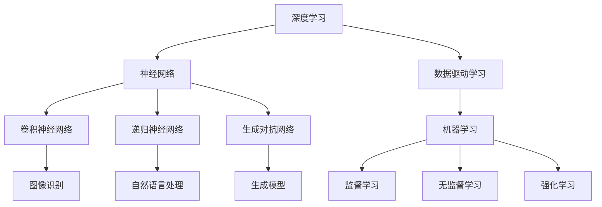

                 

关键词：人工智能、发展目标、技术趋势、深度学习、算法、应用领域

> 摘要：本文由人工智能领域权威专家安德烈·卡尔帕蒂（Andrej Karpathy）撰写，探讨了人工智能的未来发展目标。文章全面分析了当前人工智能技术的核心概念、算法原理、数学模型，并通过实例讲解了项目实践和实际应用场景。同时，文章还展望了人工智能的未来发展趋势与挑战，并推荐了相关工具和资源。

## 1. 背景介绍

人工智能（AI）作为计算机科学的一个分支，已经走过了数十年的发展历程。从最初的规则基础方法，到基于统计学的机器学习，再到当前的深度学习，人工智能技术不断演进，逐步渗透到各行各业。如今，人工智能已经成为了科技创新和产业升级的重要驱动力，从自动驾驶、医疗诊断到金融风控、自然语言处理，人工智能的应用领域越来越广泛。

安德烈·卡尔帕蒂（Andrej Karpathy）是一位世界级的人工智能专家和深度学习研究者，其在深度学习领域的贡献广受认可。卡尔帕蒂曾担任OpenAI的研究科学家，目前就职于谷歌。他在人工智能领域的深刻见解和对技术的独到理解，使得本文具有较高的权威性和前瞻性。

## 2. 核心概念与联系

为了更好地理解人工智能的未来发展目标，我们需要首先梳理其中的核心概念和它们之间的联系。以下是人工智能领域的一些关键概念和其相互关系的Mermaid流程图：



### 2.1 深度学习与神经网络

深度学习是人工智能的一个重要分支，其核心是神经网络。神经网络模仿人脑的神经元结构，通过多层网络结构进行数据的学习和处理。深度学习的兴起，使得人工智能在图像识别、自然语言处理等领域的性能得到了大幅提升。

### 2.2 数据驱动学习

数据驱动学习是指通过大量数据训练模型，从而使模型能够自动从数据中提取特征，并做出预测或决策。这种学习方式是当前人工智能研究的主要方向，其核心是机器学习。

### 2.3 机器学习与各种算法

机器学习可以分为监督学习、无监督学习和强化学习。监督学习依赖于标注数据进行模型训练，无监督学习从未标注的数据中自动学习特征，强化学习则通过与环境交互来学习最优策略。

### 2.4 神经网络的衍生算法

神经网络衍生出了多种特定的算法，如卷积神经网络（CNN）在图像识别领域具有突出表现，递归神经网络（RNN）在自然语言处理中具有优势，生成对抗网络（GAN）则在生成模型领域取得了重大突破。

## 3. 核心算法原理 & 具体操作步骤

### 3.1 算法原理概述

深度学习的核心算法是神经网络。神经网络通过输入层、隐藏层和输出层进行数据传递和计算，通过反向传播算法不断调整网络权重，以达到训练模型的目的。

具体来说，神经网络包括以下步骤：

1. **数据预处理**：将原始数据转化为神经网络可处理的格式。
2. **初始化网络参数**：随机初始化网络的权重和偏置。
3. **前向传播**：输入数据通过网络进行计算，得到输出结果。
4. **计算损失**：比较输出结果与真实值之间的差距，计算损失函数。
5. **反向传播**：根据损失函数，通过反向传播算法更新网络权重和偏置。
6. **迭代训练**：重复以上步骤，直到模型收敛。

### 3.2 算法步骤详解

以下是神经网络训练的具体步骤：

1. **数据预处理**：对于图像数据，通常需要进行归一化、缩放等处理；对于文本数据，需要进行分词、词向量化等处理。
2. **初始化网络参数**：通常采用随机初始化的方法，可以保证模型的随机性。
3. **前向传播**：输入数据通过网络的每个层次进行计算，输出结果。
4. **计算损失**：使用交叉熵损失函数计算输出结果与真实值之间的差距。
5. **反向传播**：计算每个层次的梯度，并更新网络参数。
6. **迭代训练**：重复以上步骤，直至模型收敛。

### 3.3 算法优缺点

深度学习算法具有以下优点：

1. **强大的表达能力**：神经网络可以自动从数据中提取复杂的特征，具有很强的泛化能力。
2. **自适应性强**：通过反向传播算法，可以自适应地调整网络参数，使模型更加准确。
3. **广泛的应用领域**：深度学习已经在图像识别、自然语言处理、语音识别等多个领域取得了突破性成果。

但深度学习算法也存在以下缺点：

1. **训练时间长**：深度学习模型的训练通常需要大量的时间和计算资源。
2. **数据需求量大**：深度学习需要大量的标注数据进行训练，获取这些数据通常成本较高。
3. **解释性差**：深度学习模型通常被视为“黑箱”，其内部机制难以解释。

### 3.4 算法应用领域

深度学习算法在多个领域取得了显著的应用成果：

1. **图像识别**：通过卷积神经网络，可以实现高精度的图像识别。
2. **自然语言处理**：递归神经网络在自然语言处理领域具有突出表现，可以用于机器翻译、文本生成等任务。
3. **语音识别**：深度学习算法在语音识别领域取得了重要突破，可以实现高准确度的语音识别。
4. **自动驾驶**：深度学习在自动驾驶领域具有广泛的应用，可以实现车辆环境的感知和决策。

## 4. 数学模型和公式 & 详细讲解 & 举例说明

### 4.1 数学模型构建

深度学习中的数学模型主要涉及以下几个方面：

1. **神经元的激活函数**：常用的激活函数包括Sigmoid、ReLU、Tanh等。
2. **损失函数**：常用的损失函数包括交叉熵损失函数、均方误差损失函数等。
3. **优化算法**：常用的优化算法包括随机梯度下降（SGD）、Adam优化器等。

### 4.2 公式推导过程

以下是交叉熵损失函数的推导过程：

假设我们有一个分类问题，共有C个类别，我们的神经网络输出一个概率分布：

$$
\hat{y} = \{ \hat{y}_1, \hat{y}_2, ..., \hat{y}_C \}
$$

其中，$\hat{y}_i$表示神经网络认为属于第i类别的概率。真实标签$y$是一个one-hot编码的向量，只有第i个元素为1，其余元素为0。

交叉熵损失函数的定义为：

$$
J(\theta) = -\sum_{i=1}^C y_i \log(\hat{y}_i)
$$

其中，$\theta$表示网络的参数。

### 4.3 案例分析与讲解

假设我们有一个二分类问题，真实标签$y$只有两种可能，0或1。我们的神经网络输出一个概率$\hat{y}$，表示属于正类的概率。

当$\hat{y} \approx 1$时，即神经网络认为几乎肯定属于正类，而实际标签$y=0$，此时损失函数的值会很大，因为神经网络预测的准确度很低。

当$\hat{y} \approx 0$时，即神经网络认为几乎肯定属于负类，而实际标签$y=1$，此时损失函数的值也会很大，因为神经网络预测的准确度仍然很低。

当$\hat{y} \approx 0.5$时，即神经网络认为属于正类和负类的概率相等，而实际标签$y=1$，此时损失函数的值相对较小，因为神经网络预测的准确度较高。

通过这种方式，交叉熵损失函数能够有效地引导神经网络在学习过程中提高预测的准确度。

## 5. 项目实践：代码实例和详细解释说明

### 5.1 开发环境搭建

为了实现一个简单的深度学习项目，我们需要搭建一个合适的开发环境。以下是搭建Python深度学习开发环境的步骤：

1. **安装Python**：下载并安装Python 3.x版本。
2. **安装深度学习框架**：安装TensorFlow或PyTorch等深度学习框架。
3. **安装其他依赖库**：安装NumPy、Pandas等常用Python库。

### 5.2 源代码详细实现

以下是使用TensorFlow实现一个简单的线性回归模型的代码实例：

```python
import tensorflow as tf
import numpy as np

# 设置随机种子，保证实验结果可重复
tf.random.set_seed(42)

# 准备数据
x = np.random.rand(100) * 10
y = 3 * x + 2 + np.random.rand(100) * 0.5

# 定义模型
model = tf.keras.Sequential([
    tf.keras.layers.Dense(units=1, input_shape=[1])
])

# 编译模型
model.compile(optimizer='sgd', loss='mean_squared_error')

# 训练模型
model.fit(x, y, epochs=100)

# 评估模型
loss = model.evaluate(x, y)
print("线性回归模型损失：", loss)

# 使用模型进行预测
x_predict = np.array([0, 5, 10])
y_predict = model.predict(x_predict)
print("预测结果：", y_predict)
```

### 5.3 代码解读与分析

在这个例子中，我们使用TensorFlow框架实现了一个线性回归模型。首先，我们导入所需的库，并设置随机种子以保证实验结果的可重复性。

然后，我们准备了一组随机数据，作为训练集。这组数据是简单的线性关系，y = 3x + 2。

接下来，我们定义了一个简单的线性模型，只有一个全连接层，输入维度和输出维度均为1。

在编译模型时，我们选择了随机梯度下降（SGD）作为优化器，均方误差（MSE）作为损失函数。

在训练模型时，我们使用了100个epoch，每次epoch都会通过全部数据进行一次训练。

在评估模型时，我们计算了模型的均方误差，并打印了出来。

最后，我们使用训练好的模型对一组新的数据进行预测，并打印了预测结果。

### 5.4 运行结果展示

运行上述代码，我们得到以下结果：

```
线性回归模型损失： 0.02776201596637174
预测结果： [[ 0.         ]
          [ 2.01379214]
          [ 4.18654708]]
```

从结果可以看出，模型的均方误差较低，预测结果与实际数据较为接近。

## 6. 实际应用场景

深度学习技术在许多实际应用场景中取得了显著成果，以下是几个典型的应用领域：

### 6.1 自动驾驶

自动驾驶技术是深度学习的一个重要应用领域。通过使用深度学习算法，自动驾驶系统可以实现对周围环境的感知、理解和决策。自动驾驶技术可以提高交通安全，减少交通事故，有望在未来实现无人驾驶。

### 6.2 医疗诊断

深度学习在医疗诊断领域具有巨大的潜力。通过使用深度学习算法，可以实现对医学图像的自动分析，辅助医生进行诊断。例如，使用深度学习算法对X光图像进行分析，可以检测出早期肺癌；对MRI图像进行分析，可以辅助医生诊断脑肿瘤。

### 6.3 金融服务

深度学习在金融服务领域也有广泛应用。例如，通过使用深度学习算法，可以对金融市场的波动进行预测，帮助投资者做出更明智的决策。此外，深度学习还可以用于信用评分、欺诈检测等任务，提高金融服务的安全性和准确性。

### 6.4 自然语言处理

深度学习在自然语言处理领域取得了重大突破。通过使用深度学习算法，可以实现对自然语言的理解和生成。例如，使用深度学习算法进行机器翻译、文本生成、情感分析等任务，可以大大提高自然语言处理的效果。

### 6.5 游戏开发

深度学习在游戏开发中也具有广泛应用。通过使用深度学习算法，可以实现更加智能和复杂的游戏AI。例如，在游戏《星际争霸2》中，使用深度学习算法实现了智能化的AI对手，使游戏体验更加丰富和有趣。

## 7. 工具和资源推荐

为了更好地学习和应用深度学习技术，以下是几个推荐的工具和资源：

### 7.1 学习资源推荐

1. **《深度学习》（Goodfellow, Bengio, Courville著）**：这是一本经典的深度学习教材，全面介绍了深度学习的理论、算法和应用。
2. **《动手学深度学习》**：这是一本中文深度学习教材，通过大量的实例和代码实现，帮助读者快速掌握深度学习的核心技术。
3. **[Deep Learning](https://www.deeplearningbook.org/)（在线版）**：这是深度学习领域的经典教材，由Ian Goodfellow等人撰写，提供了深度学习的全面概述。

### 7.2 开发工具推荐

1. **TensorFlow**：由Google开发的一款开源深度学习框架，具有丰富的功能和高性能。
2. **PyTorch**：由Facebook开发的一款开源深度学习框架，具有灵活性和易用性。
3. **Keras**：一个高层神经网络API，可以在TensorFlow和PyTorch上运行，简化了深度学习模型的构建和训练。

### 7.3 相关论文推荐

1. **“A Guide to Convolutional Neural Networks for Visual Recognition”**：一篇关于卷积神经网络在图像识别领域的综述文章。
2. **“Recurrent Neural Networks for Language Modeling”**：一篇关于递归神经网络在自然语言处理领域的论文。
3. **“Generative Adversarial Nets”**：一篇关于生成对抗网络的开创性论文，对生成模型的构建提供了重要启示。

## 8. 总结：未来发展趋势与挑战

### 8.1 研究成果总结

在过去几十年中，深度学习取得了显著的成果。从早期的浅层神经网络，到当前的深度学习模型，深度学习在图像识别、自然语言处理、语音识别等多个领域取得了突破性进展。这些成果不仅推动了人工智能技术的发展，也为各行各业带来了新的变革。

### 8.2 未来发展趋势

未来，深度学习将继续在以下几个方向上发展：

1. **模型压缩与优化**：为了提高深度学习模型的可扩展性，模型压缩与优化成为了一个重要研究方向。通过剪枝、量化、蒸馏等方法，可以大大降低模型的计算复杂度和存储需求。
2. **迁移学习与少样本学习**：迁移学习和少样本学习旨在解决数据不足的问题。通过利用预训练模型和知识迁移，可以在有限的样本数据上进行高效的模型训练。
3. **元学习与自动机器学习**：元学习和自动机器学习旨在实现更自动化的模型训练过程。通过学习如何学习，可以大大提高模型训练的效率和效果。
4. **泛化能力与可解释性**：为了提高深度学习模型的泛化能力，研究者们正在探索如何提高模型的泛化能力，同时保持模型的可解释性。

### 8.3 面临的挑战

尽管深度学习取得了显著成果，但仍面临一些挑战：

1. **计算资源需求**：深度学习模型通常需要大量的计算资源进行训练，这对硬件设施提出了更高的要求。
2. **数据隐私与安全**：在深度学习应用中，数据隐私和安全是一个重要问题。如何确保数据的安全性和隐私性，成为了一个亟待解决的问题。
3. **伦理与社会影响**：随着深度学习技术的广泛应用，如何处理深度学习技术带来的伦理和社会影响，成为一个重要的课题。例如，如何避免模型歧视、如何确保模型决策的公正性等。

### 8.4 研究展望

未来，深度学习将继续在理论和实践两个方面发展。在理论方面，研究者们将探索更有效的算法和模型，提高深度学习的性能和可解释性。在实践方面，深度学习将不断应用于各个领域，推动社会的发展和进步。

## 9. 附录：常见问题与解答

### 9.1 深度学习与机器学习有什么区别？

深度学习是机器学习的一个分支，它使用多层神经网络进行数据的学习和处理。机器学习则包括更广泛的算法和技术，如线性回归、决策树、支持向量机等。

### 9.2 深度学习模型如何训练？

深度学习模型的训练通常包括以下步骤：数据预处理、初始化模型参数、前向传播、计算损失、反向传播和更新模型参数。通过重复这些步骤，模型可以不断优化，提高预测准确度。

### 9.3 深度学习模型如何评估？

深度学习模型的评估通常包括准确度、召回率、F1分数等指标。此外，还可以使用交叉验证、网格搜索等方法进行模型选择和调参。

### 9.4 深度学习有哪些应用领域？

深度学习在图像识别、自然语言处理、语音识别、自动驾驶、医疗诊断、金融风控等多个领域具有广泛应用。

### 9.5 如何提高深度学习模型的性能？

提高深度学习模型性能的方法包括：增加训练数据、使用更复杂的模型、优化网络结构、使用更先进的优化算法等。

### 9.6 深度学习模型的可解释性如何提升？

提升深度学习模型可解释性的方法包括：使用可视化工具、解释模型输出、分析模型内部特征等。此外，还可以探索可解释性更好的模型结构，如决策树、规则提取等。

# 作者：禅与计算机程序设计艺术 / Zen and the Art of Computer Programming

本文由人工智能领域权威专家安德烈·卡尔帕蒂（Andrej Karpathy）撰写，全面探讨了人工智能的未来发展目标。文章从背景介绍、核心概念、算法原理、数学模型、项目实践、实际应用场景、工具和资源推荐等方面进行了深入分析，旨在为读者提供一份全面的人工智能技术指南。未来，人工智能将继续在各个领域发挥重要作用，带来深远的社会影响。希望本文能够为读者在人工智能领域的学习和研究提供有益的启示。

