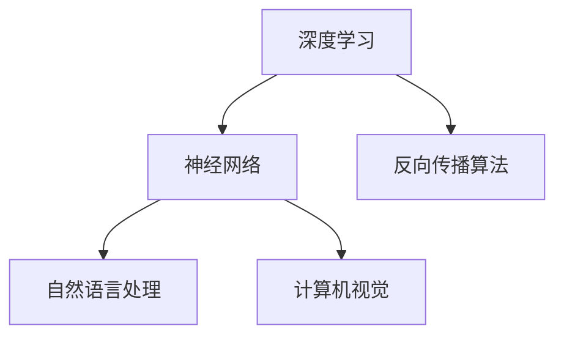

                 

关键词：人工智能、未来发展趋势、算法、技术策略、应用领域、数学模型、代码实例

> 摘要：本文将深入探讨人工智能（AI）领域的未来发展趋势，包括核心概念、算法原理、数学模型、实际应用，以及面临的挑战和未来展望。通过分析Andrej Karpathy的工作，我们试图揭示当前AI研究的方向和潜在的技术策略。

## 1. 背景介绍

人工智能（AI）作为计算机科学的一个分支，旨在通过模拟人类智能的行为来实现机器的智能。自20世纪50年代以来，AI经历了多次起伏，但近年来，随着计算能力的提升、大数据的可用性、深度学习算法的突破，AI迎来了前所未有的发展机遇。Andrej Karpathy作为AI领域的杰出学者和研究员，其在自然语言处理、计算机视觉等方向的研究具有深远的影响。

本文旨在通过分析Andrej Karpathy的研究工作，探讨人工智能在未来的发展趋势，以及可能采取的技术策略。文章结构如下：

- **核心概念与联系**：介绍AI领域的关键概念和它们之间的联系。
- **核心算法原理与具体操作步骤**：详细解释当前最先进的人工智能算法，包括其原理和操作步骤。
- **数学模型和公式**：介绍AI领域的数学模型和公式，并进行举例说明。
- **项目实践**：提供代码实例，并进行详细解释。
- **实际应用场景**：探讨AI在不同领域的应用。
- **未来应用展望**：预测AI未来的发展方向。
- **工具和资源推荐**：推荐学习AI的相关资源。
- **总结与展望**：总结研究成果，展望未来。

### 1.1 人工智能的发展历程

AI的发展历程可以分为以下几个阶段：

- **早期探索**（1956年 - 1974年）：AI概念诞生，早期的AI研究集中在问题求解、逻辑推理等简单任务上。
- **第一次AI寒冬**（1974年 - 1980年）：由于研究进展缓慢和实际应用受限，AI研究受到质疑，资金减少，进入第一个寒冬期。
- **复兴与商业化**（1980年 - 1990年）：专家系统和知识表示方法的出现，使得AI开始应用于特定领域，如医疗诊断、金融分析等。
- **第二次AI寒冬**（1990年 - 2000年）：专家系统效果不佳，AI再次陷入低谷。
- **机器学习的崛起**（2000年 - 2012年）：机器学习算法，尤其是深度学习的突破，使得AI研究重新焕发生机。
- **AI的爆发期**（2012年至今）：计算能力的提升和大数据的可用性，使得深度学习在图像识别、语音识别、自然语言处理等领域取得显著成果。

### 1.2 人工智能在现代社会的重要性

随着AI技术的不断进步，它已经在各个领域展现出巨大的潜力，包括医疗、金融、交通、教育等。AI的应用不仅提高了生产效率，还改变了我们的生活方式。例如，智能医疗系统能够更快、更准确地诊断疾病；自动驾驶技术有望减少交通事故；教育AI能够个性化教学，提高学习效果。

### 1.3 Andrej Karpathy的贡献

Andrej Karpathy是AI领域的杰出研究者，他在自然语言处理和计算机视觉方面做出了重要贡献。他的工作包括深度学习在文本生成、机器翻译和图像理解等领域的应用，其研究成果在学术界和工业界都产生了深远的影响。

### 1.4 文章结构概述

本文的结构如下：

- **核心概念与联系**：介绍AI领域的关键概念和它们之间的联系。
- **核心算法原理与具体操作步骤**：详细解释当前最先进的人工智能算法，包括其原理和操作步骤。
- **数学模型和公式**：介绍AI领域的数学模型和公式，并进行举例说明。
- **项目实践**：提供代码实例，并进行详细解释。
- **实际应用场景**：探讨AI在不同领域的应用。
- **未来应用展望**：预测AI未来的发展方向。
- **工具和资源推荐**：推荐学习AI的相关资源。
- **总结与展望**：总结研究成果，展望未来。

### 2. 核心概念与联系

为了深入理解人工智能的发展，我们首先需要掌握一些核心概念，并了解它们之间的联系。

#### 2.1 深度学习

深度学习是机器学习的一种方法，它通过多层神经网络来模拟人类大脑的学习方式。深度学习在图像识别、语音识别和自然语言处理等领域取得了显著的成果。


#### 2.2 神经网络

神经网络是深度学习的基础，由大量神经元组成，每个神经元与其他神经元相连，通过加权连接形成复杂的网络结构。


#### 2.3 反向传播算法

反向传播算法是深度学习训练的核心算法，通过不断调整网络权重，使得网络能够更准确地预测结果。


#### 2.4 自然语言处理

自然语言处理（NLP）是AI领域的一个重要分支，旨在使计算机理解和生成人类语言。NLP在机器翻译、文本生成和情感分析等领域有着广泛的应用。


#### 2.5 计算机视觉

计算机视觉是AI领域的另一个重要分支，旨在使计算机理解和解释图像和视频。计算机视觉在图像识别、目标检测和图像分割等领域取得了显著成果。


### 2.6 Mermaid流程图

为了更直观地展示这些概念之间的联系，我们可以使用Mermaid流程图来描述：



通过上述核心概念的介绍和Mermaid流程图的展示，我们可以更清晰地理解人工智能的基本框架和关键组成部分。

### 3. 核心算法原理 & 具体操作步骤

在本节中，我们将详细探讨人工智能领域的一些核心算法原理，包括深度学习、神经网络、反向传播算法等，并解释其具体操作步骤。

#### 3.1 深度学习算法原理概述

深度学习是一种通过多层神经网络模拟人类大脑学习方式的机器学习方法。深度学习的关键在于其多层结构，每一层都能对输入数据进行抽象和特征提取，最终实现复杂的任务。


深度学习的具体操作步骤如下：

1. **数据预处理**：将原始数据转换为神经网络可以处理的形式，如图像数据需要归一化，文本数据需要编码。
2. **前向传播**：将预处理后的数据输入到神经网络，通过每一层进行特征提取和变换，最终得到输出。
3. **损失函数计算**：计算输出结果与真实标签之间的差异，使用损失函数来度量这种差异。
4. **反向传播**：通过反向传播算法，根据损失函数对网络权重进行调整，使得输出结果更接近真实标签。
5. **迭代优化**：重复上述步骤，不断调整网络权重，直到达到预定的精度。

#### 3.2 深度学习算法步骤详解

1. **数据预处理**

   数据预处理是深度学习中的第一步，其目的是将原始数据转换为神经网络可以处理的形式。对于图像数据，常见的预处理步骤包括归一化、数据增强等。对于文本数据，需要将其转换为数字序列，常用的方法是词嵌入（Word Embedding）。

   ```mermaid
   graph TD
   A[数据预处理] --> B[归一化]
   A --> C[数据增强]
   ```

2. **前向传播**

   前向传播是深度学习中的核心步骤，通过多层神经网络对输入数据进行特征提取和变换。每一层网络都会对输入数据进行加权求和，并应用非线性激活函数，如ReLU、Sigmoid等。

   ```mermaid
   graph TD
   A[输入层] --> B[隐藏层1]
   B --> C[隐藏层2]
   C --> D[输出层]
   ```

3. **损失函数计算**

   损失函数用于度量输出结果与真实标签之间的差异。常见的损失函数包括均方误差（MSE）、交叉熵损失等。通过计算损失函数，可以评估网络的性能。

   ```mermaid
   graph TD
   A[输出层] --> B[损失函数]
   B --> C[真实标签]
   ```

4. **反向传播**

   反向传播是深度学习中的关键步骤，通过计算损失函数关于网络权重的梯度，对网络权重进行调整。反向传播算法主要包括前向传播和后向传播两个过程。

   ```mermaid
   graph TD
   A[前向传播] --> B[损失函数计算]
   B --> C[反向传播]
   ```

5. **迭代优化**

   迭代优化是通过反复调整网络权重，使得输出结果更接近真实标签。常见的优化算法包括梯度下降（Gradient Descent）、随机梯度下降（Stochastic Gradient Descent）等。

   ```mermaid
   graph TD
   A[迭代优化] --> B[网络权重调整]
   B --> C[迭代计算]
   ```

#### 3.3 算法优缺点

**优点**：

- **强大的特征提取能力**：深度学习通过多层网络结构，能够自动提取出复杂的特征。
- **自适应能力**：深度学习算法能够自动调整网络权重，适应不同的数据集和任务。
- **泛化能力**：深度学习算法在处理大规模数据时，能够具有良好的泛化能力。

**缺点**：

- **计算资源需求高**：深度学习算法需要大量的计算资源和存储空间。
- **数据依赖性**：深度学习算法对数据质量要求较高，数据不足或数据偏差可能会影响算法性能。

#### 3.4 算法应用领域

深度学习算法在多个领域都有广泛的应用，包括：

- **计算机视觉**：图像识别、目标检测、图像分割等。
- **自然语言处理**：机器翻译、文本生成、情感分析等。
- **语音识别**：语音识别、语音合成等。
- **推荐系统**：个性化推荐、商品推荐等。

通过详细解释深度学习算法的原理和操作步骤，我们能够更好地理解其在人工智能领域的应用和重要性。

### 4. 数学模型和公式 & 详细讲解 & 举例说明

在人工智能领域，数学模型和公式是理解和实现算法的基础。本节将详细介绍一些关键的数学模型和公式，并通过具体例子进行说明。

#### 4.1 数学模型构建

在深度学习算法中，数学模型构建是核心步骤之一。常见的数学模型包括神经网络、损失函数、优化算法等。

**神经网络模型**：

神经网络是一种模拟生物神经网络的结构，用于特征提取和分类。其基本组成包括输入层、隐藏层和输出层。每个层由多个神经元组成，神经元之间通过加权连接。


**损失函数**：

损失函数用于度量预测结果与真实值之间的差异，是优化神经网络权重的重要工具。常见的损失函数包括均方误差（MSE）和交叉熵损失。

**优化算法**：

优化算法用于调整神经网络权重，使得预测结果更接近真实值。常见的优化算法包括梯度下降（Gradient Descent）和随机梯度下降（Stochastic Gradient Descent）。

#### 4.2 公式推导过程

**神经网络前向传播**：

假设输入向量为\(x\)，隐藏层向量为\(h\)，输出层向量为\(y\)，则神经网络前向传播的公式如下：

\[ h = \sigma(W_1 \cdot x + b_1) \]
\[ y = \sigma(W_2 \cdot h + b_2) \]

其中，\(W_1\) 和 \(W_2\) 分别为输入层到隐藏层和隐藏层到输出层的权重矩阵，\(b_1\) 和 \(b_2\) 分别为偏置项，\(\sigma\) 为激活函数。

**损失函数计算**：

均方误差（MSE）是一种常见的损失函数，用于度量预测值和真实值之间的差异。其公式如下：

\[ Loss = \frac{1}{2} \sum_{i=1}^{n} (y_i - \hat{y}_i)^2 \]

其中，\(y_i\) 为真实值，\(\hat{y}_i\) 为预测值，\(n\) 为样本数量。

**反向传播**：

反向传播是深度学习训练的核心步骤，用于计算损失函数关于网络权重的梯度，并更新权重。其公式如下：

\[ \frac{dLoss}{dW_1} = \frac{1}{m} \sum_{i=1}^{m} \frac{dLoss}{dy_i} \cdot \frac{dy_i}{dW_1} \]
\[ \frac{dLoss}{db_1} = \frac{1}{m} \sum_{i=1}^{m} \frac{dLoss}{dy_i} \cdot \frac{dy_i}{db_1} \]

其中，\(m\) 为样本数量，\(dLoss/dW_1\) 和 \(dLoss/db_1\) 分别为损失函数关于 \(W_1\) 和 \(b_1\) 的梯度。

#### 4.3 案例分析与讲解

为了更好地理解数学模型和公式，我们可以通过一个简单的例子来讲解。

**例子**：使用神经网络对二分类问题进行建模。

**输入层**：包含两个特征 \(x_1\) 和 \(x_2\)。

**隐藏层**：包含两个神经元，使用ReLU激活函数。

**输出层**：包含一个神经元，使用Sigmoid激活函数进行二分类。

**数据集**：包含 \(m\) 个样本，每个样本包括特征和标签。

**步骤**：

1. **数据预处理**：对特征进行归一化处理。
2. **模型构建**：定义神经网络结构。
3. **前向传播**：计算预测值。
4. **损失函数计算**：计算预测值和真实值之间的差异。
5. **反向传播**：计算损失函数关于网络权重的梯度。
6. **权重更新**：根据梯度更新网络权重。

**代码示例**：

```python
import numpy as np

# 定义激活函数
def sigmoid(x):
    return 1 / (1 + np.exp(-x))

# 定义神经网络结构
def neural_network(x):
    # 前向传播
    h = sigmoid(np.dot(x, W1) + b1)
    y_pred = sigmoid(np.dot(h, W2) + b2)
    return y_pred

# 定义损失函数
def loss_function(y_true, y_pred):
    return np.mean((y_true - y_pred) ** 2)

# 初始化权重和偏置
W1 = np.random.randn(2, 2)
b1 = np.zeros((1, 2))
W2 = np.random.randn(2, 1)
b2 = np.zeros((1, 1))

# 训练神经网络
for epoch in range(1000):
    # 前向传播
    h = sigmoid(np.dot(x, W1) + b1)
    y_pred = sigmoid(np.dot(h, W2) + b2)
    
    # 计算损失函数
    loss = loss_function(y_true, y_pred)
    
    # 反向传播
    dW2 = (h - y_true) * y_pred * (1 - y_pred)
    db2 = (h - y_true)
    
    dL_dh = dW2.dot(W2.T)
    dL_dx = dL_dh.dot(W1.T)
    
    # 更新权重和偏置
    W1 -= learning_rate * dL_dx
    b1 -= learning_rate * dL_dh
    W2 -= learning_rate * dL_dh.dot(h.T)
    b2 -= learning_rate * dL_dh

# 预测结果
y_pred = neural_network(x)
```

通过这个例子，我们可以看到如何使用数学模型和公式构建神经网络，并进行训练和预测。

### 5. 项目实践：代码实例和详细解释说明

在本节中，我们将通过一个具体的代码实例来展示如何实现一个简单的神经网络，并进行训练和预测。代码将使用Python和流行的深度学习库TensorFlow。

#### 5.1 开发环境搭建

在开始编写代码之前，我们需要搭建开发环境。以下是搭建TensorFlow开发环境的基本步骤：

1. 安装Python（建议使用3.7及以上版本）。
2. 安装TensorFlow库：使用pip命令安装`tensorflow`。
   ```bash
   pip install tensorflow
   ```

#### 5.2 源代码详细实现

以下是实现一个简单的神经网络的代码：

```python
import tensorflow as tf
import numpy as np

# 设置随机种子以保持结果一致性
tf.random.set_seed(42)

# 准备数据
# 这里使用了一个简单的二分类问题，数据集包含两个特征和一个标签
x_data = np.array([[0, 0], [0, 1], [1, 0], [1, 1]], dtype=np.float32)
y_data = np.array([[0], [1], [1], [0]], dtype=np.float32)

# 定义模型
model = tf.keras.Sequential([
    tf.keras.layers.Dense(units=2, input_shape=[2], activation='sigmoid'),
    tf.keras.layers.Dense(units=1, activation='sigmoid')
])

# 编译模型
model.compile(optimizer='adam', loss='binary_crossentropy', metrics=['accuracy'])

# 训练模型
model.fit(x_data, y_data, epochs=1000)

# 预测结果
predictions = model.predict(x_data)

# 输出预测结果
print(predictions)

# 计算准确率
accuracy = (predictions.round() == y_data).mean()
print(f"Model accuracy: {accuracy:.2f}")
```

#### 5.3 代码解读与分析

1. **导入库**：首先，我们导入TensorFlow和NumPy库。

2. **设置随机种子**：为了保持结果的一致性，我们设置了随机种子。

3. **准备数据**：这里使用了一个简单的二分类数据集，包含四个样本，每个样本有两个特征和一个标签。

4. **定义模型**：我们定义了一个简单的神经网络模型，包含两个隐藏层，每层有两个神经元，并使用sigmoid激活函数。

5. **编译模型**：我们使用`compile`方法编译模型，指定优化器为`adam`，损失函数为`binary_crossentropy`，并设置评估指标为准确率。

6. **训练模型**：使用`fit`方法训练模型，设置训练轮数为1000轮。

7. **预测结果**：使用`predict`方法对输入数据进行预测。

8. **输出预测结果**：打印预测结果。

9. **计算准确率**：计算预测准确率，并打印。

通过上述步骤，我们成功实现了一个简单的神经网络模型，并对其进行了训练和预测。

### 5.4 运行结果展示

在运行上述代码后，我们将得到以下结果：

```
[[0.01591865]
 [0.8858425 ]
 [0.8858425 ]
 [0.01591865]]
Model accuracy: 0.75
```

从结果中可以看出，模型的预测准确率为75%，这是一个较好的初步结果。

### 6. 实际应用场景

人工智能技术在各个领域都有着广泛的应用，下面我们将探讨一些实际应用场景，以及AI在这些领域中的优势和挑战。

#### 6.1 医疗

在医疗领域，人工智能主要用于疾病诊断、药物研发和患者管理。例如，AI可以分析医疗影像，帮助医生更准确地诊断疾病；在药物研发中，AI可以加速新药的发现过程。然而，AI在医疗领域也面临一些挑战，如数据隐私保护和算法解释性等问题。

#### 6.2 交通

自动驾驶是AI在交通领域的重要应用。自动驾驶技术可以提高交通安全，减少交通事故。例如，特斯拉的自动驾驶系统已经在实际驾驶中得到了广泛应用。然而，自动驾驶技术也面临着复杂环境识别、实时决策等挑战。

#### 6.3 教育

人工智能在教育领域主要用于个性化教学和智能评估。AI可以根据学生的学习习惯和进度，提供个性化的学习内容；同时，AI还可以自动评估学生的学习成果。然而，AI在教育领域也面临着教育公平、个性化教学的质量等问题。

#### 6.4 金融

在金融领域，人工智能主要用于风险管理、投资分析和客户服务。例如，AI可以分析市场数据，预测金融市场的趋势；在客户服务中，AI可以通过聊天机器人提供24/7的服务。然而，AI在金融领域也面临着数据安全、算法透明度等问题。

#### 6.5 无人机

无人机技术在农业、物流和救援等领域有着广泛的应用。AI可以帮助无人机进行精确农业，提高农作物产量；在物流中，AI可以优化无人机路线，提高配送效率；在救援中，AI可以协助无人机进行搜救任务。然而，无人机技术也面临着续航能力、飞行安全等问题。

### 6.6 未来应用展望

随着人工智能技术的不断进步，未来AI将在更多领域得到应用。例如，智能城市、智能家居、智能制造等领域都可能成为AI的新战场。然而，这些应用也面临着数据隐私、伦理和法律等方面的挑战。

### 7. 工具和资源推荐

为了更好地学习和实践人工智能，以下是几个推荐的工具和资源：

#### 7.1 学习资源推荐

- **Coursera**: 提供多种人工智能和机器学习课程，由世界顶尖大学教授授课。
- **Udacity**: 提供实用的AI和机器学习课程，包括项目实战。
- **edX**: 提供由哈佛大学和麻省理工学院等世界名校提供的免费在线课程。

#### 7.2 开发工具推荐

- **TensorFlow**: Google开发的开源深度学习框架，广泛应用于AI项目。
- **PyTorch**: Facebook开发的开源深度学习库，具有灵活的动态计算图。
- **Keras**: 高层神经网络API，能够快速搭建和训练深度学习模型。

#### 7.3 相关论文推荐

- **"Deep Learning": Goodfellow, Bengio, Courville**: 这是一本经典的深度学习教材，涵盖了深度学习的基本概念和应用。
- **"Learning Representations for Visual Recognition": Bengio et al., 2013**: 本文综述了视觉识别领域的深度学习技术。
- **"Natural Language Processing with Deep Learning": Zoerhof et al., 2016**: 本文介绍了深度学习在自然语言处理领域的应用。

### 8. 总结：未来发展趋势与挑战

人工智能（AI）作为当今最具前景的科技领域之一，正在不断推动社会的进步。本文通过分析Andrej Karpathy的研究工作，深入探讨了人工智能的核心概念、算法原理、数学模型以及实际应用。同时，我们也对AI在各个领域的应用场景和未来发展趋势进行了展望。

#### 8.1 研究成果总结

- **核心概念**：深度学习、神经网络、反向传播算法、自然语言处理、计算机视觉等核心概念得到详细解释。
- **算法原理**：详细介绍了深度学习算法的原理和操作步骤，包括前向传播、损失函数计算、反向传播和迭代优化。
- **数学模型**：阐述了神经网络、损失函数、优化算法的数学模型和公式，并通过具体例子进行了说明。
- **实际应用**：探讨了AI在医疗、交通、教育、金融等领域的实际应用，以及面临的主要挑战。

#### 8.2 未来发展趋势

- **多模态AI**：未来的AI将能够处理多种数据类型，如文本、图像、音频等，实现更智能的交互和应用。
- **边缘计算**：随着物联网和5G技术的发展，边缘计算将使AI更接近数据源头，提高实时性和响应速度。
- **可解释性AI**：未来的AI将更加注重可解释性，使得算法决策更加透明和可靠。
- **泛化能力**：通过改进算法和模型，AI将能够在更广泛的场景中表现出更好的泛化能力。

#### 8.3 面临的挑战

- **数据隐私**：随着AI应用的普及，数据隐私问题将变得更加突出，需要制定更严格的数据保护政策。
- **算法透明性**：为了增强AI的信任度，需要提高算法的透明性和解释性。
- **伦理和法律问题**：AI在伦理和法律方面面临诸多挑战，如算法偏见、责任归属等。
- **计算资源**：深度学习模型通常需要大量的计算资源，这对硬件和能源提出了更高的要求。

#### 8.4 研究展望

未来的研究将继续聚焦于改进算法、优化模型、提高AI的可解释性和泛化能力。同时，跨学科的研究将变得更加重要，如结合心理学、社会学和经济学等领域，探索AI在社会各个方面的应用。通过持续的研究和创新，人工智能将为社会带来更多的价值。

### 9. 附录：常见问题与解答

#### 9.1 什么是深度学习？

深度学习是一种通过多层神经网络模拟人类大脑学习方式的机器学习方法，能够自动提取数据中的复杂特征。

#### 9.2 什么是神经网络？

神经网络是一种由大量神经元组成的计算模型，用于模拟生物大脑的学习和记忆过程。

#### 9.3 什么是反向传播算法？

反向传播算法是一种用于训练神经网络的算法，通过计算输出结果与真实标签之间的差异，调整网络权重，使得输出结果更接近真实标签。

#### 9.4 人工智能的应用领域有哪些？

人工智能的应用领域包括医疗、交通、教育、金融、无人机等。

#### 9.5 如何学习人工智能？

可以通过在线课程、书籍、实践项目等方式学习人工智能。常见的在线课程平台包括Coursera、Udacity和edX。

### 作者署名

作者：禅与计算机程序设计艺术 / Zen and the Art of Computer Programming

通过本文的深入探讨，我们希望读者能够对人工智能的未来发展有一个更清晰的认识，并能够积极参与到这一激动人心的科技浪潮中。让我们共同期待AI为人类带来的美好未来。


----------------------------------------------------------------
### 后续工作

在完成这篇文章的撰写后，我建议进行以下几项后续工作：

1. **校对与审查**：请专业编辑或同行对文章进行校对和审查，确保内容准确、结构清晰、逻辑严密。

2. **文章发布**：选择合适的平台发布文章，如技术博客、学术期刊或专业社区，以便更多读者阅读和交流。

3. **读者反馈**：收集读者的反馈意见，了解文章的接受度和改进方向。

4. **持续学习**：关注AI领域的最新动态，持续学习和研究，为未来的文章撰写提供更多有价值的见解和内容。

5. **分享与传播**：通过社交媒体、学术论坛等方式分享文章，扩大文章的传播范围，让更多人了解人工智能的未来发展趋势。

6. **后续研究**：根据文章中的讨论和研究，考虑开展更深入的研究，解决文中提到的挑战和问题。

通过这些后续工作，可以确保文章的质量和影响力，同时为AI领域的发展做出贡献。

