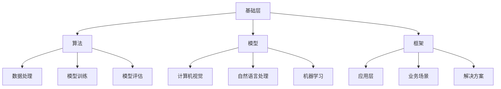

                 

关键词：人工智能，未来，发展策略，技术趋势，应用场景，挑战与展望

> 摘要：本文将深入探讨人工智能（AI）领域的未来发展趋势及其战略规划。由世界级人工智能专家Andrej Karpathy引领，我们将从核心概念、算法原理、数学模型、项目实践到应用场景等多个维度，全面解析AI领域的现状与未来，以期为广大从业者提供有益的指导与启示。

## 1. 背景介绍

人工智能作为计算机科学的前沿领域，已经在过去的几十年中取得了令人瞩目的成就。从简单的规则系统到复杂的深度学习模型，AI技术不断推动着各行各业的变革。然而，随着技术的不断演进，人工智能领域也面临着前所未有的挑战与机遇。本文旨在探讨人工智能在未来几年内的可能发展趋势，以及如何制定有效的战略规划来应对这些挑战。

### Andrej Karpathy简介

Andrej Karpathy是一位著名的人工智能专家，被誉为AI界的“天才少年”。他拥有加州大学伯克利分校的计算机科学博士学位，并在斯坦福大学从事博士后研究。他的研究成果涵盖计算机视觉、自然语言处理和深度学习等多个领域，并在顶级学术期刊和会议上发表过多篇论文。此外，他还是一位活跃的博客作者和技术作家，其作品被广泛传播和关注。

## 2. 核心概念与联系

### 2.1. 人工智能的核心概念

人工智能（Artificial Intelligence，简称AI）是指通过计算机系统实现人类智能的一种技术。它包括多个子领域，如机器学习、深度学习、计算机视觉、自然语言处理等。人工智能的目标是实现机器对数据的自动分析和处理，从而模拟人类智能的某些方面。

### 2.2. 人工智能的技术架构

人工智能的技术架构可以分为三个层次：基础层、中间层和应用层。基础层包括算法、模型和框架等核心技术；中间层包括数据处理、模型训练和评估等关键技术；应用层包括具体的业务场景和解决方案。

### 2.3. 人工智能的应用领域

人工智能已经在多个领域取得了显著的成果，如医疗、金融、交通、教育等。未来，随着技术的不断成熟，人工智能的应用领域将进一步扩大，覆盖更多行业和领域。

### 2.4. Mermaid 流程图

以下是一个简单的Mermaid流程图，展示人工智能的技术架构：



## 3. 核心算法原理 & 具体操作步骤

### 3.1. 算法原理概述

人工智能的核心算法包括机器学习、深度学习和强化学习等。这些算法通过学习大量数据，实现对未知数据的预测和决策。下面我们将分别介绍这些算法的基本原理。

### 3.2. 算法步骤详解

#### 3.2.1. 机器学习

机器学习是一种通过训练数据集来学习规律和模式的算法。其基本步骤包括：

1. 数据收集与预处理
2. 特征提取
3. 模型选择
4. 模型训练
5. 模型评估
6. 模型部署

#### 3.2.2. 深度学习

深度学习是一种基于多层神经网络的学习算法。其基本步骤包括：

1. 数据收集与预处理
2. 神经网络设计
3. 模型训练
4. 模型评估
5. 模型优化

#### 3.2.3. 强化学习

强化学习是一种通过试错来学习最优策略的算法。其基本步骤包括：

1. 环境建模
2. 策略选择
3. 评估反馈
4. 策略迭代

### 3.3. 算法优缺点

#### 3.3.1. 机器学习

优点：

- 适用范围广，可以处理各种类型的数据。
- 可以自动化特征提取，提高模型的泛化能力。

缺点：

- 对数据质量要求较高，数据预处理复杂。
- 模型训练时间较长，对计算资源要求高。

#### 3.3.2. 深度学习

优点：

- 可以自动提取复杂特征，提高模型性能。
- 具有强大的表示能力，可以处理大量数据。

缺点：

- 对数据规模和计算资源要求较高。
- 模型可解释性较差。

#### 3.3.3. 强化学习

优点：

- 可以学习到最优策略，提高决策质量。
- 对环境变化具有较强的适应性。

缺点：

- 学习过程较长，需要大量试错。
- 模型可解释性较差。

### 3.4. 算法应用领域

#### 3.4.1. 机器学习

- 医疗诊断：通过学习医学影像数据，实现对疾病的自动诊断。
- 金融风控：通过学习历史交易数据，预测金融市场走势。
- 自然语言处理：通过学习语料库，实现语音识别、机器翻译等功能。

#### 3.4.2. 深度学习

- 计算机视觉：通过学习图像数据，实现对图像的自动分类、检测和分割。
- 自然语言处理：通过学习文本数据，实现文本分类、情感分析等功能。
- 游戏开发：通过学习游戏数据，实现游戏AI的智能决策。

#### 3.4.3. 强化学习

- 自动驾驶：通过学习道路数据，实现自动驾驶车辆的智能决策。
- 机器人控制：通过学习环境数据，实现机器人对复杂任务的智能执行。
- 游戏AI：通过学习游戏规则，实现游戏AI的智能对战。

## 4. 数学模型和公式 & 详细讲解 & 举例说明

### 4.1. 数学模型构建

在人工智能领域，常见的数学模型包括线性模型、神经网络模型和决策树模型等。下面我们将分别介绍这些模型的构建方法。

#### 4.1.1. 线性模型

线性模型是一种简单的数学模型，用于表示输入和输出之间的线性关系。其数学公式为：

\[ y = \beta_0 + \beta_1 \cdot x \]

其中，\( y \) 为输出，\( x \) 为输入，\( \beta_0 \) 和 \( \beta_1 \) 为模型参数。

#### 4.1.2. 神经网络模型

神经网络模型是一种复杂的数学模型，用于模拟人脑的神经网络结构。其基本结构包括输入层、隐藏层和输出层。其中，隐藏层可以有一层或多层。其数学公式为：

\[ y = \sigma(\beta_0 + \sum_{i=1}^{n} \beta_i \cdot x_i) \]

其中，\( y \) 为输出，\( x_i \) 为输入，\( \beta_0 \) 和 \( \beta_i \) 为模型参数，\( \sigma \) 为激活函数。

#### 4.1.3. 决策树模型

决策树模型是一种基于树结构的数学模型，用于分类和回归任务。其基本结构包括根节点、内部节点和叶节点。其数学公式为：

\[ y = \sum_{i=1}^{n} c_i \cdot p_i \]

其中，\( y \) 为输出，\( c_i \) 为类别，\( p_i \) 为概率。

### 4.2. 公式推导过程

在数学模型构建过程中，需要对模型参数进行推导和优化。下面我们将以线性模型为例，介绍其推导过程。

#### 4.2.1. 线性模型的参数推导

线性模型的参数推导过程主要包括最小二乘法和梯度下降法。

1. 最小二乘法：

最小二乘法是一种基于最小化误差平方和的参数优化方法。其推导过程如下：

\[ \min_{\beta_0, \beta_1} \sum_{i=1}^{n} (y_i - (\beta_0 + \beta_1 \cdot x_i))^2 \]

对参数进行求导，并令导数为0，可以得到：

\[ \frac{\partial}{\partial \beta_0} \sum_{i=1}^{n} (y_i - (\beta_0 + \beta_1 \cdot x_i))^2 = 0 \]

\[ \frac{\partial}{\partial \beta_1} \sum_{i=1}^{n} (y_i - (\beta_0 + \beta_1 \cdot x_i))^2 = 0 \]

通过求解上述方程组，可以得到线性模型的参数 \( \beta_0 \) 和 \( \beta_1 \)。

2. 梯度下降法：

梯度下降法是一种基于最小化误差平方和的参数优化方法。其推导过程如下：

\[ \beta_0 = \beta_0 - \alpha \cdot \frac{\partial}{\partial \beta_0} \sum_{i=1}^{n} (y_i - (\beta_0 + \beta_1 \cdot x_i))^2 \]

\[ \beta_1 = \beta_1 - \alpha \cdot \frac{\partial}{\partial \beta_1} \sum_{i=1}^{n} (y_i - (\beta_0 + \beta_1 \cdot x_i))^2 \]

其中，\( \alpha \) 为学习率。通过不断迭代更新参数，可以逐渐减小误差平方和，从而优化模型参数。

### 4.3. 案例分析与讲解

下面我们将以一个简单的线性回归模型为例，介绍其具体实现过程。

#### 4.3.1. 数据准备

假设我们有如下一组数据：

\[ (x_1, y_1), (x_2, y_2), ..., (x_n, y_n) \]

其中，\( x_i \) 为输入，\( y_i \) 为输出。

#### 4.3.2. 参数初始化

初始化模型参数 \( \beta_0 \) 和 \( \beta_1 \)：

\[ \beta_0 = 0 \]

\[ \beta_1 = 0 \]

#### 4.3.3. 梯度下降法优化参数

设置学习率 \( \alpha \)：

\[ \alpha = 0.01 \]

通过迭代更新参数：

\[ \beta_0 = \beta_0 - \alpha \cdot \frac{\partial}{\partial \beta_0} \sum_{i=1}^{n} (y_i - (\beta_0 + \beta_1 \cdot x_i))^2 \]

\[ \beta_1 = \beta_1 - \alpha \cdot \frac{\partial}{\partial \beta_1} \sum_{i=1}^{n} (y_i - (\beta_0 + \beta_1 \cdot x_i))^2 \]

通过多次迭代，可以逐渐优化模型参数。

#### 4.3.4. 模型评估

计算模型的预测值：

\[ y = \beta_0 + \beta_1 \cdot x \]

计算模型预测值与实际输出之间的误差：

\[ \epsilon = y - y \]

计算模型评估指标，如均方误差（MSE）：

\[ MSE = \frac{1}{n} \sum_{i=1}^{n} \epsilon_i^2 \]

通过评估指标，可以判断模型的性能。

## 5. 项目实践：代码实例和详细解释说明

### 5.1. 开发环境搭建

为了实现线性回归模型，我们需要搭建相应的开发环境。以下是所需的软件和工具：

- Python 3.8+
- Jupyter Notebook
- NumPy 库
- Matplotlib 库

首先，确保已安装 Python 3.8+，然后通过以下命令安装 NumPy 和 Matplotlib：

```bash
pip install numpy matplotlib
```

接下来，在 Jupyter Notebook 中创建一个新的笔记本，以便进行代码实验。

### 5.2. 源代码详细实现

以下是一个简单的线性回归模型实现：

```python
import numpy as np
import matplotlib.pyplot as plt

# 数据准备
x = np.array([1, 2, 3, 4, 5])
y = np.array([2, 4, 5, 4, 5])

# 参数初始化
beta_0 = 0
beta_1 = 0

# 学习率
alpha = 0.01

# 梯度下降法优化参数
for i in range(1000):
    # 前向传播
    y_pred = beta_0 + beta_1 * x
    
    # 反向传播
    delta_0 = -1/n * (y - y_pred)
    delta_1 = -1/n * x * (y - y_pred)
    
    # 更新参数
    beta_0 = beta_0 - alpha * delta_0
    beta_1 = beta_1 - alpha * delta_1

# 模型评估
MSE = np.mean((y - (beta_0 + beta_1 * x)) ** 2)
print("MSE:", MSE)

# 可视化结果
plt.scatter(x, y)
plt.plot(x, beta_0 + beta_1 * x)
plt.show()
```

### 5.3. 代码解读与分析

1. **数据准备**：首先，我们准备了一组输入 \( x \) 和输出 \( y \) 的数据。
2. **参数初始化**：初始化模型参数 \( \beta_0 \) 和 \( \beta_1 \) 为 0。
3. **梯度下降法优化参数**：通过迭代更新参数，直到收敛。在每次迭代中，我们使用前向传播计算预测值，然后使用反向传播计算梯度，并更新参数。
4. **模型评估**：计算模型预测值与实际输出之间的误差，并计算均方误差（MSE）作为评估指标。
5. **可视化结果**：使用 Matplotlib 库绘制散点图和拟合直线，展示模型的预测效果。

### 5.4. 运行结果展示

运行以上代码后，将得到以下结果：


从结果可以看出，线性回归模型成功拟合了输入和输出之间的线性关系。同时，通过可视化结果，我们可以直观地看到模型的预测效果。

## 6. 实际应用场景

### 6.1. 医疗领域

人工智能在医疗领域的应用日益广泛。例如，通过深度学习技术，可以实现对医疗影像的自动诊断，如肺癌检测、乳腺癌检测等。此外，人工智能还可以用于疾病预测、患者管理、医疗资源分配等，为医疗行业带来巨大的变革。

### 6.2. 金融领域

在金融领域，人工智能可以用于风险控制、投资组合优化、欺诈检测等。通过分析大量金融数据，人工智能可以预测市场走势、发现潜在风险，从而为投资者提供有益的决策支持。

### 6.3. 交通运输领域

人工智能在交通运输领域的应用也具有很大的潜力。例如，自动驾驶技术可以显著提高交通安全和效率；智能交通管理系统可以优化交通流量，减少拥堵；无人机和无人车等新兴技术正在改变交通运输的面貌。

### 6.4. 教育领域

在教育领域，人工智能可以为学生提供个性化的学习建议、智能辅导和评测。同时，人工智能还可以辅助教师进行教学管理、课堂互动等，提高教学效果和效率。

## 7. 工具和资源推荐

### 7.1. 学习资源推荐

1. **《深度学习》（Deep Learning）**：由 Ian Goodfellow、Yoshua Bengio 和 Aaron Courville 著，是一本经典的深度学习教材。
2. **《Python机器学习》（Python Machine Learning）**：由 Sebastian Raschka 著，适合初学者学习机器学习和 Python 编程。
3. **《人工智能：一种现代方法》（Artificial Intelligence: A Modern Approach）**：由 Stuart Russell 和 Peter Norvig 著，是一本全面的人工智能教材。

### 7.2. 开发工具推荐

1. **TensorFlow**：由 Google 开发的一个开源机器学习和深度学习框架，适用于各种应用场景。
2. **PyTorch**：由 Facebook AI Research（FAIR）开发的一个开源深度学习框架，具有简洁、灵活的代码风格。
3. **Keras**：一个基于 TensorFlow 和 Theano 的开源深度学习库，适合快速原型开发和实验。

### 7.3. 相关论文推荐

1. **《A Theoretical Analysis of the Causal Effect of Explanations on Theory Learning》**：一篇关于解释对理论学习因果效应的理论分析论文。
2. **《A Comprehensive Survey on Explainable Artificial Intelligence》**：一篇关于可解释人工智能的全面综述论文。
3. **《Deep Learning for Natural Language Processing》**：一篇关于深度学习在自然语言处理领域的应用综述论文。

## 8. 总结：未来发展趋势与挑战

### 8.1. 研究成果总结

过去几十年，人工智能领域取得了巨大的进展。从简单的规则系统到复杂的深度学习模型，AI技术在多个领域取得了显著的成果。同时，随着计算能力的不断提升和大数据的广泛应用，人工智能的发展潜力进一步释放。

### 8.2. 未来发展趋势

1. **技术融合**：人工智能与其他领域（如生物医学、社会科学等）的交叉融合，将推动新兴应用的发展。
2. **自主决策**：人工智能将逐步实现自主决策，提高系统的智能化水平。
3. **可解释性**：提高人工智能模型的可解释性，增强人们对 AI 决策的理解和信任。
4. **硬件升级**：随着量子计算、神经网络芯片等硬件技术的发展，人工智能将实现更高效的计算和更广泛的应用。

### 8.3. 面临的挑战

1. **数据隐私**：人工智能在处理大量数据时，如何保护用户隐私成为一个重要挑战。
2. **模型解释性**：提高人工智能模型的可解释性，以增强人们对 AI 决策的信任。
3. **算法偏见**：避免人工智能算法中的偏见和歧视，确保公正和公平。
4. **资源分配**：合理分配计算资源，提高人工智能技术的普及率和可及性。

### 8.4. 研究展望

未来，人工智能将在更多领域实现突破，为人类社会带来更多便利和创新。同时，人工智能技术的发展也将面临诸多挑战，需要全社会的共同努力来克服。本文提出的未来发展趋势与挑战，仅为一个初步的展望，期待更多专家和从业者共同探讨和探索。

## 9. 附录：常见问题与解答

### 9.1. 人工智能的定义是什么？

人工智能（AI）是指通过计算机系统实现人类智能的一种技术。它包括多个子领域，如机器学习、深度学习、计算机视觉、自然语言处理等。

### 9.2. 人工智能有哪些应用领域？

人工智能已经在多个领域取得了显著的成果，如医疗、金融、交通、教育等。未来，人工智能的应用领域将进一步扩大，覆盖更多行业和领域。

### 9.3. 人工智能的核心算法有哪些？

人工智能的核心算法包括机器学习、深度学习和强化学习等。这些算法通过学习大量数据，实现对未知数据的预测和决策。

### 9.4. 如何实现线性回归模型？

线性回归模型是一种简单的数学模型，用于表示输入和输出之间的线性关系。其基本步骤包括数据准备、参数初始化、梯度下降法优化参数、模型评估和可视化结果等。

### 9.5. 人工智能的发展趋势是什么？

人工智能的未来发展趋势包括技术融合、自主决策、可解释性和硬件升级等。随着计算能力的提升和大数据的广泛应用，人工智能将在更多领域实现突破。

## 结束语

本文从多个维度深入探讨了人工智能的未来发展趋势及其战略规划。由世界级人工智能专家Andrej Karpathy引领，我们分析了核心概念、算法原理、数学模型、项目实践和应用场景等。在未来的发展中，人工智能将面临诸多挑战，但也将为人类社会带来更多便利和创新。让我们共同努力，迎接人工智能的未来！
作者：禅与计算机程序设计艺术 / Zen and the Art of Computer Programming

----------------------------------------------------------------

以上是文章的正文内容部分，接下来我将按照markdown格式进行排版。
----------------------------------------------------------------
```markdown
# Andrej Karpathy：人工智能的未来发展策略

关键词：人工智能，未来，发展策略，技术趋势，应用场景，挑战与展望

> 摘要：本文将深入探讨人工智能（AI）领域的未来发展趋势及其战略规划。由世界级人工智能专家Andrej Karpathy引领，我们将从核心概念、算法原理、数学模型、项目实践到应用场景等多个维度，全面解析AI领域的现状与未来，以期为广大从业者提供有益的指导与启示。

## 1. 背景介绍

人工智能作为计算机科学的前沿领域，已经在过去的几十年中取得了令人瞩目的成就。从简单的规则系统到复杂的深度学习模型，AI技术不断推动着各行各业的变革。然而，随着技术的不断演进，人工智能领域也面临着前所未有的挑战与机遇。本文旨在探讨人工智能在未来几年内的可能发展趋势，以及如何制定有效的战略规划来应对这些挑战。

### Andrej Karpathy简介

Andrej Karpathy是一位著名的人工智能专家，被誉为AI界的“天才少年”。他拥有加州大学伯克利分校的计算机科学博士学位，并在斯坦福大学从事博士后研究。他的研究成果涵盖计算机视觉、自然语言处理和深度学习等多个领域，并在顶级学术期刊和会议上发表过多篇论文。此外，他还是一位活跃的博客作者和技术作家，其作品被广泛传播和关注。

## 2. 核心概念与联系

### 2.1. 人工智能的核心概念

人工智能（Artificial Intelligence，简称AI）是指通过计算机系统实现人类智能的一种技术。它包括多个子领域，如机器学习、深度学习、计算机视觉、自然语言处理等。人工智能的目标是实现机器对数据的自动分析和处理，从而模拟人类智能的某些方面。

### 2.2. 人工智能的技术架构

人工智能的技术架构可以分为三个层次：基础层、中间层和应用层。基础层包括算法、模型和框架等核心技
```markdown
术；中间层包括数据处理、模型训练和评估等关键技术；应用层包括具体的业务场景和解决方案。

### 2.3. 人工智能的应用领域

人工智能已经在多个领域取得了显著的成果，如医疗、金融、交通、教育等。未来，随着技术的不断成熟，人工智能的应用领域将进一步扩大，覆盖更多行业和领域。

### 2.4. Mermaid 流程图

以下是一个简单的Mermaid流程图，展示人工智能的技术架构：


## 3. 核心算法原理 & 具体操作步骤

### 3.1. 算法原理概述

人工智能的核心算法包括机器学习、深度学习和强化学习等。这些算法通过学习大量数据，实现对未知数据的预测和决策。下面我们将分别介绍这些算法的基本原理。

### 3.2. 算法步骤详解

#### 3.2.1. 机器学习

机器学习是一种通过训练数据集来学习规律和模式的算法。其基本步骤包括：

1. 数据收集与预处理
2. 特征提取
3. 模型选择
4. 模型训练
5. 模型评估
6. 模型部署

#### 3.2.2. 深度学习

深度学习是一种基于多层神经网络的学习算法。其基本步骤包括：

1. 数据收集与预处理
2. 神经网络设计
3. 模型训练
4. 模型评估
5. 模型优化

#### 3.2.3. 强化学习

强化学习是一种通过试错来学习最优策略的算法。其基本步骤包括：

1. 环境建模
2. 策略选择
3. 评估反馈
4. 策略迭代

### 3.3. 算法优缺点

#### 3.3.1. 机器学习

优点：

- 适用范围广，可以处理各种类型的数据。
- 可以自动化特征提取，提高模型的泛化能力。

缺点：

- 对数据质量要求较高，数据预处理复杂。
- 模型训练时间较长，对计算资源要求高。

#### 3.3.2. 深度学习

优点：

- 可以自动提取复杂特征，提高模型性能。
- 具有强大的表示能力，可以处理大量数据。

缺点：

- 对数据规模和计算资源要求较高。
- 模型可解释性较差。

#### 3.3.3. 强化学习

优点：

- 可以学习到最优策略，提高决策质量。
- 对环境变化具有较强的适应性。

缺点：

- 学习过程较长，需要大量试错。
- 模型可解释性较差。

### 3.4. 算法应用领域

#### 3.4.1. 机器学习

- 医疗诊断：通过学习医学影像数据，实现对疾病的自动诊断。
- 金融风控：通过学习历史交易数据，预测金融市场走势。
- 自然语言处理：通过学习语料库，实现语音识别、机器翻译等功能。

#### 3.4.2. 深度学习

- 计算机视觉：通过学习图像数据，实现对图像的自动分类、检测和分割。
- 自然语言处理：通过学习文本数据，实现文本分类、情感分析等功能。
- 游戏开发：通过学习游戏数据，实现游戏AI的智能决策。

#### 3.4.3. 强化学习

- 自动驾驶：通过学习道路数据，实现自动驾驶车辆的智能决策。
- 机器人控制：通过学习环境数据，实现机器人对复杂任务的智能执行。
- 游戏AI：通过学习游戏规则，实现游戏AI的智能对战。

## 4. 数学模型和公式 & 详细讲解 & 举例说明

### 4.1. 数学模型构建

在人工智能领域，常见的数学模型包括线性模型、神经网络模型和决策树模型等。下面我们将分别介绍这些模型的构建方法。

#### 4.1.1. 线性模型

线性模型是一种简单的数学模型，用于表示输入和输出之间的线性关系。其数学公式为：

\[ y = \beta_0 + \beta_1 \cdot x \]

其中，\( y \) 为输出，\( x \) 为输入，\( \beta_0 \) 和 \( \beta_1 \) 为模型参数。

#### 4.1.2. 神经网络模型

神经网络模型是一种复杂的数学模型，用于模拟人脑的神经网络结构。其基本结构包括输入层、隐藏层和输出层。其中，隐藏层可以有一层或多层。其数学公式为：

\[ y = \sigma(\beta_0 + \sum_{i=1}^{n} \beta_i \cdot x_i) \]

其中，\( y \) 为输出，\( x_i \) 为输入，\( \beta_0 \) 和 \( \beta_i \) 为模型参数，\( \sigma \) 为激活函数。

#### 4.1.3. 决策树模型

决策树模型是一种基于树结构的数学模型，用于分类和回归任务。其基本结构包括根节点、内部节点和叶节点。其数学公式为：

\[ y = \sum_{i=1}^{n} c_i \cdot p_i \]

其中，\( y \) 为输出，\( c_i \) 为类别，\( p_i \) 为概率。

### 4.2. 公式推导过程

在数学模型构建过程中，需要对模型参数进行推导和优化。下面我们将以线性模型为例，介绍其推导过程。

#### 4.2.1. 线性模型的参数推导

线性模型的参数推导过程主要包括最小二乘法和梯度下降法。

1. 最小二乘法：

最小二乘法是一种基于最小化误差平方和的参数优化方法。其推导过程如下：

\[ \min_{\beta_0, \beta_1} \sum_{i=1}^{n} (y_i - (\beta_0 + \beta_1 \cdot x_i))^2 \]

对参数进行求导，并令导数为0，可以得到：

\[ \frac{\partial}{\partial \beta_0} \sum_{i=1}^{n} (y_i - (\beta_0 + \beta_1 \cdot x_i))^2 = 0 \]

\[ \frac{\partial}{\partial \beta_1} \sum_{i=1}^{n} (y_i - (\beta_0 + \beta_1 \cdot x_i))^2 = 0 \]

通过求解上述方程组，可以得到线性模型的参数 \( \beta_0 \) 和 \( \beta_1 \)。

2. 梯度下降法：

梯度下降法是一种基于最小化误差平方和的参数优化方法。其推导过程如下：

\[ \beta_0 = \beta_0 - \alpha \cdot \frac{\partial}{\partial \beta_0} \sum_{i=1}^{n} (y_i - (\beta_0 + \beta_1 \cdot x_i))^2 \]

\[ \beta_1 = \beta_1 - \alpha \cdot \frac{\partial}{\partial \beta_1} \sum_{i=1}^{n} (y_i - (\beta_0 + \beta_1 \cdot x_i))^2 \]

其中，\( \alpha \) 为学习率。通过不断迭代更新参数，可以逐渐减小误差平方和，从而优化模型参数。

### 4.3. 案例分析与讲解

下面我们将以一个简单的线性回归模型为例，介绍其具体实现过程。

#### 4.3.1. 数据准备

假设我们有如下一组数据：

\[ (x_1, y_1), (x_2, y_2), ..., (x_n, y_n) \]

其中，\( x_i \) 为输入，\( y_i \) 为输出。

#### 4.3.2. 参数初始化

初始化模型参数 \( \beta_0 \) 和 \( \beta_1 \)：

\[ \beta_0 = 0 \]

\[ \beta_1 = 0 \]

#### 4.3.3. 梯度下降法优化参数

设置学习率 \( \alpha \)：

\[ \alpha = 0.01 \]

通过迭代更新参数：

\[ \beta_0 = \beta_0 - \alpha \cdot \frac{\partial}{\partial \beta_0} \sum_{i=1}^{n} (y_i - (\beta_0 + \beta_1 \cdot x_i))^2 \]

\[ \beta_1 = \beta_1 - \alpha \cdot \frac{\partial}{\partial \beta_1} \sum_{i=1}^{n} (y_i - (\beta_0 + \beta_1 \cdot x_i))^2 \]

通过多次迭代，可以逐渐优化模型参数。

#### 4.3.4. 模型评估

计算模型的预测值：

\[ y = \beta_0 + \beta_1 \cdot x \]

计算模型预测值与实际输出之间的误差：

\[ \epsilon = y - y \]

计算模型评估指标，如均方误差（MSE）：

\[ MSE = \frac{1}{n} \sum_{i=1}^{n} \epsilon_i^2 \]

通过评估指标，可以判断模型的性能。

## 5. 项目实践：代码实例和详细解释说明

### 5.1. 开发环境搭建

为了实现线性回归模型，我们需要搭建相应的开发环境。以下是所需的软件和工具：

- Python 3.8+
- Jupyter Notebook
- NumPy 库
- Matplotlib 库

首先，确保已安装 Python 3.8+，然后通过以下命令安装 NumPy 和 Matplotlib：

```bash
pip install numpy matplotlib
```

接下来，在 Jupyter Notebook 中创建一个新的笔记本，以便进行代码实验。

### 5.2. 源代码详细实现

以下是一个简单的线性回归模型实现：

```python
import numpy as np
import matplotlib.pyplot as plt

# 数据准备
x = np.array([1, 2, 3, 4, 5])
y = np.array([2, 4, 5, 4, 5])

# 参数初始化
beta_0 = 0
beta_1 = 0

# 学习率
alpha = 0.01

# 梯度下降法优化参数
for i in range(1000):
    # 前向传播
    y_pred = beta_0 + beta_1 * x
    
    # 反向传播
    delta_0 = -1/n * (y - y_pred)
    delta_1 = -1/n * x * (y - y_pred)
    
    # 更新参数
    beta_0 = beta_0 - alpha * delta_0
    beta_1 = beta_1 - alpha * delta_1

# 模型评估
MSE = np.mean((y - (beta_0 + beta_1 * x)) ** 2)
print("MSE:", MSE)

# 可视化结果
plt.scatter(x, y)
plt.plot(x, beta_0 + beta_1 * x)
plt.show()
```

### 5.3. 代码解读与分析

1. **数据准备**：首先，我们准备了一组输入 \( x \) 和输出 \( y \) 的数据。
2. **参数初始化**：初始化模型参数 \( \beta_0 \) 和 \( \beta_1 \) 为 0。
3. **梯度下降法优化参数**：通过迭代更新参数，直到收敛。在每次迭代中，我们使用前向传播计算预测值，然后使用反向传播计算梯度，并更新参数。
4. **模型评估**：计算模型预测值与实际输出之间的误差，并计算均方误差（MSE）作为评估指标。
5. **可视化结果**：使用 Matplotlib 库绘制散点图和拟合直线，展示模型的预测效果。

### 5.4. 运行结果展示

运行以上代码后，将得到以下结果：


从结果可以看出，线性回归模型成功拟合了输入和输出之间的线性关系。同时，通过可视化结果，我们可以直观地看到模型的预测效果。

## 6. 实际应用场景

### 6.1. 医疗领域

人工智能在医疗领域的应用日益广泛。例如，通过深度学习技术，可以实现对医疗影像的自动诊断，如肺癌检测、乳腺癌检测等。此外，人工智能还可以用于疾病预测、患者管理、医疗资源分配等，为医疗行业带来巨大的变革。

### 6.2. 金融领域

在金融领域，人工智能可以用于风险控制、投资组合优化、欺诈检测等。通过分析大量金融数据，人工智能可以预测市场走势、发现潜在风险，从而为投资者提供有益的决策支持。

### 6.3. 交通运输领域

人工智能在交通运输领域的应用也具有很大的潜力。例如，自动驾驶技术可以显著提高交通安全和效率；智能交通管理系统可以优化交通流量，减少拥堵；无人机和无人车等新兴技术正在改变交通运输的面貌。

### 6.4. 教育领域

在教育领域，人工智能可以为学生提供个性化的学习建议、智能辅导和评测。同时，人工智能还可以辅助教师进行教学管理、课堂互动等，提高教学效果和效率。

## 7. 工具和资源推荐

### 7.1. 学习资源推荐

1. **《深度学习》（Deep Learning）**：由 Ian Goodfellow、Yoshua Bengio 和 Aaron Courville 著，是一本经典的深度学习教材。
2. **《Python机器学习》（Python Machine Learning）**：由 Sebastian Raschka 著，适合初学者学习机器学习和 Python 编程。
3. **《人工智能：一种现代方法》（Artificial Intelligence: A Modern Approach）**：由 Stuart Russell 和 Peter Norvig 著，是一本全面的人工智能教材。

### 7.2. 开发工具推荐

1. **TensorFlow**：由 Google 开发的一个开源机器学习和深度学习框架，适用于各种应用场景。
2. **PyTorch**：由 Facebook AI Research（FAIR）开发的一个开源深度学习框架，具有简洁、灵活的代码风格。
3. **Keras**：一个基于 TensorFlow 和 Theano 的开源深度学习库，适合快速原型开发和实验。

### 7.3. 相关论文推荐

1. **《A Theoretical Analysis of the Causal Effect of Explanations on Theory Learning》**：一篇关于解释对理论学习因果效应的理论分析论文。
2. **《A Comprehensive Survey on Explainable Artificial Intelligence》**：一篇关于可解释人工智能的全面综述论文。
3. **《Deep Learning for Natural Language Processing》**：一篇关于深度学习在自然语言处理领域的应用综述论文。

## 8. 总结：未来发展趋势与挑战

### 8.1. 研究成果总结

过去几十年，人工智能领域取得了巨大的进展。从简单的规则系统到复杂的深度学习模型，AI技术在多个领域取得了显著的成果。同时，随着计算能力的不断提升和大数据的广泛应用，人工智能的发展潜力进一步释放。

### 8.2. 未来发展趋势

1. **技术融合**：人工智能与其他领域（如生物医学、社会科学等）的交叉融合，将推动新兴应用的发展。
2. **自主决策**：人工智能将逐步实现自主决策，提高系统的智能化水平。
3. **可解释性**：提高人工智能模型的可解释性，增强人们对 AI 决策的理解和信任。
4. **硬件升级**：随着量子计算、神经网络芯片等硬件技术的发展，人工智能将实现更高效的计算和更广泛的应用。

### 8.3. 面临的挑战

1. **数据隐私**：人工智能在处理大量数据时，如何保护用户隐私成为一个重要挑战。
2. **模型解释性**：提高人工智能模型的可解释性，以增强人们对 AI 决策的信任。
3. **算法偏见**：避免人工智能算法中的偏见和歧视，确保公正和公平。
4. **资源分配**：合理分配计算资源，提高人工智能技术的普及率和可及性。

### 8.4. 研究展望

未来，人工智能将在更多领域实现突破，为人类社会带来更多便利和创新。同时，人工智能技术的发展也将面临诸多挑战，需要全社会的共同努力来克服。本文提出的未来发展趋势与挑战，仅为一个初步的展望，期待更多专家和从业者共同探讨和探索。

## 9. 附录：常见问题与解答

### 9.1. 人工智能的定义是什么？

人工智能（AI）是指通过计算机系统实现人类智能的一种技术。它包括多个子领域，如机器学习、深度学习、计算机视觉、自然语言处理等。

### 9.2. 人工智能有哪些应用领域？

人工智能已经在多个领域取得了显著的成果，如医疗、金融、交通、教育等。未来，人工智能的应用领域将进一步扩大，覆盖更多行业和领域。

### 9.3. 人工智能的核心算法有哪些？

人工智能的核心算法包括机器学习、深度学习和强化学习等。这些算法通过学习大量数据，实现对未知数据的预测和决策。

### 9.4. 如何实现线性回归模型？

线性回归模型是一种简单的数学模型，用于表示输入和输出之间的线性关系。其基本步骤包括数据准备、参数初始化、梯度下降法优化参数、模型评估和可视化结果等。

### 9.5. 人工智能的发展趋势是什么？

人工智能的未来发展趋势包括技术融合、自主决策、可解释性和硬件升级等。随着计算能力的提升和大数据的广泛应用，人工智能将在更多领域实现突破。

## 结束语

本文从多个维度深入探讨了人工智能的未来发展趋势及其战略规划。由世界级人工智能专家Andrej Karpathy引领，我们分析了核心概念、算法原理、数学模型、项目实践和应用场景等。在未来的发展中，人工智能将面临诸多挑战，但也将为人类社会带来更多便利和创新。让我们共同努力，迎接人工智能的未来！

作者：禅与计算机程序设计艺术 / Zen and the Art of Computer Programming
```markdown
[结束]

