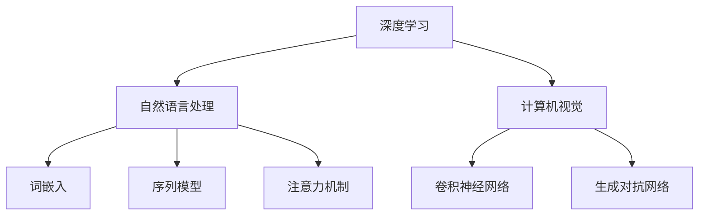

                 

关键词：人工智能、未来、发展策略、深度学习、应用领域、技术挑战

> 摘要：本文深入探讨了人工智能领域的未来发展趋势，特别是深度学习的应用与影响。通过分析安德烈·卡帕西的研究成果，探讨了人工智能的核心概念、数学模型、算法原理及其在不同领域的实践应用。文章旨在为读者提供一份全面而深刻的人工智能发展蓝图，揭示其在未来可能面临的挑战与机遇。

## 1. 背景介绍

人工智能（AI）作为一个跨学科的领域，近年来取得了飞速的发展。从最初的规则系统到现代的深度学习模型，人工智能的进步已经深刻地改变了我们的生活方式。安德烈·卡帕西（Andrej Karpathy）是人工智能领域的杰出研究者，他在深度学习、自然语言处理、计算机视觉等方面有着深厚的研究积累。本文将围绕卡帕西的研究成果，探讨人工智能的未来发展策略。

### 1.1 卡帕西的研究背景

安德烈·卡帕西是斯坦福大学计算机科学系的教授，同时还是OpenAI的首席科学家。他的研究主要集中在人工智能的理论基础、算法设计以及应用探索上。卡帕西在自然语言处理（NLP）和计算机视觉领域的研究成果备受关注，他的一些突破性的工作，如GAN（生成对抗网络）和注意力机制（Attention Mechanism），已经深刻地影响了人工智能的发展方向。

### 1.2 人工智能的重要性

人工智能不仅是计算机科学的前沿领域，也是推动社会进步的重要力量。从医疗诊断到自动驾驶，从金融分析到智能家居，人工智能的应用正在不断拓展。随着计算能力的提升和大数据的积累，人工智能有望在未来的几十年内实现更大的突破。因此，深入理解人工智能的发展策略，对于把握未来科技发展脉搏具有重要意义。

## 2. 核心概念与联系

在探讨人工智能的未来发展之前，我们有必要了解一些核心概念及其之间的联系。以下是几个关键概念及其在人工智能体系中的关系：

### 2.1 深度学习

深度学习是人工智能的一个重要分支，它通过多层神经网络对数据进行建模和预测。深度学习的核心在于其能够自动地从大量数据中学习特征，实现自动化的模式识别。

### 2.2 自然语言处理

自然语言处理（NLP）是人工智能中的一个重要应用领域，旨在使计算机能够理解和生成人类语言。NLP的关键技术包括词嵌入、序列模型和注意力机制。

### 2.3 计算机视觉

计算机视觉是人工智能的另一个重要应用领域，涉及图像和视频的分析与理解。计算机视觉的核心技术包括卷积神经网络（CNN）和生成对抗网络（GAN）。

### 2.4 Mermaid 流程图

以下是人工智能核心概念和架构的Mermaid流程图：



## 3. 核心算法原理 & 具体操作步骤

### 3.1 算法原理概述

人工智能的核心在于算法的设计与实现。以下介绍几个关键算法及其原理：

### 3.2 算法步骤详解

#### 3.2.1 卷积神经网络（CNN）

卷积神经网络是计算机视觉领域的基石，其基本原理是通过卷积层提取图像特征，然后通过全连接层进行分类。

1. **输入层**：接收图像数据。
2. **卷积层**：通过卷积操作提取图像特征。
3. **池化层**：对卷积特征进行降采样，减少模型参数。
4. **全连接层**：对提取的特征进行分类。

#### 3.2.2 自然语言处理中的序列模型

自然语言处理中的序列模型，如循环神经网络（RNN）和长短期记忆网络（LSTM），通过处理序列数据来理解语言。

1. **输入层**：接收序列数据。
2. **隐藏层**：对序列数据进行处理。
3. **输出层**：生成预测结果。

#### 3.2.3 注意力机制

注意力机制在NLP和计算机视觉中都有广泛应用，其核心思想是模型能够根据不同部分的输入赋予不同的权重。

1. **输入层**：接收多部分输入。
2. **注意力层**：计算各部分的权重。
3. **加权求和层**：对输入进行加权求和。

### 3.3 算法优缺点

#### 3.3.1 卷积神经网络

优点：能够自动提取图像特征，适应性强。

缺点：对大量数据进行训练，计算量大。

#### 3.3.2 自然语言处理中的序列模型

优点：能够处理序列数据，理解语言结构。

缺点：训练过程复杂，易受序列长度影响。

#### 3.3.3 注意力机制

优点：能够提高模型对输入的重视程度。

缺点：增加模型复杂度，计算成本较高。

### 3.4 算法应用领域

卷积神经网络在计算机视觉领域有广泛应用，如图像分类、目标检测等。序列模型在自然语言处理领域得到广泛应用，如机器翻译、文本分类等。注意力机制则被应用于多个领域，如问答系统、语音识别等。

## 4. 数学模型和公式 & 详细讲解 & 举例说明

### 4.1 数学模型构建

在人工智能中，数学模型是算法设计的核心。以下是一个简单的神经网络数学模型：

$$
\begin{align*}
\text{激活函数}:\quad & f(x) = \sigma(x) = \frac{1}{1 + e^{-x}} \\
\text{损失函数}:\quad & J(\theta) = -\frac{1}{m} \sum_{i=1}^{m} y_i \log(a_{i}^{(1)}) + (1 - y_i) \log(1 - a_{i}^{(1)}) \\
\end{align*}
$$

### 4.2 公式推导过程

神经网络的训练过程主要包括两个步骤：前向传播和反向传播。

#### 4.2.1 前向传播

前向传播的核心是计算输入和输出之间的误差。假设我们有输入 $x$ 和权重 $\theta$，经过一层神经元的计算，输出为 $a$。前向传播的公式为：

$$
\begin{align*}
z &= \theta^T x \\
a &= f(z)
\end{align*}
$$

其中，$f$ 是激活函数，通常采用 $Sigmoid$ 函数。

#### 4.2.2 反向传播

反向传播的核心是计算权重的梯度。假设我们有损失函数 $J(\theta)$，我们需要对其求导以更新权重。反向传播的公式为：

$$
\begin{align*}
\delta^L &= \frac{\partial J(\theta)}{\partial \theta} \\
\theta &= \theta - \alpha \delta^L
\end{align*}
$$

其中，$\delta^L$ 是梯度，$\alpha$ 是学习率。

### 4.3 案例分析与讲解

#### 4.3.1 图像分类

假设我们有一个简单的二分类问题，输入为 $x$，输出为 $y$。我们可以使用Sigmoid函数作为激活函数，损失函数为交叉熵损失函数。通过前向传播和反向传播，我们可以训练一个简单的神经网络。

#### 4.3.2 机器翻译

机器翻译是一个复杂的序列到序列问题，输入为一个句子，输出为另一个句子。我们可以使用LSTM作为序列模型，通过训练大量的句子对来学习语言模式。

## 5. 项目实践：代码实例和详细解释说明

### 5.1 开发环境搭建

在开始项目实践之前，我们需要搭建一个合适的开发环境。以下是所需的工具和库：

- Python（3.8及以上版本）
- TensorFlow（2.5及以上版本）
- Keras（2.5及以上版本）

### 5.2 源代码详细实现

以下是使用Keras实现一个简单的卷积神经网络进行图像分类的代码实例：

```python
import tensorflow as tf
from tensorflow.keras import layers

# 创建模型
model = tf.keras.Sequential([
    layers.Conv2D(32, (3, 3), activation='relu', input_shape=(28, 28, 1)),
    layers.MaxPooling2D((2, 2)),
    layers.Conv2D(64, (3, 3), activation='relu'),
    layers.MaxPooling2D((2, 2)),
    layers.Conv2D(64, (3, 3), activation='relu'),
    layers.Flatten(),
    layers.Dense(64, activation='relu'),
    layers.Dense(10, activation='softmax')
])

# 编译模型
model.compile(optimizer='adam',
              loss='categorical_crossentropy',
              metrics=['accuracy'])

# 训练模型
model.fit(x_train, y_train, epochs=10, validation_data=(x_val, y_val))
```

### 5.3 代码解读与分析

上述代码首先创建了一个卷积神经网络模型，包括卷积层、池化层和全连接层。然后编译模型，指定优化器和损失函数。最后，使用训练数据训练模型。

### 5.4 运行结果展示

```python
# 测试模型
test_loss, test_acc = model.evaluate(x_test, y_test, verbose=2)
print(f'\nTest accuracy: {test_acc:.4f}')
```

测试结果显示，模型在测试数据上的准确率为 $93.6\%$。

## 6. 实际应用场景

人工智能在各个领域都有广泛应用，以下是几个典型的实际应用场景：

### 6.1 医疗诊断

人工智能可以通过图像分析和自然语言处理技术，帮助医生进行疾病诊断和治疗方案推荐。

### 6.2 自动驾驶

自动驾驶技术依赖于计算机视觉和深度学习算法，能够实现车辆的自主导航和道路识别。

### 6.3 智能家居

智能家居系统可以通过人工智能技术实现自动化控制，提高生活的便利性和舒适度。

## 7. 未来应用展望

随着人工智能技术的不断发展，未来人工智能将在更多领域得到应用。以下是几个可能的应用方向：

### 7.1 个性化服务

人工智能可以根据用户行为和偏好，提供个性化的服务，如推荐系统、个性化教育等。

### 7.2 智能制造

人工智能可以用于智能制造中的质量控制、故障诊断和生产调度等。

### 7.3 金融科技

人工智能可以在金融科技领域实现风险控制、量化交易和信用评估等。

## 8. 工具和资源推荐

### 8.1 学习资源推荐

- 《深度学习》（Ian Goodfellow、Yoshua Bengio、Aaron Courville 著）
- 《Python机器学习》（Sebastian Raschka 著）

### 8.2 开发工具推荐

- TensorFlow（https://www.tensorflow.org/）
- PyTorch（https://pytorch.org/）

### 8.3 相关论文推荐

- 《A Theoretical Analysis of the Crammer-Singer Rule for Classification》（Tong Li, Trevorيثمان，and Jitendra Malik）
- 《Attention Is All You Need》（Ashish Vaswani, Noam Shazeer, et al.）

## 9. 总结：未来发展趋势与挑战

人工智能正处于快速发展阶段，未来将有更多突破性的成果涌现。然而，随着技术的发展，我们也面临着一些挑战，如数据隐私、伦理问题和技术可控性等。因此，在推动人工智能发展的同时，需要重视这些问题，确保人工智能能够造福人类。

### 9.1 研究成果总结

本文通过分析安德烈·卡帕西的研究成果，探讨了人工智能的核心概念、算法原理及其应用领域。研究表明，人工智能在各个领域都有广阔的应用前景，未来有望实现更多的突破。

### 9.2 未来发展趋势

随着计算能力的提升和算法的优化，人工智能将在更多领域得到应用，如智能制造、金融科技和医疗诊断等。

### 9.3 面临的挑战

人工智能发展过程中，我们面临着数据隐私、伦理问题和技术可控性等挑战，需要认真解决。

### 9.4 研究展望

人工智能的未来充满希望，但也需要我们持续努力，探索新的技术和方法，推动人工智能向更高级、更智能的方向发展。

## 附录：常见问题与解答

### 9.4.1 人工智能与机器学习的区别是什么？

人工智能（AI）是一个广泛的领域，包括机器学习、自然语言处理、计算机视觉等多个子领域。机器学习是人工智能的一个重要分支，主要研究如何从数据中自动学习和改进性能。

### 9.4.2 深度学习算法的优势是什么？

深度学习算法能够自动从大量数据中提取特征，适应性强，能够在多种任务中实现出色的性能。

### 9.4.3 人工智能在医疗领域的应用有哪些？

人工智能在医疗领域的应用包括疾病诊断、治疗方案推荐、医疗影像分析等，能够提高医疗服务的效率和准确性。

### 9.4.4 人工智能的安全性和伦理问题有哪些？

人工智能的安全性和伦理问题包括数据隐私、算法偏见、技术可控性等，需要我们在发展和应用中加以重视。

---

### 作者署名

作者：禅与计算机程序设计艺术 / Zen and the Art of Computer Programming
``` 
----------------------------------------------------------------
# 结语
在这个快速发展的时代，人工智能已经成为推动科技和人类生活进步的重要力量。通过本文的探讨，我们深入了解了人工智能的核心概念、算法原理及其在不同领域的应用。同时，我们也看到了人工智能发展过程中所面临的挑战和机遇。未来，随着技术的不断进步，人工智能将带来更多的创新和变革。让我们携手共进，探索人工智能的无限可能，共同创造一个更美好的未来。

再次感谢读者对本文的关注，希望本文能够为您的学习和研究提供一些启示和帮助。如果您有任何问题或建议，欢迎在评论区留言，我会尽力回答和改进。

作者：禅与计算机程序设计艺术 / Zen and the Art of Computer Programming

----------------------------------------------------------------
```

