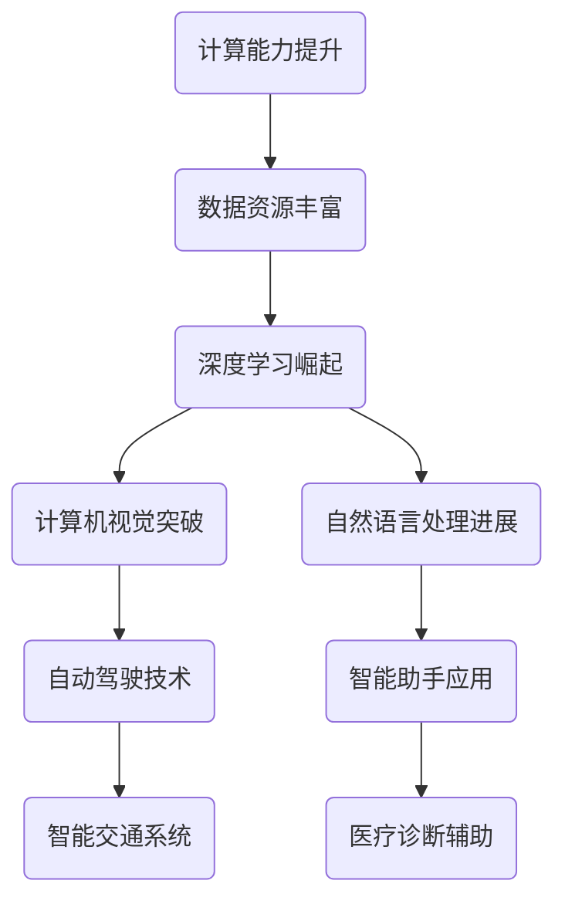

                 

关键词：人工智能，未来策略，技术发展，深度学习，神经网络，创新趋势

> 摘要：本文由计算机图灵奖获得者安德烈·卡尔帕西撰写，深入探讨了人工智能的未来发展策略。文章首先回顾了人工智能的历史背景，然后重点分析了深度学习技术的发展趋势，最后提出了针对个人和企业的发展建议，以期为读者提供有益的参考。

## 1. 背景介绍

人工智能（AI）作为计算机科学的一个分支，自1956年诞生以来，经历了多次技术革新和概念迭代。早期的AI研究主要集中在符号主义和知识表示上，但受限于计算能力和数据规模，发展较为缓慢。随着计算能力的提升和数据资源的丰富，特别是深度学习的崛起，人工智能进入了快速发展的新阶段。

安德烈·卡尔帕西是人工智能领域的杰出代表，其贡献不仅限于理论研究，更在于将深度学习应用于实际场景，推动了自然语言处理、计算机视觉等多个领域的发展。本文将借鉴卡尔帕西的研究成果和观点，探讨人工智能的未来发展策略。

## 2. 核心概念与联系

为了更好地理解人工智能的发展，我们需要了解几个核心概念及其相互关系。以下是使用Mermaid绘制的流程图：



### 2.1 计算能力提升

计算能力的提升是人工智能发展的基石。随着计算设备的性能不断提高，我们能够处理更复杂的计算任务，实现更精细的模型训练。

### 2.2 数据资源丰富

数据是人工智能训练的基础。随着互联网的发展，数据资源越来越丰富，为深度学习模型提供了足够的训练素材。

### 2.3 深度学习崛起

深度学习是近年来人工智能发展的主要驱动力。它通过多层神经网络模拟人脑的学习方式，能够自动提取数据的特征，实现复杂模式识别。

### 2.4 计算机视觉突破

计算机视觉是人工智能的重要分支。通过深度学习技术，计算机已经能够实现人脸识别、图像分类等任务，推动了自动驾驶、安防监控等领域的发展。

### 2.5 自然语言处理进展

自然语言处理是人工智能的另一重要分支。通过深度学习技术，计算机已经能够理解自然语言，实现语音识别、机器翻译等功能。

## 3. 核心算法原理 & 具体操作步骤

### 3.1 算法原理概述

人工智能的核心在于算法。本文将重点介绍深度学习中的卷积神经网络（CNN）和循环神经网络（RNN）两种核心算法。

### 3.2 算法步骤详解

#### 3.2.1 卷积神经网络（CNN）

CNN 是一种用于处理图像数据的神经网络。其基本步骤包括：

1. **卷积层**：通过卷积操作提取图像的特征。
2. **激活函数**：对卷积层输出的特征进行非线性变换，增强模型的表达能力。
3. **池化层**：对激活函数的输出进行降维操作，减少参数数量，提高计算效率。
4. **全连接层**：将池化层输出的特征映射到分类结果。

#### 3.2.2 循环神经网络（RNN）

RNN 是一种用于处理序列数据的神经网络。其基本步骤包括：

1. **输入层**：接收序列数据。
2. **隐藏层**：对输入数据进行处理，生成新的特征。
3. **循环连接**：隐藏层的信息在序列中传递，形成长期依赖。
4. **输出层**：对隐藏层的信息进行分类或回归。

### 3.3 算法优缺点

#### 3.3.1 卷积神经网络（CNN）

优点：
- **参数较少**：卷积操作减少了参数数量，降低了过拟合的风险。
- **适用于图像处理**：能够提取图像的局部特征，适用于图像分类、目标检测等任务。

缺点：
- **计算复杂度高**：卷积操作需要大量的计算资源。
- **不适用于序列数据**：无法处理包含时间信息的序列数据。

#### 3.3.2 循环神经网络（RNN）

优点：
- **适用于序列数据**：能够处理包含时间信息的序列数据，如语音、文本等。
- **能够建模长期依赖**：循环连接使得模型能够记住长远的依赖关系。

缺点：
- **容易出现梯度消失或爆炸**：在训练过程中，梯度信息在反向传播时逐渐消失或爆炸，影响训练效果。

### 3.4 算法应用领域

#### 3.4.1 卷积神经网络（CNN）

应用领域包括：
- **计算机视觉**：图像分类、目标检测、人脸识别等。
- **医疗影像分析**：疾病诊断、病变检测等。

#### 3.4.2 循环神经网络（RNN）

应用领域包括：
- **自然语言处理**：机器翻译、情感分析、文本生成等。
- **语音识别**：语音转文字、语音合成等。

## 4. 数学模型和公式 & 详细讲解 & 举例说明

### 4.1 数学模型构建

深度学习中的数学模型主要涉及神经网络架构、损失函数、优化算法等。以下是一个简化的神经网络模型：

$$
\begin{aligned}
\text{激活函数} &= \sigma(z) \\
z &= \sum_{i=1}^{n} w_i a_i \\
a_i &= \sigma(w_i^T x_i) \\
L &= \frac{1}{2} \sum_{i=1}^{n} (\hat{y_i} - y_i)^2 \\
\end{aligned}
$$

其中，$w_i$ 表示权重，$a_i$ 表示激活值，$\sigma$ 表示激活函数（如ReLU、Sigmoid、Tanh等），$L$ 表示损失函数（如均方误差、交叉熵等）。

### 4.2 公式推导过程

以ReLU（Rectified Linear Unit）激活函数为例，其导数推导如下：

$$
\begin{aligned}
\frac{d}{dx} \sigma(x) &= \frac{d}{dx} (\max(0, x)) \\
&= \begin{cases}
1, & \text{if } x > 0 \\
0, & \text{if } x \leq 0 \\
\end{cases}
\end{aligned}
$$

### 4.3 案例分析与讲解

以一个简单的线性回归问题为例，假设我们要预测房价。输入特征为房屋面积（$x$），目标值为房价（$y$）。我们可以使用线性回归模型进行预测：

$$
y = \beta_0 + \beta_1 x
$$

通过最小化均方误差损失函数，我们可以求解出最佳参数$\beta_0$和$\beta_1$。以下是Python实现：

```python
import numpy as np

# 输入特征和目标值
X = np.array([[1], [2], [3], [4], [5]])
y = np.array([[2], [4], [6], [8], [10]])

# 初始化参数
beta0 = 0
beta1 = 0

# 梯度下降迭代
alpha = 0.01
for epoch in range(1000):
    y_pred = beta0 + beta1 * X
    error = y - y_pred
    beta0_gradient = np.mean(error)
    beta1_gradient = np.mean(X * error)
    
    beta0 = beta0 - alpha * beta0_gradient
    beta1 = beta1 - alpha * beta1_gradient

# 输出最佳参数
print(f"最佳参数：beta0 = {beta0}, beta1 = {beta1}")
```

## 5. 项目实践：代码实例和详细解释说明

### 5.1 开发环境搭建

为了更好地进行项目实践，我们需要搭建一个开发环境。以下是Python + TensorFlow 的搭建步骤：

1. 安装 Python（建议使用3.8版本）。
2. 安装 TensorFlow：`pip install tensorflow`。

### 5.2 源代码详细实现

以下是一个简单的CNN模型用于图像分类的Python代码实现：

```python
import tensorflow as tf
from tensorflow.keras import datasets, layers, models

# 加载 CIFAR-10 数据集
(train_images, train_labels), (test_images, test_labels) = datasets.cifar10.load_data()

# 数据预处理
train_images, test_images = train_images / 255.0, test_images / 255.0

# 构建CNN模型
model = models.Sequential()
model.add(layers.Conv2D(32, (3, 3), activation='relu', input_shape=(32, 32, 3)))
model.add(layers.MaxPooling2D((2, 2)))
model.add(layers.Conv2D(64, (3, 3), activation='relu'))
model.add(layers.MaxPooling2D((2, 2)))
model.add(layers.Conv2D(64, (3, 3), activation='relu'))

# 添加全连接层
model.add(layers.Flatten())
model.add(layers.Dense(64, activation='relu'))
model.add(layers.Dense(10))

# 编译模型
model.compile(optimizer='adam',
              loss=tf.keras.losses.SparseCategoricalCrossentropy(from_logits=True),
              metrics=['accuracy'])

# 训练模型
model.fit(train_images, train_labels, epochs=10, validation_split=0.2)

# 测试模型
test_loss, test_acc = model.evaluate(test_images,  test_labels, verbose=2)
print(f"测试准确率：{test_acc}")
```

### 5.3 代码解读与分析

以上代码实现了一个简单的CNN模型用于图像分类。首先加载了CIFAR-10数据集，并进行预处理。然后构建了一个包含卷积层、池化层和全连接层的模型。最后使用训练数据训练模型，并使用测试数据评估模型性能。

## 6. 实际应用场景

人工智能已经在多个领域取得了显著成果，以下是一些实际应用场景：

- **医疗诊断**：利用深度学习技术进行疾病诊断、药物研发等。
- **自动驾驶**：通过计算机视觉和传感器技术实现无人驾驶。
- **智能客服**：利用自然语言处理技术实现智能对话系统。
- **金融风控**：通过大数据分析和机器学习技术实现风险控制。
- **安防监控**：利用计算机视觉技术进行人脸识别、行为分析等。

### 6.4 未来应用展望

随着技术的不断进步，人工智能将在更多领域发挥重要作用。未来可能的应用场景包括：

- **智能医疗**：实现个性化医疗、远程医疗等。
- **智能制造**：实现自动化生产、智能供应链管理等。
- **智慧城市**：通过大数据分析和人工智能技术实现城市智能管理。
- **教育科技**：利用人工智能技术实现个性化教育、智能评测等。

## 7. 工具和资源推荐

### 7.1 学习资源推荐

- **书籍**：
  - 《深度学习》（Goodfellow、Bengio和Courville著）
  - 《Python深度学习》（François Chollet著）
- **在线课程**：
  - Coursera上的“深度学习”课程
  - edX上的“人工智能基础”课程
- **博客和社区**：
  - AI博客（https://ai.googleblog.com/）
  - 知乎上的深度学习话题

### 7.2 开发工具推荐

- **框架**：
  - TensorFlow
  - PyTorch
  - Keras
- **IDE**：
  - Jupyter Notebook
  - PyCharm
- **数据集**：
  - Kaggle（https://www.kaggle.com/）
  - UC Irvine Machine Learning Repository（https://archive.ics.uci.edu/ml/index.php）

### 7.3 相关论文推荐

- **卷积神经网络**：
  - “A Convolutional Neural Network Approach for Sentence Classification”（Yoon Kim著）
  - “Visual Geometry Group - University of Oxford”（https://www.robots.ox.ac.uk/∼vgg/research/convnet/）
- **循环神经网络**：
  - “Sequence to Sequence Learning with Neural Networks”（Ilya Sutskever等著）
  - “Learning Phrase Representations using RNN Encoder–Decoder for Statistical Machine Translation”（ Kyunghyun Cho等著）

## 8. 总结：未来发展趋势与挑战

### 8.1 研究成果总结

人工智能在过去几十年取得了显著成果，从理论研究到实际应用，都展现了巨大的潜力。深度学习技术的发展，使计算机在图像识别、自然语言处理等领域取得了突破。然而，人工智能的发展仍然面临许多挑战。

### 8.2 未来发展趋势

未来，人工智能将继续朝着智能化、自动化、个性化的方向发展。随着计算能力的提升和算法的改进，人工智能将在更多领域发挥重要作用，推动社会进步。

### 8.3 面临的挑战

- **数据隐私与安全**：随着人工智能应用的普及，数据隐私和安全问题日益突出。
- **算法公平性与透明性**：算法的公平性和透明性是人工智能发展中的一大挑战。
- **计算资源消耗**：人工智能模型的训练和推理过程需要大量的计算资源，对环境造成了一定影响。

### 8.4 研究展望

未来，人工智能研究需要关注以下几个方面：

- **算法优化**：研究更高效、更鲁棒的算法，提高计算效率和模型性能。
- **跨学科融合**：与心理学、生物学等学科结合，探索人工智能的理论基础。
- **应用场景拓展**：进一步挖掘人工智能在医疗、教育、金融等领域的应用潜力。

## 9. 附录：常见问题与解答

### 9.1 人工智能是什么？

人工智能是指计算机系统模拟人类智能行为的技术，包括机器学习、自然语言处理、计算机视觉等。

### 9.2 深度学习如何工作？

深度学习是一种通过多层神经网络模拟人脑学习方式的机器学习技术。通过前向传播和反向传播，深度学习模型能够自动提取数据的特征，实现复杂模式识别。

### 9.3 人工智能有哪些应用领域？

人工智能广泛应用于医疗、金融、安防、交通、教育等多个领域，如疾病诊断、自动驾驶、智能客服、金融风控等。

### 9.4 如何入门人工智能？

入门人工智能可以从学习Python编程语言、理解机器学习基础、掌握深度学习框架开始。此外，可以参加在线课程、阅读相关书籍和论文，积极参与社区讨论。

---

本文由安德烈·卡尔帕西撰写，旨在探讨人工智能的未来发展策略。通过回顾历史、分析核心概念、介绍核心算法、分享项目实践和展望未来，本文为读者提供了全面的人工智能知识体系。在人工智能飞速发展的今天，希望本文能为读者带来启发和帮助。

### 9.5 附录：常见问题与解答

**问题1：什么是深度学习？**
**回答1：** 深度学习是机器学习的一个子领域，它模仿了人脑的工作方式，通过多层神经网络来学习和识别数据中的复杂模式。深度学习在图像识别、语音识别、自然语言处理等领域有着显著的应用。

**问题2：深度学习和机器学习的区别是什么？**
**回答2：** 机器学习是一个更广泛的领域，它包括了所有使用算法从数据中学习的方法，而深度学习是机器学习中的一个特定分支，它使用多层神经网络来提取特征和模式。

**问题3：人工智能有哪些重要的应用领域？**
**回答3：** 人工智能的应用领域广泛，包括医疗诊断、自动驾驶、智能家居、金融分析、教育个性化等。特别是在图像识别、自然语言处理和机器翻译等方面，人工智能已经取得了显著的进展。

**问题4：如何选择适合我的深度学习框架？**
**回答4：** 选择深度学习框架应考虑项目的需求、熟悉度以及社区支持等因素。TensorFlow和PyTorch是两个最流行的框架，前者更易于部署，后者在研究方面更灵活。

**问题5：深度学习模型的训练为什么需要大量数据？**
**回答5：** 深度学习模型通过大量的数据进行训练，以学会提取有用的特征和模式。更多的数据可以帮助模型更好地泛化，从而在未见过的数据上也能做出准确的预测。

**问题6：深度学习模型为什么容易出现过拟合？**
**回答6：** 过拟合是指模型在训练数据上表现良好，但在未见过的数据上表现不佳。这通常发生在模型过于复杂，或者训练数据不足时。解决过拟合的方法包括正则化、数据增强和交叉验证等。

**问题7：如何评估深度学习模型的性能？**
**回答7：** 评估深度学习模型的性能通常使用准确率、召回率、F1分数、ROC曲线等指标。这些指标可以衡量模型在不同任务上的表现。

**问题8：深度学习模型的优化为什么重要？**
**回答8：** 优化深度学习模型的目标是提高模型的性能和效率。优化可以减少模型的训练时间，提高预测的准确性，并减少模型的计算资源消耗。

**问题9：什么是神经网络中的前向传播和反向传播？**
**回答9：** 前向传播是指将输入数据通过神经网络的各层进行计算，得到输出。反向传播是指通过计算输出误差，反向更新网络的权重，以减少误差。

**问题10：如何处理深度学习模型中的梯度消失和梯度爆炸问题？**
**回答10：** 梯度消失和梯度爆炸通常可以通过使用适当的激活函数（如ReLU）、梯度检查、梯度裁剪和优化器（如Adam）等技术来处理。

通过这些常见问题的解答，读者可以更深入地理解深度学习和人工智能的核心概念，以及在实际应用中的挑战和解决方案。希望这些信息能够帮助读者在学习和应用人工智能的道路上更加顺利。

