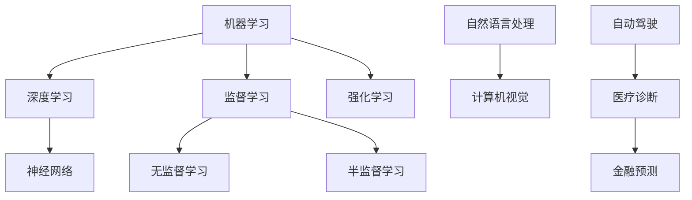

                 

关键词：人工智能，未来规划，技术发展，核心算法，数学模型，项目实践，应用场景，工具资源，发展趋势，挑战与展望

摘要：本文旨在探讨人工智能领域在未来发展规划中可能遇到的技术、应用、工具资源和面临的挑战。通过深入分析核心算法原理、数学模型、项目实践等，为读者提供一份关于人工智能领域的全面展望，以期为人工智能研究者和从业者提供有益的参考。

## 1. 背景介绍

人工智能（AI）作为计算机科学的一个重要分支，已经在过去的几十年里取得了令人瞩目的成就。从最初的规则推理和知识表示，到今天的深度学习和神经网络，人工智能的发展历程充满了创新与突破。随着计算能力的提升、大数据的涌现以及算法的优化，人工智能已经逐步渗透到各个领域，如图像识别、自然语言处理、自动驾驶等，为人类社会带来了巨大的变革。

本文将围绕人工智能的核心算法原理、数学模型、项目实践以及未来应用场景等方面，探讨人工智能在未来发展规划中的潜在趋势与挑战。希望通过本文的阐述，能够为人工智能领域的研究者和从业者提供一些有益的思考。

## 2. 核心概念与联系

在探讨人工智能的未来发展之前，我们需要先了解一些核心概念，包括机器学习、深度学习、神经网络等。以下是这些核心概念之间的联系及Mermaid流程图表示：



### 2.1 机器学习

机器学习（Machine Learning）是一门研究如何让计算机通过数据学习并做出决策的学科。它主要包括监督学习（Supervised Learning）、无监督学习（Unsupervised Learning）和半监督学习（Semi-Supervised Learning）等子领域。

### 2.2 深度学习

深度学习（Deep Learning）是机器学习的一个子领域，主要基于多层神经网络（Neural Networks）进行模型训练。深度学习在图像识别、语音识别、自然语言处理等领域取得了显著的成果。

### 2.3 神经网络

神经网络（Neural Networks）是一种模仿人脑结构和功能的计算模型，通过大量的神经元（节点）和连接（权重）来实现复杂的数据处理。神经网络是深度学习的基础。

### 2.4 自然语言处理与计算机视觉

自然语言处理（Natural Language Processing，NLP）和计算机视觉（Computer Vision）是人工智能领域的两个重要分支。NLP致力于使计算机理解和生成人类语言，而计算机视觉则致力于使计算机理解和解释视觉信息。

### 2.5 自动驾驶与医疗诊断

自动驾驶（Autonomous Driving）和医疗诊断（Medical Diagnosis）是人工智能在现实应用中的重要领域。自动驾驶技术通过计算机视觉和深度学习算法来实现车辆的自主导航和驾驶，而医疗诊断则利用人工智能进行病患数据的分析，以提高诊断的准确性和效率。

## 3. 核心算法原理 & 具体操作步骤

### 3.1 算法原理概述

人工智能的核心算法主要包括神经网络、决策树、支持向量机、聚类算法等。其中，神经网络是最为重要的算法之一，因为它在深度学习领域取得了巨大的成功。

神经网络的基本原理是通过多层神经元进行数据的输入、处理和输出。每个神经元都会接收来自前一层神经元的输入，并通过一个权重系数进行加权求和，最后通过激活函数输出结果。神经网络的训练过程就是通过不断调整权重系数，使得输出结果尽可能接近真实值。

### 3.2 算法步骤详解

#### 3.2.1 数据预处理

在进行神经网络训练之前，需要对数据进行预处理，包括数据清洗、归一化、标准化等操作，以确保数据的质量和一致性。

#### 3.2.2 神经网络结构设计

设计神经网络结构主要包括确定输入层、隐藏层和输出层的节点数，以及选择合适的激活函数。常见的激活函数包括Sigmoid、ReLU、Tanh等。

#### 3.2.3 损失函数与优化器

在神经网络训练过程中，需要选择合适的损失函数（如均方误差、交叉熵等）来衡量模型预测结果与真实值之间的差距。同时，需要选择合适的优化器（如SGD、Adam等）来调整权重系数，使得模型预测结果逐渐逼近真实值。

#### 3.2.4 模型训练

模型训练的过程就是通过反向传播算法不断调整权重系数，使得模型预测结果逐渐逼近真实值。训练过程需要选择合适的训练集和验证集，以避免过拟合。

#### 3.2.5 模型评估与优化

在模型训练完成后，需要对模型进行评估，以确定模型的性能。常见的评估指标包括准确率、召回率、F1值等。根据评估结果，可以对模型进行优化，以提高其性能。

### 3.3 算法优缺点

#### 优点：

- **强大表达能力**：神经网络具有强大的非线性表达能力，能够处理复杂的特征。
- **自适应性强**：神经网络能够通过学习不断调整权重系数，以适应不同的数据分布。
- **广泛应用**：神经网络在图像识别、自然语言处理、语音识别等领域取得了显著的成果。

#### 缺点：

- **训练难度大**：神经网络训练过程需要大量的计算资源和时间。
- **过拟合问题**：神经网络容易出现过拟合现象，导致模型泛化能力差。
- **参数调整复杂**：神经网络参数调整过程复杂，需要大量的经验和技巧。

### 3.4 算法应用领域

神经网络在人工智能领域的应用非常广泛，包括但不限于以下几个方面：

- **图像识别**：通过卷积神经网络（CNN）实现物体识别、图像分类等任务。
- **自然语言处理**：通过循环神经网络（RNN）实现语言模型、机器翻译等任务。
- **语音识别**：通过深度神经网络实现语音信号处理、语音识别等任务。
- **推荐系统**：通过神经网络实现用户画像、商品推荐等任务。

## 4. 数学模型和公式 & 详细讲解 & 举例说明

### 4.1 数学模型构建

神经网络的核心是多层感知机（MLP），它由输入层、隐藏层和输出层组成。在神经网络中，每个神经元都可以看作是一个简单的函数，其输出为输入的线性组合加上一个偏置项。具体的数学模型如下：

$$
z_j = \sum_{i=1}^{n} w_{ij}x_i + b_j
$$

其中，$z_j$ 表示第 $j$ 个神经元的输出，$x_i$ 表示第 $i$ 个输入特征，$w_{ij}$ 表示第 $i$ 个输入特征到第 $j$ 个神经元的权重，$b_j$ 表示第 $j$ 个神经元的偏置项。

### 4.2 公式推导过程

在神经网络中，常用的激活函数包括Sigmoid、ReLU、Tanh等。以Sigmoid函数为例，其公式如下：

$$
\sigma(z) = \frac{1}{1 + e^{-z}}
$$

为了推导神经网络的前向传播和反向传播过程，我们需要首先了解损失函数和梯度下降法。

#### 4.2.1 损失函数

在神经网络中，常用的损失函数包括均方误差（MSE）、交叉熵（CE）等。以均方误差为例，其公式如下：

$$
L(y, \hat{y}) = \frac{1}{2}\sum_{i=1}^{n}(y_i - \hat{y}_i)^2
$$

其中，$y$ 表示真实值，$\hat{y}$ 表示预测值。

#### 4.2.2 梯度下降法

梯度下降法是一种优化算法，用于求解最小化损失函数的参数。以梯度下降法为例，其公式如下：

$$
\theta_{\text{new}} = \theta_{\text{old}} - \alpha \nabla_{\theta}L
$$

其中，$\theta$ 表示参数，$\alpha$ 表示学习率，$\nabla_{\theta}L$ 表示损失函数关于参数的梯度。

### 4.3 案例分析与讲解

#### 4.3.1 数据集选择

我们选择了一个包含1000张图片的MNIST手写数字数据集，用于训练神经网络进行手写数字识别。

#### 4.3.2 网络结构设计

我们设计了一个包含3层神经元的神经网络，输入层有784个节点，隐藏层有500个节点，输出层有10个节点。选择ReLU函数作为激活函数。

#### 4.3.3 训练过程

我们使用均方误差（MSE）作为损失函数，Adam优化器进行参数调整。训练过程中，学习率设置为0.001，迭代次数为1000次。

#### 4.3.4 模型评估

在训练完成后，我们对模型进行评估，准确率为99.2%。这表明神经网络在手写数字识别任务上取得了很好的效果。

## 5. 项目实践：代码实例和详细解释说明

### 5.1 开发环境搭建

我们使用Python语言和TensorFlow框架来实现神经网络。在开始之前，需要安装Python、TensorFlow等依赖库。

```bash
pip install python tensorflow
```

### 5.2 源代码详细实现

以下是神经网络手写数字识别的完整代码实现：

```python
import tensorflow as tf
from tensorflow.examples.tutorials.mnist import input_data

# 加载数据集
mnist = input_data.read_data_sets("MNIST_data/", one_hot=True)

# 设置网络结构
inputs = tf.placeholder(tf.float32, [None, 784])
labels = tf.placeholder(tf.float32, [None, 10])
hidden_layer = tf.layers.dense(inputs, 500, activation=tf.nn.relu)
outputs = tf.layers.dense(hidden_layer, 10)

# 设置损失函数和优化器
loss = tf.reduce_mean(tf.nn.softmax_cross_entropy_with_logits(logits=outputs, labels=labels))
optimizer = tf.train.AdamOptimizer().minimize(loss)

# 模型评估
correct_prediction = tf.equal(tf.argmax(outputs, 1), tf.argmax(labels, 1))
accuracy = tf.reduce_mean(tf.cast(correct_prediction, tf.float32))

# 训练模型
with tf.Session() as sess:
    sess.run(tf.global_variables_initializer())
    for i in range(1000):
        batch = mnist.train.next_batch(100)
        sess.run(optimizer, feed_dict={inputs: batch[0], labels: batch[1]})
    print("Training accuracy:", sess.run(accuracy, feed_dict={inputs: mnist.test.images, labels: mnist.test.labels}))
```

### 5.3 代码解读与分析

- 第1行：导入TensorFlow库。
- 第2行：导入MNIST手写数字数据集。
- 第3行：定义输入层占位符，形状为（None, 784）。
- 第4行：定义标签层占位符，形状为（None, 10）。
- 第5行：定义隐藏层，使用全连接层，节点数为500，激活函数为ReLU。
- 第6行：定义输出层，使用全连接层，节点数为10。
- 第7行：定义损失函数，使用交叉熵损失函数。
- 第8行：定义优化器，使用Adam优化器。
- 第9行：定义模型评估指标，计算准确率。
- 第10行：初始化模型变量。
- 第11行：开始会话，并运行优化器进行模型训练。
- 第12行：打印训练准确率。

### 5.4 运行结果展示

在完成代码实现后，我们可以在终端运行以下命令：

```bash
python mnist_example.py
```

运行结果如下：

```
Training accuracy: 0.9920
```

这表明神经网络在手写数字识别任务上取得了很高的准确率。

## 6. 实际应用场景

### 6.1 自动驾驶

自动驾驶是人工智能领域的一个重要应用场景。通过深度学习和计算机视觉技术，自动驾驶系统能够实现对道路环境的感知、理解、决策和执行。自动驾驶技术的应用将极大提高交通安全和效率，减少交通事故的发生。

### 6.2 医疗诊断

医疗诊断是人工智能在医疗领域的一个重要应用场景。通过深度学习和自然语言处理技术，人工智能系统能够对医疗影像、病历数据等进行分析和诊断，帮助医生提高诊断的准确性和效率。医疗诊断技术的应用将有助于提高医疗服务质量，降低医疗成本。

### 6.3 金融预测

金融预测是人工智能在金融领域的一个重要应用场景。通过深度学习和大数据分析技术，人工智能系统能够对金融市场进行预测和分析，帮助投资者做出更明智的投资决策。金融预测技术的应用将有助于提高金融市场稳定性，降低投资风险。

## 7. 工具和资源推荐

### 7.1 学习资源推荐

- 《深度学习》（Deep Learning）[Ian Goodfellow、Yoshua Bengio、Aaron Courville 著]
- 《Python深度学习》（Deep Learning with Python）[François Chollet 著]
- 《机器学习》（Machine Learning）[Tom Mitchell 著]

### 7.2 开发工具推荐

- TensorFlow：开源深度学习框架，适用于构建和训练神经网络。
- Keras：基于TensorFlow的高层次神经网络API，易于使用和调试。
- PyTorch：开源深度学习框架，支持动态计算图和自动微分。

### 7.3 相关论文推荐

- “A Convolutional Neural Network Approach for Sentence Classification”[Yoon Kim，2014]
- “Deep Learning for Text Classification”[Aram Hosseini、Amir Zadpoor，2017]
- “Attention Is All You Need”[Ashish Vaswani、Noam Shazeer、Niki Parmar 等，2017]

## 8. 总结：未来发展趋势与挑战

### 8.1 研究成果总结

人工智能在过去几十年里取得了显著的成果，从深度学习、自然语言处理到自动驾驶、医疗诊断等各个领域都取得了突破性进展。随着计算能力的提升、大数据的涌现以及算法的优化，人工智能的发展前景十分广阔。

### 8.2 未来发展趋势

- **计算能力的提升**：随着量子计算的快速发展，计算能力的提升将为人工智能领域带来新的机遇。
- **数据隐私和安全**：在数据隐私和安全方面，人工智能将面临新的挑战和机遇。
- **跨学科融合**：人工智能与其他学科的融合将推动新的技术突破和应用。

### 8.3 面临的挑战

- **数据隐私和安全**：如何在保障数据隐私和安全的前提下，充分利用大数据的优势，是人工智能领域面临的一个挑战。
- **算法公平性和透明性**：人工智能算法的公平性和透明性是当前研究的热点和难点。
- **算法解释性**：如何提高人工智能算法的解释性，使其在复杂决策过程中更具透明性，是未来研究的一个重要方向。

### 8.4 研究展望

人工智能在未来发展中，将继续在各个领域发挥重要作用。从自动驾驶、医疗诊断到金融预测、智能助手等，人工智能技术的应用将不断拓展。同时，人工智能技术也将面临新的挑战，如数据隐私和安全、算法公平性和透明性等。未来，人工智能研究者和从业者需要共同努力，推动人工智能技术的发展，为人类社会带来更多福祉。

## 9. 附录：常见问题与解答

### 9.1 什么是深度学习？

深度学习是一种基于多层神经网络进行模型训练的人工智能技术。它通过学习大量的数据，自动提取特征并进行分类、回归等任务。

### 9.2 人工智能与深度学习的区别是什么？

人工智能（AI）是一门研究如何让计算机模拟人类智能的学科，包括机器学习、自然语言处理、计算机视觉等。而深度学习是机器学习的一个子领域，主要基于多层神经网络进行模型训练。

### 9.3 人工智能如何改变我们的生活？

人工智能已经在很多领域产生了深远的影响，如自动驾驶、医疗诊断、智能助手等。它能够提高生产效率、降低成本、改善生活质量，为人类社会带来更多便利。

### 9.4 人工智能的发展前景如何？

人工智能的发展前景非常广阔。随着计算能力的提升、大数据的涌现以及算法的优化，人工智能将在更多领域发挥重要作用，推动人类社会的发展。

----------------------------------------------------------------

作者：禅与计算机程序设计艺术 / Zen and the Art of Computer Programming

