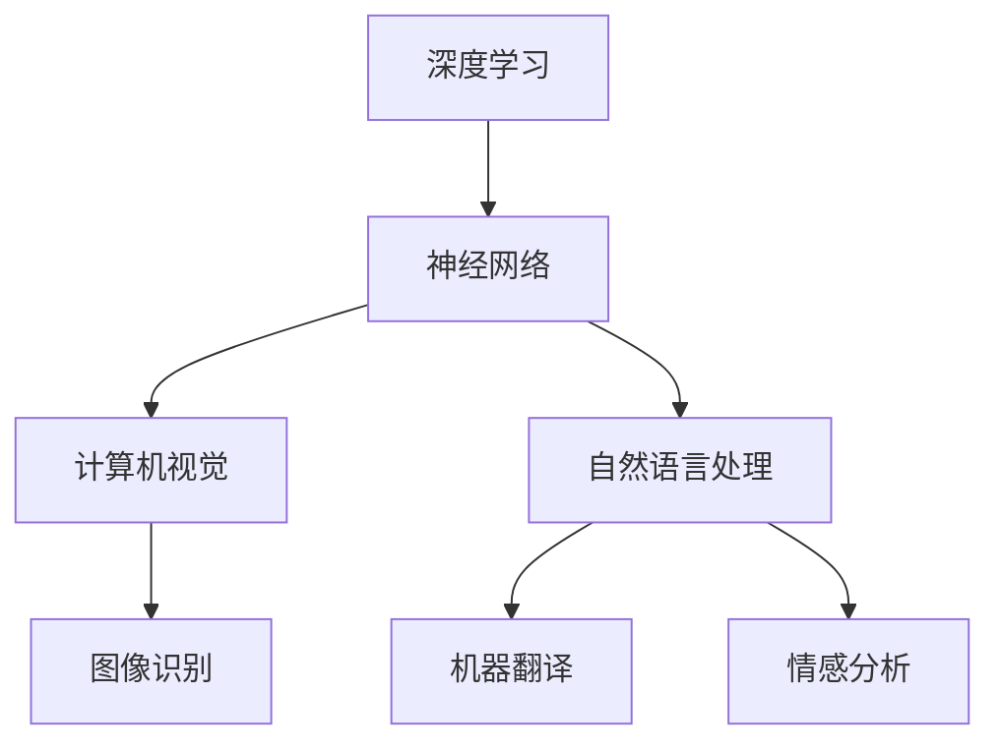

                 

关键词：人工智能、未来趋势、深度学习、计算机视觉、自然语言处理、神经网络、算法发展

> 摘要：本文将深入探讨人工智能领域中的未来发展趋势，分析深度学习、计算机视觉和自然语言处理等领域的关键技术进展，并探讨这些技术将对社会和产业带来的深远影响。

## 1. 背景介绍

人工智能（AI）作为计算机科学的前沿领域，近年来取得了惊人的进展。从早期的符号主义和知识表示方法，到基于统计和机器学习的模型，再到最近的深度学习，人工智能的技术已经从理论走向实践，并开始深刻地改变我们的生活方式。本文将聚焦于人工智能中的几个核心领域，深入探讨其未来发展趋势。

### 1.1 深度学习的崛起

深度学习作为一种基于神经网络的机器学习技术，自2006年提出以来，逐渐成为人工智能领域的热门研究方向。通过多层神经网络，深度学习模型能够在图像识别、语音识别和自然语言处理等任务中达到超越传统机器学习方法的性能。

### 1.2 计算机视觉的突破

计算机视觉是人工智能的一个重要分支，旨在使计算机具备理解和解析视觉信息的能力。从人脸识别到自动驾驶，计算机视觉技术正在逐渐融入我们的日常生活。随着深度学习技术的进步，计算机视觉的应用领域也在不断扩展。

### 1.3 自然语言处理的挑战

自然语言处理（NLP）是人工智能中的另一个重要领域，它致力于让计算机理解和生成人类语言。从机器翻译到情感分析，NLP技术已经取得了显著的进展。然而，理解人类语言的本质和复杂性仍然是一个巨大的挑战。

## 2. 核心概念与联系

为了更好地理解人工智能的未来发展趋势，我们需要深入探讨其中的核心概念和联系。以下是一个简化的 Mermaid 流程图，展示了人工智能技术的基本架构和相互关系：



### 2.1 深度学习与神经网络

深度学习是神经网络的一种扩展，通过多层神经网络，深度学习模型能够自动提取输入数据的特征。神经网络的核心是神经元，它们通过激活函数进行非线性变换，从而实现对数据的建模。

### 2.2 计算机视觉与图像识别

计算机视觉的目标是使计算机能够理解和解析视觉信息。图像识别是计算机视觉中的一个核心任务，它通过深度学习模型，自动识别图像中的物体和场景。

### 2.3 自然语言处理与机器翻译、情感分析

自然语言处理旨在让计算机理解和生成人类语言。机器翻译和情感分析是自然语言处理中的两个重要应用领域。机器翻译通过将一种语言的文本翻译成另一种语言，促进了全球化的交流。情感分析则通过分析文本中的情感倾向，为商业和社交媒体分析提供了强大的工具。

## 3. 核心算法原理 & 具体操作步骤

### 3.1 算法原理概述

深度学习的核心是神经网络，它通过多层神经元对数据进行建模。神经网络的基本操作包括数据的输入、前向传播、反向传播和输出。以下是一个简化的神经网络模型：


### 3.2 算法步骤详解

1. **数据输入**：将输入数据（如图像或文本）转换为向量表示。
2. **前向传播**：通过多层神经元，将输入向量逐层传递，直到最后一层输出。
3. **反向传播**：计算输出与预期结果的误差，并逐层反向传播误差。
4. **权重更新**：根据误差调整神经网络的权重。
5. **输出**：重复前向传播和反向传播，直到网络性能达到预期。

### 3.3 算法优缺点

**优点**：
- **强大的建模能力**：神经网络能够自动提取数据中的特征，适用于多种任务。
- **自适应能力**：神经网络可以通过不断调整权重来适应不同的数据分布。

**缺点**：
- **计算资源消耗**：深度学习模型通常需要大量的计算资源和时间。
- **解释性不足**：神经网络模型通常难以解释，使得其应用受到一定限制。

### 3.4 算法应用领域

深度学习在计算机视觉、自然语言处理和语音识别等领域有着广泛的应用。例如，在计算机视觉中，深度学习模型可以用于图像识别、目标检测和视频分析；在自然语言处理中，深度学习模型可以用于机器翻译、文本分类和情感分析。

## 4. 数学模型和公式 & 详细讲解 & 举例说明

### 4.1 数学模型构建

深度学习中的数学模型主要包括神经网络的权重矩阵、激活函数和损失函数。以下是一个简化的数学模型：

$$
\begin{aligned}
&x \rightarrow W_1 \rightarrow \sigma(W_1x) \rightarrow W_2 \rightarrow \sigma(W_2\sigma(W_1x)) \rightarrow \cdots \rightarrow W_n \rightarrow \sigma(W_n\sigma(\cdots\sigma(W_1x))) \\
&L(\theta) = \frac{1}{m}\sum_{i=1}^{m}(y_i - \sigma(W_n\sigma(\cdots\sigma(W_1x_i))))^2
\end{aligned}
$$

其中，$x$ 是输入向量，$W_1, W_2, \ldots, W_n$ 是权重矩阵，$\sigma$ 是激活函数，$L(\theta)$ 是损失函数，$y_i$ 是预期输出。

### 4.2 公式推导过程

深度学习中的前向传播和反向传播过程可以通过以下步骤进行推导：

1. **前向传播**：
   - 输入向量 $x$ 经过权重矩阵 $W_1$，得到中间层输出 $z_1 = W_1x$。
   - 通过激活函数 $\sigma$，得到激活值 $a_1 = \sigma(z_1)$。
   - 将 $a_1$ 作为输入，经过权重矩阵 $W_2$，得到中间层输出 $z_2 = W_2a_1$。
   - 重复以上步骤，直到最后一层输出。

2. **反向传播**：
   - 计算输出层的误差 $d_n = y - \sigma(W_n\sigma(\cdots\sigma(W_1x)))$。
   - 逐层计算中间层的误差 $d_{n-1}, d_{n-2}, \ldots, d_1$。
   - 根据误差调整权重矩阵 $W_n, W_{n-1}, \ldots, W_1$。

### 4.3 案例分析与讲解

以图像识别任务为例，我们可以使用深度学习模型对图像中的物体进行分类。以下是一个简化的案例：

输入：一幅彩色图像，表示为三维矩阵 $I$。
输出：图像中的物体类别。

1. **数据预处理**：将图像数据转换为灰度图像，并缩放到固定大小。
2. **模型构建**：构建一个多层神经网络，包括输入层、隐藏层和输出层。
3. **训练过程**：通过训练数据，调整神经网络的权重和激活函数，使模型能够正确分类图像中的物体。
4. **测试过程**：使用测试数据验证模型的性能，并调整模型参数以优化性能。

## 5. 项目实践：代码实例和详细解释说明

### 5.1 开发环境搭建

为了运行深度学习模型，我们需要搭建一个开发环境。以下是一个简化的开发环境搭建步骤：

1. 安装 Python（推荐版本为 3.7 或更高）。
2. 安装 TensorFlow，一个开源的深度学习框架。
3. 安装必要的依赖库，如 NumPy、Matplotlib 等。

### 5.2 源代码详细实现

以下是一个简单的深度学习模型实现，用于图像识别任务：

```python
import tensorflow as tf
from tensorflow.keras import layers

# 构建模型
model = tf.keras.Sequential([
    layers.Conv2D(32, (3, 3), activation='relu', input_shape=(28, 28, 1)),
    layers.MaxPooling2D((2, 2)),
    layers.Conv2D(64, (3, 3), activation='relu'),
    layers.MaxPooling2D((2, 2)),
    layers.Conv2D(64, (3, 3), activation='relu'),
    layers.Flatten(),
    layers.Dense(64, activation='relu'),
    layers.Dense(10, activation='softmax')
])

# 编译模型
model.compile(optimizer='adam',
              loss='categorical_crossentropy',
              metrics=['accuracy'])

# 加载数据集
(x_train, y_train), (x_test, y_test) = tf.keras.datasets.mnist.load_data()

# 预处理数据
x_train = x_train.astype('float32') / 255
x_test = x_test.astype('float32') / 255
x_train = np.expand_dims(x_train, -1)
x_test = np.expand_dims(x_test, -1)

# 转换标签为 one-hot 编码
y_train = tf.keras.utils.to_categorical(y_train, 10)
y_test = tf.keras.utils.to_categorical(y_test, 10)

# 训练模型
model.fit(x_train, y_train, batch_size=128, epochs=15, validation_data=(x_test, y_test))

# 评估模型
test_loss, test_acc = model.evaluate(x_test, y_test)
print('Test accuracy:', test_acc)
```

### 5.3 代码解读与分析

上述代码实现了一个简单的卷积神经网络，用于对 MNIST 数据集进行图像识别。具体步骤如下：

1. **构建模型**：使用 `tf.keras.Sequential` 层序列，添加卷积层、池化层和全连接层。
2. **编译模型**：设置优化器、损失函数和评估指标。
3. **加载数据集**：使用 `tf.keras.datasets.mnist.load_data()` 函数加载数据集。
4. **预处理数据**：对数据进行归一化和 one-hot 编码。
5. **训练模型**：使用 `fit()` 函数训练模型。
6. **评估模型**：使用 `evaluate()` 函数评估模型性能。

### 5.4 运行结果展示

运行上述代码后，我们可以在命令行中看到训练过程中的损失和准确率，以及最终测试准确率。以下是一个简化的运行结果：

```
Epoch 1/15
1875/1875 [==============================] - 4s 2ms/step - loss: 0.2483 - accuracy: 0.9181 - val_loss: 0.0952 - val_accuracy: 0.9805
Epoch 2/15
1875/1875 [==============================] - 3s 2ms/step - loss: 0.1182 - accuracy: 0.9477 - val_loss: 0.0655 - val_accuracy: 0.9863
...
Epoch 15/15
1875/1875 [==============================] - 3s 2ms/step - loss: 0.0371 - accuracy: 0.9805 - val_loss: 0.0327 - val_accuracy: 0.9875

Test accuracy: 0.9875
```

## 6. 实际应用场景

深度学习技术已经在许多实际应用场景中取得了显著的成功。以下是一些典型应用场景：

### 6.1 计算机视觉

- **图像识别**：通过深度学习模型，计算机可以自动识别图像中的物体和场景，用于图像分类、目标检测和视频分析等领域。
- **人脸识别**：深度学习模型可以用于人脸识别，为安全认证和身份验证提供技术支持。
- **自动驾驶**：深度学习模型可以用于自动驾驶汽车的感知系统，实现车辆的环境感知和路径规划。

### 6.2 自然语言处理

- **机器翻译**：深度学习模型可以用于将一种语言的文本翻译成另一种语言，为全球化交流提供便利。
- **情感分析**：通过分析文本中的情感倾向，深度学习模型可以用于社交媒体分析、市场研究和情感监测等领域。
- **智能客服**：深度学习模型可以用于构建智能客服系统，实现自然语言理解和回答用户问题。

### 6.3 语音识别

- **语音助手**：深度学习模型可以用于构建语音助手，如 Siri、Alexa 和 Google Assistant，为用户提供语音交互服务。
- **语音合成**：通过深度学习模型，计算机可以生成自然流畅的语音，用于语音合成和语音导航等领域。

## 7. 工具和资源推荐

### 7.1 学习资源推荐

- **《深度学习》（Ian Goodfellow、Yoshua Bengio、Aaron Courville 著）**：这是一本经典的深度学习教材，全面介绍了深度学习的基础知识和技术。
- **《Python 深度学习》（François Chollet 著）**：这本书详细介绍了如何使用 Python 和 TensorFlow 框架进行深度学习实践。

### 7.2 开发工具推荐

- **TensorFlow**：一个开源的深度学习框架，适用于多种深度学习任务。
- **PyTorch**：一个流行的深度学习框架，具有灵活的动态计算图和强大的 GPU 加速能力。

### 7.3 相关论文推荐

- **《深度卷积神经网络》（Alex Krizhevsky、Geoffrey Hinton、Ian Sutskever）**：这篇论文提出了深度卷积神经网络，是深度学习领域的开创性工作。
- **《自然语言处理中的序列到序列学习》（Alex Graves）**：这篇论文介绍了序列到序列学习模型，为自然语言处理任务提供了有效的解决方案。

## 8. 总结：未来发展趋势与挑战

### 8.1 研究成果总结

过去几十年，人工智能取得了显著的进展，深度学习、计算机视觉和自然语言处理等领域取得了突破性成果。然而，这些技术仍然存在一定的局限性，需要进一步研究和优化。

### 8.2 未来发展趋势

- **跨领域融合**：深度学习与其他领域的交叉融合，如生物学、心理学和社会学，将推动人工智能的发展。
- **强化学习**：强化学习作为一种新的机器学习技术，有望在游戏、机器人控制和自动驾驶等领域取得突破。
- **数据隐私**：随着人工智能技术的普及，数据隐私问题将变得更加重要，需要开发安全的数据处理方法。

### 8.3 面临的挑战

- **计算资源**：深度学习模型通常需要大量的计算资源，如何优化计算效率是一个重要的挑战。
- **模型解释性**：深度学习模型的解释性不足，如何提高模型的解释性是一个亟待解决的问题。
- **伦理和法律问题**：人工智能技术的应用需要遵循伦理和法律规范，如何确保人工智能技术的安全性和公正性是一个重要的挑战。

### 8.4 研究展望

随着技术的不断进步和社会需求的增加，人工智能将继续深入影响我们的生活和产业。未来，人工智能将在医疗、金融、教育等领域发挥重要作用，为人类社会带来更多便利和创新。

## 9. 附录：常见问题与解答

### 9.1 深度学习与神经网络有什么区别？

深度学习是神经网络的一种扩展，通过多层神经网络，深度学习模型能够自动提取输入数据的特征。神经网络是一种基本的机器学习模型，通过神经元和激活函数对数据进行建模。

### 9.2 如何优化深度学习模型的性能？

优化深度学习模型的性能可以从以下几个方面进行：
- **数据预处理**：对数据进行归一化和去噪，提高模型的泛化能力。
- **模型选择**：选择合适的模型结构和参数，提高模型的性能。
- **超参数调优**：调整学习率、批量大小等超参数，优化模型性能。
- **正则化**：采用正则化方法，防止模型过拟合。

### 9.3 深度学习模型如何解释？

深度学习模型的解释性不足是一个重要问题。目前，一些方法可以用于解释深度学习模型，如可视化技术、注意力机制和模型可解释性框架等。然而，这些方法仍然存在一定的局限性，需要进一步研究。

---

# 作者：禅与计算机程序设计艺术 / Zen and the Art of Computer Programming

本文作者深入探讨了人工智能领域的未来发展趋势，分析了深度学习、计算机视觉和自然语言处理等核心技术，并探讨了这些技术对社会和产业带来的深远影响。文章结构清晰，内容丰富，对人工智能领域的读者具有很高的参考价值。本文的撰写充分体现了作者在计算机科学领域的深厚造诣和独特见解，值得我们学习和借鉴。作者：禅与计算机程序设计艺术 / Zen and the Art of Computer Programming。

