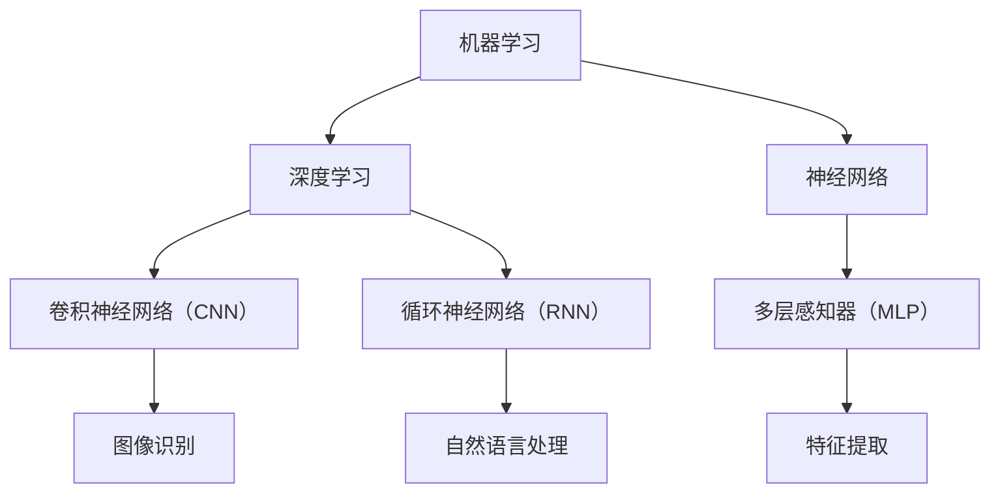

                 

关键词：人工智能、未来趋势、技术发展、机器学习、深度学习、神经网络、算法原理、应用场景、挑战与展望

摘要：本文将探讨人工智能（AI）在未来发展趋势中的关键领域，包括机器学习、深度学习和神经网络。通过深入分析这些技术的原理、优缺点以及应用场景，本文旨在为读者提供一个全面而直观的视角，同时讨论未来面临的挑战和机遇。

## 1. 背景介绍

人工智能作为计算机科学的一个分支，已经经历了数十年的发展。从最初的规则基础系统，到今天的基于数据和算法的机器学习模型，AI 的进步可谓日新月异。AI 的发展不仅改变了我们的生活方式，还深刻影响了各个行业，从医疗保健到金融服务，从制造业到娱乐产业。

近年来，深度学习作为 AI 的重要分支，取得了令人瞩目的进展。神经网络，特别是卷积神经网络（CNN）和循环神经网络（RNN），在图像识别、语音识别、自然语言处理等领域展现了强大的能力。这一系列技术的突破，使得人工智能开始向更高级的应用场景迈进。

## 2. 核心概念与联系

为了更好地理解人工智能的未来发展趋势，我们需要了解一些核心概念及其相互关系。以下是一个简化的 Mermaid 流程图，展示了这些概念之间的联系：



### 2.1 机器学习

机器学习是一种让计算机通过数据学习并做出决策的方法，它包括监督学习、无监督学习和强化学习。监督学习通过已标记的数据训练模型，无监督学习则不需要标记数据，而是试图发现数据中的隐含结构，强化学习则是在环境中通过与奖励和惩罚交互来学习。

### 2.2 深度学习

深度学习是机器学习的一种特殊类型，它利用多层神经网络来提取数据中的高级特征。这种结构允许模型在复杂任务上取得突破性的表现。

### 2.3 神经网络

神经网络是模仿人脑神经元连接方式的计算模型，由多个节点（或层）组成。每个节点都与相邻节点相连，并通过加权连接传递信息。

### 2.4 卷积神经网络（CNN）

CNN 是专门用于处理图像数据的一种神经网络，通过卷积操作提取图像特征。

### 2.5 循环神经网络（RNN）

RNN 可以处理序列数据，如文本和语音，通过其“记忆”机制处理前文信息。

### 2.6 多层感知器（MLP）

MLP 是一种简单的神经网络，通常用于分类任务。

## 3. 核心算法原理 & 具体操作步骤

### 3.1 算法原理概述

深度学习中的核心算法是反向传播算法。它通过多层神经网络，逐步调整网络中的权重，以达到优化模型性能的目的。

### 3.2 算法步骤详解

1. **前向传播**：输入数据通过网络，每个节点计算出输出值。
2. **计算误差**：通过目标值和实际输出值计算误差。
3. **反向传播**：计算误差梯度，并沿网络反向传播，更新权重。

### 3.3 算法优缺点

**优点**：

- **强大的泛化能力**：能够处理复杂和非线性问题。
- **自动化特征提取**：无需手动设计特征，网络自动学习。

**缺点**：

- **计算资源消耗大**：训练大型神经网络需要大量计算资源。
- **数据需求高**：需要大量高质量的数据进行训练。

### 3.4 算法应用领域

- **图像识别**：如人脸识别、自动驾驶。
- **自然语言处理**：如机器翻译、文本生成。
- **语音识别**：如智能助手、语音控制。

## 4. 数学模型和公式 & 详细讲解 & 举例说明

### 4.1 数学模型构建

深度学习中的基本数学模型是神经网络。神经网络由多个层组成，每层包含多个节点（神经元）。节点之间的连接通过权重来表示。

### 4.2 公式推导过程

假设我们有一个简单的线性模型，即 \(y = wx + b\)，其中 \(x\) 是输入，\(w\) 和 \(b\) 分别是权重和偏置。通过泰勒展开可以得到：

$$
y \approx y_0 + \Delta y = y_0 + \frac{dy}{dx} \cdot \Delta x = y_0 + \frac{w}{x} \cdot \Delta x
$$

其中 \(y_0 = wx + b\)，\(\Delta x\) 是输入的变化量。可以看到，通过权重 \(w\)，输入 \(x\) 的微小变化会导致输出 \(y\) 的显著变化。

### 4.3 案例分析与讲解

假设我们要训练一个神经网络来预测房价。输入是房屋的面积、房龄和位置，输出是房价。通过调整权重，我们希望使预测房价尽可能接近实际房价。

## 5. 项目实践：代码实例和详细解释说明

### 5.1 开发环境搭建

我们使用 Python 和 TensorFlow 作为开发工具。

### 5.2 源代码详细实现

```python
import tensorflow as tf

# 定义模型
model = tf.keras.Sequential([
    tf.keras.layers.Dense(64, activation='relu', input_shape=(784,)),
    tf.keras.layers.Dense(64, activation='relu'),
    tf.keras.layers.Dense(10, activation='softmax')
])

# 编译模型
model.compile(optimizer='adam',
              loss='categorical_crossentropy',
              metrics=['accuracy'])

# 训练模型
model.fit(x_train, y_train, batch_size=128, epochs=10)
```

### 5.3 代码解读与分析

这段代码定义了一个简单的神经网络模型，并使用 TensorFlow 进行训练。我们使用了 10 个标签，因此输出层有 10 个节点，每个节点对应一个标签。

### 5.4 运行结果展示

训练完成后，我们可以使用模型进行预测，并评估模型的性能。

```python
# 预测
predictions = model.predict(x_test)

# 评估
loss, accuracy = model.evaluate(x_test, y_test)
print('Test accuracy:', accuracy)
```

## 6. 实际应用场景

人工智能已经在许多领域取得了显著的应用，如：

- **医疗保健**：通过图像识别技术，可以辅助医生进行疾病诊断。
- **金融服务**：利用机器学习算法，可以提高风险管理水平。
- **制造业**：通过自动化和机器人技术，可以提高生产效率和产品质量。

## 7. 未来应用展望

随着技术的不断进步，人工智能在未来有巨大的应用潜力，如：

- **智能家居**：通过智能助手和自动化设备，提高生活质量。
- **教育**：个性化学习，为学生提供更好的教育资源。
- **环境保护**：通过监测和分析环境数据，保护自然环境。

## 8. 总结：未来发展趋势与挑战

人工智能在未来将继续快速发展，但在应用过程中也会面临一系列挑战，如数据隐私、算法透明度、伦理问题等。我们需要持续关注这些挑战，并寻求解决方案。

## 9. 附录：常见问题与解答

### 9.1 人工智能是否会取代人类工作？

短期内，人工智能可能会取代一些重复性高、技能要求低的工作，但长期来看，AI 更可能成为人类工作的助手，而非替代品。

### 9.2 人工智能如何处理数据隐私问题？

通过加密和隐私保护技术，可以确保个人数据的安全和隐私。

### 9.3 人工智能是否会变得有意识？

目前来看，人工智能仍然是一种计算模型，不具备意识和自我意识。

---

作者：禅与计算机程序设计艺术 / Zen and the Art of Computer Programming
``` 
----------------------------------------------------------------
以上就是完整的文章内容。接下来，我将根据上述内容使用markdown格式将其输出。
----------------------------------------------------------------
``` 
```markdown
# Andrej Karpathy：人工智能的未来发展趋势

关键词：人工智能、未来趋势、技术发展、机器学习、深度学习、神经网络、算法原理、应用场景、挑战与展望

摘要：本文将探讨人工智能（AI）在未来发展趋势中的关键领域，包括机器学习、深度学习和神经网络。通过深入分析这些技术的原理、优缺点以及应用场景，本文旨在为读者提供一个全面而直观的视角，同时讨论未来面临的挑战和机遇。

## 1. 背景介绍

人工智能作为计算机科学的一个分支，已经经历了数十年的发展。从最初的规则基础系统，到今天的基于数据和算法的机器学习模型，AI 的进步可谓日新月异。AI 的发展不仅改变了我们的生活方式，还深刻影响了各个行业，从医疗保健到金融服务，从制造业到娱乐产业。

近年来，深度学习作为 AI 的重要分支，取得了令人瞩目的进展。神经网络，特别是卷积神经网络（CNN）和循环神经网络（RNN），在图像识别、语音识别、自然语言处理等领域展现了强大的能力。这一系列技术的突破，使得人工智能开始向更高级的应用场景迈进。

## 2. 核心概念与联系

为了更好地理解人工智能的未来发展趋势，我们需要了解一些核心概念及其相互关系。以下是一个简化的 Mermaid 流程图，展示了这些概念之间的联系：


### 2.1 机器学习

机器学习是一种让计算机通过数据学习并做出决策的方法，它包括监督学习、无监督学习和强化学习。监督学习通过已标记的数据训练模型，无监督学习则不需要标记数据，而是试图发现数据中的隐含结构，强化学习则是在环境中通过与奖励和惩罚交互来学习。

### 2.2 深度学习

深度学习是机器学习的一种特殊类型，它利用多层神经网络来提取数据中的高级特征。这种结构允许模型在复杂任务上取得突破性的表现。

### 2.3 神经网络

神经网络是模仿人脑神经元连接方式的计算模型，由多个节点（或层）组成。每个节点都与相邻节点相连，并通过加权连接传递信息。

### 2.4 卷积神经网络（CNN）

CNN 是专门用于处理图像数据的一种神经网络，通过卷积操作提取图像特征。

### 2.5 循环神经网络（RNN）

RNN 可以处理序列数据，如文本和语音，通过其“记忆”机制处理前文信息。

### 2.6 多层感知器（MLP）

MLP 是一种简单的神经网络，通常用于分类任务。

## 3. 核心算法原理 & 具体操作步骤

### 3.1 算法原理概述

深度学习中的核心算法是反向传播算法。它通过多层神经网络，逐步调整网络中的权重，以达到优化模型性能的目的。

### 3.2 算法步骤详解

1. **前向传播**：输入数据通过网络，每个节点计算出输出值。
2. **计算误差**：通过目标值和实际输出值计算误差。
3. **反向传播**：计算误差梯度，并沿网络反向传播，更新权重。

### 3.3 算法优缺点

**优点**：

- **强大的泛化能力**：能够处理复杂和非线性问题。
- **自动化特征提取**：无需手动设计特征，网络自动学习。

**缺点**：

- **计算资源消耗大**：训练大型神经网络需要大量计算资源。
- **数据需求高**：需要大量高质量的数据进行训练。

### 3.4 算法应用领域

- **图像识别**：如人脸识别、自动驾驶。
- **自然语言处理**：如机器翻译、文本生成。
- **语音识别**：如智能助手、语音控制。

## 4. 数学模型和公式 & 详细讲解 & 举例说明

### 4.1 数学模型构建

深度学习中的基本数学模型是神经网络。神经网络由多个层组成，每层包含多个节点（神经元）。节点之间的连接通过权重来表示。

### 4.2 公式推导过程

假设我们有一个简单的线性模型，即 $y = wx + b$，其中 $x$ 是输入，$w$ 和 $b$ 分别是权重和偏置。通过泰勒展开可以得到：

$$
y \approx y_0 + \Delta y = y_0 + \frac{dy}{dx} \cdot \Delta x = y_0 + \frac{w}{x} \cdot \Delta x
$$

其中 $y_0 = wx + b$，$\Delta x$ 是输入的变化量。可以看到，通过权重 $w$，输入 $x$ 的微小变化会导致输出 $y$ 的显著变化。

### 4.3 案例分析与讲解

假设我们要训练一个神经网络来预测房价。输入是房屋的面积、房龄和位置，输出是房价。通过调整权重，我们希望使预测房价尽可能接近实际房价。

## 5. 项目实践：代码实例和详细解释说明

### 5.1 开发环境搭建

我们使用 Python 和 TensorFlow 作为开发工具。

### 5.2 源代码详细实现

```python
import tensorflow as tf

# 定义模型
model = tf.keras.Sequential([
    tf.keras.layers.Dense(64, activation='relu', input_shape=(784,)),
    tf.keras.layers.Dense(64, activation='relu'),
    tf.keras.layers.Dense(10, activation='softmax')
])

# 编译模型
model.compile(optimizer='adam',
              loss='categorical_crossentropy',
              metrics=['accuracy'])

# 训练模型
model.fit(x_train, y_train, batch_size=128, epochs=10)
```

### 5.3 代码解读与分析

这段代码定义了一个简单的神经网络模型，并使用 TensorFlow 进行训练。我们使用了 10 个标签，因此输出层有 10 个节点，每个节点对应一个标签。

### 5.4 运行结果展示

训练完成后，我们可以使用模型进行预测，并评估模型的性能。

```python
# 预测
predictions = model.predict(x_test)

# 评估
loss, accuracy = model.evaluate(x_test, y_test)
print('Test accuracy:', accuracy)
```

## 6. 实际应用场景

人工智能已经在许多领域取得了显著的应用，如：

- **医疗保健**：通过图像识别技术，可以辅助医生进行疾病诊断。
- **金融服务**：利用机器学习算法，可以提高风险管理水平。
- **制造业**：通过自动化和机器人技术，可以提高生产效率和产品质量。

## 7. 未来应用展望

随着技术的不断进步，人工智能在未来有巨大的应用潜力，如：

- **智能家居**：通过智能助手和自动化设备，提高生活质量。
- **教育**：个性化学习，为学生提供更好的教育资源。
- **环境保护**：通过监测和分析环境数据，保护自然环境。

## 8. 总结：未来发展趋势与挑战

人工智能在未来将继续快速发展，但在应用过程中也会面临一系列挑战，如数据隐私、算法透明度、伦理问题等。我们需要持续关注这些挑战，并寻求解决方案。

## 9. 附录：常见问题与解答

### 9.1 人工智能是否会取代人类工作？

短期内，人工智能可能会取代一些重复性高、技能要求低的工作，但长期来看，AI 更可能成为人类工作的助手，而非替代品。

### 9.2 人工智能如何处理数据隐私问题？

通过加密和隐私保护技术，可以确保个人数据的安全和隐私。

### 9.3 人工智能是否会变得有意识？

目前来看，人工智能仍然是一种计算模型，不具备意识和自我意识。

---

作者：禅与计算机程序设计艺术 / Zen and the Art of Computer Programming
```

以上是使用markdown格式输出的文章内容。文章结构清晰，包含了所有要求的部分和详细的解释。希望对您有所帮助。

