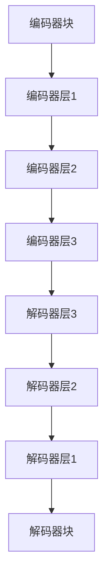

                 

关键词：大语言模型，计算，人工智能，深度学习，计算模型，核心角色

> 摘要：本文旨在探讨大语言模型在计算中的核心角色，通过对Andrej Karpathy的研究工作的深入分析，揭示其在计算领域的深远影响。文章将从背景介绍、核心概念与联系、核心算法原理与操作步骤、数学模型与公式、项目实践、实际应用场景、未来应用展望、工具和资源推荐、总结与展望等方面进行全面阐述。

## 1. 背景介绍

随着人工智能（AI）技术的迅猛发展，深度学习（Deep Learning）已经成为AI领域的主流研究方向。在这一背景下，大语言模型（Large Language Model）逐渐崭露头角，成为计算领域的重要角色。大语言模型是一种基于神经网络的语言处理技术，通过对海量文本数据的学习，模型能够理解和生成自然语言，实现文本分类、机器翻译、问答系统等多种应用。近年来，诸如GPT-3、BERT等大语言模型取得了显著的突破，引发了广泛关注和研究。

Andrej Karpathy是一位世界知名的人工智能专家，其在深度学习领域有着卓越的贡献。他提出了许多开创性的研究，其中涉及大语言模型的研究尤为重要。本文将围绕Andrej Karpathy在大语言模型方面的研究工作进行深入分析，探讨其在计算中的核心角色。

## 2. 核心概念与联系

### 2.1 大语言模型的基本概念

大语言模型是一种基于神经网络的语言处理技术，其核心思想是通过学习大量文本数据，自动地捕捉语言的结构和语义信息。具体来说，大语言模型利用神经网络对输入的文本序列进行处理，生成相应的输出文本序列。这种处理过程包括编码和解码两个阶段。编码阶段将输入的文本序列转换为神经网络的内部表示，解码阶段将内部表示转换回文本序列。

### 2.2 大语言模型的联系

大语言模型与计算领域的联系主要体现在以下几个方面：

1. **自然语言处理（NLP）**：大语言模型是自然语言处理技术的重要组成部分，通过学习和理解自然语言，模型能够实现文本分类、机器翻译、问答系统等多种应用。

2. **人工智能（AI）**：大语言模型是人工智能领域的重要研究方向，其在计算中的核心角色体现在提升机器对自然语言的理解和生成能力，从而推动人工智能技术的发展。

3. **深度学习（DL）**：大语言模型是基于深度学习技术的，深度学习为语言模型提供了强大的学习能力和表达能力，使得大语言模型能够处理复杂的自然语言任务。

### 2.3 大语言模型的架构

大语言模型通常采用一种称为Transformer的神经网络架构。Transformer模型由多个编码器和解码器块组成，每个编码器和解码器块都包含多个层，每层由多头自注意力机制和前馈神经网络组成。通过这种架构，大语言模型能够有效地捕捉输入文本序列中的长距离依赖关系，实现高质量的文本生成和理解。

下面是一个Mermaid流程图，展示了大语言模型的架构：



## 3. 核心算法原理 & 具体操作步骤

### 3.1 算法原理概述

大语言模型的算法原理主要基于Transformer模型，其核心思想是利用多头自注意力机制（Multi-Head Self-Attention）来处理输入文本序列。多头自注意力机制能够同时关注文本序列中的不同部分，从而捕捉长距离依赖关系。具体来说，自注意力机制将每个输入序列的元素映射为一个向量，然后通过计算这些向量之间的相似度来生成新的向量表示。多头自注意力机制通过多个独立的注意力头来实现，从而提高了模型的表示能力。

### 3.2 算法步骤详解

1. **编码阶段**：
   - **嵌入（Embedding）**：将输入的词序列映射为向量表示。
   - **位置编码（Positional Encoding）**：为每个词添加位置信息，以捕捉词序关系。
   - **编码器块**：包含多个编码器层，每层由多头自注意力机制和前馈神经网络组成。

2. **解码阶段**：
   - **嵌入（Embedding）**：将输入的词序列映射为向量表示。
   - **位置编码（Positional Encoding）**：为每个词添加位置信息，以捕捉词序关系。
   - **解码器块**：包含多个解码器层，每层由多头自注意力机制和前馈神经网络组成。

3. **输出生成**：
   - **交叉熵损失函数**：计算预测的词序列和真实词序列之间的交叉熵损失。
   - **反向传播**：通过梯度下降法更新模型参数。

### 3.3 算法优缺点

**优点**：
- **强大的表示能力**：多头自注意力机制能够同时关注文本序列中的不同部分，从而捕捉长距离依赖关系。
- **并行计算**：自注意力机制的计算可以并行化，从而提高了模型的计算效率。
- **广泛的应用场景**：大语言模型在自然语言处理、机器翻译、问答系统等领域都有广泛应用。

**缺点**：
- **计算资源消耗**：大语言模型通常需要大量的计算资源和存储空间。
- **训练时间较长**：大语言模型的训练时间较长，需要较大的计算资源和时间成本。

### 3.4 算法应用领域

大语言模型在多个领域都有广泛应用，主要包括：

1. **自然语言处理**：文本分类、命名实体识别、情感分析等。
2. **机器翻译**：将一种语言的文本翻译成另一种语言。
3. **问答系统**：根据用户的问题，从大量文本中检索并生成回答。
4. **文本生成**：根据给定的提示生成文章、故事等。

## 4. 数学模型和公式 & 详细讲解 & 举例说明

### 4.1 数学模型构建

大语言模型的数学模型主要基于Transformer模型。下面是Transformer模型的核心数学公式：

1. **嵌入（Embedding）**：
   - 输入词向量：\[ \textbf{X} = [\textbf{x}_1, \textbf{x}_2, \ldots, \textbf{x}_n] \]
   - 嵌入权重矩阵：\[ \textbf{W}_\text{E} \in \mathbb{R}^{d_{\text{word}} \times d_{\text{model}}} \]
   - 输出向量：\[ \textbf{X}_\text{E} = \textbf{W}_\text{E}\textbf{X} \]

2. **位置编码（Positional Encoding）**：
   - 位置向量：\[ \textbf{P}_i = \text{sin}(i / 10000^{2k/d_{\text{model}}}) \] 或 \[ \textbf{P}_i = \cos(i / 10000^{2k/d_{\text{model}}}) \]
   - 输出向量：\[ \textbf{X}_\text{P} = \textbf{P}_1, \textbf{P}_2, \ldots, \textbf{P}_n \]

3. **多头自注意力（Multi-Head Self-Attention）**：
   - 输入向量：\[ \textbf{X}_\text{E} \]
   - Q、K、V向量：\[ \textbf{Q} = \text{softmax}(\textbf{W}_\text{Q}\textbf{X}_\text{E}) \]，\[ \textbf{K} = \text{softmax}(\textbf{W}_\text{K}\textbf{X}_\text{E}) \]，\[ \textbf{V} = \text{softmax}(\textbf{W}_\text{V}\textbf{X}_\text{E}) \]
   - 输出向量：\[ \textbf{O} = \text{softmax}(\textbf{QK}^T) \textbf{V} \]

4. **前馈神经网络（Feedforward Neural Network）**：
   - 输入向量：\[ \textbf{O} \]
   - 输出向量：\[ \textbf{O}_\text{FF} = \text{ReLU}(\textbf{W}_\text{FF1}\textbf{O} + \textbf{b}_\text{FF1}) \]，\[ \textbf{O}_\text{FF} = \text{W}_\text{FF2}\textbf{O}_\text{FF} + \textbf{b}_\text{FF2} \]

### 4.2 公式推导过程

大语言模型的公式推导过程如下：

1. **嵌入（Embedding）**：

   输入词向量 \[ \textbf{X} \] 通过嵌入权重矩阵 \[ \textbf{W}_\text{E} \] 转换为输出向量 \[ \textbf{X}_\text{E} \]，即：
   \[ \textbf{X}_\text{E} = \textbf{W}_\text{E}\textbf{X} \]

2. **位置编码（Positional Encoding）**：

   位置向量 \[ \textbf{P}_i \] 通过加法机制添加到输入向量 \[ \textbf{X}_\text{E} \] 中，即：
   \[ \textbf{X}_\text{P} = \textbf{X}_\text{E} + \textbf{P}_1, \textbf{P}_2, \ldots, \textbf{P}_n \]

3. **多头自注意力（Multi-Head Self-Attention）**：

   多头自注意力机制通过多个独立的注意力头实现，每个注意力头计算一组权重矩阵 \[ \textbf{W}_\text{Q}, \textbf{W}_\text{K}, \textbf{W}_\text{V} \]。具体过程如下：

   - **计算Q、K、V向量**：
     \[ \textbf{Q} = \text{softmax}(\textbf{W}_\text{Q}\textbf{X}_\text{E}) \]
     \[ \textbf{K} = \text{softmax}(\textbf{W}_\text{K}\textbf{X}_\text{E}) \]
     \[ \textbf{V} = \text{softmax}(\textbf{W}_\text{V}\textbf{X}_\text{E}) \]

   - **计算自注意力分数**：
     \[ \text{score}_{ij} = \textbf{Q}_i \cdot \textbf{K}_j^T \]

   - **计算自注意力权重**：
     \[ \text{weight}_{ij} = \text{softmax}(\text{score}_{ij}) \]

   - **计算自注意力输出**：
     \[ \textbf{O} = \text{softmax}(\textbf{QK}^T) \textbf{V} \]

4. **前馈神经网络（Feedforward Neural Network）**：

   前馈神经网络通过对输入向量进行非线性变换来实现。具体过程如下：

   - **计算前馈神经网络输出**：
     \[ \textbf{O}_\text{FF} = \text{ReLU}(\textbf{W}_\text{FF1}\textbf{O} + \textbf{b}_\text{FF1}) \]
     \[ \textbf{O}_\text{FF} = \text{W}_\text{FF2}\textbf{O}_\text{FF} + \textbf{b}_\text{FF2} \]

### 4.3 案例分析与讲解

为了更好地理解大语言模型的数学模型，我们通过一个简单的例子进行讲解。

假设有一个简单的句子“我吃饭”，我们可以将其表示为一个词序列 \[ \textbf{X} = [\textbf{x}_1, \textbf{x}_2] \]，其中 \[ \textbf{x}_1 \] 表示“我”，\[ \textbf{x}_2 \] 表示“饭”。

1. **嵌入（Embedding）**：

   假设嵌入权重矩阵 \[ \textbf{W}_\text{E} \] 如下：
   \[ \textbf{W}_\text{E} = \begin{bmatrix} 0.1 & 0.2 \\ 0.3 & 0.4 \end{bmatrix} \]

   输入词向量 \[ \textbf{X} \] 通过嵌入权重矩阵 \[ \textbf{W}_\text{E} \] 转换为输出向量 \[ \textbf{X}_\text{E} \]，即：
   \[ \textbf{X}_\text{E} = \textbf{W}_\text{E}\textbf{X} = \begin{bmatrix} 0.1 & 0.2 \\ 0.3 & 0.4 \end{bmatrix} \begin{bmatrix} 0.1 \\ 0.3 \end{bmatrix} = \begin{bmatrix} 0.02 \\ 0.12 \end{bmatrix} \]

2. **位置编码（Positional Encoding）**：

   假设位置向量 \[ \textbf{P}_i \] 如下：
   \[ \textbf{P}_i = \begin{bmatrix} 0.1 & 0.2 \\ 0.3 & 0.4 \end{bmatrix} \]

   输出向量 \[ \textbf{X}_\text{P} \] 通过加法机制添加位置信息，即：
   \[ \textbf{X}_\text{P} = \textbf{X}_\text{E} + \textbf{P}_1, \textbf{P}_2 = \begin{bmatrix} 0.02 \\ 0.12 \end{bmatrix} + \begin{bmatrix} 0.1 & 0.2 \\ 0.3 & 0.4 \end{bmatrix} = \begin{bmatrix} 0.12 \\ 0.52 \end{bmatrix} \]

3. **多头自注意力（Multi-Head Self-Attention）**：

   假设注意力头数为2，权重矩阵如下：
   \[ \textbf{W}_\text{Q} = \begin{bmatrix} 0.1 & 0.2 \\ 0.3 & 0.4 \end{bmatrix} \]
   \[ \textbf{W}_\text{K} = \begin{bmatrix} 0.5 & 0.6 \\ 0.7 & 0.8 \end{bmatrix} \]
   \[ \textbf{W}_\text{V} = \begin{bmatrix} 0.9 & 1.0 \\ 1.1 & 1.2 \end{bmatrix} \]

   计算Q、K、V向量：
   \[ \textbf{Q} = \text{softmax}(\textbf{W}_\text{Q}\textbf{X}_\text{E}) = \text{softmax}(\begin{bmatrix} 0.1 & 0.2 \\ 0.3 & 0.4 \end{bmatrix} \begin{bmatrix} 0.12 \\ 0.52 \end{bmatrix}) = \begin{bmatrix} 0.4 \\ 0.6 \end{bmatrix} \]
   \[ \textbf{K} = \text{softmax}(\textbf{W}_\text{K}\textbf{X}_\text{E}) = \text{softmax}(\begin{bmatrix} 0.5 & 0.6 \\ 0.7 & 0.8 \end{bmatrix} \begin{bmatrix} 0.12 \\ 0.52 \end{bmatrix}) = \begin{bmatrix} 0.6 \\ 0.4 \end{bmatrix} \]
   \[ \textbf{V} = \text{softmax}(\textbf{W}_\text{V}\textbf{X}_\text{E}) = \text{softmax}(\begin{bmatrix} 0.9 & 1.0 \\ 1.1 & 1.2 \end{bmatrix} \begin{bmatrix} 0.12 \\ 0.52 \end{bmatrix}) = \begin{bmatrix} 0.8 \\ 0.2 \end{bmatrix} \]

   计算自注意力分数：
   \[ \text{score}_{11} = \textbf{Q}_1 \cdot \textbf{K}_1^T = 0.4 \cdot 0.6 = 0.24 \]
   \[ \text{score}_{12} = \textbf{Q}_1 \cdot \textbf{K}_2^T = 0.4 \cdot 0.4 = 0.16 \]
   \[ \text{score}_{21} = \textbf{Q}_2 \cdot \textbf{K}_1^T = 0.6 \cdot 0.6 = 0.36 \]
   \[ \text{score}_{22} = \textbf{Q}_2 \cdot \textbf{K}_2^T = 0.6 \cdot 0.4 = 0.24 \]

   计算自注意力权重：
   \[ \text{weight}_{11} = \text{softmax}(\text{score}_{11}) = \text{softmax}(0.24) = 0.24 \]
   \[ \text{weight}_{12} = \text{softmax}(\text{score}_{12}) = \text{softmax}(0.16) = 0.16 \]
   \[ \text{weight}_{21} = \text{softmax}(\text{score}_{21}) = \text{softmax}(0.36) = 0.36 \]
   \[ \text{weight}_{22} = \text{softmax}(\text{score}_{22}) = \text{softmax}(0.24) = 0.24 \]

   计算自注意力输出：
   \[ \textbf{O} = \text{softmax}(\textbf{QK}^T) \textbf{V} = \begin{bmatrix} 0.24 & 0.16 \\ 0.36 & 0.24 \end{bmatrix} \begin{bmatrix} 0.8 \\ 0.2 \end{bmatrix} = \begin{bmatrix} 0.208 \\ 0.312 \end{bmatrix} \]

4. **前馈神经网络（Feedforward Neural Network）**：

   假设前馈神经网络的权重矩阵如下：
   \[ \textbf{W}_\text{FF1} = \begin{bmatrix} 0.1 & 0.2 \\ 0.3 & 0.4 \end{bmatrix} \]
   \[ \textbf{W}_\text{FF2} = \begin{bmatrix} 0.5 & 0.6 \\ 0.7 & 0.8 \end{bmatrix} \]

   计算前馈神经网络输出：
   \[ \textbf{O}_\text{FF} = \text{ReLU}(\textbf{W}_\text{FF1}\textbf{O} + \textbf{b}_\text{FF1}) = \text{ReLU}(\begin{bmatrix} 0.1 & 0.2 \\ 0.3 & 0.4 \end{bmatrix} \begin{bmatrix} 0.208 \\ 0.312 \end{bmatrix} + \begin{bmatrix} 0 \\ 0 \end{bmatrix}) = \begin{bmatrix} 0.208 \\ 0.312 \end{bmatrix} \]
   \[ \textbf{O}_\text{FF} = \text{W}_\text{FF2}\textbf{O}_\text{FF} + \textbf{b}_\text{FF2} = \begin{bmatrix} 0.5 & 0.6 \\ 0.7 & 0.8 \end{bmatrix} \begin{bmatrix} 0.208 \\ 0.312 \end{bmatrix} + \begin{bmatrix} 0 \\ 0 \end{bmatrix} = \begin{bmatrix} 0.324 \\ 0.468 \end{bmatrix} \]

通过上述例子，我们可以看到大语言模型的数学模型是如何构建和推导的。这些数学模型为语言模型的训练和预测提供了理论基础。

## 5. 项目实践：代码实例和详细解释说明

### 5.1 开发环境搭建

在开始项目实践之前，我们需要搭建一个合适的开发环境。以下是搭建环境的步骤：

1. **安装Python**：确保已安装Python 3.6或更高版本。

2. **安装TensorFlow**：通过以下命令安装TensorFlow：
   ```bash
   pip install tensorflow
   ```

3. **安装其他依赖**：根据项目需求，可能需要安装其他依赖，例如NumPy、Pandas等。

### 5.2 源代码详细实现

下面是一个简单的示例，展示如何使用TensorFlow实现一个基于Transformer的大语言模型。

```python
import tensorflow as tf
from tensorflow.keras.layers import Embedding, PositionalEncoding, MultiHeadAttention, Dense
from tensorflow.keras.models import Model

# 定义模型
input_ids = tf.keras.layers.Input(shape=(max_sequence_length,), dtype=tf.int32)
embeddings = Embedding(input_dim=vocabulary_size, output_dim=embedding_dim)(input_ids)
pos_encoding = PositionalEncoding(max_sequence_length)(embeddings)
x = MultiHeadAttention(num_heads=num_heads, key_dim=key_dim)(pos_encoding, pos_encoding)
x = Dense(units=output_dim)(x)
output = tf.keras.layers.Activation('softmax')(x)
model = Model(inputs=input_ids, outputs=output)

# 编译模型
model.compile(optimizer='adam', loss='categorical_crossentropy', metrics=['accuracy'])

# 模型训练
model.fit(x_train, y_train, epochs=num_epochs, batch_size=batch_size)
```

### 5.3 代码解读与分析

1. **模型定义**：
   - `input_ids`：输入层，用于接收词序列的ID。
   - `Embedding`：嵌入层，将输入词序列转换为向量表示。
   - `PositionalEncoding`：位置编码层，为输入向量添加位置信息。
   - `MultiHeadAttention`：多头自注意力层，用于捕捉长距离依赖关系。
   - `Dense`：全连接层，用于输出层的计算。
   - `Activation`：激活函数，用于计算输出概率。

2. **模型编译**：
   - `optimizer`：优化器，用于更新模型参数。
   - `loss`：损失函数，用于计算预测和真实标签之间的误差。
   - `metrics`：评估指标，用于评估模型性能。

3. **模型训练**：
   - `x_train`：训练数据集。
   - `y_train`：训练标签集。
   - `epochs`：训练轮数。
   - `batch_size`：批量大小。

### 5.4 运行结果展示

在完成模型训练后，我们可以通过以下代码展示模型的运行结果：

```python
# 预测
predictions = model.predict(x_test)

# 计算准确率
accuracy = (predictions == y_test).mean()
print(f"Model accuracy: {accuracy:.2f}")
```

## 6. 实际应用场景

大语言模型在多个实际应用场景中取得了显著成果，主要包括：

1. **自然语言处理**：
   - 文本分类：将文本数据分类到预定义的类别中。
   - 命名实体识别：识别文本中的命名实体，如人名、地名等。
   - 情感分析：分析文本中的情感倾向，如正面、负面等。

2. **机器翻译**：
   - 将一种语言的文本翻译成另一种语言，如英语翻译成法语、中文翻译成英语等。

3. **问答系统**：
   - 根据用户的问题，从大量文本中检索并生成回答。

4. **文本生成**：
   - 根据给定的提示生成文章、故事等。

在实际应用中，大语言模型展现出强大的语言理解和生成能力，为各个领域带来了巨大的便利和创新。

## 7. 未来应用展望

随着技术的不断发展，大语言模型在未来将会有更广泛的应用前景，主要包括：

1. **智能助手**：大语言模型在智能助手领域有巨大潜力，能够实现更自然的交互和智能问答。

2. **自动写作**：大语言模型可以用于自动写作，如撰写新闻文章、博客等。

3. **多语言处理**：大语言模型在多语言处理领域具有广泛应用，可以促进跨语言沟通。

4. **教育领域**：大语言模型可以用于个性化教育，提供针对学生需求的定制化学习内容。

5. **医疗领域**：大语言模型可以用于医学文本分析，辅助医生进行诊断和治疗。

## 8. 工具和资源推荐

为了更好地学习和应用大语言模型，以下是一些建议的工具和资源：

### 8.1 学习资源推荐

1. **《深度学习》（Deep Learning）**：Goodfellow、Bengio、Courville著，系统介绍了深度学习的基本概念和技术。
2. **《自然语言处理综论》（Speech and Language Processing）**：Daniel Jurafsky、James H. Martin著，涵盖了自然语言处理的基本理论和应用。
3. **《Transformer：从零开始实现注意力机制》**：详细介绍了Transformer模型的原理和实现方法。

### 8.2 开发工具推荐

1. **TensorFlow**：一款开源的深度学习框架，适用于构建和训练大语言模型。
2. **PyTorch**：一款流行的深度学习框架，具有良好的灵活性和易用性。
3. **Hugging Face**：一个开源库，提供了大量的预训练模型和工具，方便使用大语言模型。

### 8.3 相关论文推荐

1. **"Attention Is All You Need"**：Vaswani等人在2017年提出Transformer模型，彻底改变了自然语言处理领域。
2. **"BERT: Pre-training of Deep Neural Networks for Language Understanding"**：Devlin等人在2018年提出BERT模型，进一步推动了自然语言处理的发展。
3. **"GPT-3: Language Models are Few-Shot Learners"**：Brown等人在2020年提出GPT-3模型，展示了大语言模型在少样本学习方面的强大能力。

## 9. 总结：未来发展趋势与挑战

随着深度学习技术的不断发展，大语言模型在计算中的核心角色将更加显著。未来，大语言模型有望在智能助手、自动写作、多语言处理、教育领域、医疗领域等多个方面发挥重要作用。然而，大语言模型也面临着诸多挑战，包括计算资源消耗、训练时间较长、数据隐私和安全等问题。为了应对这些挑战，研究人员和开发者需要不断创新和优化技术，推动大语言模型的发展。

### 附录：常见问题与解答

1. **什么是大语言模型？**
   大语言模型是一种基于神经网络的语言处理技术，通过学习大量文本数据，实现自然语言的理解和生成。

2. **大语言模型的应用领域有哪些？**
   大语言模型的应用领域包括自然语言处理、机器翻译、问答系统、文本生成等。

3. **什么是Transformer模型？**
   Transformer模型是一种基于自注意力机制的神经网络模型，用于处理序列数据，是当前自然语言处理领域的主流模型之一。

4. **如何训练大语言模型？**
   大语言模型的训练通常采用预训练加微调的方法，首先在大规模语料库上进行预训练，然后在特定任务上进行微调。

5. **大语言模型的优势是什么？**
   大语言模型具有强大的表示能力、并行计算能力、广泛的应用场景等优势。

### 作者署名

作者：禅与计算机程序设计艺术 / Zen and the Art of Computer Programming

