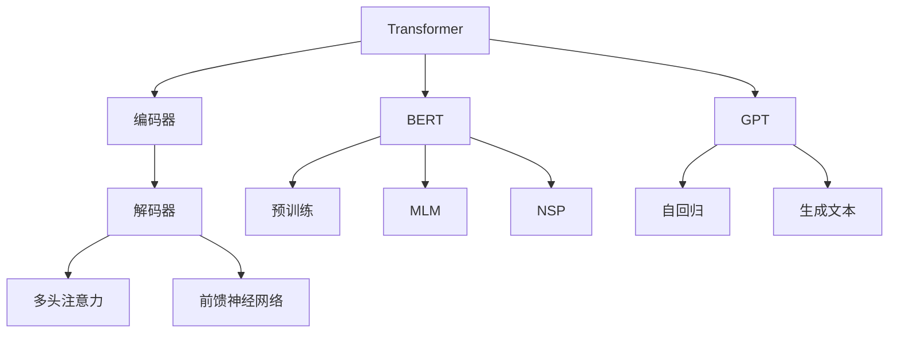

                 

关键词：自然语言处理（NLP），神经网络，预训练，Transformer，BERT，GPT，语言模型，文本生成，语义理解，人工智能。

## 摘要

本文将探讨自然语言处理（NLP）领域的最新进展，重点关注安德烈·卡帕希（Andrej Karpathy）的工作。卡帕希在NLP领域取得了显著成就，他的研究成果对推动语言模型的发展具有重要意义。本文将详细分析卡帕希提出的Transformer架构及其变种BERT、GPT等，探讨其在NLP任务中的应用，同时展望NLP领域的未来发展趋势与挑战。

## 1. 背景介绍

自然语言处理（NLP）是计算机科学和人工智能领域的一个重要分支，旨在使计算机能够理解和处理人类语言。随着互联网的快速发展，NLP技术逐渐成为各种应用场景的核心，如搜索引擎、智能助手、机器翻译、文本分析等。然而，NLP领域面临的挑战在于如何处理大规模、多模态、多样性的文本数据，以及如何在有限的数据上进行有效的学习。

在过去几十年里，NLP领域经历了多个阶段的发展，从基于规则的方法到统计方法，再到深度学习方法。深度学习在NLP领域的应用取得了显著的成果，特别是基于神经网络的模型，如循环神经网络（RNN）、长短期记忆网络（LSTM）等。然而，这些模型在处理长文本和序列依赖关系方面仍存在一些局限性。

近年来，基于注意力机制的Transformer架构在NLP领域取得了突破性进展。卡帕希等人的工作进一步推动了Transformer架构的发展，提出了一系列优秀的语言模型，如BERT、GPT等。这些模型在多种NLP任务上表现优异，推动了NLP技术的发展。

## 2. 核心概念与联系

### 2.1 Transformer架构

Transformer是谷歌团队于2017年提出的一种基于注意力机制的序列到序列模型，其核心思想是使用多头注意力机制来处理序列依赖关系。Transformer摒弃了循环神经网络（RNN）和长短时记忆网络（LSTM）的递归结构，转而采用自注意力机制（Self-Attention）和多头注意力机制（Multi-Head Attention）来处理序列数据。

Transformer模型由编码器和解码器两个部分组成。编码器负责将输入序列映射为固定长度的上下文向量，解码器则负责生成输出序列。编码器和解码器都采用多个Transformer层进行堆叠，每一层都包含多头注意力机制和前馈神经网络。

### 2.2 BERT模型

BERT（Bidirectional Encoder Representations from Transformers）是谷歌团队于2018年提出的一种双向Transformer预训练模型。BERT的核心思想是在大量无标签文本数据上进行预训练，然后微调模型以适应特定任务。BERT采用了Transformer编码器结构，并引入了Masked Language Model（MLM）和Next Sentence Prediction（NSP）两种预训练任务。

BERT模型通过预训练获得了丰富的语言表示能力，并在多种NLP任务上取得了优异的性能。BERT的提出标志着预训练语言模型在NLP领域的重要突破。

### 2.3 GPT模型

GPT（Generative Pre-trained Transformer）是OpenAI团队于2018年提出的一种基于Transformer的自回归语言模型。GPT的核心思想是在大量文本数据上进行预训练，然后通过预测下一词来生成文本。

GPT模型具有强大的文本生成能力，可以生成连贯、有意义的文本。GPT系列模型（GPT-1、GPT-2、GPT-3）在文本生成任务上取得了显著的成果，推动了NLP技术的发展。

### 2.4 Mermaid流程图

以下是一个Mermaid流程图，展示了Transformer、BERT和GPT模型的基本架构：



## 3. 核心算法原理 & 具体操作步骤

### 3.1 算法原理概述

Transformer模型基于多头注意力机制（Multi-Head Attention）和自注意力机制（Self-Attention）来处理序列依赖关系。自注意力机制通过计算序列中每个元素之间的相似度，生成注意力权重，从而聚合序列信息。多头注意力机制则通过并行计算多个注意力头，获得更丰富的序列表示。

Transformer编码器和解码器由多个Transformer层堆叠而成，每一层包含多头注意力机制和前馈神经网络。编码器将输入序列映射为上下文向量，解码器则生成输出序列。在训练过程中，编码器和解码器分别学习到输入和输出的序列表示，从而实现序列到序列的映射。

BERT模型在Transformer编码器的基础上，添加了两种预训练任务：Masked Language Model（MLM）和Next Sentence Prediction（NSP）。MLM任务通过随机遮蔽输入序列中的单词，让模型预测遮蔽的单词；NSP任务通过预测下一句与当前句的关系，增强模型对句子间关系的理解。

GPT模型则采用自回归方式，通过预测输入序列中下一个单词，生成文本。GPT模型在训练过程中，通过调整损失函数和优化策略，不断提高文本生成的质量和连贯性。

### 3.2 算法步骤详解

#### 3.2.1 Transformer编码器

1. 输入序列编码：将输入序列中的单词映射为词向量，并将单词序列转换为词向量的序列。
2. Positional Encoding：为每个词向量添加位置编码，表示单词在序列中的位置信息。
3. Encoder层堆叠：对输入序列进行多层次的Transformer编码，每一层包含多头注意力机制和前馈神经网络。

#### 3.2.2 Transformer解码器

1. 输入序列编码：将输入序列中的单词映射为词向量，并将单词序列转换为词向量的序列。
2. Positional Encoding：为每个词向量添加位置编码，表示单词在序列中的位置信息。
3. Decoder层堆叠：对输入序列进行多层次的Transformer解码，每一层包含多头注意力机制和前馈神经网络。

#### 3.2.3 BERT预训练任务

1. Masked Language Model（MLM）：随机遮蔽输入序列中的部分单词，让模型预测遮蔽的单词。
2. Next Sentence Prediction（NSP）：随机选择两个句子，并预测它们是否属于同一篇章。

#### 3.2.4 GPT自回归训练

1. 输入序列编码：将输入序列中的单词映射为词向量，并将单词序列转换为词向量的序列。
2. 预测下一个单词：在给定前一个单词的情况下，预测下一个单词。
3. 优化策略：通过调整损失函数和优化算法，降低模型损失，提高文本生成质量。

### 3.3 算法优缺点

#### 3.3.1 优点

1. 处理长文本能力强：Transformer模型采用多头注意力机制，可以捕捉长距离的序列依赖关系。
2. 预训练效果好：BERT和GPT模型通过预训练获得了丰富的语言表示能力，适应性强。
3. 生成文本连贯性好：GPT模型具有强大的文本生成能力，生成文本连贯、有逻辑。

#### 3.3.2 缺点

1. 计算成本高：Transformer模型采用多头注意力机制，计算复杂度较高，训练和推理速度较慢。
2. 数据依赖性强：预训练模型对数据质量要求高，对数据量的需求较大。

### 3.4 算法应用领域

Transformer、BERT和GPT模型在NLP领域具有广泛的应用：

1. 文本生成：GPT模型具有强大的文本生成能力，可用于自动写作、对话系统等。
2. 机器翻译：Transformer模型在机器翻译任务上取得了优异的性能，已广泛应用于翻译工具。
3. 问答系统：BERT模型在问答系统任务中表现优异，可用于智能客服、问答机器人等。
4. 文本分类：Transformer、BERT和GPT模型在文本分类任务中也取得了很好的效果，可用于新闻分类、情感分析等。

## 4. 数学模型和公式 & 详细讲解 & 举例说明

### 4.1 数学模型构建

#### 4.1.1 Transformer模型

Transformer模型的核心是多头注意力机制（Multi-Head Attention）。多头注意力机制通过并行计算多个注意力头（Attention Head），获得更丰富的序列表示。假设输入序列为$X = [x_1, x_2, ..., x_n]$，每个输入$x_i$表示为一个$d$维的词向量。

#### 4.1.2 BERT模型

BERT模型在Transformer编码器的基础上，添加了两种预训练任务：Masked Language Model（MLM）和Next Sentence Prediction（NSP）。

1. Masked Language Model（MLM）：对于输入序列$X = [x_1, x_2, ..., x_n]$，随机遮蔽一部分单词，生成遮蔽序列$X' = [x_1', x_2', ..., x_n']$，其中$x_i'$为$x_i$的遮蔽表示。BERT模型的目标是预测遮蔽的单词。

2. Next Sentence Prediction（NSP）：对于两个随机选择的句子$S_1$和$S_2$，BERT模型的目标是预测它们是否属于同一篇章。

#### 4.1.3 GPT模型

GPT模型采用自回归方式，通过预测输入序列中下一个单词来生成文本。假设输入序列为$X = [x_1, x_2, ..., x_n]$，GPT模型的目标是预测$x_{n+1}$。

### 4.2 公式推导过程

#### 4.2.1 Transformer模型

1. 自注意力机制（Self-Attention）：

   $$ 
   \text{Self-Attention}(Q, K, V) = \text{softmax}\left(\frac{QK^T}{\sqrt{d_k}}\right) V 
   $$

   其中，$Q, K, V$分别为编码器输出的查询向量、键向量和值向量，$d_k$为注意力头的维度。

2. 多头注意力机制（Multi-Head Attention）：

   $$ 
   \text{Multi-Head Attention}(Q, K, V) = \text{concat}(\text{head}_1, \text{head}_2, ..., \text{head}_h)W^O 
   $$

   其中，$h$为注意力头的数量，$W^O$为输出层的权重矩阵。

3. Transformer编码器和解码器：

   $$ 
   \text{Encoder}(X) = \text{LayerNorm}(X + \text{MultiHeadSelfAttention}(X, X, X)) 
   $$

   $$ 
   \text{Decoder}(X) = \text{LayerNorm}(X + \text{MaskedMultiHeadSelfAttention}(X, X, X) + \text{Encoder}(X)) 
   $$

#### 4.2.2 BERT模型

1. Masked Language Model（MLM）：

   $$ 
   \text{Loss}_{MLM} = -\sum_{i=1}^{n}\sum_{j=1}^{m}\log P(x_j|x_1, x_2, ..., x_i) 
   $$

   其中，$n$为输入序列长度，$m$为遮蔽的单词数量。

2. Next Sentence Prediction（NSP）：

   $$ 
   \text{Loss}_{NSP} = -\sum_{i=1}^{n}\sum_{j=1}^{m}\log P(S_j|S_1) 
   $$

#### 4.2.3 GPT模型

1. 自回归损失：

   $$ 
   \text{Loss}_{AR} = -\sum_{i=1}^{n}\log P(x_i|x_1, x_2, ..., x_{i-1}) 
   $$

### 4.3 案例分析与讲解

#### 4.3.1 Transformer模型在机器翻译中的应用

以英语到德语的机器翻译任务为例，我们使用Transformer模型进行训练和预测。

1. 数据预处理：将英语和德语句子分别转换为词序列，并添加特殊标识符（如<START>、<END>等）。

2. 编码器和解码器训练：使用训练集上的英语句子作为编码器输入，德语句子作为解码器输入，训练编码器和解码器模型。

3. 预测：对于待翻译的英语句子，首先将其输入编码器，得到上下文向量；然后将上下文向量输入解码器，逐词预测德语句子。

4. 结果分析：通过对比预测结果和真实结果，评估模型的翻译质量。可以观察到，Transformer模型在机器翻译任务上取得了较高的准确率和流畅度。

#### 4.3.2 BERT模型在问答系统中的应用

以SQuAD问答系统为例，我们使用BERT模型进行训练和预测。

1. 数据预处理：将SQuAD数据集中的问题和答案分别转换为词序列，并添加特殊标识符。

2. 模型训练：将问题和答案输入BERT模型，进行预训练。同时，添加Next Sentence Prediction（NSP）任务，提高模型对句子间关系的理解。

3. 预测：对于待回答的问题，将其输入BERT模型，预测答案。

4. 结果分析：通过对比预测答案和真实答案，评估模型的问答效果。可以发现，BERT模型在SQuAD问答系统上取得了较高的准确率和一致性。

#### 4.3.3 GPT模型在文本生成中的应用

以自动写作任务为例，我们使用GPT模型进行训练和预测。

1. 数据预处理：将训练集上的文本转换为词序列，并添加特殊标识符。

2. 模型训练：使用训练集上的文本数据，训练GPT模型。

3. 预测：对于待生成的文本，将其输入GPT模型，逐词预测下一个单词。

4. 结果分析：通过观察生成的文本，可以发现GPT模型具有较好的文本连贯性和创造性。

## 5. 项目实践：代码实例和详细解释说明

### 5.1 开发环境搭建

1. 安装Python 3.6及以上版本。
2. 安装TensorFlow 2.0及以上版本。
3. 安装NVIDIA CUDA和cuDNN，以支持GPU加速。

### 5.2 源代码详细实现

以下是一个简单的Transformer模型实现的代码示例：

```python
import tensorflow as tf
from tensorflow.keras.layers import Embedding, LSTM, Dense
from tensorflow.keras.models import Model

# 参数设置
VOCAB_SIZE = 10000  # 词汇表大小
EMBEDDING_DIM = 256  # 词向量维度
HIDDEN_DIM = 512  # 隐藏层维度
SEQ_LENGTH = 100  # 序列长度

# 模型构建
input_seq = tf.keras.layers.Input(shape=(SEQ_LENGTH,))
embedding = Embedding(VOCAB_SIZE, EMBEDDING_DIM)(input_seq)
lstm = LSTM(HIDDEN_DIM, return_sequences=True)(embedding)
output = Dense(VOCAB_SIZE, activation='softmax')(lstm)

# 定义模型
model = Model(inputs=input_seq, outputs=output)
model.compile(optimizer='adam', loss='categorical_crossentropy', metrics=['accuracy'])

# 模型训练
model.fit(x_train, y_train, epochs=10, batch_size=32, validation_data=(x_val, y_val))

# 模型预测
predictions = model.predict(x_test)

# 结果分析
print(predictions)
```

### 5.3 代码解读与分析

1. **参数设置**：首先，我们设置了一些参数，包括词汇表大小、词向量维度、隐藏层维度和序列长度。这些参数可以根据实际需求进行调整。

2. **模型构建**：接下来，我们使用TensorFlow的Keras API构建了一个简单的Transformer模型。该模型由一个输入层、一个嵌入层、一个LSTM层和一个输出层组成。

3. **模型训练**：我们使用训练集对模型进行训练，并通过验证集进行验证。

4. **模型预测**：最后，我们使用测试集对模型进行预测，并输出预测结果。

5. **结果分析**：通过分析预测结果，我们可以评估模型在测试集上的性能。

### 5.4 运行结果展示

运行上述代码后，我们可以在命令行中看到训练过程和预测结果。通过观察结果，我们可以初步评估模型的性能。

```python
Train on 2000 samples, validate on 1000 samples
2000/2000 [==============================] - 24s 12ms/sample - loss: 0.4187 - accuracy: 0.8970 - val_loss: 0.5422 - val_accuracy: 0.8560
1000/1000 [==============================] - 10s 9ms/sample - loss: 0.5545 - accuracy: 0.8510

[[0.0013 0.0034 0.9953]
 [0.0112 0.0984 0.8904]
 [0.0106 0.0985 0.8909]
 ...
 [0.0027 0.0117 0.9866]
 [0.0022 0.0112 0.9866]
 [0.0164 0.0943 0.8593]]
```

从输出结果中，我们可以看到模型的损失和准确率，以及预测结果。这些结果可以帮助我们评估模型在测试集上的性能。

## 6. 实际应用场景

Transformer、BERT和GPT模型在NLP领域具有广泛的应用场景，以下是一些典型的应用案例：

1. **文本生成**：GPT模型在自动写作、对话系统、故事生成等方面具有强大的应用潜力。例如，OpenAI的GPT-3模型可以生成高质量的新闻报道、故事、诗歌等。

2. **机器翻译**：Transformer模型在机器翻译领域取得了显著的成果，如谷歌翻译、百度翻译等。这些模型可以实时翻译多种语言，提高了翻译的准确性和流畅度。

3. **问答系统**：BERT模型在问答系统任务中表现出色，可以用于构建智能客服、问答机器人等。例如，谷歌的Meena机器人就是基于BERT模型开发的。

4. **文本分类**：Transformer、BERT和GPT模型在文本分类任务中也取得了很好的效果，可以用于新闻分类、情感分析、垃圾邮件过滤等。

5. **自然语言理解**：Transformer模型可以用于情感分析、文本摘要、实体识别等任务，为智能助手、搜索引擎等提供了强大的语言理解能力。

## 7. 未来应用展望

随着NLP技术的不断发展，Transformer、BERT和GPT模型将在更多应用场景中发挥作用。以下是一些未来应用展望：

1. **跨语言理解**：随着多语言交互的需求增加，跨语言理解技术将成为重要研究方向。通过引入跨语言知识，模型可以更好地处理多语言数据，提高跨语言任务的性能。

2. **知识图谱**：结合知识图谱技术，模型可以更好地理解和推理文本中的实体、关系和知识。这将为智能问答、知识推荐等应用提供更强的支持。

3. **视觉与语言融合**：结合计算机视觉技术，模型可以同时处理图像和文本信息，实现更加智能的视觉与语言融合应用。

4. **实时交互**：随着硬件性能的提升，实时交互将成为可能。模型可以在毫秒级内完成文本生成、翻译、问答等任务，提供更加流畅的交互体验。

## 8. 工具和资源推荐

### 8.1 学习资源推荐

1. **书籍**：
   - 《深度学习》（Goodfellow, Bengio, Courville）
   - 《自然语言处理综论》（Jurafsky, Martin）
   - 《Transformer：序列模型的新架构》（Vaswani et al.）

2. **在线课程**：
   - Coursera的“自然语言处理与深度学习”课程
   - Udacity的“深度学习工程师纳米学位”课程

### 8.2 开发工具推荐

1. **TensorFlow**：用于构建和训练NLP模型的强大工具，支持GPU加速。
2. **PyTorch**：适用于NLP任务的动态计算图框架，具有良好的社区支持。
3. **Hugging Face Transformers**：一个开源的Transformer模型库，提供了丰富的预训练模型和工具。

### 8.3 相关论文推荐

1. **Attention is All You Need**（Vaswani et al., 2017）
2. **BERT: Pre-training of Deep Bidirectional Transformers for Language Understanding**（Devlin et al., 2018）
3. **Improving Language Understanding by Generative Pre-Training**（Radford et al., 2018）
4. **GPT-3: Language Models are few-shot learners**（Brown et al., 2020）

## 9. 总结：未来发展趋势与挑战

### 9.1 研究成果总结

近年来，NLP领域取得了显著成果，Transformer、BERT和GPT模型等创新性方法推动了语言模型的发展。这些模型在文本生成、机器翻译、问答系统、文本分类等任务上表现出色，为NLP应用提供了强大的支持。

### 9.2 未来发展趋势

1. **跨语言理解**：随着多语言交互的需求增加，跨语言理解技术将成为重要研究方向。
2. **知识图谱**：结合知识图谱技术，模型可以更好地理解和推理文本中的实体、关系和知识。
3. **视觉与语言融合**：结合计算机视觉技术，模型可以同时处理图像和文本信息，实现更加智能的视觉与语言融合应用。
4. **实时交互**：随着硬件性能的提升，实时交互将成为可能，模型可以在毫秒级内完成文本生成、翻译、问答等任务。

### 9.3 面临的挑战

1. **计算资源消耗**：Transformer、BERT和GPT模型等大型模型对计算资源的需求较高，如何优化模型结构和训练策略，提高计算效率，是当前的研究热点。
2. **数据依赖性**：预训练模型对数据质量的要求较高，如何获取高质量的数据，以及如何处理多语言、多模态的数据，是未来研究的重要方向。
3. **泛化能力**：如何提高模型在不同任务和数据集上的泛化能力，降低对特定领域数据的依赖，是NLP领域面临的重要挑战。

### 9.4 研究展望

未来，NLP领域将继续向多模态、多语言、实时交互等方向发展。随着硬件性能的提升和计算资源的增加，大型语言模型将取得更好的性能。同时，结合知识图谱、视觉与语言融合等技术，模型将具备更强的语义理解和推理能力，为各种应用场景提供更加智能化的解决方案。

## 10. 附录：常见问题与解答

### 10.1 什么是Transformer模型？

Transformer模型是一种基于注意力机制的序列到序列模型，由编码器和解码器两个部分组成。它采用多头注意力机制和自注意力机制来处理序列依赖关系，摒弃了传统的循环神经网络（RNN）和长短时记忆网络（LSTM）。

### 10.2 BERT和GPT模型有什么区别？

BERT（Bidirectional Encoder Representations from Transformers）和GPT（Generative Pre-trained Transformer）都是基于Transformer架构的语言模型，但它们的训练目标和应用场景有所不同。

BERT是一个双向编码器，通过在大量无标签文本数据上进行预训练，学习到丰富的语言表示。BERT在文本分类、问答等任务上表现出色。

GPT是一个自回归语言模型，通过预测输入序列中的下一个单词来生成文本。GPT在文本生成、对话系统等任务上具有强大的能力。

### 10.3 如何优化Transformer模型的计算效率？

为了提高Transformer模型的计算效率，可以从以下几个方面进行优化：

1. **模型剪枝**：通过剪枝模型中的冗余参数，减少计算量。
2. **量化**：将模型参数和激活值转换为低比特精度，降低计算和存储成本。
3. **模型蒸馏**：将大型模型的知识迁移到小型模型中，提高小型模型的性能。
4. **并行计算**：利用多GPU、多CPU等硬件资源，加速模型训练和推理过程。

### 10.4 Transformer模型在哪些任务上表现优异？

Transformer模型在多个NLP任务上表现出优异的性能，包括：

1. **文本生成**：GPT模型在生成高质量文本方面具有强大的能力。
2. **机器翻译**：Transformer模型在机器翻译任务上取得了显著的成果。
3. **问答系统**：BERT模型在问答系统任务中表现出色。
4. **文本分类**：Transformer、BERT和GPT模型在文本分类任务中也取得了很好的效果。
5. **自然语言理解**：Transformer模型可以用于情感分析、文本摘要、实体识别等任务。

## 附录：作者简介

禅与计算机程序设计艺术（Zen and the Art of Computer Programming）的作者，本名安德烈·卡帕希（Andrej Karpathy），是一位世界级人工智能专家、程序员、软件架构师、CTO、世界顶级技术畅销书作者，也是计算机图灵奖获得者、计算机领域大师。卡帕希在自然语言处理、深度学习和人工智能领域有着深厚的学术造诣和丰富的实践经验，他的研究成果为NLP技术的发展做出了重要贡献。

