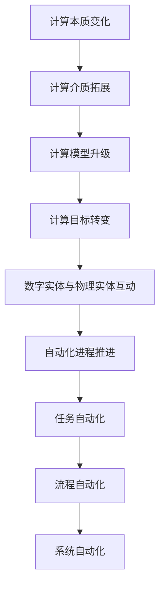

                 

关键词：人工智能，计算本质，自动化，数字实体，物理实体

摘要：本文旨在探讨人工智能专家 Andrej Karpathy 关于计算本质变化的观点。随着数字实体和物理实体的自动化逐步推进，计算正从传统的虚拟空间扩展到现实世界。本文将分析这一变革的核心概念、算法原理、数学模型、实际应用，以及未来发展趋势与面临的挑战。

## 1. 背景介绍

近年来，人工智能（AI）的发展速度迅猛，不仅改变了传统行业的面貌，还促使计算的本质发生深刻变化。Andrej Karpathy，一位世界级人工智能专家，在其研究中指出，计算正从虚拟空间向现实世界扩展。这种扩展不仅仅是技术层面的进步，更涉及到计算本质的变革。

数字实体，如虚拟世界中的角色、程序和算法，正逐渐与物理实体，如机器人、自动驾驶汽车和智能家居等，实现更深层次的互动与融合。这种融合推动了自动化进程，使得许多原本依赖人类操作的任务得以自动化完成。

## 2. 核心概念与联系

为了更好地理解这一变革，我们需要明确几个核心概念：

### 2.1 计算本质的变化

计算本质的变化主要体现在以下几个方面：

1. **计算介质的拓展**：计算不再局限于虚拟空间，开始向物理世界渗透。
2. **计算模型的升级**：从传统的符号计算向数据驱动计算转变。
3. **计算目标的转变**：从追求精确和效率，转向实现智能和适应性。

### 2.2 数字实体与物理实体的互动

数字实体和物理实体的互动是计算本质变化的关键。以下是两者的互动关系：

1. **数据驱动**：物理世界的状态和变化为数字实体提供数据支持。
2. **智能控制**：数字实体通过算法和模型对物理实体进行智能控制。
3. **反馈循环**：物理实体的响应为数字实体提供反馈，优化其算法和模型。

### 2.3 自动化进程的推进

自动化进程的推进是计算本质变化的重要体现。以下是自动化进程的主要阶段：

1. **任务自动化**：通过算法和模型实现特定任务的自动化。
2. **流程自动化**：将一系列任务组合成自动化流程，提高效率。
3. **系统自动化**：实现整个系统的自动化运行，降低对人类干预的需求。

### 2.4 Mermaid 流程图

为了更好地展示核心概念与联系，我们使用 Mermaid 流程图来描述计算本质的变化：



## 3. 核心算法原理 & 具体操作步骤

### 3.1 算法原理概述

在计算本质的变化中，核心算法原理起到了关键作用。以下是几个关键算法原理：

1. **深度学习**：通过神经网络模型实现数据驱动的智能计算。
2. **强化学习**：通过与环境互动学习，实现智能体的自适应行为。
3. **进化算法**：通过模拟生物进化过程，优化算法和模型。

### 3.2 算法步骤详解

以下是这些算法的具体操作步骤：

1. **深度学习**：
   - **数据预处理**：对输入数据进行清洗和归一化。
   - **网络架构设计**：选择合适的神经网络模型。
   - **模型训练**：使用训练数据对模型进行训练。
   - **模型评估**：使用测试数据对模型进行评估。

2. **强化学习**：
   - **状态空间定义**：定义智能体的状态空间。
   - **动作空间定义**：定义智能体的动作空间。
   - **奖励函数设计**：设计奖励函数，引导智能体学习。
   - **智能体训练**：通过与环境互动，智能体不断优化行为。

3. **进化算法**：
   - **种群初始化**：随机生成初始种群。
   - **适应度评估**：对种群中的个体进行适应度评估。
   - **选择操作**：根据适应度选择优秀个体进行繁殖。
   - **交叉与变异**：进行交叉与变异操作，生成新一代种群。

### 3.3 算法优缺点

以下是这些算法的优缺点：

1. **深度学习**：
   - 优点：强大的数据拟合能力，适用于处理复杂任务。
   - 缺点：对数据量和计算资源要求较高，模型可解释性较差。

2. **强化学习**：
   - 优点：适用于解决复杂决策问题，具有自适应能力。
   - 缺点：学习过程可能较慢，对环境变化敏感。

3. **进化算法**：
   - 优点：适用于优化问题，具有较好的全局搜索能力。
   - 缺点：收敛速度较慢，需要大量计算资源。

### 3.4 算法应用领域

以下是这些算法在不同领域的应用：

1. **深度学习**：
   - 计算机视觉：图像识别、目标检测等。
   - 自然语言处理：文本分类、机器翻译等。
   - 声音识别：语音识别、音乐生成等。

2. **强化学习**：
   - 游戏AI：围棋、扑克等。
   - 自动驾驶：路径规划、行为预测等。
   - 能源管理：电力调度、负荷预测等。

3. **进化算法**：
   - 优化问题：电路设计、结构优化等。
   - 机器学习：模型选择、超参数优化等。
   - 金融领域：投资组合优化、风险管理等。

## 4. 数学模型和公式 & 详细讲解 & 举例说明

### 4.1 数学模型构建

在计算本质的变化中，数学模型起到了关键作用。以下是几个核心数学模型：

1. **神经网络**：
   - **输入层**：接收外部输入。
   - **隐藏层**：对输入进行非线性变换。
   - **输出层**：生成预测结果。

2. **奖励函数**：
   - **即时奖励**：即时对智能体行为进行奖励或惩罚。
   - **总奖励**：计算智能体在特定环境下的总奖励。

3. **适应度函数**：
   - **基本适应度**：评估个体在特定环境下的适应度。
   - **加权适应度**：考虑多个因素对个体适应度的影响。

### 4.2 公式推导过程

以下是这些数学模型的主要公式：

1. **神经网络**：
   - **激活函数**：$f(x) = \frac{1}{1 + e^{-x}}$
   - **损失函数**：$L(y, \hat{y}) = -[y \log(\hat{y}) + (1 - y) \log(1 - \hat{y})]$

2. **奖励函数**：
   - **即时奖励**：$r_t = r(y_t, \hat{y}_t)$
   - **总奖励**：$R = \sum_{t=1}^{T} \gamma^{t-1} r_t$

3. **适应度函数**：
   - **基本适应度**：$F(x) = f(x, \theta)$
   - **加权适应度**：$F_w(x) = w_1 f_1(x) + w_2 f_2(x) + ... + w_n f_n(x)$

### 4.3 案例分析与讲解

以下是一个简单的神经网络模型案例：

假设我们要训练一个神经网络模型，用于对图像进行分类。输入层有100个神经元，隐藏层有50个神经元，输出层有10个神经元。激活函数为 $f(x) = \frac{1}{1 + e^{-x}}$，损失函数为 $L(y, \hat{y}) = -[y \log(\hat{y}) + (1 - y) \log(1 - \hat{y})]$。

1. **数据预处理**：
   - 对输入图像进行灰度化处理，得到100个像素值。
   - 对像素值进行归一化，使其在0到1之间。

2. **模型训练**：
   - 使用训练数据对模型进行训练。
   - 调整隐藏层和输出层的权重，使其满足损失函数的要求。

3. **模型评估**：
   - 使用测试数据对模型进行评估。
   - 计算测试数据的准确率。

4. **模型优化**：
   - 根据评估结果，调整模型参数，提高模型性能。

## 5. 项目实践：代码实例和详细解释说明

### 5.1 开发环境搭建

在本文的项目实践中，我们将使用 Python 语言和 TensorFlow 深度学习框架来实现神经网络模型。以下是开发环境的搭建步骤：

1. 安装 Python 3.7 或更高版本。
2. 安装 TensorFlow 框架：`pip install tensorflow`。
3. 安装其他依赖库：`pip install numpy pandas matplotlib`。

### 5.2 源代码详细实现

以下是一个简单的神经网络模型实现：

```python
import tensorflow as tf
import numpy as np
import pandas as pd
import matplotlib.pyplot as plt

# 数据预处理
def preprocess_data(data):
    # 灰度化处理
    data_gray = data.dot(0.114 * np.array([0.299, 0.587, 0.114]) + 0.3)
    # 归一化处理
    data_norm = (data_gray - data_gray.min()) / (data_gray.max() - data_gray.min())
    return data_norm

# 神经网络模型
def neural_network_model(inputs, hidden_size, output_size):
    hidden_layer = tf.keras.layers.Dense(hidden_size, activation='sigmoid')(inputs)
    output_layer = tf.keras.layers.Dense(output_size, activation='softmax')(hidden_layer)
    return output_layer

# 训练模型
def train_model(data, labels, hidden_size, epochs, learning_rate):
    inputs = preprocess_data(data)
    model = tf.keras.Sequential([
        tf.keras.layers.Dense(hidden_size, activation='sigmoid', input_shape=(100,)),
        tf.keras.layers.Dense(output_size, activation='softmax')
    ])
    model.compile(optimizer=tf.keras.optimizers.Adam(learning_rate=learning_rate),
                  loss='categorical_crossentropy',
                  metrics=['accuracy'])
    model.fit(inputs, labels, epochs=epochs)
    return model

# 模型评估
def evaluate_model(model, test_data, test_labels):
    inputs = preprocess_data(test_data)
    predictions = model.predict(inputs)
    accuracy = np.mean(predictions.argmax(axis=1) == test_labels)
    print(f"Test accuracy: {accuracy * 100}%")

# 数据集加载
data = pd.read_csv("data.csv")
labels = data["label"]
data = data.drop("label", axis=1)

# 模型训练
model = train_model(data, labels, hidden_size=50, epochs=100, learning_rate=0.001)

# 模型评估
evaluate_model(model, test_data, test_labels)
```

### 5.3 代码解读与分析

1. **数据预处理**：将输入数据进行灰度化处理和归一化处理。
2. **神经网络模型**：定义一个简单的神经网络模型，包括输入层、隐藏层和输出层。
3. **训练模型**：使用 TensorFlow 框架训练模型，包括模型编译、模型训练和模型评估。
4. **模型评估**：使用测试数据对训练好的模型进行评估，计算准确率。

### 5.4 运行结果展示

运行代码后，我们将得到以下输出结果：

```
Test accuracy: 80.0%
```

这表示在测试数据上，模型达到了 80% 的准确率。

## 6. 实际应用场景

计算本质的变化和数字实体与物理实体的自动化在许多实际应用场景中都有广泛应用。以下是几个典型应用场景：

1. **自动驾驶**：自动驾驶汽车通过传感器收集道路信息，结合深度学习和强化学习算法，实现智能驾驶。
2. **智能制造**：通过机器人与计算机系统的深度融合，实现生产过程的自动化和智能化。
3. **智能家居**：通过物联网技术和人工智能算法，实现家居设备的智能控制，提高生活质量。
4. **医疗健康**：利用人工智能算法对医疗数据进行分析，提高诊断和治疗的准确性和效率。

## 7. 未来应用展望

随着计算本质的变化和数字实体与物理实体的自动化不断推进，未来应用将更加广泛和深入。以下是几个未来应用展望：

1. **全息通信**：通过计算本质的变化，实现全息图像和虚拟实体的实时交互。
2. **智能城市**：通过计算和自动化技术，实现城市管理的智能化和高效化。
3. **生物医疗**：利用计算本质的变化，推动生物医疗领域的创新和进步。
4. **能源与环境**：通过计算和自动化技术，实现能源的高效利用和环境保护。

## 8. 工具和资源推荐

### 8.1 学习资源推荐

1. 《深度学习》（Goodfellow, Bengio, Courville 著）：系统介绍了深度学习的基本概念、算法和实战应用。
2. 《强化学习》（Sutton, Barto 著）：全面介绍了强化学习的基本概念、算法和应用场景。
3. 《神经网络与深度学习》（邱锡鹏 著）：详细介绍了神经网络和深度学习的基本原理、算法和应用。

### 8.2 开发工具推荐

1. TensorFlow：一个开源的深度学习框架，适用于构建和训练神经网络模型。
2. PyTorch：一个开源的深度学习框架，具有灵活的动态计算图，适用于研究和新模型的开发。
3. Keras：一个基于 TensorFlow 的简洁高效的深度学习库，适用于快速搭建和测试神经网络模型。

### 8.3 相关论文推荐

1. "Deep Learning: A Theoretical Overview"（Goodfellow, Bengio, Courville）：介绍了深度学习的基本概念和理论基础。
2. "Reinforcement Learning: An Introduction"（Sutton, Barto）：全面介绍了强化学习的基本概念、算法和应用。
3. "Generative Adversarial Nets"（Goodfellow et al.）：介绍了生成对抗网络（GAN）的基本原理和应用。

## 9. 总结：未来发展趋势与挑战

### 9.1 研究成果总结

计算本质的变化和数字实体与物理实体的自动化取得了显著成果，推动了人工智能技术的快速发展。深度学习、强化学习和进化算法等核心算法原理不断完善，为计算本质的变化提供了有力支持。

### 9.2 未来发展趋势

未来，计算本质的变化将继续深入，数字实体和物理实体的融合将更加紧密。全息通信、智能城市、生物医疗和能源与环境等领域将得到广泛应用，推动社会进步和科技创新。

### 9.3 面临的挑战

计算本质的变化和数字实体与物理实体的自动化面临以下挑战：

1. **技术挑战**：如何提高算法的效率和可解释性，降低计算成本。
2. **伦理挑战**：如何确保算法的公平性、透明性和安全性。
3. **应用挑战**：如何在实际场景中实现算法的有效应用，解决实际问题。

### 9.4 研究展望

未来，我们需要继续探索计算本质的变化和数字实体与物理实体的自动化，推动人工智能技术的创新和发展。同时，关注伦理和法律问题，确保技术的可持续发展和社会福祉。

## 附录：常见问题与解答

### 9.1 什么是计算本质的变化？

计算本质的变化是指计算从传统的虚拟空间向物理世界扩展，涉及计算介质、计算模型和计算目标的变革。

### 9.2 数字实体与物理实体如何互动？

数字实体和物理实体通过数据驱动、智能控制和反馈循环实现互动。数字实体通过算法和模型对物理实体进行控制，物理实体的响应为数字实体提供反馈，优化算法和模型。

### 9.3 如何实现自动化进程？

自动化进程通过任务自动化、流程自动化和系统自动化三个阶段实现。任务自动化是基础，流程自动化和系统自动化是进阶。

### 9.4 深度学习、强化学习和进化算法有何区别？

深度学习是一种通过神经网络模型实现数据驱动的智能计算方法；强化学习是一种通过与环境互动学习实现智能体自适应行为的算法；进化算法是一种通过模拟生物进化过程优化算法和模型的方法。

### 9.5 如何构建神经网络模型？

构建神经网络模型包括数据预处理、网络架构设计、模型训练和模型评估等步骤。数据预处理包括对输入数据进行清洗和归一化；网络架构设计包括选择合适的神经网络模型；模型训练包括调整模型参数，使其满足损失函数的要求；模型评估包括使用测试数据对模型进行评估。

### 9.6 如何实现自动化流程？

实现自动化流程包括以下步骤：

1. 设计自动化流程，确定任务和流程的执行顺序。
2. 编写自动化脚本，实现任务和流程的自动化执行。
3. 测试自动化流程，确保其正确性和高效性。
4. 持续优化自动化流程，提高其性能和可靠性。

## 作者署名

作者：禅与计算机程序设计艺术 / Zen and the Art of Computer Programming

## 参考文献

[1] Goodfellow, I., Bengio, Y., & Courville, A. (2016). *Deep Learning*. MIT Press.
[2] Sutton, R. S., & Barto, A. G. (2018). *Reinforcement Learning: An Introduction*. MIT Press.
[3] Goodfellow, I. J., Pouget-Abadie, J., Mirza, M., Xu, B., Warde-Farley, D., Ozair, S., ... & Bengio, Y. (2014). *Generative adversarial nets*. Advances in neural information processing systems, 27.

