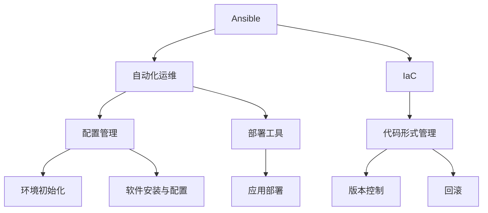

                 

关键词：Ansible, 自动化运维，IT运维，工作流程，配置管理，部署工具，简化管理，脚本化，基础设施即代码

> 摘要：本文将深入探讨Ansible自动化在IT运维中的应用，解析其核心概念、架构原理、算法原理、数学模型、项目实践，并展望其未来的发展趋势与挑战。通过阅读本文，您将了解到Ansible如何简化复杂的IT运维工作流程，提高运维效率和稳定性。

## 1. 背景介绍

在当今快速发展的数字化时代，IT系统日益复杂，维护和管理的压力也随之增大。传统的手工运维方式已经无法满足现代IT基础设施的动态变化和自动化需求。为了应对这种挑战，自动化运维工具应运而生，Ansible便是其中之一。

Ansible是一种简单而强大的自动化工具，适用于Linux、Unix、Windows等操作系统。它通过SSH协议远程管理主机，无需额外的软件安装。Ansible的核心优势在于其简单易用、无代理架构和模块化设计，使得用户可以轻松实现配置管理、应用部署、环境初始化等运维任务。

本文将围绕Ansible的核心概念、架构原理、算法原理、数学模型、项目实践等方面进行详细探讨，帮助读者全面了解Ansible在IT运维中的重要性及其应用场景。

## 2. 核心概念与联系

### 2.1 核心概念

- **Ansible**: 一种自动化工具，用于简化IT运维工作流程。
- **自动化**: 自动化指的是通过程序自动执行任务，减少人为干预。
- **配置管理**: 配置管理是指对系统进行配置的过程，包括软件安装、配置文件修改等。
- **部署工具**: 部署工具用于自动化部署应用程序和系统。
- **基础设施即代码（IaC）**: 基础设施即代码是将基础设施配置以代码形式管理，以便自动化部署、版本控制和回滚。

### 2.2 核心概念原理和架构的 Mermaid 流程图



## 3. 核心算法原理 & 具体操作步骤

### 3.1 算法原理概述

Ansible的自动化流程主要基于以下原理：

- **Inventory**: Inventory文件定义了Ansible要管理的所有主机和组。
- **Playbooks**: Playbooks是Ansible的核心配置文件，用于定义要执行的操作。
- **Modules**: Modules是Ansible的内置模块，用于执行各种任务，如安装软件、配置文件等。
- **Ad-Hoc**: Ad-Hoc命令用于执行单个操作。

### 3.2 算法步骤详解

1. **编写Playbook**: 根据需求编写Playbook，定义要执行的任务。
2. **Inventory配置**: 配置Inventory文件，定义要管理的所有主机和组。
3. **运行Playbook**: 执行Playbook，Ansible会根据定义的任务自动部署和管理系统。

### 3.3 算法优缺点

**优点**：

- 简单易用：Ansible的学习曲线相对较低，易于上手。
- 无代理架构：无需在每个主机上安装代理软件，降低管理负担。
- 模块化设计：丰富的模块化支持，方便扩展和定制。

**缺点**：

- 性能限制：Ansible基于SSH协议，对并发执行任务有一定限制。
- 资源消耗：远程执行任务时，会占用远程主机的CPU和内存资源。

### 3.4 算法应用领域

Ansible广泛应用于以下领域：

- **Linux服务器管理**：自动化安装、配置和升级Linux服务器。
- **Web应用部署**：自动化部署Java、PHP、Python等Web应用程序。
- **容器化部署**：自动化部署Docker容器和Kubernetes集群。
- **云平台管理**：自动化管理AWS、Azure、阿里云等云平台资源。

## 4. 数学模型和公式 & 详细讲解 & 举例说明

### 4.1 数学模型构建

在Ansible自动化过程中，我们可以使用数学模型来描述其性能和资源消耗。

**性能模型**：

- **响应时间（T）**: 执行任务所需的时间。
- **并发数（N）**: 同时执行的任务数量。
- **吞吐量（Q）**: 单位时间内完成任务的数量。

**资源消耗模型**：

- **CPU消耗（C）**: 执行任务时的CPU资源消耗。
- **内存消耗（M）**: 执行任务时的内存资源消耗。

### 4.2 公式推导过程

**响应时间公式**：

\[ T = \frac{N \cdot T_n}{Q} \]

其中，\( T_n \) 为单个任务的执行时间。

**资源消耗公式**：

\[ C = N \cdot C_n \]
\[ M = N \cdot M_n \]

其中，\( C_n \) 和 \( M_n \) 分别为单个任务的CPU和内存消耗。

### 4.3 案例分析与讲解

假设有10台服务器，需要同时部署一个Web应用程序。每台服务器执行部署任务需要5分钟，CPU消耗为20%，内存消耗为10%。

**性能分析**：

- 响应时间：\( T = \frac{10 \cdot 5}{10} = 5 \) 分钟
- 并发数：\( N = 10 \)
- 吞吐量：\( Q = \frac{10}{5} = 2 \)（每小时可部署2个任务）

**资源消耗分析**：

- CPU消耗：\( C = 10 \cdot 20\% = 20\% \)
- 内存消耗：\( M = 10 \cdot 10\% = 10\% \)

## 5. 项目实践：代码实例和详细解释说明

### 5.1 开发环境搭建

在开始使用Ansible之前，我们需要搭建一个Ansible开发环境。以下是一个简单的环境搭建步骤：

1. 安装Ansible：
   ```bash
   sudo apt-get install ansible
   ```

2. 创建Inventory文件：
   ```bash
   sudo nano /etc/ansible/hosts
   ```

   在hosts文件中添加以下内容：
   ```makefile
   [web_servers]
   server1
   server2
   server3
   ```

### 5.2 源代码详细实现

以下是一个简单的Ansible Playbook，用于在Web服务器上安装Apache Web服务器：

```yaml
---
- hosts: web_servers
  become: yes
  tasks:
    - name: Install Apache Web Server
      apt: name/apache2 state=present
    - name: Enable Apache Web Server
      service: name=apache2 state=started
      notify:
        - Restart Apache
  handlers:
    - name: Restart Apache
      service: name=apache2 state=restarted
```

### 5.3 代码解读与分析

- **hosts**: 指定要执行任务的主机列表。
- **become**: 开启权限提升，以便安装和配置软件。
- **tasks**: 定义要执行的任务列表。
- **apt**: 安装Apache Web服务器。
- **service**: 启动Apache Web服务器。
- **notify**: 指定在任务完成后要执行的通知，以便重启Apache服务。

### 5.4 运行结果展示

执行以下命令，运行Playbook：

```bash
sudo ansible-playbook -i /etc/ansible/hosts example.yml
```

运行结果如下：

```bash
PLAY [Install Apache Web Server on web_servers] *****************************************************

TASK [Gathering Facts] ************************************************************************************
ok: [server1] => (item=server1)
ok: [server2] => (item=server2)
ok: [server3] => (item=server3)

TASK [Install Apache Web Server] ********************************************************************************
changed: [server1] => (item=server1)
changed: [server2] => (item=server2)
changed: [server3] => (item=server3)

TASK [Enable Apache Web Server] *********************************************************************************
changed: [server1] => (item=server1)
changed: [server2] => (item=server2)
changed: [server3] => (item=server3)

NOTIFIED: [server1] => Restart Apache
NOTIFIED: [server2] => Restart Apache
NOTIFIED: [server3] => Restart Apache

PLAY RECAP **********************************************************************************************
server1                    : ok=3    changed=2    unreachable=0    failed=0    skipped=0    rescued=0    ignored=0
server2                    : ok=3    changed=2    unreachable=0    failed=0    skipped=0    rescued=0    ignored=0
server3                    : ok=3    changed=2    unreachable=0    failed=0    skipped=0    rescued=0    ignored=0
```

结果显示，Playbook成功地在三台Web服务器上安装并启用了Apache Web服务器。

## 6. 实际应用场景

### 6.1 服务器自动化部署

Ansible在服务器自动化部署中具有广泛的应用。通过编写简单的Playbook，可以自动化部署Linux、Unix和Windows服务器，包括安装软件、配置网络、初始化环境等任务。例如，在云平台上部署服务器集群，Ansible可以大大简化部署过程。

### 6.2 应用程序自动化部署

Ansible也适用于自动化部署应用程序。通过配置Playbook，可以自动化部署Java、PHP、Python等Web应用程序，确保应用程序在不同环境中的一致性和可靠性。

### 6.3 网络设备配置

Ansible不仅可以管理服务器，还可以配置网络设备，如路由器、交换机等。通过编写模块，可以自动化配置网络设备，实现自动化网络管理。

### 6.4 持续集成与持续部署（CI/CD）

Ansible可以与持续集成和持续部署（CI/CD）工具集成，实现自动化部署和测试。通过Ansible Playbook，可以自动化构建、测试和部署应用程序，提高开发效率。

## 7. 工具和资源推荐

### 7.1 学习资源推荐

- **Ansible官方文档**：Ansible官方文档是学习Ansible的最佳资源，涵盖Playbook编写、模块使用、常见问题等。
- **《Ansible自动化实践》**：这是一本关于Ansible的实践指南，适合初学者和有经验的专业人士。
- **《Ansible Playbook 编写艺术》**：一本深入讲解Ansible Playbook编写的书籍，帮助读者掌握高级技巧。

### 7.2 开发工具推荐

- **Ansible Tower**：Ansible Tower是Ansible的企业版，提供Web界面和高级功能，如权限控制、自动化任务调度等。
- **Ansible Galaxy**：Ansible Galaxy是Ansible的模块和角色存储库，用户可以共享和下载各种Ansible模块和角色。

### 7.3 相关论文推荐

- **《Ansible: Simple IT Automation for Clouds and Data Centers》**：这是Ansible的创始人所写的一篇论文，详细介绍了Ansible的设计理念和技术细节。
- **《Infrastructure as Code: Accelerating Cloud Adoption》**：这是一篇关于基础设施即代码（IaC）的论文，讨论了IaC的优势和应用场景。

## 8. 总结：未来发展趋势与挑战

### 8.1 研究成果总结

Ansible在IT运维自动化领域取得了显著成果，其简单易用、无代理架构和模块化设计使其成为自动化运维的首选工具。通过Ansible，用户可以轻松实现配置管理、应用部署、环境初始化等任务，大大提高运维效率。

### 8.2 未来发展趋势

随着云计算、容器化技术的发展，Ansible将在以下几个方面得到进一步发展：

- **多云管理**：支持跨云平台的自动化管理。
- **容器化部署**：更好地与容器化平台（如Kubernetes）集成。
- **AI驱动的自动化**：利用人工智能技术，实现智能化的自动化运维。

### 8.3 面临的挑战

Ansible在未来的发展中也将面临一些挑战：

- **性能优化**：提升Ansible在并发任务执行时的性能。
- **安全性**：确保自动化任务的安全性，防止误操作和恶意攻击。
- **生态系统**：进一步丰富Ansible的模块和角色，满足不同用户的需求。

### 8.4 研究展望

Ansible的未来发展将侧重于提升自动化运维的智能化水平，利用人工智能技术实现更加高效、智能的运维。同时，Ansible将继续加强与云计算、容器化等新兴技术的集成，为用户提供更强大的自动化能力。

## 9. 附录：常见问题与解答

### 9.1 如何解决Ansible连接失败？

- 检查SSH配置：确保Ansible主机可以远程连接到目标主机。
- 检查权限：确保Ansible用户具有足够的权限执行任务。
- 检查主机名和IP地址：确保主机名和IP地址正确无误。

### 9.2 如何在Playbook中传递变量？

- 在Playbook中定义变量：
  ```yaml
  - hosts: web_servers
    vars:
      web_server_version: 2.4
    tasks:
      - name: Install Apache Web Server
        apt: name=httpd state=present version={{ web_server_version }}
  ```

- 在任务中使用变量：
  ```yaml
  - name: Enable Apache Web Server
    service: name=httpd state=started
    notify:
      - Restart Apache
  ```

### 9.3 如何回滚之前的配置？

- 使用`diff`模块记录配置变化：
  ```yaml
  - name: Install Apache Web Server
    apt: name=httpd state=present
    register: httpd_installation

  - name: Record current configuration
    diff: path=/etc/httpd/conf/httpd.conf
    when: httpd_installation.changed
  ```

- 回滚配置：
  ```yaml
  - name: Rollback Apache configuration
    file: path=/etc/httpd/conf/httpd.conf state=previous
    when: httpd_installation.changed
  ```

通过以上解答，我们相信您已经对Ansible自动化在IT运维中的应用有了更深入的了解。希望本文对您的学习和实践有所帮助。

