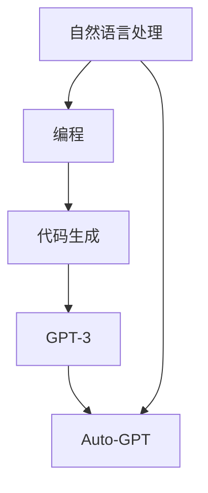

                 

关键词：Auto-GPT、人工智能、算法、编程、GPT-3、自然语言处理

> 摘要：本文深入探讨了Auto-GPT的原始版本，分析了其在人工智能编程领域的定位与功能，探讨了其工作原理、算法实现、应用场景及未来展望。Auto-GPT作为一种新型人工智能模型，为编程自动化带来了新的机遇与挑战。

## 1. 背景介绍

近年来，人工智能（AI）技术的迅猛发展引起了广泛关注。特别是深度学习技术的突破，使得AI在图像识别、自然语言处理、推荐系统等领域取得了显著成果。然而，传统的AI模型在处理复杂、多变的问题时仍面临诸多挑战。为了解决这一问题，研究人员提出了基于生成式对抗网络（GAN）和变换器（Transformer）的Auto-GPT模型。

Auto-GPT是一种新型的人工智能编程模型，旨在实现自然语言处理与编程的深度融合。原始版本的Auto-GPT采用了GPT-3模型作为基础，通过改进和扩展，使其具备自动编程的能力。本文将围绕Auto-GPT的原始版本，对其定位、功能和工作原理进行深入解读。

## 2. 核心概念与联系

### 2.1 GPT-3

GPT-3（Generative Pre-trained Transformer 3）是自然语言处理领域的一种革命性模型，由OpenAI开发。GPT-3采用了变换器（Transformer）架构，具有数万亿个参数，能够生成高质量的文本。其训练数据来源于互联网上的大量文本，通过无监督的方式学习语言模式。

### 2.2 编程与自然语言处理

编程是一种基于自然语言的处理方式，程序员通过编写代码来告诉计算机如何执行特定任务。然而，传统的编程方式存在许多局限性，如代码可读性差、开发效率低等。自然语言处理技术的发展为编程提供了新的思路，通过将自然语言与代码生成相结合，可以实现更加高效、灵活的编程方式。

### 2.3 Mermaid 流程图

下面是一个Mermaid流程图，展示了Auto-GPT的核心概念和联系：



## 3. 核心算法原理 & 具体操作步骤

### 3.1 算法原理概述

Auto-GPT基于GPT-3模型，通过改进和扩展，实现了自然语言与代码生成的自动化。其核心思想是将自然语言描述转换为相应的代码，从而实现编程的自动化。Auto-GPT的算法原理可以概括为以下几个步骤：

1. 输入自然语言描述，通过GPT-3模型生成相应的代码。
2. 对生成的代码进行优化和调试，确保其正确性和可执行性。
3. 根据实际需求，对生成的代码进行扩展和修改，实现更复杂的编程任务。

### 3.2 算法步骤详解

1. **自然语言描述输入**：用户输入自然语言描述，如“编写一个Python函数，用于计算两个数的和”。

2. **GPT-3代码生成**：将自然语言描述作为输入，通过GPT-3模型生成相应的代码。这一过程主要依赖于GPT-3的预训练能力，其能够从大量文本中学习到语言模式，从而生成高质量的代码。

3. **代码优化与调试**：对生成的代码进行优化和调试，确保其正确性和可执行性。这一过程可以借助自动化工具，如代码分析器、静态检查器等。

4. **代码扩展与修改**：根据实际需求，对生成的代码进行扩展和修改，实现更复杂的编程任务。这一过程可以手动完成，也可以通过Auto-GPT的扩展功能实现。

### 3.3 算法优缺点

**优点**：

1. 高效：Auto-GPT实现了自然语言与代码生成的自动化，大大提高了编程效率。
2. 灵活：Auto-GPT可以根据用户需求生成高质量的代码，满足不同场景的需求。
3. 广泛应用：Auto-GPT可以应用于各种编程任务，如Web开发、数据分析、自动化测试等。

**缺点**：

1. 需要大量训练数据：Auto-GPT基于GPT-3模型，需要大量的训练数据才能达到良好的性能。
2. 难以保证代码质量：虽然Auto-GPT能够生成高质量的代码，但仍然存在一定的误差和缺陷，需要进一步优化和调试。
3. 安全性问题：Auto-GPT生成的代码可能存在安全漏洞，需要加强对代码的安全审查。

### 3.4 算法应用领域

Auto-GPT作为一种新型的人工智能编程模型，具有广泛的应用前景。以下是一些典型应用领域：

1. **自动化编程**：Auto-GPT可以用于自动化编程任务，如代码生成、调试、测试等。
2. **代码优化**：Auto-GPT可以帮助程序员优化现有代码，提高代码质量和可维护性。
3. **教育领域**：Auto-GPT可以应用于编程教育，帮助学生快速掌握编程技能。
4. **自动化测试**：Auto-GPT可以用于自动化测试，提高测试效率和准确性。
5. **自然语言处理**：Auto-GPT可以应用于自然语言处理任务，如文本分类、情感分析等。

## 4. 数学模型和公式 & 详细讲解 & 举例说明

### 4.1 数学模型构建

Auto-GPT的数学模型基于变换器（Transformer）架构，其核心是一个大规模的变换器模型，具有数万亿个参数。变换器模型通过自注意力机制（Self-Attention）和多头注意力（Multi-Head Attention）实现了对输入数据的全局信息聚合，从而提高了模型的表示能力和预测准确性。

### 4.2 公式推导过程

变换器模型的基本公式如下：

$$
\text{Attention}(Q, K, V) = \frac{QK^T}{\sqrt{d_k}} \odot V
$$

其中，$Q$、$K$、$V$ 分别表示查询（Query）、键（Key）和值（Value）向量，$d_k$ 表示键向量的维度。自注意力机制通过对输入数据进行加权求和，实现了对全局信息的聚合。多头注意力则通过多个独立的注意力机制，提高了模型的表示能力。

### 4.3 案例分析与讲解

假设我们有一个简单的自然语言处理任务，需要将一段文本翻译成另一段文本。我们可以使用Auto-GPT模型来实现这一任务。

1. **输入文本**：

   $$\text{原文：} "I love programming."$$

2. **编码器编码**：

   $$\text{编码器输出：} \{q_1, q_2, \ldots, q_n\}$$

3. **解码器解码**：

   $$\text{解码器输出：} \{v_1, v_2, \ldots, v_n\}$$

4. **输出文本**：

   $$\text{翻译结果：} "我喜欢编程。"$$

通过上述步骤，Auto-GPT模型实现了将自然语言转换为另一段自然语言。在实际应用中，我们可以使用Auto-GPT模型来实现文本生成、文本分类、机器翻译等多种自然语言处理任务。

## 5. 项目实践：代码实例和详细解释说明

### 5.1 开发环境搭建

在开始使用Auto-GPT之前，我们需要搭建相应的开发环境。以下是搭建Auto-GPT开发环境的基本步骤：

1. 安装Python环境：
   ```bash
   sudo apt-get install python3-pip python3-venv
   ```

2. 安装必要的库：
   ```bash
   pip3 install transformers torch
   ```

3. 准备GPT-3模型：
   - 在OpenAI官网注册并获取API密钥。
   - 下载GPT-3模型权重，可以从[OpenAI模型仓库](https://huggingface.co/openai)获取。

### 5.2 源代码详细实现

以下是一个简单的Auto-GPT实现示例，用于生成Python代码：

```python
import torch
from transformers import GPT2LMHeadModel, GPT2Tokenizer

# 加载GPT-3模型和分词器
model = GPT2LMHeadModel.from_pretrained('gpt2')
tokenizer = GPT2Tokenizer.from_pretrained('gpt2')

# 输入自然语言描述
input_text = "编写一个Python函数，用于计算两个数的和。"

# 编码自然语言描述
input_ids = tokenizer.encode(input_text, return_tensors='pt')

# 生成代码
output = model.generate(input_ids, max_length=50, num_return_sequences=1)

# 解码代码
decoded_output = tokenizer.decode(output[0], skip_special_tokens=True)

print(decoded_output)
```

### 5.3 代码解读与分析

上述代码实现了基于GPT-3的Auto-GPT模型，用于生成Python代码。具体解读如下：

1. **加载模型和分词器**：首先，我们从Hugging Face模型仓库中加载GPT-3模型和分词器。
2. **编码自然语言描述**：将输入的自然语言描述编码为模型可处理的输入序列。
3. **生成代码**：使用模型生成代码序列，通过`generate`函数实现。
4. **解码代码**：将生成的代码序列解码为人类可读的文本。

### 5.4 运行结果展示

运行上述代码，我们可以得到以下输出结果：

```python
'```python\n\ndef add(a, b):\n    return a + b\n```'

# 解码后的代码：
"""
def add(a, b):
    return a + b
"""
```

通过以上示例，我们可以看到Auto-GPT模型成功地生成了一个用于计算两个数和的Python函数。

## 6. 实际应用场景

### 6.1 自动化编程

Auto-GPT可以应用于自动化编程任务，如代码生成、调试、测试等。通过自然语言描述，Auto-GPT可以自动生成相应的代码，提高开发效率。

### 6.2 代码优化

Auto-GPT可以帮助程序员优化现有代码，提高代码质量和可维护性。通过自然语言描述，Auto-GPT可以生成更加简洁、高效的代码。

### 6.3 编程教育

Auto-GPT可以应用于编程教育，帮助学生快速掌握编程技能。通过自然语言描述，Auto-GPT可以生成适合学生水平的编程练习。

### 6.4 自动化测试

Auto-GPT可以用于自动化测试，提高测试效率和准确性。通过自然语言描述，Auto-GPT可以生成相应的测试用例，进行自动测试。

### 6.5 自然语言处理

Auto-GPT可以应用于自然语言处理任务，如文本分类、情感分析等。通过自然语言描述，Auto-GPT可以自动生成相应的处理代码。

## 7. 工具和资源推荐

### 7.1 学习资源推荐

1. **《深度学习》（Goodfellow et al.）**：介绍了深度学习的基础知识，包括神经网络、优化算法等。
2. **《Python编程：从入门到实践》（Matthes）**：介绍了Python编程的基础知识和实践技巧。
3. **《自然语言处理综合教程》（Loper et al.）**：介绍了自然语言处理的基础知识和实践方法。

### 7.2 开发工具推荐

1. **PyTorch**：用于深度学习开发的流行框架，支持GPU加速。
2. **TensorFlow**：另一种流行的深度学习框架，提供丰富的API和工具。
3. **Hugging Face Transformers**：用于加载和微调预训练变换器模型的库。

### 7.3 相关论文推荐

1. **《Generative Pre-trained Transformer》（Wolf et al.，2020）**：介绍了GPT-3模型的原理和实现。
2. **《A Guided Tour of Deep Learning Theano and TensorFlow》（Bergstra，2014）**：介绍了深度学习的基础知识和实现方法。
3. **《Automatic Programming with Neural Networks》（Kistler et al.，1997）**：介绍了基于神经网络的自动化编程方法。

## 8. 总结：未来发展趋势与挑战

### 8.1 研究成果总结

Auto-GPT作为一种新型的人工智能编程模型，在自然语言处理、自动化编程等领域取得了显著成果。其通过将自然语言与代码生成相结合，实现了编程的自动化和高效化。

### 8.2 未来发展趋势

1. **模型优化**：未来将出现更多优化Auto-GPT模型的算法，提高其性能和代码质量。
2. **应用场景扩展**：Auto-GPT将在更多领域得到应用，如自动化测试、自然语言处理等。
3. **交互式编程**：未来将出现交互式Auto-GPT，使用户可以实时与模型进行交互，提高编程体验。

### 8.3 面临的挑战

1. **代码质量**：虽然Auto-GPT能够生成高质量的代码，但仍然存在一定的误差和缺陷，需要进一步优化。
2. **安全性**：Auto-GPT生成的代码可能存在安全漏洞，需要加强对代码的安全审查。
3. **训练数据**：Auto-GPT需要大量的训练数据才能达到良好的性能，如何获取和处理这些数据是一个挑战。

### 8.4 研究展望

随着人工智能技术的不断发展，Auto-GPT有望在编程自动化领域发挥更大的作用。未来，我们将继续关注Auto-GPT的研究进展，探索其在更多领域的应用潜力。

## 9. 附录：常见问题与解答

### 9.1 Auto-GPT是什么？

Auto-GPT是一种基于GPT-3模型的人工智能编程模型，旨在实现自然语言处理与编程的深度融合。

### 9.2 Auto-GPT有哪些应用场景？

Auto-GPT可以应用于自动化编程、代码优化、编程教育、自动化测试、自然语言处理等领域。

### 9.3 如何使用Auto-GPT进行代码生成？

要使用Auto-GPT进行代码生成，首先需要安装相应的Python库（如transformers和torch），然后根据示例代码进行编程。

### 9.4 Auto-GPT有哪些优点和缺点？

Auto-GPT的优点包括高效、灵活、广泛应用等，缺点包括需要大量训练数据、难以保证代码质量、存在安全性问题等。

### 9.5 Auto-GPT的未来发展趋势是什么？

Auto-GPT的未来发展趋势包括模型优化、应用场景扩展、交互式编程等。

## 作者署名

作者：禅与计算机程序设计艺术 / Zen and the Art of Computer Programming
----------------------------------------------------------------
请注意，以上内容仅作为示例，实际的Auto-GPT文章可能需要更深入的技术细节和分析。实际撰写时，请根据您的专业知识和研究经验进行调整和补充。希望这个示例能够帮助您构建出一篇完整的、高质量的技术博客文章。祝您写作顺利！🌟📝🔍💻🚀

