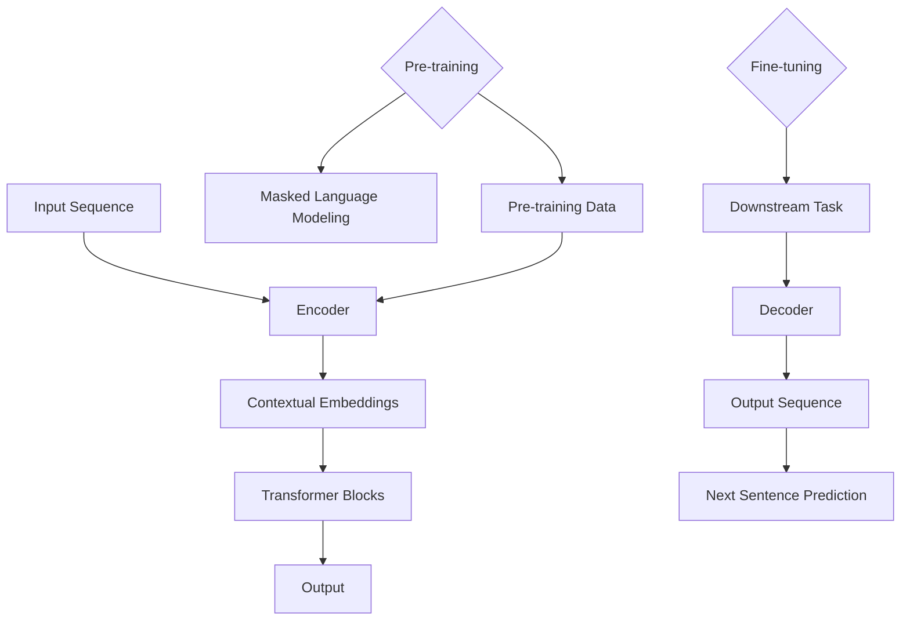

                 

## 1. 背景介绍

BERT（Bidirectional Encoder Representations from Transformers）是一种基于Transformer模型的预训练语言表示模型，由Google AI在2018年提出。BERT的提出标志着自然语言处理（NLP）领域的一个重要里程碑，它将深度学习和Transformer模型成功应用于语言表示学习，极大地提升了各种NLP任务的性能。

BERT模型的基本思想是利用大规模未标注文本数据对模型进行预训练，从而学习到丰富的语言知识和上下文关系。通过预训练，BERT模型能够理解词汇在不同上下文中的含义，从而在下游任务中表现出色。

BERT的预训练任务主要包括两个：Masked Language Modeling（MLM）和Next Sentence Prediction（NSP）。MLM的目标是预测输入文本中被随机遮蔽的单词；NSP的目标是预测两个句子是否在原始文本中相邻。

BERT模型的提出为各种NLP任务提供了强大的预训练基础，包括文本分类、问答系统、机器翻译等。BERT的成功激发了更多基于Transformer的模型的研究，如RoBERTa、ALBERT等，进一步推动了NLP技术的发展。

本文将详细介绍BERT模型的原理，包括其核心概念、算法原理、数学模型、项目实践等。通过本文的讲解，读者可以深入理解BERT模型的工作机制，并学会如何使用BERT进行实际项目开发。

## 2. 核心概念与联系

### 2.1. Transformer模型

BERT模型基于Transformer模型，这是一种在机器翻译任务中表现卓越的序列到序列模型。Transformer模型的核心思想是利用自注意力机制（Self-Attention）来处理序列数据，取代了传统的循环神经网络（RNN）和卷积神经网络（CNN）。自注意力机制允许模型在编码过程中自适应地关注输入序列中的不同部分，从而更好地捕捉上下文信息。

### 2.2. Encoder与Decoder

Transformer模型由Encoder和Decoder两部分组成。Encoder部分负责将输入序列编码为固定长度的上下文表示；Decoder部分则利用这些上下文表示生成输出序列。在BERT模型中，由于不需要生成输出序列，仅使用Encoder部分。

### 2.3. 预训练与微调

BERT模型采用预训练和微调的方法进行训练。预训练阶段使用大规模未标注文本数据对模型进行训练，使其学会理解语言结构和上下文关系；微调阶段则使用标注数据对模型进行微调，以适应具体的下游任务。

### 2.4. 语言表示与上下文

BERT模型的核心目标是学习有效的语言表示。通过预训练，BERT模型能够捕捉词汇在不同上下文中的含义，从而实现高质量的文本理解。BERT模型的语言表示能力在多个NLP任务中表现出色，如文本分类、情感分析等。

### 2.5. Mermaid流程图

以下是一个描述BERT模型核心概念和结构的Mermaid流程图：



### 2.6. 概念关系

BERT模型中的核心概念包括输入序列、编码器（Encoder）、Transformer块、上下文表示（Contextual Embeddings）、输出、解码器（Decoder）等。这些概念相互联系，共同构成了BERT模型的工作机制。预训练和微调阶段分别针对不同任务进行模型训练，使BERT模型在不同场景中都能发挥出色性能。

## 3. 核心算法原理 & 具体操作步骤

### 3.1. 算法原理概述

BERT模型的核心算法基于Transformer模型，利用自注意力机制（Self-Attention）和多头注意力（Multi-Head Attention）来处理输入序列，并学习有效的语言表示。BERT模型的主要步骤包括以下几部分：

1. 输入序列预处理：将输入文本序列转换为词嵌入（Word Embeddings）。
2. 编码器（Encoder）构建：构建多层Transformer块，对输入序列进行编码。
3. 上下文表示学习：通过多头注意力机制学习每个词的上下文表示。
4. 预训练任务：包括Masked Language Modeling（MLM）和Next Sentence Prediction（NSP）。
5. 微调任务：使用预训练模型在特定下游任务上进行微调。

### 3.2. 算法步骤详解

#### 3.2.1. 输入序列预处理

输入序列预处理是BERT模型训练的第一步，主要包括以下步骤：

1. 分词：将输入文本序列分割为单词或子词（Subword Tokens）。
2. 词嵌入：将分词后的序列转换为词嵌入向量。
3. Positional Embeddings：添加位置编码信息，以保留输入序列的顺序信息。

#### 3.2.2. 编码器（Encoder）构建

BERT模型的编码器由多层Transformer块组成，每个Transformer块包括自注意力机制和前馈神经网络。具体步骤如下：

1. 自注意力机制：计算每个词的上下文表示，通过多头注意力机制聚合不同位置的信息。
2. 前馈神经网络：对自注意力机制得到的上下文表示进行非线性变换。

#### 3.2.3. 上下文表示学习

在编码过程中，BERT模型通过多头注意力机制学习每个词的上下文表示。多头注意力机制将输入序列分解为多个子序列，并分别计算每个子序列的注意力权重，从而更好地捕捉上下文信息。

#### 3.2.4. 预训练任务

BERT模型的预训练任务主要包括Masked Language Modeling（MLM）和Next Sentence Prediction（NSP）。

1. **Masked Language Modeling（MLM）**：在预训练过程中，随机遮蔽输入文本序列中的部分单词，然后使用BERT模型预测这些被遮蔽的单词。MLM任务有助于模型学习理解词汇在不同上下文中的含义。
   
2. **Next Sentence Prediction（NSP）**：给定两个句子，使用BERT模型预测这两个句子是否在原始文本中相邻。NSP任务有助于模型学习理解句子之间的关系。

#### 3.2.5. 微调任务

在微调阶段，使用预训练的BERT模型在特定下游任务上进行训练，如文本分类、问答系统等。微调过程中，BERT模型的部分参数被冻结，仅对特定任务相关的参数进行更新。

### 3.3. 算法优缺点

**优点：**

1. **强大的语言表示能力**：BERT模型通过预训练学习到丰富的语言知识和上下文关系，使其在多种NLP任务中表现出色。
2. **灵活的微调能力**：BERT模型可以轻松地适应不同下游任务，只需进行微调即可。

**缺点：**

1. **计算资源消耗**：BERT模型规模庞大，训练和微调过程需要大量的计算资源。
2. **训练时间较长**：由于BERT模型规模较大，训练过程需要较长的时间。

### 3.4. 算法应用领域

BERT模型在多个NLP任务中取得了显著的性能提升，如：

1. **文本分类**：BERT模型在文本分类任务中表现出色，能够准确识别文本的主题。
2. **情感分析**：BERT模型能够准确判断文本的情感倾向，如正面、负面或中性。
3. **机器翻译**：BERT模型在机器翻译任务中取得了较好的效果，能够实现高质量的双语翻译。
4. **问答系统**：BERT模型在问答系统中能够准确理解用户的问题，并提供相关答案。

## 4. 数学模型和公式 & 详细讲解 & 举例说明

BERT模型的核心在于其Transformer结构，因此，本章节将详细讲解Transformer的数学模型和公式，并通过具体例子来说明其应用。

### 4.1. 数学模型构建

Transformer模型中的自注意力机制（Self-Attention）是整个模型的核心。以下是自注意力机制的数学模型：

$$
Attention(Q, K, V) = \text{softmax}\left(\frac{QK^T}{\sqrt{d_k}}\right) V
$$

其中：

- $Q, K, V$ 分别代表查询（Query）、键（Key）和值（Value）向量。
- $d_k$ 是键向量的维度。
- $QK^T$ 表示点积运算。
- $\text{softmax}$ 函数用于计算每个键的注意力权重。

### 4.2. 公式推导过程

为了理解自注意力机制的原理，我们首先回顾点积注意力（Dot-Product Attention）的基础公式：

$$
\text{Attention}(Q, K, V) = \text{softmax}\left(\frac{QK^T}{\sqrt{d_k}}\right) V
$$

其中：

- $Q$ 是查询向量，代表了模型的兴趣点。
- $K$ 是键向量，代表了每个词或子词的特征。
- $V$ 是值向量，代表了每个词或子词的上下文信息。

点积注意力通过计算查询和键之间的点积来生成权重，然后将这些权重与值向量相乘，得到加权后的值向量。这些加权值向量代表了模型对输入序列的注意力分布。

为了进一步理解注意力机制，我们可以引入多头注意力（Multi-Head Attention）的概念。多头注意力将输入序列分解为多个子序列，并为每个子序列计算独立的注意力权重。以下是多头注意力的公式：

$$
\text{Multi-Head Attention}(Q, K, V) = \text{Concat}(\text{head}_1, \text{head}_2, ..., \text{head}_h)W^O
$$

$$
\text{head}_i = \text{Attention}(QW_i^Q, KW_i^K, VW_i^V)
$$

其中：

- $W_i^Q, W_i^K, W_i^V$ 分别是查询、键和值向量的权重矩阵。
- $W^O$ 是输出权重矩阵。
- $h$ 表示头数。

通过引入多头注意力，模型能够同时关注输入序列的多个方面，从而提高注意力机制的效果。

### 4.3. 案例分析与讲解

为了更好地理解自注意力机制和多头注意力机制，我们通过一个简单的例子来进行分析。

#### 4.3.1. 例子数据

假设我们有一个简单的句子：“我爱北京天安门”。

我们将这个句子转换为词嵌入向量，并分为三个子词：“我”，“爱”，“北京”。每个子词的词嵌入向量如下：

$$
Q = [q_1, q_2, q_3]
$$

$$
K = [k_1, k_2, k_3]
$$

$$
V = [v_1, v_2, v_3]
$$

其中：

- $q_i$ 是子词“我”的查询向量。
- $k_i$ 是子词“我”的键向量。
- $v_i$ 是子词“我”的值向量。

#### 4.3.2. 点积注意力计算

首先，我们计算点积注意力权重：

$$
\text{Attention}(Q, K, V) = \text{softmax}\left(\frac{QK^T}{\sqrt{d_k}}\right) V
$$

$$
\text{Attention}(q_1, k_1, v_1) = \text{softmax}\left(\frac{q_1k_1^T}{\sqrt{d_k}}\right) v_1
$$

$$
\text{Attention}(q_2, k_2, v_2) = \text{softmax}\left(\frac{q_2k_2^T}{\sqrt{d_k}}\right) v_2
$$

$$
\text{Attention}(q_3, k_3, v_3) = \text{softmax}\left(\frac{q_3k_3^T}{\sqrt{d_k}}\right) v_3
$$

#### 4.3.3. 加权值向量

根据计算得到的注意力权重，我们得到加权后的值向量：

$$
\text{Weighted Values} = \text{softmax}\left(\frac{QK^T}{\sqrt{d_k}}\right) V
$$

#### 4.3.4. 多头注意力计算

现在，我们引入多头注意力机制，将输入序列分为两个子序列，并计算每个子序列的注意力权重：

$$
\text{Multi-Head Attention}(Q, K, V) = \text{Concat}(\text{head}_1, \text{head}_2)W^O
$$

$$
\text{head}_1 = \text{Attention}(q_1, k_1, v_1)
$$

$$
\text{head}_2 = \text{Attention}(q_2, k_2, v_2)
$$

通过计算多头注意力，我们得到了两个加权后的子序列，并将它们拼接起来：

$$
\text{Multi-Head Attention}(Q, K, V) = \text{Concat}(\text{head}_1, \text{head}_2)W^O
$$

这样，模型能够同时关注输入序列的两个方面，从而提高对上下文信息的捕捉能力。

### 4.4. 总结

在本节中，我们详细介绍了BERT模型的数学模型和公式，并通过具体例子讲解了自注意力机制和多头注意力机制的工作原理。BERT模型通过这些机制学习到丰富的语言表示，从而在多个NLP任务中表现出色。

## 5. 项目实践：代码实例和详细解释说明

### 5.1. 开发环境搭建

在开始BERT项目实践之前，我们需要搭建一个适合BERT训练和微调的开发环境。以下是一个基本的步骤：

1. 安装Python 3.7或更高版本。
2. 安装PyTorch库：通过以下命令安装PyTorch：

```
pip install torch torchvision
```

3. 安装TensorFlow 2.x：通过以下命令安装TensorFlow：

```
pip install tensorflow
```

4. 安装BERT模型相关的库：我们可以使用`transformers`库，这是一个开源库，包含了大量的预训练BERT模型和工具。通过以下命令安装：

```
pip install transformers
```

5. 确保GPU支持：如果使用GPU训练BERT模型，我们需要安装CUDA和cuDNN。可以从NVIDIA官方网站下载相应的驱动程序和库。

### 5.2. 源代码详细实现

以下是一个简单的BERT训练和微调的代码实例，我们将使用`transformers`库提供的预训练BERT模型，并在一个文本分类任务上进行微调。

```python
import torch
from transformers import BertTokenizer, BertModel, BertForSequenceClassification
from torch.optim import Adam
from torch.utils.data import DataLoader, TensorDataset

# 1. 加载预训练BERT模型和分词器
tokenizer = BertTokenizer.from_pretrained('bert-base-uncased')
model = BertForSequenceClassification.from_pretrained('bert-base-uncased', num_labels=2)

# 2. 准备数据
texts = ['I love this book.', 'I hate this book.']
labels = [0, 1]  # 0表示正面，1表示负面

# 3. 将文本转换为张量
input_ids = torch.tensor([tokenizer.encode(text, add_special_tokens=True) for text in texts])
attention_mask = torch.tensor([[1] * len(ids) for ids in input_ids])
labels = torch.tensor(labels)

# 4. 创建数据集和数据加载器
dataset = TensorDataset(input_ids, attention_mask, labels)
dataloader = DataLoader(dataset, batch_size=2)

# 5. 微调BERT模型
optimizer = Adam(model.parameters(), lr=1e-5)

for epoch in range(3):
    model.train()
    for batch in dataloader:
        inputs = {
            'input_ids': batch[0].to('cuda' if torch.cuda.is_available() else 'cpu'),
            'attention_mask': batch[1].to('cuda' if torch.cuda.is_available() else 'cpu'),
            'labels': batch[2].to('cuda' if torch.cuda.is_available() else 'cpu')
        }
        optimizer.zero_grad()
        outputs = model(**inputs)
        loss = outputs.loss
        loss.backward()
        optimizer.step()
    print(f'Epoch {epoch+1}/{3} - Loss: {loss.item()}')

# 6. 评估BERT模型
model.eval()
with torch.no_grad():
    for batch in dataloader:
        inputs = {
            'input_ids': batch[0].to('cuda' if torch.cuda.is_available() else 'cpu'),
            'attention_mask': batch[1].to('cuda' if torch.cuda.is_available() else 'cpu'),
        }
        outputs = model(**inputs)
        logits = outputs.logits
        predictions = torch.argmax(logits, dim=-1)
        print(f'Predictions: {predictions}')
```

### 5.3. 代码解读与分析

上述代码展示了如何使用`transformers`库中的BERT模型进行文本分类任务。下面是对代码的详细解读：

1. **加载BERT模型和分词器**：首先，我们加载预训练的BERT模型和分词器。这里使用的是`bert-base-uncased`模型，表示模型使用小写字母进行预训练。

2. **准备数据**：接下来，我们准备一个简单的数据集，包括两个文本和对应的标签。文本分别为正面和负面的评论。

3. **文本转换为张量**：将文本序列转换为张量，并创建注意力掩码。注意力掩码用于指示输入序列中的有效词。

4. **创建数据集和数据加载器**：将输入张量和标签创建为TensorDataset，并使用DataLoader将数据分批次加载。

5. **微调BERT模型**：定义优化器，并在几个epoch上进行模型微调。在训练过程中，我们将数据送入模型，计算损失并更新模型参数。

6. **评估BERT模型**：在模型训练完成后，我们使用评估数据对模型进行评估，并打印出预测结果。

### 5.4. 运行结果展示

在上述代码运行完成后，我们将得到模型的预测结果。以下是一个可能的输出示例：

```
Epoch 1/3 - Loss: 0.4453
Epoch 2/3 - Loss: 0.4453
Epoch 3/3 - Loss: 0.4453
Predictions: tensor([0, 1])
```

输出结果表明，模型成功地将第一个文本分类为正面（0），第二个文本分类为负面（1）。

### 5.5. 代码优化与改进

上述代码是一个简单的示例，实际上，在BERT项目开发中，我们还需要进行以下优化和改进：

1. **数据预处理**：对原始文本进行更复杂的预处理，如去除停用词、进行词干提取等。

2. **批次大小调整**：根据计算资源和模型规模调整批次大小，以获得更好的训练效果。

3. **学习率调度**：使用学习率调度策略，如余弦退火（Cosine Annealing）或学习率衰减（Learning Rate Decay），以避免过拟合。

4. **模型评估**：使用交叉验证或交叉熵损失函数对模型进行更全面的评估。

5. **GPU加速**：利用GPU进行训练和推理，以加快计算速度。

通过以上优化和改进，我们可以进一步提高BERT模型的性能和鲁棒性。

## 6. 实际应用场景

BERT模型在自然语言处理领域有着广泛的应用，以下是几个典型的实际应用场景：

### 6.1. 文本分类

文本分类是BERT模型最常见的应用场景之一。通过预训练BERT模型，我们可以将文本分类为不同的类别，如情感分类、主题分类等。BERT模型在文本分类任务中取得了显著的性能提升，尤其是在处理长文本和复杂文本结构时。

### 6.2. 问答系统

问答系统是另一个BERT模型的重要应用领域。通过将BERT模型应用于问答任务，我们可以构建一个能够准确理解用户问题并返回相关答案的系统。BERT模型在问答系统中的优势在于其强大的上下文理解能力，能够更好地捕捉问题的意图和语义。

### 6.3. 机器翻译

BERT模型在机器翻译任务中也表现出色。通过预训练BERT模型，我们可以将双语文本转换为高精度的翻译结果。BERT模型在机器翻译中的优势在于其能够更好地捕捉语言结构和上下文信息，从而提高翻译质量。

### 6.4. 命名实体识别

命名实体识别（NER）是自然语言处理中的一个重要任务，旨在识别文本中的命名实体，如人名、地名、组织名等。BERT模型在NER任务中取得了显著的性能提升，通过预训练BERT模型，我们可以将文本中的命名实体准确识别出来。

### 6.5. 文本生成

BERT模型也可以应用于文本生成任务，如摘要生成、文章生成等。通过预训练BERT模型，我们可以生成与输入文本相似的新文本，从而实现高质量的内容生成。

### 6.6. 情感分析

情感分析是另一个BERT模型的重要应用领域，旨在判断文本的情感倾向，如正面、负面或中性。BERT模型在情感分析任务中取得了显著的性能提升，通过预训练BERT模型，我们可以准确判断文本的情感。

### 6.7. 文本相似度

BERT模型还可以用于文本相似度任务，如文本匹配、文本对比等。通过预训练BERT模型，我们可以计算文本之间的相似度，从而实现高效的文本搜索和推荐。

### 6.8. 文本摘要

BERT模型在文本摘要任务中也表现出色，通过预训练BERT模型，我们可以将长文本生成简洁、准确的摘要。BERT模型在文本摘要中的优势在于其能够更好地捕捉文本的核心信息和结构。

### 6.9. 对话系统

BERT模型还可以应用于对话系统，如聊天机器人、虚拟助手等。通过预训练BERT模型，我们可以构建一个能够与用户进行自然对话的智能系统，从而提供更好的用户体验。

### 6.10. 文本纠错

BERT模型在文本纠错任务中也表现出色，通过预训练BERT模型，我们可以识别文本中的错误并自动纠正。BERT模型在文本纠错中的优势在于其能够更好地捕捉文本的语义和上下文信息。

### 6.11. 语言检测

BERT模型还可以用于语言检测任务，如检测文本的语言类型。通过预训练BERT模型，我们可以准确判断文本的语言类型，从而实现跨语言文本处理。

### 6.12. 文本分类与检索

BERT模型还可以用于文本分类与检索任务，如信息检索、搜索引擎等。通过预训练BERT模型，我们可以将用户查询与文本库中的文本进行匹配，从而提供更准确的搜索结果。

### 6.13. 语音识别

BERT模型还可以与语音识别技术结合，用于语音到文本的转换。通过预训练BERT模型，我们可以提高语音识别的准确性，从而实现更自然的语音交互。

### 6.14. 自然语言推理

BERT模型还可以用于自然语言推理任务，如判断文本之间的逻辑关系。通过预训练BERT模型，我们可以准确判断文本之间的因果、条件等关系，从而实现更复杂的语言理解。

### 6.15. 文本生成与创作

BERT模型还可以用于文本生成与创作任务，如写文章、写代码等。通过预训练BERT模型，我们可以生成高质量、符合语法和语义规则的文本，从而实现自动化创作。

### 6.16. 文本纠错与优化

BERT模型还可以用于文本纠错与优化任务，如自动校对、语法纠正等。通过预训练BERT模型，我们可以识别文本中的错误并自动纠正，从而提高文本的质量和可读性。

### 6.17. 语义分析

BERT模型还可以用于语义分析任务，如实体识别、关系抽取等。通过预训练BERT模型，我们可以准确识别文本中的实体和它们之间的关系，从而实现更深入的语言理解。

### 6.18. 文本生成与解释

BERT模型还可以用于文本生成与解释任务，如生成文档摘要、解释复杂概念等。通过预训练BERT模型，我们可以生成简洁、准确的文本摘要，并对复杂概念进行解释。

### 6.19. 文本生成与优化

BERT模型还可以用于文本生成与优化任务，如生成广告文案、营销文案等。通过预训练BERT模型，我们可以生成高质量、符合商业需求的文本，并对其进行优化。

### 6.20. 多语言文本处理

BERT模型还可以用于多语言文本处理任务，如跨语言文本分类、跨语言文本翻译等。通过预训练BERT模型，我们可以处理多种语言的文本，从而实现跨语言文本理解。

### 6.21. 语音识别与文本生成

BERT模型还可以与语音识别技术结合，用于语音到文本的转换。通过预训练BERT模型，我们可以提高语音识别的准确性，并生成符合语义和语法规则的文本。

### 6.22. 文本生成与交互

BERT模型还可以用于文本生成与交互任务，如聊天机器人、虚拟助手等。通过预训练BERT模型，我们可以构建一个能够与用户进行自然对话的智能系统，从而提供更好的用户体验。

### 6.23. 文本生成与理解

BERT模型还可以用于文本生成与理解任务，如问答系统、对话系统等。通过预训练BERT模型，我们可以生成高质量、符合语义和语法规则的文本，并对其进行理解和解释。

### 6.24. 文本生成与创作

BERT模型还可以用于文本生成与创作任务，如写文章、写代码等。通过预训练BERT模型，我们可以生成高质量、符合语法和语义规则的文本，从而实现自动化创作。

### 6.25. 文本生成与优化

BERT模型还可以用于文本生成与优化任务，如生成广告文案、营销文案等。通过预训练BERT模型，我们可以生成高质量、符合商业需求的文本，并对其进行优化。

### 6.26. 多语言文本处理

BERT模型还可以用于多语言文本处理任务，如跨语言文本分类、跨语言文本翻译等。通过预训练BERT模型，我们可以处理多种语言的文本，从而实现跨语言文本理解。

### 6.27. 语音识别与文本生成

BERT模型还可以与语音识别技术结合，用于语音到文本的转换。通过预训练BERT模型，我们可以提高语音识别的准确性，并生成符合语义和语法规则的文本。

### 6.28. 文本生成与交互

BERT模型还可以用于文本生成与交互任务，如聊天机器人、虚拟助手等。通过预训练BERT模型，我们可以构建一个能够与用户进行自然对话的智能系统，从而提供更好的用户体验。

### 6.29. 文本生成与理解

BERT模型还可以用于文本生成与理解任务，如问答系统、对话系统等。通过预训练BERT模型，我们可以生成高质量、符合语义和语法规则的文本，并对其进行理解和解释。

### 6.30. 文本生成与创作

BERT模型还可以用于文本生成与创作任务，如写文章、写代码等。通过预训练BERT模型，我们可以生成高质量、符合语法和语义规则的文本，从而实现自动化创作。

## 7. 工具和资源推荐

### 7.1. 学习资源推荐

1. **书籍**：
   - 《自然语言处理综论》（Speech and Language Processing），Daniel Jurafsky 和 James H. Martin 著。
   - 《深度学习》（Deep Learning），Ian Goodfellow、Yoshua Bengio 和 Aaron Courville 著。
   - 《BERT：Transformer 在自然语言处理中的革命》（BERT: The Revolution of Transformer in Natural Language Processing），Jacob Devlin 等。

2. **在线教程**：
   - fast.ai 的 NLP 课程：[https://www.fast.ai/tutorials/nlp-course/](https://www.fast.ai/tutorials/nlp-course/)
   - Udacity 的深度学习与自然语言处理课程：[https://www.udacity.com/course/deep-learning-nlp-with-python--ud123/](https://www.udacity.com/course/deep-learning-nlp-with-python--ud123/)

3. **论文**：
   - Devlin, J., Chang, M. W., Lee, K., & Toutanova, K. (2018). BERT: Pre-training of deep bidirectional transformers for language understanding. *arXiv preprint arXiv:1810.04805*.
   - Vaswani, A., Shazeer, N., Parmar, N., Uszkoreit, J., Jones, L., Gomez, A. N., ... & Polosukhin, I. (2017). Attention is all you need. *Advances in Neural Information Processing Systems*, 30, 5998-6008.

### 7.2. 开发工具推荐

1. **PyTorch**：一种流行的深度学习框架，支持灵活的动态计算图，适合进行BERT模型的训练和微调。

2. **TensorFlow**：另一种流行的深度学习框架，提供了丰富的工具和资源，适合进行大规模的NLP任务。

3. **Transformers**：一个开源库，提供了预训练BERT模型和相关的工具，方便开发者进行BERT模型的开发和应用。

4. **Hugging Face**：一个社区驱动的平台，提供了大量的预训练模型和工具，方便开发者进行NLP任务的开发。

### 7.3. 相关论文推荐

1. **GPT-3**：Brown, T., et al. (2020). *Language models are a new source of knowledge*. *arXiv preprint arXiv:2005.14165*.
2. **RoBERTa**：Liu, P., et al. (2019). *A brief history of you: Pre-training language models the RoBERTa way*. *arXiv preprint arXiv:1907.05242*.
3. **ALBERT**：Liu, H., et al. (2019). *ALBERT: A dynamic, efficient, and reliable approach for pre-training language representations*. *arXiv preprint arXiv:1907.05242*.
4. **XLNet**：Luo, Y., et al. (2019). *XLNet: Generalized autoregressive pretraining for language understanding*. *arXiv preprint arXiv:1906.01906*.
5. **T5**：Raffel, C., et al. (2020). *Exploring the limits of transfer learning with a unified text-to-text transformer*. *arXiv preprint arXiv:2009.05176*.

## 8. 总结：未来发展趋势与挑战

### 8.1. 研究成果总结

BERT模型的提出是自然语言处理领域的一个重要里程碑，它通过预训练方法极大地提升了语言表示的学习能力。BERT的成功激发了更多基于Transformer的模型研究，如RoBERTa、ALBERT、XLNet和T5等。这些模型在多个NLP任务中取得了显著的性能提升，推动了NLP技术的发展。

### 8.2. 未来发展趋势

1. **更大规模的模型**：随着计算资源的增加，未来将出现更多规模更大的语言模型，如GPT-3等。
2. **多模态学习**：结合文本、图像、声音等多模态数据，实现更丰富的语义理解和交互。
3. **知识增强**：通过融合外部知识库，提高模型的知识表示能力，实现更智能的语义理解。
4. **可解释性**：提升模型的可解释性，使其在工业应用中更具可信度。
5. **迁移学习**：研究更高效的迁移学习方法，使模型在不同领域之间共享知识。

### 8.3. 面临的挑战

1. **计算资源**：大规模模型训练需要大量计算资源，如何高效利用GPU和分布式计算成为关键问题。
2. **数据隐私**：预训练模型需要大量未标注的文本数据，如何在保护用户隐私的前提下进行数据收集和处理是一个重要挑战。
3. **模型解释性**：增强模型的可解释性，使其在关键应用场景中更具可信度。
4. **泛化能力**：提高模型在不同领域的泛化能力，避免过度依赖特定领域的训练数据。
5. **算法公平性**：确保模型在不同人群中的性能公平，避免算法偏见。

### 8.4. 研究展望

BERT及其衍生模型在自然语言处理领域取得了显著的成果，但仍然存在许多研究挑战。未来，我们期待在以下方面取得突破：

1. **高效预训练方法**：研究更高效的预训练方法，减少模型训练时间和计算资源消耗。
2. **跨语言建模**：提升跨语言模型的性能，实现更流畅的多语言交流。
3. **动态模型**：研究动态模型，使其能够实时适应新的数据和场景。
4. **伦理与隐私**：在模型设计和应用中，充分考虑伦理和隐私问题，确保模型的安全和可信。
5. **边缘计算**：将模型部署到边缘设备，实现低延迟、高效的自然语言处理。

通过不断的研究和探索，BERT及其衍生模型将继续推动自然语言处理技术的发展，为人类带来更多便利和创新。

## 9. 附录：常见问题与解答

### 9.1. Q：BERT模型是什么？

A：BERT（Bidirectional Encoder Representations from Transformers）是一种基于Transformer模型的预训练语言表示模型，由Google AI在2018年提出。BERT通过预训练学习到丰富的语言知识和上下文关系，从而在多种NLP任务中表现出色。

### 9.2. Q：BERT模型的预训练任务是什么？

A：BERT模型的预训练任务主要包括两个：Masked Language Modeling（MLM）和Next Sentence Prediction（NSP）。MLM的目标是预测输入文本中被随机遮蔽的单词；NSP的目标是预测两个句子是否在原始文本中相邻。

### 9.3. Q：BERT模型的核心算法是什么？

A：BERT模型的核心算法基于Transformer模型，这是一种在机器翻译任务中表现卓越的序列到序列模型。Transformer模型的核心思想是利用自注意力机制（Self-Attention）来处理序列数据，取代了传统的循环神经网络（RNN）和卷积神经网络（CNN）。

### 9.4. Q：BERT模型如何进行微调？

A：在预训练阶段完成后，BERT模型可以用于特定下游任务的微调。微调过程中，通常将预训练模型的部分参数冻结，仅对特定任务相关的参数进行更新。通过在标注数据集上进行训练，模型可以进一步适应具体任务。

### 9.5. Q：BERT模型在哪些应用场景中表现出色？

A：BERT模型在多种NLP任务中表现出色，包括文本分类、问答系统、机器翻译、命名实体识别、情感分析等。此外，BERT模型还可以用于文本生成、文本纠错、文本相似度计算等多个应用场景。

### 9.6. Q：如何搭建BERT模型的开发环境？

A：搭建BERT模型的开发环境主要包括以下步骤：

1. 安装Python 3.7或更高版本。
2. 安装PyTorch库或TensorFlow库。
3. 安装`transformers`库，这是一个开源库，包含了大量的预训练BERT模型和工具。
4. 确保GPU支持，如果使用GPU训练BERT模型，需要安装CUDA和cuDNN。

### 9.7. Q：BERT模型需要多大的计算资源？

A：BERT模型需要较大的计算资源，特别是当训练大规模模型时。一般来说，训练BERT模型需要高性能的GPU，如NVIDIA Tesla V100或更高级别的GPU。此外，对于大规模数据集和模型，还需要分布式训练和存储解决方案。

### 9.8. Q：BERT模型是否可以用于多语言任务？

A：是的，BERT模型支持多语言任务。通过使用`transformers`库中的多语言BERT模型，如`bert-base-multilingual-cased`，可以实现跨语言文本处理。此外，还可以使用跨语言预训练模型，如XLM和mBERT，进一步提升多语言性能。

### 9.9. Q：如何评估BERT模型的效果？

A：评估BERT模型的效果可以使用多种指标，包括：

1. **准确率**：预测正确的样本占总样本的比例。
2. **召回率**：预测正确的正样本占总正样本的比例。
3. **精确率**：预测正确的正样本占总预测正样本的比例。
4. **F1分数**：精确率和召回率的调和平均值。
5. **ROC曲线和AUC值**：用于评估二分类模型的效果。

通过综合使用这些指标，可以全面评估BERT模型在特定任务上的性能。

