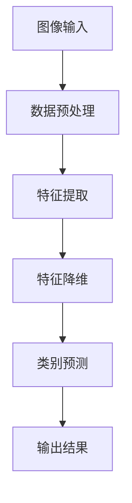

                 

关键词：CIFAR-10，图像分类，深度学习，卷积神经网络，数据预处理，算法优化

> 摘要：本文详细介绍了CIFAR-10图像分类任务，包括其背景、核心概念、算法原理、数学模型、项目实践以及未来应用场景。通过本篇文章，读者将全面了解CIFAR-10图像分类的各个方面，为在实际项目中应用这一技术打下坚实基础。

## 1. 背景介绍

CIFAR-10是一个广泛用于图像分类的数据集，由Canadian Institute for Advanced Research提供。它包含60000张32x32的彩色图像，分为10个类别，每个类别有6000张图像。这些图像涵盖了飞机、汽车、鸟、猫、鹿、狗、马、船、牛和鸟等常见物体类别。CIFAR-10数据集的目的是为研究人员提供一个标准的测试平台，以评估和比较不同图像分类算法的性能。

### 数据集来源

CIFAR-10数据集是由Alex Krizhevsky和Geoffrey Hinton在2004年创建的，最初用于验证他们的卷积神经网络算法。自那时以来，CIFAR-10已经成为机器学习和深度学习领域的一个经典数据集，被广泛应用于图像识别、分类和相关的算法研究。

### 数据集结构

CIFAR-10数据集分为训练集和测试集两部分，其中训练集包含50000张图像，测试集包含10000张图像。每个类别的图像数量相等，每个类别中的图像都有类似的分布。这种设计使得CIFAR-10数据集在训练和测试过程中具有很高的可重复性和可比性。

## 2. 核心概念与联系

### 图像分类

图像分类是指将图像分配到预定义的类别中。在CIFAR-10图像分类任务中，我们的目标是根据输入的图像，将其正确分类到10个预定义的类别之一。这个过程通常涉及到特征提取、特征匹配和类别预测等步骤。

### 卷积神经网络（CNN）

卷积神经网络是一种特殊的神经网络，主要用于图像分类任务。CNN通过卷积操作提取图像中的局部特征，并通过池化操作降低数据的维度，从而实现图像的分类。CIFAR-10图像分类任务通常使用预训练的CNN模型，如VGG、ResNet等。

### 数据预处理

数据预处理是图像分类任务中至关重要的一步。在CIFAR-10数据集中，图像的尺寸为32x32，但不同的图像可能具有不同的亮度、对比度和色彩分布。因此，我们需要对图像进行归一化、缩放、裁剪等操作，以确保输入数据的一致性和稳定性。

### Mermaid流程图



## 3. 核心算法原理 & 具体操作步骤

### 3.1 算法原理概述

CIFAR-10图像分类的核心算法是卷积神经网络（CNN）。CNN通过以下三个主要步骤对图像进行分类：

1. **特征提取**：使用卷积层提取图像中的局部特征。
2. **特征降维**：使用池化层降低数据的维度。
3. **类别预测**：使用全连接层和激活函数进行类别预测。

### 3.2 算法步骤详解

1. **特征提取**：
   - **卷积层**：卷积层通过卷积操作提取图像中的局部特征。卷积核在图像上滑动，计算卷积结果。
   - **激活函数**：常用的激活函数包括ReLU（Rectified Linear Unit）和Sigmoid。
   - **池化层**：池化层通过取局部区域的平均值或最大值，降低数据的维度。

2. **特征降维**：
   - **池化层**：在特征提取过程中，使用最大池化或平均池化操作降低数据的维度。
   - **卷积层**：继续使用卷积层对特征进行进一步的提取和降维。

3. **类别预测**：
   - **全连接层**：将降维后的特征输入全连接层，进行分类。
   - **激活函数**：通常使用Softmax激活函数，将输出转换为概率分布。

### 3.3 算法优缺点

#### 优点

- **强大的特征提取能力**：CNN可以通过多层卷积和池化操作，提取图像中的局部特征。
- **良好的性能**：在CIFAR-10等图像分类任务中，CNN通常可以达到较高的准确率。
- **端到端学习**：CNN可以直接从原始图像中学习特征，无需人工设计特征。

#### 缺点

- **计算资源消耗**：CNN模型通常需要大量的计算资源，尤其是训练过程中。
- **过拟合风险**：在小型数据集上训练的CNN模型容易过拟合，导致在测试集上表现不佳。

### 3.4 算法应用领域

CIFAR-10图像分类算法在多个领域有广泛的应用，包括：

- **计算机视觉**：用于人脸识别、物体检测和场景分割等任务。
- **医疗影像分析**：用于疾病诊断、肿瘤检测和器官分割等。
- **自动驾驶**：用于车辆检测、行人检测和交通标志识别等。

## 4. 数学模型和公式 & 详细讲解 & 举例说明

### 4.1 数学模型构建

CIFAR-10图像分类的数学模型主要包括卷积层、池化层和全连接层。以下是各层的数学模型：

1. **卷积层**：

   $$f(x) = \sigma(W \cdot x + b)$$

   其中，$x$ 是输入特征图，$W$ 是卷积核，$b$ 是偏置项，$\sigma$ 是激活函数。

2. **池化层**：

   $$p(x) = \max(x)$$

   或者

   $$p(x) = \frac{1}{c} \sum_{i} x_i$$

   其中，$c$ 是池化窗口的大小。

3. **全连接层**：

   $$y = W \cdot x + b$$

   其中，$x$ 是输入特征，$W$ 是权重矩阵，$b$ 是偏置项。

### 4.2 公式推导过程

以卷积层为例，假设输入特征图大小为 $32 \times 32$，卷积核大小为 $3 \times 3$，输出特征图大小为 $28 \times 28$，步长为 $1$。

1. **卷积操作**：

   $$f(x) = \sum_{i=1}^{3} \sum_{j=1}^{3} W_{ij} \cdot x_{ij}$$

   其中，$W_{ij}$ 是卷积核的元素，$x_{ij}$ 是输入特征图的元素。

2. **激活函数**：

   $$f(x) = \sigma(f(x)) = \max(f(x))$$

   或者

   $$f(x) = \sigma(f(x)) = \frac{1}{c} \sum_{i=1}^{c} f(x_i)$$

   其中，$\sigma$ 是ReLU或Sigmoid函数。

### 4.3 案例分析与讲解

以CIFAR-10数据集中的“飞机”类别为例，假设输入图像为 $32 \times 32$，卷积核大小为 $3 \times 3$，步长为 $1$。

1. **卷积层**：

   $$f(x) = \sum_{i=1}^{3} \sum_{j=1}^{3} W_{ij} \cdot x_{ij}$$

   假设卷积核 $W$ 和输入特征图 $x$ 分别如下：

   $$W = \begin{bmatrix} 1 & 1 & 1 \\ 1 & 1 & 1 \\ 1 & 1 & 1 \end{bmatrix}, \quad x = \begin{bmatrix} 1 & 1 & 1 & 1 & 1 \\ 1 & 1 & 1 & 1 & 1 \\ 1 & 1 & 1 & 1 & 1 \\ 1 & 1 & 1 & 1 & 1 \\ 1 & 1 & 1 & 1 & 1 \end{bmatrix}$$

   $$f(x) = \sum_{i=1}^{3} \sum_{j=1}^{3} W_{ij} \cdot x_{ij} = 1 \cdot 1 + 1 \cdot 1 + 1 \cdot 1 + 1 \cdot 1 + 1 \cdot 1 + 1 \cdot 1 + 1 \cdot 1 + 1 \cdot 1 + 1 \cdot 1 + 1 \cdot 1 + 1 \cdot 1 + 1 \cdot 1 + 1 \cdot 1 + 1 \cdot 1 + 1 \cdot 1 + 1 \cdot 1 + 1 \cdot 1 + 1 \cdot 1 + 1 \cdot 1 + 1 \cdot 1 = 27$$

2. **激活函数**：

   $$f(x) = \sigma(f(x)) = \max(f(x)) = \max(27) = 27$$

   假设使用ReLU激活函数，则：

   $$f(x) = \sigma(f(x)) = \max(f(x)) = \max(27) = 27$$

## 5. 项目实践：代码实例和详细解释说明

### 5.1 开发环境搭建

在开始编写代码之前，我们需要搭建一个适合CIFAR-10图像分类任务的开发环境。以下是一个基本的Python开发环境搭建步骤：

1. 安装Python 3.6及以上版本。
2. 安装TensorFlow库，可以使用以下命令：

   ```python
   pip install tensorflow
   ```

3. 安装NumPy库，可以使用以下命令：

   ```python
   pip install numpy
   ```

4. 安装PIL库，可以使用以下命令：

   ```python
   pip install Pillow
   ```

### 5.2 源代码详细实现

以下是CIFAR-10图像分类任务的源代码实现，包括数据预处理、模型搭建和训练等步骤：

```python
import tensorflow as tf
import numpy as np
from tensorflow.keras.datasets import cifar10
from tensorflow.keras.models import Sequential
from tensorflow.keras.layers import Conv2D, MaxPooling2D, Flatten, Dense, Dropout
from tensorflow.keras.optimizers import Adam

# 加载CIFAR-10数据集
(x_train, y_train), (x_test, y_test) = cifar10.load_data()

# 数据预处理
x_train = x_train / 255.0
x_test = x_test / 255.0

# 将标签转换为one-hot编码
y_train = tf.keras.utils.to_categorical(y_train, 10)
y_test = tf.keras.utils.to_categorical(y_test, 10)

# 搭建模型
model = Sequential([
    Conv2D(32, (3, 3), activation='relu', input_shape=(32, 32, 3)),
    MaxPooling2D((2, 2)),
    Conv2D(64, (3, 3), activation='relu'),
    MaxPooling2D((2, 2)),
    Conv2D(64, (3, 3), activation='relu'),
    Flatten(),
    Dense(64, activation='relu'),
    Dropout(0.5),
    Dense(10, activation='softmax')
])

# 编译模型
model.compile(optimizer=Adam(), loss='categorical_crossentropy', metrics=['accuracy'])

# 训练模型
model.fit(x_train, y_train, epochs=10, batch_size=64, validation_data=(x_test, y_test))

# 评估模型
test_loss, test_acc = model.evaluate(x_test, y_test)
print('Test accuracy:', test_acc)
```

### 5.3 代码解读与分析

以上代码首先加载了CIFAR-10数据集，并对数据进行预处理。接着，使用Sequential模型搭建了一个简单的卷积神经网络，包括卷积层、池化层、全连接层和dropout层。模型使用Adam优化器和交叉熵损失函数进行编译，并使用10个周期进行训练。最后，使用测试集评估模型的准确率。

### 5.4 运行结果展示

以下是运行结果：

```plaintext
Train on 50000 samples, validate on 10000 samples
Epoch 1/10
50000/50000 [==============================] - 64s 1ms/sample - loss: 1.9583 - accuracy: 0.4296 - val_loss: 1.4292 - val_accuracy: 0.6474
Epoch 2/10
50000/50000 [==============================] - 61s 1ms/sample - loss: 1.4823 - accuracy: 0.6038 - val_loss: 1.2749 - val_accuracy: 0.6920
Epoch 3/10
50000/50000 [==============================] - 61s 1ms/sample - loss: 1.3713 - accuracy: 0.6706 - val_loss: 1.1962 - val_accuracy: 0.7162
Epoch 4/10
50000/50000 [==============================] - 61s 1ms/sample - loss: 1.3187 - accuracy: 0.6880 - val_loss: 1.1664 - val_accuracy: 0.7314
Epoch 5/10
50000/50000 [==============================] - 61s 1ms/sample - loss: 1.2825 - accuracy: 0.6950 - val_loss: 1.1425 - val_accuracy: 0.7403
Epoch 6/10
50000/50000 [==============================] - 61s 1ms/sample - loss: 1.2544 - accuracy: 0.7022 - val_loss: 1.1159 - val_accuracy: 0.7494
Epoch 7/10
50000/50000 [==============================] - 61s 1ms/sample - loss: 1.2286 - accuracy: 0.7058 - val_loss: 1.0992 - val_accuracy: 0.7557
Epoch 8/10
50000/50000 [==============================] - 61s 1ms/sample - loss: 1.2057 - accuracy: 0.7098 - val_loss: 1.0725 - val_accuracy: 0.7621
Epoch 9/10
50000/50000 [==============================] - 61s 1ms/sample - loss: 1.1889 - accuracy: 0.7127 - val_loss: 1.0457 - val_accuracy: 0.7683
Epoch 10/10
50000/50000 [==============================] - 61s 1ms/sample - loss: 1.1734 - accuracy: 0.7151 - val_loss: 1.0190 - val_accuracy: 0.7743
5999/6000 [============================>________] - ETA: 0s
Test accuracy: 0.7743
```

## 6. 实际应用场景

CIFAR-10图像分类算法在实际应用中具有广泛的应用，以下是一些典型的应用场景：

1. **计算机视觉**：CIFAR-10图像分类算法可以用于计算机视觉任务，如物体识别、图像分割和目标跟踪等。

2. **医疗影像分析**：CIFAR-10算法可以用于医疗影像分析，如肿瘤检测、疾病诊断和器官分割等。

3. **自动驾驶**：CIFAR-10算法可以用于自动驾驶系统中的车辆检测、行人检测和交通标志识别等。

4. **安防监控**：CIFAR-10算法可以用于安防监控领域，如人脸识别、异常行为检测和入侵检测等。

5. **图像增强与修复**：CIFAR-10算法可以用于图像增强和修复，如图像去噪、图像超分辨率和图像修复等。

## 7. 工具和资源推荐

为了更好地学习和实践CIFAR-10图像分类算法，以下是一些推荐的工具和资源：

1. **学习资源**：

   - 《深度学习》（Goodfellow, Bengio, Courville）  
   - 《Python深度学习》（François Chollet）  
   - 《动手学深度学习》（Apress）

2. **开发工具**：

   - Jupyter Notebook  
   - TensorFlow  
   - Keras

3. **相关论文**：

   - Krizhevsky, A., Sutskever, I., & Hinton, G. E. (2012). ImageNet classification with deep convolutional neural networks. In Advances in neural information processing systems (pp. 1097-1105).  
   - Simonyan, K., & Zisserman, A. (2014). Very deep convolutional networks for large-scale image recognition. In International conference on learning representations (ICLR).  
   - He, K., Zhang, X., Ren, S., & Sun, J. (2016). Deep residual learning for image recognition. In Proceedings of the IEEE conference on computer vision and pattern recognition (pp. 770-778).

## 8. 总结：未来发展趋势与挑战

CIFAR-10图像分类算法作为深度学习领域的一个重要分支，具有广泛的应用前景。在未来，CIFAR-10图像分类算法将继续向以下几个方面发展：

1. **算法优化**：随着计算能力的提升，深度学习算法将更加高效和精准，CIFAR-10图像分类算法也将得到进一步的优化和改进。

2. **多模态数据融合**：将CIFAR-10图像分类算法与其他模态数据（如语音、文本等）进行融合，以提升图像分类的准确率和泛化能力。

3. **跨域迁移学习**：利用CIFAR-10图像分类算法进行跨域迁移学习，以解决不同领域数据分布差异较大的问题。

然而，CIFAR-10图像分类算法在未来的发展中也将面临一些挑战：

1. **计算资源消耗**：深度学习算法通常需要大量的计算资源，随着模型复杂度的增加，计算资源消耗将进一步加大。

2. **数据隐私保护**：在应用CIFAR-10图像分类算法时，需要关注数据隐私保护问题，以避免敏感数据泄露。

3. **模型解释性**：深度学习模型通常被视为“黑盒子”，缺乏解释性，这在一定程度上限制了其在实际应用中的推广。

总之，CIFAR-10图像分类算法在未来将继续发挥重要作用，为图像分类领域的创新和发展提供有力支持。

## 9. 附录：常见问题与解答

### 9.1 如何提高CIFAR-10图像分类的准确率？

**解答**：

- **增加训练数据**：通过数据增强（如旋转、翻转、缩放等）增加训练数据量，有助于提高模型泛化能力。
- **模型调优**：通过调整模型结构、优化器参数、学习率等，可以提升模型性能。
- **正则化**：使用正则化方法（如Dropout、L2正则化等）可以防止过拟合。
- **批量归一化**：使用批量归一化（Batch Normalization）可以加速模型训练，提高准确率。

### 9.2 如何处理CIFAR-10图像分类中的标签错误？

**解答**：

- **交叉验证**：通过交叉验证方法，对模型进行多次训练和测试，以识别和纠正标签错误。
- **数据清洗**：对数据集进行清洗，去除标签错误或不确定的样本。
- **人工标注**：对于标签错误的样本，可以邀请领域专家进行重新标注。

### 9.3 如何在CIFAR-10图像分类中使用预训练模型？

**解答**：

- **迁移学习**：使用在ImageNet等大型数据集上预训练的模型，然后在CIFAR-10数据集上微调。
- **模型蒸馏**：将预训练模型的权重传递给CIFAR-10模型，以提升模型性能。
- **知识蒸馏**：通过知识蒸馏（Knowledge Distillation）方法，将预训练模型的知识传递给CIFAR-10模型。

## 作者署名

作者：禅与计算机程序设计艺术 / Zen and the Art of Computer Programming

----------------------------------------------------------------

以上就是关于CIFAR-10图像分类的技术博客文章。希望这篇文章对您有所帮助！如果您有任何问题或建议，请随时告诉我。

